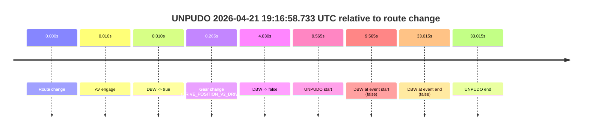
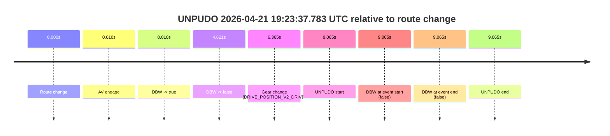
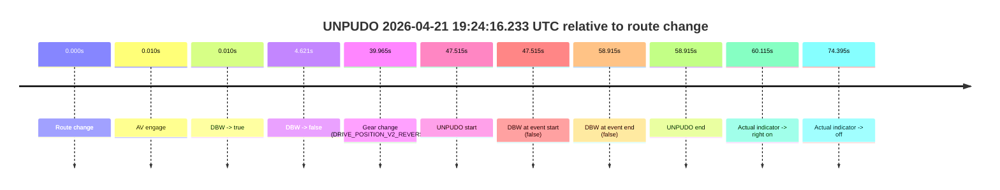
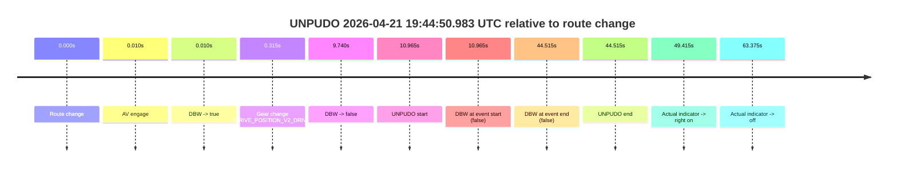

# Run Report: fme10011/2026-04-21--19-09-04--gen2-av-baa6b76c-60b2-486c-a0ca-88d62a3066c4

| Field | Value |
|---|---|
| Run ID | `fme10011/2026-04-21--19-09-04--gen2-av-baa6b76c-60b2-486c-a0ca-88d62a3066c4` |
| Date | `2026-04-21` |
| Model(s) | `pink-manta-ray-smooth` |
| Author | `guy.geva` |
| Event count | `4` |

## unpudo 2026-04-21 19:16:58.733 UTC

| Field | Value |
|---|---|
| Model | `pink-manta-ray-smooth` |
| Author | `guy.geva` |
| Run ID | `fme10011/2026-04-21--19-09-04--gen2-av-baa6b76c-60b2-486c-a0ca-88d62a3066c4` |
| Date | `2026-04-21` |
| Time (UTC) | `19:16:58.733` |
| Event type | `unpudo` |
| Disengagement type | `none observed` |
| Route change | `found` |
| Console | [run](https://console.sso.wayve.ai/run/fme10011/2026-04-21--19-09-04--gen2-av-baa6b76c-60b2-486c-a0ca-88d62a3066c4?id=&time-unixus=1776799018733319) |
| Foxglove | [segment](https://app.foxglove.dev/wayve-on-prem/p/prj_0dX18KZdVHg1fmmI/view?ds=foxglove-stream&ds.deviceName=fme10011&ds.start=2026-04-21T19%3A16%3A39.168238Z&ds.end=2026-04-21T19%3A17%3A32.183302Z&layoutId=lay_0e7VD4WIKDQGU73Y&time=2026-04-21T19%3A16%3A58.733319Z) |

### Event card: fail

- Fail: the credited unpudo does not stay AV-owned. The event window starts with DBW false, and the maneuver outcome lands outside a clean AV-owned segment.

| Event | Time (UTC) | Delta from route change |
|---|---:|---:|
| Route change | 2026-04-21 19:16:49.168 | `0.000s` |
| AV engage | 2026-04-21 19:16:49.178 | `0.010s` |
| DBW -> true | 2026-04-21 19:16:49.178 | `0.010s` |
| Gear change (DRIVE_POSITION_V2_DRIVE) | 2026-04-21 19:16:49.433 | `0.265s` |
| DBW -> false | 2026-04-21 19:16:53.998 | `4.830s` |
| UNPUDO start | 2026-04-21 19:16:58.733 | `9.565s` |
| DBW at event start (false) | 2026-04-21 19:16:58.733 | `9.565s` |
| DBW at event end (false) | 2026-04-21 19:17:22.183 | `33.015s` |
| UNPUDO end | 2026-04-21 19:17:22.183 | `33.015s` |

| Metric | Value |
|---|---|
| Outcome | `fail` |
| Effective failure type | `not_av_owned` |
| Route change status | `found` |
| DBW at event start | `false` |
| DBW at event end | `false` |
| Predicted gear at AV start | `DRIVE_POSITION_V2_PARK` |
| Actual gear at AV start | `DRIVE_POSITION_V2_PARK` |
| Predicted gear at event start | `DRIVE_POSITION_V2_DRIVE` |
| Actual gear at event start | `DRIVE_POSITION_V2_DRIVE` |
| Planned indicator direction | `INDICATORS_STATE_V2_OFF` |
| Controller indicator direction | `INDICATORS_STATE_V2_OFF` |
| Actual indicator direction | `INDICATORS_STATE_V2_OFF` |
| Actual indicator at maneuver end | `INDICATORS_STATE_V2_OFF` |
| Driver accel help in AV | `false` |
| Driver accel help timestamp | `n/a` |
| Max accel pedal pct in AV | `0.0%` |
| Max brake pedal pct in AV | `30.0%` |
| Max speed mps in AV | `0.000` |
| Success timing baseline | `route change` |
| Route -> AV | `0.010s` |
| AV -> event start | `9.555s` |
| AV -> first motion | `n/a` |
| Success baseline -> event start | `9.565s` |
| Success baseline -> first motion | `n/a` |
| AV duration before disengagement | `4.821s` |
| Trajectory waypoint count | `36` |
| Driving-plan step count | `11` |

The scored portion starts from the AV-owned window, not from the pre-AV setup. Route-change search in the stopped pre-event segment was `found`, with the baseline therefore set to route change. At the event anchor the model predicts `DRIVE_POSITION_V2_DRIVE` and the actual gear is `DRIVE_POSITION_V2_DRIVE`. The effective model outcome is `fail` because `not_av_owned.`

### Resolution

| Field | Value |
|---|---|
| Final outcome | `fail` |
| Do we agree with this label? | `yes` |
| Source disengagement type | `none observed` |
| Resolved effective failure type | `not_av_owned` |
| Confidence | `high` |

## unpudo 2026-04-21 19:23:37.783 UTC

| Field | Value |
|---|---|
| Model | `pink-manta-ray-smooth` |
| Author | `guy.geva` |
| Run ID | `fme10011/2026-04-21--19-09-04--gen2-av-baa6b76c-60b2-486c-a0ca-88d62a3066c4` |
| Date | `2026-04-21` |
| Time (UTC) | `19:23:37.783` |
| Event type | `unpudo` |
| Disengagement type | `none observed` |
| Route change | `found` |
| Console | [run](https://console.sso.wayve.ai/run/fme10011/2026-04-21--19-09-04--gen2-av-baa6b76c-60b2-486c-a0ca-88d62a3066c4?id=&time-unixus=1776799417783310) |
| Foxglove | [segment](https://app.foxglove.dev/wayve-on-prem/p/prj_0dX18KZdVHg1fmmI/view?ds=foxglove-stream&ds.deviceName=fme10011&ds.start=2026-04-21T19%3A23%3A18.718253Z&ds.end=2026-04-21T19%3A23%3A47.783310Z&layoutId=lay_0e7VD4WIKDQGU73Y&time=2026-04-21T19%3A23%3A37.783310Z) |

### Event card: fail

- Fail: the credited unpudo does not stay AV-owned. The event window starts with DBW false, and the maneuver outcome lands outside a clean AV-owned segment.

| Event | Time (UTC) | Delta from route change |
|---|---:|---:|
| Route change | 2026-04-21 19:23:28.718 | `0.000s` |
| AV engage | 2026-04-21 19:23:28.728 | `0.010s` |
| DBW -> true | 2026-04-21 19:23:28.728 | `0.010s` |
| DBW -> false | 2026-04-21 19:23:33.338 | `4.621s` |
| Gear change (DRIVE_POSITION_V2_DRIVE) | 2026-04-21 19:23:35.083 | `6.365s` |
| UNPUDO start | 2026-04-21 19:23:37.783 | `9.065s` |
| DBW at event start (false) | 2026-04-21 19:23:37.783 | `9.065s` |
| DBW at event end (false) | 2026-04-21 19:23:37.783 | `9.065s` |
| UNPUDO end | 2026-04-21 19:23:37.783 | `9.065s` |

| Metric | Value |
|---|---|
| Outcome | `fail` |
| Effective failure type | `not_av_owned` |
| Route change status | `found` |
| DBW at event start | `false` |
| DBW at event end | `false` |
| Predicted gear at AV start | `DRIVE_POSITION_V2_PARK` |
| Actual gear at AV start | `DRIVE_POSITION_V2_PARK` |
| Predicted gear at event start | `DRIVE_POSITION_V2_DRIVE` |
| Actual gear at event start | `DRIVE_POSITION_V2_DRIVE` |
| Planned indicator direction | `INDICATORS_STATE_V2_OFF` |
| Controller indicator direction | `INDICATORS_STATE_V2_OFF` |
| Actual indicator direction | `INDICATORS_STATE_V2_OFF` |
| Actual indicator at maneuver end | `INDICATORS_STATE_V2_OFF` |
| Driver accel help in AV | `false` |
| Driver accel help timestamp | `n/a` |
| Max accel pedal pct in AV | `0.0%` |
| Max brake pedal pct in AV | `8.0%` |
| Max speed mps in AV | `0.000` |
| Success timing baseline | `route change` |
| Route -> AV | `0.010s` |
| AV -> event start | `9.055s` |
| AV -> first motion | `n/a` |
| Success baseline -> event start | `9.065s` |
| Success baseline -> first motion | `n/a` |
| AV duration before disengagement | `4.611s` |
| Trajectory waypoint count | `36` |
| Driving-plan step count | `11` |

The scored portion starts from the AV-owned window, not from the pre-AV setup. Route-change search in the stopped pre-event segment was `found`, with the baseline therefore set to route change. At the event anchor the model predicts `DRIVE_POSITION_V2_DRIVE` and the actual gear is `DRIVE_POSITION_V2_DRIVE`. The effective model outcome is `fail` because `not_av_owned.`

### Resolution

| Field | Value |
|---|---|
| Final outcome | `fail` |
| Do we agree with this label? | `yes` |
| Source disengagement type | `none observed` |
| Resolved effective failure type | `not_av_owned` |
| Confidence | `high` |

## unpudo 2026-04-21 19:24:16.233 UTC

| Field | Value |
|---|---|
| Model | `pink-manta-ray-smooth` |
| Author | `guy.geva` |
| Run ID | `fme10011/2026-04-21--19-09-04--gen2-av-baa6b76c-60b2-486c-a0ca-88d62a3066c4` |
| Date | `2026-04-21` |
| Time (UTC) | `19:24:16.233` |
| Event type | `unpudo` |
| Disengagement type | `none observed` |
| Route change | `found` |
| Console | [run](https://console.sso.wayve.ai/run/fme10011/2026-04-21--19-09-04--gen2-av-baa6b76c-60b2-486c-a0ca-88d62a3066c4?id=&time-unixus=1776799456233311) |
| Foxglove | [segment](https://app.foxglove.dev/wayve-on-prem/p/prj_0dX18KZdVHg1fmmI/view?ds=foxglove-stream&ds.deviceName=fme10011&ds.start=2026-04-21T19%3A23%3A18.718253Z&ds.end=2026-04-21T19%3A24%3A37.633314Z&layoutId=lay_0e7VD4WIKDQGU73Y&time=2026-04-21T19%3A24%3A16.233311Z) |

### Event card: fail

- Fail: the credited unpudo does not stay AV-owned. The event window starts with DBW false, and the maneuver outcome lands outside a clean AV-owned segment.

| Event | Time (UTC) | Delta from route change |
|---|---:|---:|
| Route change | 2026-04-21 19:23:28.718 | `0.000s` |
| AV engage | 2026-04-21 19:23:28.728 | `0.010s` |
| DBW -> true | 2026-04-21 19:23:28.728 | `0.010s` |
| DBW -> false | 2026-04-21 19:23:33.338 | `4.621s` |
| Gear change (DRIVE_POSITION_V2_REVERSE) | 2026-04-21 19:24:08.683 | `39.965s` |
| UNPUDO start | 2026-04-21 19:24:16.233 | `47.515s` |
| DBW at event start (false) | 2026-04-21 19:24:16.233 | `47.515s` |
| DBW at event end (false) | 2026-04-21 19:24:27.633 | `58.915s` |
| UNPUDO end | 2026-04-21 19:24:27.633 | `58.915s` |
| Actual indicator -> right on | 2026-04-21 19:24:28.832 | `60.115s` |
| Actual indicator -> off | 2026-04-21 19:24:43.112 | `74.395s` |

| Metric | Value |
|---|---|
| Outcome | `fail` |
| Effective failure type | `not_av_owned` |
| Route change status | `found` |
| DBW at event start | `false` |
| DBW at event end | `false` |
| Predicted gear at AV start | `DRIVE_POSITION_V2_PARK` |
| Actual gear at AV start | `DRIVE_POSITION_V2_PARK` |
| Predicted gear at event start | `DRIVE_POSITION_V2_REVERSE` |
| Actual gear at event start | `DRIVE_POSITION_V2_REVERSE` |
| Planned indicator direction | `INDICATORS_STATE_V2_OFF` |
| Controller indicator direction | `INDICATORS_STATE_V2_OFF` |
| Actual indicator direction | `INDICATORS_STATE_V2_OFF` |
| Actual indicator at maneuver end | `INDICATORS_STATE_V2_OFF` |
| Driver accel help in AV | `false` |
| Driver accel help timestamp | `n/a` |
| Max accel pedal pct in AV | `0.0%` |
| Max brake pedal pct in AV | `8.0%` |
| Max speed mps in AV | `0.000` |
| Success timing baseline | `route change` |
| Route -> AV | `0.010s` |
| AV -> event start | `47.505s` |
| AV -> first motion | `n/a` |
| Success baseline -> event start | `47.515s` |
| Success baseline -> first motion | `n/a` |
| AV duration before disengagement | `4.611s` |
| Trajectory waypoint count | `37` |
| Driving-plan step count | `11` |

The scored portion starts from the AV-owned window, not from the pre-AV setup. Route-change search in the stopped pre-event segment was `found`, with the baseline therefore set to route change. At the event anchor the model predicts `DRIVE_POSITION_V2_REVERSE` and the actual gear is `DRIVE_POSITION_V2_REVERSE`. The effective model outcome is `fail` because `not_av_owned.`

### Resolution

| Field | Value |
|---|---|
| Final outcome | `fail` |
| Do we agree with this label? | `yes` |
| Source disengagement type | `none observed` |
| Resolved effective failure type | `not_av_owned` |
| Confidence | `high` |

## unpudo 2026-04-21 19:44:50.983 UTC

| Field | Value |
|---|---|
| Model | `pink-manta-ray-smooth` |
| Author | `guy.geva` |
| Run ID | `fme10011/2026-04-21--19-09-04--gen2-av-baa6b76c-60b2-486c-a0ca-88d62a3066c4` |
| Date | `2026-04-21` |
| Time (UTC) | `19:44:50.983` |
| Event type | `unpudo` |
| Disengagement type | `none observed` |
| Route change | `found` |
| Console | [run](https://console.sso.wayve.ai/run/fme10011/2026-04-21--19-09-04--gen2-av-baa6b76c-60b2-486c-a0ca-88d62a3066c4?id=&time-unixus=1776800690983306) |
| Foxglove | [segment](https://app.foxglove.dev/wayve-on-prem/p/prj_0dX18KZdVHg1fmmI/view?ds=foxglove-stream&ds.deviceName=fme10011&ds.start=2026-04-21T19%3A44%3A30.018282Z&ds.end=2026-04-21T19%3A45%3A34.533300Z&layoutId=lay_0e7VD4WIKDQGU73Y&time=2026-04-21T19%3A44%3A50.983306Z) |

### Event card: fail

- Fail: the credited unpudo does not stay AV-owned. The event window starts with DBW false, and the maneuver outcome lands outside a clean AV-owned segment.

| Event | Time (UTC) | Delta from route change |
|---|---:|---:|
| Route change | 2026-04-21 19:44:40.018 | `0.000s` |
| AV engage | 2026-04-21 19:44:40.028 | `0.010s` |
| DBW -> true | 2026-04-21 19:44:40.028 | `0.010s` |
| Gear change (DRIVE_POSITION_V2_DRIVE) | 2026-04-21 19:44:40.333 | `0.315s` |
| DBW -> false | 2026-04-21 19:44:49.758 | `9.740s` |
| UNPUDO start | 2026-04-21 19:44:50.983 | `10.965s` |
| DBW at event start (false) | 2026-04-21 19:44:50.983 | `10.965s` |
| DBW at event end (false) | 2026-04-21 19:45:24.533 | `44.515s` |
| UNPUDO end | 2026-04-21 19:45:24.533 | `44.515s` |
| Actual indicator -> right on | 2026-04-21 19:45:29.433 | `49.415s` |
| Actual indicator -> off | 2026-04-21 19:45:43.393 | `63.375s` |

| Metric | Value |
|---|---|
| Outcome | `fail` |
| Effective failure type | `not_av_owned` |
| Route change status | `found` |
| DBW at event start | `false` |
| DBW at event end | `false` |
| Predicted gear at AV start | `DRIVE_POSITION_V2_PARK` |
| Actual gear at AV start | `DRIVE_POSITION_V2_PARK` |
| Predicted gear at event start | `DRIVE_POSITION_V2_DRIVE` |
| Actual gear at event start | `DRIVE_POSITION_V2_DRIVE` |
| Planned indicator direction | `INDICATORS_STATE_V2_OFF` |
| Controller indicator direction | `INDICATORS_STATE_V2_OFF` |
| Actual indicator direction | `INDICATORS_STATE_V2_OFF` |
| Actual indicator at maneuver end | `INDICATORS_STATE_V2_OFF` |
| Driver accel help in AV | `false` |
| Driver accel help timestamp | `n/a` |
| Max accel pedal pct in AV | `0.0%` |
| Max brake pedal pct in AV | `8.0%` |
| Max speed mps in AV | `0.000` |
| Success timing baseline | `route change` |
| Route -> AV | `0.010s` |
| AV -> event start | `10.955s` |
| AV -> first motion | `n/a` |
| Success baseline -> event start | `10.965s` |
| Success baseline -> first motion | `n/a` |
| AV duration before disengagement | `9.731s` |
| Trajectory waypoint count | `36` |
| Driving-plan step count | `11` |

The scored portion starts from the AV-owned window, not from the pre-AV setup. Route-change search in the stopped pre-event segment was `found`, with the baseline therefore set to route change. At the event anchor the model predicts `DRIVE_POSITION_V2_DRIVE` and the actual gear is `DRIVE_POSITION_V2_DRIVE`. The effective model outcome is `fail` because `not_av_owned.`

### Resolution

| Field | Value |
|---|---|
| Final outcome | `fail` |
| Do we agree with this label? | `yes` |
| Source disengagement type | `none observed` |
| Resolved effective failure type | `not_av_owned` |
| Confidence | `high` |
