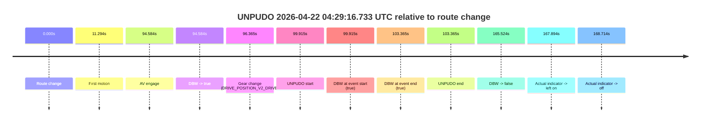
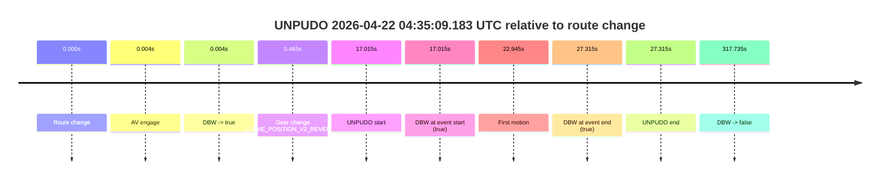
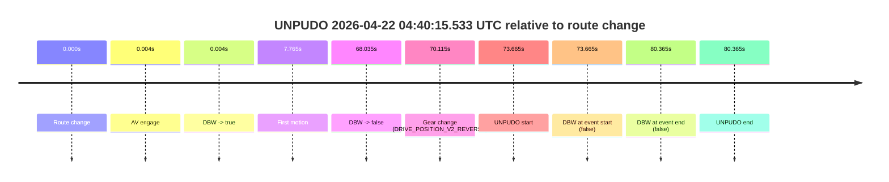
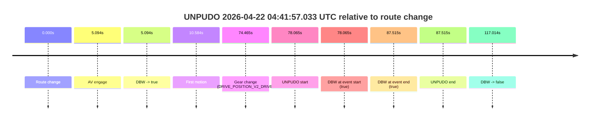
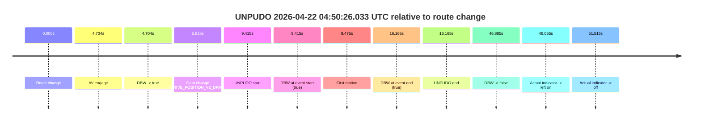
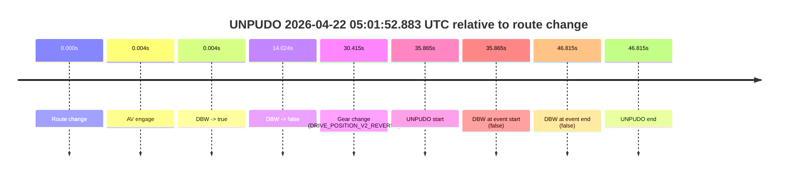
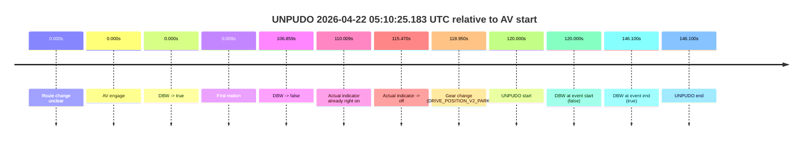
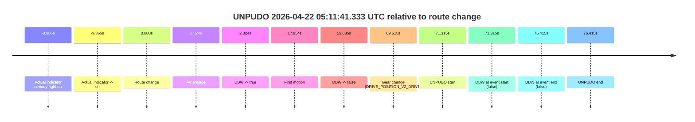
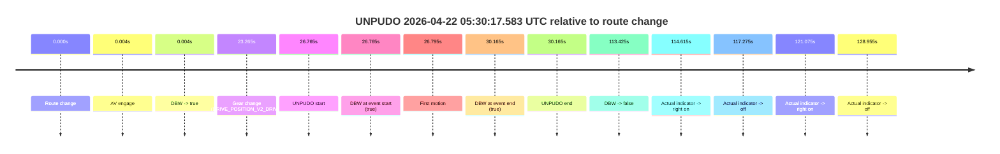

# Run Report: fme10011/2026-04-22--04-20-37--gen2-av-b4460b3d-0bcb-4cf5-b360-360dbd20362a

| Field | Value |
|---|---|
| Run ID | `fme10011/2026-04-22--04-20-37--gen2-av-b4460b3d-0bcb-4cf5-b360-360dbd20362a` |
| Date | `2026-04-22` |
| Model(s) | `eel-teal-outspoken` |
| Author | `zak` |
| Event count | `14` |

## unpudo 2026-04-22 04:29:16.733 UTC

| Field | Value |
|---|---|
| Model | `eel-teal-outspoken` |
| Author | `zak` |
| Run ID | `fme10011/2026-04-22--04-20-37--gen2-av-b4460b3d-0bcb-4cf5-b360-360dbd20362a` |
| Date | `2026-04-22` |
| Time (UTC) | `04:29:16.733` |
| Event type | `unpudo` |
| Disengagement type | `none observed` |
| Route change | `found` |
| Console | [run](https://console.sso.wayve.ai/run/fme10011/2026-04-22--04-20-37--gen2-av-b4460b3d-0bcb-4cf5-b360-360dbd20362a?id=&time-unixus=1776832156733296) |
| Foxglove | [segment](https://app.foxglove.dev/wayve-on-prem/p/prj_0dX18KZdVHg1fmmI/view?ds=foxglove-stream&ds.deviceName=fme10011&ds.start=2026-04-22T04%3A27%3A26.818514Z&ds.end=2026-04-22T04%3A30%3A32.342353Z&layoutId=lay_0e7VD4WIKDQGU73Y&time=2026-04-22T04%3A29%3A16.733296Z) |

### Event card: pass

- Pass: AV owns the credited unpudo from route change through the official unpudo window, the gear state is aligned at the anchor, and the vehicle moves without driver accelerator help in AV.

| Event | Time (UTC) | Delta from route change |
|---|---:|---:|
| Route change | 2026-04-22 04:27:36.818 | `0.000s` |
| First motion | 2026-04-22 04:27:48.112 | `11.294s` |
| AV engage | 2026-04-22 04:29:11.402 | `94.584s` |
| DBW -> true | 2026-04-22 04:29:11.402 | `94.584s` |
| Gear change (DRIVE_POSITION_V2_DRIVE) | 2026-04-22 04:29:13.183 | `96.365s` |
| UNPUDO start | 2026-04-22 04:29:16.733 | `99.915s` |
| DBW at event start (true) | 2026-04-22 04:29:16.733 | `99.915s` |
| DBW at event end (true) | 2026-04-22 04:29:20.183 | `103.365s` |
| UNPUDO end | 2026-04-22 04:29:20.183 | `103.365s` |
| DBW -> false | 2026-04-22 04:30:22.342 | `165.524s` |
| Actual indicator -> left on | 2026-04-22 04:30:24.712 | `167.894s` |
| Actual indicator -> off | 2026-04-22 04:30:25.532 | `168.714s` |

| Metric | Value |
|---|---|
| Outcome | `pass` |
| Effective failure type | `none` |
| Route change status | `found` |
| DBW at event start | `true` |
| DBW at event end | `true` |
| Predicted gear at AV start | `DRIVE_POSITION_V2_PARK` |
| Actual gear at AV start | `DRIVE_POSITION_V2_PARK` |
| Predicted gear at event start | `DRIVE_POSITION_V2_DRIVE` |
| Actual gear at event start | `DRIVE_POSITION_V2_DRIVE` |
| Planned indicator direction | `INDICATORS_STATE_V2_LEFT_ON` |
| Controller indicator direction | `INDICATORS_STATE_V2_LEFT_ON` |
| Actual indicator direction | `INDICATORS_STATE_V2_OFF` |
| Actual indicator at maneuver end | `INDICATORS_STATE_V2_OFF` |
| Driver accel help in AV | `false` |
| Driver accel help timestamp | `n/a` |
| Max accel pedal pct in AV | `0.0%` |
| Max brake pedal pct in AV | `8.0%` |
| Max speed mps in AV | `5.769` |
| Success timing baseline | `route change` |
| Route -> AV | `94.584s` |
| AV -> event start | `5.331s` |
| AV -> first motion | `-83.289s` |
| Success baseline -> event start | `99.915s` |
| Success baseline -> first motion | `11.294s` |
| AV duration before disengagement | `70.940s` |
| Trajectory waypoint count | `38` |
| Driving-plan step count | `11` |

The scored portion starts from the AV-owned window, not from the pre-AV setup. Route-change search in the stopped pre-event segment was `found`, with the baseline therefore set to route change. At the event anchor the model predicts `DRIVE_POSITION_V2_DRIVE` and the actual gear is `DRIVE_POSITION_V2_DRIVE`. The effective model outcome is `pass` because `the credited unpudo stays AV-owned through the official unpudo window.`

### Resolution

| Field | Value |
|---|---|
| Final outcome | `pass` |
| Do we agree with this label? | `yes` |
| Source disengagement type | `none observed` |
| Resolved effective failure type | `none` |
| Confidence | `high` |

## unpudo 2026-04-22 04:35:09.183 UTC

| Field | Value |
|---|---|
| Model | `eel-teal-outspoken` |
| Author | `zak` |
| Run ID | `fme10011/2026-04-22--04-20-37--gen2-av-b4460b3d-0bcb-4cf5-b360-360dbd20362a` |
| Date | `2026-04-22` |
| Time (UTC) | `04:35:09.183` |
| Event type | `unpudo` |
| Disengagement type | `none observed` |
| Route change | `found` |
| Console | [run](https://console.sso.wayve.ai/run/fme10011/2026-04-22--04-20-37--gen2-av-b4460b3d-0bcb-4cf5-b360-360dbd20362a?id=&time-unixus=1776832509183313) |
| Foxglove | [segment](https://app.foxglove.dev/wayve-on-prem/p/prj_0dX18KZdVHg1fmmI/view?ds=foxglove-stream&ds.deviceName=fme10011&ds.start=2026-04-22T04%3A34%3A42.168278Z&ds.end=2026-04-22T04%3A40%3A19.902844Z&layoutId=lay_0e7VD4WIKDQGU73Y&time=2026-04-22T04%3A35%3A09.183313Z) |

### Event card: pass

- Pass: AV owns the credited unpudo from route change through the official unpudo window, the gear state is aligned at the anchor, and the vehicle moves without driver accelerator help in AV.

| Event | Time (UTC) | Delta from route change |
|---|---:|---:|
| Route change | 2026-04-22 04:34:52.168 | `0.000s` |
| AV engage | 2026-04-22 04:34:52.172 | `0.004s` |
| DBW -> true | 2026-04-22 04:34:52.172 | `0.004s` |
| Gear change (DRIVE_POSITION_V2_REVERSE) | 2026-04-22 04:34:57.633 | `5.465s` |
| UNPUDO start | 2026-04-22 04:35:09.183 | `17.015s` |
| DBW at event start (true) | 2026-04-22 04:35:09.183 | `17.015s` |
| First motion | 2026-04-22 04:35:15.113 | `22.945s` |
| DBW at event end (true) | 2026-04-22 04:35:19.483 | `27.315s` |
| UNPUDO end | 2026-04-22 04:35:19.483 | `27.315s` |
| DBW -> false | 2026-04-22 04:40:09.902 | `317.735s` |

| Metric | Value |
|---|---|
| Outcome | `pass` |
| Effective failure type | `none` |
| Route change status | `found` |
| DBW at event start | `true` |
| DBW at event end | `true` |
| Predicted gear at AV start | `DRIVE_POSITION_V2_PARK` |
| Actual gear at AV start | `DRIVE_POSITION_V2_PARK` |
| Predicted gear at event start | `DRIVE_POSITION_V2_REVERSE` |
| Actual gear at event start | `DRIVE_POSITION_V2_REVERSE` |
| Planned indicator direction | `INDICATORS_STATE_V2_OFF` |
| Controller indicator direction | `INDICATORS_STATE_V2_OFF` |
| Actual indicator direction | `INDICATORS_STATE_V2_OFF` |
| Actual indicator at maneuver end | `INDICATORS_STATE_V2_OFF` |
| Driver accel help in AV | `false` |
| Driver accel help timestamp | `n/a` |
| Max accel pedal pct in AV | `0.0%` |
| Max brake pedal pct in AV | `21.5%` |
| Max speed mps in AV | `3.264` |
| Success timing baseline | `route change` |
| Route -> AV | `0.004s` |
| AV -> event start | `17.011s` |
| AV -> first motion | `22.941s` |
| Success baseline -> event start | `17.015s` |
| Success baseline -> first motion | `22.945s` |
| AV duration before disengagement | `317.731s` |
| Trajectory waypoint count | `37` |
| Driving-plan step count | `11` |

The scored portion starts from the AV-owned window, not from the pre-AV setup. Route-change search in the stopped pre-event segment was `found`, with the baseline therefore set to route change. At the event anchor the model predicts `DRIVE_POSITION_V2_REVERSE` and the actual gear is `DRIVE_POSITION_V2_REVERSE`. The effective model outcome is `pass` because `the credited unpudo stays AV-owned through the official unpudo window.`

### Resolution

| Field | Value |
|---|---|
| Final outcome | `pass` |
| Do we agree with this label? | `yes` |
| Source disengagement type | `none observed` |
| Resolved effective failure type | `none` |
| Confidence | `high` |

## unpudo 2026-04-22 04:39:09.583 UTC

| Field | Value |
|---|---|
| Model | `eel-teal-outspoken` |
| Author | `zak` |
| Run ID | `fme10011/2026-04-22--04-20-37--gen2-av-b4460b3d-0bcb-4cf5-b360-360dbd20362a` |
| Date | `2026-04-22` |
| Time (UTC) | `04:39:09.583` |
| Event type | `unpudo` |
| Disengagement type | `none observed` |
| Route change | `found` |
| Console | [run](https://console.sso.wayve.ai/run/fme10011/2026-04-22--04-20-37--gen2-av-b4460b3d-0bcb-4cf5-b360-360dbd20362a?id=&time-unixus=1776832749583302) |
| Foxglove | [segment](https://app.foxglove.dev/wayve-on-prem/p/prj_0dX18KZdVHg1fmmI/view?ds=foxglove-stream&ds.deviceName=fme10011&ds.start=2026-04-22T04%3A38%3A51.868255Z&ds.end=2026-04-22T04%3A40%3A19.902844Z&layoutId=lay_0e7VD4WIKDQGU73Y&time=2026-04-22T04%3A39%3A09.583302Z) |

### Event card: pass

- Pass: AV owns the credited unpudo from route change through the official unpudo window, the gear state is aligned at the anchor, and the vehicle moves without driver accelerator help in AV.

| Event | Time (UTC) | Delta from route change |
|---|---:|---:|
| Route change | 2026-04-22 04:39:01.868 | `0.000s` |
| AV engage | 2026-04-22 04:39:01.872 | `0.004s` |
| DBW -> true | 2026-04-22 04:39:01.872 | `0.004s` |
| Gear change (DRIVE_POSITION_V2_DRIVE) | 2026-04-22 04:39:06.033 | `4.165s` |
| UNPUDO start | 2026-04-22 04:39:09.583 | `7.715s` |
| DBW at event start (true) | 2026-04-22 04:39:09.583 | `7.715s` |
| First motion | 2026-04-22 04:39:09.633 | `7.765s` |
| DBW at event end (true) | 2026-04-22 04:39:13.333 | `11.465s` |
| UNPUDO end | 2026-04-22 04:39:13.333 | `11.465s` |
| DBW -> false | 2026-04-22 04:40:09.902 | `68.035s` |

| Metric | Value |
|---|---|
| Outcome | `pass` |
| Effective failure type | `none` |
| Route change status | `found` |
| DBW at event start | `true` |
| DBW at event end | `true` |
| Predicted gear at AV start | `DRIVE_POSITION_V2_PARK` |
| Actual gear at AV start | `DRIVE_POSITION_V2_PARK` |
| Predicted gear at event start | `DRIVE_POSITION_V2_DRIVE` |
| Actual gear at event start | `DRIVE_POSITION_V2_DRIVE` |
| Planned indicator direction | `INDICATORS_STATE_V2_LEFT_ON` |
| Controller indicator direction | `INDICATORS_STATE_V2_LEFT_ON` |
| Actual indicator direction | `INDICATORS_STATE_V2_OFF` |
| Actual indicator at maneuver end | `INDICATORS_STATE_V2_OFF` |
| Driver accel help in AV | `false` |
| Driver accel help timestamp | `n/a` |
| Max accel pedal pct in AV | `0.0%` |
| Max brake pedal pct in AV | `8.4%` |
| Max speed mps in AV | `3.983` |
| Success timing baseline | `route change` |
| Route -> AV | `0.004s` |
| AV -> event start | `7.711s` |
| AV -> first motion | `7.761s` |
| Success baseline -> event start | `7.715s` |
| Success baseline -> first motion | `7.765s` |
| AV duration before disengagement | `68.031s` |
| Trajectory waypoint count | `37` |
| Driving-plan step count | `11` |

The scored portion starts from the AV-owned window, not from the pre-AV setup. Route-change search in the stopped pre-event segment was `found`, with the baseline therefore set to route change. At the event anchor the model predicts `DRIVE_POSITION_V2_DRIVE` and the actual gear is `DRIVE_POSITION_V2_DRIVE`. The effective model outcome is `pass` because `the credited unpudo stays AV-owned through the official unpudo window.`

### Resolution

| Field | Value |
|---|---|
| Final outcome | `pass` |
| Do we agree with this label? | `yes` |
| Source disengagement type | `none observed` |
| Resolved effective failure type | `none` |
| Confidence | `high` |

## unpudo 2026-04-22 04:40:15.533 UTC

| Field | Value |
|---|---|
| Model | `eel-teal-outspoken` |
| Author | `zak` |
| Run ID | `fme10011/2026-04-22--04-20-37--gen2-av-b4460b3d-0bcb-4cf5-b360-360dbd20362a` |
| Date | `2026-04-22` |
| Time (UTC) | `04:40:15.533` |
| Event type | `unpudo` |
| Disengagement type | `late_turn` |
| Route change | `found` |
| Console | [run](https://console.sso.wayve.ai/run/fme10011/2026-04-22--04-20-37--gen2-av-b4460b3d-0bcb-4cf5-b360-360dbd20362a?id=&time-unixus=1776832815533305) |
| Foxglove | [segment](https://app.foxglove.dev/wayve-on-prem/p/prj_0dX18KZdVHg1fmmI/view?ds=foxglove-stream&ds.deviceName=fme10011&ds.start=2026-04-22T04%3A38%3A51.868255Z&ds.end=2026-04-22T04%3A40%3A32.233304Z&layoutId=lay_0e7VD4WIKDQGU73Y&time=2026-04-22T04%3A40%3A15.533305Z) |

### Event card: fail

- Fail: AV owns part of the segment, but the event still resolves as a model-performance failure under the AV-only scoring rule.

| Event | Time (UTC) | Delta from route change |
|---|---:|---:|
| Route change | 2026-04-22 04:39:01.868 | `0.000s` |
| AV engage | 2026-04-22 04:39:01.872 | `0.004s` |
| DBW -> true | 2026-04-22 04:39:01.872 | `0.004s` |
| First motion | 2026-04-22 04:39:09.633 | `7.765s` |
| DBW -> false | 2026-04-22 04:40:09.902 | `68.035s` |
| Gear change (DRIVE_POSITION_V2_REVERSE) | 2026-04-22 04:40:11.983 | `70.115s` |
| UNPUDO start | 2026-04-22 04:40:15.533 | `73.665s` |
| DBW at event start (false) | 2026-04-22 04:40:15.533 | `73.665s` |
| DBW at event end (false) | 2026-04-22 04:40:22.233 | `80.365s` |
| UNPUDO end | 2026-04-22 04:40:22.233 | `80.365s` |

| Metric | Value |
|---|---|
| Outcome | `fail` |
| Effective failure type | `late_turn` |
| Route change status | `found` |
| DBW at event start | `false` |
| DBW at event end | `false` |
| Predicted gear at AV start | `DRIVE_POSITION_V2_PARK` |
| Actual gear at AV start | `DRIVE_POSITION_V2_PARK` |
| Predicted gear at event start | `DRIVE_POSITION_V2_REVERSE` |
| Actual gear at event start | `DRIVE_POSITION_V2_REVERSE` |
| Planned indicator direction | `INDICATORS_STATE_V2_OFF` |
| Controller indicator direction | `INDICATORS_STATE_V2_OFF` |
| Actual indicator direction | `INDICATORS_STATE_V2_OFF` |
| Actual indicator at maneuver end | `INDICATORS_STATE_V2_OFF` |
| Driver accel help in AV | `false` |
| Driver accel help timestamp | `n/a` |
| Max accel pedal pct in AV | `0.0%` |
| Max brake pedal pct in AV | `8.4%` |
| Max speed mps in AV | `13.783` |
| Success timing baseline | `route change` |
| Route -> AV | `0.004s` |
| AV -> event start | `73.661s` |
| AV -> first motion | `7.761s` |
| Success baseline -> event start | `73.665s` |
| Success baseline -> first motion | `7.765s` |
| AV duration before disengagement | `68.031s` |
| Trajectory waypoint count | `38` |
| Driving-plan step count | `11` |

The scored portion starts from the AV-owned window, not from the pre-AV setup. Route-change search in the stopped pre-event segment was `found`, with the baseline therefore set to route change. At the event anchor the model predicts `DRIVE_POSITION_V2_REVERSE` and the actual gear is `DRIVE_POSITION_V2_REVERSE`. The effective model outcome is `fail` because `late_turn.`

### Resolution

| Field | Value |
|---|---|
| Final outcome | `fail` |
| Do we agree with this label? | `yes` |
| Source disengagement type | `late_turn` |
| Resolved effective failure type | `late_turn` |
| Confidence | `high` |

## unpudo 2026-04-22 04:40:49.533 UTC

| Field | Value |
|---|---|
| Model | `eel-teal-outspoken` |
| Author | `zak` |
| Run ID | `fme10011/2026-04-22--04-20-37--gen2-av-b4460b3d-0bcb-4cf5-b360-360dbd20362a` |
| Date | `2026-04-22` |
| Time (UTC) | `04:40:49.533` |
| Event type | `unpudo` |
| Disengagement type | `none observed` |
| Route change | `found` |
| Console | [run](https://console.sso.wayve.ai/run/fme10011/2026-04-22--04-20-37--gen2-av-b4460b3d-0bcb-4cf5-b360-360dbd20362a?id=&time-unixus=1776832849533307) |
| Foxglove | [segment](https://app.foxglove.dev/wayve-on-prem/p/prj_0dX18KZdVHg1fmmI/view?ds=foxglove-stream&ds.deviceName=fme10011&ds.start=2026-04-22T04%3A38%3A51.868255Z&ds.end=2026-04-22T04%3A42%3A45.982976Z&layoutId=lay_0e7VD4WIKDQGU73Y&time=2026-04-22T04%3A40%3A49.533307Z) |

### Event card: pass

- Pass: AV owns the credited unpudo from route change through the official unpudo window, the gear state is aligned at the anchor, and the vehicle moves without driver accelerator help in AV.

| Event | Time (UTC) | Delta from route change |
|---|---:|---:|
| Route change | 2026-04-22 04:39:01.868 | `0.000s` |
| First motion | 2026-04-22 04:39:09.633 | `7.765s` |
| AV engage | 2026-04-22 04:40:44.062 | `102.194s` |
| DBW -> true | 2026-04-22 04:40:44.062 | `102.194s` |
| Gear change (DRIVE_POSITION_V2_DRIVE) | 2026-04-22 04:40:45.983 | `104.115s` |
| UNPUDO start | 2026-04-22 04:40:49.533 | `107.665s` |
| DBW at event start (true) | 2026-04-22 04:40:49.533 | `107.665s` |
| DBW at event end (true) | 2026-04-22 04:40:53.283 | `111.415s` |
| UNPUDO end | 2026-04-22 04:40:53.283 | `111.415s` |
| DBW -> false | 2026-04-22 04:42:35.982 | `214.115s` |

| Metric | Value |
|---|---|
| Outcome | `pass` |
| Effective failure type | `none` |
| Route change status | `found` |
| DBW at event start | `true` |
| DBW at event end | `true` |
| Predicted gear at AV start | `DRIVE_POSITION_V2_PARK` |
| Actual gear at AV start | `DRIVE_POSITION_V2_PARK` |
| Predicted gear at event start | `DRIVE_POSITION_V2_DRIVE` |
| Actual gear at event start | `DRIVE_POSITION_V2_DRIVE` |
| Planned indicator direction | `INDICATORS_STATE_V2_LEFT_ON` |
| Controller indicator direction | `INDICATORS_STATE_V2_LEFT_ON` |
| Actual indicator direction | `INDICATORS_STATE_V2_OFF` |
| Actual indicator at maneuver end | `INDICATORS_STATE_V2_OFF` |
| Driver accel help in AV | `false` |
| Driver accel help timestamp | `n/a` |
| Max accel pedal pct in AV | `0.0%` |
| Max brake pedal pct in AV | `8.0%` |
| Max speed mps in AV | `4.564` |
| Success timing baseline | `route change` |
| Route -> AV | `102.194s` |
| AV -> event start | `5.471s` |
| AV -> first motion | `-94.429s` |
| Success baseline -> event start | `107.665s` |
| Success baseline -> first motion | `7.765s` |
| AV duration before disengagement | `111.921s` |
| Trajectory waypoint count | `38` |
| Driving-plan step count | `11` |

The scored portion starts from the AV-owned window, not from the pre-AV setup. Route-change search in the stopped pre-event segment was `found`, with the baseline therefore set to route change. At the event anchor the model predicts `DRIVE_POSITION_V2_DRIVE` and the actual gear is `DRIVE_POSITION_V2_DRIVE`. The effective model outcome is `pass` because `the credited unpudo stays AV-owned through the official unpudo window.`

### Resolution

| Field | Value |
|---|---|
| Final outcome | `pass` |
| Do we agree with this label? | `yes` |
| Source disengagement type | `none observed` |
| Resolved effective failure type | `none` |
| Confidence | `high` |

## unpudo 2026-04-22 04:41:57.033 UTC

| Field | Value |
|---|---|
| Model | `eel-teal-outspoken` |
| Author | `zak` |
| Run ID | `fme10011/2026-04-22--04-20-37--gen2-av-b4460b3d-0bcb-4cf5-b360-360dbd20362a` |
| Date | `2026-04-22` |
| Time (UTC) | `04:41:57.033` |
| Event type | `unpudo` |
| Disengagement type | `none observed` |
| Route change | `found` |
| Console | [run](https://console.sso.wayve.ai/run/fme10011/2026-04-22--04-20-37--gen2-av-b4460b3d-0bcb-4cf5-b360-360dbd20362a?id=&time-unixus=1776832917033305) |
| Foxglove | [segment](https://app.foxglove.dev/wayve-on-prem/p/prj_0dX18KZdVHg1fmmI/view?ds=foxglove-stream&ds.deviceName=fme10011&ds.start=2026-04-22T04%3A40%3A28.968550Z&ds.end=2026-04-22T04%3A42%3A45.982976Z&layoutId=lay_0e7VD4WIKDQGU73Y&time=2026-04-22T04%3A41%3A57.033305Z) |

### Event card: pass

- Pass: AV owns the credited unpudo from route change through the official unpudo window, the gear state is aligned at the anchor, and the vehicle moves without driver accelerator help in AV.

| Event | Time (UTC) | Delta from route change |
|---|---:|---:|
| Route change | 2026-04-22 04:40:38.968 | `0.000s` |
| AV engage | 2026-04-22 04:40:44.062 | `5.094s` |
| DBW -> true | 2026-04-22 04:40:44.062 | `5.094s` |
| First motion | 2026-04-22 04:40:49.552 | `10.584s` |
| Gear change (DRIVE_POSITION_V2_DRIVE) | 2026-04-22 04:41:53.433 | `74.465s` |
| UNPUDO start | 2026-04-22 04:41:57.033 | `78.065s` |
| DBW at event start (true) | 2026-04-22 04:41:57.033 | `78.065s` |
| DBW at event end (true) | 2026-04-22 04:42:06.483 | `87.515s` |
| UNPUDO end | 2026-04-22 04:42:06.483 | `87.515s` |
| DBW -> false | 2026-04-22 04:42:35.982 | `117.014s` |

| Metric | Value |
|---|---|
| Outcome | `pass` |
| Effective failure type | `none` |
| Route change status | `found` |
| DBW at event start | `true` |
| DBW at event end | `true` |
| Predicted gear at AV start | `DRIVE_POSITION_V2_PARK` |
| Actual gear at AV start | `DRIVE_POSITION_V2_PARK` |
| Predicted gear at event start | `DRIVE_POSITION_V2_DRIVE` |
| Actual gear at event start | `DRIVE_POSITION_V2_DRIVE` |
| Planned indicator direction | `INDICATORS_STATE_V2_OFF` |
| Controller indicator direction | `INDICATORS_STATE_V2_OFF` |
| Actual indicator direction | `INDICATORS_STATE_V2_OFF` |
| Actual indicator at maneuver end | `INDICATORS_STATE_V2_OFF` |
| Driver accel help in AV | `false` |
| Driver accel help timestamp | `n/a` |
| Max accel pedal pct in AV | `0.0%` |
| Max brake pedal pct in AV | `27.4%` |
| Max speed mps in AV | `14.508` |
| Success timing baseline | `route change` |
| Route -> AV | `5.094s` |
| AV -> event start | `72.971s` |
| AV -> first motion | `5.491s` |
| Success baseline -> event start | `78.065s` |
| Success baseline -> first motion | `10.584s` |
| AV duration before disengagement | `111.921s` |
| Trajectory waypoint count | `38` |
| Driving-plan step count | `11` |

The scored portion starts from the AV-owned window, not from the pre-AV setup. Route-change search in the stopped pre-event segment was `found`, with the baseline therefore set to route change. At the event anchor the model predicts `DRIVE_POSITION_V2_DRIVE` and the actual gear is `DRIVE_POSITION_V2_DRIVE`. The effective model outcome is `pass` because `the credited unpudo stays AV-owned through the official unpudo window.`

### Resolution

| Field | Value |
|---|---|
| Final outcome | `pass` |
| Do we agree with this label? | `yes` |
| Source disengagement type | `none observed` |
| Resolved effective failure type | `none` |
| Confidence | `high` |

## unpudo 2026-04-22 04:43:48.383 UTC

| Field | Value |
|---|---|
| Model | `eel-teal-outspoken` |
| Author | `zak` |
| Run ID | `fme10011/2026-04-22--04-20-37--gen2-av-b4460b3d-0bcb-4cf5-b360-360dbd20362a` |
| Date | `2026-04-22` |
| Time (UTC) | `04:43:48.383` |
| Event type | `unpudo` |
| Disengagement type | `none observed` |
| Route change | `found` |
| Console | [run](https://console.sso.wayve.ai/run/fme10011/2026-04-22--04-20-37--gen2-av-b4460b3d-0bcb-4cf5-b360-360dbd20362a?id=&time-unixus=1776833028383321) |
| Foxglove | [segment](https://app.foxglove.dev/wayve-on-prem/p/prj_0dX18KZdVHg1fmmI/view?ds=foxglove-stream&ds.deviceName=fme10011&ds.start=2026-04-22T04%3A43%3A28.119207Z&ds.end=2026-04-22T04%3A44%3A56.062917Z&layoutId=lay_0e7VD4WIKDQGU73Y&time=2026-04-22T04%3A43%3A48.383321Z) |

### Event card: pass

- Pass: AV owns the credited unpudo from route change through the official unpudo window, the gear state is aligned at the anchor, and the vehicle moves without driver accelerator help in AV.

| Event | Time (UTC) | Delta from route change |
|---|---:|---:|
| Route change | 2026-04-22 04:43:38.119 | `0.000s` |
| AV engage | 2026-04-22 04:43:43.662 | `5.543s` |
| DBW -> true | 2026-04-22 04:43:43.662 | `5.543s` |
| Gear change (DRIVE_POSITION_V2_DRIVE) | 2026-04-22 04:43:44.883 | `6.764s` |
| UNPUDO start | 2026-04-22 04:43:48.383 | `10.264s` |
| DBW at event start (true) | 2026-04-22 04:43:48.383 | `10.264s` |
| First motion | 2026-04-22 04:43:48.433 | `10.314s` |
| DBW at event end (true) | 2026-04-22 04:43:51.833 | `13.714s` |
| UNPUDO end | 2026-04-22 04:43:51.833 | `13.714s` |
| DBW -> false | 2026-04-22 04:44:46.062 | `67.944s` |
| Actual indicator -> right on | 2026-04-22 04:44:48.073 | `69.954s` |
| Actual indicator -> off | 2026-04-22 04:44:54.233 | `76.114s` |
| Actual indicator -> left on | 2026-04-22 04:44:57.912 | `79.794s` |
| Actual indicator -> off | 2026-04-22 04:44:59.133 | `81.014s` |

| Metric | Value |
|---|---|
| Outcome | `pass` |
| Effective failure type | `none` |
| Route change status | `found` |
| DBW at event start | `true` |
| DBW at event end | `true` |
| Predicted gear at AV start | `DRIVE_POSITION_V2_PARK` |
| Actual gear at AV start | `DRIVE_POSITION_V2_PARK` |
| Predicted gear at event start | `DRIVE_POSITION_V2_DRIVE` |
| Actual gear at event start | `DRIVE_POSITION_V2_DRIVE` |
| Planned indicator direction | `INDICATORS_STATE_V2_LEFT_ON` |
| Controller indicator direction | `INDICATORS_STATE_V2_LEFT_ON` |
| Actual indicator direction | `INDICATORS_STATE_V2_OFF` |
| Actual indicator at maneuver end | `INDICATORS_STATE_V2_OFF` |
| Driver accel help in AV | `false` |
| Driver accel help timestamp | `n/a` |
| Max accel pedal pct in AV | `0.0%` |
| Max brake pedal pct in AV | `8.1%` |
| Max speed mps in AV | `4.811` |
| Success timing baseline | `route change` |
| Route -> AV | `5.543s` |
| AV -> event start | `4.721s` |
| AV -> first motion | `4.771s` |
| Success baseline -> event start | `10.264s` |
| Success baseline -> first motion | `10.314s` |
| AV duration before disengagement | `62.401s` |
| Trajectory waypoint count | `37` |
| Driving-plan step count | `11` |

The scored portion starts from the AV-owned window, not from the pre-AV setup. Route-change search in the stopped pre-event segment was `found`, with the baseline therefore set to route change. At the event anchor the model predicts `DRIVE_POSITION_V2_DRIVE` and the actual gear is `DRIVE_POSITION_V2_DRIVE`. The effective model outcome is `pass` because `the credited unpudo stays AV-owned through the official unpudo window.`

### Resolution

| Field | Value |
|---|---|
| Final outcome | `pass` |
| Do we agree with this label? | `yes` |
| Source disengagement type | `none observed` |
| Resolved effective failure type | `none` |
| Confidence | `high` |

## unpudo 2026-04-22 04:50:26.033 UTC

| Field | Value |
|---|---|
| Model | `eel-teal-outspoken` |
| Author | `zak` |
| Run ID | `fme10011/2026-04-22--04-20-37--gen2-av-b4460b3d-0bcb-4cf5-b360-360dbd20362a` |
| Date | `2026-04-22` |
| Time (UTC) | `04:50:26.033` |
| Event type | `unpudo` |
| Disengagement type | `none observed` |
| Route change | `found` |
| Console | [run](https://console.sso.wayve.ai/run/fme10011/2026-04-22--04-20-37--gen2-av-b4460b3d-0bcb-4cf5-b360-360dbd20362a?id=&time-unixus=1776833426033325) |
| Foxglove | [segment](https://app.foxglove.dev/wayve-on-prem/p/prj_0dX18KZdVHg1fmmI/view?ds=foxglove-stream&ds.deviceName=fme10011&ds.start=2026-04-22T04%3A50%3A06.618265Z&ds.end=2026-04-22T04%3A51%3A13.503147Z&layoutId=lay_0e7VD4WIKDQGU73Y&time=2026-04-22T04%3A50%3A26.033325Z) |

### Event card: pass

- Pass: AV owns the credited unpudo from route change through the official unpudo window, the gear state is aligned at the anchor, and the vehicle moves without driver accelerator help in AV.

| Event | Time (UTC) | Delta from route change |
|---|---:|---:|
| Route change | 2026-04-22 04:50:16.618 | `0.000s` |
| AV engage | 2026-04-22 04:50:21.322 | `4.704s` |
| DBW -> true | 2026-04-22 04:50:21.322 | `4.704s` |
| Gear change (DRIVE_POSITION_V2_DRIVE) | 2026-04-22 04:50:22.533 | `5.915s` |
| UNPUDO start | 2026-04-22 04:50:26.033 | `9.415s` |
| DBW at event start (true) | 2026-04-22 04:50:26.033 | `9.415s` |
| First motion | 2026-04-22 04:50:26.092 | `9.475s` |
| DBW at event end (true) | 2026-04-22 04:50:32.783 | `16.165s` |
| UNPUDO end | 2026-04-22 04:50:32.783 | `16.165s` |
| DBW -> false | 2026-04-22 04:51:03.503 | `46.885s` |
| Actual indicator -> left on | 2026-04-22 04:51:05.672 | `49.055s` |
| Actual indicator -> off | 2026-04-22 04:51:08.133 | `51.515s` |

| Metric | Value |
|---|---|
| Outcome | `pass` |
| Effective failure type | `none` |
| Route change status | `found` |
| DBW at event start | `true` |
| DBW at event end | `true` |
| Predicted gear at AV start | `DRIVE_POSITION_V2_PARK` |
| Actual gear at AV start | `DRIVE_POSITION_V2_PARK` |
| Predicted gear at event start | `DRIVE_POSITION_V2_DRIVE` |
| Actual gear at event start | `DRIVE_POSITION_V2_DRIVE` |
| Planned indicator direction | `INDICATORS_STATE_V2_LEFT_ON` |
| Controller indicator direction | `INDICATORS_STATE_V2_LEFT_ON` |
| Actual indicator direction | `INDICATORS_STATE_V2_OFF` |
| Actual indicator at maneuver end | `INDICATORS_STATE_V2_OFF` |
| Driver accel help in AV | `false` |
| Driver accel help timestamp | `n/a` |
| Max accel pedal pct in AV | `0.0%` |
| Max brake pedal pct in AV | `8.0%` |
| Max speed mps in AV | `2.242` |
| Success timing baseline | `route change` |
| Route -> AV | `4.704s` |
| AV -> event start | `4.711s` |
| AV -> first motion | `4.771s` |
| Success baseline -> event start | `9.415s` |
| Success baseline -> first motion | `9.475s` |
| AV duration before disengagement | `42.181s` |
| Trajectory waypoint count | `38` |
| Driving-plan step count | `11` |

The scored portion starts from the AV-owned window, not from the pre-AV setup. Route-change search in the stopped pre-event segment was `found`, with the baseline therefore set to route change. At the event anchor the model predicts `DRIVE_POSITION_V2_DRIVE` and the actual gear is `DRIVE_POSITION_V2_DRIVE`. The effective model outcome is `pass` because `the credited unpudo stays AV-owned through the official unpudo window.`

### Resolution

| Field | Value |
|---|---|
| Final outcome | `pass` |
| Do we agree with this label? | `yes` |
| Source disengagement type | `none observed` |
| Resolved effective failure type | `none` |
| Confidence | `high` |

## unpudo 2026-04-22 04:52:18.183 UTC

| Field | Value |
|---|---|
| Model | `eel-teal-outspoken` |
| Author | `zak` |
| Run ID | `fme10011/2026-04-22--04-20-37--gen2-av-b4460b3d-0bcb-4cf5-b360-360dbd20362a` |
| Date | `2026-04-22` |
| Time (UTC) | `04:52:18.183` |
| Event type | `unpudo` |
| Disengagement type | `none observed` |
| Route change | `found` |
| Console | [run](https://console.sso.wayve.ai/run/fme10011/2026-04-22--04-20-37--gen2-av-b4460b3d-0bcb-4cf5-b360-360dbd20362a?id=&time-unixus=1776833538183296) |
| Foxglove | [segment](https://app.foxglove.dev/wayve-on-prem/p/prj_0dX18KZdVHg1fmmI/view?ds=foxglove-stream&ds.deviceName=fme10011&ds.start=2026-04-22T04%3A52%3A00.318248Z&ds.end=2026-04-22T04%3A56%3A11.722801Z&layoutId=lay_0e7VD4WIKDQGU73Y&time=2026-04-22T04%3A52%3A18.183296Z) |

### Event card: pass

- Pass: AV owns the credited unpudo from route change through the official unpudo window, the gear state is aligned at the anchor, and the vehicle moves without driver accelerator help in AV.

| Event | Time (UTC) | Delta from route change |
|---|---:|---:|
| Route change | 2026-04-22 04:52:10.318 | `0.000s` |
| AV engage | 2026-04-22 04:52:11.962 | `1.644s` |
| DBW -> true | 2026-04-22 04:52:11.962 | `1.644s` |
| Gear change (DRIVE_POSITION_V2_DRIVE) | 2026-04-22 04:52:14.533 | `4.215s` |
| UNPUDO start | 2026-04-22 04:52:18.183 | `7.865s` |
| DBW at event start (true) | 2026-04-22 04:52:18.183 | `7.865s` |
| First motion | 2026-04-22 04:52:18.192 | `7.875s` |
| DBW at event end (true) | 2026-04-22 04:52:22.983 | `12.665s` |
| UNPUDO end | 2026-04-22 04:52:22.983 | `12.665s` |
| DBW -> false | 2026-04-22 04:56:01.722 | `231.405s` |

| Metric | Value |
|---|---|
| Outcome | `pass` |
| Effective failure type | `none` |
| Route change status | `found` |
| DBW at event start | `true` |
| DBW at event end | `true` |
| Predicted gear at AV start | `DRIVE_POSITION_V2_PARK` |
| Actual gear at AV start | `DRIVE_POSITION_V2_PARK` |
| Predicted gear at event start | `DRIVE_POSITION_V2_DRIVE` |
| Actual gear at event start | `DRIVE_POSITION_V2_DRIVE` |
| Planned indicator direction | `INDICATORS_STATE_V2_LEFT_ON` |
| Controller indicator direction | `INDICATORS_STATE_V2_LEFT_ON` |
| Actual indicator direction | `INDICATORS_STATE_V2_OFF` |
| Actual indicator at maneuver end | `INDICATORS_STATE_V2_OFF` |
| Driver accel help in AV | `false` |
| Driver accel help timestamp | `n/a` |
| Max accel pedal pct in AV | `0.0%` |
| Max brake pedal pct in AV | `9.6%` |
| Max speed mps in AV | `3.594` |
| Success timing baseline | `route change` |
| Route -> AV | `1.644s` |
| AV -> event start | `6.221s` |
| AV -> first motion | `6.231s` |
| Success baseline -> event start | `7.865s` |
| Success baseline -> first motion | `7.875s` |
| AV duration before disengagement | `229.760s` |
| Trajectory waypoint count | `37` |
| Driving-plan step count | `11` |

The scored portion starts from the AV-owned window, not from the pre-AV setup. Route-change search in the stopped pre-event segment was `found`, with the baseline therefore set to route change. At the event anchor the model predicts `DRIVE_POSITION_V2_DRIVE` and the actual gear is `DRIVE_POSITION_V2_DRIVE`. The effective model outcome is `pass` because `the credited unpudo stays AV-owned through the official unpudo window.`

### Resolution

| Field | Value |
|---|---|
| Final outcome | `pass` |
| Do we agree with this label? | `yes` |
| Source disengagement type | `none observed` |
| Resolved effective failure type | `none` |
| Confidence | `high` |

## unpudo 2026-04-22 05:01:52.883 UTC

| Field | Value |
|---|---|
| Model | `eel-teal-outspoken` |
| Author | `zak` |
| Run ID | `fme10011/2026-04-22--04-20-37--gen2-av-b4460b3d-0bcb-4cf5-b360-360dbd20362a` |
| Date | `2026-04-22` |
| Time (UTC) | `05:01:52.883` |
| Event type | `unpudo` |
| Disengagement type | `none observed` |
| Route change | `found` |
| Console | [run](https://console.sso.wayve.ai/run/fme10011/2026-04-22--04-20-37--gen2-av-b4460b3d-0bcb-4cf5-b360-360dbd20362a?id=&time-unixus=1776834112883304) |
| Foxglove | [segment](https://app.foxglove.dev/wayve-on-prem/p/prj_0dX18KZdVHg1fmmI/view?ds=foxglove-stream&ds.deviceName=fme10011&ds.start=2026-04-22T05%3A01%3A07.018277Z&ds.end=2026-04-22T05%3A02%3A13.833306Z&layoutId=lay_0e7VD4WIKDQGU73Y&time=2026-04-22T05%3A01%3A52.883304Z) |

### Event card: fail

- Fail: the credited unpudo does not stay AV-owned. The event window starts with DBW false, and the maneuver outcome lands outside a clean AV-owned segment.

| Event | Time (UTC) | Delta from route change |
|---|---:|---:|
| Route change | 2026-04-22 05:01:17.018 | `0.000s` |
| AV engage | 2026-04-22 05:01:17.022 | `0.004s` |
| DBW -> true | 2026-04-22 05:01:17.022 | `0.004s` |
| DBW -> false | 2026-04-22 05:01:31.042 | `14.024s` |
| Gear change (DRIVE_POSITION_V2_REVERSE) | 2026-04-22 05:01:47.433 | `30.415s` |
| UNPUDO start | 2026-04-22 05:01:52.883 | `35.865s` |
| DBW at event start (false) | 2026-04-22 05:01:52.883 | `35.865s` |
| DBW at event end (false) | 2026-04-22 05:02:03.833 | `46.815s` |
| UNPUDO end | 2026-04-22 05:02:03.833 | `46.815s` |

| Metric | Value |
|---|---|
| Outcome | `fail` |
| Effective failure type | `not_av_owned` |
| Route change status | `found` |
| DBW at event start | `false` |
| DBW at event end | `false` |
| Predicted gear at AV start | `DRIVE_POSITION_V2_PARK` |
| Actual gear at AV start | `DRIVE_POSITION_V2_PARK` |
| Predicted gear at event start | `DRIVE_POSITION_V2_REVERSE` |
| Actual gear at event start | `DRIVE_POSITION_V2_REVERSE` |
| Planned indicator direction | `INDICATORS_STATE_V2_OFF` |
| Controller indicator direction | `INDICATORS_STATE_V2_OFF` |
| Actual indicator direction | `INDICATORS_STATE_V2_OFF` |
| Actual indicator at maneuver end | `INDICATORS_STATE_V2_OFF` |
| Driver accel help in AV | `false` |
| Driver accel help timestamp | `n/a` |
| Max accel pedal pct in AV | `0.0%` |
| Max brake pedal pct in AV | `8.0%` |
| Max speed mps in AV | `0.000` |
| Success timing baseline | `route change` |
| Route -> AV | `0.004s` |
| AV -> event start | `35.861s` |
| AV -> first motion | `n/a` |
| Success baseline -> event start | `35.865s` |
| Success baseline -> first motion | `n/a` |
| AV duration before disengagement | `14.020s` |
| Trajectory waypoint count | `37` |
| Driving-plan step count | `11` |

The scored portion starts from the AV-owned window, not from the pre-AV setup. Route-change search in the stopped pre-event segment was `found`, with the baseline therefore set to route change. At the event anchor the model predicts `DRIVE_POSITION_V2_REVERSE` and the actual gear is `DRIVE_POSITION_V2_REVERSE`. The effective model outcome is `fail` because `not_av_owned.`

### Resolution

| Field | Value |
|---|---|
| Final outcome | `fail` |
| Do we agree with this label? | `yes` |
| Source disengagement type | `none observed` |
| Resolved effective failure type | `not_av_owned` |
| Confidence | `high` |

## unpudo 2026-04-22 05:10:25.183 UTC

| Field | Value |
|---|---|
| Model | `eel-teal-outspoken` |
| Author | `zak` |
| Run ID | `fme10011/2026-04-22--04-20-37--gen2-av-b4460b3d-0bcb-4cf5-b360-360dbd20362a` |
| Date | `2026-04-22` |
| Time (UTC) | `05:10:25.183` |
| Event type | `unpudo` |
| Disengagement type | `none observed` |
| Route change | `unclear` |
| Console | [run](https://console.sso.wayve.ai/run/fme10011/2026-04-22--04-20-37--gen2-av-b4460b3d-0bcb-4cf5-b360-360dbd20362a?id=&time-unixus=1776834625183307) |
| Foxglove | [segment](https://app.foxglove.dev/wayve-on-prem/p/prj_0dX18KZdVHg1fmmI/view?ds=foxglove-stream&ds.deviceName=fme10011&ds.start=2026-04-22T05%3A08%3A15.183636Z&ds.end=2026-04-22T05%3A11%3A01.283304Z&layoutId=lay_0e7VD4WIKDQGU73Y&time=2026-04-22T05%3A10%3A25.183307Z) |

### Event card: fail

- Fail: the credited unpudo does not stay AV-owned. The event window starts with DBW false, and the maneuver outcome lands outside a clean AV-owned segment.

| Event | Time (UTC) | Delta from AV start |
|---|---:|---:|
| Route change unclear | 2026-04-22 05:08:25.183 | `0.000s` |
| AV engage | 2026-04-22 05:08:25.183 | `0.000s` |
| DBW -> true | 2026-04-22 05:08:25.183 | `0.000s` |
| First motion | 2026-04-22 05:08:25.192 | `0.009s` |
| DBW -> false | 2026-04-22 05:10:12.043 | `106.859s` |
| Actual indicator already right on | 2026-04-22 05:10:15.192 | `110.009s` |
| Actual indicator -> off | 2026-04-22 05:10:20.653 | `115.470s` |
| Gear change (DRIVE_POSITION_V2_PARK) | 2026-04-22 05:10:24.133 | `118.950s` |
| UNPUDO start | 2026-04-22 05:10:25.183 | `120.000s` |
| DBW at event start (false) | 2026-04-22 05:10:25.183 | `120.000s` |
| DBW at event end (true) | 2026-04-22 05:10:51.283 | `146.100s` |
| UNPUDO end | 2026-04-22 05:10:51.283 | `146.100s` |

| Metric | Value |
|---|---|
| Outcome | `fail` |
| Effective failure type | `not_av_owned` |
| Route change status | `unclear` |
| DBW at event start | `false` |
| DBW at event end | `true` |
| Predicted gear at AV start | `DRIVE_POSITION_V2_DRIVE` |
| Actual gear at AV start | `DRIVE_POSITION_V2_DRIVE` |
| Predicted gear at event start | `DRIVE_POSITION_V2_PARK` |
| Actual gear at event start | `DRIVE_POSITION_V2_PARK` |
| Planned indicator direction | `INDICATORS_STATE_V2_OFF` |
| Controller indicator direction | `INDICATORS_STATE_V2_HAZARD_ON` |
| Actual indicator direction | `INDICATORS_STATE_V2_OFF` |
| Actual indicator at maneuver end | `INDICATORS_STATE_V2_OFF` |
| Driver accel help in AV | `false` |
| Driver accel help timestamp | `n/a` |
| Max accel pedal pct in AV | `0.0%` |
| Max brake pedal pct in AV | `10.8%` |
| Max speed mps in AV | `16.811` |
| Success timing baseline | `AV start` |
| Route -> AV | `n/a` |
| AV -> event start | `120.000s` |
| AV -> first motion | `0.009s` |
| Success baseline -> event start | `120.000s` |
| Success baseline -> first motion | `0.009s` |
| AV duration before disengagement | `106.859s` |
| Trajectory waypoint count | `37` |
| Driving-plan step count | `11` |

The scored portion starts from the AV-owned window, not from the pre-AV setup. Route-change search in the stopped pre-event segment was `unclear`, with the baseline therefore set to AV start. At the event anchor the model predicts `DRIVE_POSITION_V2_PARK` and the actual gear is `DRIVE_POSITION_V2_PARK`. The effective model outcome is `fail` because `not_av_owned.`

### Resolution

| Field | Value |
|---|---|
| Final outcome | `fail` |
| Do we agree with this label? | `yes` |
| Source disengagement type | `none observed` |
| Resolved effective failure type | `not_av_owned` |
| Confidence | `medium` |

## unpudo 2026-04-22 05:11:41.333 UTC

| Field | Value |
|---|---|
| Model | `eel-teal-outspoken` |
| Author | `zak` |
| Run ID | `fme10011/2026-04-22--04-20-37--gen2-av-b4460b3d-0bcb-4cf5-b360-360dbd20362a` |
| Date | `2026-04-22` |
| Time (UTC) | `05:11:41.333` |
| Event type | `unpudo` |
| Disengagement type | `none observed` |
| Route change | `found` |
| Console | [run](https://console.sso.wayve.ai/run/fme10011/2026-04-22--04-20-37--gen2-av-b4460b3d-0bcb-4cf5-b360-360dbd20362a?id=&time-unixus=1776834701333299) |
| Foxglove | [segment](https://app.foxglove.dev/wayve-on-prem/p/prj_0dX18KZdVHg1fmmI/view?ds=foxglove-stream&ds.deviceName=fme10011&ds.start=2026-04-22T05%3A10%3A20.018543Z&ds.end=2026-04-22T05%3A11%3A56.433314Z&layoutId=lay_0e7VD4WIKDQGU73Y&time=2026-04-22T05%3A11%3A41.333299Z) |

### Event card: fail

- Fail: the credited unpudo does not stay AV-owned. The event window starts with DBW false, and the maneuver outcome lands outside a clean AV-owned segment.

| Event | Time (UTC) | Delta from route change |
|---|---:|---:|
| Actual indicator already right on | 2026-04-22 05:10:20.033 | `-9.986s` |
| Actual indicator -> off | 2026-04-22 05:10:20.653 | `-9.365s` |
| Route change | 2026-04-22 05:10:30.018 | `0.000s` |
| AV engage | 2026-04-22 05:10:32.842 | `2.824s` |
| DBW -> true | 2026-04-22 05:10:32.842 | `2.824s` |
| First motion | 2026-04-22 05:10:47.972 | `17.954s` |
| DBW -> false | 2026-04-22 05:11:29.104 | `59.085s` |
| Gear change (DRIVE_POSITION_V2_DRIVE) | 2026-04-22 05:11:39.633 | `69.615s` |
| UNPUDO start | 2026-04-22 05:11:41.333 | `71.315s` |
| DBW at event start (false) | 2026-04-22 05:11:41.333 | `71.315s` |
| DBW at event end (false) | 2026-04-22 05:11:46.433 | `76.415s` |
| UNPUDO end | 2026-04-22 05:11:46.433 | `76.415s` |

| Metric | Value |
|---|---|
| Outcome | `fail` |
| Effective failure type | `not_av_owned` |
| Route change status | `found` |
| DBW at event start | `false` |
| DBW at event end | `false` |
| Predicted gear at AV start | `DRIVE_POSITION_V2_PARK` |
| Actual gear at AV start | `DRIVE_POSITION_V2_PARK` |
| Predicted gear at event start | `DRIVE_POSITION_V2_DRIVE` |
| Actual gear at event start | `DRIVE_POSITION_V2_DRIVE` |
| Planned indicator direction | `INDICATORS_STATE_V2_OFF` |
| Controller indicator direction | `INDICATORS_STATE_V2_OFF` |
| Actual indicator direction | `INDICATORS_STATE_V2_OFF` |
| Actual indicator at maneuver end | `INDICATORS_STATE_V2_OFF` |
| Driver accel help in AV | `false` |
| Driver accel help timestamp | `n/a` |
| Max accel pedal pct in AV | `0.0%` |
| Max brake pedal pct in AV | `9.2%` |
| Max speed mps in AV | `10.000` |
| Success timing baseline | `route change` |
| Route -> AV | `2.824s` |
| AV -> event start | `68.491s` |
| AV -> first motion | `15.131s` |
| Success baseline -> event start | `71.315s` |
| Success baseline -> first motion | `17.954s` |
| AV duration before disengagement | `56.262s` |
| Trajectory waypoint count | `38` |
| Driving-plan step count | `11` |

The scored portion starts from the AV-owned window, not from the pre-AV setup. Route-change search in the stopped pre-event segment was `found`, with the baseline therefore set to route change. At the event anchor the model predicts `DRIVE_POSITION_V2_DRIVE` and the actual gear is `DRIVE_POSITION_V2_DRIVE`. The effective model outcome is `fail` because `not_av_owned.`

### Resolution

| Field | Value |
|---|---|
| Final outcome | `fail` |
| Do we agree with this label? | `yes` |
| Source disengagement type | `none observed` |
| Resolved effective failure type | `not_av_owned` |
| Confidence | `high` |

## unpudo 2026-04-22 05:19:56.233 UTC

| Field | Value |
|---|---|
| Model | `eel-teal-outspoken` |
| Author | `zak` |
| Run ID | `fme10011/2026-04-22--04-20-37--gen2-av-b4460b3d-0bcb-4cf5-b360-360dbd20362a` |
| Date | `2026-04-22` |
| Time (UTC) | `05:19:56.233` |
| Event type | `unpudo` |
| Disengagement type | `none observed` |
| Route change | `found` |
| Console | [run](https://console.sso.wayve.ai/run/fme10011/2026-04-22--04-20-37--gen2-av-b4460b3d-0bcb-4cf5-b360-360dbd20362a?id=&time-unixus=1776835196233313) |
| Foxglove | [segment](https://app.foxglove.dev/wayve-on-prem/p/prj_0dX18KZdVHg1fmmI/view?ds=foxglove-stream&ds.deviceName=fme10011&ds.start=2026-04-22T05%3A19%3A36.018278Z&ds.end=2026-04-22T05%3A22%3A33.343014Z&layoutId=lay_0e7VD4WIKDQGU73Y&time=2026-04-22T05%3A19%3A56.233313Z) |

### Event card: pass

- Pass: AV owns the credited unpudo from route change through the official unpudo window, the gear state is aligned at the anchor, and the vehicle moves without driver accelerator help in AV.

| Event | Time (UTC) | Delta from route change |
|---|---:|---:|
| Route change | 2026-04-22 05:19:46.018 | `0.000s` |
| AV engage | 2026-04-22 05:19:51.382 | `5.364s` |
| DBW -> true | 2026-04-22 05:19:51.382 | `5.364s` |
| Gear change (DRIVE_POSITION_V2_DRIVE) | 2026-04-22 05:19:52.733 | `6.715s` |
| UNPUDO start | 2026-04-22 05:19:56.233 | `10.215s` |
| DBW at event start (true) | 2026-04-22 05:19:56.233 | `10.215s` |
| First motion | 2026-04-22 05:19:56.253 | `10.235s` |
| DBW at event end (true) | 2026-04-22 05:19:59.633 | `13.615s` |
| UNPUDO end | 2026-04-22 05:19:59.633 | `13.615s` |
| DBW -> false | 2026-04-22 05:22:23.343 | `157.325s` |

| Metric | Value |
|---|---|
| Outcome | `pass` |
| Effective failure type | `none` |
| Route change status | `found` |
| DBW at event start | `true` |
| DBW at event end | `true` |
| Predicted gear at AV start | `DRIVE_POSITION_V2_PARK` |
| Actual gear at AV start | `DRIVE_POSITION_V2_PARK` |
| Predicted gear at event start | `DRIVE_POSITION_V2_DRIVE` |
| Actual gear at event start | `DRIVE_POSITION_V2_DRIVE` |
| Planned indicator direction | `INDICATORS_STATE_V2_LEFT_ON` |
| Controller indicator direction | `INDICATORS_STATE_V2_LEFT_ON` |
| Actual indicator direction | `INDICATORS_STATE_V2_OFF` |
| Actual indicator at maneuver end | `INDICATORS_STATE_V2_OFF` |
| Driver accel help in AV | `false` |
| Driver accel help timestamp | `n/a` |
| Max accel pedal pct in AV | `0.0%` |
| Max brake pedal pct in AV | `8.0%` |
| Max speed mps in AV | `5.328` |
| Success timing baseline | `route change` |
| Route -> AV | `5.364s` |
| AV -> event start | `4.851s` |
| AV -> first motion | `4.871s` |
| Success baseline -> event start | `10.215s` |
| Success baseline -> first motion | `10.235s` |
| AV duration before disengagement | `151.961s` |
| Trajectory waypoint count | `38` |
| Driving-plan step count | `11` |

The scored portion starts from the AV-owned window, not from the pre-AV setup. Route-change search in the stopped pre-event segment was `found`, with the baseline therefore set to route change. At the event anchor the model predicts `DRIVE_POSITION_V2_DRIVE` and the actual gear is `DRIVE_POSITION_V2_DRIVE`. The effective model outcome is `pass` because `the credited unpudo stays AV-owned through the official unpudo window.`

### Resolution

| Field | Value |
|---|---|
| Final outcome | `pass` |
| Do we agree with this label? | `yes` |
| Source disengagement type | `none observed` |
| Resolved effective failure type | `none` |
| Confidence | `high` |

## unpudo 2026-04-22 05:30:17.583 UTC

| Field | Value |
|---|---|
| Model | `eel-teal-outspoken` |
| Author | `zak` |
| Run ID | `fme10011/2026-04-22--04-20-37--gen2-av-b4460b3d-0bcb-4cf5-b360-360dbd20362a` |
| Date | `2026-04-22` |
| Time (UTC) | `05:30:17.583` |
| Event type | `unpudo` |
| Disengagement type | `none observed` |
| Route change | `found` |
| Console | [run](https://console.sso.wayve.ai/run/fme10011/2026-04-22--04-20-37--gen2-av-b4460b3d-0bcb-4cf5-b360-360dbd20362a?id=&time-unixus=1776835817583308) |
| Foxglove | [segment](https://app.foxglove.dev/wayve-on-prem/p/prj_0dX18KZdVHg1fmmI/view?ds=foxglove-stream&ds.deviceName=fme10011&ds.start=2026-04-22T05%3A29%3A40.818267Z&ds.end=2026-04-22T05%3A31%3A54.242843Z&layoutId=lay_0e7VD4WIKDQGU73Y&time=2026-04-22T05%3A30%3A17.583308Z) |

### Event card: pass

- Pass: AV owns the credited unpudo from route change through the official unpudo window, the gear state is aligned at the anchor, and the vehicle moves without driver accelerator help in AV.

| Event | Time (UTC) | Delta from route change |
|---|---:|---:|
| Route change | 2026-04-22 05:29:50.818 | `0.000s` |
| AV engage | 2026-04-22 05:29:50.822 | `0.004s` |
| DBW -> true | 2026-04-22 05:29:50.822 | `0.004s` |
| Gear change (DRIVE_POSITION_V2_DRIVE) | 2026-04-22 05:30:14.083 | `23.265s` |
| UNPUDO start | 2026-04-22 05:30:17.583 | `26.765s` |
| DBW at event start (true) | 2026-04-22 05:30:17.583 | `26.765s` |
| First motion | 2026-04-22 05:30:17.613 | `26.795s` |
| DBW at event end (true) | 2026-04-22 05:30:20.983 | `30.165s` |
| UNPUDO end | 2026-04-22 05:30:20.983 | `30.165s` |
| DBW -> false | 2026-04-22 05:31:44.242 | `113.425s` |
| Actual indicator -> right on | 2026-04-22 05:31:45.433 | `114.615s` |
| Actual indicator -> off | 2026-04-22 05:31:48.092 | `117.275s` |
| Actual indicator -> right on | 2026-04-22 05:31:51.892 | `121.075s` |
| Actual indicator -> off | 2026-04-22 05:31:59.772 | `128.955s` |

| Metric | Value |
|---|---|
| Outcome | `pass` |
| Effective failure type | `none` |
| Route change status | `found` |
| DBW at event start | `true` |
| DBW at event end | `true` |
| Predicted gear at AV start | `DRIVE_POSITION_V2_PARK` |
| Actual gear at AV start | `DRIVE_POSITION_V2_PARK` |
| Predicted gear at event start | `DRIVE_POSITION_V2_DRIVE` |
| Actual gear at event start | `DRIVE_POSITION_V2_DRIVE` |
| Planned indicator direction | `INDICATORS_STATE_V2_LEFT_ON` |
| Controller indicator direction | `INDICATORS_STATE_V2_LEFT_ON` |
| Actual indicator direction | `INDICATORS_STATE_V2_OFF` |
| Actual indicator at maneuver end | `INDICATORS_STATE_V2_OFF` |
| Driver accel help in AV | `false` |
| Driver accel help timestamp | `n/a` |
| Max accel pedal pct in AV | `0.0%` |
| Max brake pedal pct in AV | `8.0%` |
| Max speed mps in AV | `5.906` |
| Success timing baseline | `route change` |
| Route -> AV | `0.004s` |
| AV -> event start | `26.761s` |
| AV -> first motion | `26.791s` |
| Success baseline -> event start | `26.765s` |
| Success baseline -> first motion | `26.795s` |
| AV duration before disengagement | `113.421s` |
| Trajectory waypoint count | `37` |
| Driving-plan step count | `11` |

The scored portion starts from the AV-owned window, not from the pre-AV setup. Route-change search in the stopped pre-event segment was `found`, with the baseline therefore set to route change. At the event anchor the model predicts `DRIVE_POSITION_V2_DRIVE` and the actual gear is `DRIVE_POSITION_V2_DRIVE`. The effective model outcome is `pass` because `the credited unpudo stays AV-owned through the official unpudo window.`

### Resolution

| Field | Value |
|---|---|
| Final outcome | `pass` |
| Do we agree with this label? | `yes` |
| Source disengagement type | `none observed` |
| Resolved effective failure type | `none` |
| Confidence | `high` |
