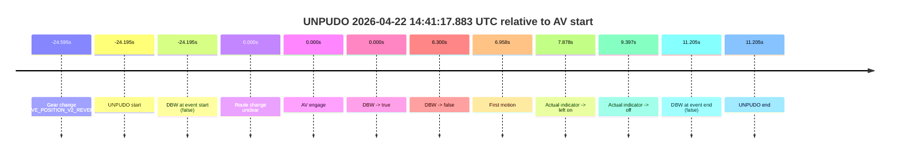
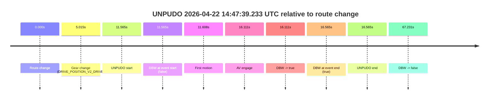

# Run Report: fme10011/2026-04-22--13-38-11--gen2-av-c6787608-2377-49a2-8db2-eb353c1251f9

| Field | Value |
|---|---|
| Run ID | `fme10011/2026-04-22--13-38-11--gen2-av-c6787608-2377-49a2-8db2-eb353c1251f9` |
| Date | `2026-04-22` |
| Model(s) | `insightful-magenta-porcupine` |
| Author | `boris.indelman` |
| Event count | `2` |

## unpudo 2026-04-22 14:41:17.883 UTC

| Field | Value |
|---|---|
| Model | `insightful-magenta-porcupine` |
| Author | `boris.indelman` |
| Run ID | `fme10011/2026-04-22--13-38-11--gen2-av-c6787608-2377-49a2-8db2-eb353c1251f9` |
| Date | `2026-04-22` |
| Time (UTC) | `14:41:17.883` |
| Event type | `unpudo` |
| Disengagement type | `none observed` |
| Route change | `unclear` |
| Console | [run](https://console.sso.wayve.ai/run/fme10011/2026-04-22--13-38-11--gen2-av-c6787608-2377-49a2-8db2-eb353c1251f9?id=&time-unixus=1776868877883327) |
| Foxglove | [segment](https://app.foxglove.dev/wayve-on-prem/p/prj_0dX18KZdVHg1fmmI/view?ds=foxglove-stream&ds.deviceName=fme10011&ds.start=2026-04-22T14%3A41%3A07.483317Z&ds.end=2026-04-22T14%3A42%3A03.283319Z&layoutId=lay_0e7VD4WIKDQGU73Y&time=2026-04-22T14%3A41%3A17.883327Z) |

### Event card: fail

- Fail: the credited unpudo does not stay AV-owned. The event window starts with DBW false, and the maneuver outcome lands outside a clean AV-owned segment.

| Event | Time (UTC) | Delta from AV start |
|---|---:|---:|
| Gear change (DRIVE_POSITION_V2_REVERSE) | 2026-04-22 14:41:17.483 | `-24.595s` |
| UNPUDO start | 2026-04-22 14:41:17.883 | `-24.195s` |
| DBW at event start (false) | 2026-04-22 14:41:17.883 | `-24.195s` |
| Route change unclear | 2026-04-22 14:41:42.078 | `0.000s` |
| AV engage | 2026-04-22 14:41:42.078 | `0.000s` |
| DBW -> true | 2026-04-22 14:41:42.078 | `0.000s` |
| DBW -> false | 2026-04-22 14:41:48.378 | `6.300s` |
| First motion | 2026-04-22 14:41:49.036 | `6.958s` |
| Actual indicator -> left on | 2026-04-22 14:41:49.956 | `7.878s` |
| Actual indicator -> off | 2026-04-22 14:41:51.476 | `9.397s` |
| DBW at event end (false) | 2026-04-22 14:41:53.283 | `11.205s` |
| UNPUDO end | 2026-04-22 14:41:53.283 | `11.205s` |

| Metric | Value |
|---|---|
| Outcome | `fail` |
| Effective failure type | `not_av_owned` |
| Route change status | `unclear` |
| DBW at event start | `false` |
| DBW at event end | `false` |
| Predicted gear at AV start | `DRIVE_POSITION_V2_PARK` |
| Actual gear at AV start | `DRIVE_POSITION_V2_PARK` |
| Predicted gear at event start | `DRIVE_POSITION_V2_REVERSE` |
| Actual gear at event start | `DRIVE_POSITION_V2_REVERSE` |
| Planned indicator direction | `INDICATORS_STATE_V2_OFF` |
| Controller indicator direction | `INDICATORS_STATE_V2_OFF` |
| Actual indicator direction | `INDICATORS_STATE_V2_OFF` |
| Actual indicator at maneuver end | `INDICATORS_STATE_V2_OFF` |
| Driver accel help in AV | `false` |
| Driver accel help timestamp | `n/a` |
| Max accel pedal pct in AV | `0.0%` |
| Max brake pedal pct in AV | `8.0%` |
| Max speed mps in AV | `0.000` |
| Success timing baseline | `AV start` |
| Route -> AV | `n/a` |
| AV -> event start | `-24.195s` |
| AV -> first motion | `6.958s` |
| Success baseline -> event start | `-24.195s` |
| Success baseline -> first motion | `6.958s` |
| AV duration before disengagement | `6.300s` |
| Trajectory waypoint count | `37` |
| Driving-plan step count | `11` |

The scored portion starts from the AV-owned window, not from the pre-AV setup. Route-change search in the stopped pre-event segment was `unclear`, with the baseline therefore set to AV start. At the event anchor the model predicts `DRIVE_POSITION_V2_REVERSE` and the actual gear is `DRIVE_POSITION_V2_REVERSE`. The effective model outcome is `fail` because `not_av_owned`.

### Resolution

| Field | Value |
|---|---|
| Final outcome | `fail` |
| Do we agree with this label? | `yes` |
| Source disengagement type | `none observed` |
| Resolved effective failure type | `not_av_owned` |
| Confidence | `medium` |

## unpudo 2026-04-22 14:47:39.233 UTC

| Field | Value |
|---|---|
| Model | `insightful-magenta-porcupine` |
| Author | `boris.indelman` |
| Run ID | `fme10011/2026-04-22--13-38-11--gen2-av-c6787608-2377-49a2-8db2-eb353c1251f9` |
| Date | `2026-04-22` |
| Time (UTC) | `14:47:39.233` |
| Event type | `unpudo` |
| Disengagement type | `none observed` |
| Route change | `found` |
| Console | [run](https://console.sso.wayve.ai/run/fme10011/2026-04-22--13-38-11--gen2-av-c6787608-2377-49a2-8db2-eb353c1251f9?id=&time-unixus=1776869259233317) |
| Foxglove | [segment](https://app.foxglove.dev/wayve-on-prem/p/prj_0dX18KZdVHg1fmmI/view?ds=foxglove-stream&ds.deviceName=fme10011&ds.start=2026-04-22T14%3A47%3A17.668233Z&ds.end=2026-04-22T14%3A48%3A44.899444Z&layoutId=lay_0e7VD4WIKDQGU73Y&time=2026-04-22T14%3A47%3A39.233317Z) |

### Event card: accidental

- Accidental: AV ownership is present for less than `2s`, so this is treated as an accidental brush with the maneuver rather than a meaningful model attempt.

| Event | Time (UTC) | Delta from route change |
|---|---:|---:|
| Route change | 2026-04-22 14:47:27.668 | `0.000s` |
| Gear change (DRIVE_POSITION_V2_DRIVE) | 2026-04-22 14:47:32.683 | `5.015s` |
| UNPUDO start | 2026-04-22 14:47:39.233 | `11.565s` |
| DBW at event start (false) | 2026-04-22 14:47:39.233 | `11.565s` |
| First motion | 2026-04-22 14:47:39.276 | `11.608s` |
| AV engage | 2026-04-22 14:47:43.779 | `16.111s` |
| DBW -> true | 2026-04-22 14:47:43.779 | `16.111s` |
| DBW at event end (true) | 2026-04-22 14:47:44.233 | `16.565s` |
| UNPUDO end | 2026-04-22 14:47:44.233 | `16.565s` |
| DBW -> false | 2026-04-22 14:48:34.899 | `67.231s` |

| Metric | Value |
|---|---|
| Outcome | `accidental` |
| Effective failure type | `none` |
| Route change status | `found` |
| DBW at event start | `false` |
| DBW at event end | `true` |
| Predicted gear at AV start | `DRIVE_POSITION_V2_DRIVE` |
| Actual gear at AV start | `DRIVE_POSITION_V2_DRIVE` |
| Predicted gear at event start | `DRIVE_POSITION_V2_DRIVE` |
| Actual gear at event start | `DRIVE_POSITION_V2_DRIVE` |
| Planned indicator direction | `INDICATORS_STATE_V2_LEFT_ON` |
| Controller indicator direction | `INDICATORS_STATE_V2_LEFT_ON` |
| Actual indicator direction | `INDICATORS_STATE_V2_OFF` |
| Actual indicator at maneuver end | `INDICATORS_STATE_V2_OFF` |
| Driver accel help in AV | `false` |
| Driver accel help timestamp | `n/a` |
| Max accel pedal pct in AV | `0.0%` |
| Max brake pedal pct in AV | `0.0%` |
| Max speed mps in AV | `3.283` |
| Success timing baseline | `route change` |
| Route -> AV | `16.111s` |
| AV -> event start | `-4.546s` |
| AV -> first motion | `-4.502s` |
| Success baseline -> event start | `11.565s` |
| Success baseline -> first motion | `11.608s` |
| AV duration before disengagement | `51.120s` |
| Trajectory waypoint count | `38` |
| Driving-plan step count | `11` |

The scored portion starts from the AV-owned window, not from the pre-AV setup. Route-change search in the stopped pre-event segment was `found`, with the baseline therefore set to route change. At the event anchor the model predicts `DRIVE_POSITION_V2_DRIVE` and the actual gear is `DRIVE_POSITION_V2_DRIVE`. The effective model outcome is `accidental` because `the AV-owned portion is shorter than 2s`.

### Resolution

| Field | Value |
|---|---|
| Final outcome | `accidental` |
| Do we agree with this label? | `yes` |
| Source disengagement type | `none observed` |
| Resolved effective failure type | `none` |
| Confidence | `high` |
