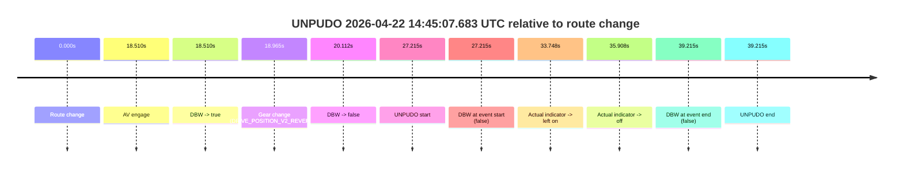
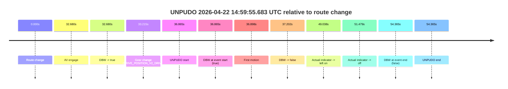
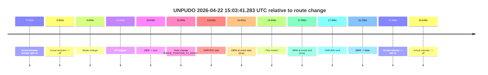
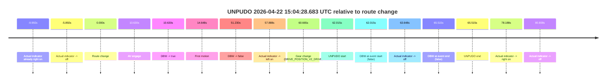
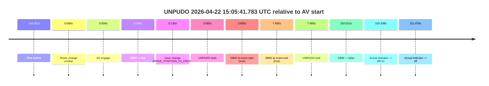
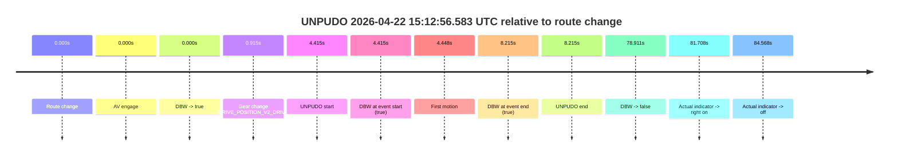
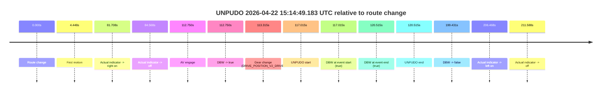
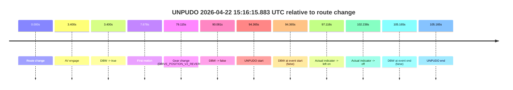
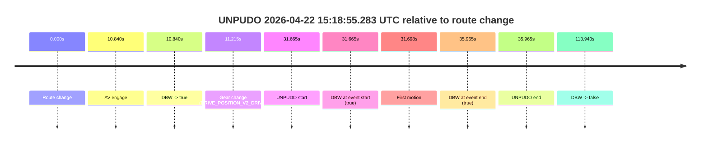

# Run Report: fme10011/2026-04-22--13-38-11--gen2-av-c6787608-2377-49a2-8db2-eb353c1251f9

| Field | Value |
|---|---|
| Run ID | `fme10011/2026-04-22--13-38-11--gen2-av-c6787608-2377-49a2-8db2-eb353c1251f9` |
| Date | `2026-04-22` |
| Model(s) | `eel-teal-outspoken` |
| Author | `zak` |
| Event count | `9` |

## unpudo 2026-04-22 14:45:07.683 UTC

| Field | Value |
|---|---|
| Model | `eel-teal-outspoken` |
| Author | `zak` |
| Run ID | `fme10011/2026-04-22--13-38-11--gen2-av-c6787608-2377-49a2-8db2-eb353c1251f9` |
| Date | `2026-04-22` |
| Time (UTC) | `14:45:07.683` |
| Event type | `unpudo` |
| Disengagement type | `none observed` |
| Route change | `found` |
| Console | [run](https://console.sso.wayve.ai/run/fme10011/2026-04-22--13-38-11--gen2-av-c6787608-2377-49a2-8db2-eb353c1251f9?id=&time-unixus=1776869107683315) |
| Foxglove | [segment](https://app.foxglove.dev/wayve-on-prem/p/prj_0dX18KZdVHg1fmmI/view?ds=foxglove-stream&ds.deviceName=fme10011&ds.start=2026-04-22T14%3A44%3A30.468264Z&ds.end=2026-04-22T14%3A45%3A29.683306Z&layoutId=lay_0e7VD4WIKDQGU73Y&time=2026-04-22T14%3A45%3A07.683315Z) |

### Event card: accidental

- Accidental: AV ownership is present for less than `2s`, so this is treated as an accidental brush with the maneuver rather than a meaningful model attempt.

| Event | Time (UTC) | Delta from route change |
|---|---:|---:|
| Route change | 2026-04-22 14:44:40.468 | `0.000s` |
| AV engage | 2026-04-22 14:44:58.978 | `18.510s` |
| DBW -> true | 2026-04-22 14:44:58.978 | `18.510s` |
| Gear change (DRIVE_POSITION_V2_REVERSE) | 2026-04-22 14:44:59.433 | `18.965s` |
| DBW -> false | 2026-04-22 14:45:00.580 | `20.112s` |
| UNPUDO start | 2026-04-22 14:45:07.683 | `27.215s` |
| DBW at event start (false) | 2026-04-22 14:45:07.683 | `27.215s` |
| Actual indicator -> left on | 2026-04-22 14:45:14.215 | `33.748s` |
| Actual indicator -> off | 2026-04-22 14:45:16.376 | `35.908s` |
| DBW at event end (false) | 2026-04-22 14:45:19.683 | `39.215s` |
| UNPUDO end | 2026-04-22 14:45:19.683 | `39.215s` |

| Metric | Value |
|---|---|
| Outcome | `accidental` |
| Effective failure type | `none` |
| Route change status | `found` |
| DBW at event start | `false` |
| DBW at event end | `false` |
| Predicted gear at AV start | `DRIVE_POSITION_V2_REVERSE` |
| Actual gear at AV start | `DRIVE_POSITION_V2_PARK` |
| Predicted gear at event start | `DRIVE_POSITION_V2_REVERSE` |
| Actual gear at event start | `DRIVE_POSITION_V2_REVERSE` |
| Planned indicator direction | `INDICATORS_STATE_V2_OFF` |
| Controller indicator direction | `INDICATORS_STATE_V2_OFF` |
| Actual indicator direction | `INDICATORS_STATE_V2_OFF` |
| Actual indicator at maneuver end | `INDICATORS_STATE_V2_OFF` |
| Driver accel help in AV | `false` |
| Driver accel help timestamp | `n/a` |
| Max accel pedal pct in AV | `0.0%` |
| Max brake pedal pct in AV | `11.5%` |
| Max speed mps in AV | `0.000` |
| Success timing baseline | `route change` |
| Route -> AV | `18.510s` |
| AV -> event start | `8.705s` |
| AV -> first motion | `n/a` |
| Success baseline -> event start | `27.215s` |
| Success baseline -> first motion | `n/a` |
| AV duration before disengagement | `1.602s` |
| Trajectory waypoint count | `37` |
| Driving-plan step count | `11` |

The scored portion starts from the AV-owned window, not from the pre-AV setup. Route-change search in the stopped pre-event segment was `found`, with the baseline therefore set to route change. At the event anchor the model predicts `DRIVE_POSITION_V2_REVERSE` and the actual gear is `DRIVE_POSITION_V2_REVERSE`. The effective model outcome is `accidental` because `the AV-owned portion is shorter than 2s.`

### Resolution

| Field | Value |
|---|---|
| Final outcome | `accidental` |
| Do we agree with this label? | `yes` |
| Source disengagement type | `none observed` |
| Resolved effective failure type | `none` |
| Confidence | `high` |

## unpudo 2026-04-22 14:59:55.683 UTC

| Field | Value |
|---|---|
| Model | `eel-teal-outspoken` |
| Author | `zak` |
| Run ID | `fme10011/2026-04-22--13-38-11--gen2-av-c6787608-2377-49a2-8db2-eb353c1251f9` |
| Date | `2026-04-22` |
| Time (UTC) | `14:59:55.683` |
| Event type | `unpudo` |
| Disengagement type | `none observed` |
| Route change | `found` |
| Console | [run](https://console.sso.wayve.ai/run/fme10011/2026-04-22--13-38-11--gen2-av-c6787608-2377-49a2-8db2-eb353c1251f9?id=&time-unixus=1776869995683308) |
| Foxglove | [segment](https://app.foxglove.dev/wayve-on-prem/p/prj_0dX18KZdVHg1fmmI/view?ds=foxglove-stream&ds.deviceName=fme10011&ds.start=2026-04-22T14%3A59%3A08.818260Z&ds.end=2026-04-22T15%3A00%3A23.183309Z&layoutId=lay_0e7VD4WIKDQGU73Y&time=2026-04-22T14%3A59%3A55.683308Z) |

### Event card: fail

- Fail: this is a short AV stint rather than a durable model-owned maneuver. The vehicle never settles into a long enough AV-owned attempt to credit the model.

| Event | Time (UTC) | Delta from route change |
|---|---:|---:|
| Route change | 2026-04-22 14:59:18.818 | `0.000s` |
| AV engage | 2026-04-22 14:59:51.498 | `32.680s` |
| DBW -> true | 2026-04-22 14:59:51.498 | `32.680s` |
| Gear change (DRIVE_POSITION_V2_DRIVE) | 2026-04-22 14:59:52.033 | `33.215s` |
| UNPUDO start | 2026-04-22 14:59:55.683 | `36.865s` |
| DBW at event start (true) | 2026-04-22 14:59:55.683 | `36.865s` |
| First motion | 2026-04-22 14:59:55.716 | `36.898s` |
| DBW -> false | 2026-04-22 14:59:56.020 | `37.202s` |
| Actual indicator -> left on | 2026-04-22 15:00:07.856 | `49.038s` |
| Actual indicator -> off | 2026-04-22 15:00:10.296 | `51.479s` |
| DBW at event end (false) | 2026-04-22 15:00:13.183 | `54.365s` |
| UNPUDO end | 2026-04-22 15:00:13.183 | `54.365s` |

| Metric | Value |
|---|---|
| Outcome | `fail` |
| Effective failure type | `interrupted_handover` |
| Route change status | `found` |
| DBW at event start | `true` |
| DBW at event end | `false` |
| Predicted gear at AV start | `DRIVE_POSITION_V2_DRIVE` |
| Actual gear at AV start | `DRIVE_POSITION_V2_PARK` |
| Predicted gear at event start | `DRIVE_POSITION_V2_DRIVE` |
| Actual gear at event start | `DRIVE_POSITION_V2_DRIVE` |
| Planned indicator direction | `INDICATORS_STATE_V2_LEFT_ON` |
| Controller indicator direction | `INDICATORS_STATE_V2_LEFT_ON` |
| Actual indicator direction | `INDICATORS_STATE_V2_OFF` |
| Actual indicator at maneuver end | `INDICATORS_STATE_V2_OFF` |
| Driver accel help in AV | `false` |
| Driver accel help timestamp | `n/a` |
| Max accel pedal pct in AV | `0.0%` |
| Max brake pedal pct in AV | `8.0%` |
| Max speed mps in AV | `0.667` |
| Success timing baseline | `route change` |
| Route -> AV | `32.680s` |
| AV -> event start | `4.185s` |
| AV -> first motion | `4.218s` |
| Success baseline -> event start | `36.865s` |
| Success baseline -> first motion | `36.898s` |
| AV duration before disengagement | `4.522s` |
| Trajectory waypoint count | `37` |
| Driving-plan step count | `11` |

The scored portion starts from the AV-owned window, not from the pre-AV setup. Route-change search in the stopped pre-event segment was `found`, with the baseline therefore set to route change. At the event anchor the model predicts `DRIVE_POSITION_V2_DRIVE` and the actual gear is `DRIVE_POSITION_V2_DRIVE`. The effective model outcome is `fail` because `interrupted_handover.`

### Resolution

| Field | Value |
|---|---|
| Final outcome | `fail` |
| Do we agree with this label? | `yes` |
| Source disengagement type | `none observed` |
| Resolved effective failure type | `interrupted_handover` |
| Confidence | `high` |

## unpudo 2026-04-22 15:03:41.283 UTC

| Field | Value |
|---|---|
| Model | `eel-teal-outspoken` |
| Author | `zak` |
| Run ID | `fme10011/2026-04-22--13-38-11--gen2-av-c6787608-2377-49a2-8db2-eb353c1251f9` |
| Date | `2026-04-22` |
| Time (UTC) | `15:03:41.283` |
| Event type | `unpudo` |
| Disengagement type | `none observed` |
| Route change | `found` |
| Console | [run](https://console.sso.wayve.ai/run/fme10011/2026-04-22--13-38-11--gen2-av-c6787608-2377-49a2-8db2-eb353c1251f9?id=&time-unixus=1776870221283301) |
| Foxglove | [segment](https://app.foxglove.dev/wayve-on-prem/p/prj_0dX18KZdVHg1fmmI/view?ds=foxglove-stream&ds.deviceName=fme10011&ds.start=2026-04-22T15%3A03%3A16.668263Z&ds.end=2026-04-22T15%3A04%3A27.898493Z&layoutId=lay_0e7VD4WIKDQGU73Y&time=2026-04-22T15%3A03%3A41.283301Z) |

### Event card: pass

- Pass: AV owns the credited unpudo from route change through the official unpudo window, the gear state is aligned at the anchor, and the vehicle moves without driver accelerator help in AV.

| Event | Time (UTC) | Delta from route change |
|---|---:|---:|
| Actual indicator already right on | 2026-04-22 15:03:16.676 | `-9.992s` |
| Actual indicator -> off | 2026-04-22 15:03:20.775 | `-5.892s` |
| Route change | 2026-04-22 15:03:26.668 | `0.000s` |
| AV engage | 2026-04-22 15:03:37.298 | `10.630s` |
| DBW -> true | 2026-04-22 15:03:37.298 | `10.630s` |
| Gear change (DRIVE_POSITION_V2_DRIVE) | 2026-04-22 15:03:37.733 | `11.065s` |
| UNPUDO start | 2026-04-22 15:03:41.283 | `14.615s` |
| DBW at event start (true) | 2026-04-22 15:03:41.283 | `14.615s` |
| First motion | 2026-04-22 15:03:41.316 | `14.648s` |
| DBW at event end (true) | 2026-04-22 15:03:44.633 | `17.965s` |
| UNPUDO end | 2026-04-22 15:03:44.633 | `17.965s` |
| DBW -> false | 2026-04-22 15:04:17.898 | `51.230s` |
| Actual indicator -> left on | 2026-04-22 15:04:24.556 | `57.888s` |
| Actual indicator -> off | 2026-04-22 15:04:30.315 | `63.648s` |

| Metric | Value |
|---|---|
| Outcome | `pass` |
| Effective failure type | `none` |
| Route change status | `found` |
| DBW at event start | `true` |
| DBW at event end | `true` |
| Predicted gear at AV start | `DRIVE_POSITION_V2_DRIVE` |
| Actual gear at AV start | `DRIVE_POSITION_V2_PARK` |
| Predicted gear at event start | `DRIVE_POSITION_V2_DRIVE` |
| Actual gear at event start | `DRIVE_POSITION_V2_DRIVE` |
| Planned indicator direction | `INDICATORS_STATE_V2_LEFT_ON` |
| Controller indicator direction | `INDICATORS_STATE_V2_LEFT_ON` |
| Actual indicator direction | `INDICATORS_STATE_V2_OFF` |
| Actual indicator at maneuver end | `INDICATORS_STATE_V2_OFF` |
| Driver accel help in AV | `false` |
| Driver accel help timestamp | `n/a` |
| Max accel pedal pct in AV | `0.0%` |
| Max brake pedal pct in AV | `8.0%` |
| Max speed mps in AV | `5.922` |
| Success timing baseline | `route change` |
| Route -> AV | `10.630s` |
| AV -> event start | `3.985s` |
| AV -> first motion | `4.018s` |
| Success baseline -> event start | `14.615s` |
| Success baseline -> first motion | `14.648s` |
| AV duration before disengagement | `40.600s` |
| Trajectory waypoint count | `37` |
| Driving-plan step count | `11` |

The scored portion starts from the AV-owned window, not from the pre-AV setup. Route-change search in the stopped pre-event segment was `found`, with the baseline therefore set to route change. At the event anchor the model predicts `DRIVE_POSITION_V2_DRIVE` and the actual gear is `DRIVE_POSITION_V2_DRIVE`. The effective model outcome is `pass` because `the credited unpudo stays AV-owned through the official unpudo window.`

### Resolution

| Field | Value |
|---|---|
| Final outcome | `pass` |
| Do we agree with this label? | `yes` |
| Source disengagement type | `none observed` |
| Resolved effective failure type | `none` |
| Confidence | `high` |

## unpudo 2026-04-22 15:04:28.683 UTC

| Field | Value |
|---|---|
| Model | `eel-teal-outspoken` |
| Author | `zak` |
| Run ID | `fme10011/2026-04-22--13-38-11--gen2-av-c6787608-2377-49a2-8db2-eb353c1251f9` |
| Date | `2026-04-22` |
| Time (UTC) | `15:04:28.683` |
| Event type | `unpudo` |
| Disengagement type | `none observed` |
| Route change | `found` |
| Console | [run](https://console.sso.wayve.ai/run/fme10011/2026-04-22--13-38-11--gen2-av-c6787608-2377-49a2-8db2-eb353c1251f9?id=&time-unixus=1776870268683324) |
| Foxglove | [segment](https://app.foxglove.dev/wayve-on-prem/p/prj_0dX18KZdVHg1fmmI/view?ds=foxglove-stream&ds.deviceName=fme10011&ds.start=2026-04-22T15%3A03%3A16.668263Z&ds.end=2026-04-22T15%3A04%3A42.183314Z&layoutId=lay_0e7VD4WIKDQGU73Y&time=2026-04-22T15%3A04%3A28.683324Z) |

### Event card: fail

- Fail: the credited unpudo does not stay AV-owned. The event window starts with DBW false, and the maneuver outcome lands outside a clean AV-owned segment.

| Event | Time (UTC) | Delta from route change |
|---|---:|---:|
| Actual indicator already right on | 2026-04-22 15:03:16.676 | `-9.992s` |
| Actual indicator -> off | 2026-04-22 15:03:20.775 | `-5.892s` |
| Route change | 2026-04-22 15:03:26.668 | `0.000s` |
| AV engage | 2026-04-22 15:03:37.298 | `10.630s` |
| DBW -> true | 2026-04-22 15:03:37.298 | `10.630s` |
| First motion | 2026-04-22 15:03:41.316 | `14.648s` |
| DBW -> false | 2026-04-22 15:04:17.898 | `51.230s` |
| Actual indicator -> left on | 2026-04-22 15:04:24.556 | `57.888s` |
| Gear change (DRIVE_POSITION_V2_DRIVE) | 2026-04-22 15:04:27.333 | `60.665s` |
| UNPUDO start | 2026-04-22 15:04:28.683 | `62.015s` |
| DBW at event start (false) | 2026-04-22 15:04:28.683 | `62.015s` |
| Actual indicator -> off | 2026-04-22 15:04:30.315 | `63.648s` |
| DBW at event end (false) | 2026-04-22 15:04:32.183 | `65.515s` |
| UNPUDO end | 2026-04-22 15:04:32.183 | `65.515s` |
| Actual indicator -> right on | 2026-04-22 15:04:44.855 | `78.188s` |
| Actual indicator -> off | 2026-04-22 15:04:47.476 | `80.808s` |

| Metric | Value |
|---|---|
| Outcome | `fail` |
| Effective failure type | `not_av_owned` |
| Route change status | `found` |
| DBW at event start | `false` |
| DBW at event end | `false` |
| Predicted gear at AV start | `DRIVE_POSITION_V2_DRIVE` |
| Actual gear at AV start | `DRIVE_POSITION_V2_PARK` |
| Predicted gear at event start | `DRIVE_POSITION_V2_DRIVE` |
| Actual gear at event start | `DRIVE_POSITION_V2_DRIVE` |
| Planned indicator direction | `INDICATORS_STATE_V2_OFF` |
| Controller indicator direction | `INDICATORS_STATE_V2_OFF` |
| Actual indicator direction | `INDICATORS_STATE_V2_LEFT_ON` |
| Actual indicator at maneuver end | `INDICATORS_STATE_V2_OFF` |
| Driver accel help in AV | `false` |
| Driver accel help timestamp | `n/a` |
| Max accel pedal pct in AV | `0.0%` |
| Max brake pedal pct in AV | `8.2%` |
| Max speed mps in AV | `9.189` |
| Success timing baseline | `route change` |
| Route -> AV | `10.630s` |
| AV -> event start | `51.385s` |
| AV -> first motion | `4.018s` |
| Success baseline -> event start | `62.015s` |
| Success baseline -> first motion | `14.648s` |
| AV duration before disengagement | `40.600s` |
| Trajectory waypoint count | `37` |
| Driving-plan step count | `11` |

The scored portion starts from the AV-owned window, not from the pre-AV setup. Route-change search in the stopped pre-event segment was `found`, with the baseline therefore set to route change. At the event anchor the model predicts `DRIVE_POSITION_V2_DRIVE` and the actual gear is `DRIVE_POSITION_V2_DRIVE`. The effective model outcome is `fail` because `not_av_owned.`

### Resolution

| Field | Value |
|---|---|
| Final outcome | `fail` |
| Do we agree with this label? | `yes` |
| Source disengagement type | `none observed` |
| Resolved effective failure type | `not_av_owned` |
| Confidence | `high` |

## unpudo 2026-04-22 15:05:41.783 UTC

| Field | Value |
|---|---|
| Model | `eel-teal-outspoken` |
| Author | `zak` |
| Run ID | `fme10011/2026-04-22--13-38-11--gen2-av-c6787608-2377-49a2-8db2-eb353c1251f9` |
| Date | `2026-04-22` |
| Time (UTC) | `15:05:41.783` |
| Event type | `unpudo` |
| Disengagement type | `none observed` |
| Route change | `unclear` |
| Console | [run](https://console.sso.wayve.ai/run/fme10011/2026-04-22--13-38-11--gen2-av-c6787608-2377-49a2-8db2-eb353c1251f9?id=&time-unixus=1776870341783308) |
| Foxglove | [segment](https://app.foxglove.dev/wayve-on-prem/p/prj_0dX18KZdVHg1fmmI/view?ds=foxglove-stream&ds.deviceName=fme10011&ds.start=2026-04-22T15%3A05%3A28.098539Z&ds.end=2026-04-22T15%3A10%3A58.119777Z&layoutId=lay_0e7VD4WIKDQGU73Y&time=2026-04-22T15%3A05%3A41.783308Z) |

### Event card: pass

- Pass: AV owns the credited unpudo from route change through the official unpudo window, the gear state is aligned at the anchor, and the vehicle moves without driver accelerator help in AV.

| Event | Time (UTC) | Delta from AV start |
|---|---:|---:|
| First motion | 2026-04-22 15:03:41.796 | `-116.302s` |
| Route change unclear | 2026-04-22 15:05:38.098 | `0.000s` |
| AV engage | 2026-04-22 15:05:38.098 | `0.000s` |
| DBW -> true | 2026-04-22 15:05:38.098 | `0.000s` |
| Gear change (DRIVE_POSITION_V2_DRIVE) | 2026-04-22 15:05:38.233 | `0.135s` |
| UNPUDO start | 2026-04-22 15:05:41.783 | `3.685s` |
| DBW at event start (true) | 2026-04-22 15:05:41.783 | `3.685s` |
| DBW at event end (true) | 2026-04-22 15:05:45.583 | `7.485s` |
| UNPUDO end | 2026-04-22 15:05:45.583 | `7.485s` |
| DBW -> false | 2026-04-22 15:10:48.119 | `310.021s` |
| Actual indicator -> left on | 2026-04-22 15:10:48.436 | `310.338s` |
| Actual indicator -> off | 2026-04-22 15:10:49.976 | `311.878s` |

| Metric | Value |
|---|---|
| Outcome | `pass` |
| Effective failure type | `none` |
| Route change status | `unclear` |
| DBW at event start | `true` |
| DBW at event end | `true` |
| Predicted gear at AV start | `DRIVE_POSITION_V2_DRIVE` |
| Actual gear at AV start | `DRIVE_POSITION_V2_PARK` |
| Predicted gear at event start | `DRIVE_POSITION_V2_DRIVE` |
| Actual gear at event start | `DRIVE_POSITION_V2_DRIVE` |
| Planned indicator direction | `INDICATORS_STATE_V2_LEFT_ON` |
| Controller indicator direction | `INDICATORS_STATE_V2_LEFT_ON` |
| Actual indicator direction | `INDICATORS_STATE_V2_OFF` |
| Actual indicator at maneuver end | `INDICATORS_STATE_V2_OFF` |
| Driver accel help in AV | `false` |
| Driver accel help timestamp | `n/a` |
| Max accel pedal pct in AV | `0.0%` |
| Max brake pedal pct in AV | `8.0%` |
| Max speed mps in AV | `5.217` |
| Success timing baseline | `AV start` |
| Route -> AV | `n/a` |
| AV -> event start | `3.685s` |
| AV -> first motion | `-116.302s` |
| Success baseline -> event start | `3.685s` |
| Success baseline -> first motion | `-116.302s` |
| AV duration before disengagement | `310.021s` |
| Trajectory waypoint count | `37` |
| Driving-plan step count | `11` |

The scored portion starts from the AV-owned window, not from the pre-AV setup. Route-change search in the stopped pre-event segment was `unclear`, with the baseline therefore set to AV start. At the event anchor the model predicts `DRIVE_POSITION_V2_DRIVE` and the actual gear is `DRIVE_POSITION_V2_DRIVE`. The effective model outcome is `pass` because `the credited unpudo stays AV-owned through the official unpudo window.`

### Resolution

| Field | Value |
|---|---|
| Final outcome | `pass` |
| Do we agree with this label? | `yes` |
| Source disengagement type | `none observed` |
| Resolved effective failure type | `none` |
| Confidence | `medium` |

## unpudo 2026-04-22 15:12:56.583 UTC

| Field | Value |
|---|---|
| Model | `eel-teal-outspoken` |
| Author | `zak` |
| Run ID | `fme10011/2026-04-22--13-38-11--gen2-av-c6787608-2377-49a2-8db2-eb353c1251f9` |
| Date | `2026-04-22` |
| Time (UTC) | `15:12:56.583` |
| Event type | `unpudo` |
| Disengagement type | `none observed` |
| Route change | `found` |
| Console | [run](https://console.sso.wayve.ai/run/fme10011/2026-04-22--13-38-11--gen2-av-c6787608-2377-49a2-8db2-eb353c1251f9?id=&time-unixus=1776870776583310) |
| Foxglove | [segment](https://app.foxglove.dev/wayve-on-prem/p/prj_0dX18KZdVHg1fmmI/view?ds=foxglove-stream&ds.deviceName=fme10011&ds.start=2026-04-22T15%3A12%3A42.168382Z&ds.end=2026-04-22T15%3A14%3A21.079755Z&layoutId=lay_0e7VD4WIKDQGU73Y&time=2026-04-22T15%3A12%3A56.583310Z) |

### Event card: pass

- Pass: AV owns the credited unpudo from route change through the official unpudo window, the gear state is aligned at the anchor, and the vehicle moves without driver accelerator help in AV.

| Event | Time (UTC) | Delta from route change |
|---|---:|---:|
| Route change | 2026-04-22 15:12:52.168 | `0.000s` |
| AV engage | 2026-04-22 15:12:52.168 | `0.000s` |
| DBW -> true | 2026-04-22 15:12:52.168 | `0.000s` |
| Gear change (DRIVE_POSITION_V2_DRIVE) | 2026-04-22 15:12:53.083 | `0.915s` |
| UNPUDO start | 2026-04-22 15:12:56.583 | `4.415s` |
| DBW at event start (true) | 2026-04-22 15:12:56.583 | `4.415s` |
| First motion | 2026-04-22 15:12:56.616 | `4.448s` |
| DBW at event end (true) | 2026-04-22 15:13:00.383 | `8.215s` |
| UNPUDO end | 2026-04-22 15:13:00.383 | `8.215s` |
| DBW -> false | 2026-04-22 15:14:11.079 | `78.911s` |
| Actual indicator -> right on | 2026-04-22 15:14:13.875 | `81.708s` |
| Actual indicator -> off | 2026-04-22 15:14:16.735 | `84.568s` |

| Metric | Value |
|---|---|
| Outcome | `pass` |
| Effective failure type | `none` |
| Route change status | `found` |
| DBW at event start | `true` |
| DBW at event end | `true` |
| Predicted gear at AV start | `DRIVE_POSITION_V2_PARK` |
| Actual gear at AV start | `DRIVE_POSITION_V2_NEUTRAL` |
| Predicted gear at event start | `DRIVE_POSITION_V2_DRIVE` |
| Actual gear at event start | `DRIVE_POSITION_V2_DRIVE` |
| Planned indicator direction | `INDICATORS_STATE_V2_LEFT_ON` |
| Controller indicator direction | `INDICATORS_STATE_V2_LEFT_ON` |
| Actual indicator direction | `INDICATORS_STATE_V2_OFF` |
| Actual indicator at maneuver end | `INDICATORS_STATE_V2_OFF` |
| Driver accel help in AV | `false` |
| Driver accel help timestamp | `n/a` |
| Max accel pedal pct in AV | `0.0%` |
| Max brake pedal pct in AV | `8.0%` |
| Max speed mps in AV | `3.967` |
| Success timing baseline | `route change` |
| Route -> AV | `0.000s` |
| AV -> event start | `4.415s` |
| AV -> first motion | `4.448s` |
| Success baseline -> event start | `4.415s` |
| Success baseline -> first motion | `4.448s` |
| AV duration before disengagement | `78.911s` |
| Trajectory waypoint count | `37` |
| Driving-plan step count | `11` |

The scored portion starts from the AV-owned window, not from the pre-AV setup. Route-change search in the stopped pre-event segment was `found`, with the baseline therefore set to route change. At the event anchor the model predicts `DRIVE_POSITION_V2_DRIVE` and the actual gear is `DRIVE_POSITION_V2_DRIVE`. The effective model outcome is `pass` because `the credited unpudo stays AV-owned through the official unpudo window.`

### Resolution

| Field | Value |
|---|---|
| Final outcome | `pass` |
| Do we agree with this label? | `yes` |
| Source disengagement type | `none observed` |
| Resolved effective failure type | `none` |
| Confidence | `high` |

## unpudo 2026-04-22 15:14:49.183 UTC

| Field | Value |
|---|---|
| Model | `eel-teal-outspoken` |
| Author | `zak` |
| Run ID | `fme10011/2026-04-22--13-38-11--gen2-av-c6787608-2377-49a2-8db2-eb353c1251f9` |
| Date | `2026-04-22` |
| Time (UTC) | `15:14:49.183` |
| Event type | `unpudo` |
| Disengagement type | `none observed` |
| Route change | `found` |
| Console | [run](https://console.sso.wayve.ai/run/fme10011/2026-04-22--13-38-11--gen2-av-c6787608-2377-49a2-8db2-eb353c1251f9?id=&time-unixus=1776870889183309) |
| Foxglove | [segment](https://app.foxglove.dev/wayve-on-prem/p/prj_0dX18KZdVHg1fmmI/view?ds=foxglove-stream&ds.deviceName=fme10011&ds.start=2026-04-22T15%3A12%3A42.168382Z&ds.end=2026-04-22T15%3A16%3A21.599565Z&layoutId=lay_0e7VD4WIKDQGU73Y&time=2026-04-22T15%3A14%3A49.183309Z) |

### Event card: pass

- Pass: AV owns the credited unpudo from route change through the official unpudo window, the gear state is aligned at the anchor, and the vehicle moves without driver accelerator help in AV.

| Event | Time (UTC) | Delta from route change |
|---|---:|---:|
| Route change | 2026-04-22 15:12:52.168 | `0.000s` |
| First motion | 2026-04-22 15:12:56.616 | `4.448s` |
| Actual indicator -> right on | 2026-04-22 15:14:13.875 | `81.708s` |
| Actual indicator -> off | 2026-04-22 15:14:16.735 | `84.568s` |
| AV engage | 2026-04-22 15:14:44.918 | `112.750s` |
| DBW -> true | 2026-04-22 15:14:44.918 | `112.750s` |
| Gear change (DRIVE_POSITION_V2_DRIVE) | 2026-04-22 15:14:45.483 | `113.315s` |
| UNPUDO start | 2026-04-22 15:14:49.183 | `117.015s` |
| DBW at event start (true) | 2026-04-22 15:14:49.183 | `117.015s` |
| DBW at event end (true) | 2026-04-22 15:14:52.683 | `120.515s` |
| UNPUDO end | 2026-04-22 15:14:52.683 | `120.515s` |
| DBW -> false | 2026-04-22 15:16:11.599 | `199.431s` |
| Actual indicator -> left on | 2026-04-22 15:16:18.636 | `206.468s` |
| Actual indicator -> off | 2026-04-22 15:16:23.756 | `211.588s` |

| Metric | Value |
|---|---|
| Outcome | `pass` |
| Effective failure type | `none` |
| Route change status | `found` |
| DBW at event start | `true` |
| DBW at event end | `true` |
| Predicted gear at AV start | `DRIVE_POSITION_V2_DRIVE` |
| Actual gear at AV start | `DRIVE_POSITION_V2_PARK` |
| Predicted gear at event start | `DRIVE_POSITION_V2_DRIVE` |
| Actual gear at event start | `DRIVE_POSITION_V2_DRIVE` |
| Planned indicator direction | `INDICATORS_STATE_V2_LEFT_ON` |
| Controller indicator direction | `INDICATORS_STATE_V2_LEFT_ON` |
| Actual indicator direction | `INDICATORS_STATE_V2_OFF` |
| Actual indicator at maneuver end | `INDICATORS_STATE_V2_OFF` |
| Driver accel help in AV | `false` |
| Driver accel help timestamp | `n/a` |
| Max accel pedal pct in AV | `0.0%` |
| Max brake pedal pct in AV | `14.6%` |
| Max speed mps in AV | `5.114` |
| Success timing baseline | `route change` |
| Route -> AV | `112.750s` |
| AV -> event start | `4.265s` |
| AV -> first motion | `-108.302s` |
| Success baseline -> event start | `117.015s` |
| Success baseline -> first motion | `4.448s` |
| AV duration before disengagement | `86.681s` |
| Trajectory waypoint count | `37` |
| Driving-plan step count | `11` |

The scored portion starts from the AV-owned window, not from the pre-AV setup. Route-change search in the stopped pre-event segment was `found`, with the baseline therefore set to route change. At the event anchor the model predicts `DRIVE_POSITION_V2_DRIVE` and the actual gear is `DRIVE_POSITION_V2_DRIVE`. The effective model outcome is `pass` because `the credited unpudo stays AV-owned through the official unpudo window.`

### Resolution

| Field | Value |
|---|---|
| Final outcome | `pass` |
| Do we agree with this label? | `yes` |
| Source disengagement type | `none observed` |
| Resolved effective failure type | `none` |
| Confidence | `high` |

## unpudo 2026-04-22 15:16:15.883 UTC

| Field | Value |
|---|---|
| Model | `eel-teal-outspoken` |
| Author | `zak` |
| Run ID | `fme10011/2026-04-22--13-38-11--gen2-av-c6787608-2377-49a2-8db2-eb353c1251f9` |
| Date | `2026-04-22` |
| Time (UTC) | `15:16:15.883` |
| Event type | `unpudo` |
| Disengagement type | `none observed` |
| Route change | `found` |
| Console | [run](https://console.sso.wayve.ai/run/fme10011/2026-04-22--13-38-11--gen2-av-c6787608-2377-49a2-8db2-eb353c1251f9?id=&time-unixus=1776870975883312) |
| Foxglove | [segment](https://app.foxglove.dev/wayve-on-prem/p/prj_0dX18KZdVHg1fmmI/view?ds=foxglove-stream&ds.deviceName=fme10011&ds.start=2026-04-22T15%3A14%3A31.518246Z&ds.end=2026-04-22T15%3A16%3A36.683312Z&layoutId=lay_0e7VD4WIKDQGU73Y&time=2026-04-22T15%3A16%3A15.883312Z) |

### Event card: fail

- Fail: the credited unpudo does not stay AV-owned. The event window starts with DBW false, and the maneuver outcome lands outside a clean AV-owned segment.

| Event | Time (UTC) | Delta from route change |
|---|---:|---:|
| Route change | 2026-04-22 15:14:41.518 | `0.000s` |
| AV engage | 2026-04-22 15:14:44.918 | `3.400s` |
| DBW -> true | 2026-04-22 15:14:44.918 | `3.400s` |
| First motion | 2026-04-22 15:14:49.196 | `7.678s` |
| Gear change (DRIVE_POSITION_V2_REVERSE) | 2026-04-22 15:16:00.633 | `79.115s` |
| DBW -> false | 2026-04-22 15:16:11.599 | `90.081s` |
| UNPUDO start | 2026-04-22 15:16:15.883 | `94.365s` |
| DBW at event start (false) | 2026-04-22 15:16:15.883 | `94.365s` |
| Actual indicator -> left on | 2026-04-22 15:16:18.636 | `97.118s` |
| Actual indicator -> off | 2026-04-22 15:16:23.756 | `102.238s` |
| DBW at event end (false) | 2026-04-22 15:16:26.683 | `105.165s` |
| UNPUDO end | 2026-04-22 15:16:26.683 | `105.165s` |

| Metric | Value |
|---|---|
| Outcome | `fail` |
| Effective failure type | `not_av_owned` |
| Route change status | `found` |
| DBW at event start | `false` |
| DBW at event end | `false` |
| Predicted gear at AV start | `DRIVE_POSITION_V2_DRIVE` |
| Actual gear at AV start | `DRIVE_POSITION_V2_PARK` |
| Predicted gear at event start | `DRIVE_POSITION_V2_REVERSE` |
| Actual gear at event start | `DRIVE_POSITION_V2_REVERSE` |
| Planned indicator direction | `INDICATORS_STATE_V2_OFF` |
| Controller indicator direction | `INDICATORS_STATE_V2_OFF` |
| Actual indicator direction | `INDICATORS_STATE_V2_OFF` |
| Actual indicator at maneuver end | `INDICATORS_STATE_V2_OFF` |
| Driver accel help in AV | `false` |
| Driver accel help timestamp | `n/a` |
| Max accel pedal pct in AV | `0.0%` |
| Max brake pedal pct in AV | `21.1%` |
| Max speed mps in AV | `9.256` |
| Success timing baseline | `route change` |
| Route -> AV | `3.400s` |
| AV -> event start | `90.965s` |
| AV -> first motion | `4.278s` |
| Success baseline -> event start | `94.365s` |
| Success baseline -> first motion | `7.678s` |
| AV duration before disengagement | `86.681s` |
| Trajectory waypoint count | `37` |
| Driving-plan step count | `11` |

The scored portion starts from the AV-owned window, not from the pre-AV setup. Route-change search in the stopped pre-event segment was `found`, with the baseline therefore set to route change. At the event anchor the model predicts `DRIVE_POSITION_V2_REVERSE` and the actual gear is `DRIVE_POSITION_V2_REVERSE`. The effective model outcome is `fail` because `not_av_owned.`

### Resolution

| Field | Value |
|---|---|
| Final outcome | `fail` |
| Do we agree with this label? | `yes` |
| Source disengagement type | `none observed` |
| Resolved effective failure type | `not_av_owned` |
| Confidence | `high` |

## unpudo 2026-04-22 15:18:55.283 UTC

| Field | Value |
|---|---|
| Model | `eel-teal-outspoken` |
| Author | `zak` |
| Run ID | `fme10011/2026-04-22--13-38-11--gen2-av-c6787608-2377-49a2-8db2-eb353c1251f9` |
| Date | `2026-04-22` |
| Time (UTC) | `15:18:55.283` |
| Event type | `unpudo` |
| Disengagement type | `none observed` |
| Route change | `found` |
| Console | [run](https://console.sso.wayve.ai/run/fme10011/2026-04-22--13-38-11--gen2-av-c6787608-2377-49a2-8db2-eb353c1251f9?id=&time-unixus=1776871135283300) |
| Foxglove | [segment](https://app.foxglove.dev/wayve-on-prem/p/prj_0dX18KZdVHg1fmmI/view?ds=foxglove-stream&ds.deviceName=fme10011&ds.start=2026-04-22T15%3A18%3A13.618256Z&ds.end=2026-04-22T15%3A20%3A27.558556Z&layoutId=lay_0e7VD4WIKDQGU73Y&time=2026-04-22T15%3A18%3A55.283300Z) |

### Event card: pass

- Pass: AV owns the credited unpudo from route change through the official unpudo window, the gear state is aligned at the anchor, and the vehicle moves without driver accelerator help in AV.

| Event | Time (UTC) | Delta from route change |
|---|---:|---:|
| Route change | 2026-04-22 15:18:23.618 | `0.000s` |
| AV engage | 2026-04-22 15:18:34.458 | `10.840s` |
| DBW -> true | 2026-04-22 15:18:34.458 | `10.840s` |
| Gear change (DRIVE_POSITION_V2_DRIVE) | 2026-04-22 15:18:34.833 | `11.215s` |
| UNPUDO start | 2026-04-22 15:18:55.283 | `31.665s` |
| DBW at event start (true) | 2026-04-22 15:18:55.283 | `31.665s` |
| First motion | 2026-04-22 15:18:55.315 | `31.698s` |
| DBW at event end (true) | 2026-04-22 15:18:59.583 | `35.965s` |
| UNPUDO end | 2026-04-22 15:18:59.583 | `35.965s` |
| DBW -> false | 2026-04-22 15:20:17.558 | `113.940s` |

| Metric | Value |
|---|---|
| Outcome | `pass` |
| Effective failure type | `none` |
| Route change status | `found` |
| DBW at event start | `true` |
| DBW at event end | `true` |
| Predicted gear at AV start | `DRIVE_POSITION_V2_PARK` |
| Actual gear at AV start | `DRIVE_POSITION_V2_PARK` |
| Predicted gear at event start | `DRIVE_POSITION_V2_DRIVE` |
| Actual gear at event start | `DRIVE_POSITION_V2_DRIVE` |
| Planned indicator direction | `INDICATORS_STATE_V2_LEFT_ON` |
| Controller indicator direction | `INDICATORS_STATE_V2_LEFT_ON` |
| Actual indicator direction | `INDICATORS_STATE_V2_OFF` |
| Actual indicator at maneuver end | `INDICATORS_STATE_V2_OFF` |
| Driver accel help in AV | `false` |
| Driver accel help timestamp | `n/a` |
| Max accel pedal pct in AV | `0.0%` |
| Max brake pedal pct in AV | `8.0%` |
| Max speed mps in AV | `4.775` |
| Success timing baseline | `route change` |
| Route -> AV | `10.840s` |
| AV -> event start | `20.825s` |
| AV -> first motion | `20.857s` |
| Success baseline -> event start | `31.665s` |
| Success baseline -> first motion | `31.698s` |
| AV duration before disengagement | `103.100s` |
| Trajectory waypoint count | `37` |
| Driving-plan step count | `11` |

The scored portion starts from the AV-owned window, not from the pre-AV setup. Route-change search in the stopped pre-event segment was `found`, with the baseline therefore set to route change. At the event anchor the model predicts `DRIVE_POSITION_V2_DRIVE` and the actual gear is `DRIVE_POSITION_V2_DRIVE`. The effective model outcome is `pass` because `the credited unpudo stays AV-owned through the official unpudo window.`

### Resolution

| Field | Value |
|---|---|
| Final outcome | `pass` |
| Do we agree with this label? | `yes` |
| Source disengagement type | `none observed` |
| Resolved effective failure type | `none` |
| Confidence | `high` |
