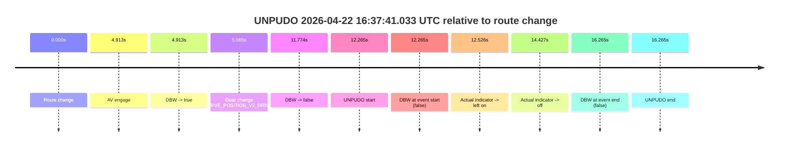
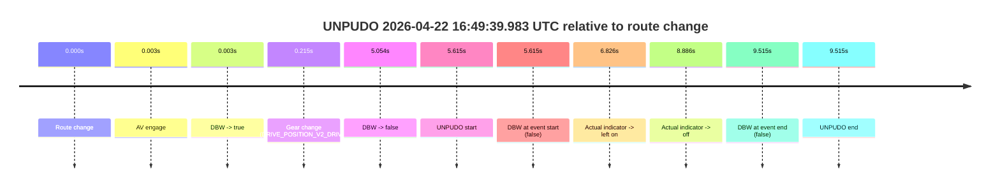
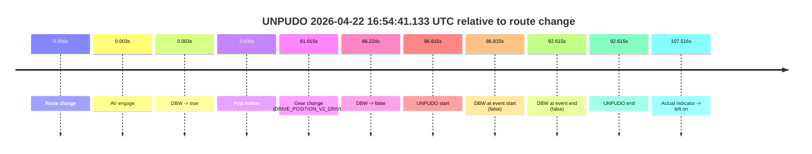
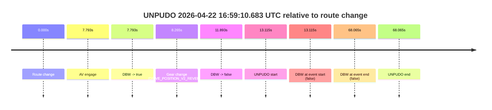
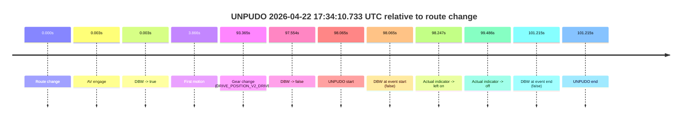

# Run Report: fme10011/2026-04-22--16-24-19--gen2-av-c23a3e84-3c79-4aca-9235-ec3d393b1ae7

| Field | Value |
|---|---|
| Run ID | `fme10011/2026-04-22--16-24-19--gen2-av-c23a3e84-3c79-4aca-9235-ec3d393b1ae7` |
| Date | `2026-04-22` |
| Model(s) | `pink-manta-ray-smooth` |
| Author | `guy.geva` |
| Event count | `8` |

## unpudo 2026-04-22 16:32:39.033 UTC

| Field | Value |
|---|---|
| Model | `pink-manta-ray-smooth` |
| Author | `guy.geva` |
| Run ID | `fme10011/2026-04-22--16-24-19--gen2-av-c23a3e84-3c79-4aca-9235-ec3d393b1ae7` |
| Date | `2026-04-22` |
| Time (UTC) | `16:32:39.033` |
| Event type | `unpudo` |
| Disengagement type | `none observed` |
| Route change | `found` |
| Console | [run](https://console.sso.wayve.ai/run/fme10011/2026-04-22--16-24-19--gen2-av-c23a3e84-3c79-4aca-9235-ec3d393b1ae7?id=&time-unixus=1776875559033318) |
| Foxglove | [segment](https://app.foxglove.dev/wayve-on-prem/p/prj_0dX18KZdVHg1fmmI/view?ds=foxglove-stream&ds.deviceName=fme10011&ds.start=2026-04-22T16%3A32%3A13.718276Z&ds.end=2026-04-22T16%3A33%3A38.233295Z&layoutId=lay_0e7VD4WIKDQGU73Y&time=2026-04-22T16%3A32%3A39.033318Z) |

### Event card: fail

- Fail: the credited unpudo does not stay AV-owned. The event window starts with DBW false, and the maneuver outcome lands outside a clean AV-owned segment.

| Event | Time (UTC) | Delta from route change |
|---|---:|---:|
| Route change | 2026-04-22 16:32:23.718 | `0.000s` |
| AV engage | 2026-04-22 16:32:23.721 | `0.003s` |
| DBW -> true | 2026-04-22 16:32:23.721 | `0.003s` |
| Gear change (DRIVE_POSITION_V2_DRIVE) | 2026-04-22 16:32:23.983 | `0.265s` |
| DBW -> false | 2026-04-22 16:32:38.522 | `14.804s` |
| UNPUDO start | 2026-04-22 16:32:39.033 | `15.315s` |
| DBW at event start (false) | 2026-04-22 16:32:39.033 | `15.315s` |
| Actual indicator -> left on | 2026-04-22 16:32:40.093 | `16.376s` |
| Actual indicator -> off | 2026-04-22 16:32:41.993 | `18.276s` |
| DBW at event end (true) | 2026-04-22 16:33:28.233 | `64.515s` |
| UNPUDO end | 2026-04-22 16:33:28.233 | `64.515s` |

| Metric | Value |
|---|---|
| Outcome | `fail` |
| Effective failure type | `not_av_owned` |
| Route change status | `found` |
| DBW at event start | `false` |
| DBW at event end | `true` |
| Predicted gear at AV start | `DRIVE_POSITION_V2_PARK` |
| Actual gear at AV start | `DRIVE_POSITION_V2_PARK` |
| Predicted gear at event start | `DRIVE_POSITION_V2_DRIVE` |
| Actual gear at event start | `DRIVE_POSITION_V2_DRIVE` |
| Planned indicator direction | `INDICATORS_STATE_V2_OFF` |
| Controller indicator direction | `INDICATORS_STATE_V2_OFF` |
| Actual indicator direction | `INDICATORS_STATE_V2_OFF` |
| Actual indicator at maneuver end | `INDICATORS_STATE_V2_OFF` |
| Driver accel help in AV | `false` |
| Driver accel help timestamp | `n/a` |
| Max accel pedal pct in AV | `0.0%` |
| Max brake pedal pct in AV | `9.5%` |
| Max speed mps in AV | `0.000` |
| Success timing baseline | `route change` |
| Route -> AV | `0.003s` |
| AV -> event start | `15.312s` |
| AV -> first motion | `n/a` |
| Success baseline -> event start | `15.315s` |
| Success baseline -> first motion | `n/a` |
| AV duration before disengagement | `14.801s` |
| Trajectory waypoint count | `38` |
| Driving-plan step count | `11` |

The scored portion starts from the AV-owned window, not from the pre-AV setup. Route-change search in the stopped pre-event segment was `found`, with the baseline therefore set to route change. At the event anchor the model predicts `DRIVE_POSITION_V2_DRIVE` and the actual gear is `DRIVE_POSITION_V2_DRIVE`. The effective model outcome is `fail` because `not_av_owned.`

### Resolution

| Field | Value |
|---|---|
| Final outcome | `fail` |
| Do we agree with this label? | `yes` |
| Source disengagement type | `none observed` |
| Resolved effective failure type | `not_av_owned` |
| Confidence | `high` |

## unpudo 2026-04-22 16:37:41.033 UTC

| Field | Value |
|---|---|
| Model | `pink-manta-ray-smooth` |
| Author | `guy.geva` |
| Run ID | `fme10011/2026-04-22--16-24-19--gen2-av-c23a3e84-3c79-4aca-9235-ec3d393b1ae7` |
| Date | `2026-04-22` |
| Time (UTC) | `16:37:41.033` |
| Event type | `unpudo` |
| Disengagement type | `none observed` |
| Route change | `found` |
| Console | [run](https://console.sso.wayve.ai/run/fme10011/2026-04-22--16-24-19--gen2-av-c23a3e84-3c79-4aca-9235-ec3d393b1ae7?id=&time-unixus=1776875861033307) |
| Foxglove | [segment](https://app.foxglove.dev/wayve-on-prem/p/prj_0dX18KZdVHg1fmmI/view?ds=foxglove-stream&ds.deviceName=fme10011&ds.start=2026-04-22T16%3A37%3A18.768277Z&ds.end=2026-04-22T16%3A37%3A55.033311Z&layoutId=lay_0e7VD4WIKDQGU73Y&time=2026-04-22T16%3A37%3A41.033307Z) |

### Event card: fail

- Fail: the credited unpudo does not stay AV-owned. The event window starts with DBW false, and the maneuver outcome lands outside a clean AV-owned segment.

| Event | Time (UTC) | Delta from route change |
|---|---:|---:|
| Route change | 2026-04-22 16:37:28.768 | `0.000s` |
| AV engage | 2026-04-22 16:37:33.681 | `4.913s` |
| DBW -> true | 2026-04-22 16:37:33.681 | `4.913s` |
| Gear change (DRIVE_POSITION_V2_DRIVE) | 2026-04-22 16:37:33.833 | `5.065s` |
| DBW -> false | 2026-04-22 16:37:40.542 | `11.774s` |
| UNPUDO start | 2026-04-22 16:37:41.033 | `12.265s` |
| DBW at event start (false) | 2026-04-22 16:37:41.033 | `12.265s` |
| Actual indicator -> left on | 2026-04-22 16:37:41.294 | `12.526s` |
| Actual indicator -> off | 2026-04-22 16:37:43.194 | `14.427s` |
| DBW at event end (false) | 2026-04-22 16:37:45.033 | `16.265s` |
| UNPUDO end | 2026-04-22 16:37:45.033 | `16.265s` |

| Metric | Value |
|---|---|
| Outcome | `fail` |
| Effective failure type | `not_av_owned` |
| Route change status | `found` |
| DBW at event start | `false` |
| DBW at event end | `false` |
| Predicted gear at AV start | `DRIVE_POSITION_V2_DRIVE` |
| Actual gear at AV start | `DRIVE_POSITION_V2_PARK` |
| Predicted gear at event start | `DRIVE_POSITION_V2_DRIVE` |
| Actual gear at event start | `DRIVE_POSITION_V2_DRIVE` |
| Planned indicator direction | `INDICATORS_STATE_V2_LEFT_ON` |
| Controller indicator direction | `INDICATORS_STATE_V2_LEFT_ON` |
| Actual indicator direction | `INDICATORS_STATE_V2_OFF` |
| Actual indicator at maneuver end | `INDICATORS_STATE_V2_OFF` |
| Driver accel help in AV | `false` |
| Driver accel help timestamp | `n/a` |
| Max accel pedal pct in AV | `0.0%` |
| Max brake pedal pct in AV | `12.0%` |
| Max speed mps in AV | `0.000` |
| Success timing baseline | `route change` |
| Route -> AV | `4.913s` |
| AV -> event start | `7.352s` |
| AV -> first motion | `n/a` |
| Success baseline -> event start | `12.265s` |
| Success baseline -> first motion | `n/a` |
| AV duration before disengagement | `6.861s` |
| Trajectory waypoint count | `36` |
| Driving-plan step count | `11` |

The scored portion starts from the AV-owned window, not from the pre-AV setup. Route-change search in the stopped pre-event segment was `found`, with the baseline therefore set to route change. At the event anchor the model predicts `DRIVE_POSITION_V2_DRIVE` and the actual gear is `DRIVE_POSITION_V2_DRIVE`. The effective model outcome is `fail` because `not_av_owned.`

### Resolution

| Field | Value |
|---|---|
| Final outcome | `fail` |
| Do we agree with this label? | `yes` |
| Source disengagement type | `none observed` |
| Resolved effective failure type | `not_av_owned` |
| Confidence | `high` |

## unpudo 2026-04-22 16:42:22.483 UTC

| Field | Value |
|---|---|
| Model | `pink-manta-ray-smooth` |
| Author | `guy.geva` |
| Run ID | `fme10011/2026-04-22--16-24-19--gen2-av-c23a3e84-3c79-4aca-9235-ec3d393b1ae7` |
| Date | `2026-04-22` |
| Time (UTC) | `16:42:22.483` |
| Event type | `unpudo` |
| Disengagement type | `none observed` |
| Route change | `found` |
| Console | [run](https://console.sso.wayve.ai/run/fme10011/2026-04-22--16-24-19--gen2-av-c23a3e84-3c79-4aca-9235-ec3d393b1ae7?id=&time-unixus=1776876142483295) |
| Foxglove | [segment](https://app.foxglove.dev/wayve-on-prem/p/prj_0dX18KZdVHg1fmmI/view?ds=foxglove-stream&ds.deviceName=fme10011&ds.start=2026-04-22T16%3A40%3A45.868325Z&ds.end=2026-04-22T16%3A42%3A37.183312Z&layoutId=lay_0e7VD4WIKDQGU73Y&time=2026-04-22T16%3A42%3A22.483295Z) |

### Event card: fail

- Fail: the credited unpudo does not stay AV-owned. The event window starts with DBW false, and the maneuver outcome lands outside a clean AV-owned segment.

| Event | Time (UTC) | Delta from route change |
|---|---:|---:|
| Route change | 2026-04-22 16:40:55.868 | `0.000s` |
| AV engage | 2026-04-22 16:42:14.501 | `78.633s` |
| DBW -> true | 2026-04-22 16:42:14.501 | `78.633s` |
| Gear change (DRIVE_POSITION_V2_DRIVE) | 2026-04-22 16:42:14.883 | `79.015s` |
| DBW -> false | 2026-04-22 16:42:21.902 | `86.034s` |
| UNPUDO start | 2026-04-22 16:42:22.483 | `86.615s` |
| DBW at event start (false) | 2026-04-22 16:42:22.483 | `86.615s` |
| DBW at event end (false) | 2026-04-22 16:42:27.183 | `91.315s` |
| UNPUDO end | 2026-04-22 16:42:27.183 | `91.315s` |

| Metric | Value |
|---|---|
| Outcome | `fail` |
| Effective failure type | `not_av_owned` |
| Route change status | `found` |
| DBW at event start | `false` |
| DBW at event end | `false` |
| Predicted gear at AV start | `DRIVE_POSITION_V2_DRIVE` |
| Actual gear at AV start | `DRIVE_POSITION_V2_PARK` |
| Predicted gear at event start | `DRIVE_POSITION_V2_DRIVE` |
| Actual gear at event start | `DRIVE_POSITION_V2_DRIVE` |
| Planned indicator direction | `INDICATORS_STATE_V2_LEFT_ON` |
| Controller indicator direction | `INDICATORS_STATE_V2_LEFT_ON` |
| Actual indicator direction | `INDICATORS_STATE_V2_OFF` |
| Actual indicator at maneuver end | `INDICATORS_STATE_V2_OFF` |
| Driver accel help in AV | `false` |
| Driver accel help timestamp | `n/a` |
| Max accel pedal pct in AV | `0.0%` |
| Max brake pedal pct in AV | `11.7%` |
| Max speed mps in AV | `0.000` |
| Success timing baseline | `route change` |
| Route -> AV | `78.633s` |
| AV -> event start | `7.982s` |
| AV -> first motion | `n/a` |
| Success baseline -> event start | `86.615s` |
| Success baseline -> first motion | `n/a` |
| AV duration before disengagement | `7.401s` |
| Trajectory waypoint count | `37` |
| Driving-plan step count | `11` |

The scored portion starts from the AV-owned window, not from the pre-AV setup. Route-change search in the stopped pre-event segment was `found`, with the baseline therefore set to route change. At the event anchor the model predicts `DRIVE_POSITION_V2_DRIVE` and the actual gear is `DRIVE_POSITION_V2_DRIVE`. The effective model outcome is `fail` because `not_av_owned.`

### Resolution

| Field | Value |
|---|---|
| Final outcome | `fail` |
| Do we agree with this label? | `yes` |
| Source disengagement type | `none observed` |
| Resolved effective failure type | `not_av_owned` |
| Confidence | `high` |

## unpudo 2026-04-22 16:49:39.983 UTC

| Field | Value |
|---|---|
| Model | `pink-manta-ray-smooth` |
| Author | `guy.geva` |
| Run ID | `fme10011/2026-04-22--16-24-19--gen2-av-c23a3e84-3c79-4aca-9235-ec3d393b1ae7` |
| Date | `2026-04-22` |
| Time (UTC) | `16:49:39.983` |
| Event type | `unpudo` |
| Disengagement type | `none observed` |
| Route change | `found` |
| Console | [run](https://console.sso.wayve.ai/run/fme10011/2026-04-22--16-24-19--gen2-av-c23a3e84-3c79-4aca-9235-ec3d393b1ae7?id=&time-unixus=1776876579983301) |
| Foxglove | [segment](https://app.foxglove.dev/wayve-on-prem/p/prj_0dX18KZdVHg1fmmI/view?ds=foxglove-stream&ds.deviceName=fme10011&ds.start=2026-04-22T16%3A49%3A24.368261Z&ds.end=2026-04-22T16%3A49%3A53.883308Z&layoutId=lay_0e7VD4WIKDQGU73Y&time=2026-04-22T16%3A49%3A39.983301Z) |

### Event card: fail

- Fail: the credited unpudo does not stay AV-owned. The event window starts with DBW false, and the maneuver outcome lands outside a clean AV-owned segment.

| Event | Time (UTC) | Delta from route change |
|---|---:|---:|
| Route change | 2026-04-22 16:49:34.368 | `0.000s` |
| AV engage | 2026-04-22 16:49:34.371 | `0.003s` |
| DBW -> true | 2026-04-22 16:49:34.371 | `0.003s` |
| Gear change (DRIVE_POSITION_V2_DRIVE) | 2026-04-22 16:49:34.583 | `0.215s` |
| DBW -> false | 2026-04-22 16:49:39.422 | `5.054s` |
| UNPUDO start | 2026-04-22 16:49:39.983 | `5.615s` |
| DBW at event start (false) | 2026-04-22 16:49:39.983 | `5.615s` |
| Actual indicator -> left on | 2026-04-22 16:49:41.194 | `6.826s` |
| Actual indicator -> off | 2026-04-22 16:49:43.254 | `8.886s` |
| DBW at event end (false) | 2026-04-22 16:49:43.883 | `9.515s` |
| UNPUDO end | 2026-04-22 16:49:43.883 | `9.515s` |

| Metric | Value |
|---|---|
| Outcome | `fail` |
| Effective failure type | `not_av_owned` |
| Route change status | `found` |
| DBW at event start | `false` |
| DBW at event end | `false` |
| Predicted gear at AV start | `DRIVE_POSITION_V2_PARK` |
| Actual gear at AV start | `DRIVE_POSITION_V2_PARK` |
| Predicted gear at event start | `DRIVE_POSITION_V2_DRIVE` |
| Actual gear at event start | `DRIVE_POSITION_V2_DRIVE` |
| Planned indicator direction | `INDICATORS_STATE_V2_LEFT_ON` |
| Controller indicator direction | `INDICATORS_STATE_V2_LEFT_ON` |
| Actual indicator direction | `INDICATORS_STATE_V2_OFF` |
| Actual indicator at maneuver end | `INDICATORS_STATE_V2_OFF` |
| Driver accel help in AV | `false` |
| Driver accel help timestamp | `n/a` |
| Max accel pedal pct in AV | `0.0%` |
| Max brake pedal pct in AV | `12.0%` |
| Max speed mps in AV | `0.000` |
| Success timing baseline | `route change` |
| Route -> AV | `0.003s` |
| AV -> event start | `5.612s` |
| AV -> first motion | `n/a` |
| Success baseline -> event start | `5.615s` |
| Success baseline -> first motion | `n/a` |
| AV duration before disengagement | `5.051s` |
| Trajectory waypoint count | `37` |
| Driving-plan step count | `11` |

The scored portion starts from the AV-owned window, not from the pre-AV setup. Route-change search in the stopped pre-event segment was `found`, with the baseline therefore set to route change. At the event anchor the model predicts `DRIVE_POSITION_V2_DRIVE` and the actual gear is `DRIVE_POSITION_V2_DRIVE`. The effective model outcome is `fail` because `not_av_owned.`

### Resolution

| Field | Value |
|---|---|
| Final outcome | `fail` |
| Do we agree with this label? | `yes` |
| Source disengagement type | `none observed` |
| Resolved effective failure type | `not_av_owned` |
| Confidence | `high` |

## unpudo 2026-04-22 16:54:41.133 UTC

| Field | Value |
|---|---|
| Model | `pink-manta-ray-smooth` |
| Author | `guy.geva` |
| Run ID | `fme10011/2026-04-22--16-24-19--gen2-av-c23a3e84-3c79-4aca-9235-ec3d393b1ae7` |
| Date | `2026-04-22` |
| Time (UTC) | `16:54:41.133` |
| Event type | `unpudo` |
| Disengagement type | `none observed` |
| Route change | `found` |
| Console | [run](https://console.sso.wayve.ai/run/fme10011/2026-04-22--16-24-19--gen2-av-c23a3e84-3c79-4aca-9235-ec3d393b1ae7?id=&time-unixus=1776876881133303) |
| Foxglove | [segment](https://app.foxglove.dev/wayve-on-prem/p/prj_0dX18KZdVHg1fmmI/view?ds=foxglove-stream&ds.deviceName=fme10011&ds.start=2026-04-22T16%3A53%3A04.318247Z&ds.end=2026-04-22T16%3A54%3A56.933315Z&layoutId=lay_0e7VD4WIKDQGU73Y&time=2026-04-22T16%3A54%3A41.133303Z) |

### Event card: fail

- Fail: the credited unpudo does not stay AV-owned. The event window starts with DBW false, and the maneuver outcome lands outside a clean AV-owned segment.

| Event | Time (UTC) | Delta from route change |
|---|---:|---:|
| Route change | 2026-04-22 16:53:14.318 | `0.000s` |
| AV engage | 2026-04-22 16:53:14.321 | `0.003s` |
| DBW -> true | 2026-04-22 16:53:14.321 | `0.003s` |
| First motion | 2026-04-22 16:53:18.154 | `3.836s` |
| Gear change (DRIVE_POSITION_V2_DRIVE) | 2026-04-22 16:54:35.333 | `81.015s` |
| DBW -> false | 2026-04-22 16:54:40.542 | `86.224s` |
| UNPUDO start | 2026-04-22 16:54:41.133 | `86.815s` |
| DBW at event start (false) | 2026-04-22 16:54:41.133 | `86.815s` |
| DBW at event end (false) | 2026-04-22 16:54:46.933 | `92.615s` |
| UNPUDO end | 2026-04-22 16:54:46.933 | `92.615s` |
| Actual indicator -> left on | 2026-04-22 16:55:01.833 | `107.516s` |

| Metric | Value |
|---|---|
| Outcome | `fail` |
| Effective failure type | `not_av_owned` |
| Route change status | `found` |
| DBW at event start | `false` |
| DBW at event end | `false` |
| Predicted gear at AV start | `DRIVE_POSITION_V2_PARK` |
| Actual gear at AV start | `DRIVE_POSITION_V2_PARK` |
| Predicted gear at event start | `DRIVE_POSITION_V2_DRIVE` |
| Actual gear at event start | `DRIVE_POSITION_V2_DRIVE` |
| Planned indicator direction | `INDICATORS_STATE_V2_OFF` |
| Controller indicator direction | `INDICATORS_STATE_V2_OFF` |
| Actual indicator direction | `INDICATORS_STATE_V2_OFF` |
| Actual indicator at maneuver end | `INDICATORS_STATE_V2_OFF` |
| Driver accel help in AV | `false` |
| Driver accel help timestamp | `n/a` |
| Max accel pedal pct in AV | `0.0%` |
| Max brake pedal pct in AV | `9.1%` |
| Max speed mps in AV | `9.006` |
| Success timing baseline | `route change` |
| Route -> AV | `0.003s` |
| AV -> event start | `86.812s` |
| AV -> first motion | `3.833s` |
| Success baseline -> event start | `86.815s` |
| Success baseline -> first motion | `3.836s` |
| AV duration before disengagement | `86.221s` |
| Trajectory waypoint count | `36` |
| Driving-plan step count | `11` |

The scored portion starts from the AV-owned window, not from the pre-AV setup. Route-change search in the stopped pre-event segment was `found`, with the baseline therefore set to route change. At the event anchor the model predicts `DRIVE_POSITION_V2_DRIVE` and the actual gear is `DRIVE_POSITION_V2_DRIVE`. The effective model outcome is `fail` because `not_av_owned.`

### Resolution

| Field | Value |
|---|---|
| Final outcome | `fail` |
| Do we agree with this label? | `yes` |
| Source disengagement type | `none observed` |
| Resolved effective failure type | `not_av_owned` |
| Confidence | `high` |

## unpudo 2026-04-22 16:59:10.683 UTC

| Field | Value |
|---|---|
| Model | `pink-manta-ray-smooth` |
| Author | `guy.geva` |
| Run ID | `fme10011/2026-04-22--16-24-19--gen2-av-c23a3e84-3c79-4aca-9235-ec3d393b1ae7` |
| Date | `2026-04-22` |
| Time (UTC) | `16:59:10.683` |
| Event type | `unpudo` |
| Disengagement type | `none observed` |
| Route change | `found` |
| Console | [run](https://console.sso.wayve.ai/run/fme10011/2026-04-22--16-24-19--gen2-av-c23a3e84-3c79-4aca-9235-ec3d393b1ae7?id=&time-unixus=1776877150683299) |
| Foxglove | [segment](https://app.foxglove.dev/wayve-on-prem/p/prj_0dX18KZdVHg1fmmI/view?ds=foxglove-stream&ds.deviceName=fme10011&ds.start=2026-04-22T16%3A58%3A47.568380Z&ds.end=2026-04-22T17%3A00%3A15.633305Z&layoutId=lay_0e7VD4WIKDQGU73Y&time=2026-04-22T16%3A59%3A10.683299Z) |

### Event card: fail

- Fail: the credited unpudo does not stay AV-owned. The event window starts with DBW false, and the maneuver outcome lands outside a clean AV-owned segment.

| Event | Time (UTC) | Delta from route change |
|---|---:|---:|
| Route change | 2026-04-22 16:58:57.568 | `0.000s` |
| AV engage | 2026-04-22 16:59:05.361 | `7.793s` |
| DBW -> true | 2026-04-22 16:59:05.361 | `7.793s` |
| Gear change (DRIVE_POSITION_V2_REVERSE) | 2026-04-22 16:59:05.833 | `8.265s` |
| DBW -> false | 2026-04-22 16:59:09.461 | `11.893s` |
| UNPUDO start | 2026-04-22 16:59:10.683 | `13.115s` |
| DBW at event start (false) | 2026-04-22 16:59:10.683 | `13.115s` |
| DBW at event end (false) | 2026-04-22 17:00:05.633 | `68.065s` |
| UNPUDO end | 2026-04-22 17:00:05.633 | `68.065s` |

| Metric | Value |
|---|---|
| Outcome | `fail` |
| Effective failure type | `not_av_owned` |
| Route change status | `found` |
| DBW at event start | `false` |
| DBW at event end | `false` |
| Predicted gear at AV start | `DRIVE_POSITION_V2_REVERSE` |
| Actual gear at AV start | `DRIVE_POSITION_V2_PARK` |
| Predicted gear at event start | `DRIVE_POSITION_V2_REVERSE` |
| Actual gear at event start | `DRIVE_POSITION_V2_REVERSE` |
| Planned indicator direction | `INDICATORS_STATE_V2_OFF` |
| Controller indicator direction | `INDICATORS_STATE_V2_OFF` |
| Actual indicator direction | `INDICATORS_STATE_V2_OFF` |
| Actual indicator at maneuver end | `INDICATORS_STATE_V2_OFF` |
| Driver accel help in AV | `false` |
| Driver accel help timestamp | `n/a` |
| Max accel pedal pct in AV | `0.0%` |
| Max brake pedal pct in AV | `8.0%` |
| Max speed mps in AV | `0.000` |
| Success timing baseline | `route change` |
| Route -> AV | `7.793s` |
| AV -> event start | `5.322s` |
| AV -> first motion | `n/a` |
| Success baseline -> event start | `13.115s` |
| Success baseline -> first motion | `n/a` |
| AV duration before disengagement | `4.100s` |
| Trajectory waypoint count | `37` |
| Driving-plan step count | `11` |

The scored portion starts from the AV-owned window, not from the pre-AV setup. Route-change search in the stopped pre-event segment was `found`, with the baseline therefore set to route change. At the event anchor the model predicts `DRIVE_POSITION_V2_REVERSE` and the actual gear is `DRIVE_POSITION_V2_REVERSE`. The effective model outcome is `fail` because `not_av_owned.`

### Resolution

| Field | Value |
|---|---|
| Final outcome | `fail` |
| Do we agree with this label? | `yes` |
| Source disengagement type | `none observed` |
| Resolved effective failure type | `not_av_owned` |
| Confidence | `high` |

## unpudo 2026-04-22 17:25:57.483 UTC

| Field | Value |
|---|---|
| Model | `pink-manta-ray-smooth` |
| Author | `guy.geva` |
| Run ID | `fme10011/2026-04-22--16-24-19--gen2-av-c23a3e84-3c79-4aca-9235-ec3d393b1ae7` |
| Date | `2026-04-22` |
| Time (UTC) | `17:25:57.483` |
| Event type | `unpudo` |
| Disengagement type | `none observed` |
| Route change | `found` |
| Console | [run](https://console.sso.wayve.ai/run/fme10011/2026-04-22--16-24-19--gen2-av-c23a3e84-3c79-4aca-9235-ec3d393b1ae7?id=&time-unixus=1776878757483301) |
| Foxglove | [segment](https://app.foxglove.dev/wayve-on-prem/p/prj_0dX18KZdVHg1fmmI/view?ds=foxglove-stream&ds.deviceName=fme10011&ds.start=2026-04-22T17%3A25%3A39.868332Z&ds.end=2026-04-22T17%3A26%3A10.783318Z&layoutId=lay_0e7VD4WIKDQGU73Y&time=2026-04-22T17%3A25%3A57.483301Z) |

### Event card: fail

- Fail: the credited unpudo does not stay AV-owned. The event window starts with DBW false, and the maneuver outcome lands outside a clean AV-owned segment.

| Event | Time (UTC) | Delta from route change |
|---|---:|---:|
| Route change | 2026-04-22 17:25:49.868 | `0.000s` |
| AV engage | 2026-04-22 17:25:49.871 | `0.003s` |
| DBW -> true | 2026-04-22 17:25:49.871 | `0.003s` |
| Gear change (DRIVE_POSITION_V2_DRIVE) | 2026-04-22 17:25:50.133 | `0.265s` |
| DBW -> false | 2026-04-22 17:25:56.982 | `7.114s` |
| UNPUDO start | 2026-04-22 17:25:57.483 | `7.615s` |
| DBW at event start (false) | 2026-04-22 17:25:57.483 | `7.615s` |
| DBW at event end (false) | 2026-04-22 17:26:00.783 | `10.915s` |
| UNPUDO end | 2026-04-22 17:26:00.783 | `10.915s` |

| Metric | Value |
|---|---|
| Outcome | `fail` |
| Effective failure type | `not_av_owned` |
| Route change status | `found` |
| DBW at event start | `false` |
| DBW at event end | `false` |
| Predicted gear at AV start | `DRIVE_POSITION_V2_PARK` |
| Actual gear at AV start | `DRIVE_POSITION_V2_PARK` |
| Predicted gear at event start | `DRIVE_POSITION_V2_DRIVE` |
| Actual gear at event start | `DRIVE_POSITION_V2_DRIVE` |
| Planned indicator direction | `INDICATORS_STATE_V2_OFF` |
| Controller indicator direction | `INDICATORS_STATE_V2_OFF` |
| Actual indicator direction | `INDICATORS_STATE_V2_OFF` |
| Actual indicator at maneuver end | `INDICATORS_STATE_V2_OFF` |
| Driver accel help in AV | `false` |
| Driver accel help timestamp | `n/a` |
| Max accel pedal pct in AV | `0.0%` |
| Max brake pedal pct in AV | `8.0%` |
| Max speed mps in AV | `0.000` |
| Success timing baseline | `route change` |
| Route -> AV | `0.003s` |
| AV -> event start | `7.612s` |
| AV -> first motion | `n/a` |
| Success baseline -> event start | `7.615s` |
| Success baseline -> first motion | `n/a` |
| AV duration before disengagement | `7.111s` |
| Trajectory waypoint count | `37` |
| Driving-plan step count | `11` |

The scored portion starts from the AV-owned window, not from the pre-AV setup. Route-change search in the stopped pre-event segment was `found`, with the baseline therefore set to route change. At the event anchor the model predicts `DRIVE_POSITION_V2_DRIVE` and the actual gear is `DRIVE_POSITION_V2_DRIVE`. The effective model outcome is `fail` because `not_av_owned.`

### Resolution

| Field | Value |
|---|---|
| Final outcome | `fail` |
| Do we agree with this label? | `yes` |
| Source disengagement type | `none observed` |
| Resolved effective failure type | `not_av_owned` |
| Confidence | `high` |

## unpudo 2026-04-22 17:34:10.733 UTC

| Field | Value |
|---|---|
| Model | `pink-manta-ray-smooth` |
| Author | `guy.geva` |
| Run ID | `fme10011/2026-04-22--16-24-19--gen2-av-c23a3e84-3c79-4aca-9235-ec3d393b1ae7` |
| Date | `2026-04-22` |
| Time (UTC) | `17:34:10.733` |
| Event type | `unpudo` |
| Disengagement type | `none observed` |
| Route change | `found` |
| Console | [run](https://console.sso.wayve.ai/run/fme10011/2026-04-22--16-24-19--gen2-av-c23a3e84-3c79-4aca-9235-ec3d393b1ae7?id=&time-unixus=1776879250733317) |
| Foxglove | [segment](https://app.foxglove.dev/wayve-on-prem/p/prj_0dX18KZdVHg1fmmI/view?ds=foxglove-stream&ds.deviceName=fme10011&ds.start=2026-04-22T17%3A32%3A22.668279Z&ds.end=2026-04-22T17%3A34%3A23.883303Z&layoutId=lay_0e7VD4WIKDQGU73Y&time=2026-04-22T17%3A34%3A10.733317Z) |

### Event card: fail

- Fail: the credited unpudo does not stay AV-owned. The event window starts with DBW false, and the maneuver outcome lands outside a clean AV-owned segment.

| Event | Time (UTC) | Delta from route change |
|---|---:|---:|
| Route change | 2026-04-22 17:32:32.668 | `0.000s` |
| AV engage | 2026-04-22 17:32:32.671 | `0.003s` |
| DBW -> true | 2026-04-22 17:32:32.671 | `0.003s` |
| First motion | 2026-04-22 17:32:36.533 | `3.866s` |
| Gear change (DRIVE_POSITION_V2_DRIVE) | 2026-04-22 17:34:06.033 | `93.365s` |
| DBW -> false | 2026-04-22 17:34:10.222 | `97.554s` |
| UNPUDO start | 2026-04-22 17:34:10.733 | `98.065s` |
| DBW at event start (false) | 2026-04-22 17:34:10.733 | `98.065s` |
| Actual indicator -> left on | 2026-04-22 17:34:10.914 | `98.247s` |
| Actual indicator -> off | 2026-04-22 17:34:12.154 | `99.486s` |
| DBW at event end (false) | 2026-04-22 17:34:13.883 | `101.215s` |
| UNPUDO end | 2026-04-22 17:34:13.883 | `101.215s` |

| Metric | Value |
|---|---|
| Outcome | `fail` |
| Effective failure type | `not_av_owned` |
| Route change status | `found` |
| DBW at event start | `false` |
| DBW at event end | `false` |
| Predicted gear at AV start | `DRIVE_POSITION_V2_PARK` |
| Actual gear at AV start | `DRIVE_POSITION_V2_PARK` |
| Predicted gear at event start | `DRIVE_POSITION_V2_DRIVE` |
| Actual gear at event start | `DRIVE_POSITION_V2_DRIVE` |
| Planned indicator direction | `INDICATORS_STATE_V2_OFF` |
| Controller indicator direction | `INDICATORS_STATE_V2_OFF` |
| Actual indicator direction | `INDICATORS_STATE_V2_OFF` |
| Actual indicator at maneuver end | `INDICATORS_STATE_V2_OFF` |
| Driver accel help in AV | `false` |
| Driver accel help timestamp | `n/a` |
| Max accel pedal pct in AV | `0.0%` |
| Max brake pedal pct in AV | `17.1%` |
| Max speed mps in AV | `8.878` |
| Success timing baseline | `route change` |
| Route -> AV | `0.003s` |
| AV -> event start | `98.062s` |
| AV -> first motion | `3.863s` |
| Success baseline -> event start | `98.065s` |
| Success baseline -> first motion | `3.866s` |
| AV duration before disengagement | `97.551s` |
| Trajectory waypoint count | `38` |
| Driving-plan step count | `11` |

The scored portion starts from the AV-owned window, not from the pre-AV setup. Route-change search in the stopped pre-event segment was `found`, with the baseline therefore set to route change. At the event anchor the model predicts `DRIVE_POSITION_V2_DRIVE` and the actual gear is `DRIVE_POSITION_V2_DRIVE`. The effective model outcome is `fail` because `not_av_owned.`

### Resolution

| Field | Value |
|---|---|
| Final outcome | `fail` |
| Do we agree with this label? | `yes` |
| Source disengagement type | `none observed` |
| Resolved effective failure type | `not_av_owned` |
| Confidence | `high` |
