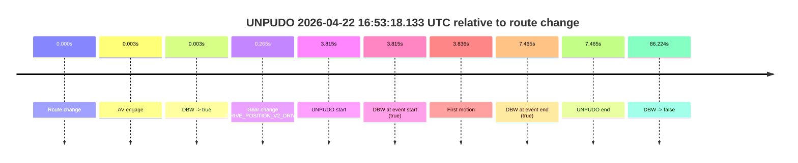
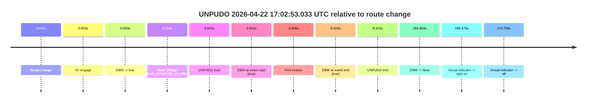
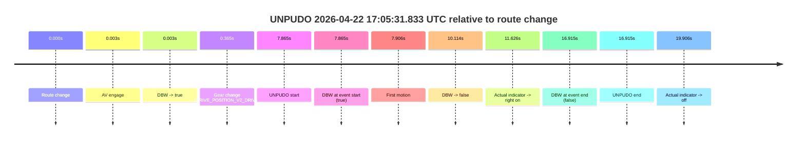
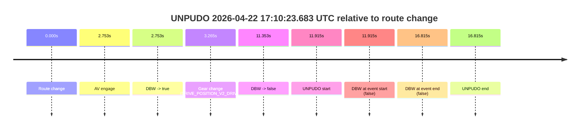
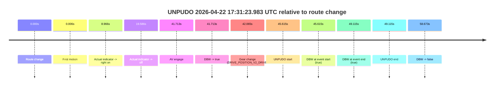
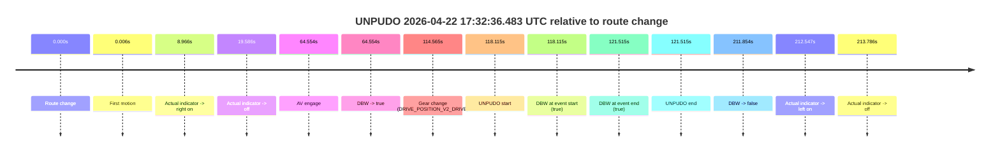
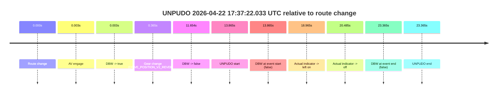

# Run Report: fme10011/2026-04-22--16-24-19--gen2-av-c23a3e84-3c79-4aca-9235-ec3d393b1ae7

| Field | Value |
|---|---|
| Run ID | `fme10011/2026-04-22--16-24-19--gen2-av-c23a3e84-3c79-4aca-9235-ec3d393b1ae7` |
| Date | `2026-04-22` |
| Model(s) | `eel-teal-outspoken` |
| Author | `zak` |
| Event count | `7` |

## unpudo 2026-04-22 16:53:18.133 UTC

| Field | Value |
|---|---|
| Model | `eel-teal-outspoken` |
| Author | `zak` |
| Run ID | `fme10011/2026-04-22--16-24-19--gen2-av-c23a3e84-3c79-4aca-9235-ec3d393b1ae7` |
| Date | `2026-04-22` |
| Time (UTC) | `16:53:18.133` |
| Event type | `unpudo` |
| Disengagement type | `none observed` |
| Route change | `found` |
| Console | [run](https://console.sso.wayve.ai/run/fme10011/2026-04-22--16-24-19--gen2-av-c23a3e84-3c79-4aca-9235-ec3d393b1ae7?id=&time-unixus=1776876798133303) |
| Foxglove | [segment](https://app.foxglove.dev/wayve-on-prem/p/prj_0dX18KZdVHg1fmmI/view?ds=foxglove-stream&ds.deviceName=fme10011&ds.start=2026-04-22T16%3A53%3A04.318247Z&ds.end=2026-04-22T16%3A54%3A50.542315Z&layoutId=lay_0e7VD4WIKDQGU73Y&time=2026-04-22T16%3A53%3A18.133303Z) |

### Event card: pass

- Pass: AV owns the credited unpudo from route change through the official unpudo window, the gear state is aligned at the anchor, and the vehicle moves without driver accelerator help in AV.

| Event | Time (UTC) | Delta from route change |
|---|---:|---:|
| Route change | 2026-04-22 16:53:14.318 | `0.000s` |
| AV engage | 2026-04-22 16:53:14.321 | `0.003s` |
| DBW -> true | 2026-04-22 16:53:14.321 | `0.003s` |
| Gear change (DRIVE_POSITION_V2_DRIVE) | 2026-04-22 16:53:14.583 | `0.265s` |
| UNPUDO start | 2026-04-22 16:53:18.133 | `3.815s` |
| DBW at event start (true) | 2026-04-22 16:53:18.133 | `3.815s` |
| First motion | 2026-04-22 16:53:18.154 | `3.836s` |
| DBW at event end (true) | 2026-04-22 16:53:21.783 | `7.465s` |
| UNPUDO end | 2026-04-22 16:53:21.783 | `7.465s` |
| DBW -> false | 2026-04-22 16:54:40.542 | `86.224s` |

| Metric | Value |
|---|---|
| Outcome | `pass` |
| Effective failure type | `none` |
| Route change status | `found` |
| DBW at event start | `true` |
| DBW at event end | `true` |
| Predicted gear at AV start | `DRIVE_POSITION_V2_PARK` |
| Actual gear at AV start | `DRIVE_POSITION_V2_PARK` |
| Predicted gear at event start | `DRIVE_POSITION_V2_DRIVE` |
| Actual gear at event start | `DRIVE_POSITION_V2_DRIVE` |
| Planned indicator direction | `INDICATORS_STATE_V2_LEFT_ON` |
| Controller indicator direction | `INDICATORS_STATE_V2_LEFT_ON` |
| Actual indicator direction | `INDICATORS_STATE_V2_OFF` |
| Actual indicator at maneuver end | `INDICATORS_STATE_V2_OFF` |
| Driver accel help in AV | `false` |
| Driver accel help timestamp | `n/a` |
| Max accel pedal pct in AV | `0.0%` |
| Max brake pedal pct in AV | `8.0%` |
| Max speed mps in AV | `5.031` |
| Success timing baseline | `route change` |
| Route -> AV | `0.003s` |
| AV -> event start | `3.812s` |
| AV -> first motion | `3.833s` |
| Success baseline -> event start | `3.815s` |
| Success baseline -> first motion | `3.836s` |
| AV duration before disengagement | `86.221s` |
| Trajectory waypoint count | `38` |
| Driving-plan step count | `11` |

The scored portion starts from the AV-owned window, not from the pre-AV setup. Route-change search in the stopped pre-event segment was `found`, with the baseline therefore set to route change. At the event anchor the model predicts `DRIVE_POSITION_V2_DRIVE` and the actual gear is `DRIVE_POSITION_V2_DRIVE`. The effective model outcome is `pass` because `the credited unpudo stays AV-owned through the official unpudo window.`

### Resolution

| Field | Value |
|---|---|
| Final outcome | `pass` |
| Do we agree with this label? | `yes` |
| Source disengagement type | `none observed` |
| Resolved effective failure type | `none` |
| Confidence | `high` |

## unpudo 2026-04-22 17:02:53.033 UTC

| Field | Value |
|---|---|
| Model | `eel-teal-outspoken` |
| Author | `zak` |
| Run ID | `fme10011/2026-04-22--16-24-19--gen2-av-c23a3e84-3c79-4aca-9235-ec3d393b1ae7` |
| Date | `2026-04-22` |
| Time (UTC) | `17:02:53.033` |
| Event type | `unpudo` |
| Disengagement type | `none observed` |
| Route change | `found` |
| Console | [run](https://console.sso.wayve.ai/run/fme10011/2026-04-22--16-24-19--gen2-av-c23a3e84-3c79-4aca-9235-ec3d393b1ae7?id=&time-unixus=1776877373033318) |
| Foxglove | [segment](https://app.foxglove.dev/wayve-on-prem/p/prj_0dX18KZdVHg1fmmI/view?ds=foxglove-stream&ds.deviceName=fme10011&ds.start=2026-04-22T17%3A02%3A39.118256Z&ds.end=2026-04-22T17%3A05%3A44.081795Z&layoutId=lay_0e7VD4WIKDQGU73Y&time=2026-04-22T17%3A02%3A53.033318Z) |

### Event card: pass

- Pass: AV owns the credited unpudo from route change through the official unpudo window, the gear state is aligned at the anchor, and the vehicle moves without driver accelerator help in AV.

| Event | Time (UTC) | Delta from route change |
|---|---:|---:|
| Route change | 2026-04-22 17:02:49.118 | `0.000s` |
| AV engage | 2026-04-22 17:02:49.121 | `0.003s` |
| DBW -> true | 2026-04-22 17:02:49.121 | `0.003s` |
| Gear change (DRIVE_POSITION_V2_DRIVE) | 2026-04-22 17:02:49.433 | `0.315s` |
| UNPUDO start | 2026-04-22 17:02:53.033 | `3.915s` |
| DBW at event start (true) | 2026-04-22 17:02:53.033 | `3.915s` |
| First motion | 2026-04-22 17:02:53.074 | `3.956s` |
| DBW at event end (true) | 2026-04-22 17:02:57.433 | `8.315s` |
| UNPUDO end | 2026-04-22 17:02:57.433 | `8.315s` |
| DBW -> false | 2026-04-22 17:05:34.081 | `164.964s` |
| Actual indicator -> right on | 2026-04-22 17:05:35.593 | `166.476s` |
| Actual indicator -> off | 2026-04-22 17:05:43.873 | `174.756s` |

| Metric | Value |
|---|---|
| Outcome | `pass` |
| Effective failure type | `none` |
| Route change status | `found` |
| DBW at event start | `true` |
| DBW at event end | `true` |
| Predicted gear at AV start | `DRIVE_POSITION_V2_PARK` |
| Actual gear at AV start | `DRIVE_POSITION_V2_PARK` |
| Predicted gear at event start | `DRIVE_POSITION_V2_DRIVE` |
| Actual gear at event start | `DRIVE_POSITION_V2_DRIVE` |
| Planned indicator direction | `INDICATORS_STATE_V2_LEFT_ON` |
| Controller indicator direction | `INDICATORS_STATE_V2_LEFT_ON` |
| Actual indicator direction | `INDICATORS_STATE_V2_OFF` |
| Actual indicator at maneuver end | `INDICATORS_STATE_V2_OFF` |
| Driver accel help in AV | `false` |
| Driver accel help timestamp | `n/a` |
| Max accel pedal pct in AV | `0.0%` |
| Max brake pedal pct in AV | `8.0%` |
| Max speed mps in AV | `4.633` |
| Success timing baseline | `route change` |
| Route -> AV | `0.003s` |
| AV -> event start | `3.912s` |
| AV -> first motion | `3.953s` |
| Success baseline -> event start | `3.915s` |
| Success baseline -> first motion | `3.956s` |
| AV duration before disengagement | `164.961s` |
| Trajectory waypoint count | `38` |
| Driving-plan step count | `11` |

The scored portion starts from the AV-owned window, not from the pre-AV setup. Route-change search in the stopped pre-event segment was `found`, with the baseline therefore set to route change. At the event anchor the model predicts `DRIVE_POSITION_V2_DRIVE` and the actual gear is `DRIVE_POSITION_V2_DRIVE`. The effective model outcome is `pass` because `the credited unpudo stays AV-owned through the official unpudo window.`

### Resolution

| Field | Value |
|---|---|
| Final outcome | `pass` |
| Do we agree with this label? | `yes` |
| Source disengagement type | `none observed` |
| Resolved effective failure type | `none` |
| Confidence | `high` |

## unpudo 2026-04-22 17:05:31.833 UTC

| Field | Value |
|---|---|
| Model | `eel-teal-outspoken` |
| Author | `zak` |
| Run ID | `fme10011/2026-04-22--16-24-19--gen2-av-c23a3e84-3c79-4aca-9235-ec3d393b1ae7` |
| Date | `2026-04-22` |
| Time (UTC) | `17:05:31.833` |
| Event type | `unpudo` |
| Disengagement type | `none observed` |
| Route change | `found` |
| Console | [run](https://console.sso.wayve.ai/run/fme10011/2026-04-22--16-24-19--gen2-av-c23a3e84-3c79-4aca-9235-ec3d393b1ae7?id=&time-unixus=1776877531833303) |
| Foxglove | [segment](https://app.foxglove.dev/wayve-on-prem/p/prj_0dX18KZdVHg1fmmI/view?ds=foxglove-stream&ds.deviceName=fme10011&ds.start=2026-04-22T17%3A05%3A13.968285Z&ds.end=2026-04-22T17%3A05%3A50.883321Z&layoutId=lay_0e7VD4WIKDQGU73Y&time=2026-04-22T17%3A05%3A31.833303Z) |

### Event card: fail

- Fail: the credited unpudo does not stay AV-owned. The event window starts with DBW true, and the maneuver outcome lands outside a clean AV-owned segment.

| Event | Time (UTC) | Delta from route change |
|---|---:|---:|
| Route change | 2026-04-22 17:05:23.968 | `0.000s` |
| AV engage | 2026-04-22 17:05:23.971 | `0.003s` |
| DBW -> true | 2026-04-22 17:05:23.971 | `0.003s` |
| Gear change (DRIVE_POSITION_V2_DRIVE) | 2026-04-22 17:05:24.333 | `0.365s` |
| UNPUDO start | 2026-04-22 17:05:31.833 | `7.865s` |
| DBW at event start (true) | 2026-04-22 17:05:31.833 | `7.865s` |
| First motion | 2026-04-22 17:05:31.874 | `7.906s` |
| DBW -> false | 2026-04-22 17:05:34.081 | `10.114s` |
| Actual indicator -> right on | 2026-04-22 17:05:35.593 | `11.626s` |
| DBW at event end (false) | 2026-04-22 17:05:40.883 | `16.915s` |
| UNPUDO end | 2026-04-22 17:05:40.883 | `16.915s` |
| Actual indicator -> off | 2026-04-22 17:05:43.873 | `19.906s` |

| Metric | Value |
|---|---|
| Outcome | `fail` |
| Effective failure type | `driver_completed_maneuver` |
| Route change status | `found` |
| DBW at event start | `true` |
| DBW at event end | `false` |
| Predicted gear at AV start | `DRIVE_POSITION_V2_PARK` |
| Actual gear at AV start | `DRIVE_POSITION_V2_PARK` |
| Predicted gear at event start | `DRIVE_POSITION_V2_DRIVE` |
| Actual gear at event start | `DRIVE_POSITION_V2_DRIVE` |
| Planned indicator direction | `INDICATORS_STATE_V2_OFF` |
| Controller indicator direction | `INDICATORS_STATE_V2_OFF` |
| Actual indicator direction | `INDICATORS_STATE_V2_OFF` |
| Actual indicator at maneuver end | `INDICATORS_STATE_V2_RIGHT_ON` |
| Driver accel help in AV | `false` |
| Driver accel help timestamp | `n/a` |
| Max accel pedal pct in AV | `0.0%` |
| Max brake pedal pct in AV | `8.0%` |
| Max speed mps in AV | `1.175` |
| Success timing baseline | `route change` |
| Route -> AV | `0.003s` |
| AV -> event start | `7.862s` |
| AV -> first motion | `7.903s` |
| Success baseline -> event start | `7.865s` |
| Success baseline -> first motion | `7.906s` |
| AV duration before disengagement | `10.111s` |
| Trajectory waypoint count | `38` |
| Driving-plan step count | `11` |

The scored portion starts from the AV-owned window, not from the pre-AV setup. Route-change search in the stopped pre-event segment was `found`, with the baseline therefore set to route change. At the event anchor the model predicts `DRIVE_POSITION_V2_DRIVE` and the actual gear is `DRIVE_POSITION_V2_DRIVE`. The effective model outcome is `fail` because `driver_completed_maneuver.`

### Resolution

| Field | Value |
|---|---|
| Final outcome | `fail` |
| Do we agree with this label? | `yes` |
| Source disengagement type | `none observed` |
| Resolved effective failure type | `driver_completed_maneuver` |
| Confidence | `high` |

## unpudo 2026-04-22 17:10:23.683 UTC

| Field | Value |
|---|---|
| Model | `eel-teal-outspoken` |
| Author | `zak` |
| Run ID | `fme10011/2026-04-22--16-24-19--gen2-av-c23a3e84-3c79-4aca-9235-ec3d393b1ae7` |
| Date | `2026-04-22` |
| Time (UTC) | `17:10:23.683` |
| Event type | `unpudo` |
| Disengagement type | `none observed` |
| Route change | `found` |
| Console | [run](https://console.sso.wayve.ai/run/fme10011/2026-04-22--16-24-19--gen2-av-c23a3e84-3c79-4aca-9235-ec3d393b1ae7?id=&time-unixus=1776877823683294) |
| Foxglove | [segment](https://app.foxglove.dev/wayve-on-prem/p/prj_0dX18KZdVHg1fmmI/view?ds=foxglove-stream&ds.deviceName=fme10011&ds.start=2026-04-22T17%3A10%3A01.768494Z&ds.end=2026-04-22T17%3A10%3A38.583294Z&layoutId=lay_0e7VD4WIKDQGU73Y&time=2026-04-22T17%3A10%3A23.683294Z) |

### Event card: fail

- Fail: the credited unpudo does not stay AV-owned. The event window starts with DBW false, and the maneuver outcome lands outside a clean AV-owned segment.

| Event | Time (UTC) | Delta from route change |
|---|---:|---:|
| Route change | 2026-04-22 17:10:11.768 | `0.000s` |
| AV engage | 2026-04-22 17:10:14.521 | `2.753s` |
| DBW -> true | 2026-04-22 17:10:14.521 | `2.753s` |
| Gear change (DRIVE_POSITION_V2_DRIVE) | 2026-04-22 17:10:15.033 | `3.265s` |
| DBW -> false | 2026-04-22 17:10:23.121 | `11.353s` |
| UNPUDO start | 2026-04-22 17:10:23.683 | `11.915s` |
| DBW at event start (false) | 2026-04-22 17:10:23.683 | `11.915s` |
| DBW at event end (false) | 2026-04-22 17:10:28.583 | `16.815s` |
| UNPUDO end | 2026-04-22 17:10:28.583 | `16.815s` |

| Metric | Value |
|---|---|
| Outcome | `fail` |
| Effective failure type | `not_av_owned` |
| Route change status | `found` |
| DBW at event start | `false` |
| DBW at event end | `false` |
| Predicted gear at AV start | `DRIVE_POSITION_V2_DRIVE` |
| Actual gear at AV start | `DRIVE_POSITION_V2_PARK` |
| Predicted gear at event start | `DRIVE_POSITION_V2_DRIVE` |
| Actual gear at event start | `DRIVE_POSITION_V2_DRIVE` |
| Planned indicator direction | `INDICATORS_STATE_V2_OFF` |
| Controller indicator direction | `INDICATORS_STATE_V2_OFF` |
| Actual indicator direction | `INDICATORS_STATE_V2_OFF` |
| Actual indicator at maneuver end | `INDICATORS_STATE_V2_OFF` |
| Driver accel help in AV | `false` |
| Driver accel help timestamp | `n/a` |
| Max accel pedal pct in AV | `0.0%` |
| Max brake pedal pct in AV | `8.1%` |
| Max speed mps in AV | `0.000` |
| Success timing baseline | `route change` |
| Route -> AV | `2.753s` |
| AV -> event start | `9.162s` |
| AV -> first motion | `n/a` |
| Success baseline -> event start | `11.915s` |
| Success baseline -> first motion | `n/a` |
| AV duration before disengagement | `8.600s` |
| Trajectory waypoint count | `37` |
| Driving-plan step count | `11` |

The scored portion starts from the AV-owned window, not from the pre-AV setup. Route-change search in the stopped pre-event segment was `found`, with the baseline therefore set to route change. At the event anchor the model predicts `DRIVE_POSITION_V2_DRIVE` and the actual gear is `DRIVE_POSITION_V2_DRIVE`. The effective model outcome is `fail` because `not_av_owned.`

### Resolution

| Field | Value |
|---|---|
| Final outcome | `fail` |
| Do we agree with this label? | `yes` |
| Source disengagement type | `none observed` |
| Resolved effective failure type | `not_av_owned` |
| Confidence | `high` |

## unpudo 2026-04-22 17:31:23.983 UTC

| Field | Value |
|---|---|
| Model | `eel-teal-outspoken` |
| Author | `zak` |
| Run ID | `fme10011/2026-04-22--16-24-19--gen2-av-c23a3e84-3c79-4aca-9235-ec3d393b1ae7` |
| Date | `2026-04-22` |
| Time (UTC) | `17:31:23.983` |
| Event type | `unpudo` |
| Disengagement type | `none observed` |
| Route change | `found` |
| Console | [run](https://console.sso.wayve.ai/run/fme10011/2026-04-22--16-24-19--gen2-av-c23a3e84-3c79-4aca-9235-ec3d393b1ae7?id=&time-unixus=1776879083983318) |
| Foxglove | [segment](https://app.foxglove.dev/wayve-on-prem/p/prj_0dX18KZdVHg1fmmI/view?ds=foxglove-stream&ds.deviceName=fme10011&ds.start=2026-04-22T17%3A30%3A28.368275Z&ds.end=2026-04-22T17%3A31%3A47.041666Z&layoutId=lay_0e7VD4WIKDQGU73Y&time=2026-04-22T17%3A31%3A23.983318Z) |

### Event card: pass

- Pass: AV owns the credited unpudo from route change through the official unpudo window, the gear state is aligned at the anchor, and the vehicle moves without driver accelerator help in AV.

| Event | Time (UTC) | Delta from route change |
|---|---:|---:|
| Route change | 2026-04-22 17:30:38.368 | `0.000s` |
| First motion | 2026-04-22 17:30:38.374 | `0.006s` |
| Actual indicator -> right on | 2026-04-22 17:30:47.333 | `8.966s` |
| Actual indicator -> off | 2026-04-22 17:30:57.954 | `19.586s` |
| AV engage | 2026-04-22 17:31:20.081 | `41.713s` |
| DBW -> true | 2026-04-22 17:31:20.081 | `41.713s` |
| Gear change (DRIVE_POSITION_V2_DRIVE) | 2026-04-22 17:31:20.433 | `42.065s` |
| UNPUDO start | 2026-04-22 17:31:23.983 | `45.615s` |
| DBW at event start (true) | 2026-04-22 17:31:23.983 | `45.615s` |
| DBW at event end (true) | 2026-04-22 17:31:27.483 | `49.115s` |
| UNPUDO end | 2026-04-22 17:31:27.483 | `49.115s` |
| DBW -> false | 2026-04-22 17:31:37.041 | `58.673s` |

| Metric | Value |
|---|---|
| Outcome | `pass` |
| Effective failure type | `none` |
| Route change status | `found` |
| DBW at event start | `true` |
| DBW at event end | `true` |
| Predicted gear at AV start | `DRIVE_POSITION_V2_DRIVE` |
| Actual gear at AV start | `DRIVE_POSITION_V2_PARK` |
| Predicted gear at event start | `DRIVE_POSITION_V2_DRIVE` |
| Actual gear at event start | `DRIVE_POSITION_V2_DRIVE` |
| Planned indicator direction | `INDICATORS_STATE_V2_LEFT_ON` |
| Controller indicator direction | `INDICATORS_STATE_V2_LEFT_ON` |
| Actual indicator direction | `INDICATORS_STATE_V2_OFF` |
| Actual indicator at maneuver end | `INDICATORS_STATE_V2_OFF` |
| Driver accel help in AV | `false` |
| Driver accel help timestamp | `n/a` |
| Max accel pedal pct in AV | `0.0%` |
| Max brake pedal pct in AV | `8.6%` |
| Max speed mps in AV | `4.972` |
| Success timing baseline | `route change` |
| Route -> AV | `41.713s` |
| AV -> event start | `3.902s` |
| AV -> first motion | `-41.707s` |
| Success baseline -> event start | `45.615s` |
| Success baseline -> first motion | `0.006s` |
| AV duration before disengagement | `16.960s` |
| Trajectory waypoint count | `37` |
| Driving-plan step count | `11` |

The scored portion starts from the AV-owned window, not from the pre-AV setup. Route-change search in the stopped pre-event segment was `found`, with the baseline therefore set to route change. At the event anchor the model predicts `DRIVE_POSITION_V2_DRIVE` and the actual gear is `DRIVE_POSITION_V2_DRIVE`. The effective model outcome is `pass` because `the credited unpudo stays AV-owned through the official unpudo window.`

### Resolution

| Field | Value |
|---|---|
| Final outcome | `pass` |
| Do we agree with this label? | `yes` |
| Source disengagement type | `none observed` |
| Resolved effective failure type | `none` |
| Confidence | `high` |

## unpudo 2026-04-22 17:32:36.483 UTC

| Field | Value |
|---|---|
| Model | `eel-teal-outspoken` |
| Author | `zak` |
| Run ID | `fme10011/2026-04-22--16-24-19--gen2-av-c23a3e84-3c79-4aca-9235-ec3d393b1ae7` |
| Date | `2026-04-22` |
| Time (UTC) | `17:32:36.483` |
| Event type | `unpudo` |
| Disengagement type | `none observed` |
| Route change | `found` |
| Console | [run](https://console.sso.wayve.ai/run/fme10011/2026-04-22--16-24-19--gen2-av-c23a3e84-3c79-4aca-9235-ec3d393b1ae7?id=&time-unixus=1776879156483320) |
| Foxglove | [segment](https://app.foxglove.dev/wayve-on-prem/p/prj_0dX18KZdVHg1fmmI/view?ds=foxglove-stream&ds.deviceName=fme10011&ds.start=2026-04-22T17%3A30%3A28.368275Z&ds.end=2026-04-22T17%3A34%3A20.222512Z&layoutId=lay_0e7VD4WIKDQGU73Y&time=2026-04-22T17%3A32%3A36.483320Z) |

### Event card: pass

- Pass: AV owns the credited unpudo from route change through the official unpudo window, the gear state is aligned at the anchor, and the vehicle moves without driver accelerator help in AV.

| Event | Time (UTC) | Delta from route change |
|---|---:|---:|
| Route change | 2026-04-22 17:30:38.368 | `0.000s` |
| First motion | 2026-04-22 17:30:38.374 | `0.006s` |
| Actual indicator -> right on | 2026-04-22 17:30:47.333 | `8.966s` |
| Actual indicator -> off | 2026-04-22 17:30:57.954 | `19.586s` |
| AV engage | 2026-04-22 17:31:42.922 | `64.554s` |
| DBW -> true | 2026-04-22 17:31:42.922 | `64.554s` |
| Gear change (DRIVE_POSITION_V2_DRIVE) | 2026-04-22 17:32:32.933 | `114.565s` |
| UNPUDO start | 2026-04-22 17:32:36.483 | `118.115s` |
| DBW at event start (true) | 2026-04-22 17:32:36.483 | `118.115s` |
| DBW at event end (true) | 2026-04-22 17:32:39.883 | `121.515s` |
| UNPUDO end | 2026-04-22 17:32:39.883 | `121.515s` |
| DBW -> false | 2026-04-22 17:34:10.222 | `211.854s` |
| Actual indicator -> left on | 2026-04-22 17:34:10.914 | `212.547s` |
| Actual indicator -> off | 2026-04-22 17:34:12.154 | `213.786s` |

| Metric | Value |
|---|---|
| Outcome | `pass` |
| Effective failure type | `none` |
| Route change status | `found` |
| DBW at event start | `true` |
| DBW at event end | `true` |
| Predicted gear at AV start | `DRIVE_POSITION_V2_DRIVE` |
| Actual gear at AV start | `DRIVE_POSITION_V2_DRIVE` |
| Predicted gear at event start | `DRIVE_POSITION_V2_DRIVE` |
| Actual gear at event start | `DRIVE_POSITION_V2_DRIVE` |
| Planned indicator direction | `INDICATORS_STATE_V2_OFF` |
| Controller indicator direction | `INDICATORS_STATE_V2_LEFT_ON` |
| Actual indicator direction | `INDICATORS_STATE_V2_OFF` |
| Actual indicator at maneuver end | `INDICATORS_STATE_V2_OFF` |
| Driver accel help in AV | `false` |
| Driver accel help timestamp | `n/a` |
| Max accel pedal pct in AV | `0.0%` |
| Max brake pedal pct in AV | `11.0%` |
| Max speed mps in AV | `8.692` |
| Success timing baseline | `route change` |
| Route -> AV | `64.554s` |
| AV -> event start | `53.561s` |
| AV -> first motion | `-64.548s` |
| Success baseline -> event start | `118.115s` |
| Success baseline -> first motion | `0.006s` |
| AV duration before disengagement | `147.300s` |
| Trajectory waypoint count | `37` |
| Driving-plan step count | `11` |

The scored portion starts from the AV-owned window, not from the pre-AV setup. Route-change search in the stopped pre-event segment was `found`, with the baseline therefore set to route change. At the event anchor the model predicts `DRIVE_POSITION_V2_DRIVE` and the actual gear is `DRIVE_POSITION_V2_DRIVE`. The effective model outcome is `pass` because `the credited unpudo stays AV-owned through the official unpudo window.`

### Resolution

| Field | Value |
|---|---|
| Final outcome | `pass` |
| Do we agree with this label? | `yes` |
| Source disengagement type | `none observed` |
| Resolved effective failure type | `none` |
| Confidence | `high` |

## unpudo 2026-04-22 17:37:22.033 UTC

| Field | Value |
|---|---|
| Model | `eel-teal-outspoken` |
| Author | `zak` |
| Run ID | `fme10011/2026-04-22--16-24-19--gen2-av-c23a3e84-3c79-4aca-9235-ec3d393b1ae7` |
| Date | `2026-04-22` |
| Time (UTC) | `17:37:22.033` |
| Event type | `unpudo` |
| Disengagement type | `none observed` |
| Route change | `found` |
| Console | [run](https://console.sso.wayve.ai/run/fme10011/2026-04-22--16-24-19--gen2-av-c23a3e84-3c79-4aca-9235-ec3d393b1ae7?id=&time-unixus=1776879442033316) |
| Foxglove | [segment](https://app.foxglove.dev/wayve-on-prem/p/prj_0dX18KZdVHg1fmmI/view?ds=foxglove-stream&ds.deviceName=fme10011&ds.start=2026-04-22T17%3A36%3A58.168655Z&ds.end=2026-04-22T17%3A37%3A41.533297Z&layoutId=lay_0e7VD4WIKDQGU73Y&time=2026-04-22T17%3A37%3A22.033316Z) |

### Event card: fail

- Fail: the credited unpudo does not stay AV-owned. The event window starts with DBW false, and the maneuver outcome lands outside a clean AV-owned segment.

| Event | Time (UTC) | Delta from route change |
|---|---:|---:|
| Route change | 2026-04-22 17:37:08.168 | `0.000s` |
| AV engage | 2026-04-22 17:37:08.171 | `0.003s` |
| DBW -> true | 2026-04-22 17:37:08.171 | `0.003s` |
| Gear change (DRIVE_POSITION_V2_REVERSE) | 2026-04-22 17:37:08.533 | `0.365s` |
| DBW -> false | 2026-04-22 17:37:19.822 | `11.654s` |
| UNPUDO start | 2026-04-22 17:37:22.033 | `13.865s` |
| DBW at event start (false) | 2026-04-22 17:37:22.033 | `13.865s` |
| Actual indicator -> left on | 2026-04-22 17:37:27.133 | `18.965s` |
| Actual indicator -> off | 2026-04-22 17:37:28.653 | `20.485s` |
| DBW at event end (false) | 2026-04-22 17:37:31.533 | `23.365s` |
| UNPUDO end | 2026-04-22 17:37:31.533 | `23.365s` |

| Metric | Value |
|---|---|
| Outcome | `fail` |
| Effective failure type | `not_av_owned` |
| Route change status | `found` |
| DBW at event start | `false` |
| DBW at event end | `false` |
| Predicted gear at AV start | `DRIVE_POSITION_V2_PARK` |
| Actual gear at AV start | `DRIVE_POSITION_V2_PARK` |
| Predicted gear at event start | `DRIVE_POSITION_V2_REVERSE` |
| Actual gear at event start | `DRIVE_POSITION_V2_REVERSE` |
| Planned indicator direction | `INDICATORS_STATE_V2_OFF` |
| Controller indicator direction | `INDICATORS_STATE_V2_OFF` |
| Actual indicator direction | `INDICATORS_STATE_V2_OFF` |
| Actual indicator at maneuver end | `INDICATORS_STATE_V2_OFF` |
| Driver accel help in AV | `false` |
| Driver accel help timestamp | `n/a` |
| Max accel pedal pct in AV | `0.0%` |
| Max brake pedal pct in AV | `10.2%` |
| Max speed mps in AV | `0.000` |
| Success timing baseline | `route change` |
| Route -> AV | `0.003s` |
| AV -> event start | `13.862s` |
| AV -> first motion | `n/a` |
| Success baseline -> event start | `13.865s` |
| Success baseline -> first motion | `n/a` |
| AV duration before disengagement | `11.652s` |
| Trajectory waypoint count | `38` |
| Driving-plan step count | `11` |

The scored portion starts from the AV-owned window, not from the pre-AV setup. Route-change search in the stopped pre-event segment was `found`, with the baseline therefore set to route change. At the event anchor the model predicts `DRIVE_POSITION_V2_REVERSE` and the actual gear is `DRIVE_POSITION_V2_REVERSE`. The effective model outcome is `fail` because `not_av_owned.`

### Resolution

| Field | Value |
|---|---|
| Final outcome | `fail` |
| Do we agree with this label? | `yes` |
| Source disengagement type | `none observed` |
| Resolved effective failure type | `not_av_owned` |
| Confidence | `high` |
