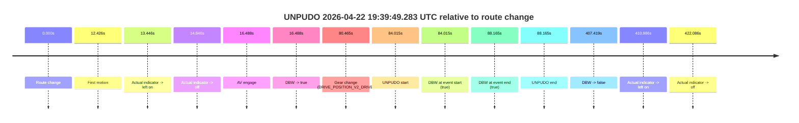
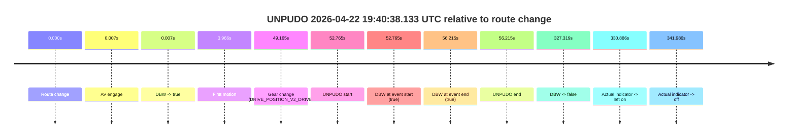
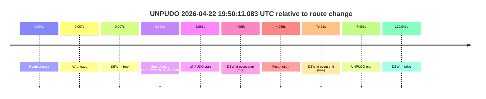
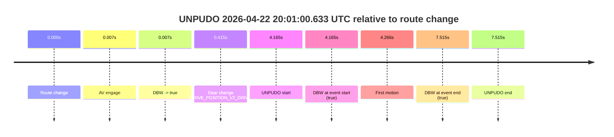

# Run Report: fme10011/2026-04-22--19-20-55--gen2-av-67336e24-6e70-4e9e-bb03-507059b38d09

| Field | Value |
|---|---|
| Run ID | `fme10011/2026-04-22--19-20-55--gen2-av-67336e24-6e70-4e9e-bb03-507059b38d09` |
| Date | `2026-04-22` |
| Model(s) | `eel-teal-outspoken` |
| Author | `zak` |
| Event count | `4` |

## unpudo 2026-04-22 19:39:49.283 UTC

| Field | Value |
|---|---|
| Model | `eel-teal-outspoken` |
| Author | `zak` |
| Run ID | `fme10011/2026-04-22--19-20-55--gen2-av-67336e24-6e70-4e9e-bb03-507059b38d09` |
| Date | `2026-04-22` |
| Time (UTC) | `19:39:49.283` |
| Event type | `unpudo` |
| Disengagement type | `none observed` |
| Route change | `found` |
| Console | [run](https://console.sso.wayve.ai/run/fme10011/2026-04-22--19-20-55--gen2-av-67336e24-6e70-4e9e-bb03-507059b38d09?id=&time-unixus=1776886789283314) |
| Foxglove | [segment](https://app.foxglove.dev/wayve-on-prem/p/prj_0dX18KZdVHg1fmmI/view?ds=foxglove-stream&ds.deviceName=fme10011&ds.start=2026-04-22T19%3A38%3A15.268247Z&ds.end=2026-04-22T19%3A45%3A22.686764Z&layoutId=lay_0e7VD4WIKDQGU73Y&time=2026-04-22T19%3A39%3A49.283314Z) |

### Event card: pass

- Pass: AV owns the credited unpudo from route change through the official unpudo window, the gear state is aligned at the anchor, and the vehicle moves without driver accelerator help in AV.

| Event | Time (UTC) | Delta from route change |
|---|---:|---:|
| Route change | 2026-04-22 19:38:25.268 | `0.000s` |
| First motion | 2026-04-22 19:38:37.693 | `12.426s` |
| Actual indicator -> left on | 2026-04-22 19:38:38.713 | `13.446s` |
| Actual indicator -> off | 2026-04-22 19:38:40.113 | `14.846s` |
| AV engage | 2026-04-22 19:38:41.756 | `16.488s` |
| DBW -> true | 2026-04-22 19:38:41.756 | `16.488s` |
| Gear change (DRIVE_POSITION_V2_DRIVE) | 2026-04-22 19:39:45.733 | `80.465s` |
| UNPUDO start | 2026-04-22 19:39:49.283 | `84.015s` |
| DBW at event start (true) | 2026-04-22 19:39:49.283 | `84.015s` |
| DBW at event end (true) | 2026-04-22 19:39:53.433 | `88.165s` |
| UNPUDO end | 2026-04-22 19:39:53.433 | `88.165s` |
| DBW -> false | 2026-04-22 19:45:12.686 | `407.419s` |
| Actual indicator -> left on | 2026-04-22 19:45:16.254 | `410.986s` |
| Actual indicator -> off | 2026-04-22 19:45:27.353 | `422.086s` |

| Metric | Value |
|---|---|
| Outcome | `pass` |
| Effective failure type | `none` |
| Route change status | `found` |
| DBW at event start | `true` |
| DBW at event end | `true` |
| Predicted gear at AV start | `DRIVE_POSITION_V2_DRIVE` |
| Actual gear at AV start | `DRIVE_POSITION_V2_DRIVE` |
| Predicted gear at event start | `DRIVE_POSITION_V2_DRIVE` |
| Actual gear at event start | `DRIVE_POSITION_V2_DRIVE` |
| Planned indicator direction | `INDICATORS_STATE_V2_OFF` |
| Controller indicator direction | `INDICATORS_STATE_V2_OFF` |
| Actual indicator direction | `INDICATORS_STATE_V2_OFF` |
| Actual indicator at maneuver end | `INDICATORS_STATE_V2_OFF` |
| Driver accel help in AV | `false` |
| Driver accel help timestamp | `n/a` |
| Max accel pedal pct in AV | `0.0%` |
| Max brake pedal pct in AV | `27.5%` |
| Max speed mps in AV | `8.133` |
| Success timing baseline | `route change` |
| Route -> AV | `16.488s` |
| AV -> event start | `67.527s` |
| AV -> first motion | `-4.062s` |
| Success baseline -> event start | `84.015s` |
| Success baseline -> first motion | `12.426s` |
| AV duration before disengagement | `390.931s` |
| Trajectory waypoint count | `36` |
| Driving-plan step count | `11` |

The scored portion starts from the AV-owned window, not from the pre-AV setup. Route-change search in the stopped pre-event segment was `found`, with the baseline therefore set to route change. At the event anchor the model predicts `DRIVE_POSITION_V2_DRIVE` and the actual gear is `DRIVE_POSITION_V2_DRIVE`. The effective model outcome is `pass` because `the credited unpudo stays AV-owned through the official unpudo window.`

### Resolution

| Field | Value |
|---|---|
| Final outcome | `pass` |
| Do we agree with this label? | `yes` |
| Source disengagement type | `none observed` |
| Resolved effective failure type | `none` |
| Confidence | `high` |

## unpudo 2026-04-22 19:40:38.133 UTC

| Field | Value |
|---|---|
| Model | `eel-teal-outspoken` |
| Author | `zak` |
| Run ID | `fme10011/2026-04-22--19-20-55--gen2-av-67336e24-6e70-4e9e-bb03-507059b38d09` |
| Date | `2026-04-22` |
| Time (UTC) | `19:40:38.133` |
| Event type | `unpudo` |
| Disengagement type | `none observed` |
| Route change | `found` |
| Console | [run](https://console.sso.wayve.ai/run/fme10011/2026-04-22--19-20-55--gen2-av-67336e24-6e70-4e9e-bb03-507059b38d09?id=&time-unixus=1776886838133295) |
| Foxglove | [segment](https://app.foxglove.dev/wayve-on-prem/p/prj_0dX18KZdVHg1fmmI/view?ds=foxglove-stream&ds.deviceName=fme10011&ds.start=2026-04-22T19%3A39%3A35.368239Z&ds.end=2026-04-22T19%3A45%3A22.686764Z&layoutId=lay_0e7VD4WIKDQGU73Y&time=2026-04-22T19%3A40%3A38.133295Z) |

### Event card: pass

- Pass: AV owns the credited unpudo from route change through the official unpudo window, the gear state is aligned at the anchor, and the vehicle moves without driver accelerator help in AV.

| Event | Time (UTC) | Delta from route change |
|---|---:|---:|
| Route change | 2026-04-22 19:39:45.368 | `0.000s` |
| AV engage | 2026-04-22 19:39:45.375 | `0.007s` |
| DBW -> true | 2026-04-22 19:39:45.375 | `0.007s` |
| First motion | 2026-04-22 19:39:49.333 | `3.966s` |
| Gear change (DRIVE_POSITION_V2_DRIVE) | 2026-04-22 19:40:34.533 | `49.165s` |
| UNPUDO start | 2026-04-22 19:40:38.133 | `52.765s` |
| DBW at event start (true) | 2026-04-22 19:40:38.133 | `52.765s` |
| DBW at event end (true) | 2026-04-22 19:40:41.583 | `56.215s` |
| UNPUDO end | 2026-04-22 19:40:41.583 | `56.215s` |
| DBW -> false | 2026-04-22 19:45:12.686 | `327.319s` |
| Actual indicator -> left on | 2026-04-22 19:45:16.254 | `330.886s` |
| Actual indicator -> off | 2026-04-22 19:45:27.353 | `341.986s` |

| Metric | Value |
|---|---|
| Outcome | `pass` |
| Effective failure type | `none` |
| Route change status | `found` |
| DBW at event start | `true` |
| DBW at event end | `true` |
| Predicted gear at AV start | `DRIVE_POSITION_V2_PARK` |
| Actual gear at AV start | `DRIVE_POSITION_V2_PARK` |
| Predicted gear at event start | `DRIVE_POSITION_V2_DRIVE` |
| Actual gear at event start | `DRIVE_POSITION_V2_DRIVE` |
| Planned indicator direction | `INDICATORS_STATE_V2_LEFT_ON` |
| Controller indicator direction | `INDICATORS_STATE_V2_LEFT_ON` |
| Actual indicator direction | `INDICATORS_STATE_V2_OFF` |
| Actual indicator at maneuver end | `INDICATORS_STATE_V2_OFF` |
| Driver accel help in AV | `false` |
| Driver accel help timestamp | `n/a` |
| Max accel pedal pct in AV | `0.0%` |
| Max brake pedal pct in AV | `25.3%` |
| Max speed mps in AV | `6.667` |
| Success timing baseline | `route change` |
| Route -> AV | `0.007s` |
| AV -> event start | `52.758s` |
| AV -> first motion | `3.959s` |
| Success baseline -> event start | `52.765s` |
| Success baseline -> first motion | `3.966s` |
| AV duration before disengagement | `327.312s` |
| Trajectory waypoint count | `37` |
| Driving-plan step count | `11` |

The scored portion starts from the AV-owned window, not from the pre-AV setup. Route-change search in the stopped pre-event segment was `found`, with the baseline therefore set to route change. At the event anchor the model predicts `DRIVE_POSITION_V2_DRIVE` and the actual gear is `DRIVE_POSITION_V2_DRIVE`. The effective model outcome is `pass` because `the credited unpudo stays AV-owned through the official unpudo window.`

### Resolution

| Field | Value |
|---|---|
| Final outcome | `pass` |
| Do we agree with this label? | `yes` |
| Source disengagement type | `none observed` |
| Resolved effective failure type | `none` |
| Confidence | `high` |

## unpudo 2026-04-22 19:50:11.083 UTC

| Field | Value |
|---|---|
| Model | `eel-teal-outspoken` |
| Author | `zak` |
| Run ID | `fme10011/2026-04-22--19-20-55--gen2-av-67336e24-6e70-4e9e-bb03-507059b38d09` |
| Date | `2026-04-22` |
| Time (UTC) | `19:50:11.083` |
| Event type | `unpudo` |
| Disengagement type | `none observed` |
| Route change | `found` |
| Console | [run](https://console.sso.wayve.ai/run/fme10011/2026-04-22--19-20-55--gen2-av-67336e24-6e70-4e9e-bb03-507059b38d09?id=&time-unixus=1776887411083309) |
| Foxglove | [segment](https://app.foxglove.dev/wayve-on-prem/p/prj_0dX18KZdVHg1fmmI/view?ds=foxglove-stream&ds.deviceName=fme10011&ds.start=2026-04-22T19%3A49%3A57.018572Z&ds.end=2026-04-22T19%3A53%3A07.065227Z&layoutId=lay_0e7VD4WIKDQGU73Y&time=2026-04-22T19%3A50%3A11.083309Z) |

### Event card: pass

- Pass: AV owns the credited unpudo from route change through the official unpudo window, the gear state is aligned at the anchor, and the vehicle moves without driver accelerator help in AV.

| Event | Time (UTC) | Delta from route change |
|---|---:|---:|
| Route change | 2026-04-22 19:50:07.018 | `0.000s` |
| AV engage | 2026-04-22 19:50:07.025 | `0.007s` |
| DBW -> true | 2026-04-22 19:50:07.025 | `0.007s` |
| Gear change (DRIVE_POSITION_V2_DRIVE) | 2026-04-22 19:50:07.383 | `0.365s` |
| UNPUDO start | 2026-04-22 19:50:11.083 | `4.065s` |
| DBW at event start (true) | 2026-04-22 19:50:11.083 | `4.065s` |
| First motion | 2026-04-22 19:50:11.114 | `4.095s` |
| DBW at event end (true) | 2026-04-22 19:50:14.483 | `7.465s` |
| UNPUDO end | 2026-04-22 19:50:14.483 | `7.465s` |
| DBW -> false | 2026-04-22 19:52:57.065 | `170.047s` |

| Metric | Value |
|---|---|
| Outcome | `pass` |
| Effective failure type | `none` |
| Route change status | `found` |
| DBW at event start | `true` |
| DBW at event end | `true` |
| Predicted gear at AV start | `DRIVE_POSITION_V2_PARK` |
| Actual gear at AV start | `DRIVE_POSITION_V2_PARK` |
| Predicted gear at event start | `DRIVE_POSITION_V2_DRIVE` |
| Actual gear at event start | `DRIVE_POSITION_V2_DRIVE` |
| Planned indicator direction | `INDICATORS_STATE_V2_LEFT_ON` |
| Controller indicator direction | `INDICATORS_STATE_V2_LEFT_ON` |
| Actual indicator direction | `INDICATORS_STATE_V2_OFF` |
| Actual indicator at maneuver end | `INDICATORS_STATE_V2_OFF` |
| Driver accel help in AV | `false` |
| Driver accel help timestamp | `n/a` |
| Max accel pedal pct in AV | `0.0%` |
| Max brake pedal pct in AV | `25.5%` |
| Max speed mps in AV | `5.233` |
| Success timing baseline | `route change` |
| Route -> AV | `0.007s` |
| AV -> event start | `4.058s` |
| AV -> first motion | `4.089s` |
| Success baseline -> event start | `4.065s` |
| Success baseline -> first motion | `4.095s` |
| AV duration before disengagement | `170.040s` |
| Trajectory waypoint count | `36` |
| Driving-plan step count | `11` |

The scored portion starts from the AV-owned window, not from the pre-AV setup. Route-change search in the stopped pre-event segment was `found`, with the baseline therefore set to route change. At the event anchor the model predicts `DRIVE_POSITION_V2_DRIVE` and the actual gear is `DRIVE_POSITION_V2_DRIVE`. The effective model outcome is `pass` because `the credited unpudo stays AV-owned through the official unpudo window.`

### Resolution

| Field | Value |
|---|---|
| Final outcome | `pass` |
| Do we agree with this label? | `yes` |
| Source disengagement type | `none observed` |
| Resolved effective failure type | `none` |
| Confidence | `high` |

## unpudo 2026-04-22 20:01:00.633 UTC

| Field | Value |
|---|---|
| Model | `eel-teal-outspoken` |
| Author | `zak` |
| Run ID | `fme10011/2026-04-22--19-20-55--gen2-av-67336e24-6e70-4e9e-bb03-507059b38d09` |
| Date | `2026-04-22` |
| Time (UTC) | `20:01:00.633` |
| Event type | `unpudo` |
| Disengagement type | `none observed` |
| Route change | `found` |
| Console | [run](https://console.sso.wayve.ai/run/fme10011/2026-04-22--19-20-55--gen2-av-67336e24-6e70-4e9e-bb03-507059b38d09?id=&time-unixus=1776888060633307) |
| Foxglove | [segment](https://app.foxglove.dev/wayve-on-prem/p/prj_0dX18KZdVHg1fmmI/view?ds=foxglove-stream&ds.deviceName=fme10011&ds.start=2026-04-22T20%3A00%3A46.468276Z&ds.end=2026-04-22T20%3A01%3A13.983310Z&layoutId=lay_0e7VD4WIKDQGU73Y&time=2026-04-22T20%3A01%3A00.633307Z) |

### Event card: pass

- Pass: AV owns the credited unpudo from route change through the official unpudo window, the gear state is aligned at the anchor, and the vehicle moves without driver accelerator help in AV.

| Event | Time (UTC) | Delta from route change |
|---|---:|---:|
| Route change | 2026-04-22 20:00:56.468 | `0.000s` |
| AV engage | 2026-04-22 20:00:56.475 | `0.007s` |
| DBW -> true | 2026-04-22 20:00:56.475 | `0.007s` |
| Gear change (DRIVE_POSITION_V2_DRIVE) | 2026-04-22 20:00:56.883 | `0.415s` |
| UNPUDO start | 2026-04-22 20:01:00.633 | `4.165s` |
| DBW at event start (true) | 2026-04-22 20:01:00.633 | `4.165s` |
| First motion | 2026-04-22 20:01:00.734 | `4.266s` |
| DBW at event end (true) | 2026-04-22 20:01:03.983 | `7.515s` |
| UNPUDO end | 2026-04-22 20:01:03.983 | `7.515s` |

| Metric | Value |
|---|---|
| Outcome | `pass` |
| Effective failure type | `none` |
| Route change status | `found` |
| DBW at event start | `true` |
| DBW at event end | `true` |
| Predicted gear at AV start | `DRIVE_POSITION_V2_PARK` |
| Actual gear at AV start | `DRIVE_POSITION_V2_PARK` |
| Predicted gear at event start | `DRIVE_POSITION_V2_DRIVE` |
| Actual gear at event start | `DRIVE_POSITION_V2_DRIVE` |
| Planned indicator direction | `INDICATORS_STATE_V2_LEFT_ON` |
| Controller indicator direction | `INDICATORS_STATE_V2_LEFT_ON` |
| Actual indicator direction | `INDICATORS_STATE_V2_OFF` |
| Actual indicator at maneuver end | `INDICATORS_STATE_V2_OFF` |
| Driver accel help in AV | `false` |
| Driver accel help timestamp | `n/a` |
| Max accel pedal pct in AV | `0.0%` |
| Max brake pedal pct in AV | `15.6%` |
| Max speed mps in AV | `5.211` |
| Success timing baseline | `route change` |
| Route -> AV | `0.007s` |
| AV -> event start | `4.158s` |
| AV -> first motion | `4.259s` |
| Success baseline -> event start | `4.165s` |
| Success baseline -> first motion | `4.266s` |
| AV duration before disengagement | `n/a` |
| Trajectory waypoint count | `37` |
| Driving-plan step count | `11` |

The scored portion starts from the AV-owned window, not from the pre-AV setup. Route-change search in the stopped pre-event segment was `found`, with the baseline therefore set to route change. At the event anchor the model predicts `DRIVE_POSITION_V2_DRIVE` and the actual gear is `DRIVE_POSITION_V2_DRIVE`. The effective model outcome is `pass` because `the credited unpudo stays AV-owned through the official unpudo window.`

### Resolution

| Field | Value |
|---|---|
| Final outcome | `pass` |
| Do we agree with this label? | `yes` |
| Source disengagement type | `none observed` |
| Resolved effective failure type | `none` |
| Confidence | `high` |
