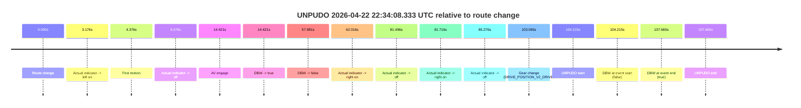
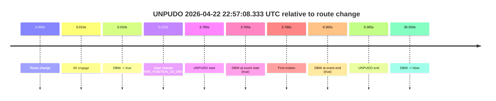
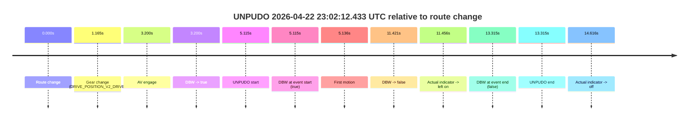
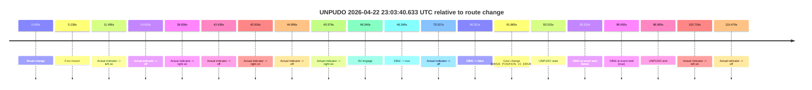
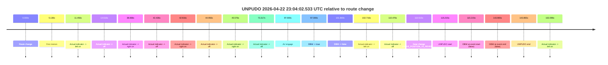
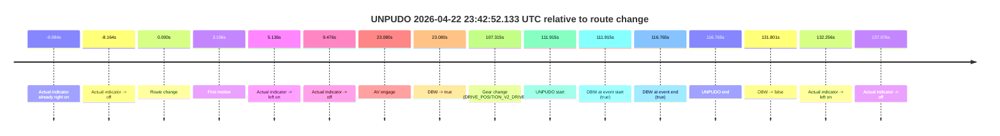
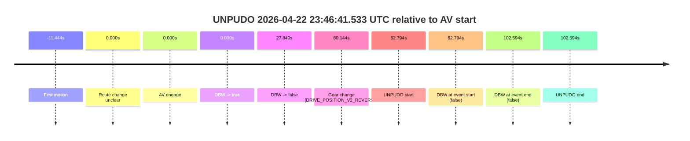

# Run Report: fme10011/2026-04-22--22-14-00--gen2-av-3e7454a0-a1ac-4c1e-968c-b9348a87f1f9

| Field | Value |
|---|---|
| Run ID | `fme10011/2026-04-22--22-14-00--gen2-av-3e7454a0-a1ac-4c1e-968c-b9348a87f1f9` |
| Date | `2026-04-22` |
| Model(s) | `eel-teal-outspoken` |
| Author | `zak` |
| Event count | `8` |

## unpudo 2026-04-22 22:22:11.433 UTC

| Field | Value |
|---|---|
| Model | `eel-teal-outspoken` |
| Author | `zak` |
| Run ID | `fme10011/2026-04-22--22-14-00--gen2-av-3e7454a0-a1ac-4c1e-968c-b9348a87f1f9` |
| Date | `2026-04-22` |
| Time (UTC) | `22:22:11.433` |
| Event type | `unpudo` |
| Disengagement type | `none observed` |
| Route change | `found` |
| Console | [run](https://console.sso.wayve.ai/run/fme10011/2026-04-22--22-14-00--gen2-av-3e7454a0-a1ac-4c1e-968c-b9348a87f1f9?id=&time-unixus=1776896531433300) |
| Foxglove | [segment](https://app.foxglove.dev/wayve-on-prem/p/prj_0dX18KZdVHg1fmmI/view?ds=foxglove-stream&ds.deviceName=fme10011&ds.start=2026-04-22T22%3A21%3A57.668259Z&ds.end=2026-04-22T22%3A23%3A00.679038Z&layoutId=lay_0e7VD4WIKDQGU73Y&time=2026-04-22T22%3A22%3A11.433300Z) |

### Event card: pass

- Pass: AV owns the credited unpudo from route change through the official unpudo window, the gear state is aligned at the anchor, and the vehicle moves without driver accelerator help in AV.

| Event | Time (UTC) | Delta from route change |
|---|---:|---:|
| Route change | 2026-04-22 22:22:07.668 | `0.000s` |
| AV engage | 2026-04-22 22:22:07.677 | `0.010s` |
| DBW -> true | 2026-04-22 22:22:07.677 | `0.010s` |
| Gear change (DRIVE_POSITION_V2_DRIVE) | 2026-04-22 22:22:07.983 | `0.315s` |
| UNPUDO start | 2026-04-22 22:22:11.433 | `3.765s` |
| DBW at event start (true) | 2026-04-22 22:22:11.433 | `3.765s` |
| First motion | 2026-04-22 22:22:11.474 | `3.806s` |
| DBW at event end (true) | 2026-04-22 22:22:15.133 | `7.465s` |
| UNPUDO end | 2026-04-22 22:22:15.133 | `7.465s` |
| DBW -> false | 2026-04-22 22:22:50.679 | `43.011s` |

| Metric | Value |
|---|---|
| Outcome | `pass` |
| Effective failure type | `none` |
| Route change status | `found` |
| DBW at event start | `true` |
| DBW at event end | `true` |
| Predicted gear at AV start | `DRIVE_POSITION_V2_PARK` |
| Actual gear at AV start | `DRIVE_POSITION_V2_PARK` |
| Predicted gear at event start | `DRIVE_POSITION_V2_DRIVE` |
| Actual gear at event start | `DRIVE_POSITION_V2_DRIVE` |
| Planned indicator direction | `INDICATORS_STATE_V2_OFF` |
| Controller indicator direction | `INDICATORS_STATE_V2_OFF` |
| Actual indicator direction | `INDICATORS_STATE_V2_OFF` |
| Actual indicator at maneuver end | `INDICATORS_STATE_V2_OFF` |
| Driver accel help in AV | `false` |
| Driver accel help timestamp | `n/a` |
| Max accel pedal pct in AV | `0.0%` |
| Max brake pedal pct in AV | `8.0%` |
| Max speed mps in AV | `4.014` |
| Success timing baseline | `route change` |
| Route -> AV | `0.010s` |
| AV -> event start | `3.756s` |
| AV -> first motion | `3.797s` |
| Success baseline -> event start | `3.765s` |
| Success baseline -> first motion | `3.806s` |
| AV duration before disengagement | `43.001s` |
| Trajectory waypoint count | `38` |
| Driving-plan step count | `11` |

The scored portion starts from the AV-owned window, not from the pre-AV setup. Route-change search in the stopped pre-event segment was `found`, with the baseline therefore set to route change. At the event anchor the model predicts `DRIVE_POSITION_V2_DRIVE` and the actual gear is `DRIVE_POSITION_V2_DRIVE`. The effective model outcome is `pass` because `the credited unpudo stays AV-owned through the official unpudo window.`

### Resolution

| Field | Value |
|---|---|
| Final outcome | `pass` |
| Do we agree with this label? | `yes` |
| Source disengagement type | `none observed` |
| Resolved effective failure type | `none` |
| Confidence | `high` |

## unpudo 2026-04-22 22:34:08.333 UTC

| Field | Value |
|---|---|
| Model | `eel-teal-outspoken` |
| Author | `zak` |
| Run ID | `fme10011/2026-04-22--22-14-00--gen2-av-3e7454a0-a1ac-4c1e-968c-b9348a87f1f9` |
| Date | `2026-04-22` |
| Time (UTC) | `22:34:08.333` |
| Event type | `unpudo` |
| Disengagement type | `none observed` |
| Route change | `found` |
| Console | [run](https://console.sso.wayve.ai/run/fme10011/2026-04-22--22-14-00--gen2-av-3e7454a0-a1ac-4c1e-968c-b9348a87f1f9?id=&time-unixus=1776897248333311) |
| Foxglove | [segment](https://app.foxglove.dev/wayve-on-prem/p/prj_0dX18KZdVHg1fmmI/view?ds=foxglove-stream&ds.deviceName=fme10011&ds.start=2026-04-22T22%3A32%3A14.118244Z&ds.end=2026-04-22T22%3A34%3A21.783320Z&layoutId=lay_0e7VD4WIKDQGU73Y&time=2026-04-22T22%3A34%3A08.333311Z) |

### Event card: fail

- Fail: the credited unpudo does not stay AV-owned. The event window starts with DBW false, and the maneuver outcome lands outside a clean AV-owned segment.

| Event | Time (UTC) | Delta from route change |
|---|---:|---:|
| Route change | 2026-04-22 22:32:24.118 | `0.000s` |
| Actual indicator -> left on | 2026-04-22 22:32:27.293 | `3.176s` |
| First motion | 2026-04-22 22:32:28.493 | `4.376s` |
| Actual indicator -> off | 2026-04-22 22:32:29.593 | `5.476s` |
| AV engage | 2026-04-22 22:32:38.539 | `14.421s` |
| DBW -> true | 2026-04-22 22:32:38.539 | `14.421s` |
| DBW -> false | 2026-04-22 22:33:22.099 | `57.981s` |
| Actual indicator -> right on | 2026-04-22 22:33:26.134 | `62.016s` |
| Actual indicator -> off | 2026-04-22 22:33:45.614 | `81.496s` |
| Actual indicator -> right on | 2026-04-22 22:33:45.833 | `81.716s` |
| Actual indicator -> off | 2026-04-22 22:33:49.394 | `85.276s` |
| Gear change (DRIVE_POSITION_V2_DRIVE) | 2026-04-22 22:34:07.183 | `103.065s` |
| UNPUDO start | 2026-04-22 22:34:08.333 | `104.215s` |
| DBW at event start (false) | 2026-04-22 22:34:08.333 | `104.215s` |
| DBW at event end (true) | 2026-04-22 22:34:11.783 | `107.665s` |
| UNPUDO end | 2026-04-22 22:34:11.783 | `107.665s` |

| Metric | Value |
|---|---|
| Outcome | `fail` |
| Effective failure type | `completed_outside_av` |
| Route change status | `found` |
| DBW at event start | `false` |
| DBW at event end | `true` |
| Predicted gear at AV start | `DRIVE_POSITION_V2_DRIVE` |
| Actual gear at AV start | `DRIVE_POSITION_V2_DRIVE` |
| Predicted gear at event start | `DRIVE_POSITION_V2_DRIVE` |
| Actual gear at event start | `DRIVE_POSITION_V2_DRIVE` |
| Planned indicator direction | `INDICATORS_STATE_V2_OFF` |
| Controller indicator direction | `INDICATORS_STATE_V2_OFF` |
| Actual indicator direction | `INDICATORS_STATE_V2_OFF` |
| Actual indicator at maneuver end | `INDICATORS_STATE_V2_OFF` |
| Driver accel help in AV | `false` |
| Driver accel help timestamp | `n/a` |
| Max accel pedal pct in AV | `0.0%` |
| Max brake pedal pct in AV | `8.0%` |
| Max speed mps in AV | `10.139` |
| Success timing baseline | `route change` |
| Route -> AV | `14.421s` |
| AV -> event start | `89.794s` |
| AV -> first motion | `-10.045s` |
| Success baseline -> event start | `104.215s` |
| Success baseline -> first motion | `4.376s` |
| AV duration before disengagement | `43.560s` |
| Trajectory waypoint count | `38` |
| Driving-plan step count | `11` |

The scored portion starts from the AV-owned window, not from the pre-AV setup. Route-change search in the stopped pre-event segment was `found`, with the baseline therefore set to route change. At the event anchor the model predicts `DRIVE_POSITION_V2_DRIVE` and the actual gear is `DRIVE_POSITION_V2_DRIVE`. The effective model outcome is `fail` because `completed_outside_av.`

### Resolution

| Field | Value |
|---|---|
| Final outcome | `fail` |
| Do we agree with this label? | `yes` |
| Source disengagement type | `none observed` |
| Resolved effective failure type | `completed_outside_av` |
| Confidence | `high` |

## unpudo 2026-04-22 22:57:08.333 UTC

| Field | Value |
|---|---|
| Model | `eel-teal-outspoken` |
| Author | `zak` |
| Run ID | `fme10011/2026-04-22--22-14-00--gen2-av-3e7454a0-a1ac-4c1e-968c-b9348a87f1f9` |
| Date | `2026-04-22` |
| Time (UTC) | `22:57:08.333` |
| Event type | `unpudo` |
| Disengagement type | `none observed` |
| Route change | `found` |
| Console | [run](https://console.sso.wayve.ai/run/fme10011/2026-04-22--22-14-00--gen2-av-3e7454a0-a1ac-4c1e-968c-b9348a87f1f9?id=&time-unixus=1776898628333313) |
| Foxglove | [segment](https://app.foxglove.dev/wayve-on-prem/p/prj_0dX18KZdVHg1fmmI/view?ds=foxglove-stream&ds.deviceName=fme10011&ds.start=2026-04-22T22%3A56%3A54.568263Z&ds.end=2026-04-22T22%3A57%3A45.118656Z&layoutId=lay_0e7VD4WIKDQGU73Y&time=2026-04-22T22%3A57%3A08.333313Z) |

### Event card: pass

- Pass: AV owns the credited unpudo from route change through the official unpudo window, the gear state is aligned at the anchor, and the vehicle moves without driver accelerator help in AV.

| Event | Time (UTC) | Delta from route change |
|---|---:|---:|
| Route change | 2026-04-22 22:57:04.568 | `0.000s` |
| AV engage | 2026-04-22 22:57:04.577 | `0.010s` |
| DBW -> true | 2026-04-22 22:57:04.577 | `0.010s` |
| Gear change (DRIVE_POSITION_V2_DRIVE) | 2026-04-22 22:57:04.783 | `0.215s` |
| UNPUDO start | 2026-04-22 22:57:08.333 | `3.765s` |
| DBW at event start (true) | 2026-04-22 22:57:08.333 | `3.765s` |
| First motion | 2026-04-22 22:57:08.354 | `3.786s` |
| DBW at event end (true) | 2026-04-22 22:57:13.933 | `9.365s` |
| UNPUDO end | 2026-04-22 22:57:13.933 | `9.365s` |
| DBW -> false | 2026-04-22 22:57:35.118 | `30.550s` |

| Metric | Value |
|---|---|
| Outcome | `pass` |
| Effective failure type | `none` |
| Route change status | `found` |
| DBW at event start | `true` |
| DBW at event end | `true` |
| Predicted gear at AV start | `DRIVE_POSITION_V2_PARK` |
| Actual gear at AV start | `DRIVE_POSITION_V2_PARK` |
| Predicted gear at event start | `DRIVE_POSITION_V2_DRIVE` |
| Actual gear at event start | `DRIVE_POSITION_V2_DRIVE` |
| Planned indicator direction | `INDICATORS_STATE_V2_OFF` |
| Controller indicator direction | `INDICATORS_STATE_V2_OFF` |
| Actual indicator direction | `INDICATORS_STATE_V2_OFF` |
| Actual indicator at maneuver end | `INDICATORS_STATE_V2_OFF` |
| Driver accel help in AV | `false` |
| Driver accel help timestamp | `n/a` |
| Max accel pedal pct in AV | `0.0%` |
| Max brake pedal pct in AV | `8.0%` |
| Max speed mps in AV | `2.303` |
| Success timing baseline | `route change` |
| Route -> AV | `0.010s` |
| AV -> event start | `3.756s` |
| AV -> first motion | `3.776s` |
| Success baseline -> event start | `3.765s` |
| Success baseline -> first motion | `3.786s` |
| AV duration before disengagement | `30.541s` |
| Trajectory waypoint count | `38` |
| Driving-plan step count | `11` |

The scored portion starts from the AV-owned window, not from the pre-AV setup. Route-change search in the stopped pre-event segment was `found`, with the baseline therefore set to route change. At the event anchor the model predicts `DRIVE_POSITION_V2_DRIVE` and the actual gear is `DRIVE_POSITION_V2_DRIVE`. The effective model outcome is `pass` because `the credited unpudo stays AV-owned through the official unpudo window.`

### Resolution

| Field | Value |
|---|---|
| Final outcome | `pass` |
| Do we agree with this label? | `yes` |
| Source disengagement type | `none observed` |
| Resolved effective failure type | `none` |
| Confidence | `high` |

## unpudo 2026-04-22 23:02:12.433 UTC

| Field | Value |
|---|---|
| Model | `eel-teal-outspoken` |
| Author | `zak` |
| Run ID | `fme10011/2026-04-22--22-14-00--gen2-av-3e7454a0-a1ac-4c1e-968c-b9348a87f1f9` |
| Date | `2026-04-22` |
| Time (UTC) | `23:02:12.433` |
| Event type | `unpudo` |
| Disengagement type | `none observed` |
| Route change | `found` |
| Console | [run](https://console.sso.wayve.ai/run/fme10011/2026-04-22--22-14-00--gen2-av-3e7454a0-a1ac-4c1e-968c-b9348a87f1f9?id=&time-unixus=1776898932433297) |
| Foxglove | [segment](https://app.foxglove.dev/wayve-on-prem/p/prj_0dX18KZdVHg1fmmI/view?ds=foxglove-stream&ds.deviceName=fme10011&ds.start=2026-04-22T23%3A01%3A57.318251Z&ds.end=2026-04-22T23%3A02%3A30.633300Z&layoutId=lay_0e7VD4WIKDQGU73Y&time=2026-04-22T23%3A02%3A12.433297Z) |

### Event card: fail

- Fail: this is a short AV stint rather than a durable model-owned maneuver. The vehicle never settles into a long enough AV-owned attempt to credit the model.

| Event | Time (UTC) | Delta from route change |
|---|---:|---:|
| Route change | 2026-04-22 23:02:07.318 | `0.000s` |
| Gear change (DRIVE_POSITION_V2_DRIVE) | 2026-04-22 23:02:08.483 | `1.165s` |
| AV engage | 2026-04-22 23:02:10.518 | `3.200s` |
| DBW -> true | 2026-04-22 23:02:10.518 | `3.200s` |
| UNPUDO start | 2026-04-22 23:02:12.433 | `5.115s` |
| DBW at event start (true) | 2026-04-22 23:02:12.433 | `5.115s` |
| First motion | 2026-04-22 23:02:12.454 | `5.136s` |
| DBW -> false | 2026-04-22 23:02:18.739 | `11.421s` |
| Actual indicator -> left on | 2026-04-22 23:02:18.774 | `11.456s` |
| DBW at event end (false) | 2026-04-22 23:02:20.633 | `13.315s` |
| UNPUDO end | 2026-04-22 23:02:20.633 | `13.315s` |
| Actual indicator -> off | 2026-04-22 23:02:21.934 | `14.616s` |

| Metric | Value |
|---|---|
| Outcome | `fail` |
| Effective failure type | `interrupted_handover` |
| Route change status | `found` |
| DBW at event start | `true` |
| DBW at event end | `false` |
| Predicted gear at AV start | `DRIVE_POSITION_V2_DRIVE` |
| Actual gear at AV start | `DRIVE_POSITION_V2_DRIVE` |
| Predicted gear at event start | `DRIVE_POSITION_V2_DRIVE` |
| Actual gear at event start | `DRIVE_POSITION_V2_DRIVE` |
| Planned indicator direction | `INDICATORS_STATE_V2_OFF` |
| Controller indicator direction | `INDICATORS_STATE_V2_OFF` |
| Actual indicator direction | `INDICATORS_STATE_V2_OFF` |
| Actual indicator at maneuver end | `INDICATORS_STATE_V2_LEFT_ON` |
| Driver accel help in AV | `false` |
| Driver accel help timestamp | `n/a` |
| Max accel pedal pct in AV | `0.0%` |
| Max brake pedal pct in AV | `0.4%` |
| Max speed mps in AV | `2.408` |
| Success timing baseline | `route change` |
| Route -> AV | `3.200s` |
| AV -> event start | `1.915s` |
| AV -> first motion | `1.936s` |
| Success baseline -> event start | `5.115s` |
| Success baseline -> first motion | `5.136s` |
| AV duration before disengagement | `8.221s` |
| Trajectory waypoint count | `38` |
| Driving-plan step count | `11` |

The scored portion starts from the AV-owned window, not from the pre-AV setup. Route-change search in the stopped pre-event segment was `found`, with the baseline therefore set to route change. At the event anchor the model predicts `DRIVE_POSITION_V2_DRIVE` and the actual gear is `DRIVE_POSITION_V2_DRIVE`. The effective model outcome is `fail` because `interrupted_handover.`

### Resolution

| Field | Value |
|---|---|
| Final outcome | `fail` |
| Do we agree with this label? | `yes` |
| Source disengagement type | `none observed` |
| Resolved effective failure type | `interrupted_handover` |
| Confidence | `high` |

## unpudo 2026-04-22 23:03:40.633 UTC

| Field | Value |
|---|---|
| Model | `eel-teal-outspoken` |
| Author | `zak` |
| Run ID | `fme10011/2026-04-22--22-14-00--gen2-av-3e7454a0-a1ac-4c1e-968c-b9348a87f1f9` |
| Date | `2026-04-22` |
| Time (UTC) | `23:03:40.633` |
| Event type | `unpudo` |
| Disengagement type | `none observed` |
| Route change | `found` |
| Console | [run](https://console.sso.wayve.ai/run/fme10011/2026-04-22--22-14-00--gen2-av-3e7454a0-a1ac-4c1e-968c-b9348a87f1f9?id=&time-unixus=1776899020633307) |
| Foxglove | [segment](https://app.foxglove.dev/wayve-on-prem/p/prj_0dX18KZdVHg1fmmI/view?ds=foxglove-stream&ds.deviceName=fme10011&ds.start=2026-04-22T23%3A01%3A57.318251Z&ds.end=2026-04-22T23%3A03%3A55.383306Z&layoutId=lay_0e7VD4WIKDQGU73Y&time=2026-04-22T23%3A03%3A40.633307Z) |

### Event card: fail

- Fail: the credited unpudo does not stay AV-owned. The event window starts with DBW false, and the maneuver outcome lands outside a clean AV-owned segment.

| Event | Time (UTC) | Delta from route change |
|---|---:|---:|
| Route change | 2026-04-22 23:02:07.318 | `0.000s` |
| First motion | 2026-04-22 23:02:12.454 | `5.136s` |
| Actual indicator -> left on | 2026-04-22 23:02:18.774 | `11.456s` |
| Actual indicator -> off | 2026-04-22 23:02:21.934 | `14.616s` |
| Actual indicator -> right on | 2026-04-22 23:02:46.154 | `38.836s` |
| Actual indicator -> off | 2026-04-22 23:02:49.754 | `42.436s` |
| Actual indicator -> right on | 2026-04-22 23:02:50.233 | `42.916s` |
| Actual indicator -> off | 2026-04-22 23:02:52.273 | `44.956s` |
| Actual indicator -> right on | 2026-04-22 23:02:52.893 | `45.576s` |
| AV engage | 2026-04-22 23:02:53.658 | `46.340s` |
| DBW -> true | 2026-04-22 23:02:53.658 | `46.340s` |
| Actual indicator -> off | 2026-04-22 23:03:20.634 | `73.317s` |
| DBW -> false | 2026-04-22 23:03:27.639 | `80.321s` |
| Gear change (DRIVE_POSITION_V2_DRIVE) | 2026-04-22 23:03:39.183 | `91.865s` |
| UNPUDO start | 2026-04-22 23:03:40.633 | `93.315s` |
| DBW at event start (false) | 2026-04-22 23:03:40.633 | `93.315s` |
| DBW at event end (true) | 2026-04-22 23:03:45.383 | `98.065s` |
| UNPUDO end | 2026-04-22 23:03:45.383 | `98.065s` |
| Actual indicator -> left on | 2026-04-22 23:03:50.033 | `102.716s` |
| Actual indicator -> off | 2026-04-22 23:03:57.794 | `110.476s` |

| Metric | Value |
|---|---|
| Outcome | `fail` |
| Effective failure type | `completed_outside_av` |
| Route change status | `found` |
| DBW at event start | `false` |
| DBW at event end | `true` |
| Predicted gear at AV start | `DRIVE_POSITION_V2_DRIVE` |
| Actual gear at AV start | `DRIVE_POSITION_V2_DRIVE` |
| Predicted gear at event start | `DRIVE_POSITION_V2_DRIVE` |
| Actual gear at event start | `DRIVE_POSITION_V2_DRIVE` |
| Planned indicator direction | `INDICATORS_STATE_V2_OFF` |
| Controller indicator direction | `INDICATORS_STATE_V2_OFF` |
| Actual indicator direction | `INDICATORS_STATE_V2_OFF` |
| Actual indicator at maneuver end | `INDICATORS_STATE_V2_OFF` |
| Driver accel help in AV | `false` |
| Driver accel help timestamp | `n/a` |
| Max accel pedal pct in AV | `0.0%` |
| Max brake pedal pct in AV | `9.8%` |
| Max speed mps in AV | `9.547` |
| Success timing baseline | `route change` |
| Route -> AV | `46.340s` |
| AV -> event start | `46.975s` |
| AV -> first motion | `-41.204s` |
| Success baseline -> event start | `93.315s` |
| Success baseline -> first motion | `5.136s` |
| AV duration before disengagement | `33.981s` |
| Trajectory waypoint count | `38` |
| Driving-plan step count | `11` |

The scored portion starts from the AV-owned window, not from the pre-AV setup. Route-change search in the stopped pre-event segment was `found`, with the baseline therefore set to route change. At the event anchor the model predicts `DRIVE_POSITION_V2_DRIVE` and the actual gear is `DRIVE_POSITION_V2_DRIVE`. The effective model outcome is `fail` because `completed_outside_av.`

### Resolution

| Field | Value |
|---|---|
| Final outcome | `fail` |
| Do we agree with this label? | `yes` |
| Source disengagement type | `none observed` |
| Resolved effective failure type | `completed_outside_av` |
| Confidence | `high` |

## unpudo 2026-04-22 23:04:02.533 UTC

| Field | Value |
|---|---|
| Model | `eel-teal-outspoken` |
| Author | `zak` |
| Run ID | `fme10011/2026-04-22--22-14-00--gen2-av-3e7454a0-a1ac-4c1e-968c-b9348a87f1f9` |
| Date | `2026-04-22` |
| Time (UTC) | `23:04:02.533` |
| Event type | `unpudo` |
| Disengagement type | `none observed` |
| Route change | `found` |
| Console | [run](https://console.sso.wayve.ai/run/fme10011/2026-04-22--22-14-00--gen2-av-3e7454a0-a1ac-4c1e-968c-b9348a87f1f9?id=&time-unixus=1776899042533301) |
| Foxglove | [segment](https://app.foxglove.dev/wayve-on-prem/p/prj_0dX18KZdVHg1fmmI/view?ds=foxglove-stream&ds.deviceName=fme10011&ds.start=2026-04-22T23%3A01%3A57.318251Z&ds.end=2026-04-22T23%3A04%3A41.183301Z&layoutId=lay_0e7VD4WIKDQGU73Y&time=2026-04-22T23%3A04%3A02.533301Z) |

### Event card: fail

- Fail: the credited unpudo does not stay AV-owned. The event window starts with DBW false, and the maneuver outcome lands outside a clean AV-owned segment.

| Event | Time (UTC) | Delta from route change |
|---|---:|---:|
| Route change | 2026-04-22 23:02:07.318 | `0.000s` |
| First motion | 2026-04-22 23:02:12.454 | `5.136s` |
| Actual indicator -> left on | 2026-04-22 23:02:18.774 | `11.456s` |
| Actual indicator -> off | 2026-04-22 23:02:21.934 | `14.616s` |
| Actual indicator -> right on | 2026-04-22 23:02:46.154 | `38.836s` |
| Actual indicator -> off | 2026-04-22 23:02:49.754 | `42.436s` |
| Actual indicator -> right on | 2026-04-22 23:02:50.233 | `42.916s` |
| Actual indicator -> off | 2026-04-22 23:02:52.273 | `44.956s` |
| Actual indicator -> right on | 2026-04-22 23:02:52.893 | `45.576s` |
| Actual indicator -> off | 2026-04-22 23:03:20.634 | `73.317s` |
| AV engage | 2026-04-22 23:03:44.318 | `97.000s` |
| DBW -> true | 2026-04-22 23:03:44.318 | `97.000s` |
| DBW -> false | 2026-04-22 23:03:49.158 | `101.840s` |
| Actual indicator -> left on | 2026-04-22 23:03:50.033 | `102.716s` |
| Actual indicator -> off | 2026-04-22 23:03:57.794 | `110.476s` |
| Gear change (DRIVE_POSITION_V2_REVERSE) | 2026-04-22 23:03:57.833 | `110.515s` |
| UNPUDO start | 2026-04-22 23:04:02.533 | `115.215s` |
| DBW at event start (false) | 2026-04-22 23:04:02.533 | `115.215s` |
| DBW at event end (false) | 2026-04-22 23:04:31.183 | `143.865s` |
| UNPUDO end | 2026-04-22 23:04:31.183 | `143.865s` |
| Actual indicator -> left on | 2026-04-22 23:04:50.413 | `163.096s` |

| Metric | Value |
|---|---|
| Outcome | `fail` |
| Effective failure type | `completed_outside_av` |
| Route change status | `found` |
| DBW at event start | `false` |
| DBW at event end | `false` |
| Predicted gear at AV start | `DRIVE_POSITION_V2_DRIVE` |
| Actual gear at AV start | `DRIVE_POSITION_V2_DRIVE` |
| Predicted gear at event start | `DRIVE_POSITION_V2_REVERSE` |
| Actual gear at event start | `DRIVE_POSITION_V2_REVERSE` |
| Planned indicator direction | `INDICATORS_STATE_V2_OFF` |
| Controller indicator direction | `INDICATORS_STATE_V2_OFF` |
| Actual indicator direction | `INDICATORS_STATE_V2_OFF` |
| Actual indicator at maneuver end | `INDICATORS_STATE_V2_OFF` |
| Driver accel help in AV | `false` |
| Driver accel help timestamp | `n/a` |
| Max accel pedal pct in AV | `0.0%` |
| Max brake pedal pct in AV | `0.0%` |
| Max speed mps in AV | `3.950` |
| Success timing baseline | `route change` |
| Route -> AV | `97.000s` |
| AV -> event start | `18.215s` |
| AV -> first motion | `-91.864s` |
| Success baseline -> event start | `115.215s` |
| Success baseline -> first motion | `5.136s` |
| AV duration before disengagement | `4.840s` |
| Trajectory waypoint count | `38` |
| Driving-plan step count | `11` |

The scored portion starts from the AV-owned window, not from the pre-AV setup. Route-change search in the stopped pre-event segment was `found`, with the baseline therefore set to route change. At the event anchor the model predicts `DRIVE_POSITION_V2_REVERSE` and the actual gear is `DRIVE_POSITION_V2_REVERSE`. The effective model outcome is `fail` because `completed_outside_av.`

### Resolution

| Field | Value |
|---|---|
| Final outcome | `fail` |
| Do we agree with this label? | `yes` |
| Source disengagement type | `none observed` |
| Resolved effective failure type | `completed_outside_av` |
| Confidence | `high` |

## unpudo 2026-04-22 23:42:52.133 UTC

| Field | Value |
|---|---|
| Model | `eel-teal-outspoken` |
| Author | `zak` |
| Run ID | `fme10011/2026-04-22--22-14-00--gen2-av-3e7454a0-a1ac-4c1e-968c-b9348a87f1f9` |
| Date | `2026-04-22` |
| Time (UTC) | `23:42:52.133` |
| Event type | `unpudo` |
| Disengagement type | `none observed` |
| Route change | `found` |
| Console | [run](https://console.sso.wayve.ai/run/fme10011/2026-04-22--22-14-00--gen2-av-3e7454a0-a1ac-4c1e-968c-b9348a87f1f9?id=&time-unixus=1776901372133300) |
| Foxglove | [segment](https://app.foxglove.dev/wayve-on-prem/p/prj_0dX18KZdVHg1fmmI/view?ds=foxglove-stream&ds.deviceName=fme10011&ds.start=2026-04-22T23%3A40%3A50.218265Z&ds.end=2026-04-22T23%3A43%3A22.018788Z&layoutId=lay_0e7VD4WIKDQGU73Y&time=2026-04-22T23%3A42%3A52.133300Z) |

### Event card: pass

- Pass: AV owns the credited unpudo from route change through the official unpudo window, the gear state is aligned at the anchor, and the vehicle moves without driver accelerator help in AV.

| Event | Time (UTC) | Delta from route change |
|---|---:|---:|
| Actual indicator already right on | 2026-04-22 23:40:50.233 | `-9.984s` |
| Actual indicator -> off | 2026-04-22 23:40:52.054 | `-8.164s` |
| Route change | 2026-04-22 23:41:00.218 | `0.000s` |
| First motion | 2026-04-22 23:41:03.414 | `3.196s` |
| Actual indicator -> left on | 2026-04-22 23:41:05.353 | `5.136s` |
| Actual indicator -> off | 2026-04-22 23:41:09.693 | `9.476s` |
| AV engage | 2026-04-22 23:41:23.298 | `23.080s` |
| DBW -> true | 2026-04-22 23:41:23.298 | `23.080s` |
| Gear change (DRIVE_POSITION_V2_DRIVE) | 2026-04-22 23:42:47.533 | `107.315s` |
| UNPUDO start | 2026-04-22 23:42:52.133 | `111.915s` |
| DBW at event start (true) | 2026-04-22 23:42:52.133 | `111.915s` |
| DBW at event end (true) | 2026-04-22 23:42:56.983 | `116.765s` |
| UNPUDO end | 2026-04-22 23:42:56.983 | `116.765s` |
| DBW -> false | 2026-04-22 23:43:12.018 | `131.801s` |
| Actual indicator -> left on | 2026-04-22 23:43:12.474 | `132.256s` |
| Actual indicator -> off | 2026-04-22 23:43:17.293 | `137.076s` |

| Metric | Value |
|---|---|
| Outcome | `pass` |
| Effective failure type | `none` |
| Route change status | `found` |
| DBW at event start | `true` |
| DBW at event end | `true` |
| Predicted gear at AV start | `DRIVE_POSITION_V2_DRIVE` |
| Actual gear at AV start | `DRIVE_POSITION_V2_DRIVE` |
| Predicted gear at event start | `DRIVE_POSITION_V2_DRIVE` |
| Actual gear at event start | `DRIVE_POSITION_V2_DRIVE` |
| Planned indicator direction | `INDICATORS_STATE_V2_LEFT_ON` |
| Controller indicator direction | `INDICATORS_STATE_V2_LEFT_ON` |
| Actual indicator direction | `INDICATORS_STATE_V2_OFF` |
| Actual indicator at maneuver end | `INDICATORS_STATE_V2_OFF` |
| Driver accel help in AV | `false` |
| Driver accel help timestamp | `n/a` |
| Max accel pedal pct in AV | `0.0%` |
| Max brake pedal pct in AV | `9.8%` |
| Max speed mps in AV | `9.731` |
| Success timing baseline | `route change` |
| Route -> AV | `23.080s` |
| AV -> event start | `88.835s` |
| AV -> first motion | `-19.885s` |
| Success baseline -> event start | `111.915s` |
| Success baseline -> first motion | `3.196s` |
| AV duration before disengagement | `108.720s` |
| Trajectory waypoint count | `38` |
| Driving-plan step count | `11` |

The scored portion starts from the AV-owned window, not from the pre-AV setup. Route-change search in the stopped pre-event segment was `found`, with the baseline therefore set to route change. At the event anchor the model predicts `DRIVE_POSITION_V2_DRIVE` and the actual gear is `DRIVE_POSITION_V2_DRIVE`. The effective model outcome is `pass` because `the credited unpudo stays AV-owned through the official unpudo window.`

### Resolution

| Field | Value |
|---|---|
| Final outcome | `pass` |
| Do we agree with this label? | `yes` |
| Source disengagement type | `none observed` |
| Resolved effective failure type | `none` |
| Confidence | `high` |

## unpudo 2026-04-22 23:46:41.533 UTC

| Field | Value |
|---|---|
| Model | `eel-teal-outspoken` |
| Author | `zak` |
| Run ID | `fme10011/2026-04-22--22-14-00--gen2-av-3e7454a0-a1ac-4c1e-968c-b9348a87f1f9` |
| Date | `2026-04-22` |
| Time (UTC) | `23:46:41.533` |
| Event type | `unpudo` |
| Disengagement type | `none observed` |
| Route change | `unclear` |
| Console | [run](https://console.sso.wayve.ai/run/fme10011/2026-04-22--22-14-00--gen2-av-3e7454a0-a1ac-4c1e-968c-b9348a87f1f9?id=&time-unixus=1776901601533326) |
| Foxglove | [segment](https://app.foxglove.dev/wayve-on-prem/p/prj_0dX18KZdVHg1fmmI/view?ds=foxglove-stream&ds.deviceName=fme10011&ds.start=2026-04-22T23%3A45%3A28.739305Z&ds.end=2026-04-22T23%3A47%3A31.333321Z&layoutId=lay_0e7VD4WIKDQGU73Y&time=2026-04-22T23%3A46%3A41.533326Z) |

### Event card: fail

- Fail: the credited unpudo does not stay AV-owned. The event window starts with DBW false, and the maneuver outcome lands outside a clean AV-owned segment.

| Event | Time (UTC) | Delta from AV start |
|---|---:|---:|
| First motion | 2026-04-22 23:45:27.294 | `-11.444s` |
| Route change unclear | 2026-04-22 23:45:38.739 | `0.000s` |
| AV engage | 2026-04-22 23:45:38.739 | `0.000s` |
| DBW -> true | 2026-04-22 23:45:38.739 | `0.000s` |
| DBW -> false | 2026-04-22 23:46:06.579 | `27.840s` |
| Gear change (DRIVE_POSITION_V2_REVERSE) | 2026-04-22 23:46:38.883 | `60.144s` |
| UNPUDO start | 2026-04-22 23:46:41.533 | `62.794s` |
| DBW at event start (false) | 2026-04-22 23:46:41.533 | `62.794s` |
| DBW at event end (false) | 2026-04-22 23:47:21.333 | `102.594s` |
| UNPUDO end | 2026-04-22 23:47:21.333 | `102.594s` |

| Metric | Value |
|---|---|
| Outcome | `fail` |
| Effective failure type | `completed_outside_av` |
| Route change status | `unclear` |
| DBW at event start | `false` |
| DBW at event end | `false` |
| Predicted gear at AV start | `DRIVE_POSITION_V2_DRIVE` |
| Actual gear at AV start | `DRIVE_POSITION_V2_DRIVE` |
| Predicted gear at event start | `DRIVE_POSITION_V2_REVERSE` |
| Actual gear at event start | `DRIVE_POSITION_V2_REVERSE` |
| Planned indicator direction | `INDICATORS_STATE_V2_OFF` |
| Controller indicator direction | `INDICATORS_STATE_V2_OFF` |
| Actual indicator direction | `INDICATORS_STATE_V2_OFF` |
| Actual indicator at maneuver end | `INDICATORS_STATE_V2_OFF` |
| Driver accel help in AV | `false` |
| Driver accel help timestamp | `n/a` |
| Max accel pedal pct in AV | `0.0%` |
| Max brake pedal pct in AV | `8.0%` |
| Max speed mps in AV | `10.806` |
| Success timing baseline | `AV start` |
| Route -> AV | `n/a` |
| AV -> event start | `62.794s` |
| AV -> first motion | `-11.444s` |
| Success baseline -> event start | `62.794s` |
| Success baseline -> first motion | `-11.444s` |
| AV duration before disengagement | `27.840s` |
| Trajectory waypoint count | `38` |
| Driving-plan step count | `11` |

The scored portion starts from the AV-owned window, not from the pre-AV setup. Route-change search in the stopped pre-event segment was `unclear`, with the baseline therefore set to AV start. At the event anchor the model predicts `DRIVE_POSITION_V2_REVERSE` and the actual gear is `DRIVE_POSITION_V2_REVERSE`. The effective model outcome is `fail` because `completed_outside_av.`

### Resolution

| Field | Value |
|---|---|
| Final outcome | `fail` |
| Do we agree with this label? | `yes` |
| Source disengagement type | `none observed` |
| Resolved effective failure type | `completed_outside_av` |
| Confidence | `medium` |
