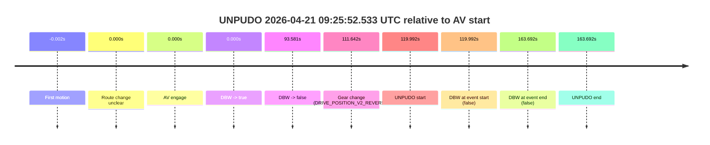
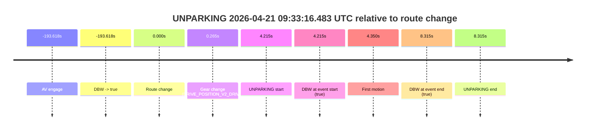

# Run Report: fme20001/2026-04-21--09-18-18--gen2-av-920d8e36-7935-462f-93a7-3ca6af26246e

| Field | Value |
|---|---|
| Run ID | `fme20001/2026-04-21--09-18-18--gen2-av-920d8e36-7935-462f-93a7-3ca6af26246e` |
| Date | `2026-04-21` |
| Model(s) | `eel-teal-outspoken` |
| Author | `zak` |
| Event count | `2` |

## unpudo 2026-04-21 09:25:52.533 UTC

| Field | Value |
|---|---|
| Model | `eel-teal-outspoken` |
| Author | `zak` |
| Run ID | `fme20001/2026-04-21--09-18-18--gen2-av-920d8e36-7935-462f-93a7-3ca6af26246e` |
| Date | `2026-04-21` |
| Time (UTC) | `09:25:52.533` |
| Event type | `unpudo` |
| Disengagement type | `none observed` |
| Route change | `unclear` |
| Console | [run](https://console.sso.wayve.ai/run/fme20001/2026-04-21--09-18-18--gen2-av-920d8e36-7935-462f-93a7-3ca6af26246e?id=&time-unixus=1776763552533310) |
| Foxglove | [segment](https://app.foxglove.dev/wayve-on-prem/p/prj_0dX18KZdVHg1fmmI/view?ds=foxglove-stream&ds.deviceName=fme20001&ds.start=2026-04-21T09%3A23%3A42.540837Z&ds.end=2026-04-21T09%3A26%3A46.233304Z&layoutId=lay_0e7VD4WIKDQGU73Y&time=2026-04-21T09%3A25%3A52.533310Z) |

### Event card: fail

- Fail: the credited unpudo does not stay AV-owned. The event window starts with DBW false, and the maneuver outcome lands outside a clean AV-owned segment.

| Event | Time (UTC) | Delta from AV start |
|---|---:|---:|
| First motion | 2026-04-21 09:23:52.539 | `-0.002s` |
| Route change unclear | 2026-04-21 09:23:52.540 | `0.000s` |
| AV engage | 2026-04-21 09:23:52.540 | `0.000s` |
| DBW -> true | 2026-04-21 09:23:52.540 | `0.000s` |
| DBW -> false | 2026-04-21 09:25:26.121 | `93.581s` |
| Gear change (DRIVE_POSITION_V2_REVERSE) | 2026-04-21 09:25:44.183 | `111.642s` |
| UNPUDO start | 2026-04-21 09:25:52.533 | `119.992s` |
| DBW at event start (false) | 2026-04-21 09:25:52.533 | `119.992s` |
| DBW at event end (false) | 2026-04-21 09:26:36.233 | `163.692s` |
| UNPUDO end | 2026-04-21 09:26:36.233 | `163.692s` |

| Metric | Value |
|---|---|
| Outcome | `fail` |
| Effective failure type | `completed_outside_av` |
| Route change status | `unclear` |
| DBW at event start | `false` |
| DBW at event end | `false` |
| Predicted gear at AV start | `DRIVE_POSITION_V2_DRIVE` |
| Actual gear at AV start | `DRIVE_POSITION_V2_DRIVE` |
| Predicted gear at event start | `DRIVE_POSITION_V2_REVERSE` |
| Actual gear at event start | `DRIVE_POSITION_V2_REVERSE` |
| Planned indicator direction | `INDICATORS_STATE_V2_OFF` |
| Controller indicator direction | `INDICATORS_STATE_V2_OFF` |
| Actual indicator direction | `INDICATORS_STATE_V2_OFF` |
| Actual indicator at maneuver end | `INDICATORS_STATE_V2_OFF` |
| Driver accel help in AV | `false` |
| Driver accel help timestamp | `n/a` |
| Max accel pedal pct in AV | `0.0%` |
| Max brake pedal pct in AV | `0.0%` |
| Max speed mps in AV | `7.603` |
| Success timing baseline | `AV start` |
| Route -> AV | `n/a` |
| AV -> event start | `119.992s` |
| AV -> first motion | `-0.002s` |
| Success baseline -> event start | `119.992s` |
| Success baseline -> first motion | `-0.002s` |
| AV duration before disengagement | `93.581s` |
| Trajectory waypoint count | `38` |
| Driving-plan step count | `11` |

The scored portion starts from the AV-owned window, not from the pre-AV setup. Route-change search in the stopped pre-event segment was `unclear`, with the baseline therefore set to AV start. At the event anchor the model predicts `DRIVE_POSITION_V2_REVERSE` and the actual gear is `DRIVE_POSITION_V2_REVERSE`. The effective model outcome is `fail` because `completed_outside_av.`

### Resolution

| Field | Value |
|---|---|
| Final outcome | `fail` |
| Do we agree with this label? | `yes` |
| Source disengagement type | `none observed` |
| Resolved effective failure type | `completed_outside_av` |
| Confidence | `medium` |

## unparking 2026-04-21 09:33:16.483 UTC

| Field | Value |
|---|---|
| Model | `eel-teal-outspoken` |
| Author | `zak` |
| Run ID | `fme20001/2026-04-21--09-18-18--gen2-av-920d8e36-7935-462f-93a7-3ca6af26246e` |
| Date | `2026-04-21` |
| Time (UTC) | `09:33:16.483` |
| Event type | `unparking` |
| Disengagement type | `none observed` |
| Route change | `found` |
| Console | [run](https://console.sso.wayve.ai/run/fme20001/2026-04-21--09-18-18--gen2-av-920d8e36-7935-462f-93a7-3ca6af26246e?id=&time-unixus=1776763996483305) |
| Foxglove | [segment](https://app.foxglove.dev/wayve-on-prem/p/prj_0dX18KZdVHg1fmmI/view?ds=foxglove-stream&ds.deviceName=fme20001&ds.start=2026-04-21T09%3A29%3A48.650657Z&ds.end=2026-04-21T09%3A33%3A30.583299Z&layoutId=lay_0e7VD4WIKDQGU73Y&time=2026-04-21T09%3A33%3A16.483305Z) |

### Event card: pass

- Pass: AV owns the credited unparking through the official event window, the gear state is aligned at the anchor, and the vehicle moves without driver accelerator help in AV.

| Event | Time (UTC) | Delta from route change |
|---|---:|---:|
| AV engage | 2026-04-21 09:29:58.650 | `-193.618s` |
| DBW -> true | 2026-04-21 09:29:58.650 | `-193.618s` |
| Route change | 2026-04-21 09:33:12.268 | `0.000s` |
| Gear change (DRIVE_POSITION_V2_DRIVE) | 2026-04-21 09:33:12.533 | `0.265s` |
| UNPARKING start | 2026-04-21 09:33:16.483 | `4.215s` |
| DBW at event start (true) | 2026-04-21 09:33:16.483 | `4.215s` |
| First motion | 2026-04-21 09:33:16.618 | `4.350s` |
| DBW at event end (true) | 2026-04-21 09:33:20.583 | `8.315s` |
| UNPARKING end | 2026-04-21 09:33:20.583 | `8.315s` |

| Metric | Value |
|---|---|
| Outcome | `pass` |
| Effective failure type | `none` |
| Route change status | `found` |
| DBW at event start | `true` |
| DBW at event end | `true` |
| Predicted gear at AV start | `DRIVE_POSITION_V2_DRIVE` |
| Actual gear at AV start | `DRIVE_POSITION_V2_DRIVE` |
| Predicted gear at event start | `DRIVE_POSITION_V2_DRIVE` |
| Actual gear at event start | `DRIVE_POSITION_V2_DRIVE` |
| Planned indicator direction | `INDICATORS_STATE_V2_OFF` |
| Controller indicator direction | `INDICATORS_STATE_V2_OFF` |
| Actual indicator direction | `INDICATORS_STATE_V2_OFF` |
| Actual indicator at maneuver end | `INDICATORS_STATE_V2_OFF` |
| Driver accel help in AV | `false` |
| Driver accel help timestamp | `n/a` |
| Max accel pedal pct in AV | `0.0%` |
| Max brake pedal pct in AV | `0.0%` |
| Max speed mps in AV | `4.394` |
| Success timing baseline | `AV start` |
| Route -> AV | `-193.618s` |
| AV -> event start | `197.833s` |
| AV -> first motion | `197.968s` |
| Success baseline -> event start | `197.833s` |
| Success baseline -> first motion | `197.968s` |
| AV duration before disengagement | `n/a` |
| Trajectory waypoint count | `37` |
| Driving-plan step count | `11` |

The scored portion starts from the AV-owned window, not from the pre-AV setup. Route-change search in the stopped pre-event segment was `found`, with the baseline therefore set to route change. At the event anchor the model predicts `DRIVE_POSITION_V2_DRIVE` and the actual gear is `DRIVE_POSITION_V2_DRIVE`. The effective model outcome is `pass` because `the credited maneuver stays AV-owned through the official event end.`

### Resolution

| Field | Value |
|---|---|
| Final outcome | `pass` |
| Do we agree with this label? | `yes` |
| Source disengagement type | `none observed` |
| Resolved effective failure type | `none` |
| Confidence | `high` |
