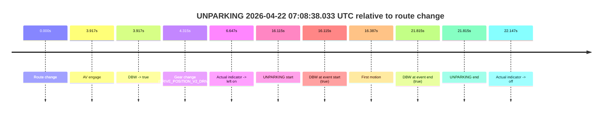

# Run Report: fme20001/2026-04-22--07-02-01--gen2-av-ff256b18-c683-46ef-b0cb-735eec633ca6

| Field | Value |
|---|---|
| Run ID | `fme20001/2026-04-22--07-02-01--gen2-av-ff256b18-c683-46ef-b0cb-735eec633ca6` |
| Date | `2026-04-22` |
| Model(s) | `pink-manta-ray-smooth` |
| Author | `guy.geva` |
| Event count | `1` |

## unparking 2026-04-22 07:08:38.033 UTC

| Field | Value |
|---|---|
| Model | `pink-manta-ray-smooth` |
| Author | `guy.geva` |
| Run ID | `fme20001/2026-04-22--07-02-01--gen2-av-ff256b18-c683-46ef-b0cb-735eec633ca6` |
| Date | `2026-04-22` |
| Time (UTC) | `07:08:38.033` |
| Event type | `unparking` |
| Disengagement type | `none observed` |
| Route change | `found` |
| Console | [run](https://console.sso.wayve.ai/run/fme20001/2026-04-22--07-02-01--gen2-av-ff256b18-c683-46ef-b0cb-735eec633ca6?id=&time-unixus=1776841718033315) |
| Foxglove | [segment](https://app.foxglove.dev/wayve-on-prem/p/prj_0dX18KZdVHg1fmmI/view?ds=foxglove-stream&ds.deviceName=fme20001&ds.start=2026-04-22T07%3A08%3A11.918526Z&ds.end=2026-04-22T07%3A08%3A53.733313Z&layoutId=lay_0e7VD4WIKDQGU73Y&time=2026-04-22T07%3A08%3A38.033315Z) |

### Event card: pass

- Pass: AV owns the credited unparking through the official event window, the gear state is aligned at the anchor, and the vehicle moves without driver accelerator help in AV.

| Event | Time (UTC) | Delta from route change |
|---|---:|---:|
| Route change | 2026-04-22 07:08:21.918 | `0.000s` |
| AV engage | 2026-04-22 07:08:25.835 | `3.917s` |
| DBW -> true | 2026-04-22 07:08:25.835 | `3.917s` |
| Gear change (DRIVE_POSITION_V2_DRIVE) | 2026-04-22 07:08:26.233 | `4.315s` |
| Actual indicator -> left on | 2026-04-22 07:08:28.565 | `6.647s` |
| UNPARKING start | 2026-04-22 07:08:38.033 | `16.115s` |
| DBW at event start (true) | 2026-04-22 07:08:38.033 | `16.115s` |
| First motion | 2026-04-22 07:08:38.305 | `16.387s` |
| DBW at event end (true) | 2026-04-22 07:08:43.733 | `21.815s` |
| UNPARKING end | 2026-04-22 07:08:43.733 | `21.815s` |
| Actual indicator -> off | 2026-04-22 07:08:44.065 | `22.147s` |

| Metric | Value |
|---|---|
| Outcome | `pass` |
| Effective failure type | `none` |
| Route change status | `found` |
| DBW at event start | `true` |
| DBW at event end | `true` |
| Predicted gear at AV start | `DRIVE_POSITION_V2_DRIVE` |
| Actual gear at AV start | `DRIVE_POSITION_V2_PARK` |
| Predicted gear at event start | `DRIVE_POSITION_V2_DRIVE` |
| Actual gear at event start | `DRIVE_POSITION_V2_DRIVE` |
| Planned indicator direction | `INDICATORS_STATE_V2_OFF` |
| Controller indicator direction | `INDICATORS_STATE_V2_OFF` |
| Actual indicator direction | `INDICATORS_STATE_V2_LEFT_ON` |
| Actual indicator at maneuver end | `INDICATORS_STATE_V2_LEFT_ON` |
| Driver accel help in AV | `false` |
| Driver accel help timestamp | `n/a` |
| Max accel pedal pct in AV | `0.0%` |
| Max brake pedal pct in AV | `0.0%` |
| Max speed mps in AV | `2.550` |
| Success timing baseline | `route change` |
| Route -> AV | `3.917s` |
| AV -> event start | `12.197s` |
| AV -> first motion | `12.470s` |
| Success baseline -> event start | `16.115s` |
| Success baseline -> first motion | `16.387s` |
| AV duration before disengagement | `n/a` |
| Trajectory waypoint count | `35` |
| Driving-plan step count | `11` |

The scored portion starts from the AV-owned window, not from the pre-AV setup. Route-change search in the stopped pre-event segment was `found`, with the baseline therefore set to route change. At the event anchor the model predicts `DRIVE_POSITION_V2_DRIVE` and the actual gear is `DRIVE_POSITION_V2_DRIVE`. The effective model outcome is `pass` because `the credited maneuver stays AV-owned through the official event end.`

### Resolution

| Field | Value |
|---|---|
| Final outcome | `pass` |
| Do we agree with this label? | `yes` |
| Source disengagement type | `none observed` |
| Resolved effective failure type | `none` |
| Confidence | `high` |
