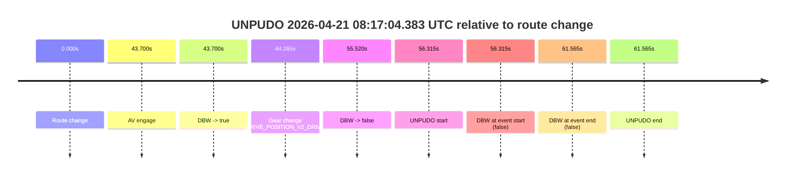

# Run Report: fme20002/2026-04-21--07-39-14--gen2-av-94cc1a13-bc5c-4699-9a1b-87a71dcb8e05

| Field | Value |
|---|---|
| Run ID | `fme20002/2026-04-21--07-39-14--gen2-av-94cc1a13-bc5c-4699-9a1b-87a71dcb8e05` |
| Date | `2026-04-21` |
| Model(s) | `eel-teal-outspoken` |
| Author | `zak` |
| Event count | `1` |

## unpudo 2026-04-21 08:17:04.383 UTC

| Field | Value |
|---|---|
| Model | `eel-teal-outspoken` |
| Author | `zak` |
| Run ID | `fme20002/2026-04-21--07-39-14--gen2-av-94cc1a13-bc5c-4699-9a1b-87a71dcb8e05` |
| Date | `2026-04-21` |
| Time (UTC) | `08:17:04.383` |
| Event type | `unpudo` |
| Disengagement type | `none observed` |
| Route change | `found` |
| Console | [run](https://console.sso.wayve.ai/run/fme20002/2026-04-21--07-39-14--gen2-av-94cc1a13-bc5c-4699-9a1b-87a71dcb8e05?id=&time-unixus=1776759424383301) |
| Foxglove | [segment](https://app.foxglove.dev/wayve-on-prem/p/prj_0dX18KZdVHg1fmmI/view?ds=foxglove-stream&ds.deviceName=fme20002&ds.start=2026-04-21T08%3A15%3A58.068335Z&ds.end=2026-04-21T08%3A17%3A19.633313Z&layoutId=lay_0e7VD4WIKDQGU73Y&time=2026-04-21T08%3A17%3A04.383301Z) |

### Event card: fail

- Fail: the credited unpudo does not stay AV-owned. The event window starts with DBW false, and the maneuver outcome lands outside a clean AV-owned segment.

| Event | Time (UTC) | Delta from route change |
|---|---:|---:|
| Route change | 2026-04-21 08:16:08.068 | `0.000s` |
| AV engage | 2026-04-21 08:16:51.768 | `43.700s` |
| DBW -> true | 2026-04-21 08:16:51.768 | `43.700s` |
| Gear change (DRIVE_POSITION_V2_DRIVE) | 2026-04-21 08:16:52.333 | `44.265s` |
| DBW -> false | 2026-04-21 08:17:03.588 | `55.520s` |
| UNPUDO start | 2026-04-21 08:17:04.383 | `56.315s` |
| DBW at event start (false) | 2026-04-21 08:17:04.383 | `56.315s` |
| DBW at event end (false) | 2026-04-21 08:17:09.633 | `61.565s` |
| UNPUDO end | 2026-04-21 08:17:09.633 | `61.565s` |

| Metric | Value |
|---|---|
| Outcome | `fail` |
| Effective failure type | `not_av_owned` |
| Route change status | `found` |
| DBW at event start | `false` |
| DBW at event end | `false` |
| Predicted gear at AV start | `DRIVE_POSITION_V2_DRIVE` |
| Actual gear at AV start | `DRIVE_POSITION_V2_PARK` |
| Predicted gear at event start | `DRIVE_POSITION_V2_DRIVE` |
| Actual gear at event start | `DRIVE_POSITION_V2_DRIVE` |
| Planned indicator direction | `INDICATORS_STATE_V2_RIGHT_ON` |
| Controller indicator direction | `INDICATORS_STATE_V2_RIGHT_ON` |
| Actual indicator direction | `INDICATORS_STATE_V2_OFF` |
| Actual indicator at maneuver end | `INDICATORS_STATE_V2_OFF` |
| Driver accel help in AV | `false` |
| Driver accel help timestamp | `n/a` |
| Max accel pedal pct in AV | `0.0%` |
| Max brake pedal pct in AV | `8.0%` |
| Max speed mps in AV | `0.000` |
| Success timing baseline | `route change` |
| Route -> AV | `43.700s` |
| AV -> event start | `12.615s` |
| AV -> first motion | `n/a` |
| Success baseline -> event start | `56.315s` |
| Success baseline -> first motion | `n/a` |
| AV duration before disengagement | `11.820s` |
| Trajectory waypoint count | `37` |
| Driving-plan step count | `11` |

The scored portion starts from the AV-owned window, not from the pre-AV setup. Route-change search in the stopped pre-event segment was `found`, with the baseline therefore set to route change. At the event anchor the model predicts `DRIVE_POSITION_V2_DRIVE` and the actual gear is `DRIVE_POSITION_V2_DRIVE`. The effective model outcome is `fail` because `not_av_owned.`

### Resolution

| Field | Value |
|---|---|
| Final outcome | `fail` |
| Do we agree with this label? | `yes` |
| Source disengagement type | `none observed` |
| Resolved effective failure type | `not_av_owned` |
| Confidence | `high` |
