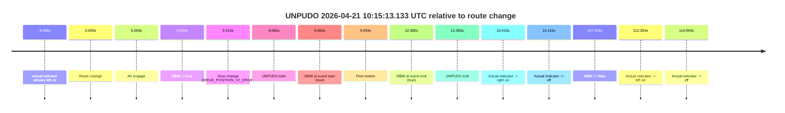
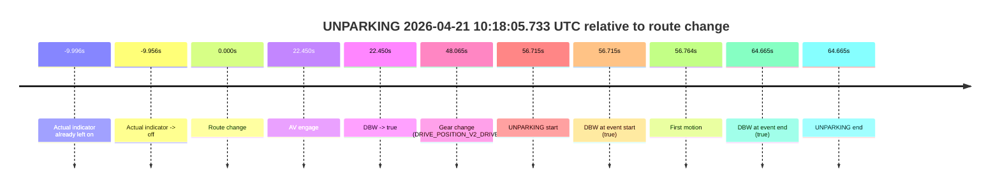

# Run Report: fme20002/2026-04-21--09-49-51--gen2-av-0e2899fe-e0ac-4a0a-a362-8997f19d6cce

| Field | Value |
|---|---|
| Run ID | `fme20002/2026-04-21--09-49-51--gen2-av-0e2899fe-e0ac-4a0a-a362-8997f19d6cce` |
| Date | `2026-04-21` |
| Model(s) | `eel-teal-outspoken` |
| Author | `zak` |
| Event count | `2` |

## unpudo 2026-04-21 10:15:13.133 UTC

| Field | Value |
|---|---|
| Model | `eel-teal-outspoken` |
| Author | `zak` |
| Run ID | `fme20002/2026-04-21--09-49-51--gen2-av-0e2899fe-e0ac-4a0a-a362-8997f19d6cce` |
| Date | `2026-04-21` |
| Time (UTC) | `10:15:13.133` |
| Event type | `unpudo` |
| Disengagement type | `none observed` |
| Route change | `found` |
| Console | [run](https://console.sso.wayve.ai/run/fme20002/2026-04-21--09-49-51--gen2-av-0e2899fe-e0ac-4a0a-a362-8997f19d6cce?id=&time-unixus=1776766513133311) |
| Foxglove | [segment](https://app.foxglove.dev/wayve-on-prem/p/prj_0dX18KZdVHg1fmmI/view?ds=foxglove-stream&ds.deviceName=fme20002&ds.start=2026-04-21T10%3A14%3A54.068282Z&ds.end=2026-04-21T10%3A17%3A01.986937Z&layoutId=lay_0e7VD4WIKDQGU73Y&time=2026-04-21T10%3A15%3A13.133311Z) |

### Event card: pass

- Pass: AV owns the credited unpudo from route change through the official unpudo window, the gear state is aligned at the anchor, and the vehicle moves without driver accelerator help in AV.

| Event | Time (UTC) | Delta from route change |
|---|---:|---:|
| Actual indicator already left on | 2026-04-21 10:14:54.082 | `-9.986s` |
| Route change | 2026-04-21 10:15:04.068 | `0.000s` |
| AV engage | 2026-04-21 10:15:09.127 | `5.059s` |
| DBW -> true | 2026-04-21 10:15:09.127 | `5.059s` |
| Gear change (DRIVE_POSITION_V2_DRIVE) | 2026-04-21 10:15:09.583 | `5.515s` |
| UNPUDO start | 2026-04-21 10:15:13.133 | `9.065s` |
| DBW at event start (true) | 2026-04-21 10:15:13.133 | `9.065s` |
| First motion | 2026-04-21 10:15:13.162 | `9.094s` |
| DBW at event end (true) | 2026-04-21 10:15:16.433 | `12.365s` |
| UNPUDO end | 2026-04-21 10:15:16.433 | `12.365s` |
| Actual indicator -> right on | 2026-04-21 10:15:17.482 | `13.415s` |
| Actual indicator -> off | 2026-04-21 10:15:18.183 | `14.115s` |
| DBW -> false | 2026-04-21 10:16:51.986 | `107.919s` |
| Actual indicator -> left on | 2026-04-21 10:16:56.422 | `112.354s` |
| Actual indicator -> off | 2026-04-21 10:16:59.062 | `114.994s` |

| Metric | Value |
|---|---|
| Outcome | `pass` |
| Effective failure type | `none` |
| Route change status | `found` |
| DBW at event start | `true` |
| DBW at event end | `true` |
| Predicted gear at AV start | `DRIVE_POSITION_V2_DRIVE` |
| Actual gear at AV start | `DRIVE_POSITION_V2_PARK` |
| Predicted gear at event start | `DRIVE_POSITION_V2_DRIVE` |
| Actual gear at event start | `DRIVE_POSITION_V2_DRIVE` |
| Planned indicator direction | `INDICATORS_STATE_V2_RIGHT_ON` |
| Controller indicator direction | `INDICATORS_STATE_V2_RIGHT_ON` |
| Actual indicator direction | `INDICATORS_STATE_V2_LEFT_ON` |
| Actual indicator at maneuver end | `INDICATORS_STATE_V2_LEFT_ON` |
| Driver accel help in AV | `false` |
| Driver accel help timestamp | `n/a` |
| Max accel pedal pct in AV | `0.0%` |
| Max brake pedal pct in AV | `8.0%` |
| Max speed mps in AV | `5.700` |
| Success timing baseline | `route change` |
| Route -> AV | `5.059s` |
| AV -> event start | `4.006s` |
| AV -> first motion | `4.035s` |
| Success baseline -> event start | `9.065s` |
| Success baseline -> first motion | `9.094s` |
| AV duration before disengagement | `102.860s` |
| Trajectory waypoint count | `37` |
| Driving-plan step count | `11` |

The scored portion starts from the AV-owned window, not from the pre-AV setup. Route-change search in the stopped pre-event segment was `found`, with the baseline therefore set to route change. At the event anchor the model predicts `DRIVE_POSITION_V2_DRIVE` and the actual gear is `DRIVE_POSITION_V2_DRIVE`. The effective model outcome is `pass` because `the credited unpudo stays AV-owned through the official unpudo window.`

### Resolution

| Field | Value |
|---|---|
| Final outcome | `pass` |
| Do we agree with this label? | `yes` |
| Source disengagement type | `none observed` |
| Resolved effective failure type | `none` |
| Confidence | `high` |

## unparking 2026-04-21 10:18:05.733 UTC

| Field | Value |
|---|---|
| Model | `eel-teal-outspoken` |
| Author | `zak` |
| Run ID | `fme20002/2026-04-21--09-49-51--gen2-av-0e2899fe-e0ac-4a0a-a362-8997f19d6cce` |
| Date | `2026-04-21` |
| Time (UTC) | `10:18:05.733` |
| Event type | `unparking` |
| Disengagement type | `none observed` |
| Route change | `found` |
| Console | [run](https://console.sso.wayve.ai/run/fme20002/2026-04-21--09-49-51--gen2-av-0e2899fe-e0ac-4a0a-a362-8997f19d6cce?id=&time-unixus=1776766685733315) |
| Foxglove | [segment](https://app.foxglove.dev/wayve-on-prem/p/prj_0dX18KZdVHg1fmmI/view?ds=foxglove-stream&ds.deviceName=fme20002&ds.start=2026-04-21T10%3A16%3A59.018313Z&ds.end=2026-04-21T10%3A18%3A23.683322Z&layoutId=lay_0e7VD4WIKDQGU73Y&time=2026-04-21T10%3A18%3A05.733315Z) |

### Event card: pass

- Pass: AV owns the credited unparking through the official event window, the gear state is aligned at the anchor, and the vehicle moves without driver accelerator help in AV.

| Event | Time (UTC) | Delta from route change |
|---|---:|---:|
| Actual indicator already left on | 2026-04-21 10:16:59.022 | `-9.996s` |
| Actual indicator -> off | 2026-04-21 10:16:59.062 | `-9.956s` |
| Route change | 2026-04-21 10:17:09.018 | `0.000s` |
| AV engage | 2026-04-21 10:17:31.468 | `22.450s` |
| DBW -> true | 2026-04-21 10:17:31.468 | `22.450s` |
| Gear change (DRIVE_POSITION_V2_DRIVE) | 2026-04-21 10:17:57.083 | `48.065s` |
| UNPARKING start | 2026-04-21 10:18:05.733 | `56.715s` |
| DBW at event start (true) | 2026-04-21 10:18:05.733 | `56.715s` |
| First motion | 2026-04-21 10:18:05.782 | `56.764s` |
| DBW at event end (true) | 2026-04-21 10:18:13.683 | `64.665s` |
| UNPARKING end | 2026-04-21 10:18:13.683 | `64.665s` |

| Metric | Value |
|---|---|
| Outcome | `pass` |
| Effective failure type | `none` |
| Route change status | `found` |
| DBW at event start | `true` |
| DBW at event end | `true` |
| Predicted gear at AV start | `DRIVE_POSITION_V2_DRIVE` |
| Actual gear at AV start | `DRIVE_POSITION_V2_DRIVE` |
| Predicted gear at event start | `DRIVE_POSITION_V2_DRIVE` |
| Actual gear at event start | `DRIVE_POSITION_V2_DRIVE` |
| Planned indicator direction | `INDICATORS_STATE_V2_RIGHT_ON` |
| Controller indicator direction | `INDICATORS_STATE_V2_RIGHT_ON` |
| Actual indicator direction | `INDICATORS_STATE_V2_OFF` |
| Actual indicator at maneuver end | `INDICATORS_STATE_V2_OFF` |
| Driver accel help in AV | `false` |
| Driver accel help timestamp | `n/a` |
| Max accel pedal pct in AV | `0.0%` |
| Max brake pedal pct in AV | `0.0%` |
| Max speed mps in AV | `2.289` |
| Success timing baseline | `route change` |
| Route -> AV | `22.450s` |
| AV -> event start | `34.265s` |
| AV -> first motion | `34.315s` |
| Success baseline -> event start | `56.715s` |
| Success baseline -> first motion | `56.764s` |
| AV duration before disengagement | `n/a` |
| Trajectory waypoint count | `37` |
| Driving-plan step count | `11` |

The scored portion starts from the AV-owned window, not from the pre-AV setup. Route-change search in the stopped pre-event segment was `found`, with the baseline therefore set to route change. At the event anchor the model predicts `DRIVE_POSITION_V2_DRIVE` and the actual gear is `DRIVE_POSITION_V2_DRIVE`. The effective model outcome is `pass` because `the credited maneuver stays AV-owned through the official event end.`

### Resolution

| Field | Value |
|---|---|
| Final outcome | `pass` |
| Do we agree with this label? | `yes` |
| Source disengagement type | `none observed` |
| Resolved effective failure type | `none` |
| Confidence | `high` |
