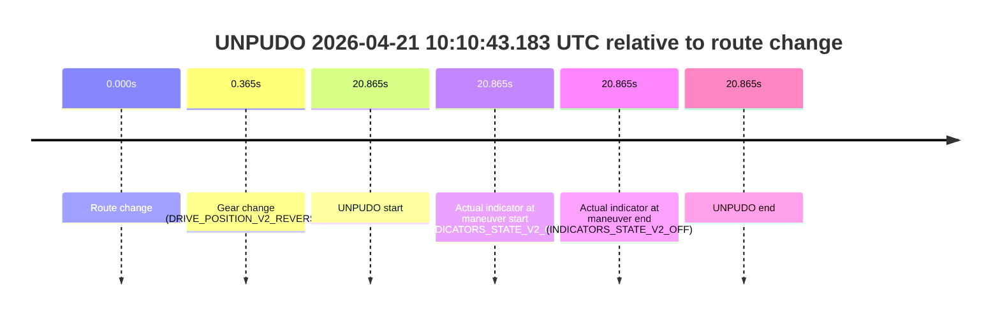
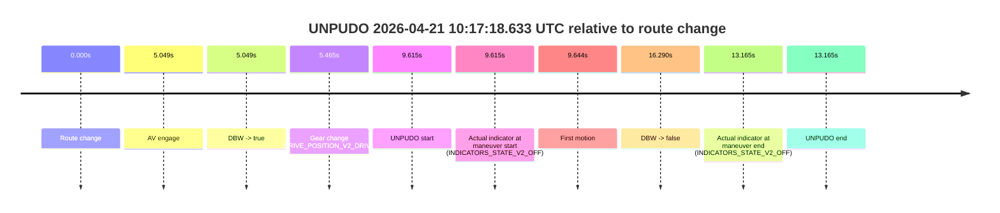

# Run Report: fme20002/2026-04-21--09-49-51--gen2-av-0e2899fe-e0ac-4a0a-a362-8997f19d6cce

| Field | Value |
|---|---|
| Run ID | `fme20002/2026-04-21--09-49-51--gen2-av-0e2899fe-e0ac-4a0a-a362-8997f19d6cce` |
| Date | `2026-04-21` |
| Model(s) | `pink-manta-ray-smooth` |
| Author | `guy.geva` |
| Event count | `3` |

## unpudo 2026-04-21 10:10:43.183 UTC

| Field | Value |
|---|---|
| Model | `pink-manta-ray-smooth` |
| Author | `guy.geva` |
| Run ID | `fme20002/2026-04-21--09-49-51--gen2-av-0e2899fe-e0ac-4a0a-a362-8997f19d6cce` |
| Date | `2026-04-21` |
| Time (UTC) | `10:10:43.183` |
| Event type | `unpudo` |
| Disengagement type | `none observed` |
| Route change | `found` |
| Console | [run](https://console.sso.wayve.ai/run/fme20002/2026-04-21--09-49-51--gen2-av-0e2899fe-e0ac-4a0a-a362-8997f19d6cce?id=&time-unixus=1776766243183306) |
| Foxglove | [segment](https://app.foxglove.dev/wayve-on-prem/p/prj_0dX18KZdVHg1fmmI/view?ds=foxglove-stream&ds.deviceName=fme20002&ds.start=2026-04-21T10%3A10%3A12.318301Z&ds.end=2026-04-21T10%3A10%3A53.183306Z&layoutId=lay_0e7VD4WIKDQGU73Y&time=2026-04-21T10%3A10%3A43.183306Z) |

### Event card: non-av

- Non-AV: there is no AV-owned portion anywhere inside the detected unpudo timeline, so it is kept for coverage but excluded from model success / failure scoring.

| Event | Time (UTC) | Delta from route change |
|---|---:|---:|
| Route change | 2026-04-21 10:10:22.318 | `0.000s` |
| Gear change (DRIVE_POSITION_V2_REVERSE) | 2026-04-21 10:10:22.683 | `0.365s` |
| UNPUDO start | 2026-04-21 10:10:43.183 | `20.865s` |
| Actual indicator at maneuver start (INDICATORS_STATE_V2_OFF) | 2026-04-21 10:10:43.183 | `20.865s` |
| Actual indicator at maneuver end (INDICATORS_STATE_V2_OFF) | 2026-04-21 10:10:43.183 | `20.865s` |
| UNPUDO end | 2026-04-21 10:10:43.183 | `20.865s` |

| Metric | Value |
|---|---|
| Outcome | `non-av` |
| Effective failure type | `none` |
| Route change status | `found` |
| DBW at event start | `false` |
| DBW at event end | `false` |
| Predicted gear at AV start | `n/a` |
| Actual gear at AV start | `n/a` |
| Predicted gear at event start | `DRIVE_POSITION_V2_REVERSE` |
| Actual gear at event start | `DRIVE_POSITION_V2_REVERSE` |
| Planned indicator direction | `INDICATORS_STATE_V2_OFF` |
| Controller indicator direction | `INDICATORS_STATE_V2_OFF` |
| Actual indicator direction | `INDICATORS_STATE_V2_OFF` |
| Actual indicator at maneuver end | `INDICATORS_STATE_V2_OFF` |
| Driver accel help in AV | `false` |
| Driver accel help timestamp | `n/a` |
| Max accel pedal pct in AV | `0.0%` |
| Max brake pedal pct in AV | `0.0%` |
| Max speed mps in AV | `0.000` |
| Route -> AV | `n/a` |
| AV -> event start | `n/a` |
| AV -> first motion | `n/a` |
| AV duration before disengagement | `n/a` |
| Trajectory waypoint count | `37` |
| Driving-plan step count | `11` |

The scored portion starts from the AV-owned window, not from the pre-AV setup. Route-change search in the stopped pre-event segment was `found`, with the baseline therefore set to route change. At the event anchor the model predicts `DRIVE_POSITION_V2_REVERSE` and the actual gear is `DRIVE_POSITION_V2_REVERSE`. The effective model outcome is `non-av` because `there is no AV-owned overlap inside the event timeline`.

### Resolution

| Field | Value |
|---|---|
| Final outcome | `non-av` |
| Do we agree with this label? | `yes` |
| Source disengagement type | `none observed` |
| Resolved effective failure type | `none` |
| Confidence | `high` |

## unpudo 2026-04-21 10:11:05.983 UTC

| Field | Value |
|---|---|
| Model | `pink-manta-ray-smooth` |
| Author | `guy.geva` |
| Run ID | `fme20002/2026-04-21--09-49-51--gen2-av-0e2899fe-e0ac-4a0a-a362-8997f19d6cce` |
| Date | `2026-04-21` |
| Time (UTC) | `10:11:05.983` |
| Event type | `unpudo` |
| Disengagement type | `none observed` |
| Route change | `found` |
| Console | [run](https://console.sso.wayve.ai/run/fme20002/2026-04-21--09-49-51--gen2-av-0e2899fe-e0ac-4a0a-a362-8997f19d6cce?id=&time-unixus=1776766265983303) |
| Foxglove | [segment](https://app.foxglove.dev/wayve-on-prem/p/prj_0dX18KZdVHg1fmmI/view?ds=foxglove-stream&ds.deviceName=fme20002&ds.start=2026-04-21T10%3A10%3A12.318301Z&ds.end=2026-04-21T10%3A12%3A46.888195Z&layoutId=lay_0e7VD4WIKDQGU73Y&time=2026-04-21T10%3A11%3A05.983303Z) |

### Event card: pass

- Pass: AV owns the credited unpudo through the official event window, the gear state is aligned at the anchor, and the vehicle moves without driver accelerator help in AV.

| Event | Time (UTC) | Delta from route change |
|---|---:|---:|
| Route change | 2026-04-21 10:10:22.318 | `0.000s` |
| AV engage | 2026-04-21 10:11:25.707 | `63.389s` |
| DBW -> true | 2026-04-21 10:11:25.707 | `63.389s` |
| Gear change (DRIVE_POSITION_V2_DRIVE) | 2026-04-21 10:11:03.383 | `41.065s` |
| UNPUDO start | 2026-04-21 10:11:05.983 | `43.665s` |
| Actual indicator at maneuver start (INDICATORS_STATE_V2_OFF) | 2026-04-21 10:11:05.983 | `43.665s` |
| First motion | 2026-04-21 10:11:06.082 | `43.764s` |
| DBW -> false | 2026-04-21 10:12:36.888 | `134.570s` |
| Actual indicator at maneuver end (INDICATORS_STATE_V2_OFF) | 2026-04-21 10:11:34.083 | `71.765s` |
| UNPUDO end | 2026-04-21 10:11:34.083 | `71.765s` |

| Metric | Value |
|---|---|
| Outcome | `pass` |
| Effective failure type | `none` |
| Route change status | `found` |
| DBW at event start | `false` |
| DBW at event end | `true` |
| Predicted gear at AV start | `DRIVE_POSITION_V2_DRIVE` |
| Actual gear at AV start | `DRIVE_POSITION_V2_PARK` |
| Predicted gear at event start | `DRIVE_POSITION_V2_DRIVE` |
| Actual gear at event start | `DRIVE_POSITION_V2_DRIVE` |
| Planned indicator direction | `INDICATORS_STATE_V2_OFF` |
| Controller indicator direction | `INDICATORS_STATE_V2_OFF` |
| Actual indicator direction | `INDICATORS_STATE_V2_OFF` |
| Actual indicator at maneuver end | `INDICATORS_STATE_V2_OFF` |
| Driver accel help in AV | `false` |
| Driver accel help timestamp | `n/a` |
| Max accel pedal pct in AV | `0.0%` |
| Max brake pedal pct in AV | `8.0%` |
| Max speed mps in AV | `2.236` |
| Route -> AV | `63.389s` |
| AV -> event start | `-19.724s` |
| AV -> first motion | `-19.625s` |
| AV duration before disengagement | `71.181s` |
| Trajectory waypoint count | `36` |
| Driving-plan step count | `11` |

The scored portion starts from the AV-owned window, not from the pre-AV setup. Route-change search in the stopped pre-event segment was `found`, with the baseline therefore set to route change. At the event anchor the model predicts `DRIVE_POSITION_V2_DRIVE` and the actual gear is `DRIVE_POSITION_V2_DRIVE`. The effective model outcome is `pass` because `the credited maneuver stays AV-owned through the official event end`.

### Resolution

| Field | Value |
|---|---|
| Final outcome | `pass` |
| Do we agree with this label? | `yes` |
| Source disengagement type | `none observed` |
| Resolved effective failure type | `none` |
| Confidence | `high` |

## unpudo 2026-04-21 10:17:18.633 UTC

| Field | Value |
|---|---|
| Model | `pink-manta-ray-smooth` |
| Author | `guy.geva` |
| Run ID | `fme20002/2026-04-21--09-49-51--gen2-av-0e2899fe-e0ac-4a0a-a362-8997f19d6cce` |
| Date | `2026-04-21` |
| Time (UTC) | `10:17:18.633` |
| Event type | `unpudo` |
| Disengagement type | `none observed` |
| Route change | `found` |
| Console | [run](https://console.sso.wayve.ai/run/fme20002/2026-04-21--09-49-51--gen2-av-0e2899fe-e0ac-4a0a-a362-8997f19d6cce?id=&time-unixus=1776766638633294) |
| Foxglove | [segment](https://app.foxglove.dev/wayve-on-prem/p/prj_0dX18KZdVHg1fmmI/view?ds=foxglove-stream&ds.deviceName=fme20002&ds.start=2026-04-21T10%3A16%3A59.018313Z&ds.end=2026-04-21T10%3A17%3A35.308271Z&layoutId=lay_0e7VD4WIKDQGU73Y&time=2026-04-21T10%3A17%3A18.633294Z) |

### Event card: pass

- Pass: AV owns the credited unpudo through the official event window, the gear state is aligned at the anchor, and the vehicle moves without driver accelerator help in AV.

| Event | Time (UTC) | Delta from route change |
|---|---:|---:|
| Route change | 2026-04-21 10:17:09.018 | `0.000s` |
| AV engage | 2026-04-21 10:17:14.067 | `5.049s` |
| DBW -> true | 2026-04-21 10:17:14.067 | `5.049s` |
| Gear change (DRIVE_POSITION_V2_DRIVE) | 2026-04-21 10:17:14.483 | `5.465s` |
| UNPUDO start | 2026-04-21 10:17:18.633 | `9.615s` |
| Actual indicator at maneuver start (INDICATORS_STATE_V2_OFF) | 2026-04-21 10:17:18.633 | `9.615s` |
| First motion | 2026-04-21 10:17:18.662 | `9.644s` |
| DBW -> false | 2026-04-21 10:17:25.308 | `16.290s` |
| Actual indicator at maneuver end (INDICATORS_STATE_V2_OFF) | 2026-04-21 10:17:22.183 | `13.165s` |
| UNPUDO end | 2026-04-21 10:17:22.183 | `13.165s` |

| Metric | Value |
|---|---|
| Outcome | `pass` |
| Effective failure type | `none` |
| Route change status | `found` |
| DBW at event start | `true` |
| DBW at event end | `true` |
| Predicted gear at AV start | `DRIVE_POSITION_V2_DRIVE` |
| Actual gear at AV start | `DRIVE_POSITION_V2_PARK` |
| Predicted gear at event start | `DRIVE_POSITION_V2_DRIVE` |
| Actual gear at event start | `DRIVE_POSITION_V2_DRIVE` |
| Planned indicator direction | `INDICATORS_STATE_V2_RIGHT_ON` |
| Controller indicator direction | `INDICATORS_STATE_V2_RIGHT_ON` |
| Actual indicator direction | `INDICATORS_STATE_V2_OFF` |
| Actual indicator at maneuver end | `INDICATORS_STATE_V2_OFF` |
| Driver accel help in AV | `false` |
| Driver accel help timestamp | `n/a` |
| Max accel pedal pct in AV | `0.0%` |
| Max brake pedal pct in AV | `0.0%` |
| Max speed mps in AV | `5.139` |
| Route -> AV | `5.049s` |
| AV -> event start | `4.566s` |
| AV -> first motion | `4.595s` |
| AV duration before disengagement | `11.241s` |
| Trajectory waypoint count | `37` |
| Driving-plan step count | `11` |

The scored portion starts from the AV-owned window, not from the pre-AV setup. Route-change search in the stopped pre-event segment was `found`, with the baseline therefore set to route change. At the event anchor the model predicts `DRIVE_POSITION_V2_DRIVE` and the actual gear is `DRIVE_POSITION_V2_DRIVE`. The effective model outcome is `pass` because `the credited maneuver stays AV-owned through the official event end`.

### Resolution

| Field | Value |
|---|---|
| Final outcome | `pass` |
| Do we agree with this label? | `yes` |
| Source disengagement type | `none observed` |
| Resolved effective failure type | `none` |
| Confidence | `high` |
