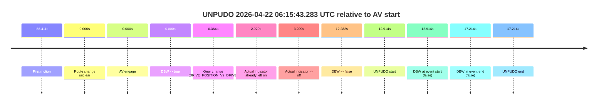
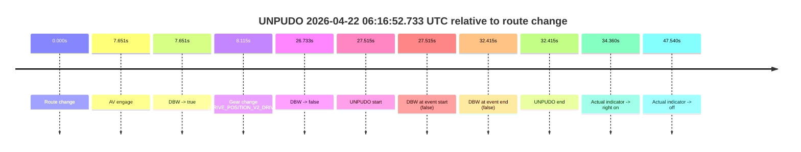
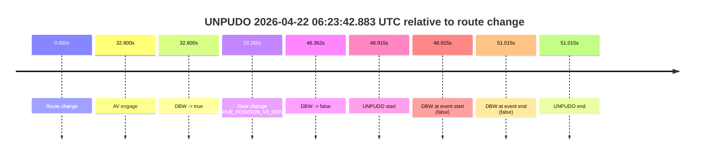

# Run Report: fme20002/2026-04-22--06-13-18--gen2-av-dff8b708-579d-4578-9edb-cf0078124ac3

| Field | Value |
|---|---|
| Run ID | `fme20002/2026-04-22--06-13-18--gen2-av-dff8b708-579d-4578-9edb-cf0078124ac3` |
| Date | `2026-04-22` |
| Model(s) | `pink-manta-ray-smooth` |
| Author | `guy.geva` |
| Event count | `3` |

## unpudo 2026-04-22 06:15:43.283 UTC

| Field | Value |
|---|---|
| Model | `pink-manta-ray-smooth` |
| Author | `guy.geva` |
| Run ID | `fme20002/2026-04-22--06-13-18--gen2-av-dff8b708-579d-4578-9edb-cf0078124ac3` |
| Date | `2026-04-22` |
| Time (UTC) | `06:15:43.283` |
| Event type | `unpudo` |
| Disengagement type | `none observed` |
| Route change | `unclear` |
| Console | [run](https://console.sso.wayve.ai/run/fme20002/2026-04-22--06-13-18--gen2-av-dff8b708-579d-4578-9edb-cf0078124ac3?id=&time-unixus=1776838543283294) |
| Foxglove | [segment](https://app.foxglove.dev/wayve-on-prem/p/prj_0dX18KZdVHg1fmmI/view?ds=foxglove-stream&ds.deviceName=fme20002&ds.start=2026-04-22T06%3A15%3A20.368955Z&ds.end=2026-04-22T06%3A15%3A57.583313Z&layoutId=lay_0e7VD4WIKDQGU73Y&time=2026-04-22T06%3A15%3A43.283294Z) |

### Event card: fail

- Fail: the credited unpudo does not stay AV-owned. The event window starts with DBW false, and the maneuver outcome lands outside a clean AV-owned segment.

| Event | Time (UTC) | Delta from AV start |
|---|---:|---:|
| First motion | 2026-04-22 06:14:01.958 | `-88.411s` |
| Route change unclear | 2026-04-22 06:15:30.368 | `0.000s` |
| AV engage | 2026-04-22 06:15:30.368 | `0.000s` |
| DBW -> true | 2026-04-22 06:15:30.368 | `0.000s` |
| Gear change (DRIVE_POSITION_V2_DRIVE) | 2026-04-22 06:15:30.733 | `0.364s` |
| Actual indicator already left on | 2026-04-22 06:15:33.298 | `2.929s` |
| Actual indicator -> off | 2026-04-22 06:15:33.578 | `3.209s` |
| DBW -> false | 2026-04-22 06:15:42.650 | `12.282s` |
| UNPUDO start | 2026-04-22 06:15:43.283 | `12.914s` |
| DBW at event start (false) | 2026-04-22 06:15:43.283 | `12.914s` |
| DBW at event end (false) | 2026-04-22 06:15:47.583 | `17.214s` |
| UNPUDO end | 2026-04-22 06:15:47.583 | `17.214s` |

| Metric | Value |
|---|---|
| Outcome | `fail` |
| Effective failure type | `completed_outside_av` |
| Route change status | `unclear` |
| DBW at event start | `false` |
| DBW at event end | `false` |
| Predicted gear at AV start | `DRIVE_POSITION_V2_DRIVE` |
| Actual gear at AV start | `DRIVE_POSITION_V2_PARK` |
| Predicted gear at event start | `DRIVE_POSITION_V2_DRIVE` |
| Actual gear at event start | `DRIVE_POSITION_V2_DRIVE` |
| Planned indicator direction | `INDICATORS_STATE_V2_RIGHT_ON` |
| Controller indicator direction | `INDICATORS_STATE_V2_RIGHT_ON` |
| Actual indicator direction | `INDICATORS_STATE_V2_OFF` |
| Actual indicator at maneuver end | `INDICATORS_STATE_V2_OFF` |
| Driver accel help in AV | `false` |
| Driver accel help timestamp | `n/a` |
| Max accel pedal pct in AV | `0.0%` |
| Max brake pedal pct in AV | `8.0%` |
| Max speed mps in AV | `0.000` |
| Success timing baseline | `AV start` |
| Route -> AV | `n/a` |
| AV -> event start | `12.914s` |
| AV -> first motion | `-88.411s` |
| Success baseline -> event start | `12.914s` |
| Success baseline -> first motion | `-88.411s` |
| AV duration before disengagement | `12.282s` |
| Trajectory waypoint count | `37` |
| Driving-plan step count | `11` |

The scored portion starts from the AV-owned window, not from the pre-AV setup. Route-change search in the stopped pre-event segment was `unclear`, with the baseline therefore set to AV start. At the event anchor the model predicts `DRIVE_POSITION_V2_DRIVE` and the actual gear is `DRIVE_POSITION_V2_DRIVE`. The effective model outcome is `fail` because `completed_outside_av.`

### Resolution

| Field | Value |
|---|---|
| Final outcome | `fail` |
| Do we agree with this label? | `yes` |
| Source disengagement type | `none observed` |
| Resolved effective failure type | `completed_outside_av` |
| Confidence | `medium` |

## unpudo 2026-04-22 06:16:52.733 UTC

| Field | Value |
|---|---|
| Model | `pink-manta-ray-smooth` |
| Author | `guy.geva` |
| Run ID | `fme20002/2026-04-22--06-13-18--gen2-av-dff8b708-579d-4578-9edb-cf0078124ac3` |
| Date | `2026-04-22` |
| Time (UTC) | `06:16:52.733` |
| Event type | `unpudo` |
| Disengagement type | `none observed` |
| Route change | `found` |
| Console | [run](https://console.sso.wayve.ai/run/fme20002/2026-04-22--06-13-18--gen2-av-dff8b708-579d-4578-9edb-cf0078124ac3?id=&time-unixus=1776838612733299) |
| Foxglove | [segment](https://app.foxglove.dev/wayve-on-prem/p/prj_0dX18KZdVHg1fmmI/view?ds=foxglove-stream&ds.deviceName=fme20002&ds.start=2026-04-22T06%3A16%3A15.218278Z&ds.end=2026-04-22T06%3A17%3A07.633293Z&layoutId=lay_0e7VD4WIKDQGU73Y&time=2026-04-22T06%3A16%3A52.733299Z) |

### Event card: fail

- Fail: the credited unpudo does not stay AV-owned. The event window starts with DBW false, and the maneuver outcome lands outside a clean AV-owned segment.

| Event | Time (UTC) | Delta from route change |
|---|---:|---:|
| Route change | 2026-04-22 06:16:25.218 | `0.000s` |
| AV engage | 2026-04-22 06:16:32.868 | `7.651s` |
| DBW -> true | 2026-04-22 06:16:32.868 | `7.651s` |
| Gear change (DRIVE_POSITION_V2_DRIVE) | 2026-04-22 06:16:33.333 | `8.115s` |
| DBW -> false | 2026-04-22 06:16:51.950 | `26.733s` |
| UNPUDO start | 2026-04-22 06:16:52.733 | `27.515s` |
| DBW at event start (false) | 2026-04-22 06:16:52.733 | `27.515s` |
| DBW at event end (false) | 2026-04-22 06:16:57.633 | `32.415s` |
| UNPUDO end | 2026-04-22 06:16:57.633 | `32.415s` |
| Actual indicator -> right on | 2026-04-22 06:16:59.578 | `34.360s` |
| Actual indicator -> off | 2026-04-22 06:17:12.758 | `47.540s` |

| Metric | Value |
|---|---|
| Outcome | `fail` |
| Effective failure type | `not_av_owned` |
| Route change status | `found` |
| DBW at event start | `false` |
| DBW at event end | `false` |
| Predicted gear at AV start | `DRIVE_POSITION_V2_DRIVE` |
| Actual gear at AV start | `DRIVE_POSITION_V2_PARK` |
| Predicted gear at event start | `DRIVE_POSITION_V2_DRIVE` |
| Actual gear at event start | `DRIVE_POSITION_V2_DRIVE` |
| Planned indicator direction | `INDICATORS_STATE_V2_RIGHT_ON` |
| Controller indicator direction | `INDICATORS_STATE_V2_RIGHT_ON` |
| Actual indicator direction | `INDICATORS_STATE_V2_OFF` |
| Actual indicator at maneuver end | `INDICATORS_STATE_V2_OFF` |
| Driver accel help in AV | `false` |
| Driver accel help timestamp | `n/a` |
| Max accel pedal pct in AV | `0.0%` |
| Max brake pedal pct in AV | `9.2%` |
| Max speed mps in AV | `0.000` |
| Success timing baseline | `route change` |
| Route -> AV | `7.651s` |
| AV -> event start | `19.864s` |
| AV -> first motion | `n/a` |
| Success baseline -> event start | `27.515s` |
| Success baseline -> first motion | `n/a` |
| AV duration before disengagement | `19.082s` |
| Trajectory waypoint count | `36` |
| Driving-plan step count | `11` |

The scored portion starts from the AV-owned window, not from the pre-AV setup. Route-change search in the stopped pre-event segment was `found`, with the baseline therefore set to route change. At the event anchor the model predicts `DRIVE_POSITION_V2_DRIVE` and the actual gear is `DRIVE_POSITION_V2_DRIVE`. The effective model outcome is `fail` because `not_av_owned.`

### Resolution

| Field | Value |
|---|---|
| Final outcome | `fail` |
| Do we agree with this label? | `yes` |
| Source disengagement type | `none observed` |
| Resolved effective failure type | `not_av_owned` |
| Confidence | `high` |

## unpudo 2026-04-22 06:23:42.883 UTC

| Field | Value |
|---|---|
| Model | `pink-manta-ray-smooth` |
| Author | `guy.geva` |
| Run ID | `fme20002/2026-04-22--06-13-18--gen2-av-dff8b708-579d-4578-9edb-cf0078124ac3` |
| Date | `2026-04-22` |
| Time (UTC) | `06:23:42.883` |
| Event type | `unpudo` |
| Disengagement type | `none observed` |
| Route change | `found` |
| Console | [run](https://console.sso.wayve.ai/run/fme20002/2026-04-22--06-13-18--gen2-av-dff8b708-579d-4578-9edb-cf0078124ac3?id=&time-unixus=1776839022883300) |
| Foxglove | [segment](https://app.foxglove.dev/wayve-on-prem/p/prj_0dX18KZdVHg1fmmI/view?ds=foxglove-stream&ds.deviceName=fme20002&ds.start=2026-04-22T06%3A22%3A45.968786Z&ds.end=2026-04-22T06%3A23%3A56.983312Z&layoutId=lay_0e7VD4WIKDQGU73Y&time=2026-04-22T06%3A23%3A42.883300Z) |

### Event card: fail

- Fail: the credited unpudo does not stay AV-owned. The event window starts with DBW false, and the maneuver outcome lands outside a clean AV-owned segment.

| Event | Time (UTC) | Delta from route change |
|---|---:|---:|
| Route change | 2026-04-22 06:22:55.968 | `0.000s` |
| AV engage | 2026-04-22 06:23:28.768 | `32.800s` |
| DBW -> true | 2026-04-22 06:23:28.768 | `32.800s` |
| Gear change (DRIVE_POSITION_V2_DRIVE) | 2026-04-22 06:23:29.233 | `33.265s` |
| DBW -> false | 2026-04-22 06:23:42.330 | `46.362s` |
| UNPUDO start | 2026-04-22 06:23:42.883 | `46.915s` |
| DBW at event start (false) | 2026-04-22 06:23:42.883 | `46.915s` |
| DBW at event end (false) | 2026-04-22 06:23:46.983 | `51.015s` |
| UNPUDO end | 2026-04-22 06:23:46.983 | `51.015s` |

| Metric | Value |
|---|---|
| Outcome | `fail` |
| Effective failure type | `not_av_owned` |
| Route change status | `found` |
| DBW at event start | `false` |
| DBW at event end | `false` |
| Predicted gear at AV start | `DRIVE_POSITION_V2_DRIVE` |
| Actual gear at AV start | `DRIVE_POSITION_V2_PARK` |
| Predicted gear at event start | `DRIVE_POSITION_V2_DRIVE` |
| Actual gear at event start | `DRIVE_POSITION_V2_DRIVE` |
| Planned indicator direction | `INDICATORS_STATE_V2_RIGHT_ON` |
| Controller indicator direction | `INDICATORS_STATE_V2_RIGHT_ON` |
| Actual indicator direction | `INDICATORS_STATE_V2_OFF` |
| Actual indicator at maneuver end | `INDICATORS_STATE_V2_OFF` |
| Driver accel help in AV | `false` |
| Driver accel help timestamp | `n/a` |
| Max accel pedal pct in AV | `0.0%` |
| Max brake pedal pct in AV | `8.0%` |
| Max speed mps in AV | `0.000` |
| Success timing baseline | `route change` |
| Route -> AV | `32.800s` |
| AV -> event start | `14.114s` |
| AV -> first motion | `n/a` |
| Success baseline -> event start | `46.915s` |
| Success baseline -> first motion | `n/a` |
| AV duration before disengagement | `13.562s` |
| Trajectory waypoint count | `37` |
| Driving-plan step count | `11` |

The scored portion starts from the AV-owned window, not from the pre-AV setup. Route-change search in the stopped pre-event segment was `found`, with the baseline therefore set to route change. At the event anchor the model predicts `DRIVE_POSITION_V2_DRIVE` and the actual gear is `DRIVE_POSITION_V2_DRIVE`. The effective model outcome is `fail` because `not_av_owned.`

### Resolution

| Field | Value |
|---|---|
| Final outcome | `fail` |
| Do we agree with this label? | `yes` |
| Source disengagement type | `none observed` |
| Resolved effective failure type | `not_av_owned` |
| Confidence | `high` |
