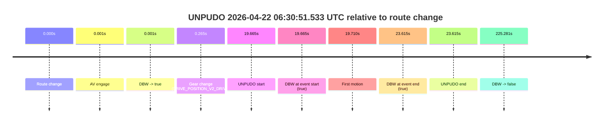

# Run Report: fme20002/2026-04-22--06-13-18--gen2-av-dff8b708-579d-4578-9edb-cf0078124ac3

| Field | Value |
|---|---|
| Run ID | `fme20002/2026-04-22--06-13-18--gen2-av-dff8b708-579d-4578-9edb-cf0078124ac3` |
| Date | `2026-04-22` |
| Model(s) | `eel-teal-outspoken` |
| Author | `zak` |
| Event count | `3` |

## unpudo 2026-04-22 06:21:50.083 UTC

| Field | Value |
|---|---|
| Model | `eel-teal-outspoken` |
| Author | `zak` |
| Run ID | `fme20002/2026-04-22--06-13-18--gen2-av-dff8b708-579d-4578-9edb-cf0078124ac3` |
| Date | `2026-04-22` |
| Time (UTC) | `06:21:50.083` |
| Event type | `unpudo` |
| Disengagement type | `none observed` |
| Route change | `found` |
| Console | [run](https://console.sso.wayve.ai/run/fme20002/2026-04-22--06-13-18--gen2-av-dff8b708-579d-4578-9edb-cf0078124ac3?id=&time-unixus=1776838910083306) |
| Foxglove | [segment](https://app.foxglove.dev/wayve-on-prem/p/prj_0dX18KZdVHg1fmmI/view?ds=foxglove-stream&ds.deviceName=fme20002&ds.start=2026-04-22T06%3A21%3A30.418265Z&ds.end=2026-04-22T06%3A22%3A47.150975Z&layoutId=lay_0e7VD4WIKDQGU73Y&time=2026-04-22T06%3A21%3A50.083306Z) |

### Event card: pass

- Pass: AV owns the credited unpudo from route change through the official unpudo window, the gear state is aligned at the anchor, and the vehicle moves without driver accelerator help in AV.

| Event | Time (UTC) | Delta from route change |
|---|---:|---:|
| Route change | 2026-04-22 06:21:40.418 | `0.000s` |
| AV engage | 2026-04-22 06:21:40.419 | `0.001s` |
| DBW -> true | 2026-04-22 06:21:40.419 | `0.001s` |
| Gear change (DRIVE_POSITION_V2_DRIVE) | 2026-04-22 06:21:40.733 | `0.315s` |
| UNPUDO start | 2026-04-22 06:21:50.083 | `9.665s` |
| DBW at event start (true) | 2026-04-22 06:21:50.083 | `9.665s` |
| First motion | 2026-04-22 06:21:50.118 | `9.700s` |
| DBW at event end (true) | 2026-04-22 06:21:54.683 | `14.265s` |
| UNPUDO end | 2026-04-22 06:21:54.683 | `14.265s` |
| DBW -> false | 2026-04-22 06:22:37.150 | `56.733s` |

| Metric | Value |
|---|---|
| Outcome | `pass` |
| Effective failure type | `none` |
| Route change status | `found` |
| DBW at event start | `true` |
| DBW at event end | `true` |
| Predicted gear at AV start | `DRIVE_POSITION_V2_PARK` |
| Actual gear at AV start | `DRIVE_POSITION_V2_PARK` |
| Predicted gear at event start | `DRIVE_POSITION_V2_DRIVE` |
| Actual gear at event start | `DRIVE_POSITION_V2_DRIVE` |
| Planned indicator direction | `INDICATORS_STATE_V2_RIGHT_ON` |
| Controller indicator direction | `INDICATORS_STATE_V2_RIGHT_ON` |
| Actual indicator direction | `INDICATORS_STATE_V2_OFF` |
| Actual indicator at maneuver end | `INDICATORS_STATE_V2_OFF` |
| Driver accel help in AV | `false` |
| Driver accel help timestamp | `n/a` |
| Max accel pedal pct in AV | `0.0%` |
| Max brake pedal pct in AV | `8.0%` |
| Max speed mps in AV | `4.272` |
| Success timing baseline | `route change` |
| Route -> AV | `0.001s` |
| AV -> event start | `9.664s` |
| AV -> first motion | `9.700s` |
| Success baseline -> event start | `9.665s` |
| Success baseline -> first motion | `9.700s` |
| AV duration before disengagement | `56.732s` |
| Trajectory waypoint count | `37` |
| Driving-plan step count | `11` |

The scored portion starts from the AV-owned window, not from the pre-AV setup. Route-change search in the stopped pre-event segment was `found`, with the baseline therefore set to route change. At the event anchor the model predicts `DRIVE_POSITION_V2_DRIVE` and the actual gear is `DRIVE_POSITION_V2_DRIVE`. The effective model outcome is `pass` because `the credited unpudo stays AV-owned through the official unpudo window.`

### Resolution

| Field | Value |
|---|---|
| Final outcome | `pass` |
| Do we agree with this label? | `yes` |
| Source disengagement type | `none observed` |
| Resolved effective failure type | `none` |
| Confidence | `high` |

## unpudo 2026-04-22 06:27:46.183 UTC

| Field | Value |
|---|---|
| Model | `eel-teal-outspoken` |
| Author | `zak` |
| Run ID | `fme20002/2026-04-22--06-13-18--gen2-av-dff8b708-579d-4578-9edb-cf0078124ac3` |
| Date | `2026-04-22` |
| Time (UTC) | `06:27:46.183` |
| Event type | `unpudo` |
| Disengagement type | `none observed` |
| Route change | `found` |
| Console | [run](https://console.sso.wayve.ai/run/fme20002/2026-04-22--06-13-18--gen2-av-dff8b708-579d-4578-9edb-cf0078124ac3?id=&time-unixus=1776839266183326) |
| Foxglove | [segment](https://app.foxglove.dev/wayve-on-prem/p/prj_0dX18KZdVHg1fmmI/view?ds=foxglove-stream&ds.deviceName=fme20002&ds.start=2026-04-22T06%3A27%3A19.018244Z&ds.end=2026-04-22T06%3A28%3A34.829626Z&layoutId=lay_0e7VD4WIKDQGU73Y&time=2026-04-22T06%3A27%3A46.183326Z) |

### Event card: pass

- Pass: AV owns the credited unpudo from route change through the official unpudo window, the gear state is aligned at the anchor, and the vehicle moves without driver accelerator help in AV.

| Event | Time (UTC) | Delta from route change |
|---|---:|---:|
| Route change | 2026-04-22 06:27:29.018 | `0.000s` |
| AV engage | 2026-04-22 06:27:35.169 | `6.151s` |
| DBW -> true | 2026-04-22 06:27:35.169 | `6.151s` |
| Gear change (DRIVE_POSITION_V2_DRIVE) | 2026-04-22 06:27:42.583 | `13.565s` |
| UNPUDO start | 2026-04-22 06:27:46.183 | `17.165s` |
| DBW at event start (true) | 2026-04-22 06:27:46.183 | `17.165s` |
| First motion | 2026-04-22 06:27:46.198 | `17.180s` |
| DBW at event end (true) | 2026-04-22 06:27:49.933 | `20.915s` |
| UNPUDO end | 2026-04-22 06:27:49.933 | `20.915s` |
| DBW -> false | 2026-04-22 06:28:24.829 | `55.811s` |

| Metric | Value |
|---|---|
| Outcome | `pass` |
| Effective failure type | `none` |
| Route change status | `found` |
| DBW at event start | `true` |
| DBW at event end | `true` |
| Predicted gear at AV start | `DRIVE_POSITION_V2_REVERSE` |
| Actual gear at AV start | `DRIVE_POSITION_V2_REVERSE` |
| Predicted gear at event start | `DRIVE_POSITION_V2_DRIVE` |
| Actual gear at event start | `DRIVE_POSITION_V2_DRIVE` |
| Planned indicator direction | `INDICATORS_STATE_V2_OFF` |
| Controller indicator direction | `INDICATORS_STATE_V2_OFF` |
| Actual indicator direction | `INDICATORS_STATE_V2_OFF` |
| Actual indicator at maneuver end | `INDICATORS_STATE_V2_OFF` |
| Driver accel help in AV | `false` |
| Driver accel help timestamp | `n/a` |
| Max accel pedal pct in AV | `0.0%` |
| Max brake pedal pct in AV | `8.0%` |
| Max speed mps in AV | `3.697` |
| Success timing baseline | `route change` |
| Route -> AV | `6.151s` |
| AV -> event start | `11.014s` |
| AV -> first motion | `11.029s` |
| Success baseline -> event start | `17.165s` |
| Success baseline -> first motion | `17.180s` |
| AV duration before disengagement | `49.660s` |
| Trajectory waypoint count | `37` |
| Driving-plan step count | `11` |

The scored portion starts from the AV-owned window, not from the pre-AV setup. Route-change search in the stopped pre-event segment was `found`, with the baseline therefore set to route change. At the event anchor the model predicts `DRIVE_POSITION_V2_DRIVE` and the actual gear is `DRIVE_POSITION_V2_DRIVE`. The effective model outcome is `pass` because `the credited unpudo stays AV-owned through the official unpudo window.`

### Resolution

| Field | Value |
|---|---|
| Final outcome | `pass` |
| Do we agree with this label? | `yes` |
| Source disengagement type | `none observed` |
| Resolved effective failure type | `none` |
| Confidence | `high` |

## unpudo 2026-04-22 06:30:51.533 UTC

| Field | Value |
|---|---|
| Model | `eel-teal-outspoken` |
| Author | `zak` |
| Run ID | `fme20002/2026-04-22--06-13-18--gen2-av-dff8b708-579d-4578-9edb-cf0078124ac3` |
| Date | `2026-04-22` |
| Time (UTC) | `06:30:51.533` |
| Event type | `unpudo` |
| Disengagement type | `none observed` |
| Route change | `found` |
| Console | [run](https://console.sso.wayve.ai/run/fme20002/2026-04-22--06-13-18--gen2-av-dff8b708-579d-4578-9edb-cf0078124ac3?id=&time-unixus=1776839451533314) |
| Foxglove | [segment](https://app.foxglove.dev/wayve-on-prem/p/prj_0dX18KZdVHg1fmmI/view?ds=foxglove-stream&ds.deviceName=fme20002&ds.start=2026-04-22T06%3A30%3A21.868234Z&ds.end=2026-04-22T06%3A34%3A27.149597Z&layoutId=lay_0e7VD4WIKDQGU73Y&time=2026-04-22T06%3A30%3A51.533314Z) |

### Event card: pass

- Pass: AV owns the credited unpudo from route change through the official unpudo window, the gear state is aligned at the anchor, and the vehicle moves without driver accelerator help in AV.

| Event | Time (UTC) | Delta from route change |
|---|---:|---:|
| Route change | 2026-04-22 06:30:31.868 | `0.000s` |
| AV engage | 2026-04-22 06:30:31.868 | `0.001s` |
| DBW -> true | 2026-04-22 06:30:31.868 | `0.001s` |
| Gear change (DRIVE_POSITION_V2_DRIVE) | 2026-04-22 06:30:32.133 | `0.265s` |
| UNPUDO start | 2026-04-22 06:30:51.533 | `19.665s` |
| DBW at event start (true) | 2026-04-22 06:30:51.533 | `19.665s` |
| First motion | 2026-04-22 06:30:51.578 | `19.710s` |
| DBW at event end (true) | 2026-04-22 06:30:55.483 | `23.615s` |
| UNPUDO end | 2026-04-22 06:30:55.483 | `23.615s` |
| DBW -> false | 2026-04-22 06:34:17.149 | `225.281s` |

| Metric | Value |
|---|---|
| Outcome | `pass` |
| Effective failure type | `none` |
| Route change status | `found` |
| DBW at event start | `true` |
| DBW at event end | `true` |
| Predicted gear at AV start | `DRIVE_POSITION_V2_PARK` |
| Actual gear at AV start | `DRIVE_POSITION_V2_PARK` |
| Predicted gear at event start | `DRIVE_POSITION_V2_DRIVE` |
| Actual gear at event start | `DRIVE_POSITION_V2_DRIVE` |
| Planned indicator direction | `INDICATORS_STATE_V2_RIGHT_ON` |
| Controller indicator direction | `INDICATORS_STATE_V2_RIGHT_ON` |
| Actual indicator direction | `INDICATORS_STATE_V2_OFF` |
| Actual indicator at maneuver end | `INDICATORS_STATE_V2_OFF` |
| Driver accel help in AV | `false` |
| Driver accel help timestamp | `n/a` |
| Max accel pedal pct in AV | `0.0%` |
| Max brake pedal pct in AV | `8.0%` |
| Max speed mps in AV | `4.108` |
| Success timing baseline | `route change` |
| Route -> AV | `0.001s` |
| AV -> event start | `19.664s` |
| AV -> first motion | `19.709s` |
| Success baseline -> event start | `19.665s` |
| Success baseline -> first motion | `19.710s` |
| AV duration before disengagement | `225.281s` |
| Trajectory waypoint count | `38` |
| Driving-plan step count | `11` |

The scored portion starts from the AV-owned window, not from the pre-AV setup. Route-change search in the stopped pre-event segment was `found`, with the baseline therefore set to route change. At the event anchor the model predicts `DRIVE_POSITION_V2_DRIVE` and the actual gear is `DRIVE_POSITION_V2_DRIVE`. The effective model outcome is `pass` because `the credited unpudo stays AV-owned through the official unpudo window.`

### Resolution

| Field | Value |
|---|---|
| Final outcome | `pass` |
| Do we agree with this label? | `yes` |
| Source disengagement type | `none observed` |
| Resolved effective failure type | `none` |
| Confidence | `high` |
