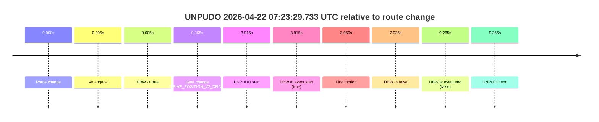
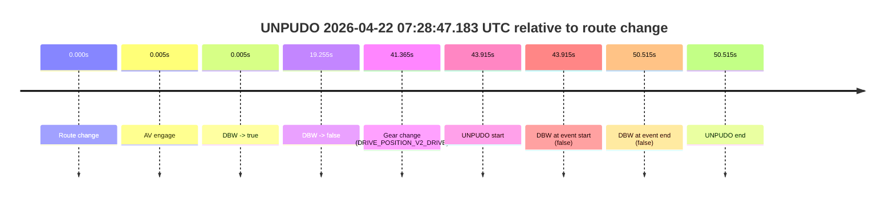
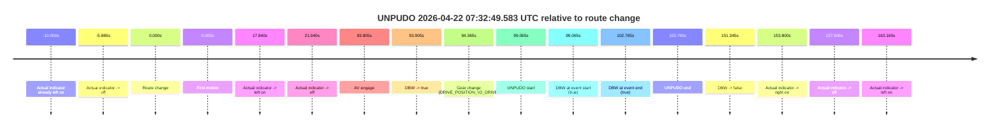
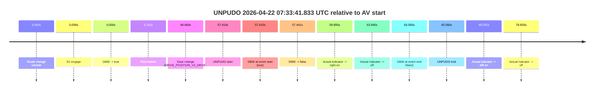
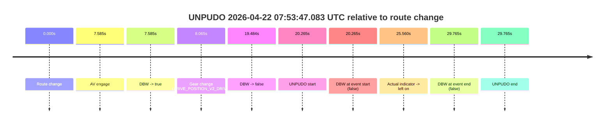
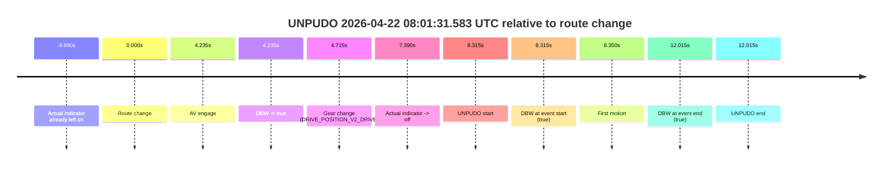

# Run Report: fme20002/2026-04-22--07-08-25--gen2-av-4e6c4c4f-ac66-435d-9216-613b75005947

| Field | Value |
|---|---|
| Run ID | `fme20002/2026-04-22--07-08-25--gen2-av-4e6c4c4f-ac66-435d-9216-613b75005947` |
| Date | `2026-04-22` |
| Model(s) | `eel-teal-outspoken` |
| Author | `zak` |
| Event count | `6` |

## unpudo 2026-04-22 07:23:29.733 UTC

| Field | Value |
|---|---|
| Model | `eel-teal-outspoken` |
| Author | `zak` |
| Run ID | `fme20002/2026-04-22--07-08-25--gen2-av-4e6c4c4f-ac66-435d-9216-613b75005947` |
| Date | `2026-04-22` |
| Time (UTC) | `07:23:29.733` |
| Event type | `unpudo` |
| Disengagement type | `none observed` |
| Route change | `found` |
| Console | [run](https://console.sso.wayve.ai/run/fme20002/2026-04-22--07-08-25--gen2-av-4e6c4c4f-ac66-435d-9216-613b75005947?id=&time-unixus=1776842609733325) |
| Foxglove | [segment](https://app.foxglove.dev/wayve-on-prem/p/prj_0dX18KZdVHg1fmmI/view?ds=foxglove-stream&ds.deviceName=fme20002&ds.start=2026-04-22T07%3A23%3A15.818287Z&ds.end=2026-04-22T07%3A23%3A45.083296Z&layoutId=lay_0e7VD4WIKDQGU73Y&time=2026-04-22T07%3A23%3A29.733325Z) |

### Event card: fail

- Fail: this is a short AV stint rather than a durable model-owned maneuver. The vehicle never settles into a long enough AV-owned attempt to credit the model.

| Event | Time (UTC) | Delta from route change |
|---|---:|---:|
| Route change | 2026-04-22 07:23:25.818 | `0.000s` |
| AV engage | 2026-04-22 07:23:25.822 | `0.005s` |
| DBW -> true | 2026-04-22 07:23:25.822 | `0.005s` |
| Gear change (DRIVE_POSITION_V2_DRIVE) | 2026-04-22 07:23:26.183 | `0.365s` |
| UNPUDO start | 2026-04-22 07:23:29.733 | `3.915s` |
| DBW at event start (true) | 2026-04-22 07:23:29.733 | `3.915s` |
| First motion | 2026-04-22 07:23:29.778 | `3.960s` |
| DBW -> false | 2026-04-22 07:23:32.843 | `7.025s` |
| DBW at event end (false) | 2026-04-22 07:23:35.083 | `9.265s` |
| UNPUDO end | 2026-04-22 07:23:35.083 | `9.265s` |

| Metric | Value |
|---|---|
| Outcome | `fail` |
| Effective failure type | `interrupted_handover` |
| Route change status | `found` |
| DBW at event start | `true` |
| DBW at event end | `false` |
| Predicted gear at AV start | `DRIVE_POSITION_V2_PARK` |
| Actual gear at AV start | `DRIVE_POSITION_V2_PARK` |
| Predicted gear at event start | `DRIVE_POSITION_V2_DRIVE` |
| Actual gear at event start | `DRIVE_POSITION_V2_DRIVE` |
| Planned indicator direction | `INDICATORS_STATE_V2_LEFT_ON` |
| Controller indicator direction | `INDICATORS_STATE_V2_LEFT_ON` |
| Actual indicator direction | `INDICATORS_STATE_V2_OFF` |
| Actual indicator at maneuver end | `INDICATORS_STATE_V2_OFF` |
| Driver accel help in AV | `false` |
| Driver accel help timestamp | `n/a` |
| Max accel pedal pct in AV | `0.0%` |
| Max brake pedal pct in AV | `8.0%` |
| Max speed mps in AV | `3.072` |
| Success timing baseline | `route change` |
| Route -> AV | `0.005s` |
| AV -> event start | `3.910s` |
| AV -> first motion | `3.955s` |
| Success baseline -> event start | `3.915s` |
| Success baseline -> first motion | `3.960s` |
| AV duration before disengagement | `7.020s` |
| Trajectory waypoint count | `38` |
| Driving-plan step count | `11` |

The scored portion starts from the AV-owned window, not from the pre-AV setup. Route-change search in the stopped pre-event segment was `found`, with the baseline therefore set to route change. At the event anchor the model predicts `DRIVE_POSITION_V2_DRIVE` and the actual gear is `DRIVE_POSITION_V2_DRIVE`. The effective model outcome is `fail` because `interrupted_handover.`

### Resolution

| Field | Value |
|---|---|
| Final outcome | `fail` |
| Do we agree with this label? | `yes` |
| Source disengagement type | `none observed` |
| Resolved effective failure type | `interrupted_handover` |
| Confidence | `high` |

## unpudo 2026-04-22 07:28:47.183 UTC

| Field | Value |
|---|---|
| Model | `eel-teal-outspoken` |
| Author | `zak` |
| Run ID | `fme20002/2026-04-22--07-08-25--gen2-av-4e6c4c4f-ac66-435d-9216-613b75005947` |
| Date | `2026-04-22` |
| Time (UTC) | `07:28:47.183` |
| Event type | `unpudo` |
| Disengagement type | `none observed` |
| Route change | `found` |
| Console | [run](https://console.sso.wayve.ai/run/fme20002/2026-04-22--07-08-25--gen2-av-4e6c4c4f-ac66-435d-9216-613b75005947?id=&time-unixus=1776842927183302) |
| Foxglove | [segment](https://app.foxglove.dev/wayve-on-prem/p/prj_0dX18KZdVHg1fmmI/view?ds=foxglove-stream&ds.deviceName=fme20002&ds.start=2026-04-22T07%3A27%3A53.268261Z&ds.end=2026-04-22T07%3A29%3A03.783303Z&layoutId=lay_0e7VD4WIKDQGU73Y&time=2026-04-22T07%3A28%3A47.183302Z) |

### Event card: fail

- Fail: the credited unpudo does not stay AV-owned. The event window starts with DBW false, and the maneuver outcome lands outside a clean AV-owned segment.

| Event | Time (UTC) | Delta from route change |
|---|---:|---:|
| Route change | 2026-04-22 07:28:03.268 | `0.000s` |
| AV engage | 2026-04-22 07:28:03.272 | `0.005s` |
| DBW -> true | 2026-04-22 07:28:03.272 | `0.005s` |
| DBW -> false | 2026-04-22 07:28:22.523 | `19.255s` |
| Gear change (DRIVE_POSITION_V2_DRIVE) | 2026-04-22 07:28:44.633 | `41.365s` |
| UNPUDO start | 2026-04-22 07:28:47.183 | `43.915s` |
| DBW at event start (false) | 2026-04-22 07:28:47.183 | `43.915s` |
| DBW at event end (false) | 2026-04-22 07:28:53.783 | `50.515s` |
| UNPUDO end | 2026-04-22 07:28:53.783 | `50.515s` |

| Metric | Value |
|---|---|
| Outcome | `fail` |
| Effective failure type | `not_av_owned` |
| Route change status | `found` |
| DBW at event start | `false` |
| DBW at event end | `false` |
| Predicted gear at AV start | `DRIVE_POSITION_V2_PARK` |
| Actual gear at AV start | `DRIVE_POSITION_V2_PARK` |
| Predicted gear at event start | `DRIVE_POSITION_V2_DRIVE` |
| Actual gear at event start | `DRIVE_POSITION_V2_DRIVE` |
| Planned indicator direction | `INDICATORS_STATE_V2_OFF` |
| Controller indicator direction | `INDICATORS_STATE_V2_OFF` |
| Actual indicator direction | `INDICATORS_STATE_V2_OFF` |
| Actual indicator at maneuver end | `INDICATORS_STATE_V2_OFF` |
| Driver accel help in AV | `false` |
| Driver accel help timestamp | `n/a` |
| Max accel pedal pct in AV | `0.0%` |
| Max brake pedal pct in AV | `8.0%` |
| Max speed mps in AV | `0.000` |
| Success timing baseline | `route change` |
| Route -> AV | `0.005s` |
| AV -> event start | `43.910s` |
| AV -> first motion | `n/a` |
| Success baseline -> event start | `43.915s` |
| Success baseline -> first motion | `n/a` |
| AV duration before disengagement | `19.251s` |
| Trajectory waypoint count | `37` |
| Driving-plan step count | `11` |

The scored portion starts from the AV-owned window, not from the pre-AV setup. Route-change search in the stopped pre-event segment was `found`, with the baseline therefore set to route change. At the event anchor the model predicts `DRIVE_POSITION_V2_DRIVE` and the actual gear is `DRIVE_POSITION_V2_DRIVE`. The effective model outcome is `fail` because `not_av_owned.`

### Resolution

| Field | Value |
|---|---|
| Final outcome | `fail` |
| Do we agree with this label? | `yes` |
| Source disengagement type | `none observed` |
| Resolved effective failure type | `not_av_owned` |
| Confidence | `high` |

## unpudo 2026-04-22 07:32:49.583 UTC

| Field | Value |
|---|---|
| Model | `eel-teal-outspoken` |
| Author | `zak` |
| Run ID | `fme20002/2026-04-22--07-08-25--gen2-av-4e6c4c4f-ac66-435d-9216-613b75005947` |
| Date | `2026-04-22` |
| Time (UTC) | `07:32:49.583` |
| Event type | `unpudo` |
| Disengagement type | `none observed` |
| Route change | `found` |
| Console | [run](https://console.sso.wayve.ai/run/fme20002/2026-04-22--07-08-25--gen2-av-4e6c4c4f-ac66-435d-9216-613b75005947?id=&time-unixus=1776843169583298) |
| Foxglove | [segment](https://app.foxglove.dev/wayve-on-prem/p/prj_0dX18KZdVHg1fmmI/view?ds=foxglove-stream&ds.deviceName=fme20002&ds.start=2026-04-22T07%3A31%3A00.518286Z&ds.end=2026-04-22T07%3A33%3A51.863535Z&layoutId=lay_0e7VD4WIKDQGU73Y&time=2026-04-22T07%3A32%3A49.583298Z) |

### Event card: pass

- Pass: AV owns the credited unpudo from route change through the official unpudo window, the gear state is aligned at the anchor, and the vehicle moves without driver accelerator help in AV.

| Event | Time (UTC) | Delta from route change |
|---|---:|---:|
| Actual indicator already left on | 2026-04-22 07:31:00.518 | `-10.000s` |
| Actual indicator -> off | 2026-04-22 07:31:04.638 | `-5.880s` |
| Route change | 2026-04-22 07:31:10.518 | `0.000s` |
| First motion | 2026-04-22 07:31:10.518 | `0.000s` |
| Actual indicator -> left on | 2026-04-22 07:31:28.358 | `17.840s` |
| Actual indicator -> off | 2026-04-22 07:31:31.558 | `21.040s` |
| AV engage | 2026-04-22 07:32:44.423 | `93.905s` |
| DBW -> true | 2026-04-22 07:32:44.423 | `93.905s` |
| Gear change (DRIVE_POSITION_V2_DRIVE) | 2026-04-22 07:32:44.883 | `94.365s` |
| UNPUDO start | 2026-04-22 07:32:49.583 | `99.065s` |
| DBW at event start (true) | 2026-04-22 07:32:49.583 | `99.065s` |
| DBW at event end (true) | 2026-04-22 07:32:53.283 | `102.765s` |
| UNPUDO end | 2026-04-22 07:32:53.283 | `102.765s` |
| DBW -> false | 2026-04-22 07:33:41.863 | `151.345s` |
| Actual indicator -> right on | 2026-04-22 07:33:44.318 | `153.800s` |
| Actual indicator -> off | 2026-04-22 07:33:48.118 | `157.600s` |
| Actual indicator -> left on | 2026-04-22 07:33:53.678 | `163.160s` |

| Metric | Value |
|---|---|
| Outcome | `pass` |
| Effective failure type | `none` |
| Route change status | `found` |
| DBW at event start | `true` |
| DBW at event end | `true` |
| Predicted gear at AV start | `DRIVE_POSITION_V2_DRIVE` |
| Actual gear at AV start | `DRIVE_POSITION_V2_PARK` |
| Predicted gear at event start | `DRIVE_POSITION_V2_DRIVE` |
| Actual gear at event start | `DRIVE_POSITION_V2_DRIVE` |
| Planned indicator direction | `INDICATORS_STATE_V2_OFF` |
| Controller indicator direction | `INDICATORS_STATE_V2_RIGHT_ON` |
| Actual indicator direction | `INDICATORS_STATE_V2_OFF` |
| Actual indicator at maneuver end | `INDICATORS_STATE_V2_OFF` |
| Driver accel help in AV | `false` |
| Driver accel help timestamp | `n/a` |
| Max accel pedal pct in AV | `0.0%` |
| Max brake pedal pct in AV | `8.6%` |
| Max speed mps in AV | `4.775` |
| Success timing baseline | `route change` |
| Route -> AV | `93.905s` |
| AV -> event start | `5.160s` |
| AV -> first motion | `-93.905s` |
| Success baseline -> event start | `99.065s` |
| Success baseline -> first motion | `0.000s` |
| AV duration before disengagement | `57.441s` |
| Trajectory waypoint count | `37` |
| Driving-plan step count | `11` |

The scored portion starts from the AV-owned window, not from the pre-AV setup. Route-change search in the stopped pre-event segment was `found`, with the baseline therefore set to route change. At the event anchor the model predicts `DRIVE_POSITION_V2_DRIVE` and the actual gear is `DRIVE_POSITION_V2_DRIVE`. The effective model outcome is `pass` because `the credited unpudo stays AV-owned through the official unpudo window.`

### Resolution

| Field | Value |
|---|---|
| Final outcome | `pass` |
| Do we agree with this label? | `yes` |
| Source disengagement type | `none observed` |
| Resolved effective failure type | `none` |
| Confidence | `high` |

## unpudo 2026-04-22 07:33:41.833 UTC

| Field | Value |
|---|---|
| Model | `eel-teal-outspoken` |
| Author | `zak` |
| Run ID | `fme20002/2026-04-22--07-08-25--gen2-av-4e6c4c4f-ac66-435d-9216-613b75005947` |
| Date | `2026-04-22` |
| Time (UTC) | `07:33:41.833` |
| Event type | `unpudo` |
| Disengagement type | `none observed` |
| Route change | `unclear` |
| Console | [run](https://console.sso.wayve.ai/run/fme20002/2026-04-22--07-08-25--gen2-av-4e6c4c4f-ac66-435d-9216-613b75005947?id=&time-unixus=1776843221833315) |
| Foxglove | [segment](https://app.foxglove.dev/wayve-on-prem/p/prj_0dX18KZdVHg1fmmI/view?ds=foxglove-stream&ds.deviceName=fme20002&ds.start=2026-04-22T07%3A32%3A34.423004Z&ds.end=2026-04-22T07%3A33%3A59.983313Z&layoutId=lay_0e7VD4WIKDQGU73Y&time=2026-04-22T07%3A33%3A41.833315Z) |

### Event card: fail

- Fail: the credited unpudo does not stay AV-owned. The event window starts with DBW true, and the maneuver outcome lands outside a clean AV-owned segment.

| Event | Time (UTC) | Delta from AV start |
|---|---:|---:|
| Route change unclear | 2026-04-22 07:32:44.423 | `0.000s` |
| AV engage | 2026-04-22 07:32:44.423 | `0.000s` |
| DBW -> true | 2026-04-22 07:32:44.423 | `0.000s` |
| First motion | 2026-04-22 07:32:49.638 | `5.215s` |
| Gear change (DRIVE_POSITION_V2_DRIVE) | 2026-04-22 07:33:30.883 | `46.460s` |
| UNPUDO start | 2026-04-22 07:33:41.833 | `57.410s` |
| DBW at event start (true) | 2026-04-22 07:33:41.833 | `57.410s` |
| DBW -> false | 2026-04-22 07:33:41.863 | `57.441s` |
| Actual indicator -> right on | 2026-04-22 07:33:44.318 | `59.895s` |
| Actual indicator -> off | 2026-04-22 07:33:48.118 | `63.695s` |
| DBW at event end (false) | 2026-04-22 07:33:49.983 | `65.560s` |
| UNPUDO end | 2026-04-22 07:33:49.983 | `65.560s` |
| Actual indicator -> left on | 2026-04-22 07:33:53.678 | `69.255s` |
| Actual indicator -> off | 2026-04-22 07:34:03.258 | `78.835s` |

| Metric | Value |
|---|---|
| Outcome | `fail` |
| Effective failure type | `driver_completed_maneuver` |
| Route change status | `unclear` |
| DBW at event start | `true` |
| DBW at event end | `false` |
| Predicted gear at AV start | `DRIVE_POSITION_V2_DRIVE` |
| Actual gear at AV start | `DRIVE_POSITION_V2_PARK` |
| Predicted gear at event start | `DRIVE_POSITION_V2_DRIVE` |
| Actual gear at event start | `DRIVE_POSITION_V2_DRIVE` |
| Planned indicator direction | `INDICATORS_STATE_V2_RIGHT_ON` |
| Controller indicator direction | `INDICATORS_STATE_V2_RIGHT_ON` |
| Actual indicator direction | `INDICATORS_STATE_V2_OFF` |
| Actual indicator at maneuver end | `INDICATORS_STATE_V2_OFF` |
| Driver accel help in AV | `false` |
| Driver accel help timestamp | `n/a` |
| Max accel pedal pct in AV | `0.0%` |
| Max brake pedal pct in AV | `11.1%` |
| Max speed mps in AV | `5.319` |
| Success timing baseline | `AV start` |
| Route -> AV | `n/a` |
| AV -> event start | `57.410s` |
| AV -> first motion | `5.215s` |
| Success baseline -> event start | `57.410s` |
| Success baseline -> first motion | `5.215s` |
| AV duration before disengagement | `57.441s` |
| Trajectory waypoint count | `38` |
| Driving-plan step count | `11` |

The scored portion starts from the AV-owned window, not from the pre-AV setup. Route-change search in the stopped pre-event segment was `unclear`, with the baseline therefore set to AV start. At the event anchor the model predicts `DRIVE_POSITION_V2_DRIVE` and the actual gear is `DRIVE_POSITION_V2_DRIVE`. The effective model outcome is `fail` because `driver_completed_maneuver.`

### Resolution

| Field | Value |
|---|---|
| Final outcome | `fail` |
| Do we agree with this label? | `yes` |
| Source disengagement type | `none observed` |
| Resolved effective failure type | `driver_completed_maneuver` |
| Confidence | `medium` |

## unpudo 2026-04-22 07:53:47.083 UTC

| Field | Value |
|---|---|
| Model | `eel-teal-outspoken` |
| Author | `zak` |
| Run ID | `fme20002/2026-04-22--07-08-25--gen2-av-4e6c4c4f-ac66-435d-9216-613b75005947` |
| Date | `2026-04-22` |
| Time (UTC) | `07:53:47.083` |
| Event type | `unpudo` |
| Disengagement type | `none observed` |
| Route change | `found` |
| Console | [run](https://console.sso.wayve.ai/run/fme20002/2026-04-22--07-08-25--gen2-av-4e6c4c4f-ac66-435d-9216-613b75005947?id=&time-unixus=1776844427083313) |
| Foxglove | [segment](https://app.foxglove.dev/wayve-on-prem/p/prj_0dX18KZdVHg1fmmI/view?ds=foxglove-stream&ds.deviceName=fme20002&ds.start=2026-04-22T07%3A53%3A16.818521Z&ds.end=2026-04-22T07%3A54%3A06.583306Z&layoutId=lay_0e7VD4WIKDQGU73Y&time=2026-04-22T07%3A53%3A47.083313Z) |

### Event card: fail

- Fail: the credited unpudo does not stay AV-owned. The event window starts with DBW false, and the maneuver outcome lands outside a clean AV-owned segment.

| Event | Time (UTC) | Delta from route change |
|---|---:|---:|
| Route change | 2026-04-22 07:53:26.818 | `0.000s` |
| AV engage | 2026-04-22 07:53:34.403 | `7.585s` |
| DBW -> true | 2026-04-22 07:53:34.403 | `7.585s` |
| Gear change (DRIVE_POSITION_V2_DRIVE) | 2026-04-22 07:53:34.883 | `8.065s` |
| DBW -> false | 2026-04-22 07:53:46.302 | `19.484s` |
| UNPUDO start | 2026-04-22 07:53:47.083 | `20.265s` |
| DBW at event start (false) | 2026-04-22 07:53:47.083 | `20.265s` |
| Actual indicator -> left on | 2026-04-22 07:53:52.378 | `25.560s` |
| DBW at event end (false) | 2026-04-22 07:53:56.583 | `29.765s` |
| UNPUDO end | 2026-04-22 07:53:56.583 | `29.765s` |

| Metric | Value |
|---|---|
| Outcome | `fail` |
| Effective failure type | `not_av_owned` |
| Route change status | `found` |
| DBW at event start | `false` |
| DBW at event end | `false` |
| Predicted gear at AV start | `DRIVE_POSITION_V2_DRIVE` |
| Actual gear at AV start | `DRIVE_POSITION_V2_PARK` |
| Predicted gear at event start | `DRIVE_POSITION_V2_DRIVE` |
| Actual gear at event start | `DRIVE_POSITION_V2_DRIVE` |
| Planned indicator direction | `INDICATORS_STATE_V2_OFF` |
| Controller indicator direction | `INDICATORS_STATE_V2_OFF` |
| Actual indicator direction | `INDICATORS_STATE_V2_OFF` |
| Actual indicator at maneuver end | `INDICATORS_STATE_V2_LEFT_ON` |
| Driver accel help in AV | `false` |
| Driver accel help timestamp | `n/a` |
| Max accel pedal pct in AV | `0.0%` |
| Max brake pedal pct in AV | `8.0%` |
| Max speed mps in AV | `0.000` |
| Success timing baseline | `route change` |
| Route -> AV | `7.585s` |
| AV -> event start | `12.680s` |
| AV -> first motion | `n/a` |
| Success baseline -> event start | `20.265s` |
| Success baseline -> first motion | `n/a` |
| AV duration before disengagement | `11.900s` |
| Trajectory waypoint count | `37` |
| Driving-plan step count | `11` |

The scored portion starts from the AV-owned window, not from the pre-AV setup. Route-change search in the stopped pre-event segment was `found`, with the baseline therefore set to route change. At the event anchor the model predicts `DRIVE_POSITION_V2_DRIVE` and the actual gear is `DRIVE_POSITION_V2_DRIVE`. The effective model outcome is `fail` because `not_av_owned.`

### Resolution

| Field | Value |
|---|---|
| Final outcome | `fail` |
| Do we agree with this label? | `yes` |
| Source disengagement type | `none observed` |
| Resolved effective failure type | `not_av_owned` |
| Confidence | `high` |

## unpudo 2026-04-22 08:01:31.583 UTC

| Field | Value |
|---|---|
| Model | `eel-teal-outspoken` |
| Author | `zak` |
| Run ID | `fme20002/2026-04-22--07-08-25--gen2-av-4e6c4c4f-ac66-435d-9216-613b75005947` |
| Date | `2026-04-22` |
| Time (UTC) | `08:01:31.583` |
| Event type | `unpudo` |
| Disengagement type | `none observed` |
| Route change | `found` |
| Console | [run](https://console.sso.wayve.ai/run/fme20002/2026-04-22--07-08-25--gen2-av-4e6c4c4f-ac66-435d-9216-613b75005947?id=&time-unixus=1776844891583314) |
| Foxglove | [segment](https://app.foxglove.dev/wayve-on-prem/p/prj_0dX18KZdVHg1fmmI/view?ds=foxglove-stream&ds.deviceName=fme20002&ds.start=2026-04-22T08%3A01%3A13.268263Z&ds.end=2026-04-22T08%3A01%3A45.283295Z&layoutId=lay_0e7VD4WIKDQGU73Y&time=2026-04-22T08%3A01%3A31.583314Z) |

### Event card: pass

- Pass: AV owns the credited unpudo from route change through the official unpudo window, the gear state is aligned at the anchor, and the vehicle moves without driver accelerator help in AV.

| Event | Time (UTC) | Delta from route change |
|---|---:|---:|
| Actual indicator already left on | 2026-04-22 08:01:13.278 | `-9.990s` |
| Route change | 2026-04-22 08:01:23.268 | `0.000s` |
| AV engage | 2026-04-22 08:01:27.502 | `4.235s` |
| DBW -> true | 2026-04-22 08:01:27.502 | `4.235s` |
| Gear change (DRIVE_POSITION_V2_DRIVE) | 2026-04-22 08:01:27.983 | `4.715s` |
| Actual indicator -> off | 2026-04-22 08:01:30.658 | `7.390s` |
| UNPUDO start | 2026-04-22 08:01:31.583 | `8.315s` |
| DBW at event start (true) | 2026-04-22 08:01:31.583 | `8.315s` |
| First motion | 2026-04-22 08:01:31.618 | `8.350s` |
| DBW at event end (true) | 2026-04-22 08:01:35.283 | `12.015s` |
| UNPUDO end | 2026-04-22 08:01:35.283 | `12.015s` |

| Metric | Value |
|---|---|
| Outcome | `pass` |
| Effective failure type | `none` |
| Route change status | `found` |
| DBW at event start | `true` |
| DBW at event end | `true` |
| Predicted gear at AV start | `DRIVE_POSITION_V2_DRIVE` |
| Actual gear at AV start | `DRIVE_POSITION_V2_PARK` |
| Predicted gear at event start | `DRIVE_POSITION_V2_DRIVE` |
| Actual gear at event start | `DRIVE_POSITION_V2_DRIVE` |
| Planned indicator direction | `INDICATORS_STATE_V2_RIGHT_ON` |
| Controller indicator direction | `INDICATORS_STATE_V2_RIGHT_ON` |
| Actual indicator direction | `INDICATORS_STATE_V2_OFF` |
| Actual indicator at maneuver end | `INDICATORS_STATE_V2_OFF` |
| Driver accel help in AV | `false` |
| Driver accel help timestamp | `n/a` |
| Max accel pedal pct in AV | `0.0%` |
| Max brake pedal pct in AV | `8.0%` |
| Max speed mps in AV | `4.689` |
| Success timing baseline | `route change` |
| Route -> AV | `4.235s` |
| AV -> event start | `4.080s` |
| AV -> first motion | `4.115s` |
| Success baseline -> event start | `8.315s` |
| Success baseline -> first motion | `8.350s` |
| AV duration before disengagement | `n/a` |
| Trajectory waypoint count | `37` |
| Driving-plan step count | `11` |

The scored portion starts from the AV-owned window, not from the pre-AV setup. Route-change search in the stopped pre-event segment was `found`, with the baseline therefore set to route change. At the event anchor the model predicts `DRIVE_POSITION_V2_DRIVE` and the actual gear is `DRIVE_POSITION_V2_DRIVE`. The effective model outcome is `pass` because `the credited unpudo stays AV-owned through the official unpudo window.`

### Resolution

| Field | Value |
|---|---|
| Final outcome | `pass` |
| Do we agree with this label? | `yes` |
| Source disengagement type | `none observed` |
| Resolved effective failure type | `none` |
| Confidence | `high` |
