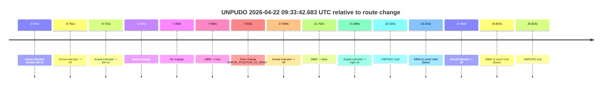
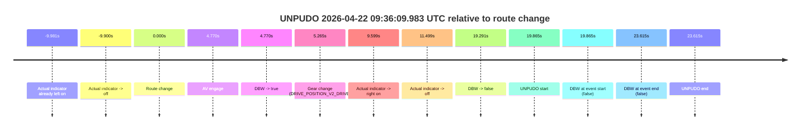
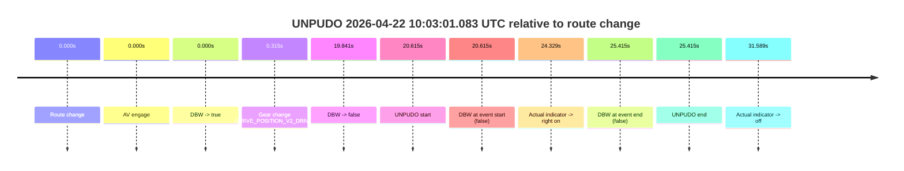
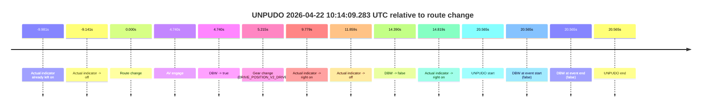

# Run Report: fme20002/2026-04-22--09-24-04--gen2-av-5450a3b6-cacc-4aa8-86b2-bbe8fb892253

| Field | Value |
|---|---|
| Run ID | `fme20002/2026-04-22--09-24-04--gen2-av-5450a3b6-cacc-4aa8-86b2-bbe8fb892253` |
| Date | `2026-04-22` |
| Model(s) | `pink-manta-ray-smooth` |
| Author | `guy.geva` |
| Event count | `4` |

## unpudo 2026-04-22 09:33:42.683 UTC

| Field | Value |
|---|---|
| Model | `pink-manta-ray-smooth` |
| Author | `guy.geva` |
| Run ID | `fme20002/2026-04-22--09-24-04--gen2-av-5450a3b6-cacc-4aa8-86b2-bbe8fb892253` |
| Date | `2026-04-22` |
| Time (UTC) | `09:33:42.683` |
| Event type | `unpudo` |
| Disengagement type | `none observed` |
| Route change | `found` |
| Console | [run](https://console.sso.wayve.ai/run/fme20002/2026-04-22--09-24-04--gen2-av-5450a3b6-cacc-4aa8-86b2-bbe8fb892253?id=&time-unixus=1776850422683300) |
| Foxglove | [segment](https://app.foxglove.dev/wayve-on-prem/p/prj_0dX18KZdVHg1fmmI/view?ds=foxglove-stream&ds.deviceName=fme20002&ds.start=2026-04-22T09%3A33%3A10.368256Z&ds.end=2026-04-22T09%3A33%3A56.183310Z&layoutId=lay_0e7VD4WIKDQGU73Y&time=2026-04-22T09%3A33%3A42.683300Z) |

### Event card: fail

- Fail: the credited unpudo does not stay AV-owned. The event window starts with DBW false, and the maneuver outcome lands outside a clean AV-owned segment.

| Event | Time (UTC) | Delta from route change |
|---|---:|---:|
| Actual indicator already left on | 2026-04-22 09:33:10.377 | `-9.991s` |
| Actual indicator -> off | 2026-04-22 09:33:10.617 | `-9.751s` |
| Actual indicator -> left on | 2026-04-22 09:33:11.637 | `-8.731s` |
| Route change | 2026-04-22 09:33:20.368 | `0.000s` |
| AV engage | 2026-04-22 09:33:27.818 | `7.450s` |
| DBW -> true | 2026-04-22 09:33:27.818 | `7.450s` |
| Gear change (DRIVE_POSITION_V2_DRIVE) | 2026-04-22 09:33:28.283 | `7.915s` |
| Actual indicator -> off | 2026-04-22 09:33:38.317 | `17.949s` |
| DBW -> false | 2026-04-22 09:33:42.070 | `21.702s` |
| Actual indicator -> right on | 2026-04-22 09:33:42.357 | `21.989s` |
| UNPUDO start | 2026-04-22 09:33:42.683 | `22.315s` |
| DBW at event start (false) | 2026-04-22 09:33:42.683 | `22.315s` |
| Actual indicator -> off | 2026-04-22 09:33:45.357 | `24.989s` |
| DBW at event end (false) | 2026-04-22 09:33:46.183 | `25.815s` |
| UNPUDO end | 2026-04-22 09:33:46.183 | `25.815s` |

| Metric | Value |
|---|---|
| Outcome | `fail` |
| Effective failure type | `not_av_owned` |
| Route change status | `found` |
| DBW at event start | `false` |
| DBW at event end | `false` |
| Predicted gear at AV start | `DRIVE_POSITION_V2_DRIVE` |
| Actual gear at AV start | `DRIVE_POSITION_V2_PARK` |
| Predicted gear at event start | `DRIVE_POSITION_V2_DRIVE` |
| Actual gear at event start | `DRIVE_POSITION_V2_DRIVE` |
| Planned indicator direction | `INDICATORS_STATE_V2_LEFT_ON` |
| Controller indicator direction | `INDICATORS_STATE_V2_LEFT_ON` |
| Actual indicator direction | `INDICATORS_STATE_V2_RIGHT_ON` |
| Actual indicator at maneuver end | `INDICATORS_STATE_V2_OFF` |
| Driver accel help in AV | `false` |
| Driver accel help timestamp | `n/a` |
| Max accel pedal pct in AV | `0.0%` |
| Max brake pedal pct in AV | `8.1%` |
| Max speed mps in AV | `0.000` |
| Success timing baseline | `route change` |
| Route -> AV | `7.450s` |
| AV -> event start | `14.865s` |
| AV -> first motion | `n/a` |
| Success baseline -> event start | `22.315s` |
| Success baseline -> first motion | `n/a` |
| AV duration before disengagement | `14.252s` |
| Trajectory waypoint count | `37` |
| Driving-plan step count | `11` |

The scored portion starts from the AV-owned window, not from the pre-AV setup. Route-change search in the stopped pre-event segment was `found`, with the baseline therefore set to route change. At the event anchor the model predicts `DRIVE_POSITION_V2_DRIVE` and the actual gear is `DRIVE_POSITION_V2_DRIVE`. The effective model outcome is `fail` because `not_av_owned.`

### Resolution

| Field | Value |
|---|---|
| Final outcome | `fail` |
| Do we agree with this label? | `yes` |
| Source disengagement type | `none observed` |
| Resolved effective failure type | `not_av_owned` |
| Confidence | `high` |

## unpudo 2026-04-22 09:36:09.983 UTC

| Field | Value |
|---|---|
| Model | `pink-manta-ray-smooth` |
| Author | `guy.geva` |
| Run ID | `fme20002/2026-04-22--09-24-04--gen2-av-5450a3b6-cacc-4aa8-86b2-bbe8fb892253` |
| Date | `2026-04-22` |
| Time (UTC) | `09:36:09.983` |
| Event type | `unpudo` |
| Disengagement type | `none observed` |
| Route change | `found` |
| Console | [run](https://console.sso.wayve.ai/run/fme20002/2026-04-22--09-24-04--gen2-av-5450a3b6-cacc-4aa8-86b2-bbe8fb892253?id=&time-unixus=1776850569983320) |
| Foxglove | [segment](https://app.foxglove.dev/wayve-on-prem/p/prj_0dX18KZdVHg1fmmI/view?ds=foxglove-stream&ds.deviceName=fme20002&ds.start=2026-04-22T09%3A35%3A40.118339Z&ds.end=2026-04-22T09%3A36%3A23.733307Z&layoutId=lay_0e7VD4WIKDQGU73Y&time=2026-04-22T09%3A36%3A09.983320Z) |

### Event card: fail

- Fail: the credited unpudo does not stay AV-owned. The event window starts with DBW false, and the maneuver outcome lands outside a clean AV-owned segment.

| Event | Time (UTC) | Delta from route change |
|---|---:|---:|
| Actual indicator already left on | 2026-04-22 09:35:40.137 | `-9.981s` |
| Actual indicator -> off | 2026-04-22 09:35:40.218 | `-9.900s` |
| Route change | 2026-04-22 09:35:50.118 | `0.000s` |
| AV engage | 2026-04-22 09:35:54.888 | `4.770s` |
| DBW -> true | 2026-04-22 09:35:54.888 | `4.770s` |
| Gear change (DRIVE_POSITION_V2_DRIVE) | 2026-04-22 09:35:55.383 | `5.265s` |
| Actual indicator -> right on | 2026-04-22 09:35:59.717 | `9.599s` |
| Actual indicator -> off | 2026-04-22 09:36:01.617 | `11.499s` |
| DBW -> false | 2026-04-22 09:36:09.409 | `19.291s` |
| UNPUDO start | 2026-04-22 09:36:09.983 | `19.865s` |
| DBW at event start (false) | 2026-04-22 09:36:09.983 | `19.865s` |
| DBW at event end (false) | 2026-04-22 09:36:13.733 | `23.615s` |
| UNPUDO end | 2026-04-22 09:36:13.733 | `23.615s` |

| Metric | Value |
|---|---|
| Outcome | `fail` |
| Effective failure type | `not_av_owned` |
| Route change status | `found` |
| DBW at event start | `false` |
| DBW at event end | `false` |
| Predicted gear at AV start | `DRIVE_POSITION_V2_DRIVE` |
| Actual gear at AV start | `DRIVE_POSITION_V2_PARK` |
| Predicted gear at event start | `DRIVE_POSITION_V2_DRIVE` |
| Actual gear at event start | `DRIVE_POSITION_V2_DRIVE` |
| Planned indicator direction | `INDICATORS_STATE_V2_LEFT_ON` |
| Controller indicator direction | `INDICATORS_STATE_V2_LEFT_ON` |
| Actual indicator direction | `INDICATORS_STATE_V2_OFF` |
| Actual indicator at maneuver end | `INDICATORS_STATE_V2_OFF` |
| Driver accel help in AV | `false` |
| Driver accel help timestamp | `n/a` |
| Max accel pedal pct in AV | `0.0%` |
| Max brake pedal pct in AV | `8.8%` |
| Max speed mps in AV | `0.000` |
| Success timing baseline | `route change` |
| Route -> AV | `4.770s` |
| AV -> event start | `15.095s` |
| AV -> first motion | `n/a` |
| Success baseline -> event start | `19.865s` |
| Success baseline -> first motion | `n/a` |
| AV duration before disengagement | `14.521s` |
| Trajectory waypoint count | `37` |
| Driving-plan step count | `11` |

The scored portion starts from the AV-owned window, not from the pre-AV setup. Route-change search in the stopped pre-event segment was `found`, with the baseline therefore set to route change. At the event anchor the model predicts `DRIVE_POSITION_V2_DRIVE` and the actual gear is `DRIVE_POSITION_V2_DRIVE`. The effective model outcome is `fail` because `not_av_owned.`

### Resolution

| Field | Value |
|---|---|
| Final outcome | `fail` |
| Do we agree with this label? | `yes` |
| Source disengagement type | `none observed` |
| Resolved effective failure type | `not_av_owned` |
| Confidence | `high` |

## unpudo 2026-04-22 10:03:01.083 UTC

| Field | Value |
|---|---|
| Model | `pink-manta-ray-smooth` |
| Author | `guy.geva` |
| Run ID | `fme20002/2026-04-22--09-24-04--gen2-av-5450a3b6-cacc-4aa8-86b2-bbe8fb892253` |
| Date | `2026-04-22` |
| Time (UTC) | `10:03:01.083` |
| Event type | `unpudo` |
| Disengagement type | `none observed` |
| Route change | `found` |
| Console | [run](https://console.sso.wayve.ai/run/fme20002/2026-04-22--09-24-04--gen2-av-5450a3b6-cacc-4aa8-86b2-bbe8fb892253?id=&time-unixus=1776852181083309) |
| Foxglove | [segment](https://app.foxglove.dev/wayve-on-prem/p/prj_0dX18KZdVHg1fmmI/view?ds=foxglove-stream&ds.deviceName=fme20002&ds.start=2026-04-22T10%3A02%3A30.468261Z&ds.end=2026-04-22T10%3A03%3A15.883300Z&layoutId=lay_0e7VD4WIKDQGU73Y&time=2026-04-22T10%3A03%3A01.083309Z) |

### Event card: fail

- Fail: the credited unpudo does not stay AV-owned. The event window starts with DBW false, and the maneuver outcome lands outside a clean AV-owned segment.

| Event | Time (UTC) | Delta from route change |
|---|---:|---:|
| Route change | 2026-04-22 10:02:40.468 | `0.000s` |
| AV engage | 2026-04-22 10:02:40.468 | `0.000s` |
| DBW -> true | 2026-04-22 10:02:40.468 | `0.000s` |
| Gear change (DRIVE_POSITION_V2_DRIVE) | 2026-04-22 10:02:40.783 | `0.315s` |
| DBW -> false | 2026-04-22 10:03:00.309 | `19.841s` |
| UNPUDO start | 2026-04-22 10:03:01.083 | `20.615s` |
| DBW at event start (false) | 2026-04-22 10:03:01.083 | `20.615s` |
| Actual indicator -> right on | 2026-04-22 10:03:04.797 | `24.329s` |
| DBW at event end (false) | 2026-04-22 10:03:05.883 | `25.415s` |
| UNPUDO end | 2026-04-22 10:03:05.883 | `25.415s` |
| Actual indicator -> off | 2026-04-22 10:03:12.057 | `31.589s` |

| Metric | Value |
|---|---|
| Outcome | `fail` |
| Effective failure type | `not_av_owned` |
| Route change status | `found` |
| DBW at event start | `false` |
| DBW at event end | `false` |
| Predicted gear at AV start | `DRIVE_POSITION_V2_PARK` |
| Actual gear at AV start | `DRIVE_POSITION_V2_PARK` |
| Predicted gear at event start | `DRIVE_POSITION_V2_DRIVE` |
| Actual gear at event start | `DRIVE_POSITION_V2_DRIVE` |
| Planned indicator direction | `INDICATORS_STATE_V2_RIGHT_ON` |
| Controller indicator direction | `INDICATORS_STATE_V2_RIGHT_ON` |
| Actual indicator direction | `INDICATORS_STATE_V2_OFF` |
| Actual indicator at maneuver end | `INDICATORS_STATE_V2_RIGHT_ON` |
| Driver accel help in AV | `false` |
| Driver accel help timestamp | `n/a` |
| Max accel pedal pct in AV | `0.0%` |
| Max brake pedal pct in AV | `8.0%` |
| Max speed mps in AV | `0.000` |
| Success timing baseline | `route change` |
| Route -> AV | `0.000s` |
| AV -> event start | `20.615s` |
| AV -> first motion | `n/a` |
| Success baseline -> event start | `20.615s` |
| Success baseline -> first motion | `n/a` |
| AV duration before disengagement | `19.841s` |
| Trajectory waypoint count | `37` |
| Driving-plan step count | `11` |

The scored portion starts from the AV-owned window, not from the pre-AV setup. Route-change search in the stopped pre-event segment was `found`, with the baseline therefore set to route change. At the event anchor the model predicts `DRIVE_POSITION_V2_DRIVE` and the actual gear is `DRIVE_POSITION_V2_DRIVE`. The effective model outcome is `fail` because `not_av_owned.`

### Resolution

| Field | Value |
|---|---|
| Final outcome | `fail` |
| Do we agree with this label? | `yes` |
| Source disengagement type | `none observed` |
| Resolved effective failure type | `not_av_owned` |
| Confidence | `high` |

## unpudo 2026-04-22 10:14:09.283 UTC

| Field | Value |
|---|---|
| Model | `pink-manta-ray-smooth` |
| Author | `guy.geva` |
| Run ID | `fme20002/2026-04-22--09-24-04--gen2-av-5450a3b6-cacc-4aa8-86b2-bbe8fb892253` |
| Date | `2026-04-22` |
| Time (UTC) | `10:14:09.283` |
| Event type | `unpudo` |
| Disengagement type | `none observed` |
| Route change | `found` |
| Console | [run](https://console.sso.wayve.ai/run/fme20002/2026-04-22--09-24-04--gen2-av-5450a3b6-cacc-4aa8-86b2-bbe8fb892253?id=&time-unixus=1776852849283322) |
| Foxglove | [segment](https://app.foxglove.dev/wayve-on-prem/p/prj_0dX18KZdVHg1fmmI/view?ds=foxglove-stream&ds.deviceName=fme20002&ds.start=2026-04-22T10%3A13%3A38.718261Z&ds.end=2026-04-22T10%3A14%3A19.283322Z&layoutId=lay_0e7VD4WIKDQGU73Y&time=2026-04-22T10%3A14%3A09.283322Z) |

### Event card: fail

- Fail: the credited unpudo does not stay AV-owned. The event window starts with DBW false, and the maneuver outcome lands outside a clean AV-owned segment.

| Event | Time (UTC) | Delta from route change |
|---|---:|---:|
| Actual indicator already left on | 2026-04-22 10:13:38.737 | `-9.981s` |
| Actual indicator -> off | 2026-04-22 10:13:39.577 | `-9.141s` |
| Route change | 2026-04-22 10:13:48.718 | `0.000s` |
| AV engage | 2026-04-22 10:13:53.458 | `4.740s` |
| DBW -> true | 2026-04-22 10:13:53.458 | `4.740s` |
| Gear change (DRIVE_POSITION_V2_DRIVE) | 2026-04-22 10:13:53.933 | `5.215s` |
| Actual indicator -> right on | 2026-04-22 10:13:58.497 | `9.779s` |
| Actual indicator -> off | 2026-04-22 10:14:00.577 | `11.859s` |
| DBW -> false | 2026-04-22 10:14:03.108 | `14.390s` |
| Actual indicator -> right on | 2026-04-22 10:14:03.537 | `14.819s` |
| UNPUDO start | 2026-04-22 10:14:09.283 | `20.565s` |
| DBW at event start (false) | 2026-04-22 10:14:09.283 | `20.565s` |
| DBW at event end (false) | 2026-04-22 10:14:09.283 | `20.565s` |
| UNPUDO end | 2026-04-22 10:14:09.283 | `20.565s` |

| Metric | Value |
|---|---|
| Outcome | `fail` |
| Effective failure type | `not_av_owned` |
| Route change status | `found` |
| DBW at event start | `false` |
| DBW at event end | `false` |
| Predicted gear at AV start | `DRIVE_POSITION_V2_DRIVE` |
| Actual gear at AV start | `DRIVE_POSITION_V2_PARK` |
| Predicted gear at event start | `DRIVE_POSITION_V2_DRIVE` |
| Actual gear at event start | `DRIVE_POSITION_V2_DRIVE` |
| Planned indicator direction | `INDICATORS_STATE_V2_LEFT_ON` |
| Controller indicator direction | `INDICATORS_STATE_V2_LEFT_ON` |
| Actual indicator direction | `INDICATORS_STATE_V2_RIGHT_ON` |
| Actual indicator at maneuver end | `INDICATORS_STATE_V2_RIGHT_ON` |
| Driver accel help in AV | `false` |
| Driver accel help timestamp | `n/a` |
| Max accel pedal pct in AV | `0.0%` |
| Max brake pedal pct in AV | `9.2%` |
| Max speed mps in AV | `0.000` |
| Success timing baseline | `route change` |
| Route -> AV | `4.740s` |
| AV -> event start | `15.825s` |
| AV -> first motion | `n/a` |
| Success baseline -> event start | `20.565s` |
| Success baseline -> first motion | `n/a` |
| AV duration before disengagement | `9.650s` |
| Trajectory waypoint count | `37` |
| Driving-plan step count | `11` |

The scored portion starts from the AV-owned window, not from the pre-AV setup. Route-change search in the stopped pre-event segment was `found`, with the baseline therefore set to route change. At the event anchor the model predicts `DRIVE_POSITION_V2_DRIVE` and the actual gear is `DRIVE_POSITION_V2_DRIVE`. The effective model outcome is `fail` because `not_av_owned.`

### Resolution

| Field | Value |
|---|---|
| Final outcome | `fail` |
| Do we agree with this label? | `yes` |
| Source disengagement type | `none observed` |
| Resolved effective failure type | `not_av_owned` |
| Confidence | `high` |
