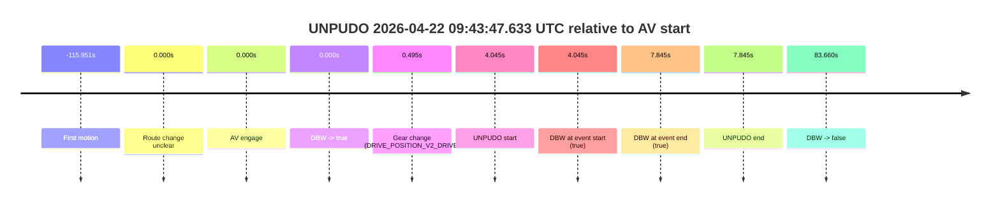
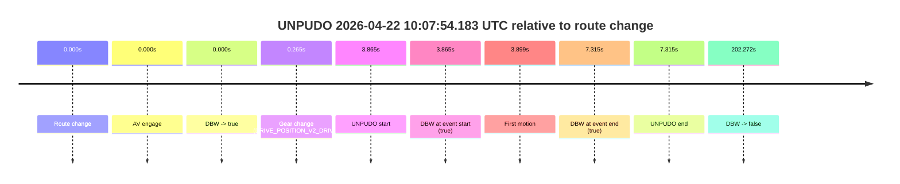
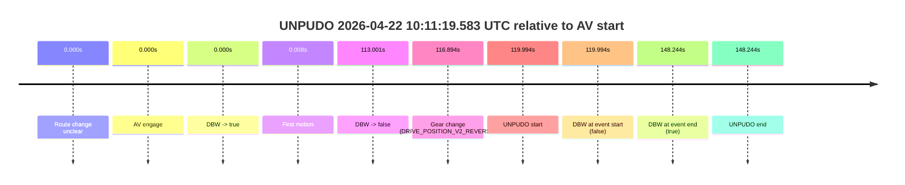

# Run Report: fme20002/2026-04-22--09-24-04--gen2-av-5450a3b6-cacc-4aa8-86b2-bbe8fb892253

| Field | Value |
|---|---|
| Run ID | `fme20002/2026-04-22--09-24-04--gen2-av-5450a3b6-cacc-4aa8-86b2-bbe8fb892253` |
| Date | `2026-04-22` |
| Model(s) | `eel-teal-outspoken` |
| Author | `zak` |
| Event count | `4` |

## unpudo 2026-04-22 09:29:20.883 UTC

| Field | Value |
|---|---|
| Model | `eel-teal-outspoken` |
| Author | `zak` |
| Run ID | `fme20002/2026-04-22--09-24-04--gen2-av-5450a3b6-cacc-4aa8-86b2-bbe8fb892253` |
| Date | `2026-04-22` |
| Time (UTC) | `09:29:20.883` |
| Event type | `unpudo` |
| Disengagement type | `none observed` |
| Route change | `found` |
| Console | [run](https://console.sso.wayve.ai/run/fme20002/2026-04-22--09-24-04--gen2-av-5450a3b6-cacc-4aa8-86b2-bbe8fb892253?id=&time-unixus=1776850160883300) |
| Foxglove | [segment](https://app.foxglove.dev/wayve-on-prem/p/prj_0dX18KZdVHg1fmmI/view?ds=foxglove-stream&ds.deviceName=fme20002&ds.start=2026-04-22T09%3A29%3A06.318307Z&ds.end=2026-04-22T09%3A30%3A46.469426Z&layoutId=lay_0e7VD4WIKDQGU73Y&time=2026-04-22T09%3A29%3A20.883300Z) |

### Event card: pass

- Pass: AV owns the credited unpudo from route change through the official unpudo window, the gear state is aligned at the anchor, and the vehicle moves without driver accelerator help in AV.

| Event | Time (UTC) | Delta from route change |
|---|---:|---:|
| Route change | 2026-04-22 09:29:16.318 | `0.000s` |
| AV engage | 2026-04-22 09:29:16.318 | `0.000s` |
| DBW -> true | 2026-04-22 09:29:16.318 | `0.000s` |
| Gear change (DRIVE_POSITION_V2_DRIVE) | 2026-04-22 09:29:16.683 | `0.365s` |
| UNPUDO start | 2026-04-22 09:29:20.883 | `4.565s` |
| DBW at event start (true) | 2026-04-22 09:29:20.883 | `4.565s` |
| First motion | 2026-04-22 09:29:20.937 | `4.619s` |
| DBW at event end (true) | 2026-04-22 09:29:25.233 | `8.915s` |
| UNPUDO end | 2026-04-22 09:29:25.233 | `8.915s` |
| DBW -> false | 2026-04-22 09:30:36.469 | `80.151s` |

| Metric | Value |
|---|---|
| Outcome | `pass` |
| Effective failure type | `none` |
| Route change status | `found` |
| DBW at event start | `true` |
| DBW at event end | `true` |
| Predicted gear at AV start | `DRIVE_POSITION_V2_PARK` |
| Actual gear at AV start | `DRIVE_POSITION_V2_PARK` |
| Predicted gear at event start | `DRIVE_POSITION_V2_DRIVE` |
| Actual gear at event start | `DRIVE_POSITION_V2_DRIVE` |
| Planned indicator direction | `INDICATORS_STATE_V2_RIGHT_ON` |
| Controller indicator direction | `INDICATORS_STATE_V2_RIGHT_ON` |
| Actual indicator direction | `INDICATORS_STATE_V2_OFF` |
| Actual indicator at maneuver end | `INDICATORS_STATE_V2_OFF` |
| Driver accel help in AV | `false` |
| Driver accel help timestamp | `n/a` |
| Max accel pedal pct in AV | `0.0%` |
| Max brake pedal pct in AV | `8.0%` |
| Max speed mps in AV | `4.372` |
| Success timing baseline | `route change` |
| Route -> AV | `0.000s` |
| AV -> event start | `4.565s` |
| AV -> first motion | `4.619s` |
| Success baseline -> event start | `4.565s` |
| Success baseline -> first motion | `4.619s` |
| AV duration before disengagement | `80.151s` |
| Trajectory waypoint count | `37` |
| Driving-plan step count | `11` |

The scored portion starts from the AV-owned window, not from the pre-AV setup. Route-change search in the stopped pre-event segment was `found`, with the baseline therefore set to route change. At the event anchor the model predicts `DRIVE_POSITION_V2_DRIVE` and the actual gear is `DRIVE_POSITION_V2_DRIVE`. The effective model outcome is `pass` because `the credited unpudo stays AV-owned through the official unpudo window.`

### Resolution

| Field | Value |
|---|---|
| Final outcome | `pass` |
| Do we agree with this label? | `yes` |
| Source disengagement type | `none observed` |
| Resolved effective failure type | `none` |
| Confidence | `high` |

## unpudo 2026-04-22 09:43:47.633 UTC

| Field | Value |
|---|---|
| Model | `eel-teal-outspoken` |
| Author | `zak` |
| Run ID | `fme20002/2026-04-22--09-24-04--gen2-av-5450a3b6-cacc-4aa8-86b2-bbe8fb892253` |
| Date | `2026-04-22` |
| Time (UTC) | `09:43:47.633` |
| Event type | `unpudo` |
| Disengagement type | `none observed` |
| Route change | `unclear` |
| Console | [run](https://console.sso.wayve.ai/run/fme20002/2026-04-22--09-24-04--gen2-av-5450a3b6-cacc-4aa8-86b2-bbe8fb892253?id=&time-unixus=1776851027633318) |
| Foxglove | [segment](https://app.foxglove.dev/wayve-on-prem/p/prj_0dX18KZdVHg1fmmI/view?ds=foxglove-stream&ds.deviceName=fme20002&ds.start=2026-04-22T09%3A43%3A33.588439Z&ds.end=2026-04-22T09%3A45%3A17.248889Z&layoutId=lay_0e7VD4WIKDQGU73Y&time=2026-04-22T09%3A43%3A47.633318Z) |

### Event card: pass

- Pass: AV owns the credited unpudo from route change through the official unpudo window, the gear state is aligned at the anchor, and the vehicle moves without driver accelerator help in AV.

| Event | Time (UTC) | Delta from AV start |
|---|---:|---:|
| First motion | 2026-04-22 09:41:47.637 | `-115.951s` |
| Route change unclear | 2026-04-22 09:43:43.588 | `0.000s` |
| AV engage | 2026-04-22 09:43:43.588 | `0.000s` |
| DBW -> true | 2026-04-22 09:43:43.588 | `0.000s` |
| Gear change (DRIVE_POSITION_V2_DRIVE) | 2026-04-22 09:43:44.083 | `0.495s` |
| UNPUDO start | 2026-04-22 09:43:47.633 | `4.045s` |
| DBW at event start (true) | 2026-04-22 09:43:47.633 | `4.045s` |
| DBW at event end (true) | 2026-04-22 09:43:51.433 | `7.845s` |
| UNPUDO end | 2026-04-22 09:43:51.433 | `7.845s` |
| DBW -> false | 2026-04-22 09:45:07.248 | `83.660s` |

| Metric | Value |
|---|---|
| Outcome | `pass` |
| Effective failure type | `none` |
| Route change status | `unclear` |
| DBW at event start | `true` |
| DBW at event end | `true` |
| Predicted gear at AV start | `DRIVE_POSITION_V2_DRIVE` |
| Actual gear at AV start | `DRIVE_POSITION_V2_PARK` |
| Predicted gear at event start | `DRIVE_POSITION_V2_DRIVE` |
| Actual gear at event start | `DRIVE_POSITION_V2_DRIVE` |
| Planned indicator direction | `INDICATORS_STATE_V2_OFF` |
| Controller indicator direction | `INDICATORS_STATE_V2_OFF` |
| Actual indicator direction | `INDICATORS_STATE_V2_OFF` |
| Actual indicator at maneuver end | `INDICATORS_STATE_V2_OFF` |
| Driver accel help in AV | `false` |
| Driver accel help timestamp | `n/a` |
| Max accel pedal pct in AV | `0.0%` |
| Max brake pedal pct in AV | `8.0%` |
| Max speed mps in AV | `3.742` |
| Success timing baseline | `AV start` |
| Route -> AV | `n/a` |
| AV -> event start | `4.045s` |
| AV -> first motion | `-115.951s` |
| Success baseline -> event start | `4.045s` |
| Success baseline -> first motion | `-115.951s` |
| AV duration before disengagement | `83.660s` |
| Trajectory waypoint count | `38` |
| Driving-plan step count | `11` |

The scored portion starts from the AV-owned window, not from the pre-AV setup. Route-change search in the stopped pre-event segment was `unclear`, with the baseline therefore set to AV start. At the event anchor the model predicts `DRIVE_POSITION_V2_DRIVE` and the actual gear is `DRIVE_POSITION_V2_DRIVE`. The effective model outcome is `pass` because `the credited unpudo stays AV-owned through the official unpudo window.`

### Resolution

| Field | Value |
|---|---|
| Final outcome | `pass` |
| Do we agree with this label? | `yes` |
| Source disengagement type | `none observed` |
| Resolved effective failure type | `none` |
| Confidence | `medium` |

## unpudo 2026-04-22 10:07:54.183 UTC

| Field | Value |
|---|---|
| Model | `eel-teal-outspoken` |
| Author | `zak` |
| Run ID | `fme20002/2026-04-22--09-24-04--gen2-av-5450a3b6-cacc-4aa8-86b2-bbe8fb892253` |
| Date | `2026-04-22` |
| Time (UTC) | `10:07:54.183` |
| Event type | `unpudo` |
| Disengagement type | `none observed` |
| Route change | `found` |
| Console | [run](https://console.sso.wayve.ai/run/fme20002/2026-04-22--09-24-04--gen2-av-5450a3b6-cacc-4aa8-86b2-bbe8fb892253?id=&time-unixus=1776852474183302) |
| Foxglove | [segment](https://app.foxglove.dev/wayve-on-prem/p/prj_0dX18KZdVHg1fmmI/view?ds=foxglove-stream&ds.deviceName=fme20002&ds.start=2026-04-22T10%3A07%3A40.318276Z&ds.end=2026-04-22T10%3A11%3A22.590260Z&layoutId=lay_0e7VD4WIKDQGU73Y&time=2026-04-22T10%3A07%3A54.183302Z) |

### Event card: pass

- Pass: AV owns the credited unpudo from route change through the official unpudo window, the gear state is aligned at the anchor, and the vehicle moves without driver accelerator help in AV.

| Event | Time (UTC) | Delta from route change |
|---|---:|---:|
| Route change | 2026-04-22 10:07:50.318 | `0.000s` |
| AV engage | 2026-04-22 10:07:50.318 | `0.000s` |
| DBW -> true | 2026-04-22 10:07:50.318 | `0.000s` |
| Gear change (DRIVE_POSITION_V2_DRIVE) | 2026-04-22 10:07:50.583 | `0.265s` |
| UNPUDO start | 2026-04-22 10:07:54.183 | `3.865s` |
| DBW at event start (true) | 2026-04-22 10:07:54.183 | `3.865s` |
| First motion | 2026-04-22 10:07:54.217 | `3.899s` |
| DBW at event end (true) | 2026-04-22 10:07:57.633 | `7.315s` |
| UNPUDO end | 2026-04-22 10:07:57.633 | `7.315s` |
| DBW -> false | 2026-04-22 10:11:12.590 | `202.272s` |

| Metric | Value |
|---|---|
| Outcome | `pass` |
| Effective failure type | `none` |
| Route change status | `found` |
| DBW at event start | `true` |
| DBW at event end | `true` |
| Predicted gear at AV start | `DRIVE_POSITION_V2_PARK` |
| Actual gear at AV start | `DRIVE_POSITION_V2_PARK` |
| Predicted gear at event start | `DRIVE_POSITION_V2_DRIVE` |
| Actual gear at event start | `DRIVE_POSITION_V2_DRIVE` |
| Planned indicator direction | `INDICATORS_STATE_V2_RIGHT_ON` |
| Controller indicator direction | `INDICATORS_STATE_V2_RIGHT_ON` |
| Actual indicator direction | `INDICATORS_STATE_V2_OFF` |
| Actual indicator at maneuver end | `INDICATORS_STATE_V2_OFF` |
| Driver accel help in AV | `false` |
| Driver accel help timestamp | `n/a` |
| Max accel pedal pct in AV | `0.0%` |
| Max brake pedal pct in AV | `8.7%` |
| Max speed mps in AV | `4.236` |
| Success timing baseline | `route change` |
| Route -> AV | `0.000s` |
| AV -> event start | `3.865s` |
| AV -> first motion | `3.899s` |
| Success baseline -> event start | `3.865s` |
| Success baseline -> first motion | `3.899s` |
| AV duration before disengagement | `202.272s` |
| Trajectory waypoint count | `37` |
| Driving-plan step count | `11` |

The scored portion starts from the AV-owned window, not from the pre-AV setup. Route-change search in the stopped pre-event segment was `found`, with the baseline therefore set to route change. At the event anchor the model predicts `DRIVE_POSITION_V2_DRIVE` and the actual gear is `DRIVE_POSITION_V2_DRIVE`. The effective model outcome is `pass` because `the credited unpudo stays AV-owned through the official unpudo window.`

### Resolution

| Field | Value |
|---|---|
| Final outcome | `pass` |
| Do we agree with this label? | `yes` |
| Source disengagement type | `none observed` |
| Resolved effective failure type | `none` |
| Confidence | `high` |

## unpudo 2026-04-22 10:11:19.583 UTC

| Field | Value |
|---|---|
| Model | `eel-teal-outspoken` |
| Author | `zak` |
| Run ID | `fme20002/2026-04-22--09-24-04--gen2-av-5450a3b6-cacc-4aa8-86b2-bbe8fb892253` |
| Date | `2026-04-22` |
| Time (UTC) | `10:11:19.583` |
| Event type | `unpudo` |
| Disengagement type | `none observed` |
| Route change | `unclear` |
| Console | [run](https://console.sso.wayve.ai/run/fme20002/2026-04-22--09-24-04--gen2-av-5450a3b6-cacc-4aa8-86b2-bbe8fb892253?id=&time-unixus=1776852679583313) |
| Foxglove | [segment](https://app.foxglove.dev/wayve-on-prem/p/prj_0dX18KZdVHg1fmmI/view?ds=foxglove-stream&ds.deviceName=fme20002&ds.start=2026-04-22T10%3A09%3A09.588874Z&ds.end=2026-04-22T10%3A11%3A57.833305Z&layoutId=lay_0e7VD4WIKDQGU73Y&time=2026-04-22T10%3A11%3A19.583313Z) |

### Event card: fail

- Fail: the credited unpudo does not stay AV-owned. The event window starts with DBW false, and the maneuver outcome lands outside a clean AV-owned segment.

| Event | Time (UTC) | Delta from AV start |
|---|---:|---:|
| Route change unclear | 2026-04-22 10:09:19.588 | `0.000s` |
| AV engage | 2026-04-22 10:09:19.588 | `0.000s` |
| DBW -> true | 2026-04-22 10:09:19.588 | `0.000s` |
| First motion | 2026-04-22 10:09:19.597 | `0.008s` |
| DBW -> false | 2026-04-22 10:11:12.590 | `113.001s` |
| Gear change (DRIVE_POSITION_V2_REVERSE) | 2026-04-22 10:11:16.483 | `116.894s` |
| UNPUDO start | 2026-04-22 10:11:19.583 | `119.994s` |
| DBW at event start (false) | 2026-04-22 10:11:19.583 | `119.994s` |
| DBW at event end (true) | 2026-04-22 10:11:47.833 | `148.244s` |
| UNPUDO end | 2026-04-22 10:11:47.833 | `148.244s` |

| Metric | Value |
|---|---|
| Outcome | `fail` |
| Effective failure type | `not_av_owned` |
| Route change status | `unclear` |
| DBW at event start | `false` |
| DBW at event end | `true` |
| Predicted gear at AV start | `DRIVE_POSITION_V2_DRIVE` |
| Actual gear at AV start | `DRIVE_POSITION_V2_DRIVE` |
| Predicted gear at event start | `DRIVE_POSITION_V2_REVERSE` |
| Actual gear at event start | `DRIVE_POSITION_V2_REVERSE` |
| Planned indicator direction | `INDICATORS_STATE_V2_OFF` |
| Controller indicator direction | `INDICATORS_STATE_V2_OFF` |
| Actual indicator direction | `INDICATORS_STATE_V2_OFF` |
| Actual indicator at maneuver end | `INDICATORS_STATE_V2_OFF` |
| Driver accel help in AV | `false` |
| Driver accel help timestamp | `n/a` |
| Max accel pedal pct in AV | `0.0%` |
| Max brake pedal pct in AV | `11.5%` |
| Max speed mps in AV | `8.292` |
| Success timing baseline | `AV start` |
| Route -> AV | `n/a` |
| AV -> event start | `119.994s` |
| AV -> first motion | `0.008s` |
| Success baseline -> event start | `119.994s` |
| Success baseline -> first motion | `0.008s` |
| AV duration before disengagement | `113.001s` |
| Trajectory waypoint count | `37` |
| Driving-plan step count | `11` |

The scored portion starts from the AV-owned window, not from the pre-AV setup. Route-change search in the stopped pre-event segment was `unclear`, with the baseline therefore set to AV start. At the event anchor the model predicts `DRIVE_POSITION_V2_REVERSE` and the actual gear is `DRIVE_POSITION_V2_REVERSE`. The effective model outcome is `fail` because `not_av_owned.`

### Resolution

| Field | Value |
|---|---|
| Final outcome | `fail` |
| Do we agree with this label? | `yes` |
| Source disengagement type | `none observed` |
| Resolved effective failure type | `not_av_owned` |
| Confidence | `medium` |
