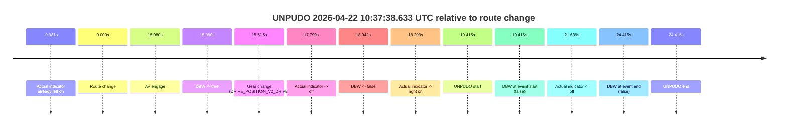
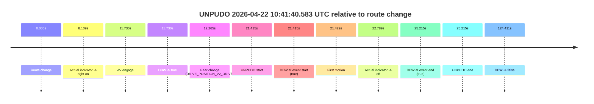

# Run Report: fme20002/2026-04-22--10-28-04--gen2-av-51799255-5ec8-4dac-b277-c3ec7bf0cda6

| Field | Value |
|---|---|
| Run ID | `fme20002/2026-04-22--10-28-04--gen2-av-51799255-5ec8-4dac-b277-c3ec7bf0cda6` |
| Date | `2026-04-22` |
| Model(s) | `pink-manta-ray-smooth` |
| Author | `guy.geva` |
| Event count | `2` |

## unpudo 2026-04-22 10:37:38.633 UTC

| Field | Value |
|---|---|
| Model | `pink-manta-ray-smooth` |
| Author | `guy.geva` |
| Run ID | `fme20002/2026-04-22--10-28-04--gen2-av-51799255-5ec8-4dac-b277-c3ec7bf0cda6` |
| Date | `2026-04-22` |
| Time (UTC) | `10:37:38.633` |
| Event type | `unpudo` |
| Disengagement type | `none observed` |
| Route change | `found` |
| Console | [run](https://console.sso.wayve.ai/run/fme20002/2026-04-22--10-28-04--gen2-av-51799255-5ec8-4dac-b277-c3ec7bf0cda6?id=&time-unixus=1776854258633302) |
| Foxglove | [segment](https://app.foxglove.dev/wayve-on-prem/p/prj_0dX18KZdVHg1fmmI/view?ds=foxglove-stream&ds.deviceName=fme20002&ds.start=2026-04-22T10%3A37%3A09.218299Z&ds.end=2026-04-22T10%3A37%3A53.633322Z&layoutId=lay_0e7VD4WIKDQGU73Y&time=2026-04-22T10%3A37%3A38.633302Z) |

### Event card: fail

- Fail: the credited unpudo does not stay AV-owned. The event window starts with DBW false, and the maneuver outcome lands outside a clean AV-owned segment.

| Event | Time (UTC) | Delta from route change |
|---|---:|---:|
| Actual indicator already left on | 2026-04-22 10:37:09.237 | `-9.981s` |
| Route change | 2026-04-22 10:37:19.218 | `0.000s` |
| AV engage | 2026-04-22 10:37:34.298 | `15.080s` |
| DBW -> true | 2026-04-22 10:37:34.298 | `15.080s` |
| Gear change (DRIVE_POSITION_V2_DRIVE) | 2026-04-22 10:37:34.733 | `15.515s` |
| Actual indicator -> off | 2026-04-22 10:37:37.017 | `17.799s` |
| DBW -> false | 2026-04-22 10:37:37.260 | `18.042s` |
| Actual indicator -> right on | 2026-04-22 10:37:37.517 | `18.299s` |
| UNPUDO start | 2026-04-22 10:37:38.633 | `19.415s` |
| DBW at event start (false) | 2026-04-22 10:37:38.633 | `19.415s` |
| Actual indicator -> off | 2026-04-22 10:37:40.857 | `21.639s` |
| DBW at event end (false) | 2026-04-22 10:37:43.633 | `24.415s` |
| UNPUDO end | 2026-04-22 10:37:43.633 | `24.415s` |

| Metric | Value |
|---|---|
| Outcome | `fail` |
| Effective failure type | `not_av_owned` |
| Route change status | `found` |
| DBW at event start | `false` |
| DBW at event end | `false` |
| Predicted gear at AV start | `DRIVE_POSITION_V2_DRIVE` |
| Actual gear at AV start | `DRIVE_POSITION_V2_PARK` |
| Predicted gear at event start | `DRIVE_POSITION_V2_DRIVE` |
| Actual gear at event start | `DRIVE_POSITION_V2_DRIVE` |
| Planned indicator direction | `INDICATORS_STATE_V2_RIGHT_ON` |
| Controller indicator direction | `INDICATORS_STATE_V2_RIGHT_ON` |
| Actual indicator direction | `INDICATORS_STATE_V2_RIGHT_ON` |
| Actual indicator at maneuver end | `INDICATORS_STATE_V2_OFF` |
| Driver accel help in AV | `false` |
| Driver accel help timestamp | `n/a` |
| Max accel pedal pct in AV | `0.0%` |
| Max brake pedal pct in AV | `8.0%` |
| Max speed mps in AV | `0.000` |
| Success timing baseline | `route change` |
| Route -> AV | `15.080s` |
| AV -> event start | `4.335s` |
| AV -> first motion | `n/a` |
| Success baseline -> event start | `19.415s` |
| Success baseline -> first motion | `n/a` |
| AV duration before disengagement | `2.961s` |
| Trajectory waypoint count | `36` |
| Driving-plan step count | `11` |

The scored portion starts from the AV-owned window, not from the pre-AV setup. Route-change search in the stopped pre-event segment was `found`, with the baseline therefore set to route change. At the event anchor the model predicts `DRIVE_POSITION_V2_DRIVE` and the actual gear is `DRIVE_POSITION_V2_DRIVE`. The effective model outcome is `fail` because `not_av_owned.`

### Resolution

| Field | Value |
|---|---|
| Final outcome | `fail` |
| Do we agree with this label? | `yes` |
| Source disengagement type | `none observed` |
| Resolved effective failure type | `not_av_owned` |
| Confidence | `high` |

## unpudo 2026-04-22 10:41:40.583 UTC

| Field | Value |
|---|---|
| Model | `pink-manta-ray-smooth` |
| Author | `guy.geva` |
| Run ID | `fme20002/2026-04-22--10-28-04--gen2-av-51799255-5ec8-4dac-b277-c3ec7bf0cda6` |
| Date | `2026-04-22` |
| Time (UTC) | `10:41:40.583` |
| Event type | `unpudo` |
| Disengagement type | `none observed` |
| Route change | `found` |
| Console | [run](https://console.sso.wayve.ai/run/fme20002/2026-04-22--10-28-04--gen2-av-51799255-5ec8-4dac-b277-c3ec7bf0cda6?id=&time-unixus=1776854500583303) |
| Foxglove | [segment](https://app.foxglove.dev/wayve-on-prem/p/prj_0dX18KZdVHg1fmmI/view?ds=foxglove-stream&ds.deviceName=fme20002&ds.start=2026-04-22T10%3A41%3A09.168294Z&ds.end=2026-04-22T10%3A43%3A33.579277Z&layoutId=lay_0e7VD4WIKDQGU73Y&time=2026-04-22T10%3A41%3A40.583303Z) |

### Event card: pass

- Pass: AV owns the credited unpudo from route change through the official unpudo window, the gear state is aligned at the anchor, and the vehicle moves without driver accelerator help in AV.

| Event | Time (UTC) | Delta from route change |
|---|---:|---:|
| Route change | 2026-04-22 10:41:19.168 | `0.000s` |
| Actual indicator -> right on | 2026-04-22 10:41:27.277 | `8.109s` |
| AV engage | 2026-04-22 10:41:30.898 | `11.730s` |
| DBW -> true | 2026-04-22 10:41:30.898 | `11.730s` |
| Gear change (DRIVE_POSITION_V2_DRIVE) | 2026-04-22 10:41:31.433 | `12.265s` |
| UNPUDO start | 2026-04-22 10:41:40.583 | `21.415s` |
| DBW at event start (true) | 2026-04-22 10:41:40.583 | `21.415s` |
| First motion | 2026-04-22 10:41:40.597 | `21.429s` |
| Actual indicator -> off | 2026-04-22 10:41:41.957 | `22.789s` |
| DBW at event end (true) | 2026-04-22 10:41:44.383 | `25.215s` |
| UNPUDO end | 2026-04-22 10:41:44.383 | `25.215s` |
| DBW -> false | 2026-04-22 10:43:23.579 | `124.411s` |

| Metric | Value |
|---|---|
| Outcome | `pass` |
| Effective failure type | `none` |
| Route change status | `found` |
| DBW at event start | `true` |
| DBW at event end | `true` |
| Predicted gear at AV start | `DRIVE_POSITION_V2_DRIVE` |
| Actual gear at AV start | `DRIVE_POSITION_V2_PARK` |
| Predicted gear at event start | `DRIVE_POSITION_V2_DRIVE` |
| Actual gear at event start | `DRIVE_POSITION_V2_DRIVE` |
| Planned indicator direction | `INDICATORS_STATE_V2_RIGHT_ON` |
| Controller indicator direction | `INDICATORS_STATE_V2_RIGHT_ON` |
| Actual indicator direction | `INDICATORS_STATE_V2_RIGHT_ON` |
| Actual indicator at maneuver end | `INDICATORS_STATE_V2_OFF` |
| Driver accel help in AV | `false` |
| Driver accel help timestamp | `n/a` |
| Max accel pedal pct in AV | `0.0%` |
| Max brake pedal pct in AV | `8.6%` |
| Max speed mps in AV | `4.481` |
| Success timing baseline | `route change` |
| Route -> AV | `11.730s` |
| AV -> event start | `9.685s` |
| AV -> first motion | `9.699s` |
| Success baseline -> event start | `21.415s` |
| Success baseline -> first motion | `21.429s` |
| AV duration before disengagement | `112.681s` |
| Trajectory waypoint count | `37` |
| Driving-plan step count | `11` |

The scored portion starts from the AV-owned window, not from the pre-AV setup. Route-change search in the stopped pre-event segment was `found`, with the baseline therefore set to route change. At the event anchor the model predicts `DRIVE_POSITION_V2_DRIVE` and the actual gear is `DRIVE_POSITION_V2_DRIVE`. The effective model outcome is `pass` because `the credited unpudo stays AV-owned through the official unpudo window.`

### Resolution

| Field | Value |
|---|---|
| Final outcome | `pass` |
| Do we agree with this label? | `yes` |
| Source disengagement type | `none observed` |
| Resolved effective failure type | `none` |
| Confidence | `high` |
