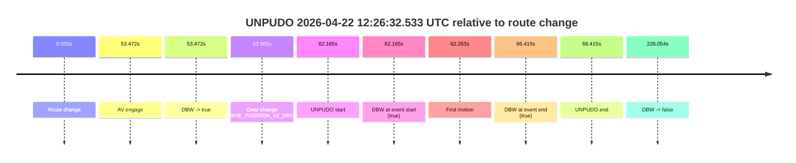
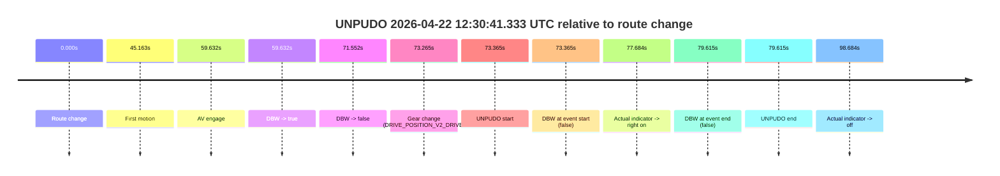
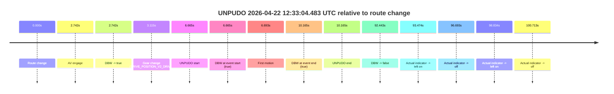
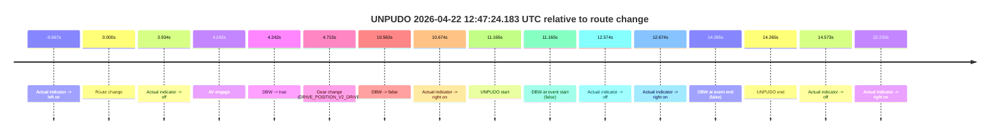
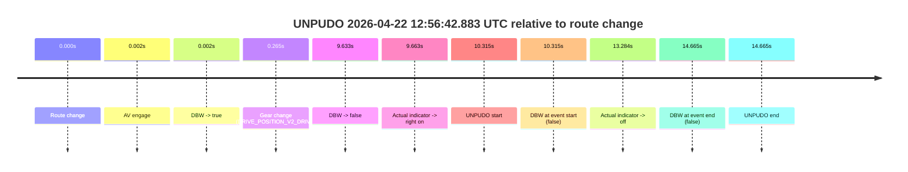

# Run Report: fme20002/2026-04-22--12-20-12--gen2-av-897668a7-ec43-42aa-ae06-d72a68999bf8

| Field | Value |
|---|---|
| Run ID | `fme20002/2026-04-22--12-20-12--gen2-av-897668a7-ec43-42aa-ae06-d72a68999bf8` |
| Date | `2026-04-22` |
| Model(s) | `pink-manta-ray-smooth` |
| Author | `guy.geva` |
| Event count | `5` |

## unpudo 2026-04-22 12:26:32.533 UTC

| Field | Value |
|---|---|
| Model | `pink-manta-ray-smooth` |
| Author | `guy.geva` |
| Run ID | `fme20002/2026-04-22--12-20-12--gen2-av-897668a7-ec43-42aa-ae06-d72a68999bf8` |
| Date | `2026-04-22` |
| Time (UTC) | `12:26:32.533` |
| Event type | `unpudo` |
| Disengagement type | `none observed` |
| Route change | `found` |
| Console | [run](https://console.sso.wayve.ai/run/fme20002/2026-04-22--12-20-12--gen2-av-897668a7-ec43-42aa-ae06-d72a68999bf8?id=&time-unixus=1776860792533308) |
| Foxglove | [segment](https://app.foxglove.dev/wayve-on-prem/p/prj_0dX18KZdVHg1fmmI/view?ds=foxglove-stream&ds.deviceName=fme20002&ds.start=2026-04-22T12%3A25%3A20.368281Z&ds.end=2026-04-22T12%3A29%3A26.421823Z&layoutId=lay_0e7VD4WIKDQGU73Y&time=2026-04-22T12%3A26%3A32.533308Z) |

### Event card: pass

- Pass: AV owns the credited unpudo from route change through the official unpudo window, the gear state is aligned at the anchor, and the vehicle moves without driver accelerator help in AV.

| Event | Time (UTC) | Delta from route change |
|---|---:|---:|
| Route change | 2026-04-22 12:25:30.368 | `0.000s` |
| AV engage | 2026-04-22 12:26:23.840 | `53.472s` |
| DBW -> true | 2026-04-22 12:26:23.840 | `53.472s` |
| Gear change (DRIVE_POSITION_V2_DRIVE) | 2026-04-22 12:26:24.233 | `53.865s` |
| UNPUDO start | 2026-04-22 12:26:32.533 | `62.165s` |
| DBW at event start (true) | 2026-04-22 12:26:32.533 | `62.165s` |
| First motion | 2026-04-22 12:26:32.631 | `62.263s` |
| DBW at event end (true) | 2026-04-22 12:26:36.783 | `66.415s` |
| UNPUDO end | 2026-04-22 12:26:36.783 | `66.415s` |
| DBW -> false | 2026-04-22 12:29:16.421 | `226.054s` |

| Metric | Value |
|---|---|
| Outcome | `pass` |
| Effective failure type | `none` |
| Route change status | `found` |
| DBW at event start | `true` |
| DBW at event end | `true` |
| Predicted gear at AV start | `DRIVE_POSITION_V2_DRIVE` |
| Actual gear at AV start | `DRIVE_POSITION_V2_PARK` |
| Predicted gear at event start | `DRIVE_POSITION_V2_DRIVE` |
| Actual gear at event start | `DRIVE_POSITION_V2_DRIVE` |
| Planned indicator direction | `INDICATORS_STATE_V2_RIGHT_ON` |
| Controller indicator direction | `INDICATORS_STATE_V2_RIGHT_ON` |
| Actual indicator direction | `INDICATORS_STATE_V2_OFF` |
| Actual indicator at maneuver end | `INDICATORS_STATE_V2_OFF` |
| Driver accel help in AV | `false` |
| Driver accel help timestamp | `n/a` |
| Max accel pedal pct in AV | `0.0%` |
| Max brake pedal pct in AV | `8.0%` |
| Max speed mps in AV | `3.856` |
| Success timing baseline | `route change` |
| Route -> AV | `53.472s` |
| AV -> event start | `8.693s` |
| AV -> first motion | `8.791s` |
| Success baseline -> event start | `62.165s` |
| Success baseline -> first motion | `62.263s` |
| AV duration before disengagement | `172.581s` |
| Trajectory waypoint count | `36` |
| Driving-plan step count | `11` |

The scored portion starts from the AV-owned window, not from the pre-AV setup. Route-change search in the stopped pre-event segment was `found`, with the baseline therefore set to route change. At the event anchor the model predicts `DRIVE_POSITION_V2_DRIVE` and the actual gear is `DRIVE_POSITION_V2_DRIVE`. The effective model outcome is `pass` because `the credited unpudo stays AV-owned through the official unpudo window.`

### Resolution

| Field | Value |
|---|---|
| Final outcome | `pass` |
| Do we agree with this label? | `yes` |
| Source disengagement type | `none observed` |
| Resolved effective failure type | `none` |
| Confidence | `high` |

## unpudo 2026-04-22 12:30:41.333 UTC

| Field | Value |
|---|---|
| Model | `pink-manta-ray-smooth` |
| Author | `guy.geva` |
| Run ID | `fme20002/2026-04-22--12-20-12--gen2-av-897668a7-ec43-42aa-ae06-d72a68999bf8` |
| Date | `2026-04-22` |
| Time (UTC) | `12:30:41.333` |
| Event type | `unpudo` |
| Disengagement type | `none observed` |
| Route change | `found` |
| Console | [run](https://console.sso.wayve.ai/run/fme20002/2026-04-22--12-20-12--gen2-av-897668a7-ec43-42aa-ae06-d72a68999bf8?id=&time-unixus=1776861041333306) |
| Foxglove | [segment](https://app.foxglove.dev/wayve-on-prem/p/prj_0dX18KZdVHg1fmmI/view?ds=foxglove-stream&ds.deviceName=fme20002&ds.start=2026-04-22T12%3A29%3A17.968251Z&ds.end=2026-04-22T12%3A30%3A57.583300Z&layoutId=lay_0e7VD4WIKDQGU73Y&time=2026-04-22T12%3A30%3A41.333306Z) |

### Event card: fail

- Fail: the credited unpudo does not stay AV-owned. The event window starts with DBW false, and the maneuver outcome lands outside a clean AV-owned segment.

| Event | Time (UTC) | Delta from route change |
|---|---:|---:|
| Route change | 2026-04-22 12:29:27.968 | `0.000s` |
| First motion | 2026-04-22 12:30:13.131 | `45.163s` |
| AV engage | 2026-04-22 12:30:27.600 | `59.632s` |
| DBW -> true | 2026-04-22 12:30:27.600 | `59.632s` |
| DBW -> false | 2026-04-22 12:30:39.520 | `71.552s` |
| Gear change (DRIVE_POSITION_V2_DRIVE) | 2026-04-22 12:30:41.233 | `73.265s` |
| UNPUDO start | 2026-04-22 12:30:41.333 | `73.365s` |
| DBW at event start (false) | 2026-04-22 12:30:41.333 | `73.365s` |
| Actual indicator -> right on | 2026-04-22 12:30:45.651 | `77.684s` |
| DBW at event end (false) | 2026-04-22 12:30:47.583 | `79.615s` |
| UNPUDO end | 2026-04-22 12:30:47.583 | `79.615s` |
| Actual indicator -> off | 2026-04-22 12:31:06.651 | `98.684s` |

| Metric | Value |
|---|---|
| Outcome | `fail` |
| Effective failure type | `completed_outside_av` |
| Route change status | `found` |
| DBW at event start | `false` |
| DBW at event end | `false` |
| Predicted gear at AV start | `DRIVE_POSITION_V2_DRIVE` |
| Actual gear at AV start | `DRIVE_POSITION_V2_PARK` |
| Predicted gear at event start | `DRIVE_POSITION_V2_PARK` |
| Actual gear at event start | `DRIVE_POSITION_V2_DRIVE` |
| Planned indicator direction | `INDICATORS_STATE_V2_OFF` |
| Controller indicator direction | `INDICATORS_STATE_V2_OFF` |
| Actual indicator direction | `INDICATORS_STATE_V2_OFF` |
| Actual indicator at maneuver end | `INDICATORS_STATE_V2_RIGHT_ON` |
| Driver accel help in AV | `false` |
| Driver accel help timestamp | `n/a` |
| Max accel pedal pct in AV | `0.0%` |
| Max brake pedal pct in AV | `8.0%` |
| Max speed mps in AV | `0.000` |
| Success timing baseline | `route change` |
| Route -> AV | `59.632s` |
| AV -> event start | `13.733s` |
| AV -> first motion | `-14.469s` |
| Success baseline -> event start | `73.365s` |
| Success baseline -> first motion | `45.163s` |
| AV duration before disengagement | `11.920s` |
| Trajectory waypoint count | `38` |
| Driving-plan step count | `11` |

The scored portion starts from the AV-owned window, not from the pre-AV setup. Route-change search in the stopped pre-event segment was `found`, with the baseline therefore set to route change. At the event anchor the model predicts `DRIVE_POSITION_V2_PARK` and the actual gear is `DRIVE_POSITION_V2_DRIVE`. The effective model outcome is `fail` because `completed_outside_av.`

### Resolution

| Field | Value |
|---|---|
| Final outcome | `fail` |
| Do we agree with this label? | `yes` |
| Source disengagement type | `none observed` |
| Resolved effective failure type | `completed_outside_av` |
| Confidence | `high` |

## unpudo 2026-04-22 12:33:04.483 UTC

| Field | Value |
|---|---|
| Model | `pink-manta-ray-smooth` |
| Author | `guy.geva` |
| Run ID | `fme20002/2026-04-22--12-20-12--gen2-av-897668a7-ec43-42aa-ae06-d72a68999bf8` |
| Date | `2026-04-22` |
| Time (UTC) | `12:33:04.483` |
| Event type | `unpudo` |
| Disengagement type | `none observed` |
| Route change | `found` |
| Console | [run](https://console.sso.wayve.ai/run/fme20002/2026-04-22--12-20-12--gen2-av-897668a7-ec43-42aa-ae06-d72a68999bf8?id=&time-unixus=1776861184483305) |
| Foxglove | [segment](https://app.foxglove.dev/wayve-on-prem/p/prj_0dX18KZdVHg1fmmI/view?ds=foxglove-stream&ds.deviceName=fme20002&ds.start=2026-04-22T12%3A32%3A47.818299Z&ds.end=2026-04-22T12%3A34%3A40.261660Z&layoutId=lay_0e7VD4WIKDQGU73Y&time=2026-04-22T12%3A33%3A04.483305Z) |

### Event card: pass

- Pass: AV owns the credited unpudo from route change through the official unpudo window, the gear state is aligned at the anchor, and the vehicle moves without driver accelerator help in AV.

| Event | Time (UTC) | Delta from route change |
|---|---:|---:|
| Route change | 2026-04-22 12:32:57.818 | `0.000s` |
| AV engage | 2026-04-22 12:33:00.560 | `2.742s` |
| DBW -> true | 2026-04-22 12:33:00.560 | `2.742s` |
| Gear change (DRIVE_POSITION_V2_DRIVE) | 2026-04-22 12:33:00.933 | `3.115s` |
| UNPUDO start | 2026-04-22 12:33:04.483 | `6.665s` |
| DBW at event start (true) | 2026-04-22 12:33:04.483 | `6.665s` |
| First motion | 2026-04-22 12:33:04.511 | `6.693s` |
| DBW at event end (true) | 2026-04-22 12:33:07.983 | `10.165s` |
| UNPUDO end | 2026-04-22 12:33:07.983 | `10.165s` |
| DBW -> false | 2026-04-22 12:34:30.261 | `92.443s` |
| Actual indicator -> left on | 2026-04-22 12:34:31.291 | `93.474s` |
| Actual indicator -> off | 2026-04-22 12:34:34.511 | `96.693s` |
| Actual indicator -> left on | 2026-04-22 12:34:36.651 | `98.834s` |
| Actual indicator -> off | 2026-04-22 12:34:38.531 | `100.713s` |

| Metric | Value |
|---|---|
| Outcome | `pass` |
| Effective failure type | `none` |
| Route change status | `found` |
| DBW at event start | `true` |
| DBW at event end | `true` |
| Predicted gear at AV start | `DRIVE_POSITION_V2_DRIVE` |
| Actual gear at AV start | `DRIVE_POSITION_V2_PARK` |
| Predicted gear at event start | `DRIVE_POSITION_V2_DRIVE` |
| Actual gear at event start | `DRIVE_POSITION_V2_DRIVE` |
| Planned indicator direction | `INDICATORS_STATE_V2_RIGHT_ON` |
| Controller indicator direction | `INDICATORS_STATE_V2_RIGHT_ON` |
| Actual indicator direction | `INDICATORS_STATE_V2_OFF` |
| Actual indicator at maneuver end | `INDICATORS_STATE_V2_OFF` |
| Driver accel help in AV | `false` |
| Driver accel help timestamp | `n/a` |
| Max accel pedal pct in AV | `0.0%` |
| Max brake pedal pct in AV | `8.0%` |
| Max speed mps in AV | `4.464` |
| Success timing baseline | `route change` |
| Route -> AV | `2.742s` |
| AV -> event start | `3.923s` |
| AV -> first motion | `3.951s` |
| Success baseline -> event start | `6.665s` |
| Success baseline -> first motion | `6.693s` |
| AV duration before disengagement | `89.701s` |
| Trajectory waypoint count | `37` |
| Driving-plan step count | `11` |

The scored portion starts from the AV-owned window, not from the pre-AV setup. Route-change search in the stopped pre-event segment was `found`, with the baseline therefore set to route change. At the event anchor the model predicts `DRIVE_POSITION_V2_DRIVE` and the actual gear is `DRIVE_POSITION_V2_DRIVE`. The effective model outcome is `pass` because `the credited unpudo stays AV-owned through the official unpudo window.`

### Resolution

| Field | Value |
|---|---|
| Final outcome | `pass` |
| Do we agree with this label? | `yes` |
| Source disengagement type | `none observed` |
| Resolved effective failure type | `none` |
| Confidence | `high` |

## unpudo 2026-04-22 12:47:24.183 UTC

| Field | Value |
|---|---|
| Model | `pink-manta-ray-smooth` |
| Author | `guy.geva` |
| Run ID | `fme20002/2026-04-22--12-20-12--gen2-av-897668a7-ec43-42aa-ae06-d72a68999bf8` |
| Date | `2026-04-22` |
| Time (UTC) | `12:47:24.183` |
| Event type | `unpudo` |
| Disengagement type | `none observed` |
| Route change | `found` |
| Console | [run](https://console.sso.wayve.ai/run/fme20002/2026-04-22--12-20-12--gen2-av-897668a7-ec43-42aa-ae06-d72a68999bf8?id=&time-unixus=1776862044183306) |
| Foxglove | [segment](https://app.foxglove.dev/wayve-on-prem/p/prj_0dX18KZdVHg1fmmI/view?ds=foxglove-stream&ds.deviceName=fme20002&ds.start=2026-04-22T12%3A47%3A03.018261Z&ds.end=2026-04-22T12%3A47%3A37.283315Z&layoutId=lay_0e7VD4WIKDQGU73Y&time=2026-04-22T12%3A47%3A24.183306Z) |

### Event card: fail

- Fail: the credited unpudo does not stay AV-owned. The event window starts with DBW false, and the maneuver outcome lands outside a clean AV-owned segment.

| Event | Time (UTC) | Delta from route change |
|---|---:|---:|
| Actual indicator -> left on | 2026-04-22 12:47:03.351 | `-9.667s` |
| Route change | 2026-04-22 12:47:13.018 | `0.000s` |
| Actual indicator -> off | 2026-04-22 12:47:16.951 | `3.934s` |
| AV engage | 2026-04-22 12:47:17.260 | `4.242s` |
| DBW -> true | 2026-04-22 12:47:17.260 | `4.242s` |
| Gear change (DRIVE_POSITION_V2_DRIVE) | 2026-04-22 12:47:17.733 | `4.715s` |
| DBW -> false | 2026-04-22 12:47:23.581 | `10.563s` |
| Actual indicator -> right on | 2026-04-22 12:47:23.692 | `10.674s` |
| UNPUDO start | 2026-04-22 12:47:24.183 | `11.165s` |
| DBW at event start (false) | 2026-04-22 12:47:24.183 | `11.165s` |
| Actual indicator -> off | 2026-04-22 12:47:25.592 | `12.574s` |
| Actual indicator -> right on | 2026-04-22 12:47:25.691 | `12.674s` |
| DBW at event end (false) | 2026-04-22 12:47:27.283 | `14.265s` |
| UNPUDO end | 2026-04-22 12:47:27.283 | `14.265s` |
| Actual indicator -> off | 2026-04-22 12:47:27.591 | `14.573s` |
| Actual indicator -> right on | 2026-04-22 12:47:35.251 | `22.233s` |

| Metric | Value |
|---|---|
| Outcome | `fail` |
| Effective failure type | `not_av_owned` |
| Route change status | `found` |
| DBW at event start | `false` |
| DBW at event end | `false` |
| Predicted gear at AV start | `DRIVE_POSITION_V2_DRIVE` |
| Actual gear at AV start | `DRIVE_POSITION_V2_PARK` |
| Predicted gear at event start | `DRIVE_POSITION_V2_DRIVE` |
| Actual gear at event start | `DRIVE_POSITION_V2_DRIVE` |
| Planned indicator direction | `INDICATORS_STATE_V2_LEFT_ON` |
| Controller indicator direction | `INDICATORS_STATE_V2_LEFT_ON` |
| Actual indicator direction | `INDICATORS_STATE_V2_RIGHT_ON` |
| Actual indicator at maneuver end | `INDICATORS_STATE_V2_RIGHT_ON` |
| Driver accel help in AV | `false` |
| Driver accel help timestamp | `n/a` |
| Max accel pedal pct in AV | `0.0%` |
| Max brake pedal pct in AV | `8.0%` |
| Max speed mps in AV | `0.000` |
| Success timing baseline | `route change` |
| Route -> AV | `4.242s` |
| AV -> event start | `6.923s` |
| AV -> first motion | `n/a` |
| Success baseline -> event start | `11.165s` |
| Success baseline -> first motion | `n/a` |
| AV duration before disengagement | `6.321s` |
| Trajectory waypoint count | `37` |
| Driving-plan step count | `11` |

The scored portion starts from the AV-owned window, not from the pre-AV setup. Route-change search in the stopped pre-event segment was `found`, with the baseline therefore set to route change. At the event anchor the model predicts `DRIVE_POSITION_V2_DRIVE` and the actual gear is `DRIVE_POSITION_V2_DRIVE`. The effective model outcome is `fail` because `not_av_owned.`

### Resolution

| Field | Value |
|---|---|
| Final outcome | `fail` |
| Do we agree with this label? | `yes` |
| Source disengagement type | `none observed` |
| Resolved effective failure type | `not_av_owned` |
| Confidence | `high` |

## unpudo 2026-04-22 12:56:42.883 UTC

| Field | Value |
|---|---|
| Model | `pink-manta-ray-smooth` |
| Author | `guy.geva` |
| Run ID | `fme20002/2026-04-22--12-20-12--gen2-av-897668a7-ec43-42aa-ae06-d72a68999bf8` |
| Date | `2026-04-22` |
| Time (UTC) | `12:56:42.883` |
| Event type | `unpudo` |
| Disengagement type | `none observed` |
| Route change | `found` |
| Console | [run](https://console.sso.wayve.ai/run/fme20002/2026-04-22--12-20-12--gen2-av-897668a7-ec43-42aa-ae06-d72a68999bf8?id=&time-unixus=1776862602883328) |
| Foxglove | [segment](https://app.foxglove.dev/wayve-on-prem/p/prj_0dX18KZdVHg1fmmI/view?ds=foxglove-stream&ds.deviceName=fme20002&ds.start=2026-04-22T12%3A56%3A22.568246Z&ds.end=2026-04-22T12%3A56%3A57.233291Z&layoutId=lay_0e7VD4WIKDQGU73Y&time=2026-04-22T12%3A56%3A42.883328Z) |

### Event card: fail

- Fail: the credited unpudo does not stay AV-owned. The event window starts with DBW false, and the maneuver outcome lands outside a clean AV-owned segment.

| Event | Time (UTC) | Delta from route change |
|---|---:|---:|
| Route change | 2026-04-22 12:56:32.568 | `0.000s` |
| AV engage | 2026-04-22 12:56:32.570 | `0.002s` |
| DBW -> true | 2026-04-22 12:56:32.570 | `0.002s` |
| Gear change (DRIVE_POSITION_V2_DRIVE) | 2026-04-22 12:56:32.833 | `0.265s` |
| DBW -> false | 2026-04-22 12:56:42.201 | `9.633s` |
| Actual indicator -> right on | 2026-04-22 12:56:42.231 | `9.663s` |
| UNPUDO start | 2026-04-22 12:56:42.883 | `10.315s` |
| DBW at event start (false) | 2026-04-22 12:56:42.883 | `10.315s` |
| Actual indicator -> off | 2026-04-22 12:56:45.851 | `13.284s` |
| DBW at event end (false) | 2026-04-22 12:56:47.233 | `14.665s` |
| UNPUDO end | 2026-04-22 12:56:47.233 | `14.665s` |

| Metric | Value |
|---|---|
| Outcome | `fail` |
| Effective failure type | `not_av_owned` |
| Route change status | `found` |
| DBW at event start | `false` |
| DBW at event end | `false` |
| Predicted gear at AV start | `DRIVE_POSITION_V2_PARK` |
| Actual gear at AV start | `DRIVE_POSITION_V2_PARK` |
| Predicted gear at event start | `DRIVE_POSITION_V2_DRIVE` |
| Actual gear at event start | `DRIVE_POSITION_V2_DRIVE` |
| Planned indicator direction | `INDICATORS_STATE_V2_LEFT_ON` |
| Controller indicator direction | `INDICATORS_STATE_V2_LEFT_ON` |
| Actual indicator direction | `INDICATORS_STATE_V2_RIGHT_ON` |
| Actual indicator at maneuver end | `INDICATORS_STATE_V2_OFF` |
| Driver accel help in AV | `false` |
| Driver accel help timestamp | `n/a` |
| Max accel pedal pct in AV | `0.0%` |
| Max brake pedal pct in AV | `8.0%` |
| Max speed mps in AV | `0.000` |
| Success timing baseline | `route change` |
| Route -> AV | `0.002s` |
| AV -> event start | `10.313s` |
| AV -> first motion | `n/a` |
| Success baseline -> event start | `10.315s` |
| Success baseline -> first motion | `n/a` |
| AV duration before disengagement | `9.631s` |
| Trajectory waypoint count | `37` |
| Driving-plan step count | `11` |

The scored portion starts from the AV-owned window, not from the pre-AV setup. Route-change search in the stopped pre-event segment was `found`, with the baseline therefore set to route change. At the event anchor the model predicts `DRIVE_POSITION_V2_DRIVE` and the actual gear is `DRIVE_POSITION_V2_DRIVE`. The effective model outcome is `fail` because `not_av_owned.`

### Resolution

| Field | Value |
|---|---|
| Final outcome | `fail` |
| Do we agree with this label? | `yes` |
| Source disengagement type | `none observed` |
| Resolved effective failure type | `not_av_owned` |
| Confidence | `high` |
