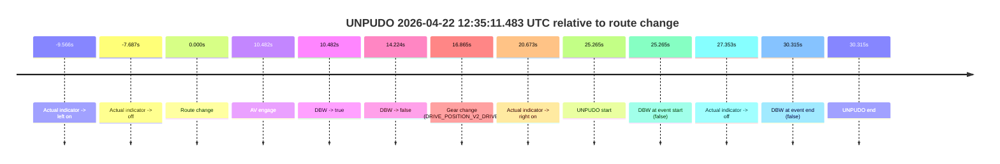
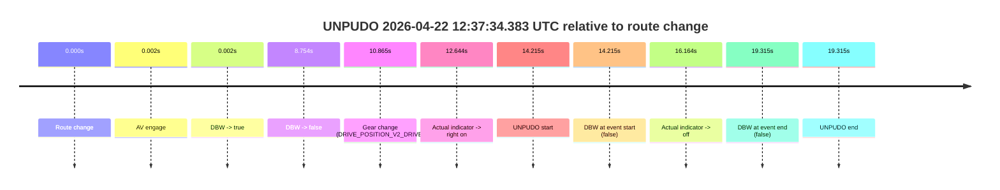
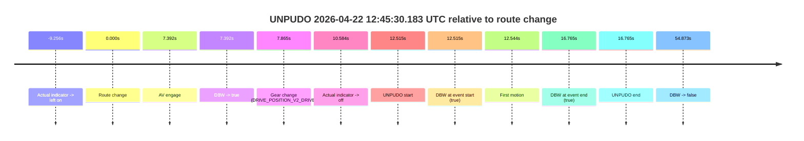
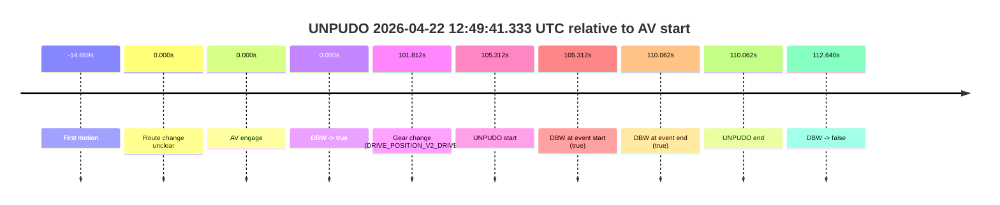
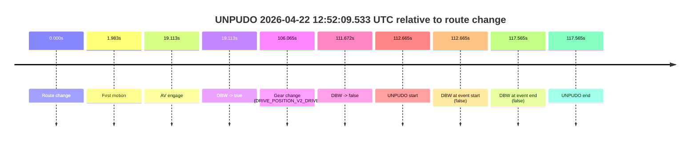
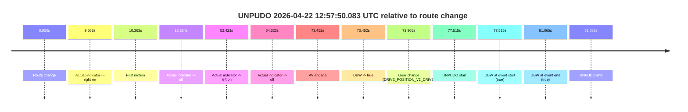

# Run Report: fme20002/2026-04-22--12-20-12--gen2-av-897668a7-ec43-42aa-ae06-d72a68999bf8

| Field | Value |
|---|---|
| Run ID | `fme20002/2026-04-22--12-20-12--gen2-av-897668a7-ec43-42aa-ae06-d72a68999bf8` |
| Date | `2026-04-22` |
| Model(s) | `eel-teal-outspoken` |
| Author | `zak` |
| Event count | `7` |

## unpudo 2026-04-22 12:35:11.483 UTC

| Field | Value |
|---|---|
| Model | `eel-teal-outspoken` |
| Author | `zak` |
| Run ID | `fme20002/2026-04-22--12-20-12--gen2-av-897668a7-ec43-42aa-ae06-d72a68999bf8` |
| Date | `2026-04-22` |
| Time (UTC) | `12:35:11.483` |
| Event type | `unpudo` |
| Disengagement type | `none observed` |
| Route change | `found` |
| Console | [run](https://console.sso.wayve.ai/run/fme20002/2026-04-22--12-20-12--gen2-av-897668a7-ec43-42aa-ae06-d72a68999bf8?id=&time-unixus=1776861311483308) |
| Foxglove | [segment](https://app.foxglove.dev/wayve-on-prem/p/prj_0dX18KZdVHg1fmmI/view?ds=foxglove-stream&ds.deviceName=fme20002&ds.start=2026-04-22T12%3A34%3A36.218296Z&ds.end=2026-04-22T12%3A35%3A26.533293Z&layoutId=lay_0e7VD4WIKDQGU73Y&time=2026-04-22T12%3A35%3A11.483308Z) |

### Event card: fail

- Fail: the credited unpudo does not stay AV-owned. The event window starts with DBW false, and the maneuver outcome lands outside a clean AV-owned segment.

| Event | Time (UTC) | Delta from route change |
|---|---:|---:|
| Actual indicator -> left on | 2026-04-22 12:34:36.651 | `-9.566s` |
| Actual indicator -> off | 2026-04-22 12:34:38.531 | `-7.687s` |
| Route change | 2026-04-22 12:34:46.218 | `0.000s` |
| AV engage | 2026-04-22 12:34:56.700 | `10.482s` |
| DBW -> true | 2026-04-22 12:34:56.700 | `10.482s` |
| DBW -> false | 2026-04-22 12:35:00.442 | `14.224s` |
| Gear change (DRIVE_POSITION_V2_DRIVE) | 2026-04-22 12:35:03.083 | `16.865s` |
| Actual indicator -> right on | 2026-04-22 12:35:06.891 | `20.673s` |
| UNPUDO start | 2026-04-22 12:35:11.483 | `25.265s` |
| DBW at event start (false) | 2026-04-22 12:35:11.483 | `25.265s` |
| Actual indicator -> off | 2026-04-22 12:35:13.571 | `27.353s` |
| DBW at event end (false) | 2026-04-22 12:35:16.533 | `30.315s` |
| UNPUDO end | 2026-04-22 12:35:16.533 | `30.315s` |

| Metric | Value |
|---|---|
| Outcome | `fail` |
| Effective failure type | `not_av_owned` |
| Route change status | `found` |
| DBW at event start | `false` |
| DBW at event end | `false` |
| Predicted gear at AV start | `DRIVE_POSITION_V2_DRIVE` |
| Actual gear at AV start | `DRIVE_POSITION_V2_PARK` |
| Predicted gear at event start | `DRIVE_POSITION_V2_DRIVE` |
| Actual gear at event start | `DRIVE_POSITION_V2_DRIVE` |
| Planned indicator direction | `INDICATORS_STATE_V2_RIGHT_ON` |
| Controller indicator direction | `INDICATORS_STATE_V2_RIGHT_ON` |
| Actual indicator direction | `INDICATORS_STATE_V2_RIGHT_ON` |
| Actual indicator at maneuver end | `INDICATORS_STATE_V2_OFF` |
| Driver accel help in AV | `false` |
| Driver accel help timestamp | `n/a` |
| Max accel pedal pct in AV | `0.0%` |
| Max brake pedal pct in AV | `8.0%` |
| Max speed mps in AV | `0.000` |
| Success timing baseline | `route change` |
| Route -> AV | `10.482s` |
| AV -> event start | `14.783s` |
| AV -> first motion | `n/a` |
| Success baseline -> event start | `25.265s` |
| Success baseline -> first motion | `n/a` |
| AV duration before disengagement | `3.742s` |
| Trajectory waypoint count | `37` |
| Driving-plan step count | `11` |

The scored portion starts from the AV-owned window, not from the pre-AV setup. Route-change search in the stopped pre-event segment was `found`, with the baseline therefore set to route change. At the event anchor the model predicts `DRIVE_POSITION_V2_DRIVE` and the actual gear is `DRIVE_POSITION_V2_DRIVE`. The effective model outcome is `fail` because `not_av_owned.`

### Resolution

| Field | Value |
|---|---|
| Final outcome | `fail` |
| Do we agree with this label? | `yes` |
| Source disengagement type | `none observed` |
| Resolved effective failure type | `not_av_owned` |
| Confidence | `high` |

## unpudo 2026-04-22 12:37:34.383 UTC

| Field | Value |
|---|---|
| Model | `eel-teal-outspoken` |
| Author | `zak` |
| Run ID | `fme20002/2026-04-22--12-20-12--gen2-av-897668a7-ec43-42aa-ae06-d72a68999bf8` |
| Date | `2026-04-22` |
| Time (UTC) | `12:37:34.383` |
| Event type | `unpudo` |
| Disengagement type | `none observed` |
| Route change | `found` |
| Console | [run](https://console.sso.wayve.ai/run/fme20002/2026-04-22--12-20-12--gen2-av-897668a7-ec43-42aa-ae06-d72a68999bf8?id=&time-unixus=1776861454383299) |
| Foxglove | [segment](https://app.foxglove.dev/wayve-on-prem/p/prj_0dX18KZdVHg1fmmI/view?ds=foxglove-stream&ds.deviceName=fme20002&ds.start=2026-04-22T12%3A37%3A10.168265Z&ds.end=2026-04-22T12%3A37%3A49.483311Z&layoutId=lay_0e7VD4WIKDQGU73Y&time=2026-04-22T12%3A37%3A34.383299Z) |

### Event card: fail

- Fail: the credited unpudo does not stay AV-owned. The event window starts with DBW false, and the maneuver outcome lands outside a clean AV-owned segment.

| Event | Time (UTC) | Delta from route change |
|---|---:|---:|
| Route change | 2026-04-22 12:37:20.168 | `0.000s` |
| AV engage | 2026-04-22 12:37:20.170 | `0.002s` |
| DBW -> true | 2026-04-22 12:37:20.170 | `0.002s` |
| DBW -> false | 2026-04-22 12:37:28.921 | `8.754s` |
| Gear change (DRIVE_POSITION_V2_DRIVE) | 2026-04-22 12:37:31.033 | `10.865s` |
| Actual indicator -> right on | 2026-04-22 12:37:32.811 | `12.644s` |
| UNPUDO start | 2026-04-22 12:37:34.383 | `14.215s` |
| DBW at event start (false) | 2026-04-22 12:37:34.383 | `14.215s` |
| Actual indicator -> off | 2026-04-22 12:37:36.331 | `16.164s` |
| DBW at event end (false) | 2026-04-22 12:37:39.483 | `19.315s` |
| UNPUDO end | 2026-04-22 12:37:39.483 | `19.315s` |

| Metric | Value |
|---|---|
| Outcome | `fail` |
| Effective failure type | `not_av_owned` |
| Route change status | `found` |
| DBW at event start | `false` |
| DBW at event end | `false` |
| Predicted gear at AV start | `DRIVE_POSITION_V2_PARK` |
| Actual gear at AV start | `DRIVE_POSITION_V2_PARK` |
| Predicted gear at event start | `DRIVE_POSITION_V2_DRIVE` |
| Actual gear at event start | `DRIVE_POSITION_V2_DRIVE` |
| Planned indicator direction | `INDICATORS_STATE_V2_RIGHT_ON` |
| Controller indicator direction | `INDICATORS_STATE_V2_RIGHT_ON` |
| Actual indicator direction | `INDICATORS_STATE_V2_RIGHT_ON` |
| Actual indicator at maneuver end | `INDICATORS_STATE_V2_OFF` |
| Driver accel help in AV | `false` |
| Driver accel help timestamp | `n/a` |
| Max accel pedal pct in AV | `0.0%` |
| Max brake pedal pct in AV | `8.0%` |
| Max speed mps in AV | `0.000` |
| Success timing baseline | `route change` |
| Route -> AV | `0.002s` |
| AV -> event start | `14.213s` |
| AV -> first motion | `n/a` |
| Success baseline -> event start | `14.215s` |
| Success baseline -> first motion | `n/a` |
| AV duration before disengagement | `8.751s` |
| Trajectory waypoint count | `37` |
| Driving-plan step count | `11` |

The scored portion starts from the AV-owned window, not from the pre-AV setup. Route-change search in the stopped pre-event segment was `found`, with the baseline therefore set to route change. At the event anchor the model predicts `DRIVE_POSITION_V2_DRIVE` and the actual gear is `DRIVE_POSITION_V2_DRIVE`. The effective model outcome is `fail` because `not_av_owned.`

### Resolution

| Field | Value |
|---|---|
| Final outcome | `fail` |
| Do we agree with this label? | `yes` |
| Source disengagement type | `none observed` |
| Resolved effective failure type | `not_av_owned` |
| Confidence | `high` |

## unpudo 2026-04-22 12:39:21.783 UTC

| Field | Value |
|---|---|
| Model | `eel-teal-outspoken` |
| Author | `zak` |
| Run ID | `fme20002/2026-04-22--12-20-12--gen2-av-897668a7-ec43-42aa-ae06-d72a68999bf8` |
| Date | `2026-04-22` |
| Time (UTC) | `12:39:21.783` |
| Event type | `unpudo` |
| Disengagement type | `none observed` |
| Route change | `found` |
| Console | [run](https://console.sso.wayve.ai/run/fme20002/2026-04-22--12-20-12--gen2-av-897668a7-ec43-42aa-ae06-d72a68999bf8?id=&time-unixus=1776861561783303) |
| Foxglove | [segment](https://app.foxglove.dev/wayve-on-prem/p/prj_0dX18KZdVHg1fmmI/view?ds=foxglove-stream&ds.deviceName=fme20002&ds.start=2026-04-22T12%3A38%3A55.618274Z&ds.end=2026-04-22T12%3A44%3A29.240350Z&layoutId=lay_0e7VD4WIKDQGU73Y&time=2026-04-22T12%3A39%3A21.783303Z) |

### Event card: pass

- Pass: AV owns the credited unpudo from route change through the official unpudo window, the gear state is aligned at the anchor, and the vehicle moves without driver accelerator help in AV.

| Event | Time (UTC) | Delta from route change |
|---|---:|---:|
| Route change | 2026-04-22 12:39:05.618 | `0.000s` |
| AV engage | 2026-04-22 12:39:17.700 | `12.082s` |
| DBW -> true | 2026-04-22 12:39:17.700 | `12.082s` |
| Gear change (DRIVE_POSITION_V2_DRIVE) | 2026-04-22 12:39:18.233 | `12.615s` |
| UNPUDO start | 2026-04-22 12:39:21.783 | `16.165s` |
| DBW at event start (true) | 2026-04-22 12:39:21.783 | `16.165s` |
| First motion | 2026-04-22 12:39:21.831 | `16.214s` |
| DBW at event end (true) | 2026-04-22 12:39:25.233 | `19.615s` |
| UNPUDO end | 2026-04-22 12:39:25.233 | `19.615s` |
| DBW -> false | 2026-04-22 12:44:19.240 | `313.622s` |
| Actual indicator -> right on | 2026-04-22 12:44:20.551 | `314.934s` |
| Actual indicator -> off | 2026-04-22 12:44:22.631 | `317.014s` |
| Actual indicator -> right on | 2026-04-22 12:44:27.271 | `321.653s` |
| Actual indicator -> off | 2026-04-22 12:44:30.351 | `324.733s` |

| Metric | Value |
|---|---|
| Outcome | `pass` |
| Effective failure type | `none` |
| Route change status | `found` |
| DBW at event start | `true` |
| DBW at event end | `true` |
| Predicted gear at AV start | `DRIVE_POSITION_V2_DRIVE` |
| Actual gear at AV start | `DRIVE_POSITION_V2_PARK` |
| Predicted gear at event start | `DRIVE_POSITION_V2_DRIVE` |
| Actual gear at event start | `DRIVE_POSITION_V2_DRIVE` |
| Planned indicator direction | `INDICATORS_STATE_V2_RIGHT_ON` |
| Controller indicator direction | `INDICATORS_STATE_V2_RIGHT_ON` |
| Actual indicator direction | `INDICATORS_STATE_V2_OFF` |
| Actual indicator at maneuver end | `INDICATORS_STATE_V2_OFF` |
| Driver accel help in AV | `false` |
| Driver accel help timestamp | `n/a` |
| Max accel pedal pct in AV | `0.0%` |
| Max brake pedal pct in AV | `8.0%` |
| Max speed mps in AV | `5.192` |
| Success timing baseline | `route change` |
| Route -> AV | `12.082s` |
| AV -> event start | `4.083s` |
| AV -> first motion | `4.131s` |
| Success baseline -> event start | `16.165s` |
| Success baseline -> first motion | `16.214s` |
| AV duration before disengagement | `301.540s` |
| Trajectory waypoint count | `37` |
| Driving-plan step count | `11` |

The scored portion starts from the AV-owned window, not from the pre-AV setup. Route-change search in the stopped pre-event segment was `found`, with the baseline therefore set to route change. At the event anchor the model predicts `DRIVE_POSITION_V2_DRIVE` and the actual gear is `DRIVE_POSITION_V2_DRIVE`. The effective model outcome is `pass` because `the credited unpudo stays AV-owned through the official unpudo window.`

### Resolution

| Field | Value |
|---|---|
| Final outcome | `pass` |
| Do we agree with this label? | `yes` |
| Source disengagement type | `none observed` |
| Resolved effective failure type | `none` |
| Confidence | `high` |

## unpudo 2026-04-22 12:45:30.183 UTC

| Field | Value |
|---|---|
| Model | `eel-teal-outspoken` |
| Author | `zak` |
| Run ID | `fme20002/2026-04-22--12-20-12--gen2-av-897668a7-ec43-42aa-ae06-d72a68999bf8` |
| Date | `2026-04-22` |
| Time (UTC) | `12:45:30.183` |
| Event type | `unpudo` |
| Disengagement type | `none observed` |
| Route change | `found` |
| Console | [run](https://console.sso.wayve.ai/run/fme20002/2026-04-22--12-20-12--gen2-av-897668a7-ec43-42aa-ae06-d72a68999bf8?id=&time-unixus=1776861930183291) |
| Foxglove | [segment](https://app.foxglove.dev/wayve-on-prem/p/prj_0dX18KZdVHg1fmmI/view?ds=foxglove-stream&ds.deviceName=fme20002&ds.start=2026-04-22T12%3A45%3A07.668259Z&ds.end=2026-04-22T12%3A46%3A22.540830Z&layoutId=lay_0e7VD4WIKDQGU73Y&time=2026-04-22T12%3A45%3A30.183291Z) |

### Event card: pass

- Pass: AV owns the credited unpudo from route change through the official unpudo window, the gear state is aligned at the anchor, and the vehicle moves without driver accelerator help in AV.

| Event | Time (UTC) | Delta from route change |
|---|---:|---:|
| Actual indicator -> left on | 2026-04-22 12:45:08.411 | `-9.256s` |
| Route change | 2026-04-22 12:45:17.668 | `0.000s` |
| AV engage | 2026-04-22 12:45:25.060 | `7.392s` |
| DBW -> true | 2026-04-22 12:45:25.060 | `7.392s` |
| Gear change (DRIVE_POSITION_V2_DRIVE) | 2026-04-22 12:45:25.533 | `7.865s` |
| Actual indicator -> off | 2026-04-22 12:45:28.251 | `10.584s` |
| UNPUDO start | 2026-04-22 12:45:30.183 | `12.515s` |
| DBW at event start (true) | 2026-04-22 12:45:30.183 | `12.515s` |
| First motion | 2026-04-22 12:45:30.211 | `12.544s` |
| DBW at event end (true) | 2026-04-22 12:45:34.433 | `16.765s` |
| UNPUDO end | 2026-04-22 12:45:34.433 | `16.765s` |
| DBW -> false | 2026-04-22 12:46:12.540 | `54.873s` |

| Metric | Value |
|---|---|
| Outcome | `pass` |
| Effective failure type | `none` |
| Route change status | `found` |
| DBW at event start | `true` |
| DBW at event end | `true` |
| Predicted gear at AV start | `DRIVE_POSITION_V2_DRIVE` |
| Actual gear at AV start | `DRIVE_POSITION_V2_PARK` |
| Predicted gear at event start | `DRIVE_POSITION_V2_DRIVE` |
| Actual gear at event start | `DRIVE_POSITION_V2_DRIVE` |
| Planned indicator direction | `INDICATORS_STATE_V2_RIGHT_ON` |
| Controller indicator direction | `INDICATORS_STATE_V2_RIGHT_ON` |
| Actual indicator direction | `INDICATORS_STATE_V2_OFF` |
| Actual indicator at maneuver end | `INDICATORS_STATE_V2_OFF` |
| Driver accel help in AV | `false` |
| Driver accel help timestamp | `n/a` |
| Max accel pedal pct in AV | `0.0%` |
| Max brake pedal pct in AV | `8.0%` |
| Max speed mps in AV | `3.622` |
| Success timing baseline | `route change` |
| Route -> AV | `7.392s` |
| AV -> event start | `5.123s` |
| AV -> first motion | `5.151s` |
| Success baseline -> event start | `12.515s` |
| Success baseline -> first motion | `12.544s` |
| AV duration before disengagement | `47.480s` |
| Trajectory waypoint count | `37` |
| Driving-plan step count | `11` |

The scored portion starts from the AV-owned window, not from the pre-AV setup. Route-change search in the stopped pre-event segment was `found`, with the baseline therefore set to route change. At the event anchor the model predicts `DRIVE_POSITION_V2_DRIVE` and the actual gear is `DRIVE_POSITION_V2_DRIVE`. The effective model outcome is `pass` because `the credited unpudo stays AV-owned through the official unpudo window.`

### Resolution

| Field | Value |
|---|---|
| Final outcome | `pass` |
| Do we agree with this label? | `yes` |
| Source disengagement type | `none observed` |
| Resolved effective failure type | `none` |
| Confidence | `high` |

## unpudo 2026-04-22 12:49:41.333 UTC

| Field | Value |
|---|---|
| Model | `eel-teal-outspoken` |
| Author | `zak` |
| Run ID | `fme20002/2026-04-22--12-20-12--gen2-av-897668a7-ec43-42aa-ae06-d72a68999bf8` |
| Date | `2026-04-22` |
| Time (UTC) | `12:49:41.333` |
| Event type | `unpudo` |
| Disengagement type | `none observed` |
| Route change | `unclear` |
| Console | [run](https://console.sso.wayve.ai/run/fme20002/2026-04-22--12-20-12--gen2-av-897668a7-ec43-42aa-ae06-d72a68999bf8?id=&time-unixus=1776862181333297) |
| Foxglove | [segment](https://app.foxglove.dev/wayve-on-prem/p/prj_0dX18KZdVHg1fmmI/view?ds=foxglove-stream&ds.deviceName=fme20002&ds.start=2026-04-22T12%3A47%3A46.020884Z&ds.end=2026-04-22T12%3A49%3A58.661011Z&layoutId=lay_0e7VD4WIKDQGU73Y&time=2026-04-22T12%3A49%3A41.333297Z) |

### Event card: pass

- Pass: AV owns the credited unpudo from route change through the official unpudo window, the gear state is aligned at the anchor, and the vehicle moves without driver accelerator help in AV.

| Event | Time (UTC) | Delta from AV start |
|---|---:|---:|
| First motion | 2026-04-22 12:47:41.351 | `-14.669s` |
| Route change unclear | 2026-04-22 12:47:56.020 | `0.000s` |
| AV engage | 2026-04-22 12:47:56.020 | `0.000s` |
| DBW -> true | 2026-04-22 12:47:56.020 | `0.000s` |
| Gear change (DRIVE_POSITION_V2_DRIVE) | 2026-04-22 12:49:37.833 | `101.812s` |
| UNPUDO start | 2026-04-22 12:49:41.333 | `105.312s` |
| DBW at event start (true) | 2026-04-22 12:49:41.333 | `105.312s` |
| DBW at event end (true) | 2026-04-22 12:49:46.083 | `110.062s` |
| UNPUDO end | 2026-04-22 12:49:46.083 | `110.062s` |
| DBW -> false | 2026-04-22 12:49:48.661 | `112.640s` |

| Metric | Value |
|---|---|
| Outcome | `pass` |
| Effective failure type | `none` |
| Route change status | `unclear` |
| DBW at event start | `true` |
| DBW at event end | `true` |
| Predicted gear at AV start | `DRIVE_POSITION_V2_DRIVE` |
| Actual gear at AV start | `DRIVE_POSITION_V2_DRIVE` |
| Predicted gear at event start | `DRIVE_POSITION_V2_DRIVE` |
| Actual gear at event start | `DRIVE_POSITION_V2_DRIVE` |
| Planned indicator direction | `INDICATORS_STATE_V2_RIGHT_ON` |
| Controller indicator direction | `INDICATORS_STATE_V2_RIGHT_ON` |
| Actual indicator direction | `INDICATORS_STATE_V2_OFF` |
| Actual indicator at maneuver end | `INDICATORS_STATE_V2_OFF` |
| Driver accel help in AV | `false` |
| Driver accel help timestamp | `n/a` |
| Max accel pedal pct in AV | `0.0%` |
| Max brake pedal pct in AV | `8.0%` |
| Max speed mps in AV | `7.394` |
| Success timing baseline | `AV start` |
| Route -> AV | `n/a` |
| AV -> event start | `105.312s` |
| AV -> first motion | `-14.669s` |
| Success baseline -> event start | `105.312s` |
| Success baseline -> first motion | `-14.669s` |
| AV duration before disengagement | `112.640s` |
| Trajectory waypoint count | `38` |
| Driving-plan step count | `11` |

The scored portion starts from the AV-owned window, not from the pre-AV setup. Route-change search in the stopped pre-event segment was `unclear`, with the baseline therefore set to AV start. At the event anchor the model predicts `DRIVE_POSITION_V2_DRIVE` and the actual gear is `DRIVE_POSITION_V2_DRIVE`. The effective model outcome is `pass` because `the credited unpudo stays AV-owned through the official unpudo window.`

### Resolution

| Field | Value |
|---|---|
| Final outcome | `pass` |
| Do we agree with this label? | `yes` |
| Source disengagement type | `none observed` |
| Resolved effective failure type | `none` |
| Confidence | `medium` |

## unpudo 2026-04-22 12:52:09.533 UTC

| Field | Value |
|---|---|
| Model | `eel-teal-outspoken` |
| Author | `zak` |
| Run ID | `fme20002/2026-04-22--12-20-12--gen2-av-897668a7-ec43-42aa-ae06-d72a68999bf8` |
| Date | `2026-04-22` |
| Time (UTC) | `12:52:09.533` |
| Event type | `unpudo` |
| Disengagement type | `none observed` |
| Route change | `found` |
| Console | [run](https://console.sso.wayve.ai/run/fme20002/2026-04-22--12-20-12--gen2-av-897668a7-ec43-42aa-ae06-d72a68999bf8?id=&time-unixus=1776862329533303) |
| Foxglove | [segment](https://app.foxglove.dev/wayve-on-prem/p/prj_0dX18KZdVHg1fmmI/view?ds=foxglove-stream&ds.deviceName=fme20002&ds.start=2026-04-22T12%3A50%3A06.868300Z&ds.end=2026-04-22T12%3A52%3A24.433308Z&layoutId=lay_0e7VD4WIKDQGU73Y&time=2026-04-22T12%3A52%3A09.533303Z) |

### Event card: fail

- Fail: the credited unpudo does not stay AV-owned. The event window starts with DBW false, and the maneuver outcome lands outside a clean AV-owned segment.

| Event | Time (UTC) | Delta from route change |
|---|---:|---:|
| Route change | 2026-04-22 12:50:16.868 | `0.000s` |
| First motion | 2026-04-22 12:50:18.851 | `1.983s` |
| AV engage | 2026-04-22 12:50:35.981 | `19.113s` |
| DBW -> true | 2026-04-22 12:50:35.981 | `19.113s` |
| Gear change (DRIVE_POSITION_V2_DRIVE) | 2026-04-22 12:52:02.933 | `106.065s` |
| DBW -> false | 2026-04-22 12:52:08.540 | `111.672s` |
| UNPUDO start | 2026-04-22 12:52:09.533 | `112.665s` |
| DBW at event start (false) | 2026-04-22 12:52:09.533 | `112.665s` |
| DBW at event end (false) | 2026-04-22 12:52:14.433 | `117.565s` |
| UNPUDO end | 2026-04-22 12:52:14.433 | `117.565s` |

| Metric | Value |
|---|---|
| Outcome | `fail` |
| Effective failure type | `completed_outside_av` |
| Route change status | `found` |
| DBW at event start | `false` |
| DBW at event end | `false` |
| Predicted gear at AV start | `DRIVE_POSITION_V2_DRIVE` |
| Actual gear at AV start | `DRIVE_POSITION_V2_DRIVE` |
| Predicted gear at event start | `DRIVE_POSITION_V2_DRIVE` |
| Actual gear at event start | `DRIVE_POSITION_V2_DRIVE` |
| Planned indicator direction | `INDICATORS_STATE_V2_OFF` |
| Controller indicator direction | `INDICATORS_STATE_V2_OFF` |
| Actual indicator direction | `INDICATORS_STATE_V2_OFF` |
| Actual indicator at maneuver end | `INDICATORS_STATE_V2_OFF` |
| Driver accel help in AV | `false` |
| Driver accel help timestamp | `n/a` |
| Max accel pedal pct in AV | `0.0%` |
| Max brake pedal pct in AV | `15.9%` |
| Max speed mps in AV | `7.169` |
| Success timing baseline | `route change` |
| Route -> AV | `19.113s` |
| AV -> event start | `93.552s` |
| AV -> first motion | `-17.129s` |
| Success baseline -> event start | `112.665s` |
| Success baseline -> first motion | `1.983s` |
| AV duration before disengagement | `92.559s` |
| Trajectory waypoint count | `38` |
| Driving-plan step count | `11` |

The scored portion starts from the AV-owned window, not from the pre-AV setup. Route-change search in the stopped pre-event segment was `found`, with the baseline therefore set to route change. At the event anchor the model predicts `DRIVE_POSITION_V2_DRIVE` and the actual gear is `DRIVE_POSITION_V2_DRIVE`. The effective model outcome is `fail` because `completed_outside_av.`

### Resolution

| Field | Value |
|---|---|
| Final outcome | `fail` |
| Do we agree with this label? | `yes` |
| Source disengagement type | `none observed` |
| Resolved effective failure type | `completed_outside_av` |
| Confidence | `high` |

## unpudo 2026-04-22 12:57:50.083 UTC

| Field | Value |
|---|---|
| Model | `eel-teal-outspoken` |
| Author | `zak` |
| Run ID | `fme20002/2026-04-22--12-20-12--gen2-av-897668a7-ec43-42aa-ae06-d72a68999bf8` |
| Date | `2026-04-22` |
| Time (UTC) | `12:57:50.083` |
| Event type | `unpudo` |
| Disengagement type | `none observed` |
| Route change | `found` |
| Console | [run](https://console.sso.wayve.ai/run/fme20002/2026-04-22--12-20-12--gen2-av-897668a7-ec43-42aa-ae06-d72a68999bf8?id=&time-unixus=1776862670083293) |
| Foxglove | [segment](https://app.foxglove.dev/wayve-on-prem/p/prj_0dX18KZdVHg1fmmI/view?ds=foxglove-stream&ds.deviceName=fme20002&ds.start=2026-04-22T12%3A56%3A22.568246Z&ds.end=2026-04-22T12%3A58%3A03.633302Z&layoutId=lay_0e7VD4WIKDQGU73Y&time=2026-04-22T12%3A57%3A50.083293Z) |

### Event card: pass

- Pass: AV owns the credited unpudo from route change through the official unpudo window, the gear state is aligned at the anchor, and the vehicle moves without driver accelerator help in AV.

| Event | Time (UTC) | Delta from route change |
|---|---:|---:|
| Route change | 2026-04-22 12:56:32.568 | `0.000s` |
| Actual indicator -> right on | 2026-04-22 12:56:42.231 | `9.663s` |
| First motion | 2026-04-22 12:56:42.931 | `10.363s` |
| Actual indicator -> off | 2026-04-22 12:56:45.851 | `13.284s` |
| Actual indicator -> left on | 2026-04-22 12:57:24.991 | `52.423s` |
| Actual indicator -> off | 2026-04-22 12:57:26.891 | `54.323s` |
| AV engage | 2026-04-22 12:57:46.020 | `73.452s` |
| DBW -> true | 2026-04-22 12:57:46.020 | `73.452s` |
| Gear change (DRIVE_POSITION_V2_DRIVE) | 2026-04-22 12:57:46.533 | `73.965s` |
| UNPUDO start | 2026-04-22 12:57:50.083 | `77.515s` |
| DBW at event start (true) | 2026-04-22 12:57:50.083 | `77.515s` |
| DBW at event end (true) | 2026-04-22 12:57:53.633 | `81.065s` |
| UNPUDO end | 2026-04-22 12:57:53.633 | `81.065s` |

| Metric | Value |
|---|---|
| Outcome | `pass` |
| Effective failure type | `none` |
| Route change status | `found` |
| DBW at event start | `true` |
| DBW at event end | `true` |
| Predicted gear at AV start | `DRIVE_POSITION_V2_DRIVE` |
| Actual gear at AV start | `DRIVE_POSITION_V2_PARK` |
| Predicted gear at event start | `DRIVE_POSITION_V2_DRIVE` |
| Actual gear at event start | `DRIVE_POSITION_V2_DRIVE` |
| Planned indicator direction | `INDICATORS_STATE_V2_RIGHT_ON` |
| Controller indicator direction | `INDICATORS_STATE_V2_RIGHT_ON` |
| Actual indicator direction | `INDICATORS_STATE_V2_OFF` |
| Actual indicator at maneuver end | `INDICATORS_STATE_V2_OFF` |
| Driver accel help in AV | `false` |
| Driver accel help timestamp | `n/a` |
| Max accel pedal pct in AV | `0.0%` |
| Max brake pedal pct in AV | `8.0%` |
| Max speed mps in AV | `4.842` |
| Success timing baseline | `route change` |
| Route -> AV | `73.452s` |
| AV -> event start | `4.063s` |
| AV -> first motion | `-63.089s` |
| Success baseline -> event start | `77.515s` |
| Success baseline -> first motion | `10.363s` |
| AV duration before disengagement | `n/a` |
| Trajectory waypoint count | `37` |
| Driving-plan step count | `11` |

The scored portion starts from the AV-owned window, not from the pre-AV setup. Route-change search in the stopped pre-event segment was `found`, with the baseline therefore set to route change. At the event anchor the model predicts `DRIVE_POSITION_V2_DRIVE` and the actual gear is `DRIVE_POSITION_V2_DRIVE`. The effective model outcome is `pass` because `the credited unpudo stays AV-owned through the official unpudo window.`

### Resolution

| Field | Value |
|---|---|
| Final outcome | `pass` |
| Do we agree with this label? | `yes` |
| Source disengagement type | `none observed` |
| Resolved effective failure type | `none` |
| Confidence | `high` |
