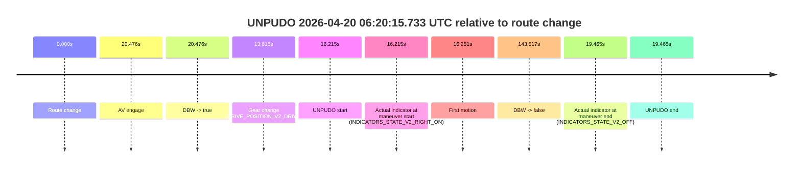
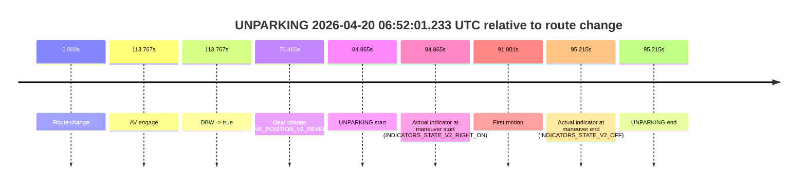

# Run Report: fme20007/2026-04-20--06-02-07--gen2-av-40706549-19a5-4a67-9666-772483920bef

| Field | Value |
|---|---|
| Run ID | `fme20007/2026-04-20--06-02-07--gen2-av-40706549-19a5-4a67-9666-772483920bef` |
| Date | `2026-04-20` |
| Model(s) | `plum-timeless-beaver` |
| Author | `peng.tang` |
| Event count | `5` |

## unpudo 2026-04-20 06:06:58.683 UTC

| Field | Value |
|---|---|
| Model | `plum-timeless-beaver` |
| Author | `peng.tang` |
| Run ID | `fme20007/2026-04-20--06-02-07--gen2-av-40706549-19a5-4a67-9666-772483920bef` |
| Date | `2026-04-20` |
| Time (UTC) | `06:06:58.683` |
| Event type | `unpudo` |
| Disengagement type | `none observed` |
| Route change | `found` |
| Console | [run](https://console.sso.wayve.ai/run/fme20007/2026-04-20--06-02-07--gen2-av-40706549-19a5-4a67-9666-772483920bef?id=&time-unixus=1776665218683299) |
| Foxglove | [segment](https://app.foxglove.dev/wayve-on-prem/p/prj_0dX18KZdVHg1fmmI/view?ds=foxglove-stream&ds.deviceName=fme20007&ds.start=2026-04-20T06%3A06%3A36.718343Z&ds.end=2026-04-20T06%3A08%3A47.013772Z&layoutId=lay_0e7VD4WIKDQGU73Y&time=2026-04-20T06%3A06%3A58.683299Z) |

### Event card: accidental

- Accidental: AV ownership is present for less than `2s`, so this is treated as an accidental brush with the maneuver rather than a meaningful model attempt.

| Event | Time (UTC) | Delta from route change |
|---|---:|---:|
| Route change | 2026-04-20 06:06:46.718 | `0.000s` |
| AV engage | 2026-04-20 06:07:08.834 | `22.117s` |
| DBW -> true | 2026-04-20 06:07:08.834 | `22.117s` |
| Gear change (DRIVE_POSITION_V2_DRIVE) | 2026-04-20 06:06:47.083 | `0.365s` |
| UNPUDO start | 2026-04-20 06:06:58.683 | `11.965s` |
| Actual indicator at maneuver start (INDICATORS_STATE_V2_OFF) | 2026-04-20 06:06:58.683 | `11.965s` |
| First motion | 2026-04-20 06:06:58.709 | `11.992s` |
| DBW -> false | 2026-04-20 06:08:37.013 | `110.295s` |
| Actual indicator at maneuver end (INDICATORS_STATE_V2_OFF) | 2026-04-20 06:07:02.133 | `15.415s` |
| UNPUDO end | 2026-04-20 06:07:02.133 | `15.415s` |

| Metric | Value |
|---|---|
| Outcome | `accidental` |
| Effective failure type | `none` |
| Route change status | `found` |
| DBW at event start | `false` |
| DBW at event end | `false` |
| Predicted gear at AV start | `DRIVE_POSITION_V2_DRIVE` |
| Actual gear at AV start | `DRIVE_POSITION_V2_DRIVE` |
| Predicted gear at event start | `DRIVE_POSITION_V2_DRIVE` |
| Actual gear at event start | `DRIVE_POSITION_V2_DRIVE` |
| Planned indicator direction | `INDICATORS_STATE_V2_RIGHT_ON` |
| Controller indicator direction | `INDICATORS_STATE_V2_RIGHT_ON` |
| Actual indicator direction | `INDICATORS_STATE_V2_OFF` |
| Actual indicator at maneuver end | `INDICATORS_STATE_V2_OFF` |
| Driver accel help in AV | `false` |
| Driver accel help timestamp | `n/a` |
| Max accel pedal pct in AV | `0.0%` |
| Max brake pedal pct in AV | `0.0%` |
| Max speed mps in AV | `0.000` |
| Route -> AV | `22.117s` |
| AV -> event start | `-10.152s` |
| AV -> first motion | `-10.125s` |
| AV duration before disengagement | `88.179s` |
| Trajectory waypoint count | `37` |
| Driving-plan step count | `11` |

The scored portion starts from the AV-owned window, not from the pre-AV setup. Route-change search in the stopped pre-event segment was `found`, with the baseline therefore set to route change. At the event anchor the model predicts `DRIVE_POSITION_V2_DRIVE` and the actual gear is `DRIVE_POSITION_V2_DRIVE`. The effective model outcome is `accidental` because `the AV-owned portion is shorter than 2s`.

### Resolution

| Field | Value |
|---|---|
| Final outcome | `accidental` |
| Do we agree with this label? | `yes` |
| Source disengagement type | `none observed` |
| Resolved effective failure type | `none` |
| Confidence | `high` |

## unpudo 2026-04-20 06:15:02.533 UTC

| Field | Value |
|---|---|
| Model | `plum-timeless-beaver` |
| Author | `peng.tang` |
| Run ID | `fme20007/2026-04-20--06-02-07--gen2-av-40706549-19a5-4a67-9666-772483920bef` |
| Date | `2026-04-20` |
| Time (UTC) | `06:15:02.533` |
| Event type | `unpudo` |
| Disengagement type | `none observed` |
| Route change | `found` |
| Console | [run](https://console.sso.wayve.ai/run/fme20007/2026-04-20--06-02-07--gen2-av-40706549-19a5-4a67-9666-772483920bef?id=&time-unixus=1776665702533313) |
| Foxglove | [segment](https://app.foxglove.dev/wayve-on-prem/p/prj_0dX18KZdVHg1fmmI/view?ds=foxglove-stream&ds.deviceName=fme20007&ds.start=2026-04-20T06%3A13%3A00.468299Z&ds.end=2026-04-20T06%3A16%3A30.874957Z&layoutId=lay_0e7VD4WIKDQGU73Y&time=2026-04-20T06%3A15%3A02.533313Z) |

### Event card: accidental

- Accidental: AV ownership is present for less than `2s`, so this is treated as an accidental brush with the maneuver rather than a meaningful model attempt.

| Event | Time (UTC) | Delta from route change |
|---|---:|---:|
| Route change | 2026-04-20 06:13:10.468 | `0.000s` |
| AV engage | 2026-04-20 06:15:10.355 | `119.887s` |
| DBW -> true | 2026-04-20 06:15:10.355 | `119.887s` |
| Gear change (DRIVE_POSITION_V2_DRIVE) | 2026-04-20 06:14:53.383 | `102.915s` |
| UNPUDO start | 2026-04-20 06:15:02.533 | `112.065s` |
| Actual indicator at maneuver start (INDICATORS_STATE_V2_RIGHT_ON) | 2026-04-20 06:15:02.533 | `112.065s` |
| First motion | 2026-04-20 06:15:02.629 | `112.161s` |
| DBW -> false | 2026-04-20 06:16:20.874 | `190.407s` |
| Actual indicator at maneuver end (INDICATORS_STATE_V2_OFF) | 2026-04-20 06:15:08.183 | `117.715s` |
| UNPUDO end | 2026-04-20 06:15:08.183 | `117.715s` |

| Metric | Value |
|---|---|
| Outcome | `accidental` |
| Effective failure type | `none` |
| Route change status | `found` |
| DBW at event start | `false` |
| DBW at event end | `false` |
| Predicted gear at AV start | `DRIVE_POSITION_V2_DRIVE` |
| Actual gear at AV start | `DRIVE_POSITION_V2_DRIVE` |
| Predicted gear at event start | `DRIVE_POSITION_V2_DRIVE` |
| Actual gear at event start | `DRIVE_POSITION_V2_DRIVE` |
| Planned indicator direction | `INDICATORS_STATE_V2_RIGHT_ON` |
| Controller indicator direction | `INDICATORS_STATE_V2_RIGHT_ON` |
| Actual indicator direction | `INDICATORS_STATE_V2_RIGHT_ON` |
| Actual indicator at maneuver end | `INDICATORS_STATE_V2_OFF` |
| Driver accel help in AV | `false` |
| Driver accel help timestamp | `n/a` |
| Max accel pedal pct in AV | `0.0%` |
| Max brake pedal pct in AV | `0.0%` |
| Max speed mps in AV | `0.000` |
| Route -> AV | `119.887s` |
| AV -> event start | `-7.822s` |
| AV -> first motion | `-7.726s` |
| AV duration before disengagement | `70.520s` |
| Trajectory waypoint count | `36` |
| Driving-plan step count | `11` |

The scored portion starts from the AV-owned window, not from the pre-AV setup. Route-change search in the stopped pre-event segment was `found`, with the baseline therefore set to route change. At the event anchor the model predicts `DRIVE_POSITION_V2_DRIVE` and the actual gear is `DRIVE_POSITION_V2_DRIVE`. The effective model outcome is `accidental` because `the AV-owned portion is shorter than 2s`.

### Resolution

| Field | Value |
|---|---|
| Final outcome | `accidental` |
| Do we agree with this label? | `yes` |
| Source disengagement type | `none observed` |
| Resolved effective failure type | `none` |
| Confidence | `high` |

## unpudo 2026-04-20 06:16:21.483 UTC

| Field | Value |
|---|---|
| Model | `plum-timeless-beaver` |
| Author | `peng.tang` |
| Run ID | `fme20007/2026-04-20--06-02-07--gen2-av-40706549-19a5-4a67-9666-772483920bef` |
| Date | `2026-04-20` |
| Time (UTC) | `06:16:21.483` |
| Event type | `unpudo` |
| Disengagement type | `none observed` |
| Route change | `found` |
| Console | [run](https://console.sso.wayve.ai/run/fme20007/2026-04-20--06-02-07--gen2-av-40706549-19a5-4a67-9666-772483920bef?id=&time-unixus=1776665781483303) |
| Foxglove | [segment](https://app.foxglove.dev/wayve-on-prem/p/prj_0dX18KZdVHg1fmmI/view?ds=foxglove-stream&ds.deviceName=fme20007&ds.start=2026-04-20T06%3A14%3A42.968244Z&ds.end=2026-04-20T06%3A17%3A08.133754Z&layoutId=lay_0e7VD4WIKDQGU73Y&time=2026-04-20T06%3A16%3A21.483303Z) |

### Event card: accidental

- Accidental: AV ownership is present for less than `2s`, so this is treated as an accidental brush with the maneuver rather than a meaningful model attempt.

| Event | Time (UTC) | Delta from route change |
|---|---:|---:|
| Route change | 2026-04-20 06:14:52.968 | `0.000s` |
| AV engage | 2026-04-20 06:16:30.453 | `97.486s` |
| DBW -> true | 2026-04-20 06:16:30.453 | `97.486s` |
| Gear change (DRIVE_POSITION_V2_DRIVE) | 2026-04-20 06:16:10.183 | `77.215s` |
| UNPUDO start | 2026-04-20 06:16:21.483 | `88.515s` |
| Actual indicator at maneuver start (INDICATORS_STATE_V2_LEFT_ON) | 2026-04-20 06:16:21.483 | `88.515s` |
| First motion | 2026-04-20 06:16:21.509 | `88.541s` |
| DBW -> false | 2026-04-20 06:16:58.133 | `125.166s` |
| Actual indicator at maneuver end (INDICATORS_STATE_V2_OFF) | 2026-04-20 06:16:27.483 | `94.515s` |
| UNPUDO end | 2026-04-20 06:16:27.483 | `94.515s` |

| Metric | Value |
|---|---|
| Outcome | `accidental` |
| Effective failure type | `none` |
| Route change status | `found` |
| DBW at event start | `false` |
| DBW at event end | `false` |
| Predicted gear at AV start | `DRIVE_POSITION_V2_DRIVE` |
| Actual gear at AV start | `DRIVE_POSITION_V2_DRIVE` |
| Predicted gear at event start | `DRIVE_POSITION_V2_DRIVE` |
| Actual gear at event start | `DRIVE_POSITION_V2_DRIVE` |
| Planned indicator direction | `INDICATORS_STATE_V2_LEFT_ON` |
| Controller indicator direction | `INDICATORS_STATE_V2_LEFT_ON` |
| Actual indicator direction | `INDICATORS_STATE_V2_LEFT_ON` |
| Actual indicator at maneuver end | `INDICATORS_STATE_V2_OFF` |
| Driver accel help in AV | `false` |
| Driver accel help timestamp | `n/a` |
| Max accel pedal pct in AV | `0.0%` |
| Max brake pedal pct in AV | `0.0%` |
| Max speed mps in AV | `0.000` |
| Route -> AV | `97.486s` |
| AV -> event start | `-8.970s` |
| AV -> first motion | `-8.945s` |
| AV duration before disengagement | `27.680s` |
| Trajectory waypoint count | `37` |
| Driving-plan step count | `11` |

The scored portion starts from the AV-owned window, not from the pre-AV setup. Route-change search in the stopped pre-event segment was `found`, with the baseline therefore set to route change. At the event anchor the model predicts `DRIVE_POSITION_V2_DRIVE` and the actual gear is `DRIVE_POSITION_V2_DRIVE`. The effective model outcome is `accidental` because `the AV-owned portion is shorter than 2s`.

### Resolution

| Field | Value |
|---|---|
| Final outcome | `accidental` |
| Do we agree with this label? | `yes` |
| Source disengagement type | `none observed` |
| Resolved effective failure type | `none` |
| Confidence | `high` |

## unpudo 2026-04-20 06:20:15.733 UTC

| Field | Value |
|---|---|
| Model | `plum-timeless-beaver` |
| Author | `peng.tang` |
| Run ID | `fme20007/2026-04-20--06-02-07--gen2-av-40706549-19a5-4a67-9666-772483920bef` |
| Date | `2026-04-20` |
| Time (UTC) | `06:20:15.733` |
| Event type | `unpudo` |
| Disengagement type | `none observed` |
| Route change | `found` |
| Console | [run](https://console.sso.wayve.ai/run/fme20007/2026-04-20--06-02-07--gen2-av-40706549-19a5-4a67-9666-772483920bef?id=&time-unixus=1776666015733303) |
| Foxglove | [segment](https://app.foxglove.dev/wayve-on-prem/p/prj_0dX18KZdVHg1fmmI/view?ds=foxglove-stream&ds.deviceName=fme20007&ds.start=2026-04-20T06%3A19%3A49.518254Z&ds.end=2026-04-20T06%3A22%3A33.035036Z&layoutId=lay_0e7VD4WIKDQGU73Y&time=2026-04-20T06%3A20%3A15.733303Z) |

### Event card: accidental

- Accidental: AV ownership is present for less than `2s`, so this is treated as an accidental brush with the maneuver rather than a meaningful model attempt.

| Event | Time (UTC) | Delta from route change |
|---|---:|---:|
| Route change | 2026-04-20 06:19:59.518 | `0.000s` |
| AV engage | 2026-04-20 06:20:19.994 | `20.476s` |
| DBW -> true | 2026-04-20 06:20:19.994 | `20.476s` |
| Gear change (DRIVE_POSITION_V2_DRIVE) | 2026-04-20 06:20:13.333 | `13.815s` |
| UNPUDO start | 2026-04-20 06:20:15.733 | `16.215s` |
| Actual indicator at maneuver start (INDICATORS_STATE_V2_RIGHT_ON) | 2026-04-20 06:20:15.733 | `16.215s` |
| First motion | 2026-04-20 06:20:15.769 | `16.251s` |
| DBW -> false | 2026-04-20 06:22:23.035 | `143.517s` |
| Actual indicator at maneuver end (INDICATORS_STATE_V2_OFF) | 2026-04-20 06:20:18.983 | `19.465s` |
| UNPUDO end | 2026-04-20 06:20:18.983 | `19.465s` |

| Metric | Value |
|---|---|
| Outcome | `accidental` |
| Effective failure type | `none` |
| Route change status | `found` |
| DBW at event start | `false` |
| DBW at event end | `false` |
| Predicted gear at AV start | `DRIVE_POSITION_V2_DRIVE` |
| Actual gear at AV start | `DRIVE_POSITION_V2_DRIVE` |
| Predicted gear at event start | `DRIVE_POSITION_V2_DRIVE` |
| Actual gear at event start | `DRIVE_POSITION_V2_DRIVE` |
| Planned indicator direction | `INDICATORS_STATE_V2_OFF` |
| Controller indicator direction | `INDICATORS_STATE_V2_OFF` |
| Actual indicator direction | `INDICATORS_STATE_V2_RIGHT_ON` |
| Actual indicator at maneuver end | `INDICATORS_STATE_V2_OFF` |
| Driver accel help in AV | `false` |
| Driver accel help timestamp | `n/a` |
| Max accel pedal pct in AV | `0.0%` |
| Max brake pedal pct in AV | `0.0%` |
| Max speed mps in AV | `0.000` |
| Route -> AV | `20.476s` |
| AV -> event start | `-4.261s` |
| AV -> first motion | `-4.225s` |
| AV duration before disengagement | `123.041s` |
| Trajectory waypoint count | `36` |
| Driving-plan step count | `11` |

The scored portion starts from the AV-owned window, not from the pre-AV setup. Route-change search in the stopped pre-event segment was `found`, with the baseline therefore set to route change. At the event anchor the model predicts `DRIVE_POSITION_V2_DRIVE` and the actual gear is `DRIVE_POSITION_V2_DRIVE`. The effective model outcome is `accidental` because `the AV-owned portion is shorter than 2s`.

### Resolution

| Field | Value |
|---|---|
| Final outcome | `accidental` |
| Do we agree with this label? | `yes` |
| Source disengagement type | `none observed` |
| Resolved effective failure type | `none` |
| Confidence | `high` |

## unparking 2026-04-20 06:52:01.233 UTC

| Field | Value |
|---|---|
| Model | `plum-timeless-beaver` |
| Author | `peng.tang` |
| Run ID | `fme20007/2026-04-20--06-02-07--gen2-av-40706549-19a5-4a67-9666-772483920bef` |
| Date | `2026-04-20` |
| Time (UTC) | `06:52:01.233` |
| Event type | `unparking` |
| Disengagement type | `none observed` |
| Route change | `found` |
| Console | [run](https://console.sso.wayve.ai/run/fme20007/2026-04-20--06-02-07--gen2-av-40706549-19a5-4a67-9666-772483920bef?id=&time-unixus=1776667921233292) |
| Foxglove | [segment](https://app.foxglove.dev/wayve-on-prem/p/prj_0dX18KZdVHg1fmmI/view?ds=foxglove-stream&ds.deviceName=fme20007&ds.start=2026-04-20T06%3A50%3A26.368307Z&ds.end=2026-04-20T06%3A52%3A21.583296Z&layoutId=lay_0e7VD4WIKDQGU73Y&time=2026-04-20T06%3A52%3A01.233292Z) |

### Event card: accidental

- Accidental: AV ownership is present for less than `2s`, so this is treated as an accidental brush with the maneuver rather than a meaningful model attempt.

| Event | Time (UTC) | Delta from route change |
|---|---:|---:|
| Route change | 2026-04-20 06:50:36.368 | `0.000s` |
| AV engage | 2026-04-20 06:52:30.134 | `113.767s` |
| DBW -> true | 2026-04-20 06:52:30.134 | `113.767s` |
| Gear change (DRIVE_POSITION_V2_REVERSE) | 2026-04-20 06:51:51.833 | `75.465s` |
| UNPARKING start | 2026-04-20 06:52:01.233 | `84.865s` |
| Actual indicator at maneuver start (INDICATORS_STATE_V2_RIGHT_ON) | 2026-04-20 06:52:01.233 | `84.865s` |
| First motion | 2026-04-20 06:52:08.169 | `91.801s` |
| Actual indicator at maneuver end (INDICATORS_STATE_V2_OFF) | 2026-04-20 06:52:11.583 | `95.215s` |
| UNPARKING end | 2026-04-20 06:52:11.583 | `95.215s` |

| Metric | Value |
|---|---|
| Outcome | `accidental` |
| Effective failure type | `none` |
| Route change status | `found` |
| DBW at event start | `false` |
| DBW at event end | `false` |
| Predicted gear at AV start | `DRIVE_POSITION_V2_DRIVE` |
| Actual gear at AV start | `DRIVE_POSITION_V2_DRIVE` |
| Predicted gear at event start | `DRIVE_POSITION_V2_REVERSE` |
| Actual gear at event start | `DRIVE_POSITION_V2_REVERSE` |
| Planned indicator direction | `INDICATORS_STATE_V2_OFF` |
| Controller indicator direction | `INDICATORS_STATE_V2_OFF` |
| Actual indicator direction | `INDICATORS_STATE_V2_RIGHT_ON` |
| Actual indicator at maneuver end | `INDICATORS_STATE_V2_OFF` |
| Driver accel help in AV | `false` |
| Driver accel help timestamp | `n/a` |
| Max accel pedal pct in AV | `0.0%` |
| Max brake pedal pct in AV | `0.0%` |
| Max speed mps in AV | `0.000` |
| Route -> AV | `113.767s` |
| AV -> event start | `-28.902s` |
| AV -> first motion | `-21.966s` |
| AV duration before disengagement | `n/a` |
| Trajectory waypoint count | `36` |
| Driving-plan step count | `11` |

The scored portion starts from the AV-owned window, not from the pre-AV setup. Route-change search in the stopped pre-event segment was `found`, with the baseline therefore set to route change. At the event anchor the model predicts `DRIVE_POSITION_V2_REVERSE` and the actual gear is `DRIVE_POSITION_V2_REVERSE`. The effective model outcome is `accidental` because `the AV-owned portion is shorter than 2s`.

### Resolution

| Field | Value |
|---|---|
| Final outcome | `accidental` |
| Do we agree with this label? | `yes` |
| Source disengagement type | `none observed` |
| Resolved effective failure type | `none` |
| Confidence | `high` |
