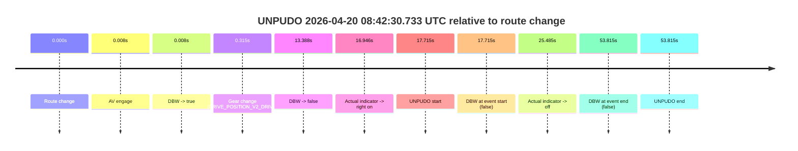
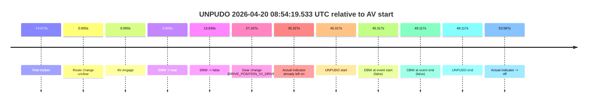
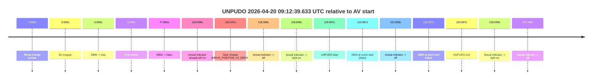
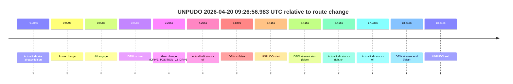
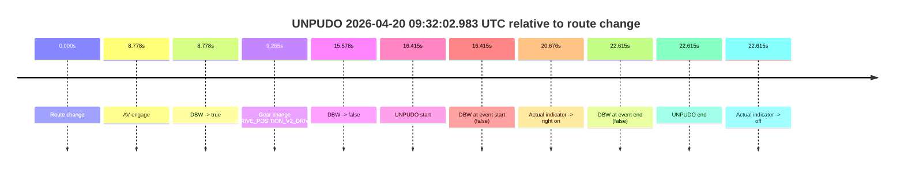
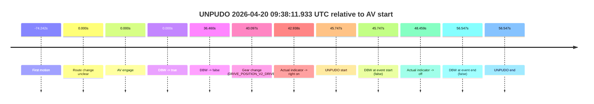
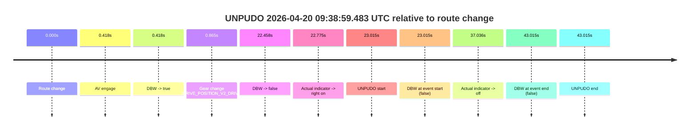

# Run Report: fme20007/2026-04-20--08-33-29--gen2-av-606e1613-95e0-41ca-aff3-36aa6590a0a1

| Field | Value |
|---|---|
| Run ID | `fme20007/2026-04-20--08-33-29--gen2-av-606e1613-95e0-41ca-aff3-36aa6590a0a1` |
| Date | `2026-04-20` |
| Model(s) | `pink-manta-ray-smooth` |
| Author | `guy.geva` |
| Event count | `8` |

## unpudo 2026-04-20 08:42:30.733 UTC

| Field | Value |
|---|---|
| Model | `pink-manta-ray-smooth` |
| Author | `guy.geva` |
| Run ID | `fme20007/2026-04-20--08-33-29--gen2-av-606e1613-95e0-41ca-aff3-36aa6590a0a1` |
| Date | `2026-04-20` |
| Time (UTC) | `08:42:30.733` |
| Event type | `unpudo` |
| Disengagement type | `none observed` |
| Route change | `found` |
| Console | [run](https://console.sso.wayve.ai/run/fme20007/2026-04-20--08-33-29--gen2-av-606e1613-95e0-41ca-aff3-36aa6590a0a1?id=&time-unixus=1776674550733293) |
| Foxglove | [segment](https://app.foxglove.dev/wayve-on-prem/p/prj_0dX18KZdVHg1fmmI/view?ds=foxglove-stream&ds.deviceName=fme20007&ds.start=2026-04-20T08%3A42%3A03.018292Z&ds.end=2026-04-20T08%3A43%3A16.833300Z&layoutId=lay_0e7VD4WIKDQGU73Y&time=2026-04-20T08%3A42%3A30.733293Z) |

### Event card: fail

- Fail: the credited unpudo does not stay AV-owned. The event window starts with DBW false, and the maneuver outcome lands outside a clean AV-owned segment.

| Event | Time (UTC) | Delta from route change |
|---|---:|---:|
| Route change | 2026-04-20 08:42:13.018 | `0.000s` |
| AV engage | 2026-04-20 08:42:13.026 | `0.008s` |
| DBW -> true | 2026-04-20 08:42:13.026 | `0.008s` |
| Gear change (DRIVE_POSITION_V2_DRIVE) | 2026-04-20 08:42:13.333 | `0.315s` |
| DBW -> false | 2026-04-20 08:42:26.406 | `13.388s` |
| Actual indicator -> right on | 2026-04-20 08:42:29.964 | `16.946s` |
| UNPUDO start | 2026-04-20 08:42:30.733 | `17.715s` |
| DBW at event start (false) | 2026-04-20 08:42:30.733 | `17.715s` |
| Actual indicator -> off | 2026-04-20 08:42:38.503 | `25.485s` |
| DBW at event end (false) | 2026-04-20 08:43:06.833 | `53.815s` |
| UNPUDO end | 2026-04-20 08:43:06.833 | `53.815s` |

| Metric | Value |
|---|---|
| Outcome | `fail` |
| Effective failure type | `not_av_owned` |
| Route change status | `found` |
| DBW at event start | `false` |
| DBW at event end | `false` |
| Predicted gear at AV start | `DRIVE_POSITION_V2_PARK` |
| Actual gear at AV start | `DRIVE_POSITION_V2_PARK` |
| Predicted gear at event start | `DRIVE_POSITION_V2_DRIVE` |
| Actual gear at event start | `DRIVE_POSITION_V2_DRIVE` |
| Planned indicator direction | `INDICATORS_STATE_V2_OFF` |
| Controller indicator direction | `INDICATORS_STATE_V2_OFF` |
| Actual indicator direction | `INDICATORS_STATE_V2_RIGHT_ON` |
| Actual indicator at maneuver end | `INDICATORS_STATE_V2_OFF` |
| Driver accel help in AV | `false` |
| Driver accel help timestamp | `n/a` |
| Max accel pedal pct in AV | `0.0%` |
| Max brake pedal pct in AV | `8.0%` |
| Max speed mps in AV | `0.000` |
| Success timing baseline | `route change` |
| Route -> AV | `0.008s` |
| AV -> event start | `17.707s` |
| AV -> first motion | `n/a` |
| Success baseline -> event start | `17.715s` |
| Success baseline -> first motion | `n/a` |
| AV duration before disengagement | `13.380s` |
| Trajectory waypoint count | `35` |
| Driving-plan step count | `11` |

The scored portion starts from the AV-owned window, not from the pre-AV setup. Route-change search in the stopped pre-event segment was `found`, with the baseline therefore set to route change. At the event anchor the model predicts `DRIVE_POSITION_V2_DRIVE` and the actual gear is `DRIVE_POSITION_V2_DRIVE`. The effective model outcome is `fail` because `not_av_owned.`

### Resolution

| Field | Value |
|---|---|
| Final outcome | `fail` |
| Do we agree with this label? | `yes` |
| Source disengagement type | `none observed` |
| Resolved effective failure type | `not_av_owned` |
| Confidence | `high` |

## unpudo 2026-04-20 08:54:19.533 UTC

| Field | Value |
|---|---|
| Model | `pink-manta-ray-smooth` |
| Author | `guy.geva` |
| Run ID | `fme20007/2026-04-20--08-33-29--gen2-av-606e1613-95e0-41ca-aff3-36aa6590a0a1` |
| Date | `2026-04-20` |
| Time (UTC) | `08:54:19.533` |
| Event type | `unpudo` |
| Disengagement type | `none observed` |
| Route change | `unclear` |
| Console | [run](https://console.sso.wayve.ai/run/fme20007/2026-04-20--08-33-29--gen2-av-606e1613-95e0-41ca-aff3-36aa6590a0a1?id=&time-unixus=1776675259533313) |
| Foxglove | [segment](https://app.foxglove.dev/wayve-on-prem/p/prj_0dX18KZdVHg1fmmI/view?ds=foxglove-stream&ds.deviceName=fme20007&ds.start=2026-04-20T08%3A53%3A24.216715Z&ds.end=2026-04-20T08%3A54%3A33.333314Z&layoutId=lay_0e7VD4WIKDQGU73Y&time=2026-04-20T08%3A54%3A19.533313Z) |

### Event card: fail

- Fail: the credited unpudo does not stay AV-owned. The event window starts with DBW false, and the maneuver outcome lands outside a clean AV-owned segment.

| Event | Time (UTC) | Delta from AV start |
|---|---:|---:|
| First motion | 2026-04-20 08:52:19.544 | `-74.672s` |
| Route change unclear | 2026-04-20 08:53:34.216 | `0.000s` |
| AV engage | 2026-04-20 08:53:34.216 | `0.000s` |
| DBW -> true | 2026-04-20 08:53:34.216 | `0.000s` |
| DBW -> false | 2026-04-20 08:53:47.846 | `13.630s` |
| Gear change (DRIVE_POSITION_V2_DRIVE) | 2026-04-20 08:54:01.383 | `27.167s` |
| Actual indicator already left on | 2026-04-20 08:54:09.543 | `35.327s` |
| UNPUDO start | 2026-04-20 08:54:19.533 | `45.317s` |
| DBW at event start (false) | 2026-04-20 08:54:19.533 | `45.317s` |
| DBW at event end (false) | 2026-04-20 08:54:23.333 | `49.117s` |
| UNPUDO end | 2026-04-20 08:54:23.333 | `49.117s` |
| Actual indicator -> off | 2026-04-20 08:54:27.804 | `53.587s` |

| Metric | Value |
|---|---|
| Outcome | `fail` |
| Effective failure type | `completed_outside_av` |
| Route change status | `unclear` |
| DBW at event start | `false` |
| DBW at event end | `false` |
| Predicted gear at AV start | `DRIVE_POSITION_V2_DRIVE` |
| Actual gear at AV start | `DRIVE_POSITION_V2_DRIVE` |
| Predicted gear at event start | `DRIVE_POSITION_V2_DRIVE` |
| Actual gear at event start | `DRIVE_POSITION_V2_DRIVE` |
| Planned indicator direction | `INDICATORS_STATE_V2_LEFT_ON` |
| Controller indicator direction | `INDICATORS_STATE_V2_LEFT_ON` |
| Actual indicator direction | `INDICATORS_STATE_V2_LEFT_ON` |
| Actual indicator at maneuver end | `INDICATORS_STATE_V2_LEFT_ON` |
| Driver accel help in AV | `false` |
| Driver accel help timestamp | `n/a` |
| Max accel pedal pct in AV | `0.0%` |
| Max brake pedal pct in AV | `8.5%` |
| Max speed mps in AV | `0.000` |
| Success timing baseline | `AV start` |
| Route -> AV | `n/a` |
| AV -> event start | `45.317s` |
| AV -> first motion | `-74.672s` |
| Success baseline -> event start | `45.317s` |
| Success baseline -> first motion | `-74.672s` |
| AV duration before disengagement | `13.630s` |
| Trajectory waypoint count | `37` |
| Driving-plan step count | `11` |

The scored portion starts from the AV-owned window, not from the pre-AV setup. Route-change search in the stopped pre-event segment was `unclear`, with the baseline therefore set to AV start. At the event anchor the model predicts `DRIVE_POSITION_V2_DRIVE` and the actual gear is `DRIVE_POSITION_V2_DRIVE`. The effective model outcome is `fail` because `completed_outside_av.`

### Resolution

| Field | Value |
|---|---|
| Final outcome | `fail` |
| Do we agree with this label? | `yes` |
| Source disengagement type | `none observed` |
| Resolved effective failure type | `completed_outside_av` |
| Confidence | `medium` |

## unpudo 2026-04-20 08:56:59.933 UTC

| Field | Value |
|---|---|
| Model | `pink-manta-ray-smooth` |
| Author | `guy.geva` |
| Run ID | `fme20007/2026-04-20--08-33-29--gen2-av-606e1613-95e0-41ca-aff3-36aa6590a0a1` |
| Date | `2026-04-20` |
| Time (UTC) | `08:56:59.933` |
| Event type | `unpudo` |
| Disengagement type | `none observed` |
| Route change | `found` |
| Console | [run](https://console.sso.wayve.ai/run/fme20007/2026-04-20--08-33-29--gen2-av-606e1613-95e0-41ca-aff3-36aa6590a0a1?id=&time-unixus=1776675419933302) |
| Foxglove | [segment](https://app.foxglove.dev/wayve-on-prem/p/prj_0dX18KZdVHg1fmmI/view?ds=foxglove-stream&ds.deviceName=fme20007&ds.start=2026-04-20T08%3A55%3A57.168278Z&ds.end=2026-04-20T09%3A02%3A00.116965Z&layoutId=lay_0e7VD4WIKDQGU73Y&time=2026-04-20T08%3A56%3A59.933302Z) |

### Event card: pass

- Pass: AV owns the credited unpudo from route change through the official unpudo window, the gear state is aligned at the anchor, and the vehicle moves without driver accelerator help in AV.

| Event | Time (UTC) | Delta from route change |
|---|---:|---:|
| Route change | 2026-04-20 08:56:07.168 | `0.000s` |
| AV engage | 2026-04-20 08:56:50.966 | `43.798s` |
| DBW -> true | 2026-04-20 08:56:50.966 | `43.798s` |
| Gear change (DRIVE_POSITION_V2_DRIVE) | 2026-04-20 08:56:51.433 | `44.265s` |
| UNPUDO start | 2026-04-20 08:56:59.933 | `52.765s` |
| DBW at event start (true) | 2026-04-20 08:56:59.933 | `52.765s` |
| First motion | 2026-04-20 08:57:00.003 | `52.835s` |
| DBW at event end (true) | 2026-04-20 08:57:04.283 | `57.115s` |
| UNPUDO end | 2026-04-20 08:57:04.283 | `57.115s` |
| DBW -> false | 2026-04-20 09:01:50.116 | `342.949s` |

| Metric | Value |
|---|---|
| Outcome | `pass` |
| Effective failure type | `none` |
| Route change status | `found` |
| DBW at event start | `true` |
| DBW at event end | `true` |
| Predicted gear at AV start | `DRIVE_POSITION_V2_DRIVE` |
| Actual gear at AV start | `DRIVE_POSITION_V2_PARK` |
| Predicted gear at event start | `DRIVE_POSITION_V2_DRIVE` |
| Actual gear at event start | `DRIVE_POSITION_V2_DRIVE` |
| Planned indicator direction | `INDICATORS_STATE_V2_RIGHT_ON` |
| Controller indicator direction | `INDICATORS_STATE_V2_RIGHT_ON` |
| Actual indicator direction | `INDICATORS_STATE_V2_OFF` |
| Actual indicator at maneuver end | `INDICATORS_STATE_V2_OFF` |
| Driver accel help in AV | `false` |
| Driver accel help timestamp | `n/a` |
| Max accel pedal pct in AV | `0.0%` |
| Max brake pedal pct in AV | `8.0%` |
| Max speed mps in AV | `4.481` |
| Success timing baseline | `route change` |
| Route -> AV | `43.798s` |
| AV -> event start | `8.967s` |
| AV -> first motion | `9.038s` |
| Success baseline -> event start | `52.765s` |
| Success baseline -> first motion | `52.835s` |
| AV duration before disengagement | `299.151s` |
| Trajectory waypoint count | `37` |
| Driving-plan step count | `11` |

The scored portion starts from the AV-owned window, not from the pre-AV setup. Route-change search in the stopped pre-event segment was `found`, with the baseline therefore set to route change. At the event anchor the model predicts `DRIVE_POSITION_V2_DRIVE` and the actual gear is `DRIVE_POSITION_V2_DRIVE`. The effective model outcome is `pass` because `the credited unpudo stays AV-owned through the official unpudo window.`

### Resolution

| Field | Value |
|---|---|
| Final outcome | `pass` |
| Do we agree with this label? | `yes` |
| Source disengagement type | `none observed` |
| Resolved effective failure type | `none` |
| Confidence | `high` |

## unpudo 2026-04-20 09:12:39.633 UTC

| Field | Value |
|---|---|
| Model | `pink-manta-ray-smooth` |
| Author | `guy.geva` |
| Run ID | `fme20007/2026-04-20--08-33-29--gen2-av-606e1613-95e0-41ca-aff3-36aa6590a0a1` |
| Date | `2026-04-20` |
| Time (UTC) | `09:12:39.633` |
| Event type | `unpudo` |
| Disengagement type | `none observed` |
| Route change | `unclear` |
| Console | [run](https://console.sso.wayve.ai/run/fme20007/2026-04-20--08-33-29--gen2-av-606e1613-95e0-41ca-aff3-36aa6590a0a1?id=&time-unixus=1776676359633295) |
| Foxglove | [segment](https://app.foxglove.dev/wayve-on-prem/p/prj_0dX18KZdVHg1fmmI/view?ds=foxglove-stream&ds.deviceName=fme20007&ds.start=2026-04-20T09%3A10%3A29.635872Z&ds.end=2026-04-20T09%3A12%3A53.233315Z&layoutId=lay_0e7VD4WIKDQGU73Y&time=2026-04-20T09%3A12%3A39.633295Z) |

### Event card: fail

- Fail: the credited unpudo does not stay AV-owned. The event window starts with DBW false, and the maneuver outcome lands outside a clean AV-owned segment.

| Event | Time (UTC) | Delta from AV start |
|---|---:|---:|
| Route change unclear | 2026-04-20 09:10:39.635 | `0.000s` |
| AV engage | 2026-04-20 09:10:39.635 | `0.000s` |
| DBW -> true | 2026-04-20 09:10:39.635 | `0.000s` |
| First motion | 2026-04-20 09:10:39.643 | `0.008s` |
| DBW -> false | 2026-04-20 09:11:57.497 | `77.862s` |
| Actual indicator already left on | 2026-04-20 09:12:29.643 | `110.008s` |
| Gear change (DRIVE_POSITION_V2_DRIVE) | 2026-04-20 09:12:34.983 | `115.347s` |
| Actual indicator -> off | 2026-04-20 09:12:37.943 | `118.308s` |
| Actual indicator -> right on | 2026-04-20 09:12:38.243 | `118.608s` |
| UNPUDO start | 2026-04-20 09:12:39.633 | `119.997s` |
| DBW at event start (false) | 2026-04-20 09:12:39.633 | `119.997s` |
| Actual indicator -> off | 2026-04-20 09:12:41.464 | `121.828s` |
| DBW at event end (false) | 2026-04-20 09:12:43.233 | `123.597s` |
| UNPUDO end | 2026-04-20 09:12:43.233 | `123.597s` |
| Actual indicator -> right on | 2026-04-20 09:12:44.684 | `125.049s` |
| Actual indicator -> off | 2026-04-20 09:12:53.983 | `134.348s` |

| Metric | Value |
|---|---|
| Outcome | `fail` |
| Effective failure type | `not_av_owned` |
| Route change status | `unclear` |
| DBW at event start | `false` |
| DBW at event end | `false` |
| Predicted gear at AV start | `DRIVE_POSITION_V2_DRIVE` |
| Actual gear at AV start | `DRIVE_POSITION_V2_DRIVE` |
| Predicted gear at event start | `DRIVE_POSITION_V2_DRIVE` |
| Actual gear at event start | `DRIVE_POSITION_V2_DRIVE` |
| Planned indicator direction | `INDICATORS_STATE_V2_RIGHT_ON` |
| Controller indicator direction | `INDICATORS_STATE_V2_RIGHT_ON` |
| Actual indicator direction | `INDICATORS_STATE_V2_RIGHT_ON` |
| Actual indicator at maneuver end | `INDICATORS_STATE_V2_OFF` |
| Driver accel help in AV | `false` |
| Driver accel help timestamp | `n/a` |
| Max accel pedal pct in AV | `0.0%` |
| Max brake pedal pct in AV | `10.7%` |
| Max speed mps in AV | `8.125` |
| Success timing baseline | `AV start` |
| Route -> AV | `n/a` |
| AV -> event start | `119.997s` |
| AV -> first motion | `0.008s` |
| Success baseline -> event start | `119.997s` |
| Success baseline -> first motion | `0.008s` |
| AV duration before disengagement | `77.862s` |
| Trajectory waypoint count | `37` |
| Driving-plan step count | `11` |

The scored portion starts from the AV-owned window, not from the pre-AV setup. Route-change search in the stopped pre-event segment was `unclear`, with the baseline therefore set to AV start. At the event anchor the model predicts `DRIVE_POSITION_V2_DRIVE` and the actual gear is `DRIVE_POSITION_V2_DRIVE`. The effective model outcome is `fail` because `not_av_owned.`

### Resolution

| Field | Value |
|---|---|
| Final outcome | `fail` |
| Do we agree with this label? | `yes` |
| Source disengagement type | `none observed` |
| Resolved effective failure type | `not_av_owned` |
| Confidence | `medium` |

## unpudo 2026-04-20 09:26:56.983 UTC

| Field | Value |
|---|---|
| Model | `pink-manta-ray-smooth` |
| Author | `guy.geva` |
| Run ID | `fme20007/2026-04-20--08-33-29--gen2-av-606e1613-95e0-41ca-aff3-36aa6590a0a1` |
| Date | `2026-04-20` |
| Time (UTC) | `09:26:56.983` |
| Event type | `unpudo` |
| Disengagement type | `none observed` |
| Route change | `found` |
| Console | [run](https://console.sso.wayve.ai/run/fme20007/2026-04-20--08-33-29--gen2-av-606e1613-95e0-41ca-aff3-36aa6590a0a1?id=&time-unixus=1776677216983305) |
| Foxglove | [segment](https://app.foxglove.dev/wayve-on-prem/p/prj_0dX18KZdVHg1fmmI/view?ds=foxglove-stream&ds.deviceName=fme20007&ds.start=2026-04-20T09%3A26%3A40.568248Z&ds.end=2026-04-20T09%3A27%3A18.983298Z&layoutId=lay_0e7VD4WIKDQGU73Y&time=2026-04-20T09%3A26%3A56.983305Z) |

### Event card: fail

- Fail: the credited unpudo does not stay AV-owned. The event window starts with DBW false, and the maneuver outcome lands outside a clean AV-owned segment.

| Event | Time (UTC) | Delta from route change |
|---|---:|---:|
| Actual indicator already left on | 2026-04-20 09:26:40.583 | `-9.984s` |
| Route change | 2026-04-20 09:26:50.568 | `0.000s` |
| AV engage | 2026-04-20 09:26:50.575 | `0.008s` |
| DBW -> true | 2026-04-20 09:26:50.575 | `0.008s` |
| Gear change (DRIVE_POSITION_V2_DRIVE) | 2026-04-20 09:26:50.833 | `0.265s` |
| Actual indicator -> off | 2026-04-20 09:26:54.823 | `4.255s` |
| DBW -> false | 2026-04-20 09:26:56.416 | `5.849s` |
| UNPUDO start | 2026-04-20 09:26:56.983 | `6.415s` |
| DBW at event start (false) | 2026-04-20 09:26:56.983 | `6.415s` |
| Actual indicator -> right on | 2026-04-20 09:26:56.983 | `6.415s` |
| Actual indicator -> off | 2026-04-20 09:27:07.604 | `17.036s` |
| DBW at event end (false) | 2026-04-20 09:27:08.983 | `18.415s` |
| UNPUDO end | 2026-04-20 09:27:08.983 | `18.415s` |

| Metric | Value |
|---|---|
| Outcome | `fail` |
| Effective failure type | `not_av_owned` |
| Route change status | `found` |
| DBW at event start | `false` |
| DBW at event end | `false` |
| Predicted gear at AV start | `DRIVE_POSITION_V2_PARK` |
| Actual gear at AV start | `DRIVE_POSITION_V2_PARK` |
| Predicted gear at event start | `DRIVE_POSITION_V2_DRIVE` |
| Actual gear at event start | `DRIVE_POSITION_V2_DRIVE` |
| Planned indicator direction | `INDICATORS_STATE_V2_LEFT_ON` |
| Controller indicator direction | `INDICATORS_STATE_V2_LEFT_ON` |
| Actual indicator direction | `INDICATORS_STATE_V2_RIGHT_ON` |
| Actual indicator at maneuver end | `INDICATORS_STATE_V2_OFF` |
| Driver accel help in AV | `false` |
| Driver accel help timestamp | `n/a` |
| Max accel pedal pct in AV | `0.0%` |
| Max brake pedal pct in AV | `11.0%` |
| Max speed mps in AV | `0.000` |
| Success timing baseline | `route change` |
| Route -> AV | `0.008s` |
| AV -> event start | `6.407s` |
| AV -> first motion | `n/a` |
| Success baseline -> event start | `6.415s` |
| Success baseline -> first motion | `n/a` |
| AV duration before disengagement | `5.841s` |
| Trajectory waypoint count | `36` |
| Driving-plan step count | `11` |

The scored portion starts from the AV-owned window, not from the pre-AV setup. Route-change search in the stopped pre-event segment was `found`, with the baseline therefore set to route change. At the event anchor the model predicts `DRIVE_POSITION_V2_DRIVE` and the actual gear is `DRIVE_POSITION_V2_DRIVE`. The effective model outcome is `fail` because `not_av_owned.`

### Resolution

| Field | Value |
|---|---|
| Final outcome | `fail` |
| Do we agree with this label? | `yes` |
| Source disengagement type | `none observed` |
| Resolved effective failure type | `not_av_owned` |
| Confidence | `high` |

## unpudo 2026-04-20 09:32:02.983 UTC

| Field | Value |
|---|---|
| Model | `pink-manta-ray-smooth` |
| Author | `guy.geva` |
| Run ID | `fme20007/2026-04-20--08-33-29--gen2-av-606e1613-95e0-41ca-aff3-36aa6590a0a1` |
| Date | `2026-04-20` |
| Time (UTC) | `09:32:02.983` |
| Event type | `unpudo` |
| Disengagement type | `none observed` |
| Route change | `found` |
| Console | [run](https://console.sso.wayve.ai/run/fme20007/2026-04-20--08-33-29--gen2-av-606e1613-95e0-41ca-aff3-36aa6590a0a1?id=&time-unixus=1776677522983320) |
| Foxglove | [segment](https://app.foxglove.dev/wayve-on-prem/p/prj_0dX18KZdVHg1fmmI/view?ds=foxglove-stream&ds.deviceName=fme20007&ds.start=2026-04-20T09%3A31%3A36.568294Z&ds.end=2026-04-20T09%3A32%3A19.183290Z&layoutId=lay_0e7VD4WIKDQGU73Y&time=2026-04-20T09%3A32%3A02.983320Z) |

### Event card: fail

- Fail: the credited unpudo does not stay AV-owned. The event window starts with DBW false, and the maneuver outcome lands outside a clean AV-owned segment.

| Event | Time (UTC) | Delta from route change |
|---|---:|---:|
| Route change | 2026-04-20 09:31:46.568 | `0.000s` |
| AV engage | 2026-04-20 09:31:55.346 | `8.778s` |
| DBW -> true | 2026-04-20 09:31:55.346 | `8.778s` |
| Gear change (DRIVE_POSITION_V2_DRIVE) | 2026-04-20 09:31:55.833 | `9.265s` |
| DBW -> false | 2026-04-20 09:32:02.146 | `15.578s` |
| UNPUDO start | 2026-04-20 09:32:02.983 | `16.415s` |
| DBW at event start (false) | 2026-04-20 09:32:02.983 | `16.415s` |
| Actual indicator -> right on | 2026-04-20 09:32:07.243 | `20.676s` |
| DBW at event end (false) | 2026-04-20 09:32:09.183 | `22.615s` |
| UNPUDO end | 2026-04-20 09:32:09.183 | `22.615s` |
| Actual indicator -> off | 2026-04-20 09:32:09.183 | `22.615s` |

| Metric | Value |
|---|---|
| Outcome | `fail` |
| Effective failure type | `not_av_owned` |
| Route change status | `found` |
| DBW at event start | `false` |
| DBW at event end | `false` |
| Predicted gear at AV start | `DRIVE_POSITION_V2_DRIVE` |
| Actual gear at AV start | `DRIVE_POSITION_V2_PARK` |
| Predicted gear at event start | `DRIVE_POSITION_V2_DRIVE` |
| Actual gear at event start | `DRIVE_POSITION_V2_DRIVE` |
| Planned indicator direction | `INDICATORS_STATE_V2_OFF` |
| Controller indicator direction | `INDICATORS_STATE_V2_OFF` |
| Actual indicator direction | `INDICATORS_STATE_V2_OFF` |
| Actual indicator at maneuver end | `INDICATORS_STATE_V2_OFF` |
| Driver accel help in AV | `false` |
| Driver accel help timestamp | `n/a` |
| Max accel pedal pct in AV | `0.0%` |
| Max brake pedal pct in AV | `9.1%` |
| Max speed mps in AV | `0.000` |
| Success timing baseline | `route change` |
| Route -> AV | `8.778s` |
| AV -> event start | `7.637s` |
| AV -> first motion | `n/a` |
| Success baseline -> event start | `16.415s` |
| Success baseline -> first motion | `n/a` |
| AV duration before disengagement | `6.800s` |
| Trajectory waypoint count | `36` |
| Driving-plan step count | `11` |

The scored portion starts from the AV-owned window, not from the pre-AV setup. Route-change search in the stopped pre-event segment was `found`, with the baseline therefore set to route change. At the event anchor the model predicts `DRIVE_POSITION_V2_DRIVE` and the actual gear is `DRIVE_POSITION_V2_DRIVE`. The effective model outcome is `fail` because `not_av_owned.`

### Resolution

| Field | Value |
|---|---|
| Final outcome | `fail` |
| Do we agree with this label? | `yes` |
| Source disengagement type | `none observed` |
| Resolved effective failure type | `not_av_owned` |
| Confidence | `high` |

## unpudo 2026-04-20 09:38:11.933 UTC

| Field | Value |
|---|---|
| Model | `pink-manta-ray-smooth` |
| Author | `guy.geva` |
| Run ID | `fme20007/2026-04-20--08-33-29--gen2-av-606e1613-95e0-41ca-aff3-36aa6590a0a1` |
| Date | `2026-04-20` |
| Time (UTC) | `09:38:11.933` |
| Event type | `unpudo` |
| Disengagement type | `none observed` |
| Route change | `unclear` |
| Console | [run](https://console.sso.wayve.ai/run/fme20007/2026-04-20--08-33-29--gen2-av-606e1613-95e0-41ca-aff3-36aa6590a0a1?id=&time-unixus=1776677891933301) |
| Foxglove | [segment](https://app.foxglove.dev/wayve-on-prem/p/prj_0dX18KZdVHg1fmmI/view?ds=foxglove-stream&ds.deviceName=fme20007&ds.start=2026-04-20T09%3A37%3A16.186015Z&ds.end=2026-04-20T09%3A38%3A32.733305Z&layoutId=lay_0e7VD4WIKDQGU73Y&time=2026-04-20T09%3A38%3A11.933301Z) |

### Event card: fail

- Fail: the credited unpudo does not stay AV-owned. The event window starts with DBW false, and the maneuver outcome lands outside a clean AV-owned segment.

| Event | Time (UTC) | Delta from AV start |
|---|---:|---:|
| First motion | 2026-04-20 09:36:11.943 | `-74.242s` |
| Route change unclear | 2026-04-20 09:37:26.186 | `0.000s` |
| AV engage | 2026-04-20 09:37:26.186 | `0.000s` |
| DBW -> true | 2026-04-20 09:37:26.186 | `0.000s` |
| DBW -> false | 2026-04-20 09:38:02.646 | `36.460s` |
| Gear change (DRIVE_POSITION_V2_DRIVE) | 2026-04-20 09:38:06.283 | `40.097s` |
| Actual indicator -> right on | 2026-04-20 09:38:09.123 | `42.938s` |
| UNPUDO start | 2026-04-20 09:38:11.933 | `45.747s` |
| DBW at event start (false) | 2026-04-20 09:38:11.933 | `45.747s` |
| Actual indicator -> off | 2026-04-20 09:38:14.644 | `48.459s` |
| DBW at event end (false) | 2026-04-20 09:38:22.733 | `56.547s` |
| UNPUDO end | 2026-04-20 09:38:22.733 | `56.547s` |

| Metric | Value |
|---|---|
| Outcome | `fail` |
| Effective failure type | `completed_outside_av` |
| Route change status | `unclear` |
| DBW at event start | `false` |
| DBW at event end | `false` |
| Predicted gear at AV start | `DRIVE_POSITION_V2_PARK` |
| Actual gear at AV start | `DRIVE_POSITION_V2_PARK` |
| Predicted gear at event start | `DRIVE_POSITION_V2_DRIVE` |
| Actual gear at event start | `DRIVE_POSITION_V2_DRIVE` |
| Planned indicator direction | `INDICATORS_STATE_V2_OFF` |
| Controller indicator direction | `INDICATORS_STATE_V2_OFF` |
| Actual indicator direction | `INDICATORS_STATE_V2_RIGHT_ON` |
| Actual indicator at maneuver end | `INDICATORS_STATE_V2_OFF` |
| Driver accel help in AV | `false` |
| Driver accel help timestamp | `n/a` |
| Max accel pedal pct in AV | `0.0%` |
| Max brake pedal pct in AV | `8.0%` |
| Max speed mps in AV | `0.000` |
| Success timing baseline | `AV start` |
| Route -> AV | `n/a` |
| AV -> event start | `45.747s` |
| AV -> first motion | `-74.242s` |
| Success baseline -> event start | `45.747s` |
| Success baseline -> first motion | `-74.242s` |
| AV duration before disengagement | `36.460s` |
| Trajectory waypoint count | `35` |
| Driving-plan step count | `11` |

The scored portion starts from the AV-owned window, not from the pre-AV setup. Route-change search in the stopped pre-event segment was `unclear`, with the baseline therefore set to AV start. At the event anchor the model predicts `DRIVE_POSITION_V2_DRIVE` and the actual gear is `DRIVE_POSITION_V2_DRIVE`. The effective model outcome is `fail` because `completed_outside_av.`

### Resolution

| Field | Value |
|---|---|
| Final outcome | `fail` |
| Do we agree with this label? | `yes` |
| Source disengagement type | `none observed` |
| Resolved effective failure type | `completed_outside_av` |
| Confidence | `medium` |

## unpudo 2026-04-20 09:38:59.483 UTC

| Field | Value |
|---|---|
| Model | `pink-manta-ray-smooth` |
| Author | `guy.geva` |
| Run ID | `fme20007/2026-04-20--08-33-29--gen2-av-606e1613-95e0-41ca-aff3-36aa6590a0a1` |
| Date | `2026-04-20` |
| Time (UTC) | `09:38:59.483` |
| Event type | `unpudo` |
| Disengagement type | `none observed` |
| Route change | `found` |
| Console | [run](https://console.sso.wayve.ai/run/fme20007/2026-04-20--08-33-29--gen2-av-606e1613-95e0-41ca-aff3-36aa6590a0a1?id=&time-unixus=1776677939483299) |
| Foxglove | [segment](https://app.foxglove.dev/wayve-on-prem/p/prj_0dX18KZdVHg1fmmI/view?ds=foxglove-stream&ds.deviceName=fme20007&ds.start=2026-04-20T09%3A38%3A26.468267Z&ds.end=2026-04-20T09%3A39%3A29.483315Z&layoutId=lay_0e7VD4WIKDQGU73Y&time=2026-04-20T09%3A38%3A59.483299Z) |

### Event card: fail

- Fail: the credited unpudo does not stay AV-owned. The event window starts with DBW false, and the maneuver outcome lands outside a clean AV-owned segment.

| Event | Time (UTC) | Delta from route change |
|---|---:|---:|
| Route change | 2026-04-20 09:38:36.468 | `0.000s` |
| AV engage | 2026-04-20 09:38:36.886 | `0.418s` |
| DBW -> true | 2026-04-20 09:38:36.886 | `0.418s` |
| Gear change (DRIVE_POSITION_V2_DRIVE) | 2026-04-20 09:38:37.333 | `0.865s` |
| DBW -> false | 2026-04-20 09:38:58.926 | `22.458s` |
| Actual indicator -> right on | 2026-04-20 09:38:59.243 | `22.775s` |
| UNPUDO start | 2026-04-20 09:38:59.483 | `23.015s` |
| DBW at event start (false) | 2026-04-20 09:38:59.483 | `23.015s` |
| Actual indicator -> off | 2026-04-20 09:39:13.504 | `37.036s` |
| DBW at event end (false) | 2026-04-20 09:39:19.483 | `43.015s` |
| UNPUDO end | 2026-04-20 09:39:19.483 | `43.015s` |

| Metric | Value |
|---|---|
| Outcome | `fail` |
| Effective failure type | `not_av_owned` |
| Route change status | `found` |
| DBW at event start | `false` |
| DBW at event end | `false` |
| Predicted gear at AV start | `DRIVE_POSITION_V2_DRIVE` |
| Actual gear at AV start | `DRIVE_POSITION_V2_PARK` |
| Predicted gear at event start | `DRIVE_POSITION_V2_DRIVE` |
| Actual gear at event start | `DRIVE_POSITION_V2_DRIVE` |
| Planned indicator direction | `INDICATORS_STATE_V2_OFF` |
| Controller indicator direction | `INDICATORS_STATE_V2_OFF` |
| Actual indicator direction | `INDICATORS_STATE_V2_RIGHT_ON` |
| Actual indicator at maneuver end | `INDICATORS_STATE_V2_OFF` |
| Driver accel help in AV | `false` |
| Driver accel help timestamp | `n/a` |
| Max accel pedal pct in AV | `0.0%` |
| Max brake pedal pct in AV | `8.0%` |
| Max speed mps in AV | `0.000` |
| Success timing baseline | `route change` |
| Route -> AV | `0.418s` |
| AV -> event start | `22.597s` |
| AV -> first motion | `n/a` |
| Success baseline -> event start | `23.015s` |
| Success baseline -> first motion | `n/a` |
| AV duration before disengagement | `22.040s` |
| Trajectory waypoint count | `36` |
| Driving-plan step count | `11` |

The scored portion starts from the AV-owned window, not from the pre-AV setup. Route-change search in the stopped pre-event segment was `found`, with the baseline therefore set to route change. At the event anchor the model predicts `DRIVE_POSITION_V2_DRIVE` and the actual gear is `DRIVE_POSITION_V2_DRIVE`. The effective model outcome is `fail` because `not_av_owned.`

### Resolution

| Field | Value |
|---|---|
| Final outcome | `fail` |
| Do we agree with this label? | `yes` |
| Source disengagement type | `none observed` |
| Resolved effective failure type | `not_av_owned` |
| Confidence | `high` |
