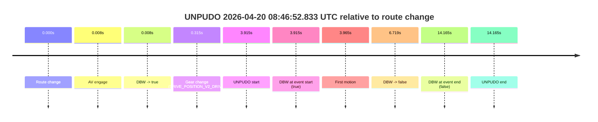
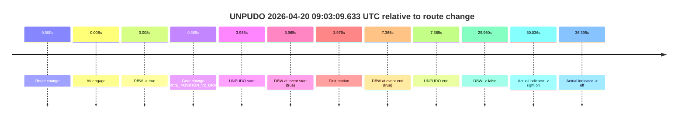
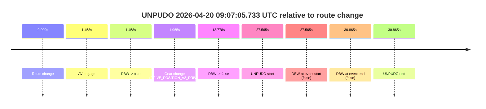
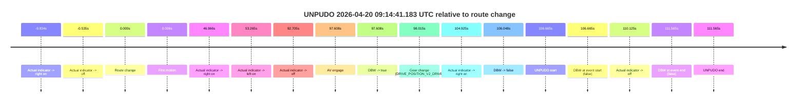
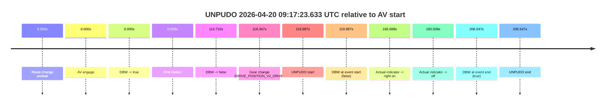
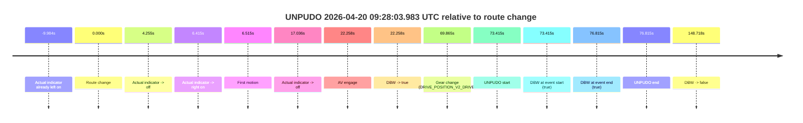
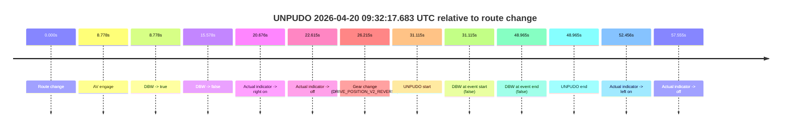
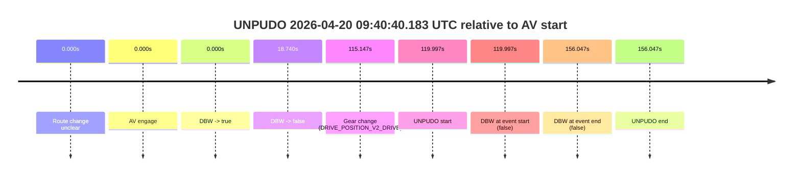

# Run Report: fme20007/2026-04-20--08-33-29--gen2-av-606e1613-95e0-41ca-aff3-36aa6590a0a1

| Field | Value |
|---|---|
| Run ID | `fme20007/2026-04-20--08-33-29--gen2-av-606e1613-95e0-41ca-aff3-36aa6590a0a1` |
| Date | `2026-04-20` |
| Model(s) | `eel-teal-outspoken` |
| Author | `zak` |
| Event count | `8` |

## unpudo 2026-04-20 08:46:52.833 UTC

| Field | Value |
|---|---|
| Model | `eel-teal-outspoken` |
| Author | `zak` |
| Run ID | `fme20007/2026-04-20--08-33-29--gen2-av-606e1613-95e0-41ca-aff3-36aa6590a0a1` |
| Date | `2026-04-20` |
| Time (UTC) | `08:46:52.833` |
| Event type | `unpudo` |
| Disengagement type | `failed_to_maintain_speed` |
| Route change | `found` |
| Console | [run](https://console.sso.wayve.ai/run/fme20007/2026-04-20--08-33-29--gen2-av-606e1613-95e0-41ca-aff3-36aa6590a0a1?id=&time-unixus=1776674812833324) |
| Foxglove | [segment](https://app.foxglove.dev/wayve-on-prem/p/prj_0dX18KZdVHg1fmmI/view?ds=foxglove-stream&ds.deviceName=fme20007&ds.start=2026-04-20T08%3A46%3A38.918412Z&ds.end=2026-04-20T08%3A47%3A13.083296Z&layoutId=lay_0e7VD4WIKDQGU73Y&time=2026-04-20T08%3A46%3A52.833324Z) |

### Event card: fail

- Fail: AV owns part of the segment, but the event still resolves as a model-performance failure under the AV-only scoring rule.

| Event | Time (UTC) | Delta from route change |
|---|---:|---:|
| Route change | 2026-04-20 08:46:48.918 | `0.000s` |
| AV engage | 2026-04-20 08:46:48.925 | `0.008s` |
| DBW -> true | 2026-04-20 08:46:48.925 | `0.008s` |
| Gear change (DRIVE_POSITION_V2_DRIVE) | 2026-04-20 08:46:49.233 | `0.315s` |
| UNPUDO start | 2026-04-20 08:46:52.833 | `3.915s` |
| DBW at event start (true) | 2026-04-20 08:46:52.833 | `3.915s` |
| First motion | 2026-04-20 08:46:52.883 | `3.965s` |
| DBW -> false | 2026-04-20 08:46:55.636 | `6.719s` |
| DBW at event end (false) | 2026-04-20 08:47:03.083 | `14.165s` |
| UNPUDO end | 2026-04-20 08:47:03.083 | `14.165s` |

| Metric | Value |
|---|---|
| Outcome | `fail` |
| Effective failure type | `failed_to_maintain_speed` |
| Route change status | `found` |
| DBW at event start | `true` |
| DBW at event end | `false` |
| Predicted gear at AV start | `DRIVE_POSITION_V2_PARK` |
| Actual gear at AV start | `DRIVE_POSITION_V2_PARK` |
| Predicted gear at event start | `DRIVE_POSITION_V2_DRIVE` |
| Actual gear at event start | `DRIVE_POSITION_V2_DRIVE` |
| Planned indicator direction | `INDICATORS_STATE_V2_OFF` |
| Controller indicator direction | `INDICATORS_STATE_V2_OFF` |
| Actual indicator direction | `INDICATORS_STATE_V2_OFF` |
| Actual indicator at maneuver end | `INDICATORS_STATE_V2_OFF` |
| Driver accel help in AV | `false` |
| Driver accel help timestamp | `n/a` |
| Max accel pedal pct in AV | `0.0%` |
| Max brake pedal pct in AV | `9.8%` |
| Max speed mps in AV | `2.708` |
| Success timing baseline | `route change` |
| Route -> AV | `0.008s` |
| AV -> event start | `3.907s` |
| AV -> first motion | `3.958s` |
| Success baseline -> event start | `3.915s` |
| Success baseline -> first motion | `3.965s` |
| AV duration before disengagement | `6.711s` |
| Trajectory waypoint count | `37` |
| Driving-plan step count | `11` |

The scored portion starts from the AV-owned window, not from the pre-AV setup. Route-change search in the stopped pre-event segment was `found`, with the baseline therefore set to route change. At the event anchor the model predicts `DRIVE_POSITION_V2_DRIVE` and the actual gear is `DRIVE_POSITION_V2_DRIVE`. The effective model outcome is `fail` because `failed_to_maintain_speed.`

### Resolution

| Field | Value |
|---|---|
| Final outcome | `fail` |
| Do we agree with this label? | `yes` |
| Source disengagement type | `failed_to_maintain_speed` |
| Resolved effective failure type | `failed_to_maintain_speed` |
| Confidence | `high` |

## unpudo 2026-04-20 09:03:09.633 UTC

| Field | Value |
|---|---|
| Model | `eel-teal-outspoken` |
| Author | `zak` |
| Run ID | `fme20007/2026-04-20--08-33-29--gen2-av-606e1613-95e0-41ca-aff3-36aa6590a0a1` |
| Date | `2026-04-20` |
| Time (UTC) | `09:03:09.633` |
| Event type | `unpudo` |
| Disengagement type | `none observed` |
| Route change | `found` |
| Console | [run](https://console.sso.wayve.ai/run/fme20007/2026-04-20--08-33-29--gen2-av-606e1613-95e0-41ca-aff3-36aa6590a0a1?id=&time-unixus=1776675789633315) |
| Foxglove | [segment](https://app.foxglove.dev/wayve-on-prem/p/prj_0dX18KZdVHg1fmmI/view?ds=foxglove-stream&ds.deviceName=fme20007&ds.start=2026-04-20T09%3A02%3A55.668279Z&ds.end=2026-04-20T09%3A03%3A45.628314Z&layoutId=lay_0e7VD4WIKDQGU73Y&time=2026-04-20T09%3A03%3A09.633315Z) |

### Event card: pass

- Pass: AV owns the credited unpudo from route change through the official unpudo window, the gear state is aligned at the anchor, and the vehicle moves without driver accelerator help in AV.

| Event | Time (UTC) | Delta from route change |
|---|---:|---:|
| Route change | 2026-04-20 09:03:05.668 | `0.000s` |
| AV engage | 2026-04-20 09:03:05.675 | `0.008s` |
| DBW -> true | 2026-04-20 09:03:05.675 | `0.008s` |
| Gear change (DRIVE_POSITION_V2_DRIVE) | 2026-04-20 09:03:06.033 | `0.365s` |
| UNPUDO start | 2026-04-20 09:03:09.633 | `3.965s` |
| DBW at event start (true) | 2026-04-20 09:03:09.633 | `3.965s` |
| First motion | 2026-04-20 09:03:09.644 | `3.976s` |
| DBW at event end (true) | 2026-04-20 09:03:13.033 | `7.365s` |
| UNPUDO end | 2026-04-20 09:03:13.033 | `7.365s` |
| DBW -> false | 2026-04-20 09:03:35.628 | `29.960s` |
| Actual indicator -> right on | 2026-04-20 09:03:35.703 | `30.036s` |
| Actual indicator -> off | 2026-04-20 09:03:42.063 | `36.395s` |

| Metric | Value |
|---|---|
| Outcome | `pass` |
| Effective failure type | `none` |
| Route change status | `found` |
| DBW at event start | `true` |
| DBW at event end | `true` |
| Predicted gear at AV start | `DRIVE_POSITION_V2_PARK` |
| Actual gear at AV start | `DRIVE_POSITION_V2_PARK` |
| Predicted gear at event start | `DRIVE_POSITION_V2_DRIVE` |
| Actual gear at event start | `DRIVE_POSITION_V2_DRIVE` |
| Planned indicator direction | `INDICATORS_STATE_V2_OFF` |
| Controller indicator direction | `INDICATORS_STATE_V2_OFF` |
| Actual indicator direction | `INDICATORS_STATE_V2_OFF` |
| Actual indicator at maneuver end | `INDICATORS_STATE_V2_OFF` |
| Driver accel help in AV | `false` |
| Driver accel help timestamp | `n/a` |
| Max accel pedal pct in AV | `0.0%` |
| Max brake pedal pct in AV | `10.1%` |
| Max speed mps in AV | `4.569` |
| Success timing baseline | `route change` |
| Route -> AV | `0.008s` |
| AV -> event start | `3.957s` |
| AV -> first motion | `3.968s` |
| Success baseline -> event start | `3.965s` |
| Success baseline -> first motion | `3.976s` |
| AV duration before disengagement | `29.952s` |
| Trajectory waypoint count | `35` |
| Driving-plan step count | `11` |

The scored portion starts from the AV-owned window, not from the pre-AV setup. Route-change search in the stopped pre-event segment was `found`, with the baseline therefore set to route change. At the event anchor the model predicts `DRIVE_POSITION_V2_DRIVE` and the actual gear is `DRIVE_POSITION_V2_DRIVE`. The effective model outcome is `pass` because `the credited unpudo stays AV-owned through the official unpudo window.`

### Resolution

| Field | Value |
|---|---|
| Final outcome | `pass` |
| Do we agree with this label? | `yes` |
| Source disengagement type | `none observed` |
| Resolved effective failure type | `none` |
| Confidence | `high` |

## unpudo 2026-04-20 09:07:05.733 UTC

| Field | Value |
|---|---|
| Model | `eel-teal-outspoken` |
| Author | `zak` |
| Run ID | `fme20007/2026-04-20--08-33-29--gen2-av-606e1613-95e0-41ca-aff3-36aa6590a0a1` |
| Date | `2026-04-20` |
| Time (UTC) | `09:07:05.733` |
| Event type | `unpudo` |
| Disengagement type | `none observed` |
| Route change | `found` |
| Console | [run](https://console.sso.wayve.ai/run/fme20007/2026-04-20--08-33-29--gen2-av-606e1613-95e0-41ca-aff3-36aa6590a0a1?id=&time-unixus=1776676025733316) |
| Foxglove | [segment](https://app.foxglove.dev/wayve-on-prem/p/prj_0dX18KZdVHg1fmmI/view?ds=foxglove-stream&ds.deviceName=fme20007&ds.start=2026-04-20T09%3A06%3A28.168257Z&ds.end=2026-04-20T09%3A07%3A19.033297Z&layoutId=lay_0e7VD4WIKDQGU73Y&time=2026-04-20T09%3A07%3A05.733316Z) |

### Event card: fail

- Fail: the credited unpudo does not stay AV-owned. The event window starts with DBW false, and the maneuver outcome lands outside a clean AV-owned segment.

| Event | Time (UTC) | Delta from route change |
|---|---:|---:|
| Route change | 2026-04-20 09:06:38.168 | `0.000s` |
| AV engage | 2026-04-20 09:06:39.626 | `1.458s` |
| DBW -> true | 2026-04-20 09:06:39.626 | `1.458s` |
| Gear change (DRIVE_POSITION_V2_DRIVE) | 2026-04-20 09:06:40.133 | `1.965s` |
| DBW -> false | 2026-04-20 09:06:50.946 | `12.778s` |
| UNPUDO start | 2026-04-20 09:07:05.733 | `27.565s` |
| DBW at event start (false) | 2026-04-20 09:07:05.733 | `27.565s` |
| DBW at event end (false) | 2026-04-20 09:07:09.033 | `30.865s` |
| UNPUDO end | 2026-04-20 09:07:09.033 | `30.865s` |

| Metric | Value |
|---|---|
| Outcome | `fail` |
| Effective failure type | `not_av_owned` |
| Route change status | `found` |
| DBW at event start | `false` |
| DBW at event end | `false` |
| Predicted gear at AV start | `DRIVE_POSITION_V2_DRIVE` |
| Actual gear at AV start | `DRIVE_POSITION_V2_PARK` |
| Predicted gear at event start | `DRIVE_POSITION_V2_DRIVE` |
| Actual gear at event start | `DRIVE_POSITION_V2_DRIVE` |
| Planned indicator direction | `INDICATORS_STATE_V2_OFF` |
| Controller indicator direction | `INDICATORS_STATE_V2_OFF` |
| Actual indicator direction | `INDICATORS_STATE_V2_OFF` |
| Actual indicator at maneuver end | `INDICATORS_STATE_V2_OFF` |
| Driver accel help in AV | `false` |
| Driver accel help timestamp | `n/a` |
| Max accel pedal pct in AV | `0.0%` |
| Max brake pedal pct in AV | `9.4%` |
| Max speed mps in AV | `0.000` |
| Success timing baseline | `route change` |
| Route -> AV | `1.458s` |
| AV -> event start | `26.107s` |
| AV -> first motion | `n/a` |
| Success baseline -> event start | `27.565s` |
| Success baseline -> first motion | `n/a` |
| AV duration before disengagement | `11.320s` |
| Trajectory waypoint count | `37` |
| Driving-plan step count | `11` |

The scored portion starts from the AV-owned window, not from the pre-AV setup. Route-change search in the stopped pre-event segment was `found`, with the baseline therefore set to route change. At the event anchor the model predicts `DRIVE_POSITION_V2_DRIVE` and the actual gear is `DRIVE_POSITION_V2_DRIVE`. The effective model outcome is `fail` because `not_av_owned.`

### Resolution

| Field | Value |
|---|---|
| Final outcome | `fail` |
| Do we agree with this label? | `yes` |
| Source disengagement type | `none observed` |
| Resolved effective failure type | `not_av_owned` |
| Confidence | `high` |

## unpudo 2026-04-20 09:14:41.183 UTC

| Field | Value |
|---|---|
| Model | `eel-teal-outspoken` |
| Author | `zak` |
| Run ID | `fme20007/2026-04-20--08-33-29--gen2-av-606e1613-95e0-41ca-aff3-36aa6590a0a1` |
| Date | `2026-04-20` |
| Time (UTC) | `09:14:41.183` |
| Event type | `unpudo` |
| Disengagement type | `none observed` |
| Route change | `found` |
| Console | [run](https://console.sso.wayve.ai/run/fme20007/2026-04-20--08-33-29--gen2-av-606e1613-95e0-41ca-aff3-36aa6590a0a1?id=&time-unixus=1776676481183307) |
| Foxglove | [segment](https://app.foxglove.dev/wayve-on-prem/p/prj_0dX18KZdVHg1fmmI/view?ds=foxglove-stream&ds.deviceName=fme20007&ds.start=2026-04-20T09%3A12%3A44.518257Z&ds.end=2026-04-20T09%3A14%3A56.083290Z&layoutId=lay_0e7VD4WIKDQGU73Y&time=2026-04-20T09%3A14%3A41.183307Z) |

### Event card: fail

- Fail: the credited unpudo does not stay AV-owned. The event window starts with DBW false, and the maneuver outcome lands outside a clean AV-owned segment.

| Event | Time (UTC) | Delta from route change |
|---|---:|---:|
| Actual indicator -> right on | 2026-04-20 09:12:44.684 | `-9.834s` |
| Actual indicator -> off | 2026-04-20 09:12:53.983 | `-0.535s` |
| Route change | 2026-04-20 09:12:54.518 | `0.000s` |
| First motion | 2026-04-20 09:12:54.524 | `0.006s` |
| Actual indicator -> right on | 2026-04-20 09:13:41.483 | `46.966s` |
| Actual indicator -> left on | 2026-04-20 09:13:47.783 | `53.265s` |
| Actual indicator -> off | 2026-04-20 09:14:27.223 | `92.705s` |
| AV engage | 2026-04-20 09:14:32.126 | `97.608s` |
| DBW -> true | 2026-04-20 09:14:32.126 | `97.608s` |
| Gear change (DRIVE_POSITION_V2_DRIVE) | 2026-04-20 09:14:32.533 | `98.015s` |
| Actual indicator -> right on | 2026-04-20 09:14:39.443 | `104.925s` |
| DBW -> false | 2026-04-20 09:14:40.566 | `106.048s` |
| UNPUDO start | 2026-04-20 09:14:41.183 | `106.665s` |
| DBW at event start (false) | 2026-04-20 09:14:41.183 | `106.665s` |
| Actual indicator -> off | 2026-04-20 09:14:44.643 | `110.125s` |
| DBW at event end (false) | 2026-04-20 09:14:46.083 | `111.565s` |
| UNPUDO end | 2026-04-20 09:14:46.083 | `111.565s` |

| Metric | Value |
|---|---|
| Outcome | `fail` |
| Effective failure type | `completed_outside_av` |
| Route change status | `found` |
| DBW at event start | `false` |
| DBW at event end | `false` |
| Predicted gear at AV start | `DRIVE_POSITION_V2_DRIVE` |
| Actual gear at AV start | `DRIVE_POSITION_V2_PARK` |
| Predicted gear at event start | `DRIVE_POSITION_V2_DRIVE` |
| Actual gear at event start | `DRIVE_POSITION_V2_DRIVE` |
| Planned indicator direction | `INDICATORS_STATE_V2_OFF` |
| Controller indicator direction | `INDICATORS_STATE_V2_OFF` |
| Actual indicator direction | `INDICATORS_STATE_V2_RIGHT_ON` |
| Actual indicator at maneuver end | `INDICATORS_STATE_V2_OFF` |
| Driver accel help in AV | `false` |
| Driver accel help timestamp | `n/a` |
| Max accel pedal pct in AV | `0.0%` |
| Max brake pedal pct in AV | `9.2%` |
| Max speed mps in AV | `0.000` |
| Success timing baseline | `route change` |
| Route -> AV | `97.608s` |
| AV -> event start | `9.057s` |
| AV -> first motion | `-97.602s` |
| Success baseline -> event start | `106.665s` |
| Success baseline -> first motion | `0.006s` |
| AV duration before disengagement | `8.441s` |
| Trajectory waypoint count | `36` |
| Driving-plan step count | `11` |

The scored portion starts from the AV-owned window, not from the pre-AV setup. Route-change search in the stopped pre-event segment was `found`, with the baseline therefore set to route change. At the event anchor the model predicts `DRIVE_POSITION_V2_DRIVE` and the actual gear is `DRIVE_POSITION_V2_DRIVE`. The effective model outcome is `fail` because `completed_outside_av.`

### Resolution

| Field | Value |
|---|---|
| Final outcome | `fail` |
| Do we agree with this label? | `yes` |
| Source disengagement type | `none observed` |
| Resolved effective failure type | `completed_outside_av` |
| Confidence | `high` |

## unpudo 2026-04-20 09:17:23.633 UTC

| Field | Value |
|---|---|
| Model | `eel-teal-outspoken` |
| Author | `zak` |
| Run ID | `fme20007/2026-04-20--08-33-29--gen2-av-606e1613-95e0-41ca-aff3-36aa6590a0a1` |
| Date | `2026-04-20` |
| Time (UTC) | `09:17:23.633` |
| Event type | `unpudo` |
| Disengagement type | `none observed` |
| Route change | `unclear` |
| Console | [run](https://console.sso.wayve.ai/run/fme20007/2026-04-20--08-33-29--gen2-av-606e1613-95e0-41ca-aff3-36aa6590a0a1?id=&time-unixus=1776676643633298) |
| Foxglove | [segment](https://app.foxglove.dev/wayve-on-prem/p/prj_0dX18KZdVHg1fmmI/view?ds=foxglove-stream&ds.deviceName=fme20007&ds.start=2026-04-20T09%3A15%3A13.635913Z&ds.end=2026-04-20T09%3A19%3A00.183297Z&layoutId=lay_0e7VD4WIKDQGU73Y&time=2026-04-20T09%3A17%3A23.633298Z) |

### Event card: fail

- Fail: the credited unpudo does not stay AV-owned. The event window starts with DBW false, and the maneuver outcome lands outside a clean AV-owned segment.

| Event | Time (UTC) | Delta from AV start |
|---|---:|---:|
| Route change unclear | 2026-04-20 09:15:23.635 | `0.000s` |
| AV engage | 2026-04-20 09:15:23.635 | `0.000s` |
| DBW -> true | 2026-04-20 09:15:23.635 | `0.000s` |
| First motion | 2026-04-20 09:15:23.643 | `0.008s` |
| DBW -> false | 2026-04-20 09:17:18.346 | `114.710s` |
| Gear change (DRIVE_POSITION_V2_DRIVE) | 2026-04-20 09:17:21.983 | `118.347s` |
| UNPUDO start | 2026-04-20 09:17:23.633 | `119.997s` |
| DBW at event start (false) | 2026-04-20 09:17:23.633 | `119.997s` |
| Actual indicator -> right on | 2026-04-20 09:18:09.323 | `165.688s` |
| Actual indicator -> off | 2026-04-20 09:18:27.143 | `183.508s` |
| DBW at event end (true) | 2026-04-20 09:18:50.183 | `206.547s` |
| UNPUDO end | 2026-04-20 09:18:50.183 | `206.547s` |

| Metric | Value |
|---|---|
| Outcome | `fail` |
| Effective failure type | `not_av_owned` |
| Route change status | `unclear` |
| DBW at event start | `false` |
| DBW at event end | `true` |
| Predicted gear at AV start | `DRIVE_POSITION_V2_DRIVE` |
| Actual gear at AV start | `DRIVE_POSITION_V2_DRIVE` |
| Predicted gear at event start | `DRIVE_POSITION_V2_DRIVE` |
| Actual gear at event start | `DRIVE_POSITION_V2_DRIVE` |
| Planned indicator direction | `INDICATORS_STATE_V2_OFF` |
| Controller indicator direction | `INDICATORS_STATE_V2_OFF` |
| Actual indicator direction | `INDICATORS_STATE_V2_OFF` |
| Actual indicator at maneuver end | `INDICATORS_STATE_V2_OFF` |
| Driver accel help in AV | `false` |
| Driver accel help timestamp | `n/a` |
| Max accel pedal pct in AV | `0.0%` |
| Max brake pedal pct in AV | `9.8%` |
| Max speed mps in AV | `7.147` |
| Success timing baseline | `AV start` |
| Route -> AV | `n/a` |
| AV -> event start | `119.997s` |
| AV -> first motion | `0.008s` |
| Success baseline -> event start | `119.997s` |
| Success baseline -> first motion | `0.008s` |
| AV duration before disengagement | `114.710s` |
| Trajectory waypoint count | `37` |
| Driving-plan step count | `11` |

The scored portion starts from the AV-owned window, not from the pre-AV setup. Route-change search in the stopped pre-event segment was `unclear`, with the baseline therefore set to AV start. At the event anchor the model predicts `DRIVE_POSITION_V2_DRIVE` and the actual gear is `DRIVE_POSITION_V2_DRIVE`. The effective model outcome is `fail` because `not_av_owned.`

### Resolution

| Field | Value |
|---|---|
| Final outcome | `fail` |
| Do we agree with this label? | `yes` |
| Source disengagement type | `none observed` |
| Resolved effective failure type | `not_av_owned` |
| Confidence | `medium` |

## unpudo 2026-04-20 09:28:03.983 UTC

| Field | Value |
|---|---|
| Model | `eel-teal-outspoken` |
| Author | `zak` |
| Run ID | `fme20007/2026-04-20--08-33-29--gen2-av-606e1613-95e0-41ca-aff3-36aa6590a0a1` |
| Date | `2026-04-20` |
| Time (UTC) | `09:28:03.983` |
| Event type | `unpudo` |
| Disengagement type | `none observed` |
| Route change | `found` |
| Console | [run](https://console.sso.wayve.ai/run/fme20007/2026-04-20--08-33-29--gen2-av-606e1613-95e0-41ca-aff3-36aa6590a0a1?id=&time-unixus=1776677283983306) |
| Foxglove | [segment](https://app.foxglove.dev/wayve-on-prem/p/prj_0dX18KZdVHg1fmmI/view?ds=foxglove-stream&ds.deviceName=fme20007&ds.start=2026-04-20T09%3A26%3A40.568248Z&ds.end=2026-04-20T09%3A29%3A29.285778Z&layoutId=lay_0e7VD4WIKDQGU73Y&time=2026-04-20T09%3A28%3A03.983306Z) |

### Event card: pass

- Pass: AV owns the credited unpudo from route change through the official unpudo window, the gear state is aligned at the anchor, and the vehicle moves without driver accelerator help in AV.

| Event | Time (UTC) | Delta from route change |
|---|---:|---:|
| Actual indicator already left on | 2026-04-20 09:26:40.583 | `-9.984s` |
| Route change | 2026-04-20 09:26:50.568 | `0.000s` |
| Actual indicator -> off | 2026-04-20 09:26:54.823 | `4.255s` |
| Actual indicator -> right on | 2026-04-20 09:26:56.983 | `6.415s` |
| First motion | 2026-04-20 09:26:57.083 | `6.515s` |
| Actual indicator -> off | 2026-04-20 09:27:07.604 | `17.036s` |
| AV engage | 2026-04-20 09:27:12.825 | `22.258s` |
| DBW -> true | 2026-04-20 09:27:12.825 | `22.258s` |
| Gear change (DRIVE_POSITION_V2_DRIVE) | 2026-04-20 09:28:00.433 | `69.865s` |
| UNPUDO start | 2026-04-20 09:28:03.983 | `73.415s` |
| DBW at event start (true) | 2026-04-20 09:28:03.983 | `73.415s` |
| DBW at event end (true) | 2026-04-20 09:28:07.383 | `76.815s` |
| UNPUDO end | 2026-04-20 09:28:07.383 | `76.815s` |
| DBW -> false | 2026-04-20 09:29:19.285 | `148.718s` |

| Metric | Value |
|---|---|
| Outcome | `pass` |
| Effective failure type | `none` |
| Route change status | `found` |
| DBW at event start | `true` |
| DBW at event end | `true` |
| Predicted gear at AV start | `DRIVE_POSITION_V2_DRIVE` |
| Actual gear at AV start | `DRIVE_POSITION_V2_DRIVE` |
| Predicted gear at event start | `DRIVE_POSITION_V2_DRIVE` |
| Actual gear at event start | `DRIVE_POSITION_V2_DRIVE` |
| Planned indicator direction | `INDICATORS_STATE_V2_RIGHT_ON` |
| Controller indicator direction | `INDICATORS_STATE_V2_RIGHT_ON` |
| Actual indicator direction | `INDICATORS_STATE_V2_OFF` |
| Actual indicator at maneuver end | `INDICATORS_STATE_V2_OFF` |
| Driver accel help in AV | `false` |
| Driver accel help timestamp | `n/a` |
| Max accel pedal pct in AV | `0.0%` |
| Max brake pedal pct in AV | `15.7%` |
| Max speed mps in AV | `8.153` |
| Success timing baseline | `route change` |
| Route -> AV | `22.258s` |
| AV -> event start | `51.157s` |
| AV -> first motion | `-15.742s` |
| Success baseline -> event start | `73.415s` |
| Success baseline -> first motion | `6.515s` |
| AV duration before disengagement | `126.460s` |
| Trajectory waypoint count | `36` |
| Driving-plan step count | `11` |

The scored portion starts from the AV-owned window, not from the pre-AV setup. Route-change search in the stopped pre-event segment was `found`, with the baseline therefore set to route change. At the event anchor the model predicts `DRIVE_POSITION_V2_DRIVE` and the actual gear is `DRIVE_POSITION_V2_DRIVE`. The effective model outcome is `pass` because `the credited unpudo stays AV-owned through the official unpudo window.`

### Resolution

| Field | Value |
|---|---|
| Final outcome | `pass` |
| Do we agree with this label? | `yes` |
| Source disengagement type | `none observed` |
| Resolved effective failure type | `none` |
| Confidence | `high` |

## unpudo 2026-04-20 09:32:17.683 UTC

| Field | Value |
|---|---|
| Model | `eel-teal-outspoken` |
| Author | `zak` |
| Run ID | `fme20007/2026-04-20--08-33-29--gen2-av-606e1613-95e0-41ca-aff3-36aa6590a0a1` |
| Date | `2026-04-20` |
| Time (UTC) | `09:32:17.683` |
| Event type | `unpudo` |
| Disengagement type | `none observed` |
| Route change | `found` |
| Console | [run](https://console.sso.wayve.ai/run/fme20007/2026-04-20--08-33-29--gen2-av-606e1613-95e0-41ca-aff3-36aa6590a0a1?id=&time-unixus=1776677537683323) |
| Foxglove | [segment](https://app.foxglove.dev/wayve-on-prem/p/prj_0dX18KZdVHg1fmmI/view?ds=foxglove-stream&ds.deviceName=fme20007&ds.start=2026-04-20T09%3A31%3A36.568294Z&ds.end=2026-04-20T09%3A32%3A45.533304Z&layoutId=lay_0e7VD4WIKDQGU73Y&time=2026-04-20T09%3A32%3A17.683323Z) |

### Event card: fail

- Fail: the credited unpudo does not stay AV-owned. The event window starts with DBW false, and the maneuver outcome lands outside a clean AV-owned segment.

| Event | Time (UTC) | Delta from route change |
|---|---:|---:|
| Route change | 2026-04-20 09:31:46.568 | `0.000s` |
| AV engage | 2026-04-20 09:31:55.346 | `8.778s` |
| DBW -> true | 2026-04-20 09:31:55.346 | `8.778s` |
| DBW -> false | 2026-04-20 09:32:02.146 | `15.578s` |
| Actual indicator -> right on | 2026-04-20 09:32:07.243 | `20.676s` |
| Actual indicator -> off | 2026-04-20 09:32:09.183 | `22.615s` |
| Gear change (DRIVE_POSITION_V2_REVERSE) | 2026-04-20 09:32:12.783 | `26.215s` |
| UNPUDO start | 2026-04-20 09:32:17.683 | `31.115s` |
| DBW at event start (false) | 2026-04-20 09:32:17.683 | `31.115s` |
| DBW at event end (false) | 2026-04-20 09:32:35.533 | `48.965s` |
| UNPUDO end | 2026-04-20 09:32:35.533 | `48.965s` |
| Actual indicator -> left on | 2026-04-20 09:32:39.024 | `52.456s` |
| Actual indicator -> off | 2026-04-20 09:32:44.123 | `57.555s` |

| Metric | Value |
|---|---|
| Outcome | `fail` |
| Effective failure type | `not_av_owned` |
| Route change status | `found` |
| DBW at event start | `false` |
| DBW at event end | `false` |
| Predicted gear at AV start | `DRIVE_POSITION_V2_DRIVE` |
| Actual gear at AV start | `DRIVE_POSITION_V2_PARK` |
| Predicted gear at event start | `DRIVE_POSITION_V2_REVERSE` |
| Actual gear at event start | `DRIVE_POSITION_V2_REVERSE` |
| Planned indicator direction | `INDICATORS_STATE_V2_OFF` |
| Controller indicator direction | `INDICATORS_STATE_V2_OFF` |
| Actual indicator direction | `INDICATORS_STATE_V2_OFF` |
| Actual indicator at maneuver end | `INDICATORS_STATE_V2_OFF` |
| Driver accel help in AV | `false` |
| Driver accel help timestamp | `n/a` |
| Max accel pedal pct in AV | `0.0%` |
| Max brake pedal pct in AV | `9.1%` |
| Max speed mps in AV | `0.000` |
| Success timing baseline | `route change` |
| Route -> AV | `8.778s` |
| AV -> event start | `22.337s` |
| AV -> first motion | `n/a` |
| Success baseline -> event start | `31.115s` |
| Success baseline -> first motion | `n/a` |
| AV duration before disengagement | `6.800s` |
| Trajectory waypoint count | `36` |
| Driving-plan step count | `11` |

The scored portion starts from the AV-owned window, not from the pre-AV setup. Route-change search in the stopped pre-event segment was `found`, with the baseline therefore set to route change. At the event anchor the model predicts `DRIVE_POSITION_V2_REVERSE` and the actual gear is `DRIVE_POSITION_V2_REVERSE`. The effective model outcome is `fail` because `not_av_owned.`

### Resolution

| Field | Value |
|---|---|
| Final outcome | `fail` |
| Do we agree with this label? | `yes` |
| Source disengagement type | `none observed` |
| Resolved effective failure type | `not_av_owned` |
| Confidence | `high` |

## unpudo 2026-04-20 09:40:40.183 UTC

| Field | Value |
|---|---|
| Model | `eel-teal-outspoken` |
| Author | `zak` |
| Run ID | `fme20007/2026-04-20--08-33-29--gen2-av-606e1613-95e0-41ca-aff3-36aa6590a0a1` |
| Date | `2026-04-20` |
| Time (UTC) | `09:40:40.183` |
| Event type | `unpudo` |
| Disengagement type | `none observed` |
| Route change | `unclear` |
| Console | [run](https://console.sso.wayve.ai/run/fme20007/2026-04-20--08-33-29--gen2-av-606e1613-95e0-41ca-aff3-36aa6590a0a1?id=&time-unixus=1776678040183316) |
| Foxglove | [segment](https://app.foxglove.dev/wayve-on-prem/p/prj_0dX18KZdVHg1fmmI/view?ds=foxglove-stream&ds.deviceName=fme20007&ds.start=2026-04-20T09%3A38%3A30.186264Z&ds.end=2026-04-20T09%3A41%3A26.233297Z&layoutId=lay_0e7VD4WIKDQGU73Y&time=2026-04-20T09%3A40%3A40.183316Z) |

### Event card: fail

- Fail: the credited unpudo does not stay AV-owned. The event window starts with DBW false, and the maneuver outcome lands outside a clean AV-owned segment.

| Event | Time (UTC) | Delta from AV start |
|---|---:|---:|
| Route change unclear | 2026-04-20 09:38:40.186 | `0.000s` |
| AV engage | 2026-04-20 09:38:40.186 | `0.000s` |
| DBW -> true | 2026-04-20 09:38:40.186 | `0.000s` |
| DBW -> false | 2026-04-20 09:38:58.926 | `18.740s` |
| Gear change (DRIVE_POSITION_V2_DRIVE) | 2026-04-20 09:40:35.333 | `115.147s` |
| UNPUDO start | 2026-04-20 09:40:40.183 | `119.997s` |
| DBW at event start (false) | 2026-04-20 09:40:40.183 | `119.997s` |
| DBW at event end (false) | 2026-04-20 09:41:16.233 | `156.047s` |
| UNPUDO end | 2026-04-20 09:41:16.233 | `156.047s` |

| Metric | Value |
|---|---|
| Outcome | `fail` |
| Effective failure type | `not_av_owned` |
| Route change status | `unclear` |
| DBW at event start | `false` |
| DBW at event end | `false` |
| Predicted gear at AV start | `DRIVE_POSITION_V2_DRIVE` |
| Actual gear at AV start | `DRIVE_POSITION_V2_DRIVE` |
| Predicted gear at event start | `DRIVE_POSITION_V2_DRIVE` |
| Actual gear at event start | `DRIVE_POSITION_V2_DRIVE` |
| Planned indicator direction | `INDICATORS_STATE_V2_OFF` |
| Controller indicator direction | `INDICATORS_STATE_V2_OFF` |
| Actual indicator direction | `INDICATORS_STATE_V2_OFF` |
| Actual indicator at maneuver end | `INDICATORS_STATE_V2_OFF` |
| Driver accel help in AV | `false` |
| Driver accel help timestamp | `n/a` |
| Max accel pedal pct in AV | `0.0%` |
| Max brake pedal pct in AV | `8.0%` |
| Max speed mps in AV | `0.000` |
| Success timing baseline | `AV start` |
| Route -> AV | `n/a` |
| AV -> event start | `119.997s` |
| AV -> first motion | `n/a` |
| Success baseline -> event start | `119.997s` |
| Success baseline -> first motion | `n/a` |
| AV duration before disengagement | `18.740s` |
| Trajectory waypoint count | `36` |
| Driving-plan step count | `11` |

The scored portion starts from the AV-owned window, not from the pre-AV setup. Route-change search in the stopped pre-event segment was `unclear`, with the baseline therefore set to AV start. At the event anchor the model predicts `DRIVE_POSITION_V2_DRIVE` and the actual gear is `DRIVE_POSITION_V2_DRIVE`. The effective model outcome is `fail` because `not_av_owned.`

### Resolution

| Field | Value |
|---|---|
| Final outcome | `fail` |
| Do we agree with this label? | `yes` |
| Source disengagement type | `none observed` |
| Resolved effective failure type | `not_av_owned` |
| Confidence | `medium` |
