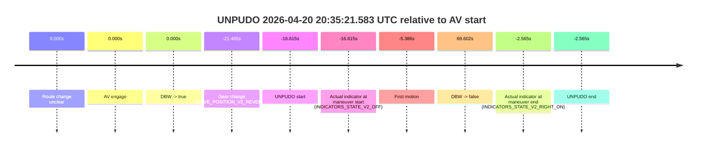
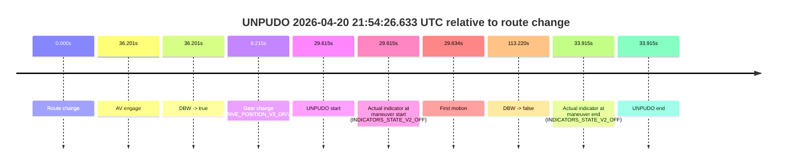
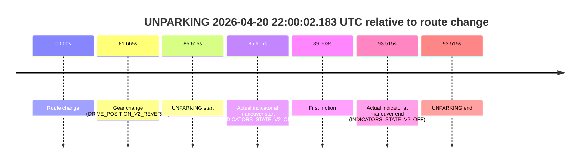

# Run Report: fme20007/2026-04-20--20-19-45--gen2-av-ef2164fc-41df-4c1d-92d3-0663632675b0

| Field | Value |
|---|---|
| Run ID | `fme20007/2026-04-20--20-19-45--gen2-av-ef2164fc-41df-4c1d-92d3-0663632675b0` |
| Date | `2026-04-20` |
| Model(s) | `blue-panther-solid` |
| Author | `guy.geva` |
| Event count | `15` |

## unpudo 2026-04-20 20:31:29.933 UTC

| Field | Value |
|---|---|
| Model | `blue-panther-solid` |
| Author | `guy.geva` |
| Run ID | `fme20007/2026-04-20--20-19-45--gen2-av-ef2164fc-41df-4c1d-92d3-0663632675b0` |
| Date | `2026-04-20` |
| Time (UTC) | `20:31:29.933` |
| Event type | `unpudo` |
| Disengagement type | `none observed` |
| Route change | `found` |
| Console | [run](https://console.sso.wayve.ai/run/fme20007/2026-04-20--20-19-45--gen2-av-ef2164fc-41df-4c1d-92d3-0663632675b0?id=&time-unixus=1776717089933316) |
| Foxglove | [segment](https://app.foxglove.dev/wayve-on-prem/p/prj_0dX18KZdVHg1fmmI/view?ds=foxglove-stream&ds.deviceName=fme20007&ds.start=2026-04-20T20%3A30%3A57.468311Z&ds.end=2026-04-20T20%3A35%3A17.419394Z&layoutId=lay_0e7VD4WIKDQGU73Y&time=2026-04-20T20%3A31%3A29.933316Z) |

### Event card: accidental

- Accidental: AV ownership is present for less than `2s`, so this is treated as an accidental brush with the maneuver rather than a meaningful model attempt.

| Event | Time (UTC) | Delta from route change |
|---|---:|---:|
| Route change | 2026-04-20 20:31:07.468 | `0.000s` |
| AV engage | 2026-04-20 20:31:36.199 | `28.731s` |
| DBW -> true | 2026-04-20 20:31:36.199 | `28.731s` |
| Gear change (DRIVE_POSITION_V2_DRIVE) | 2026-04-20 20:31:07.733 | `0.265s` |
| UNPUDO start | 2026-04-20 20:31:29.933 | `22.465s` |
| Actual indicator at maneuver start (INDICATORS_STATE_V2_OFF) | 2026-04-20 20:31:29.933 | `22.465s` |
| First motion | 2026-04-20 20:31:29.971 | `22.503s` |
| DBW -> false | 2026-04-20 20:35:07.419 | `239.951s` |
| Actual indicator at maneuver end (INDICATORS_STATE_V2_OFF) | 2026-04-20 20:31:33.033 | `25.565s` |
| UNPUDO end | 2026-04-20 20:31:33.033 | `25.565s` |

| Metric | Value |
|---|---|
| Outcome | `accidental` |
| Effective failure type | `none` |
| Route change status | `found` |
| DBW at event start | `false` |
| DBW at event end | `false` |
| Predicted gear at AV start | `DRIVE_POSITION_V2_DRIVE` |
| Actual gear at AV start | `DRIVE_POSITION_V2_DRIVE` |
| Predicted gear at event start | `DRIVE_POSITION_V2_DRIVE` |
| Actual gear at event start | `DRIVE_POSITION_V2_DRIVE` |
| Planned indicator direction | `INDICATORS_STATE_V2_RIGHT_ON` |
| Controller indicator direction | `INDICATORS_STATE_V2_RIGHT_ON` |
| Actual indicator direction | `INDICATORS_STATE_V2_OFF` |
| Actual indicator at maneuver end | `INDICATORS_STATE_V2_OFF` |
| Driver accel help in AV | `false` |
| Driver accel help timestamp | `n/a` |
| Max accel pedal pct in AV | `0.0%` |
| Max brake pedal pct in AV | `0.0%` |
| Max speed mps in AV | `0.000` |
| Route -> AV | `28.731s` |
| AV -> event start | `-6.266s` |
| AV -> first motion | `-6.228s` |
| AV duration before disengagement | `211.220s` |
| Trajectory waypoint count | `36` |
| Driving-plan step count | `11` |

The scored portion starts from the AV-owned window, not from the pre-AV setup. Route-change search in the stopped pre-event segment was `found`, with the baseline therefore set to route change. At the event anchor the model predicts `DRIVE_POSITION_V2_DRIVE` and the actual gear is `DRIVE_POSITION_V2_DRIVE`. The effective model outcome is `accidental` because `the AV-owned portion is shorter than 2s`.

### Resolution

| Field | Value |
|---|---|
| Final outcome | `accidental` |
| Do we agree with this label? | `yes` |
| Source disengagement type | `none observed` |
| Resolved effective failure type | `none` |
| Confidence | `high` |

## unpudo 2026-04-20 20:35:21.583 UTC

| Field | Value |
|---|---|
| Model | `blue-panther-solid` |
| Author | `guy.geva` |
| Run ID | `fme20007/2026-04-20--20-19-45--gen2-av-ef2164fc-41df-4c1d-92d3-0663632675b0` |
| Date | `2026-04-20` |
| Time (UTC) | `20:35:21.583` |
| Event type | `unpudo` |
| Disengagement type | `none observed` |
| Route change | `unclear` |
| Console | [run](https://console.sso.wayve.ai/run/fme20007/2026-04-20--20-19-45--gen2-av-ef2164fc-41df-4c1d-92d3-0663632675b0?id=&time-unixus=1776717321583316) |
| Foxglove | [segment](https://app.foxglove.dev/wayve-on-prem/p/prj_0dX18KZdVHg1fmmI/view?ds=foxglove-stream&ds.deviceName=fme20007&ds.start=2026-04-20T20%3A35%3A06.733316Z&ds.end=2026-04-20T20%3A36%3A57.800625Z&layoutId=lay_0e7VD4WIKDQGU73Y&time=2026-04-20T20%3A35%3A21.583316Z) |

### Event card: accidental

- Accidental: AV ownership is present for less than `2s`, so this is treated as an accidental brush with the maneuver rather than a meaningful model attempt.

| Event | Time (UTC) | Delta from AV start |
|---|---:|---:|
| Route change unclear | 2026-04-20 20:35:38.198 | `0.000s` |
| AV engage | 2026-04-20 20:35:38.198 | `0.000s` |
| DBW -> true | 2026-04-20 20:35:38.198 | `0.000s` |
| Gear change (DRIVE_POSITION_V2_REVERSE) | 2026-04-20 20:35:16.733 | `-21.465s` |
| UNPUDO start | 2026-04-20 20:35:21.583 | `-16.615s` |
| Actual indicator at maneuver start (INDICATORS_STATE_V2_OFF) | 2026-04-20 20:35:21.583 | `-16.615s` |
| First motion | 2026-04-20 20:35:32.812 | `-5.386s` |
| DBW -> false | 2026-04-20 20:36:47.800 | `69.602s` |
| Actual indicator at maneuver end (INDICATORS_STATE_V2_RIGHT_ON) | 2026-04-20 20:35:35.633 | `-2.565s` |
| UNPUDO end | 2026-04-20 20:35:35.633 | `-2.565s` |

| Metric | Value |
|---|---|
| Outcome | `accidental` |
| Effective failure type | `none` |
| Route change status | `unclear` |
| DBW at event start | `false` |
| DBW at event end | `false` |
| Predicted gear at AV start | `DRIVE_POSITION_V2_DRIVE` |
| Actual gear at AV start | `DRIVE_POSITION_V2_DRIVE` |
| Predicted gear at event start | `DRIVE_POSITION_V2_REVERSE` |
| Actual gear at event start | `DRIVE_POSITION_V2_REVERSE` |
| Planned indicator direction | `INDICATORS_STATE_V2_OFF` |
| Controller indicator direction | `INDICATORS_STATE_V2_OFF` |
| Actual indicator direction | `INDICATORS_STATE_V2_OFF` |
| Actual indicator at maneuver end | `INDICATORS_STATE_V2_RIGHT_ON` |
| Driver accel help in AV | `false` |
| Driver accel help timestamp | `n/a` |
| Max accel pedal pct in AV | `0.0%` |
| Max brake pedal pct in AV | `0.0%` |
| Max speed mps in AV | `0.000` |
| Route -> AV | `n/a` |
| AV -> event start | `-16.615s` |
| AV -> first motion | `-5.386s` |
| AV duration before disengagement | `69.602s` |
| Trajectory waypoint count | `37` |
| Driving-plan step count | `11` |

The scored portion starts from the AV-owned window, not from the pre-AV setup. Route-change search in the stopped pre-event segment was `unclear`, with the baseline therefore set to AV start. At the event anchor the model predicts `DRIVE_POSITION_V2_REVERSE` and the actual gear is `DRIVE_POSITION_V2_REVERSE`. The effective model outcome is `accidental` because `the AV-owned portion is shorter than 2s`.

### Resolution

| Field | Value |
|---|---|
| Final outcome | `accidental` |
| Do we agree with this label? | `yes` |
| Source disengagement type | `none observed` |
| Resolved effective failure type | `none` |
| Confidence | `medium` |

## unpudo 2026-04-20 20:41:58.633 UTC

| Field | Value |
|---|---|
| Model | `blue-panther-solid` |
| Author | `guy.geva` |
| Run ID | `fme20007/2026-04-20--20-19-45--gen2-av-ef2164fc-41df-4c1d-92d3-0663632675b0` |
| Date | `2026-04-20` |
| Time (UTC) | `20:41:58.633` |
| Event type | `unpudo` |
| Disengagement type | `none observed` |
| Route change | `found` |
| Console | [run](https://console.sso.wayve.ai/run/fme20007/2026-04-20--20-19-45--gen2-av-ef2164fc-41df-4c1d-92d3-0663632675b0?id=&time-unixus=1776717718633299) |
| Foxglove | [segment](https://app.foxglove.dev/wayve-on-prem/p/prj_0dX18KZdVHg1fmmI/view?ds=foxglove-stream&ds.deviceName=fme20007&ds.start=2026-04-20T20%3A41%3A41.268300Z&ds.end=2026-04-20T20%3A44%3A57.958515Z&layoutId=lay_0e7VD4WIKDQGU73Y&time=2026-04-20T20%3A41%3A58.633299Z) |

### Event card: pass

- Pass: AV owns the credited unpudo through the official event window, the gear state is aligned at the anchor, and the vehicle moves without driver accelerator help in AV.

| Event | Time (UTC) | Delta from route change |
|---|---:|---:|
| Route change | 2026-04-20 20:41:51.268 | `0.000s` |
| AV engage | 2026-04-20 20:41:54.558 | `3.290s` |
| DBW -> true | 2026-04-20 20:41:54.558 | `3.290s` |
| Gear change (DRIVE_POSITION_V2_DRIVE) | 2026-04-20 20:41:55.033 | `3.765s` |
| UNPUDO start | 2026-04-20 20:41:58.633 | `7.365s` |
| Actual indicator at maneuver start (INDICATORS_STATE_V2_OFF) | 2026-04-20 20:41:58.633 | `7.365s` |
| First motion | 2026-04-20 20:41:58.691 | `7.423s` |
| DBW -> false | 2026-04-20 20:44:47.958 | `176.690s` |
| Actual indicator at maneuver end (INDICATORS_STATE_V2_OFF) | 2026-04-20 20:42:02.383 | `11.115s` |
| UNPUDO end | 2026-04-20 20:42:02.383 | `11.115s` |

| Metric | Value |
|---|---|
| Outcome | `pass` |
| Effective failure type | `none` |
| Route change status | `found` |
| DBW at event start | `true` |
| DBW at event end | `true` |
| Predicted gear at AV start | `DRIVE_POSITION_V2_DRIVE` |
| Actual gear at AV start | `DRIVE_POSITION_V2_PARK` |
| Predicted gear at event start | `DRIVE_POSITION_V2_DRIVE` |
| Actual gear at event start | `DRIVE_POSITION_V2_DRIVE` |
| Planned indicator direction | `INDICATORS_STATE_V2_RIGHT_ON` |
| Controller indicator direction | `INDICATORS_STATE_V2_RIGHT_ON` |
| Actual indicator direction | `INDICATORS_STATE_V2_OFF` |
| Actual indicator at maneuver end | `INDICATORS_STATE_V2_OFF` |
| Driver accel help in AV | `false` |
| Driver accel help timestamp | `n/a` |
| Max accel pedal pct in AV | `0.0%` |
| Max brake pedal pct in AV | `8.8%` |
| Max speed mps in AV | `4.194` |
| Route -> AV | `3.290s` |
| AV -> event start | `4.075s` |
| AV -> first motion | `4.133s` |
| AV duration before disengagement | `173.400s` |
| Trajectory waypoint count | `36` |
| Driving-plan step count | `11` |

The scored portion starts from the AV-owned window, not from the pre-AV setup. Route-change search in the stopped pre-event segment was `found`, with the baseline therefore set to route change. At the event anchor the model predicts `DRIVE_POSITION_V2_DRIVE` and the actual gear is `DRIVE_POSITION_V2_DRIVE`. The effective model outcome is `pass` because `the credited maneuver stays AV-owned through the official event end`.

### Resolution

| Field | Value |
|---|---|
| Final outcome | `pass` |
| Do we agree with this label? | `yes` |
| Source disengagement type | `none observed` |
| Resolved effective failure type | `none` |
| Confidence | `high` |

## unpudo 2026-04-20 20:45:15.033 UTC

| Field | Value |
|---|---|
| Model | `blue-panther-solid` |
| Author | `guy.geva` |
| Run ID | `fme20007/2026-04-20--20-19-45--gen2-av-ef2164fc-41df-4c1d-92d3-0663632675b0` |
| Date | `2026-04-20` |
| Time (UTC) | `20:45:15.033` |
| Event type | `unpudo` |
| Disengagement type | `none observed` |
| Route change | `found` |
| Console | [run](https://console.sso.wayve.ai/run/fme20007/2026-04-20--20-19-45--gen2-av-ef2164fc-41df-4c1d-92d3-0663632675b0?id=&time-unixus=1776717915033314) |
| Foxglove | [segment](https://app.foxglove.dev/wayve-on-prem/p/prj_0dX18KZdVHg1fmmI/view?ds=foxglove-stream&ds.deviceName=fme20007&ds.start=2026-04-20T20%3A44%3A28.918244Z&ds.end=2026-04-20T20%3A50%3A58.798370Z&layoutId=lay_0e7VD4WIKDQGU73Y&time=2026-04-20T20%3A45%3A15.033314Z) |

### Event card: accidental

- Accidental: AV ownership is present for less than `2s`, so this is treated as an accidental brush with the maneuver rather than a meaningful model attempt.

| Event | Time (UTC) | Delta from route change |
|---|---:|---:|
| Route change | 2026-04-20 20:44:38.918 | `0.000s` |
| AV engage | 2026-04-20 20:45:21.259 | `42.341s` |
| DBW -> true | 2026-04-20 20:45:21.259 | `42.341s` |
| Gear change (DRIVE_POSITION_V2_DRIVE) | 2026-04-20 20:45:05.533 | `26.615s` |
| UNPUDO start | 2026-04-20 20:45:15.033 | `36.115s` |
| Actual indicator at maneuver start (INDICATORS_STATE_V2_OFF) | 2026-04-20 20:45:15.033 | `36.115s` |
| First motion | 2026-04-20 20:45:15.091 | `36.173s` |
| DBW -> false | 2026-04-20 20:50:48.798 | `369.880s` |
| Actual indicator at maneuver end (INDICATORS_STATE_V2_OFF) | 2026-04-20 20:45:19.583 | `40.665s` |
| UNPUDO end | 2026-04-20 20:45:19.583 | `40.665s` |

| Metric | Value |
|---|---|
| Outcome | `accidental` |
| Effective failure type | `none` |
| Route change status | `found` |
| DBW at event start | `false` |
| DBW at event end | `false` |
| Predicted gear at AV start | `DRIVE_POSITION_V2_DRIVE` |
| Actual gear at AV start | `DRIVE_POSITION_V2_DRIVE` |
| Predicted gear at event start | `DRIVE_POSITION_V2_DRIVE` |
| Actual gear at event start | `DRIVE_POSITION_V2_DRIVE` |
| Planned indicator direction | `INDICATORS_STATE_V2_LEFT_ON` |
| Controller indicator direction | `INDICATORS_STATE_V2_LEFT_ON` |
| Actual indicator direction | `INDICATORS_STATE_V2_OFF` |
| Actual indicator at maneuver end | `INDICATORS_STATE_V2_OFF` |
| Driver accel help in AV | `false` |
| Driver accel help timestamp | `n/a` |
| Max accel pedal pct in AV | `0.0%` |
| Max brake pedal pct in AV | `0.0%` |
| Max speed mps in AV | `0.000` |
| Route -> AV | `42.341s` |
| AV -> event start | `-6.226s` |
| AV -> first motion | `-6.168s` |
| AV duration before disengagement | `327.539s` |
| Trajectory waypoint count | `36` |
| Driving-plan step count | `11` |

The scored portion starts from the AV-owned window, not from the pre-AV setup. Route-change search in the stopped pre-event segment was `found`, with the baseline therefore set to route change. At the event anchor the model predicts `DRIVE_POSITION_V2_DRIVE` and the actual gear is `DRIVE_POSITION_V2_DRIVE`. The effective model outcome is `accidental` because `the AV-owned portion is shorter than 2s`.

### Resolution

| Field | Value |
|---|---|
| Final outcome | `accidental` |
| Do we agree with this label? | `yes` |
| Source disengagement type | `none observed` |
| Resolved effective failure type | `none` |
| Confidence | `high` |

## unpudo 2026-04-20 20:52:22.183 UTC

| Field | Value |
|---|---|
| Model | `blue-panther-solid` |
| Author | `guy.geva` |
| Run ID | `fme20007/2026-04-20--20-19-45--gen2-av-ef2164fc-41df-4c1d-92d3-0663632675b0` |
| Date | `2026-04-20` |
| Time (UTC) | `20:52:22.183` |
| Event type | `unpudo` |
| Disengagement type | `none observed` |
| Route change | `found` |
| Console | [run](https://console.sso.wayve.ai/run/fme20007/2026-04-20--20-19-45--gen2-av-ef2164fc-41df-4c1d-92d3-0663632675b0?id=&time-unixus=1776718342183299) |
| Foxglove | [segment](https://app.foxglove.dev/wayve-on-prem/p/prj_0dX18KZdVHg1fmmI/view?ds=foxglove-stream&ds.deviceName=fme20007&ds.start=2026-04-20T20%3A51%3A34.618270Z&ds.end=2026-04-20T20%3A56%3A04.738539Z&layoutId=lay_0e7VD4WIKDQGU73Y&time=2026-04-20T20%3A52%3A22.183299Z) |

### Event card: accidental

- Accidental: AV ownership is present for less than `2s`, so this is treated as an accidental brush with the maneuver rather than a meaningful model attempt.

| Event | Time (UTC) | Delta from route change |
|---|---:|---:|
| Route change | 2026-04-20 20:51:44.618 | `0.000s` |
| AV engage | 2026-04-20 20:52:34.659 | `50.041s` |
| DBW -> true | 2026-04-20 20:52:34.659 | `50.041s` |
| Gear change (DRIVE_POSITION_V2_DRIVE) | 2026-04-20 20:51:55.333 | `10.715s` |
| UNPUDO start | 2026-04-20 20:52:22.183 | `37.565s` |
| Actual indicator at maneuver start (INDICATORS_STATE_V2_OFF) | 2026-04-20 20:52:22.183 | `37.565s` |
| First motion | 2026-04-20 20:52:22.211 | `37.593s` |
| DBW -> false | 2026-04-20 20:55:54.738 | `250.120s` |
| Actual indicator at maneuver end (INDICATORS_STATE_V2_OFF) | 2026-04-20 20:52:26.333 | `41.715s` |
| UNPUDO end | 2026-04-20 20:52:26.333 | `41.715s` |

| Metric | Value |
|---|---|
| Outcome | `accidental` |
| Effective failure type | `none` |
| Route change status | `found` |
| DBW at event start | `false` |
| DBW at event end | `false` |
| Predicted gear at AV start | `DRIVE_POSITION_V2_DRIVE` |
| Actual gear at AV start | `DRIVE_POSITION_V2_DRIVE` |
| Predicted gear at event start | `DRIVE_POSITION_V2_DRIVE` |
| Actual gear at event start | `DRIVE_POSITION_V2_DRIVE` |
| Planned indicator direction | `INDICATORS_STATE_V2_RIGHT_ON` |
| Controller indicator direction | `INDICATORS_STATE_V2_RIGHT_ON` |
| Actual indicator direction | `INDICATORS_STATE_V2_OFF` |
| Actual indicator at maneuver end | `INDICATORS_STATE_V2_OFF` |
| Driver accel help in AV | `false` |
| Driver accel help timestamp | `n/a` |
| Max accel pedal pct in AV | `0.0%` |
| Max brake pedal pct in AV | `0.0%` |
| Max speed mps in AV | `0.000` |
| Route -> AV | `50.041s` |
| AV -> event start | `-12.476s` |
| AV -> first motion | `-12.448s` |
| AV duration before disengagement | `200.079s` |
| Trajectory waypoint count | `37` |
| Driving-plan step count | `11` |

The scored portion starts from the AV-owned window, not from the pre-AV setup. Route-change search in the stopped pre-event segment was `found`, with the baseline therefore set to route change. At the event anchor the model predicts `DRIVE_POSITION_V2_DRIVE` and the actual gear is `DRIVE_POSITION_V2_DRIVE`. The effective model outcome is `accidental` because `the AV-owned portion is shorter than 2s`.

### Resolution

| Field | Value |
|---|---|
| Final outcome | `accidental` |
| Do we agree with this label? | `yes` |
| Source disengagement type | `none observed` |
| Resolved effective failure type | `none` |
| Confidence | `high` |

## unpudo 2026-04-20 20:56:23.933 UTC

| Field | Value |
|---|---|
| Model | `blue-panther-solid` |
| Author | `guy.geva` |
| Run ID | `fme20007/2026-04-20--20-19-45--gen2-av-ef2164fc-41df-4c1d-92d3-0663632675b0` |
| Date | `2026-04-20` |
| Time (UTC) | `20:56:23.933` |
| Event type | `unpudo` |
| Disengagement type | `none observed` |
| Route change | `found` |
| Console | [run](https://console.sso.wayve.ai/run/fme20007/2026-04-20--20-19-45--gen2-av-ef2164fc-41df-4c1d-92d3-0663632675b0?id=&time-unixus=1776718583933298) |
| Foxglove | [segment](https://app.foxglove.dev/wayve-on-prem/p/prj_0dX18KZdVHg1fmmI/view?ds=foxglove-stream&ds.deviceName=fme20007&ds.start=2026-04-20T20%3A55%3A57.018292Z&ds.end=2026-04-20T20%3A58%3A58.559247Z&layoutId=lay_0e7VD4WIKDQGU73Y&time=2026-04-20T20%3A56%3A23.933298Z) |

### Event card: accidental

- Accidental: AV ownership is present for less than `2s`, so this is treated as an accidental brush with the maneuver rather than a meaningful model attempt.

| Event | Time (UTC) | Delta from route change |
|---|---:|---:|
| Route change | 2026-04-20 20:56:07.018 | `0.000s` |
| AV engage | 2026-04-20 20:56:39.477 | `32.459s` |
| DBW -> true | 2026-04-20 20:56:39.477 | `32.459s` |
| Gear change (DRIVE_POSITION_V2_DRIVE) | 2026-04-20 20:56:10.433 | `3.415s` |
| UNPUDO start | 2026-04-20 20:56:23.933 | `16.915s` |
| Actual indicator at maneuver start (INDICATORS_STATE_V2_OFF) | 2026-04-20 20:56:23.933 | `16.915s` |
| First motion | 2026-04-20 20:56:23.971 | `16.954s` |
| DBW -> false | 2026-04-20 20:58:48.559 | `161.541s` |
| Actual indicator at maneuver end (INDICATORS_STATE_V2_OFF) | 2026-04-20 20:56:29.033 | `22.015s` |
| UNPUDO end | 2026-04-20 20:56:29.033 | `22.015s` |

| Metric | Value |
|---|---|
| Outcome | `accidental` |
| Effective failure type | `none` |
| Route change status | `found` |
| DBW at event start | `false` |
| DBW at event end | `false` |
| Predicted gear at AV start | `DRIVE_POSITION_V2_DRIVE` |
| Actual gear at AV start | `DRIVE_POSITION_V2_DRIVE` |
| Predicted gear at event start | `DRIVE_POSITION_V2_DRIVE` |
| Actual gear at event start | `DRIVE_POSITION_V2_DRIVE` |
| Planned indicator direction | `INDICATORS_STATE_V2_RIGHT_ON` |
| Controller indicator direction | `INDICATORS_STATE_V2_RIGHT_ON` |
| Actual indicator direction | `INDICATORS_STATE_V2_OFF` |
| Actual indicator at maneuver end | `INDICATORS_STATE_V2_OFF` |
| Driver accel help in AV | `false` |
| Driver accel help timestamp | `n/a` |
| Max accel pedal pct in AV | `0.0%` |
| Max brake pedal pct in AV | `0.0%` |
| Max speed mps in AV | `0.000` |
| Route -> AV | `32.459s` |
| AV -> event start | `-15.544s` |
| AV -> first motion | `-15.506s` |
| AV duration before disengagement | `129.081s` |
| Trajectory waypoint count | `36` |
| Driving-plan step count | `11` |

The scored portion starts from the AV-owned window, not from the pre-AV setup. Route-change search in the stopped pre-event segment was `found`, with the baseline therefore set to route change. At the event anchor the model predicts `DRIVE_POSITION_V2_DRIVE` and the actual gear is `DRIVE_POSITION_V2_DRIVE`. The effective model outcome is `accidental` because `the AV-owned portion is shorter than 2s`.

### Resolution

| Field | Value |
|---|---|
| Final outcome | `accidental` |
| Do we agree with this label? | `yes` |
| Source disengagement type | `none observed` |
| Resolved effective failure type | `none` |
| Confidence | `high` |

## unpudo 2026-04-20 20:59:27.883 UTC

| Field | Value |
|---|---|
| Model | `blue-panther-solid` |
| Author | `guy.geva` |
| Run ID | `fme20007/2026-04-20--20-19-45--gen2-av-ef2164fc-41df-4c1d-92d3-0663632675b0` |
| Date | `2026-04-20` |
| Time (UTC) | `20:59:27.883` |
| Event type | `unpudo` |
| Disengagement type | `none observed` |
| Route change | `found` |
| Console | [run](https://console.sso.wayve.ai/run/fme20007/2026-04-20--20-19-45--gen2-av-ef2164fc-41df-4c1d-92d3-0663632675b0?id=&time-unixus=1776718767883303) |
| Foxglove | [segment](https://app.foxglove.dev/wayve-on-prem/p/prj_0dX18KZdVHg1fmmI/view?ds=foxglove-stream&ds.deviceName=fme20007&ds.start=2026-04-20T20%3A58%3A57.770387Z&ds.end=2026-04-20T21%3A02%3A39.499430Z&layoutId=lay_0e7VD4WIKDQGU73Y&time=2026-04-20T20%3A59%3A27.883303Z) |

### Event card: accidental

- Accidental: AV ownership is present for less than `2s`, so this is treated as an accidental brush with the maneuver rather than a meaningful model attempt.

| Event | Time (UTC) | Delta from route change |
|---|---:|---:|
| Route change | 2026-04-20 20:59:07.770 | `0.000s` |
| AV engage | 2026-04-20 20:59:38.878 | `31.108s` |
| DBW -> true | 2026-04-20 20:59:38.878 | `31.108s` |
| Gear change (DRIVE_POSITION_V2_DRIVE) | 2026-04-20 20:59:14.333 | `6.563s` |
| UNPUDO start | 2026-04-20 20:59:27.883 | `20.113s` |
| Actual indicator at maneuver start (INDICATORS_STATE_V2_OFF) | 2026-04-20 20:59:27.883 | `20.113s` |
| First motion | 2026-04-20 20:59:27.992 | `20.222s` |
| DBW -> false | 2026-04-20 21:02:29.499 | `201.729s` |
| Actual indicator at maneuver end (INDICATORS_STATE_V2_OFF) | 2026-04-20 20:59:35.133 | `27.363s` |
| UNPUDO end | 2026-04-20 20:59:35.133 | `27.363s` |

| Metric | Value |
|---|---|
| Outcome | `accidental` |
| Effective failure type | `none` |
| Route change status | `found` |
| DBW at event start | `false` |
| DBW at event end | `false` |
| Predicted gear at AV start | `DRIVE_POSITION_V2_DRIVE` |
| Actual gear at AV start | `DRIVE_POSITION_V2_DRIVE` |
| Predicted gear at event start | `DRIVE_POSITION_V2_DRIVE` |
| Actual gear at event start | `DRIVE_POSITION_V2_DRIVE` |
| Planned indicator direction | `INDICATORS_STATE_V2_RIGHT_ON` |
| Controller indicator direction | `INDICATORS_STATE_V2_RIGHT_ON` |
| Actual indicator direction | `INDICATORS_STATE_V2_OFF` |
| Actual indicator at maneuver end | `INDICATORS_STATE_V2_OFF` |
| Driver accel help in AV | `false` |
| Driver accel help timestamp | `n/a` |
| Max accel pedal pct in AV | `0.0%` |
| Max brake pedal pct in AV | `0.0%` |
| Max speed mps in AV | `0.000` |
| Route -> AV | `31.108s` |
| AV -> event start | `-10.995s` |
| AV -> first motion | `-10.886s` |
| AV duration before disengagement | `170.621s` |
| Trajectory waypoint count | `37` |
| Driving-plan step count | `11` |

The scored portion starts from the AV-owned window, not from the pre-AV setup. Route-change search in the stopped pre-event segment was `found`, with the baseline therefore set to route change. At the event anchor the model predicts `DRIVE_POSITION_V2_DRIVE` and the actual gear is `DRIVE_POSITION_V2_DRIVE`. The effective model outcome is `accidental` because `the AV-owned portion is shorter than 2s`.

### Resolution

| Field | Value |
|---|---|
| Final outcome | `accidental` |
| Do we agree with this label? | `yes` |
| Source disengagement type | `none observed` |
| Resolved effective failure type | `none` |
| Confidence | `high` |

## unpudo 2026-04-20 21:02:30.383 UTC

| Field | Value |
|---|---|
| Model | `blue-panther-solid` |
| Author | `guy.geva` |
| Run ID | `fme20007/2026-04-20--20-19-45--gen2-av-ef2164fc-41df-4c1d-92d3-0663632675b0` |
| Date | `2026-04-20` |
| Time (UTC) | `21:02:30.383` |
| Event type | `unpudo` |
| Disengagement type | `none observed` |
| Route change | `found` |
| Console | [run](https://console.sso.wayve.ai/run/fme20007/2026-04-20--20-19-45--gen2-av-ef2164fc-41df-4c1d-92d3-0663632675b0?id=&time-unixus=1776718950383298) |
| Foxglove | [segment](https://app.foxglove.dev/wayve-on-prem/p/prj_0dX18KZdVHg1fmmI/view?ds=foxglove-stream&ds.deviceName=fme20007&ds.start=2026-04-20T21%3A01%3A56.918250Z&ds.end=2026-04-20T21%3A08%3A06.137818Z&layoutId=lay_0e7VD4WIKDQGU73Y&time=2026-04-20T21%3A02%3A30.383298Z) |

### Event card: accidental

- Accidental: AV ownership is present for less than `2s`, so this is treated as an accidental brush with the maneuver rather than a meaningful model attempt.

| Event | Time (UTC) | Delta from route change |
|---|---:|---:|
| Route change | 2026-04-20 21:02:06.918 | `0.000s` |
| AV engage | 2026-04-20 21:02:38.919 | `32.001s` |
| DBW -> true | 2026-04-20 21:02:38.919 | `32.001s` |
| Gear change (DRIVE_POSITION_V2_DRIVE) | 2026-04-20 21:02:07.233 | `0.315s` |
| UNPUDO start | 2026-04-20 21:02:30.383 | `23.465s` |
| Actual indicator at maneuver start (INDICATORS_STATE_V2_OFF) | 2026-04-20 21:02:30.383 | `23.465s` |
| First motion | 2026-04-20 21:02:30.411 | `23.493s` |
| DBW -> false | 2026-04-20 21:07:56.137 | `349.220s` |
| Actual indicator at maneuver end (INDICATORS_STATE_V2_OFF) | 2026-04-20 21:02:35.433 | `28.515s` |
| UNPUDO end | 2026-04-20 21:02:35.433 | `28.515s` |

| Metric | Value |
|---|---|
| Outcome | `accidental` |
| Effective failure type | `none` |
| Route change status | `found` |
| DBW at event start | `false` |
| DBW at event end | `false` |
| Predicted gear at AV start | `DRIVE_POSITION_V2_DRIVE` |
| Actual gear at AV start | `DRIVE_POSITION_V2_DRIVE` |
| Predicted gear at event start | `DRIVE_POSITION_V2_DRIVE` |
| Actual gear at event start | `DRIVE_POSITION_V2_DRIVE` |
| Planned indicator direction | `INDICATORS_STATE_V2_RIGHT_ON` |
| Controller indicator direction | `INDICATORS_STATE_V2_RIGHT_ON` |
| Actual indicator direction | `INDICATORS_STATE_V2_OFF` |
| Actual indicator at maneuver end | `INDICATORS_STATE_V2_OFF` |
| Driver accel help in AV | `false` |
| Driver accel help timestamp | `n/a` |
| Max accel pedal pct in AV | `0.0%` |
| Max brake pedal pct in AV | `0.0%` |
| Max speed mps in AV | `0.000` |
| Route -> AV | `32.001s` |
| AV -> event start | `-8.536s` |
| AV -> first motion | `-8.508s` |
| AV duration before disengagement | `317.218s` |
| Trajectory waypoint count | `37` |
| Driving-plan step count | `11` |

The scored portion starts from the AV-owned window, not from the pre-AV setup. Route-change search in the stopped pre-event segment was `found`, with the baseline therefore set to route change. At the event anchor the model predicts `DRIVE_POSITION_V2_DRIVE` and the actual gear is `DRIVE_POSITION_V2_DRIVE`. The effective model outcome is `accidental` because `the AV-owned portion is shorter than 2s`.

### Resolution

| Field | Value |
|---|---|
| Final outcome | `accidental` |
| Do we agree with this label? | `yes` |
| Source disengagement type | `none observed` |
| Resolved effective failure type | `none` |
| Confidence | `high` |

## unpudo 2026-04-20 21:08:03.183 UTC

| Field | Value |
|---|---|
| Model | `blue-panther-solid` |
| Author | `guy.geva` |
| Run ID | `fme20007/2026-04-20--20-19-45--gen2-av-ef2164fc-41df-4c1d-92d3-0663632675b0` |
| Date | `2026-04-20` |
| Time (UTC) | `21:08:03.183` |
| Event type | `unpudo` |
| Disengagement type | `none observed` |
| Route change | `found` |
| Console | [run](https://console.sso.wayve.ai/run/fme20007/2026-04-20--20-19-45--gen2-av-ef2164fc-41df-4c1d-92d3-0663632675b0?id=&time-unixus=1776719283183301) |
| Foxglove | [segment](https://app.foxglove.dev/wayve-on-prem/p/prj_0dX18KZdVHg1fmmI/view?ds=foxglove-stream&ds.deviceName=fme20007&ds.start=2026-04-20T21%3A07%3A45.833312Z&ds.end=2026-04-20T21%3A08%3A52.478776Z&layoutId=lay_0e7VD4WIKDQGU73Y&time=2026-04-20T21%3A08%3A03.183301Z) |

### Event card: accidental

- Accidental: AV ownership is present for less than `2s`, so this is treated as an accidental brush with the maneuver rather than a meaningful model attempt.

| Event | Time (UTC) | Delta from route change |
|---|---:|---:|
| Route change | 2026-04-20 21:07:56.968 | `0.000s` |
| AV engage | 2026-04-20 21:08:30.518 | `33.550s` |
| DBW -> true | 2026-04-20 21:08:30.518 | `33.550s` |
| Gear change (DRIVE_POSITION_V2_REVERSE) | 2026-04-20 21:07:55.833 | `-1.135s` |
| UNPUDO start | 2026-04-20 21:08:03.183 | `6.215s` |
| Actual indicator at maneuver start (INDICATORS_STATE_V2_OFF) | 2026-04-20 21:08:03.183 | `6.215s` |
| First motion | 2026-04-20 21:08:11.191 | `14.223s` |
| DBW -> false | 2026-04-20 21:08:42.478 | `45.511s` |
| Actual indicator at maneuver end (INDICATORS_STATE_V2_OFF) | 2026-04-20 21:08:15.133 | `18.165s` |
| UNPUDO end | 2026-04-20 21:08:15.133 | `18.165s` |

| Metric | Value |
|---|---|
| Outcome | `accidental` |
| Effective failure type | `none` |
| Route change status | `found` |
| DBW at event start | `false` |
| DBW at event end | `false` |
| Predicted gear at AV start | `DRIVE_POSITION_V2_DRIVE` |
| Actual gear at AV start | `DRIVE_POSITION_V2_DRIVE` |
| Predicted gear at event start | `DRIVE_POSITION_V2_REVERSE` |
| Actual gear at event start | `DRIVE_POSITION_V2_REVERSE` |
| Planned indicator direction | `INDICATORS_STATE_V2_RIGHT_ON` |
| Controller indicator direction | `INDICATORS_STATE_V2_RIGHT_ON` |
| Actual indicator direction | `INDICATORS_STATE_V2_OFF` |
| Actual indicator at maneuver end | `INDICATORS_STATE_V2_OFF` |
| Driver accel help in AV | `false` |
| Driver accel help timestamp | `n/a` |
| Max accel pedal pct in AV | `0.0%` |
| Max brake pedal pct in AV | `0.0%` |
| Max speed mps in AV | `0.000` |
| Route -> AV | `33.550s` |
| AV -> event start | `-27.335s` |
| AV -> first motion | `-19.327s` |
| AV duration before disengagement | `11.960s` |
| Trajectory waypoint count | `37` |
| Driving-plan step count | `11` |

The scored portion starts from the AV-owned window, not from the pre-AV setup. Route-change search in the stopped pre-event segment was `found`, with the baseline therefore set to route change. At the event anchor the model predicts `DRIVE_POSITION_V2_REVERSE` and the actual gear is `DRIVE_POSITION_V2_REVERSE`. The effective model outcome is `accidental` because `the AV-owned portion is shorter than 2s`.

### Resolution

| Field | Value |
|---|---|
| Final outcome | `accidental` |
| Do we agree with this label? | `yes` |
| Source disengagement type | `none observed` |
| Resolved effective failure type | `none` |
| Confidence | `high` |

## unpudo 2026-04-20 21:26:49.783 UTC

| Field | Value |
|---|---|
| Model | `blue-panther-solid` |
| Author | `guy.geva` |
| Run ID | `fme20007/2026-04-20--20-19-45--gen2-av-ef2164fc-41df-4c1d-92d3-0663632675b0` |
| Date | `2026-04-20` |
| Time (UTC) | `21:26:49.783` |
| Event type | `unpudo` |
| Disengagement type | `none observed` |
| Route change | `found` |
| Console | [run](https://console.sso.wayve.ai/run/fme20007/2026-04-20--20-19-45--gen2-av-ef2164fc-41df-4c1d-92d3-0663632675b0?id=&time-unixus=1776720409783306) |
| Foxglove | [segment](https://app.foxglove.dev/wayve-on-prem/p/prj_0dX18KZdVHg1fmmI/view?ds=foxglove-stream&ds.deviceName=fme20007&ds.start=2026-04-20T21%3A25%3A44.618282Z&ds.end=2026-04-20T21%3A27%3A18.533306Z&layoutId=lay_0e7VD4WIKDQGU73Y&time=2026-04-20T21%3A26%3A49.783306Z) |

### Event card: non-av

- Non-AV: the detected unpudo starts outside AV ownership, so it is kept for coverage but excluded from model success / failure scoring.

| Event | Time (UTC) | Delta from route change |
|---|---:|---:|
| Route change | 2026-04-20 21:25:54.618 | `0.000s` |
| AV engage | 2026-04-20 21:26:58.039 | `63.421s` |
| DBW -> true | 2026-04-20 21:26:58.039 | `63.421s` |
| Gear change (DRIVE_POSITION_V2_REVERSE) | 2026-04-20 21:26:19.433 | `24.815s` |
| UNPUDO start | 2026-04-20 21:26:49.783 | `55.165s` |
| Actual indicator at maneuver start (INDICATORS_STATE_V2_OFF) | 2026-04-20 21:26:49.783 | `55.165s` |
| First motion | 2026-04-20 21:27:04.171 | `69.553s` |
| DBW -> false | 2026-04-20 21:27:03.419 | `68.801s` |
| Actual indicator at maneuver end (INDICATORS_STATE_V2_OFF) | 2026-04-20 21:27:08.533 | `73.915s` |
| UNPUDO end | 2026-04-20 21:27:08.533 | `73.915s` |

| Metric | Value |
|---|---|
| Outcome | `non-av` |
| Effective failure type | `none` |
| Route change status | `found` |
| DBW at event start | `false` |
| DBW at event end | `false` |
| Predicted gear at AV start | `DRIVE_POSITION_V2_DRIVE` |
| Actual gear at AV start | `DRIVE_POSITION_V2_DRIVE` |
| Predicted gear at event start | `DRIVE_POSITION_V2_REVERSE` |
| Actual gear at event start | `DRIVE_POSITION_V2_REVERSE` |
| Planned indicator direction | `INDICATORS_STATE_V2_OFF` |
| Controller indicator direction | `INDICATORS_STATE_V2_OFF` |
| Actual indicator direction | `INDICATORS_STATE_V2_OFF` |
| Actual indicator at maneuver end | `INDICATORS_STATE_V2_OFF` |
| Driver accel help in AV | `false` |
| Driver accel help timestamp | `n/a` |
| Max accel pedal pct in AV | `0.0%` |
| Max brake pedal pct in AV | `9.1%` |
| Max speed mps in AV | `0.000` |
| Route -> AV | `63.421s` |
| AV -> event start | `-8.256s` |
| AV -> first motion | `6.132s` |
| AV duration before disengagement | `5.380s` |
| Trajectory waypoint count | `37` |
| Driving-plan step count | `11` |

The scored portion starts from the AV-owned window, not from the pre-AV setup. Route-change search in the stopped pre-event segment was `found`, with the baseline therefore set to route change. At the event anchor the model predicts `DRIVE_POSITION_V2_REVERSE` and the actual gear is `DRIVE_POSITION_V2_REVERSE`. The effective model outcome is `non-av` because `the event does not begin in AV ownership`.

### Resolution

| Field | Value |
|---|---|
| Final outcome | `non-av` |
| Do we agree with this label? | `yes` |
| Source disengagement type | `none observed` |
| Resolved effective failure type | `none` |
| Confidence | `high` |

## unpudo 2026-04-20 21:41:59.433 UTC

| Field | Value |
|---|---|
| Model | `blue-panther-solid` |
| Author | `guy.geva` |
| Run ID | `fme20007/2026-04-20--20-19-45--gen2-av-ef2164fc-41df-4c1d-92d3-0663632675b0` |
| Date | `2026-04-20` |
| Time (UTC) | `21:41:59.433` |
| Event type | `unpudo` |
| Disengagement type | `none observed` |
| Route change | `found` |
| Console | [run](https://console.sso.wayve.ai/run/fme20007/2026-04-20--20-19-45--gen2-av-ef2164fc-41df-4c1d-92d3-0663632675b0?id=&time-unixus=1776721319433310) |
| Foxglove | [segment](https://app.foxglove.dev/wayve-on-prem/p/prj_0dX18KZdVHg1fmmI/view?ds=foxglove-stream&ds.deviceName=fme20007&ds.start=2026-04-20T21%3A41%3A31.868251Z&ds.end=2026-04-20T21%3A44%3A05.760421Z&layoutId=lay_0e7VD4WIKDQGU73Y&time=2026-04-20T21%3A41%3A59.433310Z) |

### Event card: accidental

- Accidental: AV ownership is present for less than `2s`, so this is treated as an accidental brush with the maneuver rather than a meaningful model attempt.

| Event | Time (UTC) | Delta from route change |
|---|---:|---:|
| Route change | 2026-04-20 21:41:41.868 | `0.000s` |
| AV engage | 2026-04-20 21:42:15.998 | `34.130s` |
| DBW -> true | 2026-04-20 21:42:15.998 | `34.130s` |
| Gear change (DRIVE_POSITION_V2_DRIVE) | 2026-04-20 21:41:42.133 | `0.265s` |
| UNPUDO start | 2026-04-20 21:41:59.433 | `17.565s` |
| Actual indicator at maneuver start (INDICATORS_STATE_V2_RIGHT_ON) | 2026-04-20 21:41:59.433 | `17.565s` |
| First motion | 2026-04-20 21:41:59.491 | `17.623s` |
| DBW -> false | 2026-04-20 21:43:55.760 | `133.892s` |
| Actual indicator at maneuver end (INDICATORS_STATE_V2_OFF) | 2026-04-20 21:42:03.133 | `21.265s` |
| UNPUDO end | 2026-04-20 21:42:03.133 | `21.265s` |

| Metric | Value |
|---|---|
| Outcome | `accidental` |
| Effective failure type | `none` |
| Route change status | `found` |
| DBW at event start | `false` |
| DBW at event end | `false` |
| Predicted gear at AV start | `DRIVE_POSITION_V2_DRIVE` |
| Actual gear at AV start | `DRIVE_POSITION_V2_DRIVE` |
| Predicted gear at event start | `DRIVE_POSITION_V2_DRIVE` |
| Actual gear at event start | `DRIVE_POSITION_V2_DRIVE` |
| Planned indicator direction | `INDICATORS_STATE_V2_LEFT_ON` |
| Controller indicator direction | `INDICATORS_STATE_V2_LEFT_ON` |
| Actual indicator direction | `INDICATORS_STATE_V2_RIGHT_ON` |
| Actual indicator at maneuver end | `INDICATORS_STATE_V2_OFF` |
| Driver accel help in AV | `false` |
| Driver accel help timestamp | `n/a` |
| Max accel pedal pct in AV | `0.0%` |
| Max brake pedal pct in AV | `0.0%` |
| Max speed mps in AV | `0.000` |
| Route -> AV | `34.130s` |
| AV -> event start | `-16.565s` |
| AV -> first motion | `-16.507s` |
| AV duration before disengagement | `99.762s` |
| Trajectory waypoint count | `36` |
| Driving-plan step count | `11` |

The scored portion starts from the AV-owned window, not from the pre-AV setup. Route-change search in the stopped pre-event segment was `found`, with the baseline therefore set to route change. At the event anchor the model predicts `DRIVE_POSITION_V2_DRIVE` and the actual gear is `DRIVE_POSITION_V2_DRIVE`. The effective model outcome is `accidental` because `the AV-owned portion is shorter than 2s`.

### Resolution

| Field | Value |
|---|---|
| Final outcome | `accidental` |
| Do we agree with this label? | `yes` |
| Source disengagement type | `none observed` |
| Resolved effective failure type | `none` |
| Confidence | `high` |

## unpudo 2026-04-20 21:44:57.283 UTC

| Field | Value |
|---|---|
| Model | `blue-panther-solid` |
| Author | `guy.geva` |
| Run ID | `fme20007/2026-04-20--20-19-45--gen2-av-ef2164fc-41df-4c1d-92d3-0663632675b0` |
| Date | `2026-04-20` |
| Time (UTC) | `21:44:57.283` |
| Event type | `unpudo` |
| Disengagement type | `none observed` |
| Route change | `found` |
| Console | [run](https://console.sso.wayve.ai/run/fme20007/2026-04-20--20-19-45--gen2-av-ef2164fc-41df-4c1d-92d3-0663632675b0?id=&time-unixus=1776721497283293) |
| Foxglove | [segment](https://app.foxglove.dev/wayve-on-prem/p/prj_0dX18KZdVHg1fmmI/view?ds=foxglove-stream&ds.deviceName=fme20007&ds.start=2026-04-20T21%3A44%3A02.918275Z&ds.end=2026-04-20T21%3A45%3A50.378638Z&layoutId=lay_0e7VD4WIKDQGU73Y&time=2026-04-20T21%3A44%3A57.283293Z) |

### Event card: accidental

- Accidental: AV ownership is present for less than `2s`, so this is treated as an accidental brush with the maneuver rather than a meaningful model attempt.

| Event | Time (UTC) | Delta from route change |
|---|---:|---:|
| Route change | 2026-04-20 21:44:12.918 | `0.000s` |
| AV engage | 2026-04-20 21:45:21.658 | `68.740s` |
| DBW -> true | 2026-04-20 21:45:21.658 | `68.740s` |
| Gear change (DRIVE_POSITION_V2_DRIVE) | 2026-04-20 21:44:38.533 | `25.615s` |
| UNPUDO start | 2026-04-20 21:44:57.283 | `44.365s` |
| Actual indicator at maneuver start (INDICATORS_STATE_V2_OFF) | 2026-04-20 21:44:57.283 | `44.365s` |
| First motion | 2026-04-20 21:45:02.671 | `49.753s` |
| DBW -> false | 2026-04-20 21:45:40.378 | `87.460s` |
| Actual indicator at maneuver end (INDICATORS_STATE_V2_OFF) | 2026-04-20 21:45:10.333 | `57.415s` |
| UNPUDO end | 2026-04-20 21:45:10.333 | `57.415s` |

| Metric | Value |
|---|---|
| Outcome | `accidental` |
| Effective failure type | `none` |
| Route change status | `found` |
| DBW at event start | `false` |
| DBW at event end | `false` |
| Predicted gear at AV start | `DRIVE_POSITION_V2_DRIVE` |
| Actual gear at AV start | `DRIVE_POSITION_V2_DRIVE` |
| Predicted gear at event start | `DRIVE_POSITION_V2_DRIVE` |
| Actual gear at event start | `DRIVE_POSITION_V2_DRIVE` |
| Planned indicator direction | `INDICATORS_STATE_V2_LEFT_ON` |
| Controller indicator direction | `INDICATORS_STATE_V2_LEFT_ON` |
| Actual indicator direction | `INDICATORS_STATE_V2_OFF` |
| Actual indicator at maneuver end | `INDICATORS_STATE_V2_OFF` |
| Driver accel help in AV | `false` |
| Driver accel help timestamp | `n/a` |
| Max accel pedal pct in AV | `0.0%` |
| Max brake pedal pct in AV | `0.0%` |
| Max speed mps in AV | `0.000` |
| Route -> AV | `68.740s` |
| AV -> event start | `-24.375s` |
| AV -> first motion | `-18.987s` |
| AV duration before disengagement | `18.720s` |
| Trajectory waypoint count | `37` |
| Driving-plan step count | `11` |

The scored portion starts from the AV-owned window, not from the pre-AV setup. Route-change search in the stopped pre-event segment was `found`, with the baseline therefore set to route change. At the event anchor the model predicts `DRIVE_POSITION_V2_DRIVE` and the actual gear is `DRIVE_POSITION_V2_DRIVE`. The effective model outcome is `accidental` because `the AV-owned portion is shorter than 2s`.

### Resolution

| Field | Value |
|---|---|
| Final outcome | `accidental` |
| Do we agree with this label? | `yes` |
| Source disengagement type | `none observed` |
| Resolved effective failure type | `none` |
| Confidence | `high` |

## unpudo 2026-04-20 21:50:57.883 UTC

| Field | Value |
|---|---|
| Model | `blue-panther-solid` |
| Author | `guy.geva` |
| Run ID | `fme20007/2026-04-20--20-19-45--gen2-av-ef2164fc-41df-4c1d-92d3-0663632675b0` |
| Date | `2026-04-20` |
| Time (UTC) | `21:50:57.883` |
| Event type | `unpudo` |
| Disengagement type | `none observed` |
| Route change | `found` |
| Console | [run](https://console.sso.wayve.ai/run/fme20007/2026-04-20--20-19-45--gen2-av-ef2164fc-41df-4c1d-92d3-0663632675b0?id=&time-unixus=1776721857883318) |
| Foxglove | [segment](https://app.foxglove.dev/wayve-on-prem/p/prj_0dX18KZdVHg1fmmI/view?ds=foxglove-stream&ds.deviceName=fme20007&ds.start=2026-04-20T21%3A49%3A50.518252Z&ds.end=2026-04-20T21%3A53%3A23.379389Z&layoutId=lay_0e7VD4WIKDQGU73Y&time=2026-04-20T21%3A50%3A57.883318Z) |

### Event card: accidental

- Accidental: AV ownership is present for less than `2s`, so this is treated as an accidental brush with the maneuver rather than a meaningful model attempt.

| Event | Time (UTC) | Delta from route change |
|---|---:|---:|
| Route change | 2026-04-20 21:50:00.518 | `0.000s` |
| AV engage | 2026-04-20 21:51:17.359 | `76.841s` |
| DBW -> true | 2026-04-20 21:51:17.359 | `76.841s` |
| Gear change (DRIVE_POSITION_V2_REVERSE) | 2026-04-20 21:50:50.033 | `49.515s` |
| UNPUDO start | 2026-04-20 21:50:57.883 | `57.365s` |
| Actual indicator at maneuver start (INDICATORS_STATE_V2_OFF) | 2026-04-20 21:50:57.883 | `57.365s` |
| First motion | 2026-04-20 21:51:09.291 | `68.773s` |
| DBW -> false | 2026-04-20 21:53:13.379 | `192.861s` |
| Actual indicator at maneuver end (INDICATORS_STATE_V2_OFF) | 2026-04-20 21:51:14.333 | `73.815s` |
| UNPUDO end | 2026-04-20 21:51:14.333 | `73.815s` |

| Metric | Value |
|---|---|
| Outcome | `accidental` |
| Effective failure type | `none` |
| Route change status | `found` |
| DBW at event start | `false` |
| DBW at event end | `false` |
| Predicted gear at AV start | `DRIVE_POSITION_V2_DRIVE` |
| Actual gear at AV start | `DRIVE_POSITION_V2_DRIVE` |
| Predicted gear at event start | `DRIVE_POSITION_V2_REVERSE` |
| Actual gear at event start | `DRIVE_POSITION_V2_REVERSE` |
| Planned indicator direction | `INDICATORS_STATE_V2_OFF` |
| Controller indicator direction | `INDICATORS_STATE_V2_OFF` |
| Actual indicator direction | `INDICATORS_STATE_V2_OFF` |
| Actual indicator at maneuver end | `INDICATORS_STATE_V2_OFF` |
| Driver accel help in AV | `false` |
| Driver accel help timestamp | `n/a` |
| Max accel pedal pct in AV | `0.0%` |
| Max brake pedal pct in AV | `0.0%` |
| Max speed mps in AV | `0.000` |
| Route -> AV | `76.841s` |
| AV -> event start | `-19.476s` |
| AV -> first motion | `-8.068s` |
| AV duration before disengagement | `116.020s` |
| Trajectory waypoint count | `37` |
| Driving-plan step count | `11` |

The scored portion starts from the AV-owned window, not from the pre-AV setup. Route-change search in the stopped pre-event segment was `found`, with the baseline therefore set to route change. At the event anchor the model predicts `DRIVE_POSITION_V2_REVERSE` and the actual gear is `DRIVE_POSITION_V2_REVERSE`. The effective model outcome is `accidental` because `the AV-owned portion is shorter than 2s`.

### Resolution

| Field | Value |
|---|---|
| Final outcome | `accidental` |
| Do we agree with this label? | `yes` |
| Source disengagement type | `none observed` |
| Resolved effective failure type | `none` |
| Confidence | `high` |

## unpudo 2026-04-20 21:54:26.633 UTC

| Field | Value |
|---|---|
| Model | `blue-panther-solid` |
| Author | `guy.geva` |
| Run ID | `fme20007/2026-04-20--20-19-45--gen2-av-ef2164fc-41df-4c1d-92d3-0663632675b0` |
| Date | `2026-04-20` |
| Time (UTC) | `21:54:26.633` |
| Event type | `unpudo` |
| Disengagement type | `none observed` |
| Route change | `found` |
| Console | [run](https://console.sso.wayve.ai/run/fme20007/2026-04-20--20-19-45--gen2-av-ef2164fc-41df-4c1d-92d3-0663632675b0?id=&time-unixus=1776722066633321) |
| Foxglove | [segment](https://app.foxglove.dev/wayve-on-prem/p/prj_0dX18KZdVHg1fmmI/view?ds=foxglove-stream&ds.deviceName=fme20007&ds.start=2026-04-20T21%3A53%3A47.018253Z&ds.end=2026-04-20T21%3A56%3A00.238302Z&layoutId=lay_0e7VD4WIKDQGU73Y&time=2026-04-20T21%3A54%3A26.633321Z) |

### Event card: accidental

- Accidental: AV ownership is present for less than `2s`, so this is treated as an accidental brush with the maneuver rather than a meaningful model attempt.

| Event | Time (UTC) | Delta from route change |
|---|---:|---:|
| Route change | 2026-04-20 21:53:57.018 | `0.000s` |
| AV engage | 2026-04-20 21:54:33.219 | `36.201s` |
| DBW -> true | 2026-04-20 21:54:33.219 | `36.201s` |
| Gear change (DRIVE_POSITION_V2_DRIVE) | 2026-04-20 21:54:05.233 | `8.215s` |
| UNPUDO start | 2026-04-20 21:54:26.633 | `29.615s` |
| Actual indicator at maneuver start (INDICATORS_STATE_V2_OFF) | 2026-04-20 21:54:26.633 | `29.615s` |
| First motion | 2026-04-20 21:54:26.651 | `29.634s` |
| DBW -> false | 2026-04-20 21:55:50.238 | `113.220s` |
| Actual indicator at maneuver end (INDICATORS_STATE_V2_OFF) | 2026-04-20 21:54:30.933 | `33.915s` |
| UNPUDO end | 2026-04-20 21:54:30.933 | `33.915s` |

| Metric | Value |
|---|---|
| Outcome | `accidental` |
| Effective failure type | `none` |
| Route change status | `found` |
| DBW at event start | `false` |
| DBW at event end | `false` |
| Predicted gear at AV start | `DRIVE_POSITION_V2_DRIVE` |
| Actual gear at AV start | `DRIVE_POSITION_V2_DRIVE` |
| Predicted gear at event start | `DRIVE_POSITION_V2_DRIVE` |
| Actual gear at event start | `DRIVE_POSITION_V2_DRIVE` |
| Planned indicator direction | `INDICATORS_STATE_V2_RIGHT_ON` |
| Controller indicator direction | `INDICATORS_STATE_V2_RIGHT_ON` |
| Actual indicator direction | `INDICATORS_STATE_V2_OFF` |
| Actual indicator at maneuver end | `INDICATORS_STATE_V2_OFF` |
| Driver accel help in AV | `false` |
| Driver accel help timestamp | `n/a` |
| Max accel pedal pct in AV | `0.0%` |
| Max brake pedal pct in AV | `0.0%` |
| Max speed mps in AV | `0.000` |
| Route -> AV | `36.201s` |
| AV -> event start | `-6.586s` |
| AV -> first motion | `-6.568s` |
| AV duration before disengagement | `77.019s` |
| Trajectory waypoint count | `36` |
| Driving-plan step count | `11` |

The scored portion starts from the AV-owned window, not from the pre-AV setup. Route-change search in the stopped pre-event segment was `found`, with the baseline therefore set to route change. At the event anchor the model predicts `DRIVE_POSITION_V2_DRIVE` and the actual gear is `DRIVE_POSITION_V2_DRIVE`. The effective model outcome is `accidental` because `the AV-owned portion is shorter than 2s`.

### Resolution

| Field | Value |
|---|---|
| Final outcome | `accidental` |
| Do we agree with this label? | `yes` |
| Source disengagement type | `none observed` |
| Resolved effective failure type | `none` |
| Confidence | `high` |

## unparking 2026-04-20 22:00:02.183 UTC

| Field | Value |
|---|---|
| Model | `blue-panther-solid` |
| Author | `guy.geva` |
| Run ID | `fme20007/2026-04-20--20-19-45--gen2-av-ef2164fc-41df-4c1d-92d3-0663632675b0` |
| Date | `2026-04-20` |
| Time (UTC) | `22:00:02.183` |
| Event type | `unparking` |
| Disengagement type | `none observed` |
| Route change | `found` |
| Console | [run](https://console.sso.wayve.ai/run/fme20007/2026-04-20--20-19-45--gen2-av-ef2164fc-41df-4c1d-92d3-0663632675b0?id=&time-unixus=1776722402183301) |
| Foxglove | [segment](https://app.foxglove.dev/wayve-on-prem/p/prj_0dX18KZdVHg1fmmI/view?ds=foxglove-stream&ds.deviceName=fme20007&ds.start=2026-04-20T21%3A58%3A26.568352Z&ds.end=2026-04-20T22%3A00%3A20.083299Z&layoutId=lay_0e7VD4WIKDQGU73Y&time=2026-04-20T22%3A00%3A02.183301Z) |

### Event card: non-av

- Non-AV: the detected unparking starts outside AV ownership, so it is kept for coverage but excluded from model success / failure scoring.

| Event | Time (UTC) | Delta from route change |
|---|---:|---:|
| Route change | 2026-04-20 21:58:36.568 | `0.000s` |
| Gear change (DRIVE_POSITION_V2_REVERSE) | 2026-04-20 21:59:58.233 | `81.665s` |
| UNPARKING start | 2026-04-20 22:00:02.183 | `85.615s` |
| Actual indicator at maneuver start (INDICATORS_STATE_V2_OFF) | 2026-04-20 22:00:02.183 | `85.615s` |
| First motion | 2026-04-20 22:00:06.231 | `89.663s` |
| Actual indicator at maneuver end (INDICATORS_STATE_V2_OFF) | 2026-04-20 22:00:10.083 | `93.515s` |
| UNPARKING end | 2026-04-20 22:00:10.083 | `93.515s` |

| Metric | Value |
|---|---|
| Outcome | `non-av` |
| Effective failure type | `none` |
| Route change status | `found` |
| DBW at event start | `false` |
| DBW at event end | `false` |
| Predicted gear at AV start | `n/a` |
| Actual gear at AV start | `n/a` |
| Predicted gear at event start | `DRIVE_POSITION_V2_REVERSE` |
| Actual gear at event start | `DRIVE_POSITION_V2_REVERSE` |
| Planned indicator direction | `INDICATORS_STATE_V2_OFF` |
| Controller indicator direction | `INDICATORS_STATE_V2_OFF` |
| Actual indicator direction | `INDICATORS_STATE_V2_OFF` |
| Actual indicator at maneuver end | `INDICATORS_STATE_V2_OFF` |
| Driver accel help in AV | `false` |
| Driver accel help timestamp | `n/a` |
| Max accel pedal pct in AV | `0.0%` |
| Max brake pedal pct in AV | `0.0%` |
| Max speed mps in AV | `0.000` |
| Route -> AV | `n/a` |
| AV -> event start | `n/a` |
| AV -> first motion | `n/a` |
| AV duration before disengagement | `n/a` |
| Trajectory waypoint count | `36` |
| Driving-plan step count | `11` |

The scored portion starts from the AV-owned window, not from the pre-AV setup. Route-change search in the stopped pre-event segment was `found`, with the baseline therefore set to route change. At the event anchor the model predicts `DRIVE_POSITION_V2_REVERSE` and the actual gear is `DRIVE_POSITION_V2_REVERSE`. The effective model outcome is `non-av` because `the event does not begin in AV ownership`.

### Resolution

| Field | Value |
|---|---|
| Final outcome | `non-av` |
| Do we agree with this label? | `yes` |
| Source disengagement type | `none observed` |
| Resolved effective failure type | `none` |
| Confidence | `high` |
