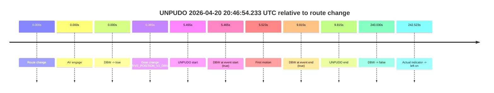
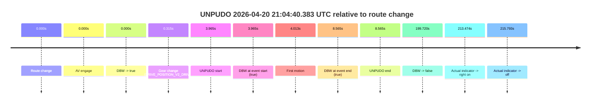
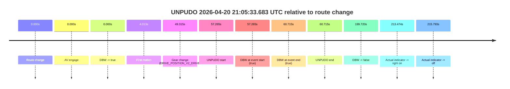
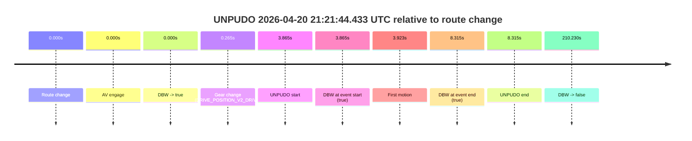
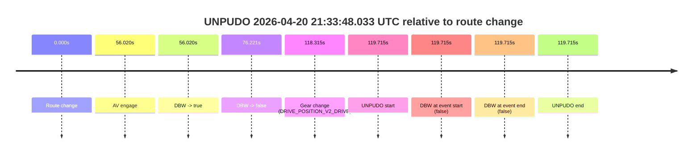
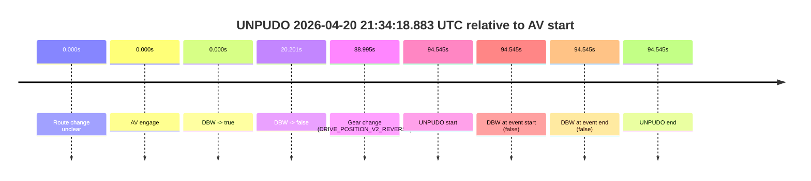
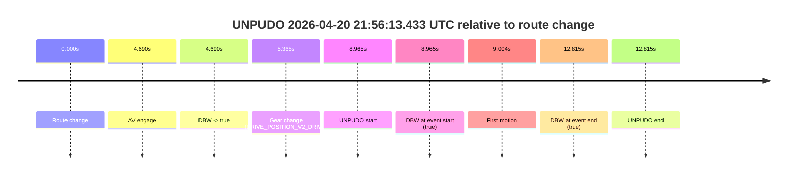

# Run Report: fme20007/2026-04-20--20-19-45--gen2-av-ef2164fc-41df-4c1d-92d3-0663632675b0

| Field | Value |
|---|---|
| Run ID | `fme20007/2026-04-20--20-19-45--gen2-av-ef2164fc-41df-4c1d-92d3-0663632675b0` |
| Date | `2026-04-20` |
| Model(s) | `eel-teal-outspoken` |
| Author | `zak` |
| Event count | `8` |

## unpudo 2026-04-20 20:46:54.233 UTC

| Field | Value |
|---|---|
| Model | `eel-teal-outspoken` |
| Author | `zak` |
| Run ID | `fme20007/2026-04-20--20-19-45--gen2-av-ef2164fc-41df-4c1d-92d3-0663632675b0` |
| Date | `2026-04-20` |
| Time (UTC) | `20:46:54.233` |
| Event type | `unpudo` |
| Disengagement type | `none observed` |
| Route change | `found` |
| Console | [run](https://console.sso.wayve.ai/run/fme20007/2026-04-20--20-19-45--gen2-av-ef2164fc-41df-4c1d-92d3-0663632675b0?id=&time-unixus=1776718014233289) |
| Foxglove | [segment](https://app.foxglove.dev/wayve-on-prem/p/prj_0dX18KZdVHg1fmmI/view?ds=foxglove-stream&ds.deviceName=fme20007&ds.start=2026-04-20T20%3A46%3A38.768336Z&ds.end=2026-04-20T20%3A50%3A58.798370Z&layoutId=lay_0e7VD4WIKDQGU73Y&time=2026-04-20T20%3A46%3A54.233289Z) |

### Event card: pass

- Pass: AV owns the credited unpudo from route change through the official unpudo window, the gear state is aligned at the anchor, and the vehicle moves without driver accelerator help in AV.

| Event | Time (UTC) | Delta from route change |
|---|---:|---:|
| Route change | 2026-04-20 20:46:48.768 | `0.000s` |
| AV engage | 2026-04-20 20:46:48.768 | `0.000s` |
| DBW -> true | 2026-04-20 20:46:48.768 | `0.000s` |
| Gear change (DRIVE_POSITION_V2_DRIVE) | 2026-04-20 20:46:49.133 | `0.365s` |
| UNPUDO start | 2026-04-20 20:46:54.233 | `5.465s` |
| DBW at event start (true) | 2026-04-20 20:46:54.233 | `5.465s` |
| First motion | 2026-04-20 20:46:54.291 | `5.523s` |
| DBW at event end (true) | 2026-04-20 20:46:58.583 | `9.815s` |
| UNPUDO end | 2026-04-20 20:46:58.583 | `9.815s` |
| DBW -> false | 2026-04-20 20:50:48.798 | `240.030s` |
| Actual indicator -> left on | 2026-04-20 20:50:51.291 | `242.523s` |

| Metric | Value |
|---|---|
| Outcome | `pass` |
| Effective failure type | `none` |
| Route change status | `found` |
| DBW at event start | `true` |
| DBW at event end | `true` |
| Predicted gear at AV start | `DRIVE_POSITION_V2_PARK` |
| Actual gear at AV start | `DRIVE_POSITION_V2_PARK` |
| Predicted gear at event start | `DRIVE_POSITION_V2_DRIVE` |
| Actual gear at event start | `DRIVE_POSITION_V2_DRIVE` |
| Planned indicator direction | `INDICATORS_STATE_V2_RIGHT_ON` |
| Controller indicator direction | `INDICATORS_STATE_V2_RIGHT_ON` |
| Actual indicator direction | `INDICATORS_STATE_V2_OFF` |
| Actual indicator at maneuver end | `INDICATORS_STATE_V2_OFF` |
| Driver accel help in AV | `false` |
| Driver accel help timestamp | `n/a` |
| Max accel pedal pct in AV | `0.0%` |
| Max brake pedal pct in AV | `8.0%` |
| Max speed mps in AV | `4.611` |
| Success timing baseline | `route change` |
| Route -> AV | `0.000s` |
| AV -> event start | `5.465s` |
| AV -> first motion | `5.523s` |
| Success baseline -> event start | `5.465s` |
| Success baseline -> first motion | `5.523s` |
| AV duration before disengagement | `240.030s` |
| Trajectory waypoint count | `38` |
| Driving-plan step count | `11` |

The scored portion starts from the AV-owned window, not from the pre-AV setup. Route-change search in the stopped pre-event segment was `found`, with the baseline therefore set to route change. At the event anchor the model predicts `DRIVE_POSITION_V2_DRIVE` and the actual gear is `DRIVE_POSITION_V2_DRIVE`. The effective model outcome is `pass` because `the credited unpudo stays AV-owned through the official unpudo window.`

### Resolution

| Field | Value |
|---|---|
| Final outcome | `pass` |
| Do we agree with this label? | `yes` |
| Source disengagement type | `none observed` |
| Resolved effective failure type | `none` |
| Confidence | `high` |

## unpudo 2026-04-20 21:04:40.383 UTC

| Field | Value |
|---|---|
| Model | `eel-teal-outspoken` |
| Author | `zak` |
| Run ID | `fme20007/2026-04-20--20-19-45--gen2-av-ef2164fc-41df-4c1d-92d3-0663632675b0` |
| Date | `2026-04-20` |
| Time (UTC) | `21:04:40.383` |
| Event type | `unpudo` |
| Disengagement type | `none observed` |
| Route change | `found` |
| Console | [run](https://console.sso.wayve.ai/run/fme20007/2026-04-20--20-19-45--gen2-av-ef2164fc-41df-4c1d-92d3-0663632675b0?id=&time-unixus=1776719080383316) |
| Foxglove | [segment](https://app.foxglove.dev/wayve-on-prem/p/prj_0dX18KZdVHg1fmmI/view?ds=foxglove-stream&ds.deviceName=fme20007&ds.start=2026-04-20T21%3A04%3A26.418236Z&ds.end=2026-04-20T21%3A08%3A06.137818Z&layoutId=lay_0e7VD4WIKDQGU73Y&time=2026-04-20T21%3A04%3A40.383316Z) |

### Event card: pass

- Pass: AV owns the credited unpudo from route change through the official unpudo window, the gear state is aligned at the anchor, and the vehicle moves without driver accelerator help in AV.

| Event | Time (UTC) | Delta from route change |
|---|---:|---:|
| Route change | 2026-04-20 21:04:36.418 | `0.000s` |
| AV engage | 2026-04-20 21:04:36.418 | `0.000s` |
| DBW -> true | 2026-04-20 21:04:36.418 | `0.000s` |
| Gear change (DRIVE_POSITION_V2_DRIVE) | 2026-04-20 21:04:36.733 | `0.315s` |
| UNPUDO start | 2026-04-20 21:04:40.383 | `3.965s` |
| DBW at event start (true) | 2026-04-20 21:04:40.383 | `3.965s` |
| First motion | 2026-04-20 21:04:40.431 | `4.013s` |
| DBW at event end (true) | 2026-04-20 21:04:44.983 | `8.565s` |
| UNPUDO end | 2026-04-20 21:04:44.983 | `8.565s` |
| DBW -> false | 2026-04-20 21:07:56.137 | `199.720s` |
| Actual indicator -> right on | 2026-04-20 21:08:09.891 | `213.474s` |
| Actual indicator -> off | 2026-04-20 21:08:12.211 | `215.793s` |

| Metric | Value |
|---|---|
| Outcome | `pass` |
| Effective failure type | `none` |
| Route change status | `found` |
| DBW at event start | `true` |
| DBW at event end | `true` |
| Predicted gear at AV start | `DRIVE_POSITION_V2_PARK` |
| Actual gear at AV start | `DRIVE_POSITION_V2_PARK` |
| Predicted gear at event start | `DRIVE_POSITION_V2_DRIVE` |
| Actual gear at event start | `DRIVE_POSITION_V2_DRIVE` |
| Planned indicator direction | `INDICATORS_STATE_V2_RIGHT_ON` |
| Controller indicator direction | `INDICATORS_STATE_V2_RIGHT_ON` |
| Actual indicator direction | `INDICATORS_STATE_V2_OFF` |
| Actual indicator at maneuver end | `INDICATORS_STATE_V2_OFF` |
| Driver accel help in AV | `false` |
| Driver accel help timestamp | `n/a` |
| Max accel pedal pct in AV | `0.0%` |
| Max brake pedal pct in AV | `8.0%` |
| Max speed mps in AV | `4.494` |
| Success timing baseline | `route change` |
| Route -> AV | `0.000s` |
| AV -> event start | `3.965s` |
| AV -> first motion | `4.013s` |
| Success baseline -> event start | `3.965s` |
| Success baseline -> first motion | `4.013s` |
| AV duration before disengagement | `199.719s` |
| Trajectory waypoint count | `37` |
| Driving-plan step count | `11` |

The scored portion starts from the AV-owned window, not from the pre-AV setup. Route-change search in the stopped pre-event segment was `found`, with the baseline therefore set to route change. At the event anchor the model predicts `DRIVE_POSITION_V2_DRIVE` and the actual gear is `DRIVE_POSITION_V2_DRIVE`. The effective model outcome is `pass` because `the credited unpudo stays AV-owned through the official unpudo window.`

### Resolution

| Field | Value |
|---|---|
| Final outcome | `pass` |
| Do we agree with this label? | `yes` |
| Source disengagement type | `none observed` |
| Resolved effective failure type | `none` |
| Confidence | `high` |

## unpudo 2026-04-20 21:05:33.683 UTC

| Field | Value |
|---|---|
| Model | `eel-teal-outspoken` |
| Author | `zak` |
| Run ID | `fme20007/2026-04-20--20-19-45--gen2-av-ef2164fc-41df-4c1d-92d3-0663632675b0` |
| Date | `2026-04-20` |
| Time (UTC) | `21:05:33.683` |
| Event type | `unpudo` |
| Disengagement type | `none observed` |
| Route change | `found` |
| Console | [run](https://console.sso.wayve.ai/run/fme20007/2026-04-20--20-19-45--gen2-av-ef2164fc-41df-4c1d-92d3-0663632675b0?id=&time-unixus=1776719133683296) |
| Foxglove | [segment](https://app.foxglove.dev/wayve-on-prem/p/prj_0dX18KZdVHg1fmmI/view?ds=foxglove-stream&ds.deviceName=fme20007&ds.start=2026-04-20T21%3A04%3A26.418236Z&ds.end=2026-04-20T21%3A08%3A06.137818Z&layoutId=lay_0e7VD4WIKDQGU73Y&time=2026-04-20T21%3A05%3A33.683296Z) |

### Event card: pass

- Pass: AV owns the credited unpudo from route change through the official unpudo window, the gear state is aligned at the anchor, and the vehicle moves without driver accelerator help in AV.

| Event | Time (UTC) | Delta from route change |
|---|---:|---:|
| Route change | 2026-04-20 21:04:36.418 | `0.000s` |
| AV engage | 2026-04-20 21:04:36.418 | `0.000s` |
| DBW -> true | 2026-04-20 21:04:36.418 | `0.000s` |
| First motion | 2026-04-20 21:04:40.431 | `4.013s` |
| Gear change (DRIVE_POSITION_V2_DRIVE) | 2026-04-20 21:05:25.733 | `49.315s` |
| UNPUDO start | 2026-04-20 21:05:33.683 | `57.265s` |
| DBW at event start (true) | 2026-04-20 21:05:33.683 | `57.265s` |
| DBW at event end (true) | 2026-04-20 21:05:37.133 | `60.715s` |
| UNPUDO end | 2026-04-20 21:05:37.133 | `60.715s` |
| DBW -> false | 2026-04-20 21:07:56.137 | `199.720s` |
| Actual indicator -> right on | 2026-04-20 21:08:09.891 | `213.474s` |
| Actual indicator -> off | 2026-04-20 21:08:12.211 | `215.793s` |

| Metric | Value |
|---|---|
| Outcome | `pass` |
| Effective failure type | `none` |
| Route change status | `found` |
| DBW at event start | `true` |
| DBW at event end | `true` |
| Predicted gear at AV start | `DRIVE_POSITION_V2_PARK` |
| Actual gear at AV start | `DRIVE_POSITION_V2_PARK` |
| Predicted gear at event start | `DRIVE_POSITION_V2_DRIVE` |
| Actual gear at event start | `DRIVE_POSITION_V2_DRIVE` |
| Planned indicator direction | `INDICATORS_STATE_V2_RIGHT_ON` |
| Controller indicator direction | `INDICATORS_STATE_V2_RIGHT_ON` |
| Actual indicator direction | `INDICATORS_STATE_V2_OFF` |
| Actual indicator at maneuver end | `INDICATORS_STATE_V2_OFF` |
| Driver accel help in AV | `false` |
| Driver accel help timestamp | `n/a` |
| Max accel pedal pct in AV | `0.0%` |
| Max brake pedal pct in AV | `13.6%` |
| Max speed mps in AV | `8.103` |
| Success timing baseline | `route change` |
| Route -> AV | `0.000s` |
| AV -> event start | `57.265s` |
| AV -> first motion | `4.013s` |
| Success baseline -> event start | `57.265s` |
| Success baseline -> first motion | `4.013s` |
| AV duration before disengagement | `199.719s` |
| Trajectory waypoint count | `37` |
| Driving-plan step count | `11` |

The scored portion starts from the AV-owned window, not from the pre-AV setup. Route-change search in the stopped pre-event segment was `found`, with the baseline therefore set to route change. At the event anchor the model predicts `DRIVE_POSITION_V2_DRIVE` and the actual gear is `DRIVE_POSITION_V2_DRIVE`. The effective model outcome is `pass` because `the credited unpudo stays AV-owned through the official unpudo window.`

### Resolution

| Field | Value |
|---|---|
| Final outcome | `pass` |
| Do we agree with this label? | `yes` |
| Source disengagement type | `none observed` |
| Resolved effective failure type | `none` |
| Confidence | `high` |

## unpudo 2026-04-20 21:21:44.433 UTC

| Field | Value |
|---|---|
| Model | `eel-teal-outspoken` |
| Author | `zak` |
| Run ID | `fme20007/2026-04-20--20-19-45--gen2-av-ef2164fc-41df-4c1d-92d3-0663632675b0` |
| Date | `2026-04-20` |
| Time (UTC) | `21:21:44.433` |
| Event type | `unpudo` |
| Disengagement type | `none observed` |
| Route change | `found` |
| Console | [run](https://console.sso.wayve.ai/run/fme20007/2026-04-20--20-19-45--gen2-av-ef2164fc-41df-4c1d-92d3-0663632675b0?id=&time-unixus=1776720104433316) |
| Foxglove | [segment](https://app.foxglove.dev/wayve-on-prem/p/prj_0dX18KZdVHg1fmmI/view?ds=foxglove-stream&ds.deviceName=fme20007&ds.start=2026-04-20T21%3A21%3A30.568297Z&ds.end=2026-04-20T21%3A25%3A20.798488Z&layoutId=lay_0e7VD4WIKDQGU73Y&time=2026-04-20T21%3A21%3A44.433316Z) |

### Event card: pass

- Pass: AV owns the credited unpudo from route change through the official unpudo window, the gear state is aligned at the anchor, and the vehicle moves without driver accelerator help in AV.

| Event | Time (UTC) | Delta from route change |
|---|---:|---:|
| Route change | 2026-04-20 21:21:40.568 | `0.000s` |
| AV engage | 2026-04-20 21:21:40.568 | `0.000s` |
| DBW -> true | 2026-04-20 21:21:40.568 | `0.000s` |
| Gear change (DRIVE_POSITION_V2_DRIVE) | 2026-04-20 21:21:40.833 | `0.265s` |
| UNPUDO start | 2026-04-20 21:21:44.433 | `3.865s` |
| DBW at event start (true) | 2026-04-20 21:21:44.433 | `3.865s` |
| First motion | 2026-04-20 21:21:44.491 | `3.923s` |
| DBW at event end (true) | 2026-04-20 21:21:48.883 | `8.315s` |
| UNPUDO end | 2026-04-20 21:21:48.883 | `8.315s` |
| DBW -> false | 2026-04-20 21:25:10.798 | `210.230s` |

| Metric | Value |
|---|---|
| Outcome | `pass` |
| Effective failure type | `none` |
| Route change status | `found` |
| DBW at event start | `true` |
| DBW at event end | `true` |
| Predicted gear at AV start | `DRIVE_POSITION_V2_PARK` |
| Actual gear at AV start | `DRIVE_POSITION_V2_PARK` |
| Predicted gear at event start | `DRIVE_POSITION_V2_DRIVE` |
| Actual gear at event start | `DRIVE_POSITION_V2_DRIVE` |
| Planned indicator direction | `INDICATORS_STATE_V2_RIGHT_ON` |
| Controller indicator direction | `INDICATORS_STATE_V2_RIGHT_ON` |
| Actual indicator direction | `INDICATORS_STATE_V2_OFF` |
| Actual indicator at maneuver end | `INDICATORS_STATE_V2_OFF` |
| Driver accel help in AV | `false` |
| Driver accel help timestamp | `n/a` |
| Max accel pedal pct in AV | `0.0%` |
| Max brake pedal pct in AV | `9.1%` |
| Max speed mps in AV | `2.961` |
| Success timing baseline | `route change` |
| Route -> AV | `0.000s` |
| AV -> event start | `3.865s` |
| AV -> first motion | `3.923s` |
| Success baseline -> event start | `3.865s` |
| Success baseline -> first motion | `3.923s` |
| AV duration before disengagement | `210.230s` |
| Trajectory waypoint count | `38` |
| Driving-plan step count | `11` |

The scored portion starts from the AV-owned window, not from the pre-AV setup. Route-change search in the stopped pre-event segment was `found`, with the baseline therefore set to route change. At the event anchor the model predicts `DRIVE_POSITION_V2_DRIVE` and the actual gear is `DRIVE_POSITION_V2_DRIVE`. The effective model outcome is `pass` because `the credited unpudo stays AV-owned through the official unpudo window.`

### Resolution

| Field | Value |
|---|---|
| Final outcome | `pass` |
| Do we agree with this label? | `yes` |
| Source disengagement type | `none observed` |
| Resolved effective failure type | `none` |
| Confidence | `high` |

## unpudo 2026-04-20 21:33:48.033 UTC

| Field | Value |
|---|---|
| Model | `eel-teal-outspoken` |
| Author | `zak` |
| Run ID | `fme20007/2026-04-20--20-19-45--gen2-av-ef2164fc-41df-4c1d-92d3-0663632675b0` |
| Date | `2026-04-20` |
| Time (UTC) | `21:33:48.033` |
| Event type | `unpudo` |
| Disengagement type | `none observed` |
| Route change | `found` |
| Console | [run](https://console.sso.wayve.ai/run/fme20007/2026-04-20--20-19-45--gen2-av-ef2164fc-41df-4c1d-92d3-0663632675b0?id=&time-unixus=1776720828033321) |
| Foxglove | [segment](https://app.foxglove.dev/wayve-on-prem/p/prj_0dX18KZdVHg1fmmI/view?ds=foxglove-stream&ds.deviceName=fme20007&ds.start=2026-04-20T21%3A31%3A38.318258Z&ds.end=2026-04-20T21%3A33%3A58.033321Z&layoutId=lay_0e7VD4WIKDQGU73Y&time=2026-04-20T21%3A33%3A48.033321Z) |

### Event card: fail

- Fail: the credited unpudo does not stay AV-owned. The event window starts with DBW false, and the maneuver outcome lands outside a clean AV-owned segment.

| Event | Time (UTC) | Delta from route change |
|---|---:|---:|
| Route change | 2026-04-20 21:31:48.318 | `0.000s` |
| AV engage | 2026-04-20 21:32:44.338 | `56.020s` |
| DBW -> true | 2026-04-20 21:32:44.338 | `56.020s` |
| DBW -> false | 2026-04-20 21:33:04.539 | `76.221s` |
| Gear change (DRIVE_POSITION_V2_DRIVE) | 2026-04-20 21:33:46.633 | `118.315s` |
| UNPUDO start | 2026-04-20 21:33:48.033 | `119.715s` |
| DBW at event start (false) | 2026-04-20 21:33:48.033 | `119.715s` |
| DBW at event end (false) | 2026-04-20 21:33:48.033 | `119.715s` |
| UNPUDO end | 2026-04-20 21:33:48.033 | `119.715s` |

| Metric | Value |
|---|---|
| Outcome | `fail` |
| Effective failure type | `not_av_owned` |
| Route change status | `found` |
| DBW at event start | `false` |
| DBW at event end | `false` |
| Predicted gear at AV start | `DRIVE_POSITION_V2_PARK` |
| Actual gear at AV start | `DRIVE_POSITION_V2_PARK` |
| Predicted gear at event start | `DRIVE_POSITION_V2_DRIVE` |
| Actual gear at event start | `DRIVE_POSITION_V2_DRIVE` |
| Planned indicator direction | `INDICATORS_STATE_V2_OFF` |
| Controller indicator direction | `INDICATORS_STATE_V2_OFF` |
| Actual indicator direction | `INDICATORS_STATE_V2_OFF` |
| Actual indicator at maneuver end | `INDICATORS_STATE_V2_OFF` |
| Driver accel help in AV | `false` |
| Driver accel help timestamp | `n/a` |
| Max accel pedal pct in AV | `0.0%` |
| Max brake pedal pct in AV | `8.0%` |
| Max speed mps in AV | `0.000` |
| Success timing baseline | `route change` |
| Route -> AV | `56.020s` |
| AV -> event start | `63.695s` |
| AV -> first motion | `n/a` |
| Success baseline -> event start | `119.715s` |
| Success baseline -> first motion | `n/a` |
| AV duration before disengagement | `20.201s` |
| Trajectory waypoint count | `38` |
| Driving-plan step count | `11` |

The scored portion starts from the AV-owned window, not from the pre-AV setup. Route-change search in the stopped pre-event segment was `found`, with the baseline therefore set to route change. At the event anchor the model predicts `DRIVE_POSITION_V2_DRIVE` and the actual gear is `DRIVE_POSITION_V2_DRIVE`. The effective model outcome is `fail` because `not_av_owned.`

### Resolution

| Field | Value |
|---|---|
| Final outcome | `fail` |
| Do we agree with this label? | `yes` |
| Source disengagement type | `none observed` |
| Resolved effective failure type | `not_av_owned` |
| Confidence | `high` |

## unpudo 2026-04-20 21:34:18.883 UTC

| Field | Value |
|---|---|
| Model | `eel-teal-outspoken` |
| Author | `zak` |
| Run ID | `fme20007/2026-04-20--20-19-45--gen2-av-ef2164fc-41df-4c1d-92d3-0663632675b0` |
| Date | `2026-04-20` |
| Time (UTC) | `21:34:18.883` |
| Event type | `unpudo` |
| Disengagement type | `none observed` |
| Route change | `unclear` |
| Console | [run](https://console.sso.wayve.ai/run/fme20007/2026-04-20--20-19-45--gen2-av-ef2164fc-41df-4c1d-92d3-0663632675b0?id=&time-unixus=1776720858883306) |
| Foxglove | [segment](https://app.foxglove.dev/wayve-on-prem/p/prj_0dX18KZdVHg1fmmI/view?ds=foxglove-stream&ds.deviceName=fme20007&ds.start=2026-04-20T21%3A32%3A34.338575Z&ds.end=2026-04-20T21%3A34%3A28.883306Z&layoutId=lay_0e7VD4WIKDQGU73Y&time=2026-04-20T21%3A34%3A18.883306Z) |

### Event card: fail

- Fail: the credited unpudo does not stay AV-owned. The event window starts with DBW false, and the maneuver outcome lands outside a clean AV-owned segment.

| Event | Time (UTC) | Delta from AV start |
|---|---:|---:|
| Route change unclear | 2026-04-20 21:32:44.338 | `0.000s` |
| AV engage | 2026-04-20 21:32:44.338 | `0.000s` |
| DBW -> true | 2026-04-20 21:32:44.338 | `0.000s` |
| DBW -> false | 2026-04-20 21:33:04.539 | `20.201s` |
| Gear change (DRIVE_POSITION_V2_REVERSE) | 2026-04-20 21:34:13.333 | `88.995s` |
| UNPUDO start | 2026-04-20 21:34:18.883 | `94.545s` |
| DBW at event start (false) | 2026-04-20 21:34:18.883 | `94.545s` |
| DBW at event end (false) | 2026-04-20 21:34:18.883 | `94.545s` |
| UNPUDO end | 2026-04-20 21:34:18.883 | `94.545s` |

| Metric | Value |
|---|---|
| Outcome | `fail` |
| Effective failure type | `not_av_owned` |
| Route change status | `unclear` |
| DBW at event start | `false` |
| DBW at event end | `false` |
| Predicted gear at AV start | `DRIVE_POSITION_V2_PARK` |
| Actual gear at AV start | `DRIVE_POSITION_V2_PARK` |
| Predicted gear at event start | `DRIVE_POSITION_V2_REVERSE` |
| Actual gear at event start | `DRIVE_POSITION_V2_REVERSE` |
| Planned indicator direction | `INDICATORS_STATE_V2_OFF` |
| Controller indicator direction | `INDICATORS_STATE_V2_OFF` |
| Actual indicator direction | `INDICATORS_STATE_V2_OFF` |
| Actual indicator at maneuver end | `INDICATORS_STATE_V2_OFF` |
| Driver accel help in AV | `false` |
| Driver accel help timestamp | `n/a` |
| Max accel pedal pct in AV | `0.0%` |
| Max brake pedal pct in AV | `8.0%` |
| Max speed mps in AV | `0.000` |
| Success timing baseline | `AV start` |
| Route -> AV | `n/a` |
| AV -> event start | `94.545s` |
| AV -> first motion | `n/a` |
| Success baseline -> event start | `94.545s` |
| Success baseline -> first motion | `n/a` |
| AV duration before disengagement | `20.201s` |
| Trajectory waypoint count | `37` |
| Driving-plan step count | `11` |

The scored portion starts from the AV-owned window, not from the pre-AV setup. Route-change search in the stopped pre-event segment was `unclear`, with the baseline therefore set to AV start. At the event anchor the model predicts `DRIVE_POSITION_V2_REVERSE` and the actual gear is `DRIVE_POSITION_V2_REVERSE`. The effective model outcome is `fail` because `not_av_owned.`

### Resolution

| Field | Value |
|---|---|
| Final outcome | `fail` |
| Do we agree with this label? | `yes` |
| Source disengagement type | `none observed` |
| Resolved effective failure type | `not_av_owned` |
| Confidence | `medium` |

## unpudo 2026-04-20 21:47:32.983 UTC

| Field | Value |
|---|---|
| Model | `eel-teal-outspoken` |
| Author | `zak` |
| Run ID | `fme20007/2026-04-20--20-19-45--gen2-av-ef2164fc-41df-4c1d-92d3-0663632675b0` |
| Date | `2026-04-20` |
| Time (UTC) | `21:47:32.983` |
| Event type | `unpudo` |
| Disengagement type | `none observed` |
| Route change | `found` |
| Console | [run](https://console.sso.wayve.ai/run/fme20007/2026-04-20--20-19-45--gen2-av-ef2164fc-41df-4c1d-92d3-0663632675b0?id=&time-unixus=1776721652983302) |
| Foxglove | [segment](https://app.foxglove.dev/wayve-on-prem/p/prj_0dX18KZdVHg1fmmI/view?ds=foxglove-stream&ds.deviceName=fme20007&ds.start=2026-04-20T21%3A47%3A10.768247Z&ds.end=2026-04-20T21%3A48%3A23.418344Z&layoutId=lay_0e7VD4WIKDQGU73Y&time=2026-04-20T21%3A47%3A32.983302Z) |

### Event card: pass

- Pass: AV owns the credited unpudo from route change through the official unpudo window, the gear state is aligned at the anchor, and the vehicle moves without driver accelerator help in AV.

| Event | Time (UTC) | Delta from route change |
|---|---:|---:|
| Route change | 2026-04-20 21:47:20.768 | `0.000s` |
| AV engage | 2026-04-20 21:47:20.768 | `0.000s` |
| DBW -> true | 2026-04-20 21:47:20.768 | `0.000s` |
| Gear change (DRIVE_POSITION_V2_DRIVE) | 2026-04-20 21:47:21.133 | `0.365s` |
| UNPUDO start | 2026-04-20 21:47:32.983 | `12.215s` |
| DBW at event start (true) | 2026-04-20 21:47:32.983 | `12.215s` |
| First motion | 2026-04-20 21:47:33.031 | `12.264s` |
| DBW at event end (true) | 2026-04-20 21:47:37.583 | `16.815s` |
| UNPUDO end | 2026-04-20 21:47:37.583 | `16.815s` |
| DBW -> false | 2026-04-20 21:48:13.418 | `52.650s` |

| Metric | Value |
|---|---|
| Outcome | `pass` |
| Effective failure type | `none` |
| Route change status | `found` |
| DBW at event start | `true` |
| DBW at event end | `true` |
| Predicted gear at AV start | `DRIVE_POSITION_V2_PARK` |
| Actual gear at AV start | `DRIVE_POSITION_V2_PARK` |
| Predicted gear at event start | `DRIVE_POSITION_V2_DRIVE` |
| Actual gear at event start | `DRIVE_POSITION_V2_DRIVE` |
| Planned indicator direction | `INDICATORS_STATE_V2_RIGHT_ON` |
| Controller indicator direction | `INDICATORS_STATE_V2_RIGHT_ON` |
| Actual indicator direction | `INDICATORS_STATE_V2_OFF` |
| Actual indicator at maneuver end | `INDICATORS_STATE_V2_OFF` |
| Driver accel help in AV | `false` |
| Driver accel help timestamp | `n/a` |
| Max accel pedal pct in AV | `0.0%` |
| Max brake pedal pct in AV | `8.0%` |
| Max speed mps in AV | `4.247` |
| Success timing baseline | `route change` |
| Route -> AV | `0.000s` |
| AV -> event start | `12.215s` |
| AV -> first motion | `12.263s` |
| Success baseline -> event start | `12.215s` |
| Success baseline -> first motion | `12.264s` |
| AV duration before disengagement | `52.650s` |
| Trajectory waypoint count | `37` |
| Driving-plan step count | `11` |

The scored portion starts from the AV-owned window, not from the pre-AV setup. Route-change search in the stopped pre-event segment was `found`, with the baseline therefore set to route change. At the event anchor the model predicts `DRIVE_POSITION_V2_DRIVE` and the actual gear is `DRIVE_POSITION_V2_DRIVE`. The effective model outcome is `pass` because `the credited unpudo stays AV-owned through the official unpudo window.`

### Resolution

| Field | Value |
|---|---|
| Final outcome | `pass` |
| Do we agree with this label? | `yes` |
| Source disengagement type | `none observed` |
| Resolved effective failure type | `none` |
| Confidence | `high` |

## unpudo 2026-04-20 21:56:13.433 UTC

| Field | Value |
|---|---|
| Model | `eel-teal-outspoken` |
| Author | `zak` |
| Run ID | `fme20007/2026-04-20--20-19-45--gen2-av-ef2164fc-41df-4c1d-92d3-0663632675b0` |
| Date | `2026-04-20` |
| Time (UTC) | `21:56:13.433` |
| Event type | `unpudo` |
| Disengagement type | `none observed` |
| Route change | `found` |
| Console | [run](https://console.sso.wayve.ai/run/fme20007/2026-04-20--20-19-45--gen2-av-ef2164fc-41df-4c1d-92d3-0663632675b0?id=&time-unixus=1776722173433307) |
| Foxglove | [segment](https://app.foxglove.dev/wayve-on-prem/p/prj_0dX18KZdVHg1fmmI/view?ds=foxglove-stream&ds.deviceName=fme20007&ds.start=2026-04-20T21%3A55%3A54.468267Z&ds.end=2026-04-20T21%3A56%3A27.283291Z&layoutId=lay_0e7VD4WIKDQGU73Y&time=2026-04-20T21%3A56%3A13.433307Z) |

### Event card: pass

- Pass: AV owns the credited unpudo from route change through the official unpudo window, the gear state is aligned at the anchor, and the vehicle moves without driver accelerator help in AV.

| Event | Time (UTC) | Delta from route change |
|---|---:|---:|
| Route change | 2026-04-20 21:56:04.468 | `0.000s` |
| AV engage | 2026-04-20 21:56:09.158 | `4.690s` |
| DBW -> true | 2026-04-20 21:56:09.158 | `4.690s` |
| Gear change (DRIVE_POSITION_V2_DRIVE) | 2026-04-20 21:56:09.833 | `5.365s` |
| UNPUDO start | 2026-04-20 21:56:13.433 | `8.965s` |
| DBW at event start (true) | 2026-04-20 21:56:13.433 | `8.965s` |
| First motion | 2026-04-20 21:56:13.471 | `9.004s` |
| DBW at event end (true) | 2026-04-20 21:56:17.283 | `12.815s` |
| UNPUDO end | 2026-04-20 21:56:17.283 | `12.815s` |

| Metric | Value |
|---|---|
| Outcome | `pass` |
| Effective failure type | `none` |
| Route change status | `found` |
| DBW at event start | `true` |
| DBW at event end | `true` |
| Predicted gear at AV start | `DRIVE_POSITION_V2_PARK` |
| Actual gear at AV start | `DRIVE_POSITION_V2_PARK` |
| Predicted gear at event start | `DRIVE_POSITION_V2_DRIVE` |
| Actual gear at event start | `DRIVE_POSITION_V2_DRIVE` |
| Planned indicator direction | `INDICATORS_STATE_V2_RIGHT_ON` |
| Controller indicator direction | `INDICATORS_STATE_V2_RIGHT_ON` |
| Actual indicator direction | `INDICATORS_STATE_V2_OFF` |
| Actual indicator at maneuver end | `INDICATORS_STATE_V2_OFF` |
| Driver accel help in AV | `false` |
| Driver accel help timestamp | `n/a` |
| Max accel pedal pct in AV | `0.0%` |
| Max brake pedal pct in AV | `8.0%` |
| Max speed mps in AV | `4.700` |
| Success timing baseline | `route change` |
| Route -> AV | `4.690s` |
| AV -> event start | `4.275s` |
| AV -> first motion | `4.313s` |
| Success baseline -> event start | `8.965s` |
| Success baseline -> first motion | `9.004s` |
| AV duration before disengagement | `n/a` |
| Trajectory waypoint count | `38` |
| Driving-plan step count | `11` |

The scored portion starts from the AV-owned window, not from the pre-AV setup. Route-change search in the stopped pre-event segment was `found`, with the baseline therefore set to route change. At the event anchor the model predicts `DRIVE_POSITION_V2_DRIVE` and the actual gear is `DRIVE_POSITION_V2_DRIVE`. The effective model outcome is `pass` because `the credited unpudo stays AV-owned through the official unpudo window.`

### Resolution

| Field | Value |
|---|---|
| Final outcome | `pass` |
| Do we agree with this label? | `yes` |
| Source disengagement type | `none observed` |
| Resolved effective failure type | `none` |
| Confidence | `high` |
