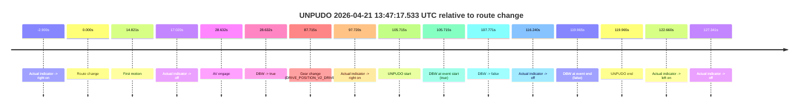
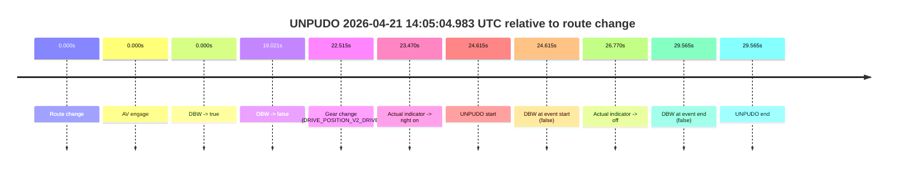
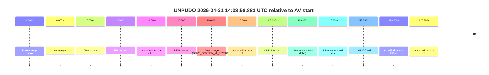
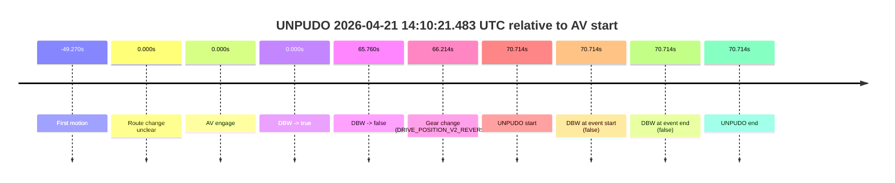
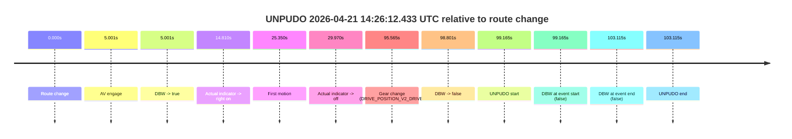

# Run Report: fme20007/2026-04-21--13-31-13--gen2-av-edd2f6bc-fd17-46cf-bafe-1e3feb2422e2

| Field | Value |
|---|---|
| Run ID | `fme20007/2026-04-21--13-31-13--gen2-av-edd2f6bc-fd17-46cf-bafe-1e3feb2422e2` |
| Date | `2026-04-21` |
| Model(s) | `eel-teal-outspoken` |
| Author | `zak` |
| Event count | `5` |

## unpudo 2026-04-21 13:47:17.533 UTC

| Field | Value |
|---|---|
| Model | `eel-teal-outspoken` |
| Author | `zak` |
| Run ID | `fme20007/2026-04-21--13-31-13--gen2-av-edd2f6bc-fd17-46cf-bafe-1e3feb2422e2` |
| Date | `2026-04-21` |
| Time (UTC) | `13:47:17.533` |
| Event type | `unpudo` |
| Disengagement type | `none observed` |
| Route change | `found` |
| Console | [run](https://console.sso.wayve.ai/run/fme20007/2026-04-21--13-31-13--gen2-av-edd2f6bc-fd17-46cf-bafe-1e3feb2422e2?id=&time-unixus=1776779237533293) |
| Foxglove | [segment](https://app.foxglove.dev/wayve-on-prem/p/prj_0dX18KZdVHg1fmmI/view?ds=foxglove-stream&ds.deviceName=fme20007&ds.start=2026-04-21T13%3A45%3A21.818256Z&ds.end=2026-04-21T13%3A47%3A41.783316Z&layoutId=lay_0e7VD4WIKDQGU73Y&time=2026-04-21T13%3A47%3A17.533293Z) |

### Event card: fail

- Fail: the credited unpudo does not stay AV-owned. The event window starts with DBW true, and the maneuver outcome lands outside a clean AV-owned segment.

| Event | Time (UTC) | Delta from route change |
|---|---:|---:|
| Actual indicator -> right on | 2026-04-21 13:45:28.918 | `-2.900s` |
| Route change | 2026-04-21 13:45:31.818 | `0.000s` |
| First motion | 2026-04-21 13:45:46.638 | `14.821s` |
| Actual indicator -> off | 2026-04-21 13:45:48.838 | `17.020s` |
| AV engage | 2026-04-21 13:46:00.450 | `28.632s` |
| DBW -> true | 2026-04-21 13:46:00.450 | `28.632s` |
| Gear change (DRIVE_POSITION_V2_DRIVE) | 2026-04-21 13:46:59.533 | `87.715s` |
| Actual indicator -> right on | 2026-04-21 13:47:09.538 | `97.720s` |
| UNPUDO start | 2026-04-21 13:47:17.533 | `105.715s` |
| DBW at event start (true) | 2026-04-21 13:47:17.533 | `105.715s` |
| DBW -> false | 2026-04-21 13:47:19.589 | `107.771s` |
| Actual indicator -> off | 2026-04-21 13:47:28.058 | `116.240s` |
| DBW at event end (false) | 2026-04-21 13:47:31.783 | `119.965s` |
| UNPUDO end | 2026-04-21 13:47:31.783 | `119.965s` |
| Actual indicator -> left on | 2026-04-21 13:47:34.478 | `122.660s` |
| Actual indicator -> off | 2026-04-21 13:47:39.158 | `127.341s` |

| Metric | Value |
|---|---|
| Outcome | `fail` |
| Effective failure type | `driver_completed_maneuver` |
| Route change status | `found` |
| DBW at event start | `true` |
| DBW at event end | `false` |
| Predicted gear at AV start | `DRIVE_POSITION_V2_DRIVE` |
| Actual gear at AV start | `DRIVE_POSITION_V2_DRIVE` |
| Predicted gear at event start | `DRIVE_POSITION_V2_DRIVE` |
| Actual gear at event start | `DRIVE_POSITION_V2_DRIVE` |
| Planned indicator direction | `INDICATORS_STATE_V2_OFF` |
| Controller indicator direction | `INDICATORS_STATE_V2_OFF` |
| Actual indicator direction | `INDICATORS_STATE_V2_RIGHT_ON` |
| Actual indicator at maneuver end | `INDICATORS_STATE_V2_OFF` |
| Driver accel help in AV | `false` |
| Driver accel help timestamp | `n/a` |
| Max accel pedal pct in AV | `0.0%` |
| Max brake pedal pct in AV | `11.3%` |
| Max speed mps in AV | `7.878` |
| Success timing baseline | `route change` |
| Route -> AV | `28.632s` |
| AV -> event start | `77.083s` |
| AV -> first motion | `-13.812s` |
| Success baseline -> event start | `105.715s` |
| Success baseline -> first motion | `14.821s` |
| AV duration before disengagement | `79.139s` |
| Trajectory waypoint count | `38` |
| Driving-plan step count | `11` |

The scored portion starts from the AV-owned window, not from the pre-AV setup. Route-change search in the stopped pre-event segment was `found`, with the baseline therefore set to route change. At the event anchor the model predicts `DRIVE_POSITION_V2_DRIVE` and the actual gear is `DRIVE_POSITION_V2_DRIVE`. The effective model outcome is `fail` because `driver_completed_maneuver.`

### Resolution

| Field | Value |
|---|---|
| Final outcome | `fail` |
| Do we agree with this label? | `yes` |
| Source disengagement type | `none observed` |
| Resolved effective failure type | `driver_completed_maneuver` |
| Confidence | `high` |

## unpudo 2026-04-21 14:05:04.983 UTC

| Field | Value |
|---|---|
| Model | `eel-teal-outspoken` |
| Author | `zak` |
| Run ID | `fme20007/2026-04-21--13-31-13--gen2-av-edd2f6bc-fd17-46cf-bafe-1e3feb2422e2` |
| Date | `2026-04-21` |
| Time (UTC) | `14:05:04.983` |
| Event type | `unpudo` |
| Disengagement type | `none observed` |
| Route change | `found` |
| Console | [run](https://console.sso.wayve.ai/run/fme20007/2026-04-21--13-31-13--gen2-av-edd2f6bc-fd17-46cf-bafe-1e3feb2422e2?id=&time-unixus=1776780304983320) |
| Foxglove | [segment](https://app.foxglove.dev/wayve-on-prem/p/prj_0dX18KZdVHg1fmmI/view?ds=foxglove-stream&ds.deviceName=fme20007&ds.start=2026-04-21T14%3A04%3A30.368336Z&ds.end=2026-04-21T14%3A05%3A19.933311Z&layoutId=lay_0e7VD4WIKDQGU73Y&time=2026-04-21T14%3A05%3A04.983320Z) |

### Event card: fail

- Fail: the credited unpudo does not stay AV-owned. The event window starts with DBW false, and the maneuver outcome lands outside a clean AV-owned segment.

| Event | Time (UTC) | Delta from route change |
|---|---:|---:|
| Route change | 2026-04-21 14:04:40.368 | `0.000s` |
| AV engage | 2026-04-21 14:04:40.368 | `0.000s` |
| DBW -> true | 2026-04-21 14:04:40.368 | `0.000s` |
| DBW -> false | 2026-04-21 14:04:59.389 | `19.021s` |
| Gear change (DRIVE_POSITION_V2_DRIVE) | 2026-04-21 14:05:02.883 | `22.515s` |
| Actual indicator -> right on | 2026-04-21 14:05:03.838 | `23.470s` |
| UNPUDO start | 2026-04-21 14:05:04.983 | `24.615s` |
| DBW at event start (false) | 2026-04-21 14:05:04.983 | `24.615s` |
| Actual indicator -> off | 2026-04-21 14:05:07.138 | `26.770s` |
| DBW at event end (false) | 2026-04-21 14:05:09.933 | `29.565s` |
| UNPUDO end | 2026-04-21 14:05:09.933 | `29.565s` |

| Metric | Value |
|---|---|
| Outcome | `fail` |
| Effective failure type | `not_av_owned` |
| Route change status | `found` |
| DBW at event start | `false` |
| DBW at event end | `false` |
| Predicted gear at AV start | `DRIVE_POSITION_V2_PARK` |
| Actual gear at AV start | `DRIVE_POSITION_V2_PARK` |
| Predicted gear at event start | `DRIVE_POSITION_V2_DRIVE` |
| Actual gear at event start | `DRIVE_POSITION_V2_DRIVE` |
| Planned indicator direction | `INDICATORS_STATE_V2_RIGHT_ON` |
| Controller indicator direction | `INDICATORS_STATE_V2_RIGHT_ON` |
| Actual indicator direction | `INDICATORS_STATE_V2_RIGHT_ON` |
| Actual indicator at maneuver end | `INDICATORS_STATE_V2_OFF` |
| Driver accel help in AV | `false` |
| Driver accel help timestamp | `n/a` |
| Max accel pedal pct in AV | `0.0%` |
| Max brake pedal pct in AV | `8.0%` |
| Max speed mps in AV | `0.000` |
| Success timing baseline | `route change` |
| Route -> AV | `0.000s` |
| AV -> event start | `24.615s` |
| AV -> first motion | `n/a` |
| Success baseline -> event start | `24.615s` |
| Success baseline -> first motion | `n/a` |
| AV duration before disengagement | `19.021s` |
| Trajectory waypoint count | `37` |
| Driving-plan step count | `11` |

The scored portion starts from the AV-owned window, not from the pre-AV setup. Route-change search in the stopped pre-event segment was `found`, with the baseline therefore set to route change. At the event anchor the model predicts `DRIVE_POSITION_V2_DRIVE` and the actual gear is `DRIVE_POSITION_V2_DRIVE`. The effective model outcome is `fail` because `not_av_owned.`

### Resolution

| Field | Value |
|---|---|
| Final outcome | `fail` |
| Do we agree with this label? | `yes` |
| Source disengagement type | `none observed` |
| Resolved effective failure type | `not_av_owned` |
| Confidence | `high` |

## unpudo 2026-04-21 14:08:58.883 UTC

| Field | Value |
|---|---|
| Model | `eel-teal-outspoken` |
| Author | `zak` |
| Run ID | `fme20007/2026-04-21--13-31-13--gen2-av-edd2f6bc-fd17-46cf-bafe-1e3feb2422e2` |
| Date | `2026-04-21` |
| Time (UTC) | `14:08:58.883` |
| Event type | `unpudo` |
| Disengagement type | `none observed` |
| Route change | `unclear` |
| Console | [run](https://console.sso.wayve.ai/run/fme20007/2026-04-21--13-31-13--gen2-av-edd2f6bc-fd17-46cf-bafe-1e3feb2422e2?id=&time-unixus=1776780538883299) |
| Foxglove | [segment](https://app.foxglove.dev/wayve-on-prem/p/prj_0dX18KZdVHg1fmmI/view?ds=foxglove-stream&ds.deviceName=fme20007&ds.start=2026-04-21T14%3A06%3A48.890328Z&ds.end=2026-04-21T14%3A09%3A08.883299Z&layoutId=lay_0e7VD4WIKDQGU73Y&time=2026-04-21T14%3A08%3A58.883299Z) |

### Event card: fail

- Fail: the credited unpudo does not stay AV-owned. The event window starts with DBW false, and the maneuver outcome lands outside a clean AV-owned segment.

| Event | Time (UTC) | Delta from AV start |
|---|---:|---:|
| Route change unclear | 2026-04-21 14:06:58.890 | `0.000s` |
| AV engage | 2026-04-21 14:06:58.890 | `0.000s` |
| DBW -> true | 2026-04-21 14:06:58.890 | `0.000s` |
| First motion | 2026-04-21 14:07:02.039 | `3.149s` |
| Actual indicator -> left on | 2026-04-21 14:08:49.458 | `110.568s` |
| DBW -> false | 2026-04-21 14:08:52.449 | `113.560s` |
| Gear change (DRIVE_POSITION_V2_REVERSE) | 2026-04-21 14:08:55.383 | `116.493s` |
| Actual indicator -> off | 2026-04-21 14:08:56.238 | `117.348s` |
| UNPUDO start | 2026-04-21 14:08:58.883 | `119.993s` |
| DBW at event start (false) | 2026-04-21 14:08:58.883 | `119.993s` |
| DBW at event end (false) | 2026-04-21 14:08:58.883 | `119.993s` |
| UNPUDO end | 2026-04-21 14:08:58.883 | `119.993s` |
| Actual indicator -> left on | 2026-04-21 14:08:59.778 | `120.888s` |
| Actual indicator -> off | 2026-04-21 14:09:05.678 | `126.788s` |

| Metric | Value |
|---|---|
| Outcome | `fail` |
| Effective failure type | `not_av_owned` |
| Route change status | `unclear` |
| DBW at event start | `false` |
| DBW at event end | `false` |
| Predicted gear at AV start | `DRIVE_POSITION_V2_DRIVE` |
| Actual gear at AV start | `DRIVE_POSITION_V2_DRIVE` |
| Predicted gear at event start | `DRIVE_POSITION_V2_REVERSE` |
| Actual gear at event start | `DRIVE_POSITION_V2_REVERSE` |
| Planned indicator direction | `INDICATORS_STATE_V2_OFF` |
| Controller indicator direction | `INDICATORS_STATE_V2_OFF` |
| Actual indicator direction | `INDICATORS_STATE_V2_OFF` |
| Actual indicator at maneuver end | `INDICATORS_STATE_V2_OFF` |
| Driver accel help in AV | `false` |
| Driver accel help timestamp | `n/a` |
| Max accel pedal pct in AV | `0.0%` |
| Max brake pedal pct in AV | `15.5%` |
| Max speed mps in AV | `7.383` |
| Success timing baseline | `AV start` |
| Route -> AV | `n/a` |
| AV -> event start | `119.993s` |
| AV -> first motion | `3.149s` |
| Success baseline -> event start | `119.993s` |
| Success baseline -> first motion | `3.149s` |
| AV duration before disengagement | `113.560s` |
| Trajectory waypoint count | `37` |
| Driving-plan step count | `11` |

The scored portion starts from the AV-owned window, not from the pre-AV setup. Route-change search in the stopped pre-event segment was `unclear`, with the baseline therefore set to AV start. At the event anchor the model predicts `DRIVE_POSITION_V2_REVERSE` and the actual gear is `DRIVE_POSITION_V2_REVERSE`. The effective model outcome is `fail` because `not_av_owned.`

### Resolution

| Field | Value |
|---|---|
| Final outcome | `fail` |
| Do we agree with this label? | `yes` |
| Source disengagement type | `none observed` |
| Resolved effective failure type | `not_av_owned` |
| Confidence | `medium` |

## unpudo 2026-04-21 14:10:21.483 UTC

| Field | Value |
|---|---|
| Model | `eel-teal-outspoken` |
| Author | `zak` |
| Run ID | `fme20007/2026-04-21--13-31-13--gen2-av-edd2f6bc-fd17-46cf-bafe-1e3feb2422e2` |
| Date | `2026-04-21` |
| Time (UTC) | `14:10:21.483` |
| Event type | `unpudo` |
| Disengagement type | `none observed` |
| Route change | `unclear` |
| Console | [run](https://console.sso.wayve.ai/run/fme20007/2026-04-21--13-31-13--gen2-av-edd2f6bc-fd17-46cf-bafe-1e3feb2422e2?id=&time-unixus=1776780621483313) |
| Foxglove | [segment](https://app.foxglove.dev/wayve-on-prem/p/prj_0dX18KZdVHg1fmmI/view?ds=foxglove-stream&ds.deviceName=fme20007&ds.start=2026-04-21T14%3A09%3A00.769182Z&ds.end=2026-04-21T14%3A10%3A31.483313Z&layoutId=lay_0e7VD4WIKDQGU73Y&time=2026-04-21T14%3A10%3A21.483313Z) |

### Event card: fail

- Fail: the credited unpudo does not stay AV-owned. The event window starts with DBW false, and the maneuver outcome lands outside a clean AV-owned segment.

| Event | Time (UTC) | Delta from AV start |
|---|---:|---:|
| First motion | 2026-04-21 14:08:21.499 | `-49.270s` |
| Route change unclear | 2026-04-21 14:09:10.769 | `0.000s` |
| AV engage | 2026-04-21 14:09:10.769 | `0.000s` |
| DBW -> true | 2026-04-21 14:09:10.769 | `0.000s` |
| DBW -> false | 2026-04-21 14:10:16.529 | `65.760s` |
| Gear change (DRIVE_POSITION_V2_REVERSE) | 2026-04-21 14:10:16.983 | `66.214s` |
| UNPUDO start | 2026-04-21 14:10:21.483 | `70.714s` |
| DBW at event start (false) | 2026-04-21 14:10:21.483 | `70.714s` |
| DBW at event end (false) | 2026-04-21 14:10:21.483 | `70.714s` |
| UNPUDO end | 2026-04-21 14:10:21.483 | `70.714s` |

| Metric | Value |
|---|---|
| Outcome | `fail` |
| Effective failure type | `completed_outside_av` |
| Route change status | `unclear` |
| DBW at event start | `false` |
| DBW at event end | `false` |
| Predicted gear at AV start | `DRIVE_POSITION_V2_DRIVE` |
| Actual gear at AV start | `DRIVE_POSITION_V2_DRIVE` |
| Predicted gear at event start | `DRIVE_POSITION_V2_REVERSE` |
| Actual gear at event start | `DRIVE_POSITION_V2_REVERSE` |
| Planned indicator direction | `INDICATORS_STATE_V2_OFF` |
| Controller indicator direction | `INDICATORS_STATE_V2_OFF` |
| Actual indicator direction | `INDICATORS_STATE_V2_OFF` |
| Actual indicator at maneuver end | `INDICATORS_STATE_V2_OFF` |
| Driver accel help in AV | `false` |
| Driver accel help timestamp | `n/a` |
| Max accel pedal pct in AV | `0.0%` |
| Max brake pedal pct in AV | `9.6%` |
| Max speed mps in AV | `1.533` |
| Success timing baseline | `AV start` |
| Route -> AV | `n/a` |
| AV -> event start | `70.714s` |
| AV -> first motion | `-49.270s` |
| Success baseline -> event start | `70.714s` |
| Success baseline -> first motion | `-49.270s` |
| AV duration before disengagement | `65.760s` |
| Trajectory waypoint count | `37` |
| Driving-plan step count | `11` |

The scored portion starts from the AV-owned window, not from the pre-AV setup. Route-change search in the stopped pre-event segment was `unclear`, with the baseline therefore set to AV start. At the event anchor the model predicts `DRIVE_POSITION_V2_REVERSE` and the actual gear is `DRIVE_POSITION_V2_REVERSE`. The effective model outcome is `fail` because `completed_outside_av.`

### Resolution

| Field | Value |
|---|---|
| Final outcome | `fail` |
| Do we agree with this label? | `yes` |
| Source disengagement type | `none observed` |
| Resolved effective failure type | `completed_outside_av` |
| Confidence | `medium` |

## unpudo 2026-04-21 14:26:12.433 UTC

| Field | Value |
|---|---|
| Model | `eel-teal-outspoken` |
| Author | `zak` |
| Run ID | `fme20007/2026-04-21--13-31-13--gen2-av-edd2f6bc-fd17-46cf-bafe-1e3feb2422e2` |
| Date | `2026-04-21` |
| Time (UTC) | `14:26:12.433` |
| Event type | `unpudo` |
| Disengagement type | `none observed` |
| Route change | `found` |
| Console | [run](https://console.sso.wayve.ai/run/fme20007/2026-04-21--13-31-13--gen2-av-edd2f6bc-fd17-46cf-bafe-1e3feb2422e2?id=&time-unixus=1776781572433303) |
| Foxglove | [segment](https://app.foxglove.dev/wayve-on-prem/p/prj_0dX18KZdVHg1fmmI/view?ds=foxglove-stream&ds.deviceName=fme20007&ds.start=2026-04-21T14%3A24%3A23.268277Z&ds.end=2026-04-21T14%3A26%3A26.383304Z&layoutId=lay_0e7VD4WIKDQGU73Y&time=2026-04-21T14%3A26%3A12.433303Z) |

### Event card: fail

- Fail: the credited unpudo does not stay AV-owned. The event window starts with DBW false, and the maneuver outcome lands outside a clean AV-owned segment.

| Event | Time (UTC) | Delta from route change |
|---|---:|---:|
| Route change | 2026-04-21 14:24:33.268 | `0.000s` |
| AV engage | 2026-04-21 14:24:38.269 | `5.001s` |
| DBW -> true | 2026-04-21 14:24:38.269 | `5.001s` |
| Actual indicator -> right on | 2026-04-21 14:24:48.078 | `14.810s` |
| First motion | 2026-04-21 14:24:58.618 | `25.350s` |
| Actual indicator -> off | 2026-04-21 14:25:03.238 | `29.970s` |
| Gear change (DRIVE_POSITION_V2_DRIVE) | 2026-04-21 14:26:08.833 | `95.565s` |
| DBW -> false | 2026-04-21 14:26:12.069 | `98.801s` |
| UNPUDO start | 2026-04-21 14:26:12.433 | `99.165s` |
| DBW at event start (false) | 2026-04-21 14:26:12.433 | `99.165s` |
| DBW at event end (false) | 2026-04-21 14:26:16.383 | `103.115s` |
| UNPUDO end | 2026-04-21 14:26:16.383 | `103.115s` |

| Metric | Value |
|---|---|
| Outcome | `fail` |
| Effective failure type | `not_av_owned` |
| Route change status | `found` |
| DBW at event start | `false` |
| DBW at event end | `false` |
| Predicted gear at AV start | `DRIVE_POSITION_V2_DRIVE` |
| Actual gear at AV start | `DRIVE_POSITION_V2_PARK` |
| Predicted gear at event start | `DRIVE_POSITION_V2_DRIVE` |
| Actual gear at event start | `DRIVE_POSITION_V2_DRIVE` |
| Planned indicator direction | `INDICATORS_STATE_V2_OFF` |
| Controller indicator direction | `INDICATORS_STATE_V2_OFF` |
| Actual indicator direction | `INDICATORS_STATE_V2_OFF` |
| Actual indicator at maneuver end | `INDICATORS_STATE_V2_OFF` |
| Driver accel help in AV | `false` |
| Driver accel help timestamp | `n/a` |
| Max accel pedal pct in AV | `0.0%` |
| Max brake pedal pct in AV | `16.4%` |
| Max speed mps in AV | `6.478` |
| Success timing baseline | `route change` |
| Route -> AV | `5.001s` |
| AV -> event start | `94.164s` |
| AV -> first motion | `20.349s` |
| Success baseline -> event start | `99.165s` |
| Success baseline -> first motion | `25.350s` |
| AV duration before disengagement | `93.800s` |
| Trajectory waypoint count | `38` |
| Driving-plan step count | `11` |

The scored portion starts from the AV-owned window, not from the pre-AV setup. Route-change search in the stopped pre-event segment was `found`, with the baseline therefore set to route change. At the event anchor the model predicts `DRIVE_POSITION_V2_DRIVE` and the actual gear is `DRIVE_POSITION_V2_DRIVE`. The effective model outcome is `fail` because `not_av_owned.`

### Resolution

| Field | Value |
|---|---|
| Final outcome | `fail` |
| Do we agree with this label? | `yes` |
| Source disengagement type | `none observed` |
| Resolved effective failure type | `not_av_owned` |
| Confidence | `high` |
