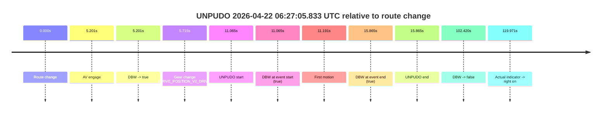
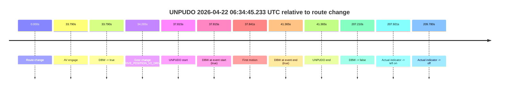
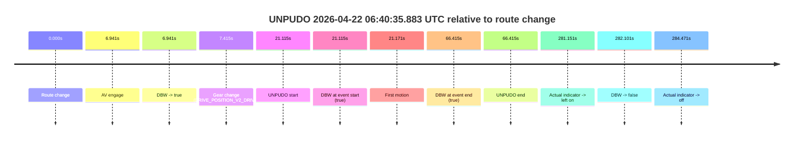
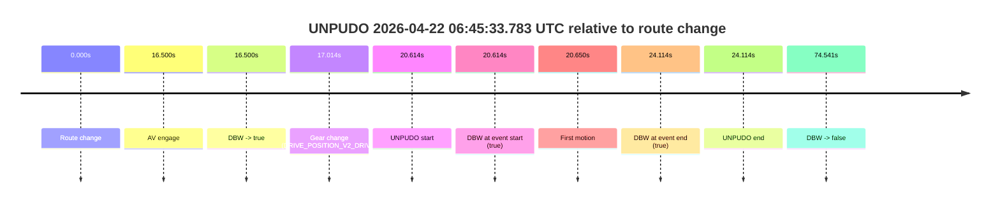
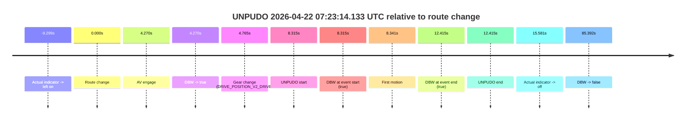

# Run Report: fme20007/2026-04-22--06-17-14--gen2-av-6ea29284-9966-4114-b345-e3b9cc7cfbb4

| Field | Value |
|---|---|
| Run ID | `fme20007/2026-04-22--06-17-14--gen2-av-6ea29284-9966-4114-b345-e3b9cc7cfbb4` |
| Date | `2026-04-22` |
| Model(s) | `eel-teal-outspoken` |
| Author | `zak` |
| Event count | `6` |

## unpudo 2026-04-22 06:27:05.833 UTC

| Field | Value |
|---|---|
| Model | `eel-teal-outspoken` |
| Author | `zak` |
| Run ID | `fme20007/2026-04-22--06-17-14--gen2-av-6ea29284-9966-4114-b345-e3b9cc7cfbb4` |
| Date | `2026-04-22` |
| Time (UTC) | `06:27:05.833` |
| Event type | `unpudo` |
| Disengagement type | `none observed` |
| Route change | `found` |
| Console | [run](https://console.sso.wayve.ai/run/fme20007/2026-04-22--06-17-14--gen2-av-6ea29284-9966-4114-b345-e3b9cc7cfbb4?id=&time-unixus=1776839225833313) |
| Foxglove | [segment](https://app.foxglove.dev/wayve-on-prem/p/prj_0dX18KZdVHg1fmmI/view?ds=foxglove-stream&ds.deviceName=fme20007&ds.start=2026-04-22T06%3A26%3A44.768219Z&ds.end=2026-04-22T06%3A28%3A47.188594Z&layoutId=lay_0e7VD4WIKDQGU73Y&time=2026-04-22T06%3A27%3A05.833313Z) |

### Event card: pass

- Pass: AV owns the credited unpudo from route change through the official unpudo window, the gear state is aligned at the anchor, and the vehicle moves without driver accelerator help in AV.

| Event | Time (UTC) | Delta from route change |
|---|---:|---:|
| Route change | 2026-04-22 06:26:54.768 | `0.000s` |
| AV engage | 2026-04-22 06:26:59.968 | `5.201s` |
| DBW -> true | 2026-04-22 06:26:59.968 | `5.201s` |
| Gear change (DRIVE_POSITION_V2_DRIVE) | 2026-04-22 06:27:00.483 | `5.715s` |
| UNPUDO start | 2026-04-22 06:27:05.833 | `11.065s` |
| DBW at event start (true) | 2026-04-22 06:27:05.833 | `11.065s` |
| First motion | 2026-04-22 06:27:05.958 | `11.191s` |
| DBW at event end (true) | 2026-04-22 06:27:10.633 | `15.865s` |
| UNPUDO end | 2026-04-22 06:27:10.633 | `15.865s` |
| DBW -> false | 2026-04-22 06:28:37.188 | `102.420s` |
| Actual indicator -> right on | 2026-04-22 06:28:54.739 | `119.971s` |

| Metric | Value |
|---|---|
| Outcome | `pass` |
| Effective failure type | `none` |
| Route change status | `found` |
| DBW at event start | `true` |
| DBW at event end | `true` |
| Predicted gear at AV start | `DRIVE_POSITION_V2_DRIVE` |
| Actual gear at AV start | `DRIVE_POSITION_V2_PARK` |
| Predicted gear at event start | `DRIVE_POSITION_V2_DRIVE` |
| Actual gear at event start | `DRIVE_POSITION_V2_DRIVE` |
| Planned indicator direction | `INDICATORS_STATE_V2_LEFT_ON` |
| Controller indicator direction | `INDICATORS_STATE_V2_LEFT_ON` |
| Actual indicator direction | `INDICATORS_STATE_V2_OFF` |
| Actual indicator at maneuver end | `INDICATORS_STATE_V2_OFF` |
| Driver accel help in AV | `false` |
| Driver accel help timestamp | `n/a` |
| Max accel pedal pct in AV | `0.0%` |
| Max brake pedal pct in AV | `8.0%` |
| Max speed mps in AV | `3.875` |
| Success timing baseline | `route change` |
| Route -> AV | `5.201s` |
| AV -> event start | `5.865s` |
| AV -> first motion | `5.990s` |
| Success baseline -> event start | `11.065s` |
| Success baseline -> first motion | `11.191s` |
| AV duration before disengagement | `97.220s` |
| Trajectory waypoint count | `38` |
| Driving-plan step count | `11` |

The scored portion starts from the AV-owned window, not from the pre-AV setup. Route-change search in the stopped pre-event segment was `found`, with the baseline therefore set to route change. At the event anchor the model predicts `DRIVE_POSITION_V2_DRIVE` and the actual gear is `DRIVE_POSITION_V2_DRIVE`. The effective model outcome is `pass` because `the credited unpudo stays AV-owned through the official unpudo window.`

### Resolution

| Field | Value |
|---|---|
| Final outcome | `pass` |
| Do we agree with this label? | `yes` |
| Source disengagement type | `none observed` |
| Resolved effective failure type | `none` |
| Confidence | `high` |

## unpudo 2026-04-22 06:34:45.233 UTC

| Field | Value |
|---|---|
| Model | `eel-teal-outspoken` |
| Author | `zak` |
| Run ID | `fme20007/2026-04-22--06-17-14--gen2-av-6ea29284-9966-4114-b345-e3b9cc7cfbb4` |
| Date | `2026-04-22` |
| Time (UTC) | `06:34:45.233` |
| Event type | `unpudo` |
| Disengagement type | `none observed` |
| Route change | `found` |
| Console | [run](https://console.sso.wayve.ai/run/fme20007/2026-04-22--06-17-14--gen2-av-6ea29284-9966-4114-b345-e3b9cc7cfbb4?id=&time-unixus=1776839685233311) |
| Foxglove | [segment](https://app.foxglove.dev/wayve-on-prem/p/prj_0dX18KZdVHg1fmmI/view?ds=foxglove-stream&ds.deviceName=fme20007&ds.start=2026-04-22T06%3A33%3A57.418532Z&ds.end=2026-04-22T06%3A37%3A44.628669Z&layoutId=lay_0e7VD4WIKDQGU73Y&time=2026-04-22T06%3A34%3A45.233311Z) |

### Event card: pass

- Pass: AV owns the credited unpudo from route change through the official unpudo window, the gear state is aligned at the anchor, and the vehicle moves without driver accelerator help in AV.

| Event | Time (UTC) | Delta from route change |
|---|---:|---:|
| Route change | 2026-04-22 06:34:07.418 | `0.000s` |
| AV engage | 2026-04-22 06:34:41.208 | `33.790s` |
| DBW -> true | 2026-04-22 06:34:41.208 | `33.790s` |
| Gear change (DRIVE_POSITION_V2_DRIVE) | 2026-04-22 06:34:41.683 | `34.265s` |
| UNPUDO start | 2026-04-22 06:34:45.233 | `37.815s` |
| DBW at event start (true) | 2026-04-22 06:34:45.233 | `37.815s` |
| First motion | 2026-04-22 06:34:45.259 | `37.841s` |
| DBW at event end (true) | 2026-04-22 06:34:48.783 | `41.365s` |
| UNPUDO end | 2026-04-22 06:34:48.783 | `41.365s` |
| DBW -> false | 2026-04-22 06:37:34.628 | `207.210s` |
| Actual indicator -> left on | 2026-04-22 06:37:35.339 | `207.921s` |
| Actual indicator -> off | 2026-04-22 06:37:37.198 | `209.780s` |

| Metric | Value |
|---|---|
| Outcome | `pass` |
| Effective failure type | `none` |
| Route change status | `found` |
| DBW at event start | `true` |
| DBW at event end | `true` |
| Predicted gear at AV start | `DRIVE_POSITION_V2_DRIVE` |
| Actual gear at AV start | `DRIVE_POSITION_V2_PARK` |
| Predicted gear at event start | `DRIVE_POSITION_V2_DRIVE` |
| Actual gear at event start | `DRIVE_POSITION_V2_DRIVE` |
| Planned indicator direction | `INDICATORS_STATE_V2_RIGHT_ON` |
| Controller indicator direction | `INDICATORS_STATE_V2_RIGHT_ON` |
| Actual indicator direction | `INDICATORS_STATE_V2_OFF` |
| Actual indicator at maneuver end | `INDICATORS_STATE_V2_OFF` |
| Driver accel help in AV | `false` |
| Driver accel help timestamp | `n/a` |
| Max accel pedal pct in AV | `0.0%` |
| Max brake pedal pct in AV | `8.0%` |
| Max speed mps in AV | `5.100` |
| Success timing baseline | `route change` |
| Route -> AV | `33.790s` |
| AV -> event start | `4.024s` |
| AV -> first motion | `4.050s` |
| Success baseline -> event start | `37.815s` |
| Success baseline -> first motion | `37.841s` |
| AV duration before disengagement | `173.420s` |
| Trajectory waypoint count | `38` |
| Driving-plan step count | `11` |

The scored portion starts from the AV-owned window, not from the pre-AV setup. Route-change search in the stopped pre-event segment was `found`, with the baseline therefore set to route change. At the event anchor the model predicts `DRIVE_POSITION_V2_DRIVE` and the actual gear is `DRIVE_POSITION_V2_DRIVE`. The effective model outcome is `pass` because `the credited unpudo stays AV-owned through the official unpudo window.`

### Resolution

| Field | Value |
|---|---|
| Final outcome | `pass` |
| Do we agree with this label? | `yes` |
| Source disengagement type | `none observed` |
| Resolved effective failure type | `none` |
| Confidence | `high` |

## unpudo 2026-04-22 06:40:35.883 UTC

| Field | Value |
|---|---|
| Model | `eel-teal-outspoken` |
| Author | `zak` |
| Run ID | `fme20007/2026-04-22--06-17-14--gen2-av-6ea29284-9966-4114-b345-e3b9cc7cfbb4` |
| Date | `2026-04-22` |
| Time (UTC) | `06:40:35.883` |
| Event type | `unpudo` |
| Disengagement type | `none observed` |
| Route change | `found` |
| Console | [run](https://console.sso.wayve.ai/run/fme20007/2026-04-22--06-17-14--gen2-av-6ea29284-9966-4114-b345-e3b9cc7cfbb4?id=&time-unixus=1776840035883314) |
| Foxglove | [segment](https://app.foxglove.dev/wayve-on-prem/p/prj_0dX18KZdVHg1fmmI/view?ds=foxglove-stream&ds.deviceName=fme20007&ds.start=2026-04-22T06%3A40%3A04.768343Z&ds.end=2026-04-22T06%3A45%3A06.869802Z&layoutId=lay_0e7VD4WIKDQGU73Y&time=2026-04-22T06%3A40%3A35.883314Z) |

### Event card: pass

- Pass: AV owns the credited unpudo from route change through the official unpudo window, the gear state is aligned at the anchor, and the vehicle moves without driver accelerator help in AV.

| Event | Time (UTC) | Delta from route change |
|---|---:|---:|
| Route change | 2026-04-22 06:40:14.768 | `0.000s` |
| AV engage | 2026-04-22 06:40:21.708 | `6.941s` |
| DBW -> true | 2026-04-22 06:40:21.708 | `6.941s` |
| Gear change (DRIVE_POSITION_V2_DRIVE) | 2026-04-22 06:40:22.183 | `7.415s` |
| UNPUDO start | 2026-04-22 06:40:35.883 | `21.115s` |
| DBW at event start (true) | 2026-04-22 06:40:35.883 | `21.115s` |
| First motion | 2026-04-22 06:40:35.938 | `21.171s` |
| DBW at event end (true) | 2026-04-22 06:41:21.183 | `66.415s` |
| UNPUDO end | 2026-04-22 06:41:21.183 | `66.415s` |
| Actual indicator -> left on | 2026-04-22 06:44:55.919 | `281.151s` |
| DBW -> false | 2026-04-22 06:44:56.869 | `282.101s` |
| Actual indicator -> off | 2026-04-22 06:44:59.239 | `284.471s` |

| Metric | Value |
|---|---|
| Outcome | `pass` |
| Effective failure type | `none` |
| Route change status | `found` |
| DBW at event start | `true` |
| DBW at event end | `true` |
| Predicted gear at AV start | `DRIVE_POSITION_V2_DRIVE` |
| Actual gear at AV start | `DRIVE_POSITION_V2_PARK` |
| Predicted gear at event start | `DRIVE_POSITION_V2_DRIVE` |
| Actual gear at event start | `DRIVE_POSITION_V2_DRIVE` |
| Planned indicator direction | `INDICATORS_STATE_V2_RIGHT_ON` |
| Controller indicator direction | `INDICATORS_STATE_V2_RIGHT_ON` |
| Actual indicator direction | `INDICATORS_STATE_V2_OFF` |
| Actual indicator at maneuver end | `INDICATORS_STATE_V2_OFF` |
| Driver accel help in AV | `false` |
| Driver accel help timestamp | `n/a` |
| Max accel pedal pct in AV | `0.0%` |
| Max brake pedal pct in AV | `12.1%` |
| Max speed mps in AV | `2.336` |
| Success timing baseline | `route change` |
| Route -> AV | `6.941s` |
| AV -> event start | `14.174s` |
| AV -> first motion | `14.230s` |
| Success baseline -> event start | `21.115s` |
| Success baseline -> first motion | `21.171s` |
| AV duration before disengagement | `275.161s` |
| Trajectory waypoint count | `37` |
| Driving-plan step count | `11` |

The scored portion starts from the AV-owned window, not from the pre-AV setup. Route-change search in the stopped pre-event segment was `found`, with the baseline therefore set to route change. At the event anchor the model predicts `DRIVE_POSITION_V2_DRIVE` and the actual gear is `DRIVE_POSITION_V2_DRIVE`. The effective model outcome is `pass` because `the credited unpudo stays AV-owned through the official unpudo window.`

### Resolution

| Field | Value |
|---|---|
| Final outcome | `pass` |
| Do we agree with this label? | `yes` |
| Source disengagement type | `none observed` |
| Resolved effective failure type | `none` |
| Confidence | `high` |

## unpudo 2026-04-22 06:45:33.783 UTC

| Field | Value |
|---|---|
| Model | `eel-teal-outspoken` |
| Author | `zak` |
| Run ID | `fme20007/2026-04-22--06-17-14--gen2-av-6ea29284-9966-4114-b345-e3b9cc7cfbb4` |
| Date | `2026-04-22` |
| Time (UTC) | `06:45:33.783` |
| Event type | `unpudo` |
| Disengagement type | `none observed` |
| Route change | `found` |
| Console | [run](https://console.sso.wayve.ai/run/fme20007/2026-04-22--06-17-14--gen2-av-6ea29284-9966-4114-b345-e3b9cc7cfbb4?id=&time-unixus=1776840333783291) |
| Foxglove | [segment](https://app.foxglove.dev/wayve-on-prem/p/prj_0dX18KZdVHg1fmmI/view?ds=foxglove-stream&ds.deviceName=fme20007&ds.start=2026-04-22T06%3A45%3A03.169276Z&ds.end=2026-04-22T06%3A46%3A37.710182Z&layoutId=lay_0e7VD4WIKDQGU73Y&time=2026-04-22T06%3A45%3A33.783291Z) |

### Event card: pass

- Pass: AV owns the credited unpudo from route change through the official unpudo window, the gear state is aligned at the anchor, and the vehicle moves without driver accelerator help in AV.

| Event | Time (UTC) | Delta from route change |
|---|---:|---:|
| Route change | 2026-04-22 06:45:13.169 | `0.000s` |
| AV engage | 2026-04-22 06:45:29.668 | `16.500s` |
| DBW -> true | 2026-04-22 06:45:29.668 | `16.500s` |
| Gear change (DRIVE_POSITION_V2_DRIVE) | 2026-04-22 06:45:30.183 | `17.014s` |
| UNPUDO start | 2026-04-22 06:45:33.783 | `20.614s` |
| DBW at event start (true) | 2026-04-22 06:45:33.783 | `20.614s` |
| First motion | 2026-04-22 06:45:33.818 | `20.650s` |
| DBW at event end (true) | 2026-04-22 06:45:37.283 | `24.114s` |
| UNPUDO end | 2026-04-22 06:45:37.283 | `24.114s` |
| DBW -> false | 2026-04-22 06:46:27.710 | `74.541s` |

| Metric | Value |
|---|---|
| Outcome | `pass` |
| Effective failure type | `none` |
| Route change status | `found` |
| DBW at event start | `true` |
| DBW at event end | `true` |
| Predicted gear at AV start | `DRIVE_POSITION_V2_DRIVE` |
| Actual gear at AV start | `DRIVE_POSITION_V2_PARK` |
| Predicted gear at event start | `DRIVE_POSITION_V2_DRIVE` |
| Actual gear at event start | `DRIVE_POSITION_V2_DRIVE` |
| Planned indicator direction | `INDICATORS_STATE_V2_RIGHT_ON` |
| Controller indicator direction | `INDICATORS_STATE_V2_RIGHT_ON` |
| Actual indicator direction | `INDICATORS_STATE_V2_OFF` |
| Actual indicator at maneuver end | `INDICATORS_STATE_V2_OFF` |
| Driver accel help in AV | `false` |
| Driver accel help timestamp | `n/a` |
| Max accel pedal pct in AV | `0.0%` |
| Max brake pedal pct in AV | `9.9%` |
| Max speed mps in AV | `4.661` |
| Success timing baseline | `route change` |
| Route -> AV | `16.500s` |
| AV -> event start | `4.114s` |
| AV -> first motion | `4.150s` |
| Success baseline -> event start | `20.614s` |
| Success baseline -> first motion | `20.650s` |
| AV duration before disengagement | `58.041s` |
| Trajectory waypoint count | `37` |
| Driving-plan step count | `11` |

The scored portion starts from the AV-owned window, not from the pre-AV setup. Route-change search in the stopped pre-event segment was `found`, with the baseline therefore set to route change. At the event anchor the model predicts `DRIVE_POSITION_V2_DRIVE` and the actual gear is `DRIVE_POSITION_V2_DRIVE`. The effective model outcome is `pass` because `the credited unpudo stays AV-owned through the official unpudo window.`

### Resolution

| Field | Value |
|---|---|
| Final outcome | `pass` |
| Do we agree with this label? | `yes` |
| Source disengagement type | `none observed` |
| Resolved effective failure type | `none` |
| Confidence | `high` |

## unpudo 2026-04-22 06:48:23.483 UTC

| Field | Value |
|---|---|
| Model | `eel-teal-outspoken` |
| Author | `zak` |
| Run ID | `fme20007/2026-04-22--06-17-14--gen2-av-6ea29284-9966-4114-b345-e3b9cc7cfbb4` |
| Date | `2026-04-22` |
| Time (UTC) | `06:48:23.483` |
| Event type | `unpudo` |
| Disengagement type | `none observed` |
| Route change | `found` |
| Console | [run](https://console.sso.wayve.ai/run/fme20007/2026-04-22--06-17-14--gen2-av-6ea29284-9966-4114-b345-e3b9cc7cfbb4?id=&time-unixus=1776840503483294) |
| Foxglove | [segment](https://app.foxglove.dev/wayve-on-prem/p/prj_0dX18KZdVHg1fmmI/view?ds=foxglove-stream&ds.deviceName=fme20007&ds.start=2026-04-22T06%3A47%3A48.268295Z&ds.end=2026-04-22T06%3A50%3A21.569880Z&layoutId=lay_0e7VD4WIKDQGU73Y&time=2026-04-22T06%3A48%3A23.483294Z) |

### Event card: pass

- Pass: AV owns the credited unpudo from route change through the official unpudo window, the gear state is aligned at the anchor, and the vehicle moves without driver accelerator help in AV.

| Event | Time (UTC) | Delta from route change |
|---|---:|---:|
| Route change | 2026-04-22 06:47:58.268 | `0.000s` |
| AV engage | 2026-04-22 06:47:58.278 | `0.010s` |
| DBW -> true | 2026-04-22 06:47:58.278 | `0.010s` |
| Gear change (DRIVE_POSITION_V2_DRIVE) | 2026-04-22 06:47:58.683 | `0.415s` |
| UNPUDO start | 2026-04-22 06:48:23.483 | `25.215s` |
| DBW at event start (true) | 2026-04-22 06:48:23.483 | `25.215s` |
| First motion | 2026-04-22 06:48:23.499 | `25.231s` |
| DBW at event end (true) | 2026-04-22 06:48:26.933 | `28.665s` |
| UNPUDO end | 2026-04-22 06:48:26.933 | `28.665s` |
| DBW -> false | 2026-04-22 06:50:11.569 | `133.302s` |

| Metric | Value |
|---|---|
| Outcome | `pass` |
| Effective failure type | `none` |
| Route change status | `found` |
| DBW at event start | `true` |
| DBW at event end | `true` |
| Predicted gear at AV start | `DRIVE_POSITION_V2_PARK` |
| Actual gear at AV start | `DRIVE_POSITION_V2_PARK` |
| Predicted gear at event start | `DRIVE_POSITION_V2_DRIVE` |
| Actual gear at event start | `DRIVE_POSITION_V2_DRIVE` |
| Planned indicator direction | `INDICATORS_STATE_V2_OFF` |
| Controller indicator direction | `INDICATORS_STATE_V2_OFF` |
| Actual indicator direction | `INDICATORS_STATE_V2_OFF` |
| Actual indicator at maneuver end | `INDICATORS_STATE_V2_OFF` |
| Driver accel help in AV | `false` |
| Driver accel help timestamp | `n/a` |
| Max accel pedal pct in AV | `0.0%` |
| Max brake pedal pct in AV | `8.0%` |
| Max speed mps in AV | `4.625` |
| Success timing baseline | `route change` |
| Route -> AV | `0.010s` |
| AV -> event start | `25.205s` |
| AV -> first motion | `25.221s` |
| Success baseline -> event start | `25.215s` |
| Success baseline -> first motion | `25.231s` |
| AV duration before disengagement | `133.291s` |
| Trajectory waypoint count | `37` |
| Driving-plan step count | `11` |

The scored portion starts from the AV-owned window, not from the pre-AV setup. Route-change search in the stopped pre-event segment was `found`, with the baseline therefore set to route change. At the event anchor the model predicts `DRIVE_POSITION_V2_DRIVE` and the actual gear is `DRIVE_POSITION_V2_DRIVE`. The effective model outcome is `pass` because `the credited unpudo stays AV-owned through the official unpudo window.`

### Resolution

| Field | Value |
|---|---|
| Final outcome | `pass` |
| Do we agree with this label? | `yes` |
| Source disengagement type | `none observed` |
| Resolved effective failure type | `none` |
| Confidence | `high` |

## unpudo 2026-04-22 07:23:14.133 UTC

| Field | Value |
|---|---|
| Model | `eel-teal-outspoken` |
| Author | `zak` |
| Run ID | `fme20007/2026-04-22--06-17-14--gen2-av-6ea29284-9966-4114-b345-e3b9cc7cfbb4` |
| Date | `2026-04-22` |
| Time (UTC) | `07:23:14.133` |
| Event type | `unpudo` |
| Disengagement type | `none observed` |
| Route change | `found` |
| Console | [run](https://console.sso.wayve.ai/run/fme20007/2026-04-22--06-17-14--gen2-av-6ea29284-9966-4114-b345-e3b9cc7cfbb4?id=&time-unixus=1776842594133295) |
| Foxglove | [segment](https://app.foxglove.dev/wayve-on-prem/p/prj_0dX18KZdVHg1fmmI/view?ds=foxglove-stream&ds.deviceName=fme20007&ds.start=2026-04-22T07%3A22%3A55.818275Z&ds.end=2026-04-22T07%3A24%3A41.209877Z&layoutId=lay_0e7VD4WIKDQGU73Y&time=2026-04-22T07%3A23%3A14.133295Z) |

### Event card: pass

- Pass: AV owns the credited unpudo from route change through the official unpudo window, the gear state is aligned at the anchor, and the vehicle moves without driver accelerator help in AV.

| Event | Time (UTC) | Delta from route change |
|---|---:|---:|
| Actual indicator -> left on | 2026-04-22 07:22:56.519 | `-9.299s` |
| Route change | 2026-04-22 07:23:05.818 | `0.000s` |
| AV engage | 2026-04-22 07:23:10.088 | `4.270s` |
| DBW -> true | 2026-04-22 07:23:10.088 | `4.270s` |
| Gear change (DRIVE_POSITION_V2_DRIVE) | 2026-04-22 07:23:10.583 | `4.765s` |
| UNPUDO start | 2026-04-22 07:23:14.133 | `8.315s` |
| DBW at event start (true) | 2026-04-22 07:23:14.133 | `8.315s` |
| First motion | 2026-04-22 07:23:14.159 | `8.341s` |
| DBW at event end (true) | 2026-04-22 07:23:18.233 | `12.415s` |
| UNPUDO end | 2026-04-22 07:23:18.233 | `12.415s` |
| Actual indicator -> off | 2026-04-22 07:23:21.399 | `15.581s` |
| DBW -> false | 2026-04-22 07:24:31.209 | `85.392s` |

| Metric | Value |
|---|---|
| Outcome | `pass` |
| Effective failure type | `none` |
| Route change status | `found` |
| DBW at event start | `true` |
| DBW at event end | `true` |
| Predicted gear at AV start | `DRIVE_POSITION_V2_DRIVE` |
| Actual gear at AV start | `DRIVE_POSITION_V2_PARK` |
| Predicted gear at event start | `DRIVE_POSITION_V2_DRIVE` |
| Actual gear at event start | `DRIVE_POSITION_V2_DRIVE` |
| Planned indicator direction | `INDICATORS_STATE_V2_RIGHT_ON` |
| Controller indicator direction | `INDICATORS_STATE_V2_RIGHT_ON` |
| Actual indicator direction | `INDICATORS_STATE_V2_LEFT_ON` |
| Actual indicator at maneuver end | `INDICATORS_STATE_V2_LEFT_ON` |
| Driver accel help in AV | `false` |
| Driver accel help timestamp | `n/a` |
| Max accel pedal pct in AV | `0.0%` |
| Max brake pedal pct in AV | `8.0%` |
| Max speed mps in AV | `3.061` |
| Success timing baseline | `route change` |
| Route -> AV | `4.270s` |
| AV -> event start | `4.045s` |
| AV -> first motion | `4.070s` |
| Success baseline -> event start | `8.315s` |
| Success baseline -> first motion | `8.341s` |
| AV duration before disengagement | `81.121s` |
| Trajectory waypoint count | `38` |
| Driving-plan step count | `11` |

The scored portion starts from the AV-owned window, not from the pre-AV setup. Route-change search in the stopped pre-event segment was `found`, with the baseline therefore set to route change. At the event anchor the model predicts `DRIVE_POSITION_V2_DRIVE` and the actual gear is `DRIVE_POSITION_V2_DRIVE`. The effective model outcome is `pass` because `the credited unpudo stays AV-owned through the official unpudo window.`

### Resolution

| Field | Value |
|---|---|
| Final outcome | `pass` |
| Do we agree with this label? | `yes` |
| Source disengagement type | `none observed` |
| Resolved effective failure type | `none` |
| Confidence | `high` |
