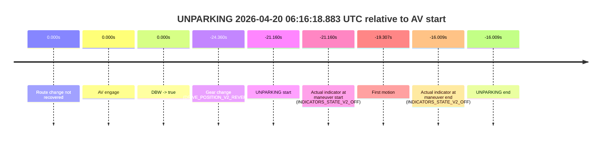

# Run Report: fme20009/2026-04-20--05-55-27--gen2-av-c2a5ecda-fcd4-4462-b529-532ff4df3ad4

| Field | Value |
|---|---|
| Run ID | `fme20009/2026-04-20--05-55-27--gen2-av-c2a5ecda-fcd4-4462-b529-532ff4df3ad4` |
| Date | `2026-04-20` |
| Model(s) | `blue-panther-solid` |
| Author | `guy.geva` |
| Event count | `1` |

## unparking 2026-04-20 06:16:18.883 UTC

| Field | Value |
|---|---|
| Model | `blue-panther-solid` |
| Author | `guy.geva` |
| Run ID | `fme20009/2026-04-20--05-55-27--gen2-av-c2a5ecda-fcd4-4462-b529-532ff4df3ad4` |
| Date | `2026-04-20` |
| Time (UTC) | `06:16:18.883` |
| Event type | `unparking` |
| Disengagement type | `none observed` |
| Route change | `not found` |
| Console | [run](https://console.sso.wayve.ai/run/fme20009/2026-04-20--05-55-27--gen2-av-c2a5ecda-fcd4-4462-b529-532ff4df3ad4?id=&time-unixus=1776665778883304) |
| Foxglove | [segment](https://app.foxglove.dev/wayve-on-prem/p/prj_0dX18KZdVHg1fmmI/view?ds=foxglove-stream&ds.deviceName=fme20009&ds.start=2026-04-20T06%3A16%3A05.683301Z&ds.end=2026-04-20T06%3A16%3A34.033322Z&layoutId=lay_0e7VD4WIKDQGU73Y&time=2026-04-20T06%3A16%3A18.883304Z) |

### Event card: non-av

- Non-AV: there is no AV-owned portion anywhere inside the detected unparking timeline, so it is kept for coverage but excluded from model success / failure scoring.

| Event | Time (UTC) | Delta from AV start |
|---|---:|---:|
| Route change not recovered | 2026-04-20 06:16:40.042 | `0.000s` |
| AV engage | 2026-04-20 06:16:40.042 | `0.000s` |
| DBW -> true | 2026-04-20 06:16:40.042 | `0.000s` |
| Gear change (DRIVE_POSITION_V2_REVERSE) | 2026-04-20 06:16:15.683 | `-24.360s` |
| UNPARKING start | 2026-04-20 06:16:18.883 | `-21.160s` |
| Actual indicator at maneuver start (INDICATORS_STATE_V2_OFF) | 2026-04-20 06:16:18.883 | `-21.160s` |
| First motion | 2026-04-20 06:16:20.735 | `-19.307s` |
| Actual indicator at maneuver end (INDICATORS_STATE_V2_OFF) | 2026-04-20 06:16:24.033 | `-16.009s` |
| UNPARKING end | 2026-04-20 06:16:24.033 | `-16.009s` |

| Metric | Value |
|---|---|
| Outcome | `non-av` |
| Effective failure type | `none` |
| Route change status | `not found` |
| DBW at event start | `false` |
| DBW at event end | `false` |
| Predicted gear at AV start | `DRIVE_POSITION_V2_DRIVE` |
| Actual gear at AV start | `DRIVE_POSITION_V2_DRIVE` |
| Predicted gear at event start | `DRIVE_POSITION_V2_REVERSE` |
| Actual gear at event start | `DRIVE_POSITION_V2_REVERSE` |
| Planned indicator direction | `INDICATORS_STATE_V2_OFF` |
| Controller indicator direction | `INDICATORS_STATE_V2_OFF` |
| Actual indicator direction | `INDICATORS_STATE_V2_OFF` |
| Actual indicator at maneuver end | `INDICATORS_STATE_V2_OFF` |
| Driver accel help in AV | `false` |
| Driver accel help timestamp | `n/a` |
| Max accel pedal pct in AV | `0.0%` |
| Max brake pedal pct in AV | `0.0%` |
| Max speed mps in AV | `0.000` |
| Route -> AV | `n/a` |
| AV -> event start | `-21.160s` |
| AV -> first motion | `-19.307s` |
| AV duration before disengagement | `n/a` |
| Trajectory waypoint count | `37` |
| Driving-plan step count | `11` |

The scored portion starts from the AV-owned window, not from the pre-AV setup. Route-change search in the stopped pre-event segment was `not found`, with the baseline therefore set to AV start. At the event anchor the model predicts `DRIVE_POSITION_V2_REVERSE` and the actual gear is `DRIVE_POSITION_V2_REVERSE`. The effective model outcome is `non-av` because `there is no AV-owned overlap inside the event timeline`.

### Resolution

| Field | Value |
|---|---|
| Final outcome | `non-av` |
| Do we agree with this label? | `yes` |
| Source disengagement type | `none observed` |
| Resolved effective failure type | `none` |
| Confidence | `high` |
