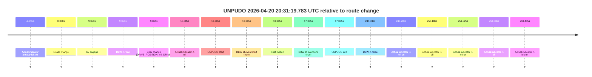
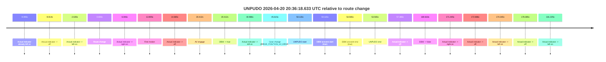
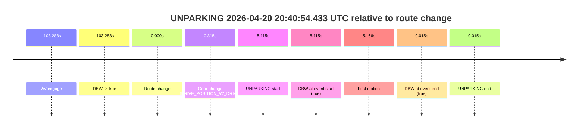

# Run Report: fme20009/2026-04-20--20-28-05--gen2-av-b907b7ec-15eb-4b90-95c7-1f562cb714c1

| Field | Value |
|---|---|
| Run ID | `fme20009/2026-04-20--20-28-05--gen2-av-b907b7ec-15eb-4b90-95c7-1f562cb714c1` |
| Date | `2026-04-20` |
| Model(s) | `eel-teal-outspoken` |
| Author | `zak` |
| Event count | `3` |

## unpudo 2026-04-20 20:31:19.783 UTC

| Field | Value |
|---|---|
| Model | `eel-teal-outspoken` |
| Author | `zak` |
| Run ID | `fme20009/2026-04-20--20-28-05--gen2-av-b907b7ec-15eb-4b90-95c7-1f562cb714c1` |
| Date | `2026-04-20` |
| Time (UTC) | `20:31:19.783` |
| Event type | `unpudo` |
| Disengagement type | `none observed` |
| Route change | `found` |
| Console | [run](https://console.sso.wayve.ai/run/fme20009/2026-04-20--20-28-05--gen2-av-b907b7ec-15eb-4b90-95c7-1f562cb714c1?id=&time-unixus=1776717079783304) |
| Foxglove | [segment](https://app.foxglove.dev/wayve-on-prem/p/prj_0dX18KZdVHg1fmmI/view?ds=foxglove-stream&ds.deviceName=fme20009&ds.start=2026-04-20T20%3A30%3A56.418267Z&ds.end=2026-04-20T20%3A35%3A21.750599Z&layoutId=lay_0e7VD4WIKDQGU73Y&time=2026-04-20T20%3A31%3A19.783304Z) |

### Event card: pass

- Pass: AV owns the credited unpudo from route change through the official unpudo window, the gear state is aligned at the anchor, and the vehicle moves without driver accelerator help in AV.

| Event | Time (UTC) | Delta from route change |
|---|---:|---:|
| Actual indicator already left on | 2026-04-20 20:30:56.423 | `-9.995s` |
| Route change | 2026-04-20 20:31:06.418 | `0.000s` |
| AV engage | 2026-04-20 20:31:15.770 | `9.353s` |
| DBW -> true | 2026-04-20 20:31:15.770 | `9.353s` |
| Gear change (DRIVE_POSITION_V2_DRIVE) | 2026-04-20 20:31:16.233 | `9.815s` |
| Actual indicator -> off | 2026-04-20 20:31:16.423 | `10.005s` |
| UNPUDO start | 2026-04-20 20:31:19.783 | `13.365s` |
| DBW at event start (true) | 2026-04-20 20:31:19.783 | `13.365s` |
| First motion | 2026-04-20 20:31:19.803 | `13.385s` |
| DBW at event end (true) | 2026-04-20 20:31:23.483 | `17.065s` |
| UNPUDO end | 2026-04-20 20:31:23.483 | `17.065s` |
| DBW -> false | 2026-04-20 20:35:11.750 | `245.332s` |
| Actual indicator -> left on | 2026-04-20 20:35:14.623 | `248.206s` |
| Actual indicator -> off | 2026-04-20 20:35:16.603 | `250.186s` |
| Actual indicator -> left on | 2026-04-20 20:35:17.943 | `251.525s` |
| Actual indicator -> off | 2026-04-20 20:35:19.504 | `253.086s` |
| Actual indicator -> left on | 2026-04-20 20:35:25.883 | `259.465s` |

| Metric | Value |
|---|---|
| Outcome | `pass` |
| Effective failure type | `none` |
| Route change status | `found` |
| DBW at event start | `true` |
| DBW at event end | `true` |
| Predicted gear at AV start | `DRIVE_POSITION_V2_DRIVE` |
| Actual gear at AV start | `DRIVE_POSITION_V2_PARK` |
| Predicted gear at event start | `DRIVE_POSITION_V2_DRIVE` |
| Actual gear at event start | `DRIVE_POSITION_V2_DRIVE` |
| Planned indicator direction | `INDICATORS_STATE_V2_RIGHT_ON` |
| Controller indicator direction | `INDICATORS_STATE_V2_RIGHT_ON` |
| Actual indicator direction | `INDICATORS_STATE_V2_OFF` |
| Actual indicator at maneuver end | `INDICATORS_STATE_V2_OFF` |
| Driver accel help in AV | `false` |
| Driver accel help timestamp | `n/a` |
| Max accel pedal pct in AV | `0.0%` |
| Max brake pedal pct in AV | `8.0%` |
| Max speed mps in AV | `4.792` |
| Success timing baseline | `route change` |
| Route -> AV | `9.353s` |
| AV -> event start | `4.012s` |
| AV -> first motion | `4.033s` |
| Success baseline -> event start | `13.365s` |
| Success baseline -> first motion | `13.385s` |
| AV duration before disengagement | `235.980s` |
| Trajectory waypoint count | `37` |
| Driving-plan step count | `11` |

The scored portion starts from the AV-owned window, not from the pre-AV setup. Route-change search in the stopped pre-event segment was `found`, with the baseline therefore set to route change. At the event anchor the model predicts `DRIVE_POSITION_V2_DRIVE` and the actual gear is `DRIVE_POSITION_V2_DRIVE`. The effective model outcome is `pass` because `the credited unpudo stays AV-owned through the official unpudo window.`

### Resolution

| Field | Value |
|---|---|
| Final outcome | `pass` |
| Do we agree with this label? | `yes` |
| Source disengagement type | `none observed` |
| Resolved effective failure type | `none` |
| Confidence | `high` |

## unpudo 2026-04-20 20:36:18.633 UTC

| Field | Value |
|---|---|
| Model | `eel-teal-outspoken` |
| Author | `zak` |
| Run ID | `fme20009/2026-04-20--20-28-05--gen2-av-b907b7ec-15eb-4b90-95c7-1f562cb714c1` |
| Date | `2026-04-20` |
| Time (UTC) | `20:36:18.633` |
| Event type | `unpudo` |
| Disengagement type | `none observed` |
| Route change | `found` |
| Console | [run](https://console.sso.wayve.ai/run/fme20009/2026-04-20--20-28-05--gen2-av-b907b7ec-15eb-4b90-95c7-1f562cb714c1?id=&time-unixus=1776717378633320) |
| Foxglove | [segment](https://app.foxglove.dev/wayve-on-prem/p/prj_0dX18KZdVHg1fmmI/view?ds=foxglove-stream&ds.deviceName=fme20009&ds.start=2026-04-20T20%3A35%3A18.518245Z&ds.end=2026-04-20T20%3A38%3A28.150831Z&layoutId=lay_0e7VD4WIKDQGU73Y&time=2026-04-20T20%3A36%3A18.633320Z) |

### Event card: pass

- Pass: AV owns the credited unpudo from route change through the official unpudo window, the gear state is aligned at the anchor, and the vehicle moves without driver accelerator help in AV.

| Event | Time (UTC) | Delta from route change |
|---|---:|---:|
| Actual indicator already left on | 2026-04-20 20:35:18.523 | `-9.995s` |
| Actual indicator -> off | 2026-04-20 20:35:19.504 | `-9.014s` |
| Actual indicator -> left on | 2026-04-20 20:35:25.883 | `-2.635s` |
| Route change | 2026-04-20 20:35:28.518 | `0.000s` |
| Actual indicator -> right on | 2026-04-20 20:35:34.564 | `6.046s` |
| First motion | 2026-04-20 20:35:42.423 | `13.905s` |
| Actual indicator -> off | 2026-04-20 20:35:43.203 | `14.685s` |
| AV engage | 2026-04-20 20:35:48.930 | `20.412s` |
| DBW -> true | 2026-04-20 20:35:48.930 | `20.412s` |
| Actual indicator -> left on | 2026-04-20 20:36:09.503 | `40.986s` |
| Gear change (DRIVE_POSITION_V2_DRIVE) | 2026-04-20 20:36:14.133 | `45.615s` |
| UNPUDO start | 2026-04-20 20:36:18.633 | `50.115s` |
| DBW at event start (true) | 2026-04-20 20:36:18.633 | `50.115s` |
| DBW at event end (true) | 2026-04-20 20:36:22.083 | `53.565s` |
| UNPUDO end | 2026-04-20 20:36:22.083 | `53.565s` |
| Actual indicator -> off | 2026-04-20 20:36:26.003 | `57.486s` |
| DBW -> false | 2026-04-20 20:38:18.150 | `169.633s` |
| Actual indicator -> right on | 2026-04-20 20:38:19.963 | `171.445s` |
| Actual indicator -> off | 2026-04-20 20:38:21.403 | `172.886s` |
| Actual indicator -> left on | 2026-04-20 20:38:22.863 | `174.345s` |
| Actual indicator -> off | 2026-04-20 20:38:26.903 | `178.385s` |
| Actual indicator -> left on | 2026-04-20 20:38:29.743 | `181.225s` |

| Metric | Value |
|---|---|
| Outcome | `pass` |
| Effective failure type | `none` |
| Route change status | `found` |
| DBW at event start | `true` |
| DBW at event end | `true` |
| Predicted gear at AV start | `DRIVE_POSITION_V2_DRIVE` |
| Actual gear at AV start | `DRIVE_POSITION_V2_DRIVE` |
| Predicted gear at event start | `DRIVE_POSITION_V2_DRIVE` |
| Actual gear at event start | `DRIVE_POSITION_V2_DRIVE` |
| Planned indicator direction | `INDICATORS_STATE_V2_RIGHT_ON` |
| Controller indicator direction | `INDICATORS_STATE_V2_RIGHT_ON` |
| Actual indicator direction | `INDICATORS_STATE_V2_LEFT_ON` |
| Actual indicator at maneuver end | `INDICATORS_STATE_V2_LEFT_ON` |
| Driver accel help in AV | `false` |
| Driver accel help timestamp | `n/a` |
| Max accel pedal pct in AV | `0.0%` |
| Max brake pedal pct in AV | `8.0%` |
| Max speed mps in AV | `6.383` |
| Success timing baseline | `route change` |
| Route -> AV | `20.412s` |
| AV -> event start | `29.703s` |
| AV -> first motion | `-6.507s` |
| Success baseline -> event start | `50.115s` |
| Success baseline -> first motion | `13.905s` |
| AV duration before disengagement | `149.220s` |
| Trajectory waypoint count | `38` |
| Driving-plan step count | `11` |

The scored portion starts from the AV-owned window, not from the pre-AV setup. Route-change search in the stopped pre-event segment was `found`, with the baseline therefore set to route change. At the event anchor the model predicts `DRIVE_POSITION_V2_DRIVE` and the actual gear is `DRIVE_POSITION_V2_DRIVE`. The effective model outcome is `pass` because `the credited unpudo stays AV-owned through the official unpudo window.`

### Resolution

| Field | Value |
|---|---|
| Final outcome | `pass` |
| Do we agree with this label? | `yes` |
| Source disengagement type | `none observed` |
| Resolved effective failure type | `none` |
| Confidence | `high` |

## unparking 2026-04-20 20:40:54.433 UTC

| Field | Value |
|---|---|
| Model | `eel-teal-outspoken` |
| Author | `zak` |
| Run ID | `fme20009/2026-04-20--20-28-05--gen2-av-b907b7ec-15eb-4b90-95c7-1f562cb714c1` |
| Date | `2026-04-20` |
| Time (UTC) | `20:40:54.433` |
| Event type | `unparking` |
| Disengagement type | `none observed` |
| Route change | `found` |
| Console | [run](https://console.sso.wayve.ai/run/fme20009/2026-04-20--20-28-05--gen2-av-b907b7ec-15eb-4b90-95c7-1f562cb714c1?id=&time-unixus=1776717654433307) |
| Foxglove | [segment](https://app.foxglove.dev/wayve-on-prem/p/prj_0dX18KZdVHg1fmmI/view?ds=foxglove-stream&ds.deviceName=fme20009&ds.start=2026-04-20T20%3A38%3A56.030611Z&ds.end=2026-04-20T20%3A41%3A08.333300Z&layoutId=lay_0e7VD4WIKDQGU73Y&time=2026-04-20T20%3A40%3A54.433307Z) |

### Event card: pass

- Pass: AV owns the credited unparking through the official event window, the gear state is aligned at the anchor, and the vehicle moves without driver accelerator help in AV.

| Event | Time (UTC) | Delta from route change |
|---|---:|---:|
| AV engage | 2026-04-20 20:39:06.030 | `-103.288s` |
| DBW -> true | 2026-04-20 20:39:06.030 | `-103.288s` |
| Route change | 2026-04-20 20:40:49.318 | `0.000s` |
| Gear change (DRIVE_POSITION_V2_DRIVE) | 2026-04-20 20:40:49.633 | `0.315s` |
| UNPARKING start | 2026-04-20 20:40:54.433 | `5.115s` |
| DBW at event start (true) | 2026-04-20 20:40:54.433 | `5.115s` |
| First motion | 2026-04-20 20:40:54.484 | `5.166s` |
| DBW at event end (true) | 2026-04-20 20:40:58.333 | `9.015s` |
| UNPARKING end | 2026-04-20 20:40:58.333 | `9.015s` |

| Metric | Value |
|---|---|
| Outcome | `pass` |
| Effective failure type | `none` |
| Route change status | `found` |
| DBW at event start | `true` |
| DBW at event end | `true` |
| Predicted gear at AV start | `DRIVE_POSITION_V2_DRIVE` |
| Actual gear at AV start | `DRIVE_POSITION_V2_DRIVE` |
| Predicted gear at event start | `DRIVE_POSITION_V2_DRIVE` |
| Actual gear at event start | `DRIVE_POSITION_V2_DRIVE` |
| Planned indicator direction | `INDICATORS_STATE_V2_RIGHT_ON` |
| Controller indicator direction | `INDICATORS_STATE_V2_RIGHT_ON` |
| Actual indicator direction | `INDICATORS_STATE_V2_OFF` |
| Actual indicator at maneuver end | `INDICATORS_STATE_V2_OFF` |
| Driver accel help in AV | `false` |
| Driver accel help timestamp | `n/a` |
| Max accel pedal pct in AV | `0.0%` |
| Max brake pedal pct in AV | `0.0%` |
| Max speed mps in AV | `4.858` |
| Success timing baseline | `AV start` |
| Route -> AV | `-103.288s` |
| AV -> event start | `108.403s` |
| AV -> first motion | `108.454s` |
| Success baseline -> event start | `108.403s` |
| Success baseline -> first motion | `108.454s` |
| AV duration before disengagement | `n/a` |
| Trajectory waypoint count | `38` |
| Driving-plan step count | `11` |

The scored portion starts from the AV-owned window, not from the pre-AV setup. Route-change search in the stopped pre-event segment was `found`, with the baseline therefore set to route change. At the event anchor the model predicts `DRIVE_POSITION_V2_DRIVE` and the actual gear is `DRIVE_POSITION_V2_DRIVE`. The effective model outcome is `pass` because `the credited maneuver stays AV-owned through the official event end.`

### Resolution

| Field | Value |
|---|---|
| Final outcome | `pass` |
| Do we agree with this label? | `yes` |
| Source disengagement type | `none observed` |
| Resolved effective failure type | `none` |
| Confidence | `high` |
