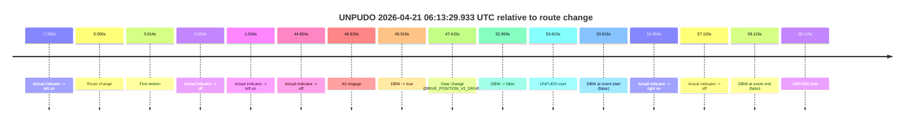
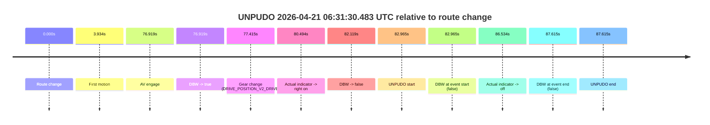
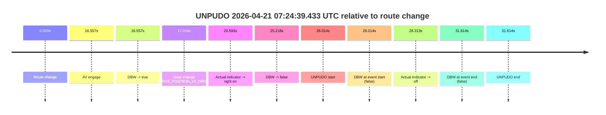

# Run Report: fme20009/2026-04-21--06-08-18--gen2-av-470902ab-378d-4c22-ba1b-1a27990522c6

| Field | Value |
|---|---|
| Run ID | `fme20009/2026-04-21--06-08-18--gen2-av-470902ab-378d-4c22-ba1b-1a27990522c6` |
| Date | `2026-04-21` |
| Model(s) | `pink-manta-ray-smooth` |
| Author | `guy.geva` |
| Event count | `4` |

## unpudo 2026-04-21 06:13:29.933 UTC

| Field | Value |
|---|---|
| Model | `pink-manta-ray-smooth` |
| Author | `guy.geva` |
| Run ID | `fme20009/2026-04-21--06-08-18--gen2-av-470902ab-378d-4c22-ba1b-1a27990522c6` |
| Date | `2026-04-21` |
| Time (UTC) | `06:13:29.933` |
| Event type | `unpudo` |
| Disengagement type | `none observed` |
| Route change | `found` |
| Console | [run](https://console.sso.wayve.ai/run/fme20009/2026-04-21--06-08-18--gen2-av-470902ab-378d-4c22-ba1b-1a27990522c6?id=&time-unixus=1776752009933318) |
| Foxglove | [segment](https://app.foxglove.dev/wayve-on-prem/p/prj_0dX18KZdVHg1fmmI/view?ds=foxglove-stream&ds.deviceName=fme20009&ds.start=2026-04-21T06%3A12%3A26.318296Z&ds.end=2026-04-21T06%3A13%3A44.433294Z&layoutId=lay_0e7VD4WIKDQGU73Y&time=2026-04-21T06%3A13%3A29.933318Z) |

### Event card: fail

- Fail: the credited unpudo does not stay AV-owned. The event window starts with DBW false, and the maneuver outcome lands outside a clean AV-owned segment.

| Event | Time (UTC) | Delta from route change |
|---|---:|---:|
| Actual indicator -> left on | 2026-04-21 06:12:28.952 | `-7.365s` |
| Route change | 2026-04-21 06:12:36.318 | `0.000s` |
| First motion | 2026-04-21 06:12:36.332 | `0.014s` |
| Actual indicator -> off | 2026-04-21 06:12:36.672 | `0.354s` |
| Actual indicator -> left on | 2026-04-21 06:12:37.352 | `1.034s` |
| Actual indicator -> off | 2026-04-21 06:13:21.172 | `44.854s` |
| AV engage | 2026-04-21 06:13:23.237 | `46.919s` |
| DBW -> true | 2026-04-21 06:13:23.237 | `46.919s` |
| Gear change (DRIVE_POSITION_V2_DRIVE) | 2026-04-21 06:13:23.733 | `47.415s` |
| DBW -> false | 2026-04-21 06:13:29.277 | `52.959s` |
| UNPUDO start | 2026-04-21 06:13:29.933 | `53.615s` |
| DBW at event start (false) | 2026-04-21 06:13:29.933 | `53.615s` |
| Actual indicator -> right on | 2026-04-21 06:13:30.672 | `54.354s` |
| Actual indicator -> off | 2026-04-21 06:13:33.432 | `57.115s` |
| DBW at event end (false) | 2026-04-21 06:13:34.433 | `58.115s` |
| UNPUDO end | 2026-04-21 06:13:34.433 | `58.115s` |

| Metric | Value |
|---|---|
| Outcome | `fail` |
| Effective failure type | `completed_outside_av` |
| Route change status | `found` |
| DBW at event start | `false` |
| DBW at event end | `false` |
| Predicted gear at AV start | `DRIVE_POSITION_V2_DRIVE` |
| Actual gear at AV start | `DRIVE_POSITION_V2_PARK` |
| Predicted gear at event start | `DRIVE_POSITION_V2_DRIVE` |
| Actual gear at event start | `DRIVE_POSITION_V2_DRIVE` |
| Planned indicator direction | `INDICATORS_STATE_V2_RIGHT_ON` |
| Controller indicator direction | `INDICATORS_STATE_V2_RIGHT_ON` |
| Actual indicator direction | `INDICATORS_STATE_V2_OFF` |
| Actual indicator at maneuver end | `INDICATORS_STATE_V2_OFF` |
| Driver accel help in AV | `false` |
| Driver accel help timestamp | `n/a` |
| Max accel pedal pct in AV | `0.0%` |
| Max brake pedal pct in AV | `8.4%` |
| Max speed mps in AV | `0.000` |
| Success timing baseline | `route change` |
| Route -> AV | `46.919s` |
| AV -> event start | `6.696s` |
| AV -> first motion | `-46.905s` |
| Success baseline -> event start | `53.615s` |
| Success baseline -> first motion | `0.014s` |
| AV duration before disengagement | `6.041s` |
| Trajectory waypoint count | `35` |
| Driving-plan step count | `11` |

The scored portion starts from the AV-owned window, not from the pre-AV setup. Route-change search in the stopped pre-event segment was `found`, with the baseline therefore set to route change. At the event anchor the model predicts `DRIVE_POSITION_V2_DRIVE` and the actual gear is `DRIVE_POSITION_V2_DRIVE`. The effective model outcome is `fail` because `completed_outside_av.`

### Resolution

| Field | Value |
|---|---|
| Final outcome | `fail` |
| Do we agree with this label? | `yes` |
| Source disengagement type | `none observed` |
| Resolved effective failure type | `completed_outside_av` |
| Confidence | `high` |

## unpudo 2026-04-21 06:31:30.483 UTC

| Field | Value |
|---|---|
| Model | `pink-manta-ray-smooth` |
| Author | `guy.geva` |
| Run ID | `fme20009/2026-04-21--06-08-18--gen2-av-470902ab-378d-4c22-ba1b-1a27990522c6` |
| Date | `2026-04-21` |
| Time (UTC) | `06:31:30.483` |
| Event type | `unpudo` |
| Disengagement type | `none observed` |
| Route change | `found` |
| Console | [run](https://console.sso.wayve.ai/run/fme20009/2026-04-21--06-08-18--gen2-av-470902ab-378d-4c22-ba1b-1a27990522c6?id=&time-unixus=1776753090483298) |
| Foxglove | [segment](https://app.foxglove.dev/wayve-on-prem/p/prj_0dX18KZdVHg1fmmI/view?ds=foxglove-stream&ds.deviceName=fme20009&ds.start=2026-04-21T06%3A29%3A57.518259Z&ds.end=2026-04-21T06%3A31%3A45.133313Z&layoutId=lay_0e7VD4WIKDQGU73Y&time=2026-04-21T06%3A31%3A30.483298Z) |

### Event card: fail

- Fail: the credited unpudo does not stay AV-owned. The event window starts with DBW false, and the maneuver outcome lands outside a clean AV-owned segment.

| Event | Time (UTC) | Delta from route change |
|---|---:|---:|
| Route change | 2026-04-21 06:30:07.518 | `0.000s` |
| First motion | 2026-04-21 06:30:11.452 | `3.934s` |
| AV engage | 2026-04-21 06:31:24.437 | `76.919s` |
| DBW -> true | 2026-04-21 06:31:24.437 | `76.919s` |
| Gear change (DRIVE_POSITION_V2_DRIVE) | 2026-04-21 06:31:24.933 | `77.415s` |
| Actual indicator -> right on | 2026-04-21 06:31:28.012 | `80.494s` |
| DBW -> false | 2026-04-21 06:31:29.637 | `82.119s` |
| UNPUDO start | 2026-04-21 06:31:30.483 | `82.965s` |
| DBW at event start (false) | 2026-04-21 06:31:30.483 | `82.965s` |
| Actual indicator -> off | 2026-04-21 06:31:34.052 | `86.534s` |
| DBW at event end (false) | 2026-04-21 06:31:35.133 | `87.615s` |
| UNPUDO end | 2026-04-21 06:31:35.133 | `87.615s` |

| Metric | Value |
|---|---|
| Outcome | `fail` |
| Effective failure type | `completed_outside_av` |
| Route change status | `found` |
| DBW at event start | `false` |
| DBW at event end | `false` |
| Predicted gear at AV start | `DRIVE_POSITION_V2_DRIVE` |
| Actual gear at AV start | `DRIVE_POSITION_V2_PARK` |
| Predicted gear at event start | `DRIVE_POSITION_V2_DRIVE` |
| Actual gear at event start | `DRIVE_POSITION_V2_DRIVE` |
| Planned indicator direction | `INDICATORS_STATE_V2_LEFT_ON` |
| Controller indicator direction | `INDICATORS_STATE_V2_LEFT_ON` |
| Actual indicator direction | `INDICATORS_STATE_V2_RIGHT_ON` |
| Actual indicator at maneuver end | `INDICATORS_STATE_V2_OFF` |
| Driver accel help in AV | `false` |
| Driver accel help timestamp | `n/a` |
| Max accel pedal pct in AV | `0.0%` |
| Max brake pedal pct in AV | `8.0%` |
| Max speed mps in AV | `0.000` |
| Success timing baseline | `route change` |
| Route -> AV | `76.919s` |
| AV -> event start | `6.046s` |
| AV -> first motion | `-72.984s` |
| Success baseline -> event start | `82.965s` |
| Success baseline -> first motion | `3.934s` |
| AV duration before disengagement | `5.201s` |
| Trajectory waypoint count | `36` |
| Driving-plan step count | `11` |

The scored portion starts from the AV-owned window, not from the pre-AV setup. Route-change search in the stopped pre-event segment was `found`, with the baseline therefore set to route change. At the event anchor the model predicts `DRIVE_POSITION_V2_DRIVE` and the actual gear is `DRIVE_POSITION_V2_DRIVE`. The effective model outcome is `fail` because `completed_outside_av.`

### Resolution

| Field | Value |
|---|---|
| Final outcome | `fail` |
| Do we agree with this label? | `yes` |
| Source disengagement type | `none observed` |
| Resolved effective failure type | `completed_outside_av` |
| Confidence | `high` |

## unpudo 2026-04-21 06:43:22.783 UTC

| Field | Value |
|---|---|
| Model | `pink-manta-ray-smooth` |
| Author | `guy.geva` |
| Run ID | `fme20009/2026-04-21--06-08-18--gen2-av-470902ab-378d-4c22-ba1b-1a27990522c6` |
| Date | `2026-04-21` |
| Time (UTC) | `06:43:22.783` |
| Event type | `unpudo` |
| Disengagement type | `none observed` |
| Route change | `found` |
| Console | [run](https://console.sso.wayve.ai/run/fme20009/2026-04-21--06-08-18--gen2-av-470902ab-378d-4c22-ba1b-1a27990522c6?id=&time-unixus=1776753802783306) |
| Foxglove | [segment](https://app.foxglove.dev/wayve-on-prem/p/prj_0dX18KZdVHg1fmmI/view?ds=foxglove-stream&ds.deviceName=fme20009&ds.start=2026-04-21T06%3A41%3A46.769104Z&ds.end=2026-04-21T06%3A43%3A36.883322Z&layoutId=lay_0e7VD4WIKDQGU73Y&time=2026-04-21T06%3A43%3A22.783306Z) |

### Event card: fail

- Fail: the credited unpudo does not stay AV-owned. The event window starts with DBW false, and the maneuver outcome lands outside a clean AV-owned segment.

| Event | Time (UTC) | Delta from route change |
|---|---:|---:|
| Route change | 2026-04-21 06:41:56.769 | `0.000s` |
| First motion | 2026-04-21 06:41:56.772 | `0.003s` |
| AV engage | 2026-04-21 06:43:15.656 | `78.888s` |
| DBW -> true | 2026-04-21 06:43:15.656 | `78.888s` |
| Gear change (DRIVE_POSITION_V2_DRIVE) | 2026-04-21 06:43:16.133 | `79.364s` |
| Actual indicator -> right on | 2026-04-21 06:43:19.932 | `83.163s` |
| DBW -> false | 2026-04-21 06:43:22.177 | `85.409s` |
| UNPUDO start | 2026-04-21 06:43:22.783 | `86.014s` |
| DBW at event start (false) | 2026-04-21 06:43:22.783 | `86.014s` |
| Actual indicator -> off | 2026-04-21 06:43:26.132 | `89.363s` |
| DBW at event end (false) | 2026-04-21 06:43:26.883 | `90.114s` |
| UNPUDO end | 2026-04-21 06:43:26.883 | `90.114s` |

| Metric | Value |
|---|---|
| Outcome | `fail` |
| Effective failure type | `completed_outside_av` |
| Route change status | `found` |
| DBW at event start | `false` |
| DBW at event end | `false` |
| Predicted gear at AV start | `DRIVE_POSITION_V2_DRIVE` |
| Actual gear at AV start | `DRIVE_POSITION_V2_PARK` |
| Predicted gear at event start | `DRIVE_POSITION_V2_DRIVE` |
| Actual gear at event start | `DRIVE_POSITION_V2_DRIVE` |
| Planned indicator direction | `INDICATORS_STATE_V2_LEFT_ON` |
| Controller indicator direction | `INDICATORS_STATE_V2_LEFT_ON` |
| Actual indicator direction | `INDICATORS_STATE_V2_RIGHT_ON` |
| Actual indicator at maneuver end | `INDICATORS_STATE_V2_OFF` |
| Driver accel help in AV | `false` |
| Driver accel help timestamp | `n/a` |
| Max accel pedal pct in AV | `0.0%` |
| Max brake pedal pct in AV | `11.1%` |
| Max speed mps in AV | `0.000` |
| Success timing baseline | `route change` |
| Route -> AV | `78.888s` |
| AV -> event start | `7.126s` |
| AV -> first motion | `-78.885s` |
| Success baseline -> event start | `86.014s` |
| Success baseline -> first motion | `0.003s` |
| AV duration before disengagement | `6.521s` |
| Trajectory waypoint count | `36` |
| Driving-plan step count | `11` |

The scored portion starts from the AV-owned window, not from the pre-AV setup. Route-change search in the stopped pre-event segment was `found`, with the baseline therefore set to route change. At the event anchor the model predicts `DRIVE_POSITION_V2_DRIVE` and the actual gear is `DRIVE_POSITION_V2_DRIVE`. The effective model outcome is `fail` because `completed_outside_av.`

### Resolution

| Field | Value |
|---|---|
| Final outcome | `fail` |
| Do we agree with this label? | `yes` |
| Source disengagement type | `none observed` |
| Resolved effective failure type | `completed_outside_av` |
| Confidence | `high` |

## unpudo 2026-04-21 07:24:39.433 UTC

| Field | Value |
|---|---|
| Model | `pink-manta-ray-smooth` |
| Author | `guy.geva` |
| Run ID | `fme20009/2026-04-21--06-08-18--gen2-av-470902ab-378d-4c22-ba1b-1a27990522c6` |
| Date | `2026-04-21` |
| Time (UTC) | `07:24:39.433` |
| Event type | `unpudo` |
| Disengagement type | `none observed` |
| Route change | `found` |
| Console | [run](https://console.sso.wayve.ai/run/fme20009/2026-04-21--06-08-18--gen2-av-470902ab-378d-4c22-ba1b-1a27990522c6?id=&time-unixus=1776756279433317) |
| Foxglove | [segment](https://app.foxglove.dev/wayve-on-prem/p/prj_0dX18KZdVHg1fmmI/view?ds=foxglove-stream&ds.deviceName=fme20009&ds.start=2026-04-21T07%3A24%3A03.419679Z&ds.end=2026-04-21T07%3A24%3A55.033331Z&layoutId=lay_0e7VD4WIKDQGU73Y&time=2026-04-21T07%3A24%3A39.433317Z) |

### Event card: fail

- Fail: the credited unpudo does not stay AV-owned. The event window starts with DBW false, and the maneuver outcome lands outside a clean AV-owned segment.

| Event | Time (UTC) | Delta from route change |
|---|---:|---:|
| Route change | 2026-04-21 07:24:13.419 | `0.000s` |
| AV engage | 2026-04-21 07:24:29.976 | `16.557s` |
| DBW -> true | 2026-04-21 07:24:29.976 | `16.557s` |
| Gear change (DRIVE_POSITION_V2_DRIVE) | 2026-04-21 07:24:30.433 | `17.014s` |
| Actual indicator -> right on | 2026-04-21 07:24:34.012 | `20.593s` |
| DBW -> false | 2026-04-21 07:24:38.637 | `25.218s` |
| UNPUDO start | 2026-04-21 07:24:39.433 | `26.014s` |
| DBW at event start (false) | 2026-04-21 07:24:39.433 | `26.014s` |
| Actual indicator -> off | 2026-04-21 07:24:41.732 | `28.313s` |
| DBW at event end (false) | 2026-04-21 07:24:45.033 | `31.614s` |
| UNPUDO end | 2026-04-21 07:24:45.033 | `31.614s` |

| Metric | Value |
|---|---|
| Outcome | `fail` |
| Effective failure type | `not_av_owned` |
| Route change status | `found` |
| DBW at event start | `false` |
| DBW at event end | `false` |
| Predicted gear at AV start | `DRIVE_POSITION_V2_DRIVE` |
| Actual gear at AV start | `DRIVE_POSITION_V2_PARK` |
| Predicted gear at event start | `DRIVE_POSITION_V2_DRIVE` |
| Actual gear at event start | `DRIVE_POSITION_V2_DRIVE` |
| Planned indicator direction | `INDICATORS_STATE_V2_OFF` |
| Controller indicator direction | `INDICATORS_STATE_V2_OFF` |
| Actual indicator direction | `INDICATORS_STATE_V2_RIGHT_ON` |
| Actual indicator at maneuver end | `INDICATORS_STATE_V2_OFF` |
| Driver accel help in AV | `false` |
| Driver accel help timestamp | `n/a` |
| Max accel pedal pct in AV | `0.0%` |
| Max brake pedal pct in AV | `8.0%` |
| Max speed mps in AV | `0.000` |
| Success timing baseline | `route change` |
| Route -> AV | `16.557s` |
| AV -> event start | `9.456s` |
| AV -> first motion | `n/a` |
| Success baseline -> event start | `26.014s` |
| Success baseline -> first motion | `n/a` |
| AV duration before disengagement | `8.660s` |
| Trajectory waypoint count | `35` |
| Driving-plan step count | `11` |

The scored portion starts from the AV-owned window, not from the pre-AV setup. Route-change search in the stopped pre-event segment was `found`, with the baseline therefore set to route change. At the event anchor the model predicts `DRIVE_POSITION_V2_DRIVE` and the actual gear is `DRIVE_POSITION_V2_DRIVE`. The effective model outcome is `fail` because `not_av_owned.`

### Resolution

| Field | Value |
|---|---|
| Final outcome | `fail` |
| Do we agree with this label? | `yes` |
| Source disengagement type | `none observed` |
| Resolved effective failure type | `not_av_owned` |
| Confidence | `high` |
