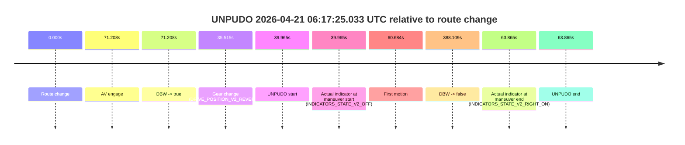
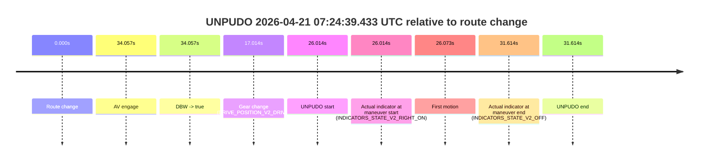

# Run Report: fme20009/2026-04-21--06-08-18--gen2-av-470902ab-378d-4c22-ba1b-1a27990522c6

| Field | Value |
|---|---|
| Run ID | `fme20009/2026-04-21--06-08-18--gen2-av-470902ab-378d-4c22-ba1b-1a27990522c6` |
| Date | `2026-04-21` |
| Model(s) | `pink-manta-ray-smooth` |
| Author | `guy.geva` |
| Event count | `5` |

## unpudo 2026-04-21 06:13:29.933 UTC

| Field | Value |
|---|---|
| Model | `pink-manta-ray-smooth` |
| Author | `guy.geva` |
| Run ID | `fme20009/2026-04-21--06-08-18--gen2-av-470902ab-378d-4c22-ba1b-1a27990522c6` |
| Date | `2026-04-21` |
| Time (UTC) | `06:13:29.933` |
| Event type | `unpudo` |
| Disengagement type | `none observed` |
| Route change | `found` |
| Console | [run](https://console.sso.wayve.ai/run/fme20009/2026-04-21--06-08-18--gen2-av-470902ab-378d-4c22-ba1b-1a27990522c6?id=&time-unixus=1776752009933318) |
| Foxglove | [segment](https://app.foxglove.dev/wayve-on-prem/p/prj_0dX18KZdVHg1fmmI/view?ds=foxglove-stream&ds.deviceName=fme20009&ds.start=2026-04-21T06%3A12%3A26.318296Z&ds.end=2026-04-21T06%3A14%3A00.736773Z&layoutId=lay_0e7VD4WIKDQGU73Y&time=2026-04-21T06%3A13%3A29.933318Z) |

### Event card: non-av

- Non-AV: there is no AV-owned portion anywhere inside the detected unpudo timeline, so it is kept for coverage but excluded from model success / failure scoring.

| Event | Time (UTC) | Delta from route change |
|---|---:|---:|
| Route change | 2026-04-21 06:12:36.318 | `0.000s` |
| AV engage | 2026-04-21 06:13:38.338 | `62.020s` |
| DBW -> true | 2026-04-21 06:13:38.338 | `62.020s` |
| Gear change (DRIVE_POSITION_V2_DRIVE) | 2026-04-21 06:13:23.733 | `47.415s` |
| UNPUDO start | 2026-04-21 06:13:29.933 | `53.615s` |
| Actual indicator at maneuver start (INDICATORS_STATE_V2_OFF) | 2026-04-21 06:13:29.933 | `53.615s` |
| First motion | 2026-04-21 06:13:29.972 | `53.655s` |
| DBW -> false | 2026-04-21 06:13:50.736 | `74.418s` |
| Actual indicator at maneuver end (INDICATORS_STATE_V2_OFF) | 2026-04-21 06:13:34.433 | `58.115s` |
| UNPUDO end | 2026-04-21 06:13:34.433 | `58.115s` |

| Metric | Value |
|---|---|
| Outcome | `non-av` |
| Effective failure type | `none` |
| Route change status | `found` |
| DBW at event start | `false` |
| DBW at event end | `false` |
| Predicted gear at AV start | `DRIVE_POSITION_V2_DRIVE` |
| Actual gear at AV start | `DRIVE_POSITION_V2_DRIVE` |
| Predicted gear at event start | `DRIVE_POSITION_V2_DRIVE` |
| Actual gear at event start | `DRIVE_POSITION_V2_DRIVE` |
| Planned indicator direction | `INDICATORS_STATE_V2_RIGHT_ON` |
| Controller indicator direction | `INDICATORS_STATE_V2_RIGHT_ON` |
| Actual indicator direction | `INDICATORS_STATE_V2_OFF` |
| Actual indicator at maneuver end | `INDICATORS_STATE_V2_OFF` |
| Driver accel help in AV | `false` |
| Driver accel help timestamp | `n/a` |
| Max accel pedal pct in AV | `0.0%` |
| Max brake pedal pct in AV | `0.0%` |
| Max speed mps in AV | `0.000` |
| Route -> AV | `62.020s` |
| AV -> event start | `-8.405s` |
| AV -> first motion | `-8.365s` |
| AV duration before disengagement | `12.399s` |
| Trajectory waypoint count | `35` |
| Driving-plan step count | `11` |

The scored portion starts from the AV-owned window, not from the pre-AV setup. Route-change search in the stopped pre-event segment was `found`, with the baseline therefore set to route change. At the event anchor the model predicts `DRIVE_POSITION_V2_DRIVE` and the actual gear is `DRIVE_POSITION_V2_DRIVE`. The effective model outcome is `non-av` because `there is no AV-owned overlap inside the event timeline`.

### Resolution

| Field | Value |
|---|---|
| Final outcome | `non-av` |
| Do we agree with this label? | `yes` |
| Source disengagement type | `none observed` |
| Resolved effective failure type | `none` |
| Confidence | `high` |

## unpudo 2026-04-21 06:17:25.033 UTC

| Field | Value |
|---|---|
| Model | `pink-manta-ray-smooth` |
| Author | `guy.geva` |
| Run ID | `fme20009/2026-04-21--06-08-18--gen2-av-470902ab-378d-4c22-ba1b-1a27990522c6` |
| Date | `2026-04-21` |
| Time (UTC) | `06:17:25.033` |
| Event type | `unpudo` |
| Disengagement type | `none observed` |
| Route change | `found` |
| Console | [run](https://console.sso.wayve.ai/run/fme20009/2026-04-21--06-08-18--gen2-av-470902ab-378d-4c22-ba1b-1a27990522c6?id=&time-unixus=1776752245033313) |
| Foxglove | [segment](https://app.foxglove.dev/wayve-on-prem/p/prj_0dX18KZdVHg1fmmI/view?ds=foxglove-stream&ds.deviceName=fme20009&ds.start=2026-04-21T06%3A16%3A35.068544Z&ds.end=2026-04-21T06%3A23%3A23.178040Z&layoutId=lay_0e7VD4WIKDQGU73Y&time=2026-04-21T06%3A17%3A25.033313Z) |

### Event card: non-av

- Non-AV: there is no AV-owned portion anywhere inside the detected unpudo timeline, so it is kept for coverage but excluded from model success / failure scoring.

| Event | Time (UTC) | Delta from route change |
|---|---:|---:|
| Route change | 2026-04-21 06:16:45.068 | `0.000s` |
| AV engage | 2026-04-21 06:17:56.276 | `71.208s` |
| DBW -> true | 2026-04-21 06:17:56.276 | `71.208s` |
| Gear change (DRIVE_POSITION_V2_REVERSE) | 2026-04-21 06:17:20.583 | `35.515s` |
| UNPUDO start | 2026-04-21 06:17:25.033 | `39.965s` |
| Actual indicator at maneuver start (INDICATORS_STATE_V2_OFF) | 2026-04-21 06:17:25.033 | `39.965s` |
| First motion | 2026-04-21 06:17:45.752 | `60.684s` |
| DBW -> false | 2026-04-21 06:23:13.178 | `388.109s` |
| Actual indicator at maneuver end (INDICATORS_STATE_V2_RIGHT_ON) | 2026-04-21 06:17:48.933 | `63.865s` |
| UNPUDO end | 2026-04-21 06:17:48.933 | `63.865s` |

| Metric | Value |
|---|---|
| Outcome | `non-av` |
| Effective failure type | `none` |
| Route change status | `found` |
| DBW at event start | `false` |
| DBW at event end | `false` |
| Predicted gear at AV start | `DRIVE_POSITION_V2_DRIVE` |
| Actual gear at AV start | `DRIVE_POSITION_V2_DRIVE` |
| Predicted gear at event start | `DRIVE_POSITION_V2_REVERSE` |
| Actual gear at event start | `DRIVE_POSITION_V2_REVERSE` |
| Planned indicator direction | `INDICATORS_STATE_V2_OFF` |
| Controller indicator direction | `INDICATORS_STATE_V2_OFF` |
| Actual indicator direction | `INDICATORS_STATE_V2_OFF` |
| Actual indicator at maneuver end | `INDICATORS_STATE_V2_RIGHT_ON` |
| Driver accel help in AV | `false` |
| Driver accel help timestamp | `n/a` |
| Max accel pedal pct in AV | `0.0%` |
| Max brake pedal pct in AV | `0.0%` |
| Max speed mps in AV | `0.000` |
| Route -> AV | `71.208s` |
| AV -> event start | `-31.243s` |
| AV -> first motion | `-10.524s` |
| AV duration before disengagement | `316.901s` |
| Trajectory waypoint count | `35` |
| Driving-plan step count | `11` |

The scored portion starts from the AV-owned window, not from the pre-AV setup. Route-change search in the stopped pre-event segment was `found`, with the baseline therefore set to route change. At the event anchor the model predicts `DRIVE_POSITION_V2_REVERSE` and the actual gear is `DRIVE_POSITION_V2_REVERSE`. The effective model outcome is `non-av` because `there is no AV-owned overlap inside the event timeline`.

### Resolution

| Field | Value |
|---|---|
| Final outcome | `non-av` |
| Do we agree with this label? | `yes` |
| Source disengagement type | `none observed` |
| Resolved effective failure type | `none` |
| Confidence | `high` |

## unpudo 2026-04-21 06:31:30.483 UTC

| Field | Value |
|---|---|
| Model | `pink-manta-ray-smooth` |
| Author | `guy.geva` |
| Run ID | `fme20009/2026-04-21--06-08-18--gen2-av-470902ab-378d-4c22-ba1b-1a27990522c6` |
| Date | `2026-04-21` |
| Time (UTC) | `06:31:30.483` |
| Event type | `unpudo` |
| Disengagement type | `none observed` |
| Route change | `found` |
| Console | [run](https://console.sso.wayve.ai/run/fme20009/2026-04-21--06-08-18--gen2-av-470902ab-378d-4c22-ba1b-1a27990522c6?id=&time-unixus=1776753090483298) |
| Foxglove | [segment](https://app.foxglove.dev/wayve-on-prem/p/prj_0dX18KZdVHg1fmmI/view?ds=foxglove-stream&ds.deviceName=fme20009&ds.start=2026-04-21T06%3A29%3A57.518259Z&ds.end=2026-04-21T06%3A33%3A33.277898Z&layoutId=lay_0e7VD4WIKDQGU73Y&time=2026-04-21T06%3A31%3A30.483298Z) |

### Event card: non-av

- Non-AV: there is no AV-owned portion anywhere inside the detected unpudo timeline, so it is kept for coverage but excluded from model success / failure scoring.

| Event | Time (UTC) | Delta from route change |
|---|---:|---:|
| Route change | 2026-04-21 06:30:07.518 | `0.000s` |
| AV engage | 2026-04-21 06:31:39.036 | `91.519s` |
| DBW -> true | 2026-04-21 06:31:39.036 | `91.519s` |
| Gear change (DRIVE_POSITION_V2_DRIVE) | 2026-04-21 06:31:24.933 | `77.415s` |
| UNPUDO start | 2026-04-21 06:31:30.483 | `82.965s` |
| Actual indicator at maneuver start (INDICATORS_STATE_V2_RIGHT_ON) | 2026-04-21 06:31:30.483 | `82.965s` |
| First motion | 2026-04-21 06:31:30.512 | `82.994s` |
| DBW -> false | 2026-04-21 06:33:23.277 | `195.760s` |
| Actual indicator at maneuver end (INDICATORS_STATE_V2_OFF) | 2026-04-21 06:31:35.133 | `87.615s` |
| UNPUDO end | 2026-04-21 06:31:35.133 | `87.615s` |

| Metric | Value |
|---|---|
| Outcome | `non-av` |
| Effective failure type | `none` |
| Route change status | `found` |
| DBW at event start | `false` |
| DBW at event end | `false` |
| Predicted gear at AV start | `DRIVE_POSITION_V2_DRIVE` |
| Actual gear at AV start | `DRIVE_POSITION_V2_DRIVE` |
| Predicted gear at event start | `DRIVE_POSITION_V2_DRIVE` |
| Actual gear at event start | `DRIVE_POSITION_V2_DRIVE` |
| Planned indicator direction | `INDICATORS_STATE_V2_LEFT_ON` |
| Controller indicator direction | `INDICATORS_STATE_V2_LEFT_ON` |
| Actual indicator direction | `INDICATORS_STATE_V2_RIGHT_ON` |
| Actual indicator at maneuver end | `INDICATORS_STATE_V2_OFF` |
| Driver accel help in AV | `false` |
| Driver accel help timestamp | `n/a` |
| Max accel pedal pct in AV | `0.0%` |
| Max brake pedal pct in AV | `0.0%` |
| Max speed mps in AV | `0.000` |
| Route -> AV | `91.519s` |
| AV -> event start | `-8.554s` |
| AV -> first motion | `-8.524s` |
| AV duration before disengagement | `104.241s` |
| Trajectory waypoint count | `36` |
| Driving-plan step count | `11` |

The scored portion starts from the AV-owned window, not from the pre-AV setup. Route-change search in the stopped pre-event segment was `found`, with the baseline therefore set to route change. At the event anchor the model predicts `DRIVE_POSITION_V2_DRIVE` and the actual gear is `DRIVE_POSITION_V2_DRIVE`. The effective model outcome is `non-av` because `there is no AV-owned overlap inside the event timeline`.

### Resolution

| Field | Value |
|---|---|
| Final outcome | `non-av` |
| Do we agree with this label? | `yes` |
| Source disengagement type | `none observed` |
| Resolved effective failure type | `none` |
| Confidence | `high` |

## unpudo 2026-04-21 06:43:22.783 UTC

| Field | Value |
|---|---|
| Model | `pink-manta-ray-smooth` |
| Author | `guy.geva` |
| Run ID | `fme20009/2026-04-21--06-08-18--gen2-av-470902ab-378d-4c22-ba1b-1a27990522c6` |
| Date | `2026-04-21` |
| Time (UTC) | `06:43:22.783` |
| Event type | `unpudo` |
| Disengagement type | `none observed` |
| Route change | `found` |
| Console | [run](https://console.sso.wayve.ai/run/fme20009/2026-04-21--06-08-18--gen2-av-470902ab-378d-4c22-ba1b-1a27990522c6?id=&time-unixus=1776753802783306) |
| Foxglove | [segment](https://app.foxglove.dev/wayve-on-prem/p/prj_0dX18KZdVHg1fmmI/view?ds=foxglove-stream&ds.deviceName=fme20009&ds.start=2026-04-21T06%3A41%3A46.769104Z&ds.end=2026-04-21T06%3A44%3A43.216143Z&layoutId=lay_0e7VD4WIKDQGU73Y&time=2026-04-21T06%3A43%3A22.783306Z) |

### Event card: non-av

- Non-AV: there is no AV-owned portion anywhere inside the detected unpudo timeline, so it is kept for coverage but excluded from model success / failure scoring.

| Event | Time (UTC) | Delta from route change |
|---|---:|---:|
| Route change | 2026-04-21 06:41:56.769 | `0.000s` |
| AV engage | 2026-04-21 06:43:31.158 | `94.389s` |
| DBW -> true | 2026-04-21 06:43:31.158 | `94.389s` |
| Gear change (DRIVE_POSITION_V2_DRIVE) | 2026-04-21 06:43:16.133 | `79.364s` |
| UNPUDO start | 2026-04-21 06:43:22.783 | `86.014s` |
| Actual indicator at maneuver start (INDICATORS_STATE_V2_RIGHT_ON) | 2026-04-21 06:43:22.783 | `86.014s` |
| First motion | 2026-04-21 06:43:22.812 | `86.044s` |
| DBW -> false | 2026-04-21 06:44:33.216 | `156.447s` |
| Actual indicator at maneuver end (INDICATORS_STATE_V2_OFF) | 2026-04-21 06:43:26.883 | `90.114s` |
| UNPUDO end | 2026-04-21 06:43:26.883 | `90.114s` |

| Metric | Value |
|---|---|
| Outcome | `non-av` |
| Effective failure type | `none` |
| Route change status | `found` |
| DBW at event start | `false` |
| DBW at event end | `false` |
| Predicted gear at AV start | `DRIVE_POSITION_V2_DRIVE` |
| Actual gear at AV start | `DRIVE_POSITION_V2_DRIVE` |
| Predicted gear at event start | `DRIVE_POSITION_V2_DRIVE` |
| Actual gear at event start | `DRIVE_POSITION_V2_DRIVE` |
| Planned indicator direction | `INDICATORS_STATE_V2_LEFT_ON` |
| Controller indicator direction | `INDICATORS_STATE_V2_LEFT_ON` |
| Actual indicator direction | `INDICATORS_STATE_V2_RIGHT_ON` |
| Actual indicator at maneuver end | `INDICATORS_STATE_V2_OFF` |
| Driver accel help in AV | `false` |
| Driver accel help timestamp | `n/a` |
| Max accel pedal pct in AV | `0.0%` |
| Max brake pedal pct in AV | `0.0%` |
| Max speed mps in AV | `0.000` |
| Route -> AV | `94.389s` |
| AV -> event start | `-8.375s` |
| AV -> first motion | `-8.346s` |
| AV duration before disengagement | `62.058s` |
| Trajectory waypoint count | `36` |
| Driving-plan step count | `11` |

The scored portion starts from the AV-owned window, not from the pre-AV setup. Route-change search in the stopped pre-event segment was `found`, with the baseline therefore set to route change. At the event anchor the model predicts `DRIVE_POSITION_V2_DRIVE` and the actual gear is `DRIVE_POSITION_V2_DRIVE`. The effective model outcome is `non-av` because `there is no AV-owned overlap inside the event timeline`.

### Resolution

| Field | Value |
|---|---|
| Final outcome | `non-av` |
| Do we agree with this label? | `yes` |
| Source disengagement type | `none observed` |
| Resolved effective failure type | `none` |
| Confidence | `high` |

## unpudo 2026-04-21 07:24:39.433 UTC

| Field | Value |
|---|---|
| Model | `pink-manta-ray-smooth` |
| Author | `guy.geva` |
| Run ID | `fme20009/2026-04-21--06-08-18--gen2-av-470902ab-378d-4c22-ba1b-1a27990522c6` |
| Date | `2026-04-21` |
| Time (UTC) | `07:24:39.433` |
| Event type | `unpudo` |
| Disengagement type | `none observed` |
| Route change | `found` |
| Console | [run](https://console.sso.wayve.ai/run/fme20009/2026-04-21--06-08-18--gen2-av-470902ab-378d-4c22-ba1b-1a27990522c6?id=&time-unixus=1776756279433317) |
| Foxglove | [segment](https://app.foxglove.dev/wayve-on-prem/p/prj_0dX18KZdVHg1fmmI/view?ds=foxglove-stream&ds.deviceName=fme20009&ds.start=2026-04-21T07%3A24%3A03.419679Z&ds.end=2026-04-21T07%3A24%3A55.033331Z&layoutId=lay_0e7VD4WIKDQGU73Y&time=2026-04-21T07%3A24%3A39.433317Z) |

### Event card: non-av

- Non-AV: there is no AV-owned portion anywhere inside the detected unpudo timeline, so it is kept for coverage but excluded from model success / failure scoring.

| Event | Time (UTC) | Delta from route change |
|---|---:|---:|
| Route change | 2026-04-21 07:24:13.419 | `0.000s` |
| AV engage | 2026-04-21 07:24:47.476 | `34.057s` |
| DBW -> true | 2026-04-21 07:24:47.476 | `34.057s` |
| Gear change (DRIVE_POSITION_V2_DRIVE) | 2026-04-21 07:24:30.433 | `17.014s` |
| UNPUDO start | 2026-04-21 07:24:39.433 | `26.014s` |
| Actual indicator at maneuver start (INDICATORS_STATE_V2_RIGHT_ON) | 2026-04-21 07:24:39.433 | `26.014s` |
| First motion | 2026-04-21 07:24:39.492 | `26.073s` |
| Actual indicator at maneuver end (INDICATORS_STATE_V2_OFF) | 2026-04-21 07:24:45.033 | `31.614s` |
| UNPUDO end | 2026-04-21 07:24:45.033 | `31.614s` |

| Metric | Value |
|---|---|
| Outcome | `non-av` |
| Effective failure type | `none` |
| Route change status | `found` |
| DBW at event start | `false` |
| DBW at event end | `false` |
| Predicted gear at AV start | `DRIVE_POSITION_V2_DRIVE` |
| Actual gear at AV start | `DRIVE_POSITION_V2_DRIVE` |
| Predicted gear at event start | `DRIVE_POSITION_V2_DRIVE` |
| Actual gear at event start | `DRIVE_POSITION_V2_DRIVE` |
| Planned indicator direction | `INDICATORS_STATE_V2_OFF` |
| Controller indicator direction | `INDICATORS_STATE_V2_OFF` |
| Actual indicator direction | `INDICATORS_STATE_V2_RIGHT_ON` |
| Actual indicator at maneuver end | `INDICATORS_STATE_V2_OFF` |
| Driver accel help in AV | `false` |
| Driver accel help timestamp | `n/a` |
| Max accel pedal pct in AV | `0.0%` |
| Max brake pedal pct in AV | `0.0%` |
| Max speed mps in AV | `0.000` |
| Route -> AV | `34.057s` |
| AV -> event start | `-8.043s` |
| AV -> first motion | `-7.984s` |
| AV duration before disengagement | `n/a` |
| Trajectory waypoint count | `35` |
| Driving-plan step count | `11` |

The scored portion starts from the AV-owned window, not from the pre-AV setup. Route-change search in the stopped pre-event segment was `found`, with the baseline therefore set to route change. At the event anchor the model predicts `DRIVE_POSITION_V2_DRIVE` and the actual gear is `DRIVE_POSITION_V2_DRIVE`. The effective model outcome is `non-av` because `there is no AV-owned overlap inside the event timeline`.

### Resolution

| Field | Value |
|---|---|
| Final outcome | `non-av` |
| Do we agree with this label? | `yes` |
| Source disengagement type | `none observed` |
| Resolved effective failure type | `none` |
| Confidence | `high` |
