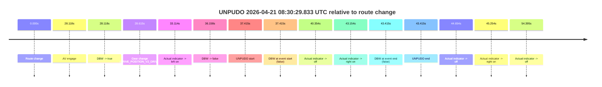
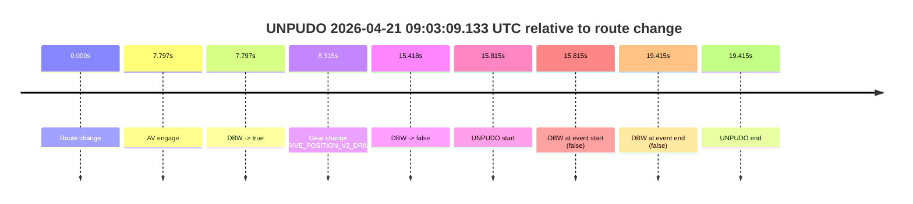
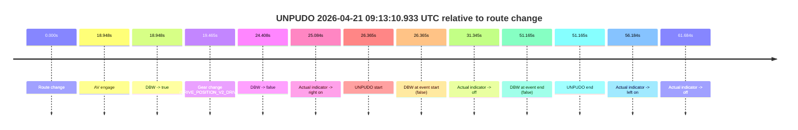
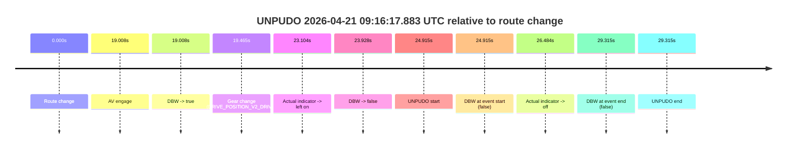

# Run Report: fme20009/2026-04-21--08-16-59--gen2-av-779e4337-43b6-4e32-9718-20d15fff1773

| Field | Value |
|---|---|
| Run ID | `fme20009/2026-04-21--08-16-59--gen2-av-779e4337-43b6-4e32-9718-20d15fff1773` |
| Date | `2026-04-21` |
| Model(s) | `pink-manta-ray-smooth` |
| Author | `guy.geva` |
| Event count | `4` |

## unpudo 2026-04-21 08:30:29.833 UTC

| Field | Value |
|---|---|
| Model | `pink-manta-ray-smooth` |
| Author | `guy.geva` |
| Run ID | `fme20009/2026-04-21--08-16-59--gen2-av-779e4337-43b6-4e32-9718-20d15fff1773` |
| Date | `2026-04-21` |
| Time (UTC) | `08:30:29.833` |
| Event type | `unpudo` |
| Disengagement type | `none observed` |
| Route change | `found` |
| Console | [run](https://console.sso.wayve.ai/run/fme20009/2026-04-21--08-16-59--gen2-av-779e4337-43b6-4e32-9718-20d15fff1773?id=&time-unixus=1776760229833327) |
| Foxglove | [segment](https://app.foxglove.dev/wayve-on-prem/p/prj_0dX18KZdVHg1fmmI/view?ds=foxglove-stream&ds.deviceName=fme20009&ds.start=2026-04-21T08%3A29%3A42.418251Z&ds.end=2026-04-21T08%3A30%3A45.833330Z&layoutId=lay_0e7VD4WIKDQGU73Y&time=2026-04-21T08%3A30%3A29.833327Z) |

### Event card: fail

- Fail: the credited unpudo does not stay AV-owned. The event window starts with DBW false, and the maneuver outcome lands outside a clean AV-owned segment.

| Event | Time (UTC) | Delta from route change |
|---|---:|---:|
| Route change | 2026-04-21 08:29:52.418 | `0.000s` |
| AV engage | 2026-04-21 08:30:20.535 | `28.118s` |
| DBW -> true | 2026-04-21 08:30:20.535 | `28.118s` |
| Gear change (DRIVE_POSITION_V2_DRIVE) | 2026-04-21 08:30:21.033 | `28.615s` |
| Actual indicator -> left on | 2026-04-21 08:30:25.532 | `33.114s` |
| DBW -> false | 2026-04-21 08:30:28.576 | `36.158s` |
| UNPUDO start | 2026-04-21 08:30:29.833 | `37.415s` |
| DBW at event start (false) | 2026-04-21 08:30:29.833 | `37.415s` |
| Actual indicator -> off | 2026-04-21 08:30:32.772 | `40.354s` |
| Actual indicator -> right on | 2026-04-21 08:30:35.572 | `43.154s` |
| DBW at event end (false) | 2026-04-21 08:30:35.833 | `43.415s` |
| UNPUDO end | 2026-04-21 08:30:35.833 | `43.415s` |
| Actual indicator -> off | 2026-04-21 08:30:37.072 | `44.654s` |
| Actual indicator -> right on | 2026-04-21 08:30:37.672 | `45.254s` |
| Actual indicator -> off | 2026-04-21 08:30:46.813 | `54.395s` |

| Metric | Value |
|---|---|
| Outcome | `fail` |
| Effective failure type | `not_av_owned` |
| Route change status | `found` |
| DBW at event start | `false` |
| DBW at event end | `false` |
| Predicted gear at AV start | `DRIVE_POSITION_V2_DRIVE` |
| Actual gear at AV start | `DRIVE_POSITION_V2_PARK` |
| Predicted gear at event start | `DRIVE_POSITION_V2_DRIVE` |
| Actual gear at event start | `DRIVE_POSITION_V2_DRIVE` |
| Planned indicator direction | `INDICATORS_STATE_V2_LEFT_ON` |
| Controller indicator direction | `INDICATORS_STATE_V2_LEFT_ON` |
| Actual indicator direction | `INDICATORS_STATE_V2_LEFT_ON` |
| Actual indicator at maneuver end | `INDICATORS_STATE_V2_RIGHT_ON` |
| Driver accel help in AV | `false` |
| Driver accel help timestamp | `n/a` |
| Max accel pedal pct in AV | `0.0%` |
| Max brake pedal pct in AV | `8.0%` |
| Max speed mps in AV | `0.000` |
| Success timing baseline | `route change` |
| Route -> AV | `28.118s` |
| AV -> event start | `9.297s` |
| AV -> first motion | `n/a` |
| Success baseline -> event start | `37.415s` |
| Success baseline -> first motion | `n/a` |
| AV duration before disengagement | `8.041s` |
| Trajectory waypoint count | `35` |
| Driving-plan step count | `11` |

The scored portion starts from the AV-owned window, not from the pre-AV setup. Route-change search in the stopped pre-event segment was `found`, with the baseline therefore set to route change. At the event anchor the model predicts `DRIVE_POSITION_V2_DRIVE` and the actual gear is `DRIVE_POSITION_V2_DRIVE`. The effective model outcome is `fail` because `not_av_owned.`

### Resolution

| Field | Value |
|---|---|
| Final outcome | `fail` |
| Do we agree with this label? | `yes` |
| Source disengagement type | `none observed` |
| Resolved effective failure type | `not_av_owned` |
| Confidence | `high` |

## unpudo 2026-04-21 09:03:09.133 UTC

| Field | Value |
|---|---|
| Model | `pink-manta-ray-smooth` |
| Author | `guy.geva` |
| Run ID | `fme20009/2026-04-21--08-16-59--gen2-av-779e4337-43b6-4e32-9718-20d15fff1773` |
| Date | `2026-04-21` |
| Time (UTC) | `09:03:09.133` |
| Event type | `unpudo` |
| Disengagement type | `none observed` |
| Route change | `found` |
| Console | [run](https://console.sso.wayve.ai/run/fme20009/2026-04-21--08-16-59--gen2-av-779e4337-43b6-4e32-9718-20d15fff1773?id=&time-unixus=1776762189133293) |
| Foxglove | [segment](https://app.foxglove.dev/wayve-on-prem/p/prj_0dX18KZdVHg1fmmI/view?ds=foxglove-stream&ds.deviceName=fme20009&ds.start=2026-04-21T09%3A02%3A43.318524Z&ds.end=2026-04-21T09%3A03%3A22.733321Z&layoutId=lay_0e7VD4WIKDQGU73Y&time=2026-04-21T09%3A03%3A09.133293Z) |

### Event card: fail

- Fail: the credited unpudo does not stay AV-owned. The event window starts with DBW false, and the maneuver outcome lands outside a clean AV-owned segment.

| Event | Time (UTC) | Delta from route change |
|---|---:|---:|
| Route change | 2026-04-21 09:02:53.318 | `0.000s` |
| AV engage | 2026-04-21 09:03:01.116 | `7.797s` |
| DBW -> true | 2026-04-21 09:03:01.116 | `7.797s` |
| Gear change (DRIVE_POSITION_V2_DRIVE) | 2026-04-21 09:03:01.633 | `8.315s` |
| DBW -> false | 2026-04-21 09:03:08.736 | `15.418s` |
| UNPUDO start | 2026-04-21 09:03:09.133 | `15.815s` |
| DBW at event start (false) | 2026-04-21 09:03:09.133 | `15.815s` |
| DBW at event end (false) | 2026-04-21 09:03:12.733 | `19.415s` |
| UNPUDO end | 2026-04-21 09:03:12.733 | `19.415s` |

| Metric | Value |
|---|---|
| Outcome | `fail` |
| Effective failure type | `not_av_owned` |
| Route change status | `found` |
| DBW at event start | `false` |
| DBW at event end | `false` |
| Predicted gear at AV start | `DRIVE_POSITION_V2_DRIVE` |
| Actual gear at AV start | `DRIVE_POSITION_V2_PARK` |
| Predicted gear at event start | `DRIVE_POSITION_V2_DRIVE` |
| Actual gear at event start | `DRIVE_POSITION_V2_DRIVE` |
| Planned indicator direction | `INDICATORS_STATE_V2_OFF` |
| Controller indicator direction | `INDICATORS_STATE_V2_OFF` |
| Actual indicator direction | `INDICATORS_STATE_V2_OFF` |
| Actual indicator at maneuver end | `INDICATORS_STATE_V2_OFF` |
| Driver accel help in AV | `false` |
| Driver accel help timestamp | `n/a` |
| Max accel pedal pct in AV | `0.0%` |
| Max brake pedal pct in AV | `8.5%` |
| Max speed mps in AV | `0.000` |
| Success timing baseline | `route change` |
| Route -> AV | `7.797s` |
| AV -> event start | `8.017s` |
| AV -> first motion | `n/a` |
| Success baseline -> event start | `15.815s` |
| Success baseline -> first motion | `n/a` |
| AV duration before disengagement | `7.621s` |
| Trajectory waypoint count | `35` |
| Driving-plan step count | `11` |

The scored portion starts from the AV-owned window, not from the pre-AV setup. Route-change search in the stopped pre-event segment was `found`, with the baseline therefore set to route change. At the event anchor the model predicts `DRIVE_POSITION_V2_DRIVE` and the actual gear is `DRIVE_POSITION_V2_DRIVE`. The effective model outcome is `fail` because `not_av_owned.`

### Resolution

| Field | Value |
|---|---|
| Final outcome | `fail` |
| Do we agree with this label? | `yes` |
| Source disengagement type | `none observed` |
| Resolved effective failure type | `not_av_owned` |
| Confidence | `high` |

## unpudo 2026-04-21 09:13:10.933 UTC

| Field | Value |
|---|---|
| Model | `pink-manta-ray-smooth` |
| Author | `guy.geva` |
| Run ID | `fme20009/2026-04-21--08-16-59--gen2-av-779e4337-43b6-4e32-9718-20d15fff1773` |
| Date | `2026-04-21` |
| Time (UTC) | `09:13:10.933` |
| Event type | `unpudo` |
| Disengagement type | `none observed` |
| Route change | `found` |
| Console | [run](https://console.sso.wayve.ai/run/fme20009/2026-04-21--08-16-59--gen2-av-779e4337-43b6-4e32-9718-20d15fff1773?id=&time-unixus=1776762790933313) |
| Foxglove | [segment](https://app.foxglove.dev/wayve-on-prem/p/prj_0dX18KZdVHg1fmmI/view?ds=foxglove-stream&ds.deviceName=fme20009&ds.start=2026-04-21T09%3A12%3A34.568249Z&ds.end=2026-04-21T09%3A13%3A45.733323Z&layoutId=lay_0e7VD4WIKDQGU73Y&time=2026-04-21T09%3A13%3A10.933313Z) |

### Event card: fail

- Fail: the credited unpudo does not stay AV-owned. The event window starts with DBW false, and the maneuver outcome lands outside a clean AV-owned segment.

| Event | Time (UTC) | Delta from route change |
|---|---:|---:|
| Route change | 2026-04-21 09:12:44.568 | `0.000s` |
| AV engage | 2026-04-21 09:13:03.516 | `18.948s` |
| DBW -> true | 2026-04-21 09:13:03.516 | `18.948s` |
| Gear change (DRIVE_POSITION_V2_DRIVE) | 2026-04-21 09:13:04.033 | `19.465s` |
| DBW -> false | 2026-04-21 09:13:08.976 | `24.408s` |
| Actual indicator -> right on | 2026-04-21 09:13:09.652 | `25.084s` |
| UNPUDO start | 2026-04-21 09:13:10.933 | `26.365s` |
| DBW at event start (false) | 2026-04-21 09:13:10.933 | `26.365s` |
| Actual indicator -> off | 2026-04-21 09:13:15.913 | `31.345s` |
| DBW at event end (false) | 2026-04-21 09:13:35.733 | `51.165s` |
| UNPUDO end | 2026-04-21 09:13:35.733 | `51.165s` |
| Actual indicator -> left on | 2026-04-21 09:13:40.752 | `56.184s` |
| Actual indicator -> off | 2026-04-21 09:13:46.252 | `61.684s` |

| Metric | Value |
|---|---|
| Outcome | `fail` |
| Effective failure type | `not_av_owned` |
| Route change status | `found` |
| DBW at event start | `false` |
| DBW at event end | `false` |
| Predicted gear at AV start | `DRIVE_POSITION_V2_DRIVE` |
| Actual gear at AV start | `DRIVE_POSITION_V2_PARK` |
| Predicted gear at event start | `DRIVE_POSITION_V2_DRIVE` |
| Actual gear at event start | `DRIVE_POSITION_V2_DRIVE` |
| Planned indicator direction | `INDICATORS_STATE_V2_RIGHT_ON` |
| Controller indicator direction | `INDICATORS_STATE_V2_RIGHT_ON` |
| Actual indicator direction | `INDICATORS_STATE_V2_RIGHT_ON` |
| Actual indicator at maneuver end | `INDICATORS_STATE_V2_OFF` |
| Driver accel help in AV | `false` |
| Driver accel help timestamp | `n/a` |
| Max accel pedal pct in AV | `0.0%` |
| Max brake pedal pct in AV | `8.0%` |
| Max speed mps in AV | `0.000` |
| Success timing baseline | `route change` |
| Route -> AV | `18.948s` |
| AV -> event start | `7.417s` |
| AV -> first motion | `n/a` |
| Success baseline -> event start | `26.365s` |
| Success baseline -> first motion | `n/a` |
| AV duration before disengagement | `5.461s` |
| Trajectory waypoint count | `35` |
| Driving-plan step count | `11` |

The scored portion starts from the AV-owned window, not from the pre-AV setup. Route-change search in the stopped pre-event segment was `found`, with the baseline therefore set to route change. At the event anchor the model predicts `DRIVE_POSITION_V2_DRIVE` and the actual gear is `DRIVE_POSITION_V2_DRIVE`. The effective model outcome is `fail` because `not_av_owned.`

### Resolution

| Field | Value |
|---|---|
| Final outcome | `fail` |
| Do we agree with this label? | `yes` |
| Source disengagement type | `none observed` |
| Resolved effective failure type | `not_av_owned` |
| Confidence | `high` |

## unpudo 2026-04-21 09:16:17.883 UTC

| Field | Value |
|---|---|
| Model | `pink-manta-ray-smooth` |
| Author | `guy.geva` |
| Run ID | `fme20009/2026-04-21--08-16-59--gen2-av-779e4337-43b6-4e32-9718-20d15fff1773` |
| Date | `2026-04-21` |
| Time (UTC) | `09:16:17.883` |
| Event type | `unpudo` |
| Disengagement type | `none observed` |
| Route change | `found` |
| Console | [run](https://console.sso.wayve.ai/run/fme20009/2026-04-21--08-16-59--gen2-av-779e4337-43b6-4e32-9718-20d15fff1773?id=&time-unixus=1776762977883317) |
| Foxglove | [segment](https://app.foxglove.dev/wayve-on-prem/p/prj_0dX18KZdVHg1fmmI/view?ds=foxglove-stream&ds.deviceName=fme20009&ds.start=2026-04-21T09%3A15%3A42.968336Z&ds.end=2026-04-21T09%3A16%3A32.283305Z&layoutId=lay_0e7VD4WIKDQGU73Y&time=2026-04-21T09%3A16%3A17.883317Z) |

### Event card: fail

- Fail: the credited unpudo does not stay AV-owned. The event window starts with DBW false, and the maneuver outcome lands outside a clean AV-owned segment.

| Event | Time (UTC) | Delta from route change |
|---|---:|---:|
| Route change | 2026-04-21 09:15:52.968 | `0.000s` |
| AV engage | 2026-04-21 09:16:11.976 | `19.008s` |
| DBW -> true | 2026-04-21 09:16:11.976 | `19.008s` |
| Gear change (DRIVE_POSITION_V2_DRIVE) | 2026-04-21 09:16:12.433 | `19.465s` |
| Actual indicator -> left on | 2026-04-21 09:16:16.072 | `23.104s` |
| DBW -> false | 2026-04-21 09:16:16.896 | `23.928s` |
| UNPUDO start | 2026-04-21 09:16:17.883 | `24.915s` |
| DBW at event start (false) | 2026-04-21 09:16:17.883 | `24.915s` |
| Actual indicator -> off | 2026-04-21 09:16:19.452 | `26.484s` |
| DBW at event end (false) | 2026-04-21 09:16:22.283 | `29.315s` |
| UNPUDO end | 2026-04-21 09:16:22.283 | `29.315s` |

| Metric | Value |
|---|---|
| Outcome | `fail` |
| Effective failure type | `not_av_owned` |
| Route change status | `found` |
| DBW at event start | `false` |
| DBW at event end | `false` |
| Predicted gear at AV start | `DRIVE_POSITION_V2_DRIVE` |
| Actual gear at AV start | `DRIVE_POSITION_V2_PARK` |
| Predicted gear at event start | `DRIVE_POSITION_V2_DRIVE` |
| Actual gear at event start | `DRIVE_POSITION_V2_DRIVE` |
| Planned indicator direction | `INDICATORS_STATE_V2_RIGHT_ON` |
| Controller indicator direction | `INDICATORS_STATE_V2_RIGHT_ON` |
| Actual indicator direction | `INDICATORS_STATE_V2_LEFT_ON` |
| Actual indicator at maneuver end | `INDICATORS_STATE_V2_OFF` |
| Driver accel help in AV | `false` |
| Driver accel help timestamp | `n/a` |
| Max accel pedal pct in AV | `0.0%` |
| Max brake pedal pct in AV | `8.6%` |
| Max speed mps in AV | `0.000` |
| Success timing baseline | `route change` |
| Route -> AV | `19.008s` |
| AV -> event start | `5.907s` |
| AV -> first motion | `n/a` |
| Success baseline -> event start | `24.915s` |
| Success baseline -> first motion | `n/a` |
| AV duration before disengagement | `4.921s` |
| Trajectory waypoint count | `36` |
| Driving-plan step count | `11` |

The scored portion starts from the AV-owned window, not from the pre-AV setup. Route-change search in the stopped pre-event segment was `found`, with the baseline therefore set to route change. At the event anchor the model predicts `DRIVE_POSITION_V2_DRIVE` and the actual gear is `DRIVE_POSITION_V2_DRIVE`. The effective model outcome is `fail` because `not_av_owned.`

### Resolution

| Field | Value |
|---|---|
| Final outcome | `fail` |
| Do we agree with this label? | `yes` |
| Source disengagement type | `none observed` |
| Resolved effective failure type | `not_av_owned` |
| Confidence | `high` |
