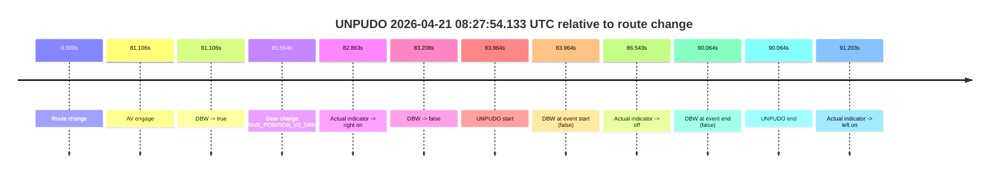
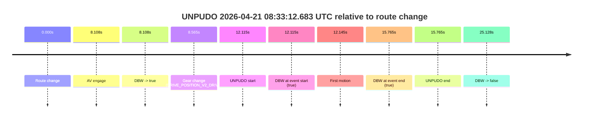
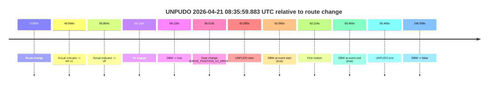
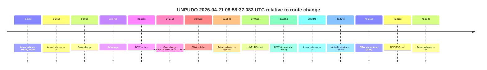
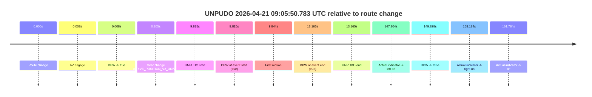
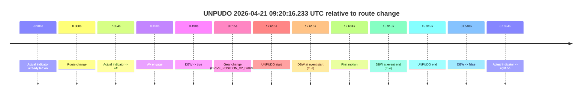
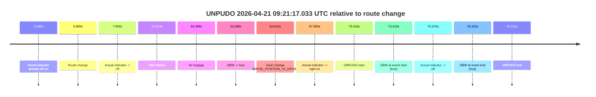

# Run Report: fme20009/2026-04-21--08-16-59--gen2-av-779e4337-43b6-4e32-9718-20d15fff1773

| Field | Value |
|---|---|
| Run ID | `fme20009/2026-04-21--08-16-59--gen2-av-779e4337-43b6-4e32-9718-20d15fff1773` |
| Date | `2026-04-21` |
| Model(s) | `eel-teal-outspoken` |
| Author | `zak` |
| Event count | `8` |

## unpudo 2026-04-21 08:27:54.133 UTC

| Field | Value |
|---|---|
| Model | `eel-teal-outspoken` |
| Author | `zak` |
| Run ID | `fme20009/2026-04-21--08-16-59--gen2-av-779e4337-43b6-4e32-9718-20d15fff1773` |
| Date | `2026-04-21` |
| Time (UTC) | `08:27:54.133` |
| Event type | `unpudo` |
| Disengagement type | `none observed` |
| Route change | `found` |
| Console | [run](https://console.sso.wayve.ai/run/fme20009/2026-04-21--08-16-59--gen2-av-779e4337-43b6-4e32-9718-20d15fff1773?id=&time-unixus=1776760074133301) |
| Foxglove | [segment](https://app.foxglove.dev/wayve-on-prem/p/prj_0dX18KZdVHg1fmmI/view?ds=foxglove-stream&ds.deviceName=fme20009&ds.start=2026-04-21T08%3A26%3A20.169615Z&ds.end=2026-04-21T08%3A28%3A10.233302Z&layoutId=lay_0e7VD4WIKDQGU73Y&time=2026-04-21T08%3A27%3A54.133301Z) |

### Event card: fail

- Fail: the credited unpudo does not stay AV-owned. The event window starts with DBW false, and the maneuver outcome lands outside a clean AV-owned segment.

| Event | Time (UTC) | Delta from route change |
|---|---:|---:|
| Route change | 2026-04-21 08:26:30.169 | `0.000s` |
| AV engage | 2026-04-21 08:27:51.276 | `81.106s` |
| DBW -> true | 2026-04-21 08:27:51.276 | `81.106s` |
| Gear change (DRIVE_POSITION_V2_DRIVE) | 2026-04-21 08:27:51.733 | `81.564s` |
| Actual indicator -> right on | 2026-04-21 08:27:53.032 | `82.863s` |
| DBW -> false | 2026-04-21 08:27:53.377 | `83.208s` |
| UNPUDO start | 2026-04-21 08:27:54.133 | `83.964s` |
| DBW at event start (false) | 2026-04-21 08:27:54.133 | `83.964s` |
| Actual indicator -> off | 2026-04-21 08:27:56.712 | `86.543s` |
| DBW at event end (false) | 2026-04-21 08:28:00.233 | `90.064s` |
| UNPUDO end | 2026-04-21 08:28:00.233 | `90.064s` |
| Actual indicator -> left on | 2026-04-21 08:28:01.372 | `91.203s` |

| Metric | Value |
|---|---|
| Outcome | `fail` |
| Effective failure type | `not_av_owned` |
| Route change status | `found` |
| DBW at event start | `false` |
| DBW at event end | `false` |
| Predicted gear at AV start | `DRIVE_POSITION_V2_DRIVE` |
| Actual gear at AV start | `DRIVE_POSITION_V2_PARK` |
| Predicted gear at event start | `DRIVE_POSITION_V2_DRIVE` |
| Actual gear at event start | `DRIVE_POSITION_V2_DRIVE` |
| Planned indicator direction | `INDICATORS_STATE_V2_RIGHT_ON` |
| Controller indicator direction | `INDICATORS_STATE_V2_RIGHT_ON` |
| Actual indicator direction | `INDICATORS_STATE_V2_RIGHT_ON` |
| Actual indicator at maneuver end | `INDICATORS_STATE_V2_OFF` |
| Driver accel help in AV | `false` |
| Driver accel help timestamp | `n/a` |
| Max accel pedal pct in AV | `0.0%` |
| Max brake pedal pct in AV | `8.0%` |
| Max speed mps in AV | `0.000` |
| Success timing baseline | `route change` |
| Route -> AV | `81.106s` |
| AV -> event start | `2.857s` |
| AV -> first motion | `n/a` |
| Success baseline -> event start | `83.964s` |
| Success baseline -> first motion | `n/a` |
| AV duration before disengagement | `2.102s` |
| Trajectory waypoint count | `37` |
| Driving-plan step count | `11` |

The scored portion starts from the AV-owned window, not from the pre-AV setup. Route-change search in the stopped pre-event segment was `found`, with the baseline therefore set to route change. At the event anchor the model predicts `DRIVE_POSITION_V2_DRIVE` and the actual gear is `DRIVE_POSITION_V2_DRIVE`. The effective model outcome is `fail` because `not_av_owned.`

### Resolution

| Field | Value |
|---|---|
| Final outcome | `fail` |
| Do we agree with this label? | `yes` |
| Source disengagement type | `none observed` |
| Resolved effective failure type | `not_av_owned` |
| Confidence | `high` |

## unpudo 2026-04-21 08:33:12.683 UTC

| Field | Value |
|---|---|
| Model | `eel-teal-outspoken` |
| Author | `zak` |
| Run ID | `fme20009/2026-04-21--08-16-59--gen2-av-779e4337-43b6-4e32-9718-20d15fff1773` |
| Date | `2026-04-21` |
| Time (UTC) | `08:33:12.683` |
| Event type | `unpudo` |
| Disengagement type | `none observed` |
| Route change | `found` |
| Console | [run](https://console.sso.wayve.ai/run/fme20009/2026-04-21--08-16-59--gen2-av-779e4337-43b6-4e32-9718-20d15fff1773?id=&time-unixus=1776760392683325) |
| Foxglove | [segment](https://app.foxglove.dev/wayve-on-prem/p/prj_0dX18KZdVHg1fmmI/view?ds=foxglove-stream&ds.deviceName=fme20009&ds.start=2026-04-21T08%3A32%3A50.568249Z&ds.end=2026-04-21T08%3A33%3A35.695897Z&layoutId=lay_0e7VD4WIKDQGU73Y&time=2026-04-21T08%3A33%3A12.683325Z) |

### Event card: pass

- Pass: AV owns the credited unpudo from route change through the official unpudo window, the gear state is aligned at the anchor, and the vehicle moves without driver accelerator help in AV.

| Event | Time (UTC) | Delta from route change |
|---|---:|---:|
| Route change | 2026-04-21 08:33:00.568 | `0.000s` |
| AV engage | 2026-04-21 08:33:08.676 | `8.108s` |
| DBW -> true | 2026-04-21 08:33:08.676 | `8.108s` |
| Gear change (DRIVE_POSITION_V2_DRIVE) | 2026-04-21 08:33:09.133 | `8.565s` |
| UNPUDO start | 2026-04-21 08:33:12.683 | `12.115s` |
| DBW at event start (true) | 2026-04-21 08:33:12.683 | `12.115s` |
| First motion | 2026-04-21 08:33:12.713 | `12.145s` |
| DBW at event end (true) | 2026-04-21 08:33:16.333 | `15.765s` |
| UNPUDO end | 2026-04-21 08:33:16.333 | `15.765s` |
| DBW -> false | 2026-04-21 08:33:25.695 | `25.128s` |

| Metric | Value |
|---|---|
| Outcome | `pass` |
| Effective failure type | `none` |
| Route change status | `found` |
| DBW at event start | `true` |
| DBW at event end | `true` |
| Predicted gear at AV start | `DRIVE_POSITION_V2_DRIVE` |
| Actual gear at AV start | `DRIVE_POSITION_V2_PARK` |
| Predicted gear at event start | `DRIVE_POSITION_V2_DRIVE` |
| Actual gear at event start | `DRIVE_POSITION_V2_DRIVE` |
| Planned indicator direction | `INDICATORS_STATE_V2_RIGHT_ON` |
| Controller indicator direction | `INDICATORS_STATE_V2_RIGHT_ON` |
| Actual indicator direction | `INDICATORS_STATE_V2_OFF` |
| Actual indicator at maneuver end | `INDICATORS_STATE_V2_OFF` |
| Driver accel help in AV | `false` |
| Driver accel help timestamp | `n/a` |
| Max accel pedal pct in AV | `0.0%` |
| Max brake pedal pct in AV | `8.0%` |
| Max speed mps in AV | `4.967` |
| Success timing baseline | `route change` |
| Route -> AV | `8.108s` |
| AV -> event start | `4.007s` |
| AV -> first motion | `4.037s` |
| Success baseline -> event start | `12.115s` |
| Success baseline -> first motion | `12.145s` |
| AV duration before disengagement | `17.020s` |
| Trajectory waypoint count | `36` |
| Driving-plan step count | `11` |

The scored portion starts from the AV-owned window, not from the pre-AV setup. Route-change search in the stopped pre-event segment was `found`, with the baseline therefore set to route change. At the event anchor the model predicts `DRIVE_POSITION_V2_DRIVE` and the actual gear is `DRIVE_POSITION_V2_DRIVE`. The effective model outcome is `pass` because `the credited unpudo stays AV-owned through the official unpudo window.`

### Resolution

| Field | Value |
|---|---|
| Final outcome | `pass` |
| Do we agree with this label? | `yes` |
| Source disengagement type | `none observed` |
| Resolved effective failure type | `none` |
| Confidence | `high` |

## unpudo 2026-04-21 08:35:59.883 UTC

| Field | Value |
|---|---|
| Model | `eel-teal-outspoken` |
| Author | `zak` |
| Run ID | `fme20009/2026-04-21--08-16-59--gen2-av-779e4337-43b6-4e32-9718-20d15fff1773` |
| Date | `2026-04-21` |
| Time (UTC) | `08:35:59.883` |
| Event type | `unpudo` |
| Disengagement type | `none observed` |
| Route change | `found` |
| Console | [run](https://console.sso.wayve.ai/run/fme20009/2026-04-21--08-16-59--gen2-av-779e4337-43b6-4e32-9718-20d15fff1773?id=&time-unixus=1776760559883322) |
| Foxglove | [segment](https://app.foxglove.dev/wayve-on-prem/p/prj_0dX18KZdVHg1fmmI/view?ds=foxglove-stream&ds.deviceName=fme20009&ds.start=2026-04-21T08%3A34%3A47.818269Z&ds.end=2026-04-21T08%3A37%3A44.375901Z&layoutId=lay_0e7VD4WIKDQGU73Y&time=2026-04-21T08%3A35%3A59.883322Z) |

### Event card: pass

- Pass: AV owns the credited unpudo from route change through the official unpudo window, the gear state is aligned at the anchor, and the vehicle moves without driver accelerator help in AV.

| Event | Time (UTC) | Delta from route change |
|---|---:|---:|
| Route change | 2026-04-21 08:34:57.818 | `0.000s` |
| Actual indicator -> left on | 2026-04-21 08:35:47.412 | `49.594s` |
| Actual indicator -> off | 2026-04-21 08:35:53.672 | `55.854s` |
| AV engage | 2026-04-21 08:35:55.936 | `58.118s` |
| DBW -> true | 2026-04-21 08:35:55.936 | `58.118s` |
| Gear change (DRIVE_POSITION_V2_DRIVE) | 2026-04-21 08:35:56.333 | `58.515s` |
| UNPUDO start | 2026-04-21 08:35:59.883 | `62.065s` |
| DBW at event start (true) | 2026-04-21 08:35:59.883 | `62.065s` |
| First motion | 2026-04-21 08:35:59.932 | `62.114s` |
| DBW at event end (true) | 2026-04-21 08:36:03.283 | `65.465s` |
| UNPUDO end | 2026-04-21 08:36:03.283 | `65.465s` |
| DBW -> false | 2026-04-21 08:37:34.375 | `156.558s` |

| Metric | Value |
|---|---|
| Outcome | `pass` |
| Effective failure type | `none` |
| Route change status | `found` |
| DBW at event start | `true` |
| DBW at event end | `true` |
| Predicted gear at AV start | `DRIVE_POSITION_V2_DRIVE` |
| Actual gear at AV start | `DRIVE_POSITION_V2_PARK` |
| Predicted gear at event start | `DRIVE_POSITION_V2_DRIVE` |
| Actual gear at event start | `DRIVE_POSITION_V2_DRIVE` |
| Planned indicator direction | `INDICATORS_STATE_V2_RIGHT_ON` |
| Controller indicator direction | `INDICATORS_STATE_V2_RIGHT_ON` |
| Actual indicator direction | `INDICATORS_STATE_V2_OFF` |
| Actual indicator at maneuver end | `INDICATORS_STATE_V2_OFF` |
| Driver accel help in AV | `false` |
| Driver accel help timestamp | `n/a` |
| Max accel pedal pct in AV | `0.0%` |
| Max brake pedal pct in AV | `9.0%` |
| Max speed mps in AV | `4.733` |
| Success timing baseline | `route change` |
| Route -> AV | `58.118s` |
| AV -> event start | `3.947s` |
| AV -> first motion | `3.996s` |
| Success baseline -> event start | `62.065s` |
| Success baseline -> first motion | `62.114s` |
| AV duration before disengagement | `98.440s` |
| Trajectory waypoint count | `36` |
| Driving-plan step count | `11` |

The scored portion starts from the AV-owned window, not from the pre-AV setup. Route-change search in the stopped pre-event segment was `found`, with the baseline therefore set to route change. At the event anchor the model predicts `DRIVE_POSITION_V2_DRIVE` and the actual gear is `DRIVE_POSITION_V2_DRIVE`. The effective model outcome is `pass` because `the credited unpudo stays AV-owned through the official unpudo window.`

### Resolution

| Field | Value |
|---|---|
| Final outcome | `pass` |
| Do we agree with this label? | `yes` |
| Source disengagement type | `none observed` |
| Resolved effective failure type | `none` |
| Confidence | `high` |

## unpudo 2026-04-21 08:47:50.983 UTC

| Field | Value |
|---|---|
| Model | `eel-teal-outspoken` |
| Author | `zak` |
| Run ID | `fme20009/2026-04-21--08-16-59--gen2-av-779e4337-43b6-4e32-9718-20d15fff1773` |
| Date | `2026-04-21` |
| Time (UTC) | `08:47:50.983` |
| Event type | `unpudo` |
| Disengagement type | `none observed` |
| Route change | `found` |
| Console | [run](https://console.sso.wayve.ai/run/fme20009/2026-04-21--08-16-59--gen2-av-779e4337-43b6-4e32-9718-20d15fff1773?id=&time-unixus=1776761270983316) |
| Foxglove | [segment](https://app.foxglove.dev/wayve-on-prem/p/prj_0dX18KZdVHg1fmmI/view?ds=foxglove-stream&ds.deviceName=fme20009&ds.start=2026-04-21T08%3A47%3A26.818321Z&ds.end=2026-04-21T08%3A48%3A16.316944Z&layoutId=lay_0e7VD4WIKDQGU73Y&time=2026-04-21T08%3A47%3A50.983316Z) |

### Event card: pass

- Pass: AV owns the credited unpudo from route change through the official unpudo window, the gear state is aligned at the anchor, and the vehicle moves without driver accelerator help in AV.

| Event | Time (UTC) | Delta from route change |
|---|---:|---:|
| Route change | 2026-04-21 08:47:36.818 | `0.000s` |
| AV engage | 2026-04-21 08:47:46.956 | `10.138s` |
| DBW -> true | 2026-04-21 08:47:46.956 | `10.138s` |
| Gear change (DRIVE_POSITION_V2_DRIVE) | 2026-04-21 08:47:47.433 | `10.615s` |
| UNPUDO start | 2026-04-21 08:47:50.983 | `14.165s` |
| DBW at event start (true) | 2026-04-21 08:47:50.983 | `14.165s` |
| First motion | 2026-04-21 08:47:51.033 | `14.215s` |
| DBW at event end (true) | 2026-04-21 08:47:55.533 | `18.715s` |
| UNPUDO end | 2026-04-21 08:47:55.533 | `18.715s` |
| DBW -> false | 2026-04-21 08:48:06.316 | `29.499s` |

| Metric | Value |
|---|---|
| Outcome | `pass` |
| Effective failure type | `none` |
| Route change status | `found` |
| DBW at event start | `true` |
| DBW at event end | `true` |
| Predicted gear at AV start | `DRIVE_POSITION_V2_DRIVE` |
| Actual gear at AV start | `DRIVE_POSITION_V2_PARK` |
| Predicted gear at event start | `DRIVE_POSITION_V2_DRIVE` |
| Actual gear at event start | `DRIVE_POSITION_V2_DRIVE` |
| Planned indicator direction | `INDICATORS_STATE_V2_RIGHT_ON` |
| Controller indicator direction | `INDICATORS_STATE_V2_RIGHT_ON` |
| Actual indicator direction | `INDICATORS_STATE_V2_OFF` |
| Actual indicator at maneuver end | `INDICATORS_STATE_V2_OFF` |
| Driver accel help in AV | `false` |
| Driver accel help timestamp | `n/a` |
| Max accel pedal pct in AV | `0.0%` |
| Max brake pedal pct in AV | `9.6%` |
| Max speed mps in AV | `3.381` |
| Success timing baseline | `route change` |
| Route -> AV | `10.138s` |
| AV -> event start | `4.027s` |
| AV -> first motion | `4.077s` |
| Success baseline -> event start | `14.165s` |
| Success baseline -> first motion | `14.215s` |
| AV duration before disengagement | `19.361s` |
| Trajectory waypoint count | `36` |
| Driving-plan step count | `11` |

The scored portion starts from the AV-owned window, not from the pre-AV setup. Route-change search in the stopped pre-event segment was `found`, with the baseline therefore set to route change. At the event anchor the model predicts `DRIVE_POSITION_V2_DRIVE` and the actual gear is `DRIVE_POSITION_V2_DRIVE`. The effective model outcome is `pass` because `the credited unpudo stays AV-owned through the official unpudo window.`

### Resolution

| Field | Value |
|---|---|
| Final outcome | `pass` |
| Do we agree with this label? | `yes` |
| Source disengagement type | `none observed` |
| Resolved effective failure type | `none` |
| Confidence | `high` |

## unpudo 2026-04-21 08:58:37.083 UTC

| Field | Value |
|---|---|
| Model | `eel-teal-outspoken` |
| Author | `zak` |
| Run ID | `fme20009/2026-04-21--08-16-59--gen2-av-779e4337-43b6-4e32-9718-20d15fff1773` |
| Date | `2026-04-21` |
| Time (UTC) | `08:58:37.083` |
| Event type | `unpudo` |
| Disengagement type | `none observed` |
| Route change | `found` |
| Console | [run](https://console.sso.wayve.ai/run/fme20009/2026-04-21--08-16-59--gen2-av-779e4337-43b6-4e32-9718-20d15fff1773?id=&time-unixus=1776761917083301) |
| Foxglove | [segment](https://app.foxglove.dev/wayve-on-prem/p/prj_0dX18KZdVHg1fmmI/view?ds=foxglove-stream&ds.deviceName=fme20009&ds.start=2026-04-21T08%3A57%3A50.018285Z&ds.end=2026-04-21T08%3A58%3A55.233314Z&layoutId=lay_0e7VD4WIKDQGU73Y&time=2026-04-21T08%3A58%3A37.083301Z) |

### Event card: fail

- Fail: the credited unpudo does not stay AV-owned. The event window starts with DBW false, and the maneuver outcome lands outside a clean AV-owned segment.

| Event | Time (UTC) | Delta from route change |
|---|---:|---:|
| Actual indicator already left on | 2026-04-21 08:57:50.032 | `-9.986s` |
| Actual indicator -> off | 2026-04-21 08:57:51.652 | `-8.366s` |
| Route change | 2026-04-21 08:58:00.018 | `0.000s` |
| AV engage | 2026-04-21 08:58:23.696 | `23.678s` |
| DBW -> true | 2026-04-21 08:58:23.696 | `23.678s` |
| Gear change (DRIVE_POSITION_V2_DRIVE) | 2026-04-21 08:58:24.233 | `24.215s` |
| DBW -> false | 2026-04-21 08:58:32.116 | `32.098s` |
| Actual indicator -> right on | 2026-04-21 08:58:33.972 | `33.954s` |
| UNPUDO start | 2026-04-21 08:58:37.083 | `37.065s` |
| DBW at event start (false) | 2026-04-21 08:58:37.083 | `37.065s` |
| Actual indicator -> off | 2026-04-21 08:58:38.352 | `38.334s` |
| Actual indicator -> left on | 2026-04-21 08:58:38.492 | `38.474s` |
| DBW at event end (false) | 2026-04-21 08:58:45.233 | `45.215s` |
| UNPUDO end | 2026-04-21 08:58:45.233 | `45.215s` |
| Actual indicator -> off | 2026-04-21 08:58:45.652 | `45.634s` |

| Metric | Value |
|---|---|
| Outcome | `fail` |
| Effective failure type | `not_av_owned` |
| Route change status | `found` |
| DBW at event start | `false` |
| DBW at event end | `false` |
| Predicted gear at AV start | `DRIVE_POSITION_V2_DRIVE` |
| Actual gear at AV start | `DRIVE_POSITION_V2_PARK` |
| Predicted gear at event start | `DRIVE_POSITION_V2_DRIVE` |
| Actual gear at event start | `DRIVE_POSITION_V2_DRIVE` |
| Planned indicator direction | `INDICATORS_STATE_V2_OFF` |
| Controller indicator direction | `INDICATORS_STATE_V2_OFF` |
| Actual indicator direction | `INDICATORS_STATE_V2_RIGHT_ON` |
| Actual indicator at maneuver end | `INDICATORS_STATE_V2_LEFT_ON` |
| Driver accel help in AV | `false` |
| Driver accel help timestamp | `n/a` |
| Max accel pedal pct in AV | `0.0%` |
| Max brake pedal pct in AV | `8.2%` |
| Max speed mps in AV | `0.000` |
| Success timing baseline | `route change` |
| Route -> AV | `23.678s` |
| AV -> event start | `13.387s` |
| AV -> first motion | `n/a` |
| Success baseline -> event start | `37.065s` |
| Success baseline -> first motion | `n/a` |
| AV duration before disengagement | `8.420s` |
| Trajectory waypoint count | `36` |
| Driving-plan step count | `11` |

The scored portion starts from the AV-owned window, not from the pre-AV setup. Route-change search in the stopped pre-event segment was `found`, with the baseline therefore set to route change. At the event anchor the model predicts `DRIVE_POSITION_V2_DRIVE` and the actual gear is `DRIVE_POSITION_V2_DRIVE`. The effective model outcome is `fail` because `not_av_owned.`

### Resolution

| Field | Value |
|---|---|
| Final outcome | `fail` |
| Do we agree with this label? | `yes` |
| Source disengagement type | `none observed` |
| Resolved effective failure type | `not_av_owned` |
| Confidence | `high` |

## unpudo 2026-04-21 09:05:50.783 UTC

| Field | Value |
|---|---|
| Model | `eel-teal-outspoken` |
| Author | `zak` |
| Run ID | `fme20009/2026-04-21--08-16-59--gen2-av-779e4337-43b6-4e32-9718-20d15fff1773` |
| Date | `2026-04-21` |
| Time (UTC) | `09:05:50.783` |
| Event type | `unpudo` |
| Disengagement type | `none observed` |
| Route change | `found` |
| Console | [run](https://console.sso.wayve.ai/run/fme20009/2026-04-21--08-16-59--gen2-av-779e4337-43b6-4e32-9718-20d15fff1773?id=&time-unixus=1776762350783327) |
| Foxglove | [segment](https://app.foxglove.dev/wayve-on-prem/p/prj_0dX18KZdVHg1fmmI/view?ds=foxglove-stream&ds.deviceName=fme20009&ds.start=2026-04-21T09%3A05%3A30.968294Z&ds.end=2026-04-21T09%3A08%3A20.795828Z&layoutId=lay_0e7VD4WIKDQGU73Y&time=2026-04-21T09%3A05%3A50.783327Z) |

### Event card: pass

- Pass: AV owns the credited unpudo from route change through the official unpudo window, the gear state is aligned at the anchor, and the vehicle moves without driver accelerator help in AV.

| Event | Time (UTC) | Delta from route change |
|---|---:|---:|
| Route change | 2026-04-21 09:05:40.968 | `0.000s` |
| AV engage | 2026-04-21 09:05:40.976 | `0.008s` |
| DBW -> true | 2026-04-21 09:05:40.976 | `0.008s` |
| Gear change (DRIVE_POSITION_V2_DRIVE) | 2026-04-21 09:05:41.233 | `0.265s` |
| UNPUDO start | 2026-04-21 09:05:50.783 | `9.815s` |
| DBW at event start (true) | 2026-04-21 09:05:50.783 | `9.815s` |
| First motion | 2026-04-21 09:05:50.812 | `9.844s` |
| DBW at event end (true) | 2026-04-21 09:05:54.133 | `13.165s` |
| UNPUDO end | 2026-04-21 09:05:54.133 | `13.165s` |
| Actual indicator -> left on | 2026-04-21 09:08:08.172 | `147.204s` |
| DBW -> false | 2026-04-21 09:08:10.795 | `149.828s` |
| Actual indicator -> right on | 2026-04-21 09:08:19.152 | `158.184s` |
| Actual indicator -> off | 2026-04-21 09:08:22.752 | `161.784s` |

| Metric | Value |
|---|---|
| Outcome | `pass` |
| Effective failure type | `none` |
| Route change status | `found` |
| DBW at event start | `true` |
| DBW at event end | `true` |
| Predicted gear at AV start | `DRIVE_POSITION_V2_PARK` |
| Actual gear at AV start | `DRIVE_POSITION_V2_PARK` |
| Predicted gear at event start | `DRIVE_POSITION_V2_DRIVE` |
| Actual gear at event start | `DRIVE_POSITION_V2_DRIVE` |
| Planned indicator direction | `INDICATORS_STATE_V2_LEFT_ON` |
| Controller indicator direction | `INDICATORS_STATE_V2_LEFT_ON` |
| Actual indicator direction | `INDICATORS_STATE_V2_OFF` |
| Actual indicator at maneuver end | `INDICATORS_STATE_V2_OFF` |
| Driver accel help in AV | `false` |
| Driver accel help timestamp | `n/a` |
| Max accel pedal pct in AV | `0.0%` |
| Max brake pedal pct in AV | `8.0%` |
| Max speed mps in AV | `5.272` |
| Success timing baseline | `route change` |
| Route -> AV | `0.008s` |
| AV -> event start | `9.807s` |
| AV -> first motion | `9.836s` |
| Success baseline -> event start | `9.815s` |
| Success baseline -> first motion | `9.844s` |
| AV duration before disengagement | `149.820s` |
| Trajectory waypoint count | `36` |
| Driving-plan step count | `11` |

The scored portion starts from the AV-owned window, not from the pre-AV setup. Route-change search in the stopped pre-event segment was `found`, with the baseline therefore set to route change. At the event anchor the model predicts `DRIVE_POSITION_V2_DRIVE` and the actual gear is `DRIVE_POSITION_V2_DRIVE`. The effective model outcome is `pass` because `the credited unpudo stays AV-owned through the official unpudo window.`

### Resolution

| Field | Value |
|---|---|
| Final outcome | `pass` |
| Do we agree with this label? | `yes` |
| Source disengagement type | `none observed` |
| Resolved effective failure type | `none` |
| Confidence | `high` |

## unpudo 2026-04-21 09:20:16.233 UTC

| Field | Value |
|---|---|
| Model | `eel-teal-outspoken` |
| Author | `zak` |
| Run ID | `fme20009/2026-04-21--08-16-59--gen2-av-779e4337-43b6-4e32-9718-20d15fff1773` |
| Date | `2026-04-21` |
| Time (UTC) | `09:20:16.233` |
| Event type | `unpudo` |
| Disengagement type | `none observed` |
| Route change | `found` |
| Console | [run](https://console.sso.wayve.ai/run/fme20009/2026-04-21--08-16-59--gen2-av-779e4337-43b6-4e32-9718-20d15fff1773?id=&time-unixus=1776763216233317) |
| Foxglove | [segment](https://app.foxglove.dev/wayve-on-prem/p/prj_0dX18KZdVHg1fmmI/view?ds=foxglove-stream&ds.deviceName=fme20009&ds.start=2026-04-21T09%3A19%3A53.618254Z&ds.end=2026-04-21T09%3A21%3A05.135935Z&layoutId=lay_0e7VD4WIKDQGU73Y&time=2026-04-21T09%3A20%3A16.233317Z) |

### Event card: pass

- Pass: AV owns the credited unpudo from route change through the official unpudo window, the gear state is aligned at the anchor, and the vehicle moves without driver accelerator help in AV.

| Event | Time (UTC) | Delta from route change |
|---|---:|---:|
| Actual indicator already left on | 2026-04-21 09:19:53.632 | `-9.986s` |
| Route change | 2026-04-21 09:20:03.618 | `0.000s` |
| Actual indicator -> off | 2026-04-21 09:20:10.672 | `7.054s` |
| AV engage | 2026-04-21 09:20:12.116 | `8.498s` |
| DBW -> true | 2026-04-21 09:20:12.116 | `8.498s` |
| Gear change (DRIVE_POSITION_V2_DRIVE) | 2026-04-21 09:20:12.633 | `9.015s` |
| UNPUDO start | 2026-04-21 09:20:16.233 | `12.615s` |
| DBW at event start (true) | 2026-04-21 09:20:16.233 | `12.615s` |
| First motion | 2026-04-21 09:20:16.252 | `12.634s` |
| DBW at event end (true) | 2026-04-21 09:20:19.533 | `15.915s` |
| UNPUDO end | 2026-04-21 09:20:19.533 | `15.915s` |
| DBW -> false | 2026-04-21 09:20:55.135 | `51.518s` |
| Actual indicator -> right on | 2026-04-21 09:21:11.312 | `67.694s` |

| Metric | Value |
|---|---|
| Outcome | `pass` |
| Effective failure type | `none` |
| Route change status | `found` |
| DBW at event start | `true` |
| DBW at event end | `true` |
| Predicted gear at AV start | `DRIVE_POSITION_V2_DRIVE` |
| Actual gear at AV start | `DRIVE_POSITION_V2_PARK` |
| Predicted gear at event start | `DRIVE_POSITION_V2_DRIVE` |
| Actual gear at event start | `DRIVE_POSITION_V2_DRIVE` |
| Planned indicator direction | `INDICATORS_STATE_V2_RIGHT_ON` |
| Controller indicator direction | `INDICATORS_STATE_V2_RIGHT_ON` |
| Actual indicator direction | `INDICATORS_STATE_V2_OFF` |
| Actual indicator at maneuver end | `INDICATORS_STATE_V2_OFF` |
| Driver accel help in AV | `false` |
| Driver accel help timestamp | `n/a` |
| Max accel pedal pct in AV | `0.0%` |
| Max brake pedal pct in AV | `8.0%` |
| Max speed mps in AV | `5.397` |
| Success timing baseline | `route change` |
| Route -> AV | `8.498s` |
| AV -> event start | `4.117s` |
| AV -> first motion | `4.136s` |
| Success baseline -> event start | `12.615s` |
| Success baseline -> first motion | `12.634s` |
| AV duration before disengagement | `43.020s` |
| Trajectory waypoint count | `37` |
| Driving-plan step count | `11` |

The scored portion starts from the AV-owned window, not from the pre-AV setup. Route-change search in the stopped pre-event segment was `found`, with the baseline therefore set to route change. At the event anchor the model predicts `DRIVE_POSITION_V2_DRIVE` and the actual gear is `DRIVE_POSITION_V2_DRIVE`. The effective model outcome is `pass` because `the credited unpudo stays AV-owned through the official unpudo window.`

### Resolution

| Field | Value |
|---|---|
| Final outcome | `pass` |
| Do we agree with this label? | `yes` |
| Source disengagement type | `none observed` |
| Resolved effective failure type | `none` |
| Confidence | `high` |

## unpudo 2026-04-21 09:21:17.033 UTC

| Field | Value |
|---|---|
| Model | `eel-teal-outspoken` |
| Author | `zak` |
| Run ID | `fme20009/2026-04-21--08-16-59--gen2-av-779e4337-43b6-4e32-9718-20d15fff1773` |
| Date | `2026-04-21` |
| Time (UTC) | `09:21:17.033` |
| Event type | `unpudo` |
| Disengagement type | `none observed` |
| Route change | `found` |
| Console | [run](https://console.sso.wayve.ai/run/fme20009/2026-04-21--08-16-59--gen2-av-779e4337-43b6-4e32-9718-20d15fff1773?id=&time-unixus=1776763277033313) |
| Foxglove | [segment](https://app.foxglove.dev/wayve-on-prem/p/prj_0dX18KZdVHg1fmmI/view?ds=foxglove-stream&ds.deviceName=fme20009&ds.start=2026-04-21T09%3A19%3A53.618254Z&ds.end=2026-04-21T09%3A21%3A31.933325Z&layoutId=lay_0e7VD4WIKDQGU73Y&time=2026-04-21T09%3A21%3A17.033313Z) |

### Event card: pass

- Pass: AV owns the credited unpudo from route change through the official unpudo window, the gear state is aligned at the anchor, and the vehicle moves without driver accelerator help in AV.

| Event | Time (UTC) | Delta from route change |
|---|---:|---:|
| Actual indicator already left on | 2026-04-21 09:19:53.632 | `-9.986s` |
| Route change | 2026-04-21 09:20:03.618 | `0.000s` |
| Actual indicator -> off | 2026-04-21 09:20:10.672 | `7.054s` |
| First motion | 2026-04-21 09:20:16.252 | `12.634s` |
| AV engage | 2026-04-21 09:21:08.016 | `64.398s` |
| DBW -> true | 2026-04-21 09:21:08.016 | `64.398s` |
| Gear change (DRIVE_POSITION_V2_DRIVE) | 2026-04-21 09:21:08.533 | `64.915s` |
| Actual indicator -> right on | 2026-04-21 09:21:11.312 | `67.694s` |
| UNPUDO start | 2026-04-21 09:21:17.033 | `73.415s` |
| DBW at event start (true) | 2026-04-21 09:21:17.033 | `73.415s` |
| Actual indicator -> off | 2026-04-21 09:21:18.992 | `75.374s` |
| DBW at event end (true) | 2026-04-21 09:21:21.933 | `78.315s` |
| UNPUDO end | 2026-04-21 09:21:21.933 | `78.315s` |

| Metric | Value |
|---|---|
| Outcome | `pass` |
| Effective failure type | `none` |
| Route change status | `found` |
| DBW at event start | `true` |
| DBW at event end | `true` |
| Predicted gear at AV start | `DRIVE_POSITION_V2_DRIVE` |
| Actual gear at AV start | `DRIVE_POSITION_V2_PARK` |
| Predicted gear at event start | `DRIVE_POSITION_V2_DRIVE` |
| Actual gear at event start | `DRIVE_POSITION_V2_DRIVE` |
| Planned indicator direction | `INDICATORS_STATE_V2_RIGHT_ON` |
| Controller indicator direction | `INDICATORS_STATE_V2_RIGHT_ON` |
| Actual indicator direction | `INDICATORS_STATE_V2_RIGHT_ON` |
| Actual indicator at maneuver end | `INDICATORS_STATE_V2_OFF` |
| Driver accel help in AV | `false` |
| Driver accel help timestamp | `n/a` |
| Max accel pedal pct in AV | `0.0%` |
| Max brake pedal pct in AV | `8.0%` |
| Max speed mps in AV | `4.808` |
| Success timing baseline | `route change` |
| Route -> AV | `64.398s` |
| AV -> event start | `9.017s` |
| AV -> first motion | `-51.764s` |
| Success baseline -> event start | `73.415s` |
| Success baseline -> first motion | `12.634s` |
| AV duration before disengagement | `n/a` |
| Trajectory waypoint count | `37` |
| Driving-plan step count | `11` |

The scored portion starts from the AV-owned window, not from the pre-AV setup. Route-change search in the stopped pre-event segment was `found`, with the baseline therefore set to route change. At the event anchor the model predicts `DRIVE_POSITION_V2_DRIVE` and the actual gear is `DRIVE_POSITION_V2_DRIVE`. The effective model outcome is `pass` because `the credited unpudo stays AV-owned through the official unpudo window.`

### Resolution

| Field | Value |
|---|---|
| Final outcome | `pass` |
| Do we agree with this label? | `yes` |
| Source disengagement type | `none observed` |
| Resolved effective failure type | `none` |
| Confidence | `high` |
