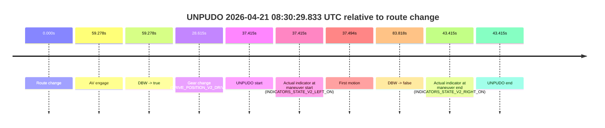
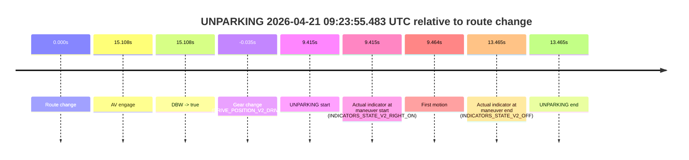

# Run Report: fme20009/2026-04-21--08-16-59--gen2-av-779e4337-43b6-4e32-9718-20d15fff1773

| Field | Value |
|---|---|
| Run ID | `fme20009/2026-04-21--08-16-59--gen2-av-779e4337-43b6-4e32-9718-20d15fff1773` |
| Date | `2026-04-21` |
| Model(s) | `pink-manta-ray-smooth` |
| Author | `guy.geva` |
| Event count | `6` |

## unpudo 2026-04-21 08:30:29.833 UTC

| Field | Value |
|---|---|
| Model | `pink-manta-ray-smooth` |
| Author | `guy.geva` |
| Run ID | `fme20009/2026-04-21--08-16-59--gen2-av-779e4337-43b6-4e32-9718-20d15fff1773` |
| Date | `2026-04-21` |
| Time (UTC) | `08:30:29.833` |
| Event type | `unpudo` |
| Disengagement type | `none observed` |
| Route change | `found` |
| Console | [run](https://console.sso.wayve.ai/run/fme20009/2026-04-21--08-16-59--gen2-av-779e4337-43b6-4e32-9718-20d15fff1773?id=&time-unixus=1776760229833327) |
| Foxglove | [segment](https://app.foxglove.dev/wayve-on-prem/p/prj_0dX18KZdVHg1fmmI/view?ds=foxglove-stream&ds.deviceName=fme20009&ds.start=2026-04-21T08%3A29%3A42.418251Z&ds.end=2026-04-21T08%3A31%3A26.236045Z&layoutId=lay_0e7VD4WIKDQGU73Y&time=2026-04-21T08%3A30%3A29.833327Z) |

### Event card: non-av

- Non-AV: there is no AV-owned portion anywhere inside the detected unpudo timeline, so it is kept for coverage but excluded from model success / failure scoring.

| Event | Time (UTC) | Delta from route change |
|---|---:|---:|
| Route change | 2026-04-21 08:29:52.418 | `0.000s` |
| AV engage | 2026-04-21 08:30:51.695 | `59.278s` |
| DBW -> true | 2026-04-21 08:30:51.695 | `59.278s` |
| Gear change (DRIVE_POSITION_V2_DRIVE) | 2026-04-21 08:30:21.033 | `28.615s` |
| UNPUDO start | 2026-04-21 08:30:29.833 | `37.415s` |
| Actual indicator at maneuver start (INDICATORS_STATE_V2_LEFT_ON) | 2026-04-21 08:30:29.833 | `37.415s` |
| First motion | 2026-04-21 08:30:29.912 | `37.494s` |
| DBW -> false | 2026-04-21 08:31:16.236 | `83.818s` |
| Actual indicator at maneuver end (INDICATORS_STATE_V2_RIGHT_ON) | 2026-04-21 08:30:35.833 | `43.415s` |
| UNPUDO end | 2026-04-21 08:30:35.833 | `43.415s` |

| Metric | Value |
|---|---|
| Outcome | `non-av` |
| Effective failure type | `none` |
| Route change status | `found` |
| DBW at event start | `false` |
| DBW at event end | `false` |
| Predicted gear at AV start | `DRIVE_POSITION_V2_DRIVE` |
| Actual gear at AV start | `DRIVE_POSITION_V2_DRIVE` |
| Predicted gear at event start | `DRIVE_POSITION_V2_DRIVE` |
| Actual gear at event start | `DRIVE_POSITION_V2_DRIVE` |
| Planned indicator direction | `INDICATORS_STATE_V2_LEFT_ON` |
| Controller indicator direction | `INDICATORS_STATE_V2_LEFT_ON` |
| Actual indicator direction | `INDICATORS_STATE_V2_LEFT_ON` |
| Actual indicator at maneuver end | `INDICATORS_STATE_V2_RIGHT_ON` |
| Driver accel help in AV | `false` |
| Driver accel help timestamp | `n/a` |
| Max accel pedal pct in AV | `0.0%` |
| Max brake pedal pct in AV | `0.0%` |
| Max speed mps in AV | `0.000` |
| Route -> AV | `59.278s` |
| AV -> event start | `-21.863s` |
| AV -> first motion | `-21.783s` |
| AV duration before disengagement | `24.540s` |
| Trajectory waypoint count | `35` |
| Driving-plan step count | `11` |

The scored portion starts from the AV-owned window, not from the pre-AV setup. Route-change search in the stopped pre-event segment was `found`, with the baseline therefore set to route change. At the event anchor the model predicts `DRIVE_POSITION_V2_DRIVE` and the actual gear is `DRIVE_POSITION_V2_DRIVE`. The effective model outcome is `non-av` because `there is no AV-owned overlap inside the event timeline`.

### Resolution

| Field | Value |
|---|---|
| Final outcome | `non-av` |
| Do we agree with this label? | `yes` |
| Source disengagement type | `none observed` |
| Resolved effective failure type | `none` |
| Confidence | `high` |

## unpudo 2026-04-21 09:03:09.133 UTC

| Field | Value |
|---|---|
| Model | `pink-manta-ray-smooth` |
| Author | `guy.geva` |
| Run ID | `fme20009/2026-04-21--08-16-59--gen2-av-779e4337-43b6-4e32-9718-20d15fff1773` |
| Date | `2026-04-21` |
| Time (UTC) | `09:03:09.133` |
| Event type | `unpudo` |
| Disengagement type | `none observed` |
| Route change | `found` |
| Console | [run](https://console.sso.wayve.ai/run/fme20009/2026-04-21--08-16-59--gen2-av-779e4337-43b6-4e32-9718-20d15fff1773?id=&time-unixus=1776762189133293) |
| Foxglove | [segment](https://app.foxglove.dev/wayve-on-prem/p/prj_0dX18KZdVHg1fmmI/view?ds=foxglove-stream&ds.deviceName=fme20009&ds.start=2026-04-21T09%3A02%3A43.318524Z&ds.end=2026-04-21T09%3A08%3A20.795828Z&layoutId=lay_0e7VD4WIKDQGU73Y&time=2026-04-21T09%3A03%3A09.133293Z) |

### Event card: non-av

- Non-AV: there is no AV-owned portion anywhere inside the detected unpudo timeline, so it is kept for coverage but excluded from model success / failure scoring.

| Event | Time (UTC) | Delta from route change |
|---|---:|---:|
| Route change | 2026-04-21 09:02:53.318 | `0.000s` |
| AV engage | 2026-04-21 09:03:21.415 | `28.097s` |
| DBW -> true | 2026-04-21 09:03:21.415 | `28.097s` |
| Gear change (DRIVE_POSITION_V2_DRIVE) | 2026-04-21 09:03:01.633 | `8.315s` |
| UNPUDO start | 2026-04-21 09:03:09.133 | `15.815s` |
| Actual indicator at maneuver start (INDICATORS_STATE_V2_OFF) | 2026-04-21 09:03:09.133 | `15.815s` |
| First motion | 2026-04-21 09:03:09.152 | `15.834s` |
| DBW -> false | 2026-04-21 09:08:10.795 | `317.477s` |
| Actual indicator at maneuver end (INDICATORS_STATE_V2_OFF) | 2026-04-21 09:03:12.733 | `19.415s` |
| UNPUDO end | 2026-04-21 09:03:12.733 | `19.415s` |

| Metric | Value |
|---|---|
| Outcome | `non-av` |
| Effective failure type | `none` |
| Route change status | `found` |
| DBW at event start | `false` |
| DBW at event end | `false` |
| Predicted gear at AV start | `DRIVE_POSITION_V2_DRIVE` |
| Actual gear at AV start | `DRIVE_POSITION_V2_DRIVE` |
| Predicted gear at event start | `DRIVE_POSITION_V2_DRIVE` |
| Actual gear at event start | `DRIVE_POSITION_V2_DRIVE` |
| Planned indicator direction | `INDICATORS_STATE_V2_OFF` |
| Controller indicator direction | `INDICATORS_STATE_V2_OFF` |
| Actual indicator direction | `INDICATORS_STATE_V2_OFF` |
| Actual indicator at maneuver end | `INDICATORS_STATE_V2_OFF` |
| Driver accel help in AV | `false` |
| Driver accel help timestamp | `n/a` |
| Max accel pedal pct in AV | `0.0%` |
| Max brake pedal pct in AV | `0.0%` |
| Max speed mps in AV | `0.000` |
| Route -> AV | `28.097s` |
| AV -> event start | `-12.283s` |
| AV -> first motion | `-12.263s` |
| AV duration before disengagement | `289.380s` |
| Trajectory waypoint count | `35` |
| Driving-plan step count | `11` |

The scored portion starts from the AV-owned window, not from the pre-AV setup. Route-change search in the stopped pre-event segment was `found`, with the baseline therefore set to route change. At the event anchor the model predicts `DRIVE_POSITION_V2_DRIVE` and the actual gear is `DRIVE_POSITION_V2_DRIVE`. The effective model outcome is `non-av` because `there is no AV-owned overlap inside the event timeline`.

### Resolution

| Field | Value |
|---|---|
| Final outcome | `non-av` |
| Do we agree with this label? | `yes` |
| Source disengagement type | `none observed` |
| Resolved effective failure type | `none` |
| Confidence | `high` |

## unpudo 2026-04-21 09:08:21.083 UTC

| Field | Value |
|---|---|
| Model | `pink-manta-ray-smooth` |
| Author | `guy.geva` |
| Run ID | `fme20009/2026-04-21--08-16-59--gen2-av-779e4337-43b6-4e32-9718-20d15fff1773` |
| Date | `2026-04-21` |
| Time (UTC) | `09:08:21.083` |
| Event type | `unpudo` |
| Disengagement type | `none observed` |
| Route change | `found` |
| Console | [run](https://console.sso.wayve.ai/run/fme20009/2026-04-21--08-16-59--gen2-av-779e4337-43b6-4e32-9718-20d15fff1773?id=&time-unixus=1776762501083294) |
| Foxglove | [segment](https://app.foxglove.dev/wayve-on-prem/p/prj_0dX18KZdVHg1fmmI/view?ds=foxglove-stream&ds.deviceName=fme20009&ds.start=2026-04-21T09%3A08%3A08.118235Z&ds.end=2026-04-21T09%3A12%3A08.296026Z&layoutId=lay_0e7VD4WIKDQGU73Y&time=2026-04-21T09%3A08%3A21.083294Z) |

### Event card: non-av

- Non-AV: there is no AV-owned portion anywhere inside the detected unpudo timeline, so it is kept for coverage but excluded from model success / failure scoring.

| Event | Time (UTC) | Delta from route change |
|---|---:|---:|
| Route change | 2026-04-21 09:08:18.118 | `0.000s` |
| AV engage | 2026-04-21 09:08:24.955 | `6.838s` |
| DBW -> true | 2026-04-21 09:08:24.955 | `6.838s` |
| Gear change (DRIVE_POSITION_V2_DRIVE) | 2026-04-21 09:08:18.233 | `0.115s` |
| UNPUDO start | 2026-04-21 09:08:21.083 | `2.965s` |
| Actual indicator at maneuver start (INDICATORS_STATE_V2_RIGHT_ON) | 2026-04-21 09:08:21.083 | `2.965s` |
| First motion | 2026-04-21 09:08:21.212 | `3.094s` |
| DBW -> false | 2026-04-21 09:11:58.296 | `220.178s` |
| Actual indicator at maneuver end (INDICATORS_STATE_V2_OFF) | 2026-04-21 09:08:24.433 | `6.315s` |
| UNPUDO end | 2026-04-21 09:08:24.433 | `6.315s` |

| Metric | Value |
|---|---|
| Outcome | `non-av` |
| Effective failure type | `none` |
| Route change status | `found` |
| DBW at event start | `false` |
| DBW at event end | `false` |
| Predicted gear at AV start | `DRIVE_POSITION_V2_DRIVE` |
| Actual gear at AV start | `DRIVE_POSITION_V2_DRIVE` |
| Predicted gear at event start | `DRIVE_POSITION_V2_DRIVE` |
| Actual gear at event start | `DRIVE_POSITION_V2_DRIVE` |
| Planned indicator direction | `INDICATORS_STATE_V2_OFF` |
| Controller indicator direction | `INDICATORS_STATE_V2_OFF` |
| Actual indicator direction | `INDICATORS_STATE_V2_RIGHT_ON` |
| Actual indicator at maneuver end | `INDICATORS_STATE_V2_OFF` |
| Driver accel help in AV | `false` |
| Driver accel help timestamp | `n/a` |
| Max accel pedal pct in AV | `0.0%` |
| Max brake pedal pct in AV | `0.0%` |
| Max speed mps in AV | `0.000` |
| Route -> AV | `6.838s` |
| AV -> event start | `-3.873s` |
| AV -> first motion | `-3.743s` |
| AV duration before disengagement | `213.340s` |
| Trajectory waypoint count | `36` |
| Driving-plan step count | `11` |

The scored portion starts from the AV-owned window, not from the pre-AV setup. Route-change search in the stopped pre-event segment was `found`, with the baseline therefore set to route change. At the event anchor the model predicts `DRIVE_POSITION_V2_DRIVE` and the actual gear is `DRIVE_POSITION_V2_DRIVE`. The effective model outcome is `non-av` because `there is no AV-owned overlap inside the event timeline`.

### Resolution

| Field | Value |
|---|---|
| Final outcome | `non-av` |
| Do we agree with this label? | `yes` |
| Source disengagement type | `none observed` |
| Resolved effective failure type | `none` |
| Confidence | `high` |

## unpudo 2026-04-21 09:13:10.933 UTC

| Field | Value |
|---|---|
| Model | `pink-manta-ray-smooth` |
| Author | `guy.geva` |
| Run ID | `fme20009/2026-04-21--08-16-59--gen2-av-779e4337-43b6-4e32-9718-20d15fff1773` |
| Date | `2026-04-21` |
| Time (UTC) | `09:13:10.933` |
| Event type | `unpudo` |
| Disengagement type | `none observed` |
| Route change | `found` |
| Console | [run](https://console.sso.wayve.ai/run/fme20009/2026-04-21--08-16-59--gen2-av-779e4337-43b6-4e32-9718-20d15fff1773?id=&time-unixus=1776762790933313) |
| Foxglove | [segment](https://app.foxglove.dev/wayve-on-prem/p/prj_0dX18KZdVHg1fmmI/view?ds=foxglove-stream&ds.deviceName=fme20009&ds.start=2026-04-21T09%3A12%3A34.568249Z&ds.end=2026-04-21T09%3A15%3A56.076066Z&layoutId=lay_0e7VD4WIKDQGU73Y&time=2026-04-21T09%3A13%3A10.933313Z) |

### Event card: non-av

- Non-AV: there is no AV-owned portion anywhere inside the detected unpudo timeline, so it is kept for coverage but excluded from model success / failure scoring.

| Event | Time (UTC) | Delta from route change |
|---|---:|---:|
| Route change | 2026-04-21 09:12:44.568 | `0.000s` |
| AV engage | 2026-04-21 09:13:48.876 | `64.308s` |
| DBW -> true | 2026-04-21 09:13:48.876 | `64.308s` |
| Gear change (DRIVE_POSITION_V2_DRIVE) | 2026-04-21 09:13:04.033 | `19.465s` |
| UNPUDO start | 2026-04-21 09:13:10.933 | `26.365s` |
| Actual indicator at maneuver start (INDICATORS_STATE_V2_RIGHT_ON) | 2026-04-21 09:13:10.933 | `26.365s` |
| First motion | 2026-04-21 09:13:11.112 | `26.544s` |
| DBW -> false | 2026-04-21 09:15:46.076 | `181.508s` |
| Actual indicator at maneuver end (INDICATORS_STATE_V2_OFF) | 2026-04-21 09:13:35.733 | `51.165s` |
| UNPUDO end | 2026-04-21 09:13:35.733 | `51.165s` |

| Metric | Value |
|---|---|
| Outcome | `non-av` |
| Effective failure type | `none` |
| Route change status | `found` |
| DBW at event start | `false` |
| DBW at event end | `false` |
| Predicted gear at AV start | `DRIVE_POSITION_V2_DRIVE` |
| Actual gear at AV start | `DRIVE_POSITION_V2_DRIVE` |
| Predicted gear at event start | `DRIVE_POSITION_V2_DRIVE` |
| Actual gear at event start | `DRIVE_POSITION_V2_DRIVE` |
| Planned indicator direction | `INDICATORS_STATE_V2_RIGHT_ON` |
| Controller indicator direction | `INDICATORS_STATE_V2_RIGHT_ON` |
| Actual indicator direction | `INDICATORS_STATE_V2_RIGHT_ON` |
| Actual indicator at maneuver end | `INDICATORS_STATE_V2_OFF` |
| Driver accel help in AV | `false` |
| Driver accel help timestamp | `n/a` |
| Max accel pedal pct in AV | `0.0%` |
| Max brake pedal pct in AV | `0.0%` |
| Max speed mps in AV | `0.000` |
| Route -> AV | `64.308s` |
| AV -> event start | `-37.943s` |
| AV -> first motion | `-37.764s` |
| AV duration before disengagement | `117.199s` |
| Trajectory waypoint count | `35` |
| Driving-plan step count | `11` |

The scored portion starts from the AV-owned window, not from the pre-AV setup. Route-change search in the stopped pre-event segment was `found`, with the baseline therefore set to route change. At the event anchor the model predicts `DRIVE_POSITION_V2_DRIVE` and the actual gear is `DRIVE_POSITION_V2_DRIVE`. The effective model outcome is `non-av` because `there is no AV-owned overlap inside the event timeline`.

### Resolution

| Field | Value |
|---|---|
| Final outcome | `non-av` |
| Do we agree with this label? | `yes` |
| Source disengagement type | `none observed` |
| Resolved effective failure type | `none` |
| Confidence | `high` |

## unpudo 2026-04-21 09:16:17.883 UTC

| Field | Value |
|---|---|
| Model | `pink-manta-ray-smooth` |
| Author | `guy.geva` |
| Run ID | `fme20009/2026-04-21--08-16-59--gen2-av-779e4337-43b6-4e32-9718-20d15fff1773` |
| Date | `2026-04-21` |
| Time (UTC) | `09:16:17.883` |
| Event type | `unpudo` |
| Disengagement type | `none observed` |
| Route change | `found` |
| Console | [run](https://console.sso.wayve.ai/run/fme20009/2026-04-21--08-16-59--gen2-av-779e4337-43b6-4e32-9718-20d15fff1773?id=&time-unixus=1776762977883317) |
| Foxglove | [segment](https://app.foxglove.dev/wayve-on-prem/p/prj_0dX18KZdVHg1fmmI/view?ds=foxglove-stream&ds.deviceName=fme20009&ds.start=2026-04-21T09%3A15%3A42.968336Z&ds.end=2026-04-21T09%3A18%3A52.875859Z&layoutId=lay_0e7VD4WIKDQGU73Y&time=2026-04-21T09%3A16%3A17.883317Z) |

### Event card: non-av

- Non-AV: there is no AV-owned portion anywhere inside the detected unpudo timeline, so it is kept for coverage but excluded from model success / failure scoring.

| Event | Time (UTC) | Delta from route change |
|---|---:|---:|
| Route change | 2026-04-21 09:15:52.968 | `0.000s` |
| AV engage | 2026-04-21 09:16:25.377 | `32.409s` |
| DBW -> true | 2026-04-21 09:16:25.377 | `32.409s` |
| Gear change (DRIVE_POSITION_V2_DRIVE) | 2026-04-21 09:16:12.433 | `19.465s` |
| UNPUDO start | 2026-04-21 09:16:17.883 | `24.915s` |
| Actual indicator at maneuver start (INDICATORS_STATE_V2_LEFT_ON) | 2026-04-21 09:16:17.883 | `24.915s` |
| First motion | 2026-04-21 09:16:17.932 | `24.964s` |
| DBW -> false | 2026-04-21 09:18:42.875 | `169.908s` |
| Actual indicator at maneuver end (INDICATORS_STATE_V2_OFF) | 2026-04-21 09:16:22.283 | `29.315s` |
| UNPUDO end | 2026-04-21 09:16:22.283 | `29.315s` |

| Metric | Value |
|---|---|
| Outcome | `non-av` |
| Effective failure type | `none` |
| Route change status | `found` |
| DBW at event start | `false` |
| DBW at event end | `false` |
| Predicted gear at AV start | `DRIVE_POSITION_V2_DRIVE` |
| Actual gear at AV start | `DRIVE_POSITION_V2_DRIVE` |
| Predicted gear at event start | `DRIVE_POSITION_V2_DRIVE` |
| Actual gear at event start | `DRIVE_POSITION_V2_DRIVE` |
| Planned indicator direction | `INDICATORS_STATE_V2_RIGHT_ON` |
| Controller indicator direction | `INDICATORS_STATE_V2_RIGHT_ON` |
| Actual indicator direction | `INDICATORS_STATE_V2_LEFT_ON` |
| Actual indicator at maneuver end | `INDICATORS_STATE_V2_OFF` |
| Driver accel help in AV | `false` |
| Driver accel help timestamp | `n/a` |
| Max accel pedal pct in AV | `0.0%` |
| Max brake pedal pct in AV | `0.0%` |
| Max speed mps in AV | `0.000` |
| Route -> AV | `32.409s` |
| AV -> event start | `-7.494s` |
| AV -> first motion | `-7.445s` |
| AV duration before disengagement | `137.499s` |
| Trajectory waypoint count | `36` |
| Driving-plan step count | `11` |

The scored portion starts from the AV-owned window, not from the pre-AV setup. Route-change search in the stopped pre-event segment was `found`, with the baseline therefore set to route change. At the event anchor the model predicts `DRIVE_POSITION_V2_DRIVE` and the actual gear is `DRIVE_POSITION_V2_DRIVE`. The effective model outcome is `non-av` because `there is no AV-owned overlap inside the event timeline`.

### Resolution

| Field | Value |
|---|---|
| Final outcome | `non-av` |
| Do we agree with this label? | `yes` |
| Source disengagement type | `none observed` |
| Resolved effective failure type | `none` |
| Confidence | `high` |

## unparking 2026-04-21 09:23:55.483 UTC

| Field | Value |
|---|---|
| Model | `pink-manta-ray-smooth` |
| Author | `guy.geva` |
| Run ID | `fme20009/2026-04-21--08-16-59--gen2-av-779e4337-43b6-4e32-9718-20d15fff1773` |
| Date | `2026-04-21` |
| Time (UTC) | `09:23:55.483` |
| Event type | `unparking` |
| Disengagement type | `none observed` |
| Route change | `found` |
| Console | [run](https://console.sso.wayve.ai/run/fme20009/2026-04-21--08-16-59--gen2-av-779e4337-43b6-4e32-9718-20d15fff1773?id=&time-unixus=1776763435483317) |
| Foxglove | [segment](https://app.foxglove.dev/wayve-on-prem/p/prj_0dX18KZdVHg1fmmI/view?ds=foxglove-stream&ds.deviceName=fme20009&ds.start=2026-04-21T09%3A23%3A36.033315Z&ds.end=2026-04-21T09%3A24%3A09.533323Z&layoutId=lay_0e7VD4WIKDQGU73Y&time=2026-04-21T09%3A23%3A55.483317Z) |

### Event card: non-av

- Non-AV: there is no AV-owned portion anywhere inside the detected unparking timeline, so it is kept for coverage but excluded from model success / failure scoring.

| Event | Time (UTC) | Delta from route change |
|---|---:|---:|
| Route change | 2026-04-21 09:23:46.068 | `0.000s` |
| AV engage | 2026-04-21 09:24:01.175 | `15.108s` |
| DBW -> true | 2026-04-21 09:24:01.175 | `15.108s` |
| Gear change (DRIVE_POSITION_V2_DRIVE) | 2026-04-21 09:23:46.033 | `-0.035s` |
| UNPARKING start | 2026-04-21 09:23:55.483 | `9.415s` |
| Actual indicator at maneuver start (INDICATORS_STATE_V2_RIGHT_ON) | 2026-04-21 09:23:55.483 | `9.415s` |
| First motion | 2026-04-21 09:23:55.532 | `9.464s` |
| Actual indicator at maneuver end (INDICATORS_STATE_V2_OFF) | 2026-04-21 09:23:59.533 | `13.465s` |
| UNPARKING end | 2026-04-21 09:23:59.533 | `13.465s` |

| Metric | Value |
|---|---|
| Outcome | `non-av` |
| Effective failure type | `none` |
| Route change status | `found` |
| DBW at event start | `false` |
| DBW at event end | `false` |
| Predicted gear at AV start | `DRIVE_POSITION_V2_DRIVE` |
| Actual gear at AV start | `DRIVE_POSITION_V2_DRIVE` |
| Predicted gear at event start | `DRIVE_POSITION_V2_DRIVE` |
| Actual gear at event start | `DRIVE_POSITION_V2_DRIVE` |
| Planned indicator direction | `INDICATORS_STATE_V2_LEFT_ON` |
| Controller indicator direction | `INDICATORS_STATE_V2_LEFT_ON` |
| Actual indicator direction | `INDICATORS_STATE_V2_RIGHT_ON` |
| Actual indicator at maneuver end | `INDICATORS_STATE_V2_OFF` |
| Driver accel help in AV | `false` |
| Driver accel help timestamp | `n/a` |
| Max accel pedal pct in AV | `0.0%` |
| Max brake pedal pct in AV | `0.0%` |
| Max speed mps in AV | `0.000` |
| Route -> AV | `15.108s` |
| AV -> event start | `-5.693s` |
| AV -> first motion | `-5.643s` |
| AV duration before disengagement | `n/a` |
| Trajectory waypoint count | `36` |
| Driving-plan step count | `11` |

The scored portion starts from the AV-owned window, not from the pre-AV setup. Route-change search in the stopped pre-event segment was `found`, with the baseline therefore set to route change. At the event anchor the model predicts `DRIVE_POSITION_V2_DRIVE` and the actual gear is `DRIVE_POSITION_V2_DRIVE`. The effective model outcome is `non-av` because `there is no AV-owned overlap inside the event timeline`.

### Resolution

| Field | Value |
|---|---|
| Final outcome | `non-av` |
| Do we agree with this label? | `yes` |
| Source disengagement type | `none observed` |
| Resolved effective failure type | `none` |
| Confidence | `high` |
