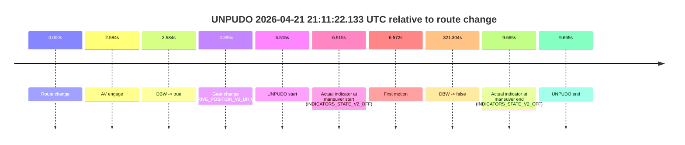
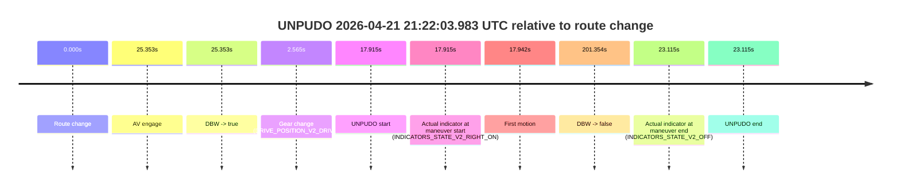
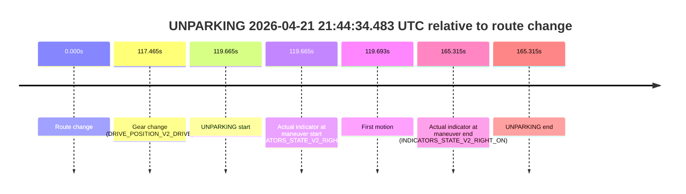

# Run Report: fme20009/2026-04-21--20-53-31--gen2-av-c485ff0d-599e-495f-bee7-17c4a854ab52

| Field | Value |
|---|---|
| Run ID | `fme20009/2026-04-21--20-53-31--gen2-av-c485ff0d-599e-495f-bee7-17c4a854ab52` |
| Date | `2026-04-21` |
| Model(s) | `blue-panther-solid` |
| Author | `guy.geva` |
| Event count | `7` |

## unpudo 2026-04-21 21:00:31.483 UTC

| Field | Value |
|---|---|
| Model | `blue-panther-solid` |
| Author | `guy.geva` |
| Run ID | `fme20009/2026-04-21--20-53-31--gen2-av-c485ff0d-599e-495f-bee7-17c4a854ab52` |
| Date | `2026-04-21` |
| Time (UTC) | `21:00:31.483` |
| Event type | `unpudo` |
| Disengagement type | `none observed` |
| Route change | `found` |
| Console | [run](https://console.sso.wayve.ai/run/fme20009/2026-04-21--20-53-31--gen2-av-c485ff0d-599e-495f-bee7-17c4a854ab52?id=&time-unixus=1776805231483302) |
| Foxglove | [segment](https://app.foxglove.dev/wayve-on-prem/p/prj_0dX18KZdVHg1fmmI/view?ds=foxglove-stream&ds.deviceName=fme20009&ds.start=2026-04-21T20%3A59%3A39.018262Z&ds.end=2026-04-21T21%3A03%3A03.962256Z&layoutId=lay_0e7VD4WIKDQGU73Y&time=2026-04-21T21%3A00%3A31.483302Z) |

### Event card: fail

- Fail: the credited unpudo does not stay AV-owned. The event window starts with DBW false, and the maneuver outcome lands outside a clean AV-owned segment.

| Event | Time (UTC) | Delta from route change |
|---|---:|---:|
| Route change | 2026-04-21 20:59:49.018 | `0.000s` |
| AV engage | 2026-04-21 21:01:17.802 | `88.784s` |
| DBW -> true | 2026-04-21 21:01:17.802 | `88.784s` |
| Gear change (DRIVE_POSITION_V2_REVERSE) | 2026-04-21 21:00:26.333 | `37.315s` |
| UNPUDO start | 2026-04-21 21:00:31.483 | `42.465s` |
| Actual indicator at maneuver start (INDICATORS_STATE_V2_OFF) | 2026-04-21 21:00:31.483 | `42.465s` |
| First motion | 2026-04-21 21:00:39.550 | `50.532s` |
| DBW -> false | 2026-04-21 21:02:53.962 | `184.944s` |
| Actual indicator at maneuver end (INDICATORS_STATE_V2_OFF) | 2026-04-21 21:01:13.783 | `84.765s` |
| UNPUDO end | 2026-04-21 21:01:13.783 | `84.765s` |

| Metric | Value |
|---|---|
| Outcome | `fail` |
| Effective failure type | `completed_outside_av` |
| Route change status | `found` |
| DBW at event start | `false` |
| DBW at event end | `false` |
| Predicted gear at AV start | `DRIVE_POSITION_V2_DRIVE` |
| Actual gear at AV start | `DRIVE_POSITION_V2_DRIVE` |
| Predicted gear at event start | `DRIVE_POSITION_V2_REVERSE` |
| Actual gear at event start | `DRIVE_POSITION_V2_REVERSE` |
| Planned indicator direction | `INDICATORS_STATE_V2_OFF` |
| Controller indicator direction | `INDICATORS_STATE_V2_OFF` |
| Actual indicator direction | `INDICATORS_STATE_V2_OFF` |
| Actual indicator at maneuver end | `INDICATORS_STATE_V2_OFF` |
| Driver accel help in AV | `false` |
| Driver accel help timestamp | `n/a` |
| Max accel pedal pct in AV | `0.0%` |
| Max brake pedal pct in AV | `0.0%` |
| Max speed mps in AV | `0.000` |
| Route -> AV | `88.784s` |
| AV -> event start | `-46.319s` |
| AV -> first motion | `-38.252s` |
| AV duration before disengagement | `96.160s` |
| Trajectory waypoint count | `37` |
| Driving-plan step count | `11` |

The scored portion starts from the AV-owned window, not from the pre-AV setup. Route-change search in the stopped pre-event segment was `found`, with the baseline therefore set to route change. At the event anchor the model predicts `DRIVE_POSITION_V2_REVERSE` and the actual gear is `DRIVE_POSITION_V2_REVERSE`. The effective model outcome is `fail` because `completed_outside_av`.

### Resolution

| Field | Value |
|---|---|
| Final outcome | `fail` |
| Do we agree with this label? | `yes` |
| Source disengagement type | `none observed` |
| Resolved effective failure type | `completed_outside_av` |
| Confidence | `high` |

## unpudo 2026-04-21 21:07:56.133 UTC

| Field | Value |
|---|---|
| Model | `blue-panther-solid` |
| Author | `guy.geva` |
| Run ID | `fme20009/2026-04-21--20-53-31--gen2-av-c485ff0d-599e-495f-bee7-17c4a854ab52` |
| Date | `2026-04-21` |
| Time (UTC) | `21:07:56.133` |
| Event type | `unpudo` |
| Disengagement type | `none observed` |
| Route change | `found` |
| Console | [run](https://console.sso.wayve.ai/run/fme20009/2026-04-21--20-53-31--gen2-av-c485ff0d-599e-495f-bee7-17c4a854ab52?id=&time-unixus=1776805676133296) |
| Foxglove | [segment](https://app.foxglove.dev/wayve-on-prem/p/prj_0dX18KZdVHg1fmmI/view?ds=foxglove-stream&ds.deviceName=fme20009&ds.start=2026-04-21T21%3A07%3A32.968346Z&ds.end=2026-04-21T21%3A11%3A18.041113Z&layoutId=lay_0e7VD4WIKDQGU73Y&time=2026-04-21T21%3A07%3A56.133296Z) |

### Event card: fail

- Fail: the credited unpudo does not stay AV-owned. The event window starts with DBW false, and the maneuver outcome lands outside a clean AV-owned segment.

| Event | Time (UTC) | Delta from route change |
|---|---:|---:|
| Route change | 2026-04-21 21:07:42.968 | `0.000s` |
| AV engage | 2026-04-21 21:08:04.400 | `21.433s` |
| DBW -> true | 2026-04-21 21:08:04.400 | `21.433s` |
| Gear change (DRIVE_POSITION_V2_DRIVE) | 2026-04-21 21:07:47.683 | `4.715s` |
| UNPUDO start | 2026-04-21 21:07:56.133 | `13.165s` |
| Actual indicator at maneuver start (INDICATORS_STATE_V2_RIGHT_ON) | 2026-04-21 21:07:56.133 | `13.165s` |
| First motion | 2026-04-21 21:07:56.170 | `13.202s` |
| DBW -> false | 2026-04-21 21:11:08.041 | `205.073s` |
| Actual indicator at maneuver end (INDICATORS_STATE_V2_OFF) | 2026-04-21 21:08:00.083 | `17.115s` |
| UNPUDO end | 2026-04-21 21:08:00.083 | `17.115s` |

| Metric | Value |
|---|---|
| Outcome | `fail` |
| Effective failure type | `completed_outside_av` |
| Route change status | `found` |
| DBW at event start | `false` |
| DBW at event end | `false` |
| Predicted gear at AV start | `DRIVE_POSITION_V2_DRIVE` |
| Actual gear at AV start | `DRIVE_POSITION_V2_DRIVE` |
| Predicted gear at event start | `DRIVE_POSITION_V2_DRIVE` |
| Actual gear at event start | `DRIVE_POSITION_V2_DRIVE` |
| Planned indicator direction | `INDICATORS_STATE_V2_RIGHT_ON` |
| Controller indicator direction | `INDICATORS_STATE_V2_RIGHT_ON` |
| Actual indicator direction | `INDICATORS_STATE_V2_RIGHT_ON` |
| Actual indicator at maneuver end | `INDICATORS_STATE_V2_OFF` |
| Driver accel help in AV | `false` |
| Driver accel help timestamp | `n/a` |
| Max accel pedal pct in AV | `0.0%` |
| Max brake pedal pct in AV | `0.0%` |
| Max speed mps in AV | `0.000` |
| Route -> AV | `21.433s` |
| AV -> event start | `-8.268s` |
| AV -> first motion | `-8.231s` |
| AV duration before disengagement | `183.640s` |
| Trajectory waypoint count | `36` |
| Driving-plan step count | `11` |

The scored portion starts from the AV-owned window, not from the pre-AV setup. Route-change search in the stopped pre-event segment was `found`, with the baseline therefore set to route change. At the event anchor the model predicts `DRIVE_POSITION_V2_DRIVE` and the actual gear is `DRIVE_POSITION_V2_DRIVE`. The effective model outcome is `fail` because `completed_outside_av`.

### Resolution

| Field | Value |
|---|---|
| Final outcome | `fail` |
| Do we agree with this label? | `yes` |
| Source disengagement type | `none observed` |
| Resolved effective failure type | `completed_outside_av` |
| Confidence | `high` |

## unpudo 2026-04-21 21:11:22.133 UTC

| Field | Value |
|---|---|
| Model | `blue-panther-solid` |
| Author | `guy.geva` |
| Run ID | `fme20009/2026-04-21--20-53-31--gen2-av-c485ff0d-599e-495f-bee7-17c4a854ab52` |
| Date | `2026-04-21` |
| Time (UTC) | `21:11:22.133` |
| Event type | `unpudo` |
| Disengagement type | `none observed` |
| Route change | `found` |
| Console | [run](https://console.sso.wayve.ai/run/fme20009/2026-04-21--20-53-31--gen2-av-c485ff0d-599e-495f-bee7-17c4a854ab52?id=&time-unixus=1776805882133301) |
| Foxglove | [segment](https://app.foxglove.dev/wayve-on-prem/p/prj_0dX18KZdVHg1fmmI/view?ds=foxglove-stream&ds.deviceName=fme20009&ds.start=2026-04-21T21%3A11%3A02.733309Z&ds.end=2026-04-21T21%3A16%3A46.922141Z&layoutId=lay_0e7VD4WIKDQGU73Y&time=2026-04-21T21%3A11%3A22.133301Z) |

### Event card: pass

- Pass: AV owns the credited unpudo through the official event window, the gear state is aligned at the anchor, and the vehicle moves without driver accelerator help in AV.

| Event | Time (UTC) | Delta from route change |
|---|---:|---:|
| Route change | 2026-04-21 21:11:15.618 | `0.000s` |
| AV engage | 2026-04-21 21:11:18.201 | `2.584s` |
| DBW -> true | 2026-04-21 21:11:18.201 | `2.584s` |
| Gear change (DRIVE_POSITION_V2_DRIVE) | 2026-04-21 21:11:12.733 | `-2.885s` |
| UNPUDO start | 2026-04-21 21:11:22.133 | `6.515s` |
| Actual indicator at maneuver start (INDICATORS_STATE_V2_OFF) | 2026-04-21 21:11:22.133 | `6.515s` |
| First motion | 2026-04-21 21:11:22.190 | `6.572s` |
| DBW -> false | 2026-04-21 21:16:36.922 | `321.304s` |
| Actual indicator at maneuver end (INDICATORS_STATE_V2_OFF) | 2026-04-21 21:11:25.283 | `9.665s` |
| UNPUDO end | 2026-04-21 21:11:25.283 | `9.665s` |

| Metric | Value |
|---|---|
| Outcome | `pass` |
| Effective failure type | `none` |
| Route change status | `found` |
| DBW at event start | `true` |
| DBW at event end | `true` |
| Predicted gear at AV start | `DRIVE_POSITION_V2_DRIVE` |
| Actual gear at AV start | `DRIVE_POSITION_V2_DRIVE` |
| Predicted gear at event start | `DRIVE_POSITION_V2_DRIVE` |
| Actual gear at event start | `DRIVE_POSITION_V2_DRIVE` |
| Planned indicator direction | `INDICATORS_STATE_V2_RIGHT_ON` |
| Controller indicator direction | `INDICATORS_STATE_V2_RIGHT_ON` |
| Actual indicator direction | `INDICATORS_STATE_V2_OFF` |
| Actual indicator at maneuver end | `INDICATORS_STATE_V2_OFF` |
| Driver accel help in AV | `false` |
| Driver accel help timestamp | `n/a` |
| Max accel pedal pct in AV | `0.0%` |
| Max brake pedal pct in AV | `10.8%` |
| Max speed mps in AV | `5.433` |
| Route -> AV | `2.584s` |
| AV -> event start | `3.931s` |
| AV -> first motion | `3.989s` |
| AV duration before disengagement | `318.720s` |
| Trajectory waypoint count | `36` |
| Driving-plan step count | `11` |

The scored portion starts from the AV-owned window, not from the pre-AV setup. Route-change search in the stopped pre-event segment was `found`, with the baseline therefore set to route change. At the event anchor the model predicts `DRIVE_POSITION_V2_DRIVE` and the actual gear is `DRIVE_POSITION_V2_DRIVE`. The effective model outcome is `pass` because `the credited maneuver stays AV-owned through the official event end`.

### Resolution

| Field | Value |
|---|---|
| Final outcome | `pass` |
| Do we agree with this label? | `yes` |
| Source disengagement type | `none observed` |
| Resolved effective failure type | `none` |
| Confidence | `high` |

## unpudo 2026-04-21 21:17:55.433 UTC

| Field | Value |
|---|---|
| Model | `blue-panther-solid` |
| Author | `guy.geva` |
| Run ID | `fme20009/2026-04-21--20-53-31--gen2-av-c485ff0d-599e-495f-bee7-17c4a854ab52` |
| Date | `2026-04-21` |
| Time (UTC) | `21:17:55.433` |
| Event type | `unpudo` |
| Disengagement type | `none observed` |
| Route change | `found` |
| Console | [run](https://console.sso.wayve.ai/run/fme20009/2026-04-21--20-53-31--gen2-av-c485ff0d-599e-495f-bee7-17c4a854ab52?id=&time-unixus=1776806275433311) |
| Foxglove | [segment](https://app.foxglove.dev/wayve-on-prem/p/prj_0dX18KZdVHg1fmmI/view?ds=foxglove-stream&ds.deviceName=fme20009&ds.start=2026-04-21T21%3A17%3A03.168877Z&ds.end=2026-04-21T21%3A21%3A20.402262Z&layoutId=lay_0e7VD4WIKDQGU73Y&time=2026-04-21T21%3A17%3A55.433311Z) |

### Event card: pass

- Pass: AV owns the credited unpudo through the official event window, the gear state is aligned at the anchor, and the vehicle moves without driver accelerator help in AV.

| Event | Time (UTC) | Delta from route change |
|---|---:|---:|
| Route change | 2026-04-21 21:17:13.168 | `0.000s` |
| AV engage | 2026-04-21 21:17:46.221 | `33.052s` |
| DBW -> true | 2026-04-21 21:17:46.221 | `33.052s` |
| Gear change (DRIVE_POSITION_V2_DRIVE) | 2026-04-21 21:17:18.833 | `5.664s` |
| UNPUDO start | 2026-04-21 21:17:55.433 | `42.264s` |
| Actual indicator at maneuver start (INDICATORS_STATE_V2_RIGHT_ON) | 2026-04-21 21:17:55.433 | `42.264s` |
| First motion | 2026-04-21 21:17:55.470 | `42.302s` |
| DBW -> false | 2026-04-21 21:21:10.402 | `237.233s` |
| Actual indicator at maneuver end (INDICATORS_STATE_V2_RIGHT_ON) | 2026-04-21 21:18:01.083 | `47.914s` |
| UNPUDO end | 2026-04-21 21:18:01.083 | `47.914s` |

| Metric | Value |
|---|---|
| Outcome | `pass` |
| Effective failure type | `none` |
| Route change status | `found` |
| DBW at event start | `true` |
| DBW at event end | `true` |
| Predicted gear at AV start | `DRIVE_POSITION_V2_DRIVE` |
| Actual gear at AV start | `DRIVE_POSITION_V2_DRIVE` |
| Predicted gear at event start | `DRIVE_POSITION_V2_DRIVE` |
| Actual gear at event start | `DRIVE_POSITION_V2_DRIVE` |
| Planned indicator direction | `INDICATORS_STATE_V2_RIGHT_ON` |
| Controller indicator direction | `INDICATORS_STATE_V2_RIGHT_ON` |
| Actual indicator direction | `INDICATORS_STATE_V2_RIGHT_ON` |
| Actual indicator at maneuver end | `INDICATORS_STATE_V2_RIGHT_ON` |
| Driver accel help in AV | `false` |
| Driver accel help timestamp | `n/a` |
| Max accel pedal pct in AV | `0.0%` |
| Max brake pedal pct in AV | `8.0%` |
| Max speed mps in AV | `4.094` |
| Route -> AV | `33.052s` |
| AV -> event start | `9.212s` |
| AV -> first motion | `9.249s` |
| AV duration before disengagement | `204.181s` |
| Trajectory waypoint count | `36` |
| Driving-plan step count | `11` |

The scored portion starts from the AV-owned window, not from the pre-AV setup. Route-change search in the stopped pre-event segment was `found`, with the baseline therefore set to route change. At the event anchor the model predicts `DRIVE_POSITION_V2_DRIVE` and the actual gear is `DRIVE_POSITION_V2_DRIVE`. The effective model outcome is `pass` because `the credited maneuver stays AV-owned through the official event end`.

### Resolution

| Field | Value |
|---|---|
| Final outcome | `pass` |
| Do we agree with this label? | `yes` |
| Source disengagement type | `none observed` |
| Resolved effective failure type | `none` |
| Confidence | `high` |

## unpudo 2026-04-21 21:22:03.983 UTC

| Field | Value |
|---|---|
| Model | `blue-panther-solid` |
| Author | `guy.geva` |
| Run ID | `fme20009/2026-04-21--20-53-31--gen2-av-c485ff0d-599e-495f-bee7-17c4a854ab52` |
| Date | `2026-04-21` |
| Time (UTC) | `21:22:03.983` |
| Event type | `unpudo` |
| Disengagement type | `none observed` |
| Route change | `found` |
| Console | [run](https://console.sso.wayve.ai/run/fme20009/2026-04-21--20-53-31--gen2-av-c485ff0d-599e-495f-bee7-17c4a854ab52?id=&time-unixus=1776806523983321) |
| Foxglove | [segment](https://app.foxglove.dev/wayve-on-prem/p/prj_0dX18KZdVHg1fmmI/view?ds=foxglove-stream&ds.deviceName=fme20009&ds.start=2026-04-21T21%3A21%3A36.068503Z&ds.end=2026-04-21T21%3A25%3A17.422136Z&layoutId=lay_0e7VD4WIKDQGU73Y&time=2026-04-21T21%3A22%3A03.983321Z) |

### Event card: fail

- Fail: the credited unpudo does not stay AV-owned. The event window starts with DBW false, and the maneuver outcome lands outside a clean AV-owned segment.

| Event | Time (UTC) | Delta from route change |
|---|---:|---:|
| Route change | 2026-04-21 21:21:46.068 | `0.000s` |
| AV engage | 2026-04-21 21:22:11.421 | `25.353s` |
| DBW -> true | 2026-04-21 21:22:11.421 | `25.353s` |
| Gear change (DRIVE_POSITION_V2_DRIVE) | 2026-04-21 21:21:48.633 | `2.565s` |
| UNPUDO start | 2026-04-21 21:22:03.983 | `17.915s` |
| Actual indicator at maneuver start (INDICATORS_STATE_V2_RIGHT_ON) | 2026-04-21 21:22:03.983 | `17.915s` |
| First motion | 2026-04-21 21:22:04.010 | `17.942s` |
| DBW -> false | 2026-04-21 21:25:07.422 | `201.354s` |
| Actual indicator at maneuver end (INDICATORS_STATE_V2_OFF) | 2026-04-21 21:22:09.183 | `23.115s` |
| UNPUDO end | 2026-04-21 21:22:09.183 | `23.115s` |

| Metric | Value |
|---|---|
| Outcome | `fail` |
| Effective failure type | `completed_outside_av` |
| Route change status | `found` |
| DBW at event start | `false` |
| DBW at event end | `false` |
| Predicted gear at AV start | `DRIVE_POSITION_V2_DRIVE` |
| Actual gear at AV start | `DRIVE_POSITION_V2_DRIVE` |
| Predicted gear at event start | `DRIVE_POSITION_V2_DRIVE` |
| Actual gear at event start | `DRIVE_POSITION_V2_DRIVE` |
| Planned indicator direction | `INDICATORS_STATE_V2_RIGHT_ON` |
| Controller indicator direction | `INDICATORS_STATE_V2_RIGHT_ON` |
| Actual indicator direction | `INDICATORS_STATE_V2_RIGHT_ON` |
| Actual indicator at maneuver end | `INDICATORS_STATE_V2_OFF` |
| Driver accel help in AV | `false` |
| Driver accel help timestamp | `n/a` |
| Max accel pedal pct in AV | `0.0%` |
| Max brake pedal pct in AV | `0.0%` |
| Max speed mps in AV | `0.000` |
| Route -> AV | `25.353s` |
| AV -> event start | `-7.438s` |
| AV -> first motion | `-7.411s` |
| AV duration before disengagement | `176.001s` |
| Trajectory waypoint count | `37` |
| Driving-plan step count | `11` |

The scored portion starts from the AV-owned window, not from the pre-AV setup. Route-change search in the stopped pre-event segment was `found`, with the baseline therefore set to route change. At the event anchor the model predicts `DRIVE_POSITION_V2_DRIVE` and the actual gear is `DRIVE_POSITION_V2_DRIVE`. The effective model outcome is `fail` because `completed_outside_av`.

### Resolution

| Field | Value |
|---|---|
| Final outcome | `fail` |
| Do we agree with this label? | `yes` |
| Source disengagement type | `none observed` |
| Resolved effective failure type | `completed_outside_av` |
| Confidence | `high` |

## unpudo 2026-04-21 21:35:15.433 UTC

| Field | Value |
|---|---|
| Model | `blue-panther-solid` |
| Author | `guy.geva` |
| Run ID | `fme20009/2026-04-21--20-53-31--gen2-av-c485ff0d-599e-495f-bee7-17c4a854ab52` |
| Date | `2026-04-21` |
| Time (UTC) | `21:35:15.433` |
| Event type | `unpudo` |
| Disengagement type | `none observed` |
| Route change | `found` |
| Console | [run](https://console.sso.wayve.ai/run/fme20009/2026-04-21--20-53-31--gen2-av-c485ff0d-599e-495f-bee7-17c4a854ab52?id=&time-unixus=1776807315433317) |
| Foxglove | [segment](https://app.foxglove.dev/wayve-on-prem/p/prj_0dX18KZdVHg1fmmI/view?ds=foxglove-stream&ds.deviceName=fme20009&ds.start=2026-04-21T21%3A34%3A49.569035Z&ds.end=2026-04-21T21%3A36%3A57.681343Z&layoutId=lay_0e7VD4WIKDQGU73Y&time=2026-04-21T21%3A35%3A15.433317Z) |

### Event card: fail

- Fail: the credited unpudo does not stay AV-owned. The event window starts with DBW false, and the maneuver outcome lands outside a clean AV-owned segment.

| Event | Time (UTC) | Delta from route change |
|---|---:|---:|
| Route change | 2026-04-21 21:34:59.569 | `0.000s` |
| AV engage | 2026-04-21 21:35:26.620 | `27.052s` |
| DBW -> true | 2026-04-21 21:35:26.620 | `27.052s` |
| Gear change (DRIVE_POSITION_V2_DRIVE) | 2026-04-21 21:35:01.033 | `1.464s` |
| UNPUDO start | 2026-04-21 21:35:15.433 | `15.864s` |
| Actual indicator at maneuver start (INDICATORS_STATE_V2_OFF) | 2026-04-21 21:35:15.433 | `15.864s` |
| First motion | 2026-04-21 21:35:15.510 | `15.941s` |
| DBW -> false | 2026-04-21 21:36:47.681 | `108.112s` |
| Actual indicator at maneuver end (INDICATORS_STATE_V2_OFF) | 2026-04-21 21:35:20.633 | `21.064s` |
| UNPUDO end | 2026-04-21 21:35:20.633 | `21.064s` |

| Metric | Value |
|---|---|
| Outcome | `fail` |
| Effective failure type | `completed_outside_av` |
| Route change status | `found` |
| DBW at event start | `false` |
| DBW at event end | `false` |
| Predicted gear at AV start | `DRIVE_POSITION_V2_DRIVE` |
| Actual gear at AV start | `DRIVE_POSITION_V2_DRIVE` |
| Predicted gear at event start | `DRIVE_POSITION_V2_DRIVE` |
| Actual gear at event start | `DRIVE_POSITION_V2_DRIVE` |
| Planned indicator direction | `INDICATORS_STATE_V2_RIGHT_ON` |
| Controller indicator direction | `INDICATORS_STATE_V2_RIGHT_ON` |
| Actual indicator direction | `INDICATORS_STATE_V2_OFF` |
| Actual indicator at maneuver end | `INDICATORS_STATE_V2_OFF` |
| Driver accel help in AV | `false` |
| Driver accel help timestamp | `n/a` |
| Max accel pedal pct in AV | `0.0%` |
| Max brake pedal pct in AV | `0.0%` |
| Max speed mps in AV | `0.000` |
| Route -> AV | `27.052s` |
| AV -> event start | `-11.188s` |
| AV -> first motion | `-11.111s` |
| AV duration before disengagement | `81.060s` |
| Trajectory waypoint count | `36` |
| Driving-plan step count | `11` |

The scored portion starts from the AV-owned window, not from the pre-AV setup. Route-change search in the stopped pre-event segment was `found`, with the baseline therefore set to route change. At the event anchor the model predicts `DRIVE_POSITION_V2_DRIVE` and the actual gear is `DRIVE_POSITION_V2_DRIVE`. The effective model outcome is `fail` because `completed_outside_av`.

### Resolution

| Field | Value |
|---|---|
| Final outcome | `fail` |
| Do we agree with this label? | `yes` |
| Source disengagement type | `none observed` |
| Resolved effective failure type | `completed_outside_av` |
| Confidence | `high` |

## unparking 2026-04-21 21:44:34.483 UTC

| Field | Value |
|---|---|
| Model | `blue-panther-solid` |
| Author | `guy.geva` |
| Run ID | `fme20009/2026-04-21--20-53-31--gen2-av-c485ff0d-599e-495f-bee7-17c4a854ab52` |
| Date | `2026-04-21` |
| Time (UTC) | `21:44:34.483` |
| Event type | `unparking` |
| Disengagement type | `none observed` |
| Route change | `found` |
| Console | [run](https://console.sso.wayve.ai/run/fme20009/2026-04-21--20-53-31--gen2-av-c485ff0d-599e-495f-bee7-17c4a854ab52?id=&time-unixus=1776807874483300) |
| Foxglove | [segment](https://app.foxglove.dev/wayve-on-prem/p/prj_0dX18KZdVHg1fmmI/view?ds=foxglove-stream&ds.deviceName=fme20009&ds.start=2026-04-21T21%3A42%3A24.818209Z&ds.end=2026-04-21T21%3A45%3A30.133293Z&layoutId=lay_0e7VD4WIKDQGU73Y&time=2026-04-21T21%3A44%3A34.483300Z) |

### Event card: fail

- Fail: the credited unparking does not stay AV-owned. The event window starts with DBW false, and the maneuver outcome lands outside a clean AV-owned segment.

| Event | Time (UTC) | Delta from route change |
|---|---:|---:|
| Route change | 2026-04-21 21:42:34.818 | `0.000s` |
| Gear change (DRIVE_POSITION_V2_DRIVE) | 2026-04-21 21:44:32.283 | `117.465s` |
| UNPARKING start | 2026-04-21 21:44:34.483 | `119.665s` |
| Actual indicator at maneuver start (INDICATORS_STATE_V2_RIGHT_ON) | 2026-04-21 21:44:34.483 | `119.665s` |
| First motion | 2026-04-21 21:44:34.510 | `119.693s` |
| Actual indicator at maneuver end (INDICATORS_STATE_V2_RIGHT_ON) | 2026-04-21 21:45:20.133 | `165.315s` |
| UNPARKING end | 2026-04-21 21:45:20.133 | `165.315s` |

| Metric | Value |
|---|---|
| Outcome | `fail` |
| Effective failure type | `not_av_owned` |
| Route change status | `found` |
| DBW at event start | `false` |
| DBW at event end | `false` |
| Predicted gear at AV start | `n/a` |
| Actual gear at AV start | `n/a` |
| Predicted gear at event start | `DRIVE_POSITION_V2_DRIVE` |
| Actual gear at event start | `DRIVE_POSITION_V2_DRIVE` |
| Planned indicator direction | `INDICATORS_STATE_V2_OFF` |
| Controller indicator direction | `INDICATORS_STATE_V2_OFF` |
| Actual indicator direction | `INDICATORS_STATE_V2_RIGHT_ON` |
| Actual indicator at maneuver end | `INDICATORS_STATE_V2_RIGHT_ON` |
| Driver accel help in AV | `false` |
| Driver accel help timestamp | `n/a` |
| Max accel pedal pct in AV | `0.0%` |
| Max brake pedal pct in AV | `0.0%` |
| Max speed mps in AV | `0.000` |
| Route -> AV | `n/a` |
| AV -> event start | `n/a` |
| AV -> first motion | `n/a` |
| AV duration before disengagement | `n/a` |
| Trajectory waypoint count | `37` |
| Driving-plan step count | `11` |

The scored portion starts from the AV-owned window, not from the pre-AV setup. Route-change search in the stopped pre-event segment was `found`, with the baseline therefore set to route change. At the event anchor the model predicts `DRIVE_POSITION_V2_DRIVE` and the actual gear is `DRIVE_POSITION_V2_DRIVE`. The effective model outcome is `fail` because `not_av_owned`.

### Resolution

| Field | Value |
|---|---|
| Final outcome | `fail` |
| Do we agree with this label? | `yes` |
| Source disengagement type | `none observed` |
| Resolved effective failure type | `not_av_owned` |
| Confidence | `high` |
