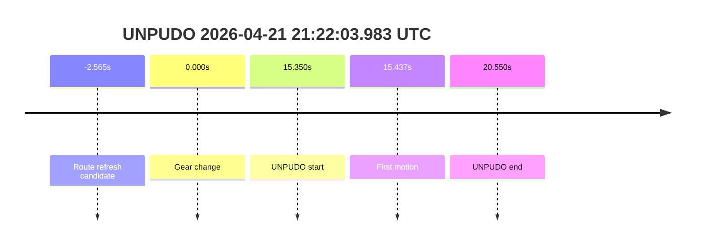
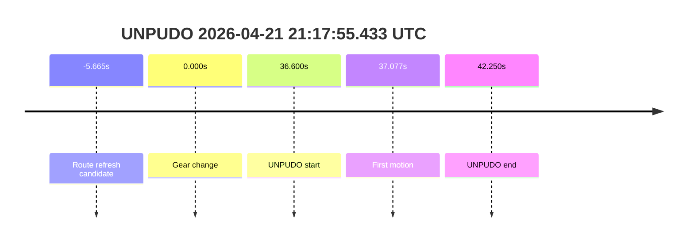
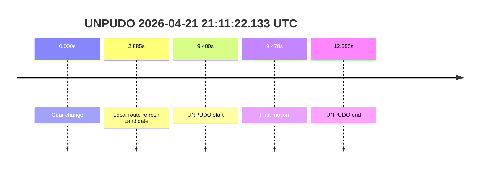

# Run Report: fme20009/2026-04-21--20-53-31--gen2-av-c485ff0d-599e-495f-bee7-17c4a854ab52

| Field | Value |
|---|---|
| Run ID | `fme20009/2026-04-21--20-53-31--gen2-av-c485ff0d-599e-495f-bee7-17c4a854ab52` |
| Date | `2026-04-21` |
| Model(s) | `blue-panther-solid` |
| Author | `guy.geva` |
| Event count | `5` |

## unpudo 2026-04-21 21:35:15.433 UTC

| Field | Value |
|---|---|
| Model | `blue-panther-solid` |
| Author | `guy.geva` |
| Run ID | `fme20009/2026-04-21--20-53-31--gen2-av-c485ff0d-599e-495f-bee7-17c4a854ab52` |
| Date | `2026-04-21` |
| Time (UTC) | `21:35:15.433` |
| Event type | `unpudo` |
| Disengagement type | `none observed` |
| Console | [run](https://console.sso.wayve.ai/run/fme20009/2026-04-21--20-53-31--gen2-av-c485ff0d-599e-495f-bee7-17c4a854ab52?id=&time-unixus=1776807315433317) |
| Foxglove | [segment](https://app.foxglove.dev/wayve-on-prem/p/prj_0dX18KZdVHg1fmmI/view?ds=foxglove-stream&ds.deviceName=fme20009&ds.end=2026-04-21T21%3A35%3A35.633Z&ds.start=2026-04-21T21%3A34%3A41.033Z&layoutId=lay_0e7VD4WIKDQGU73Y&time=2026-04-21T21%3A35%3A15.433Z) |

- Pass: successful UNPUDO with an ownership-boundary caveat. Planned and actual gear are both `DRIVE`, the vehicle begins moving `0.537s` after the anchor with no accelerator help, and the event closes without disengagement. The nearest trajectory sample at the anchor has `is_drive_by_wire = false`, so the exact AV/manual boundary should be treated as uncertain rather than cleanly AV-owned.

| Event | Time (UTC) | Delta from gear change |
|---|---:|---:|
| Route refresh candidate | 2026-04-21 21:31:31.618 | `-209.415s` |
| Gear change | 2026-04-21 21:35:01.033 | `0.000s` |
| UNPUDO start | 2026-04-21 21:35:15.433 | `14.400s` |
| First motion | 2026-04-21 21:35:15.570 | `14.537s` |
| UNPUDO end | 2026-04-21 21:35:20.633 | `19.600s` |

| Metric | Value |
|---|---|
| Route reassignment signal | `candidate at 21:31:31.618 UTC` |
| Trajectory DBW at anchor | `false` |
| Predicted gear at gear change | `DRIVE_POSITION_V2_DRIVE` |
| Actual gear at gear change | `DRIVE_POSITION_V2_DRIVE` |
| Predicted gear at event start | `DRIVE_POSITION_V2_DRIVE` |
| Actual gear at event start | `DRIVE_POSITION_V2_DRIVE` |
| Driver accel help in maneuver window | `false` |
| Max accel pedal | `0.0%` |
| Max brake pedal | `8.0%` |
| Max speed | `3.764 m/s` |
| Gear change -> UNPUDO start | `14.400s` |
| Gear change -> first motion | `14.537s` |
| Gear-window duration | `19.600s` |
| Trajectory waypoint count at anchor | `36` |
| Trajectory driving-plan step count at anchor | `11` |
| Main disengagement flag | `0` |
| Gear-to-start disengagement | `0` |
| Before-gearchange-10s disengagement | `0` |

This segment finishes cleanly and shows the model selecting and holding `DRIVE` through the maneuver window. The car starts moving almost immediately after the event anchor, reaches a moderate rollout speed, and never needs driver accelerator input. The only reason to keep this from being a fully clean AV-owned pass is that the nearest trajectory sample at the anchor reports `is_drive_by_wire = false`; that makes the exact ownership handover fuzzy, but it does not look like a failure.

## unpudo 2026-04-21 21:22:03.983 UTC

| Field | Value |
|---|---|
| Model | `blue-panther-solid` |
| Author | `guy.geva` |
| Run ID | `fme20009/2026-04-21--20-53-31--gen2-av-c485ff0d-599e-495f-bee7-17c4a854ab52` |
| Date | `2026-04-21` |
| Time (UTC) | `21:22:03.983` |
| Event type | `unpudo` |
| Disengagement type | `none observed` |
| Console | [run](https://console.sso.wayve.ai/run/fme20009/2026-04-21--20-53-31--gen2-av-c485ff0d-599e-495f-bee7-17c4a854ab52?id=&time-unixus=1776806523983321) |
| Foxglove | [segment](https://app.foxglove.dev/wayve-on-prem/p/prj_0dX18KZdVHg1fmmI/view?ds=foxglove-stream&ds.deviceName=fme20009&ds.end=2026-04-21T21%3A22%3A24.183Z&ds.start=2026-04-21T21%3A21%3A28.633Z&layoutId=lay_0e7VD4WIKDQGU73Y&time=2026-04-21T21%3A22%3A03.983Z) |

- Pass: clean AV-owned UNPUDO success. Route refresh, `DRIVE` selection, and motion all line up in a short window, the nearest trajectory sample at the anchor is DBW-active, and there is no disengagement or driver accelerator help.

| Event | Time (UTC) | Delta from gear change |
|---|---:|---:|
| Route refresh candidate | 2026-04-21 21:21:46.068 | `-2.565s` |
| Gear change | 2026-04-21 21:21:48.633 | `0.000s` |
| UNPUDO start | 2026-04-21 21:22:03.983 | `15.350s` |
| First motion | 2026-04-21 21:22:04.070 | `15.437s` |
| UNPUDO end | 2026-04-21 21:22:09.183 | `20.550s` |

| Metric | Value |
|---|---|
| Route reassignment signal | `candidate at 21:21:46.068 UTC` |
| Trajectory DBW at anchor | `true` |
| Predicted gear at gear change | `DRIVE_POSITION_V2_DRIVE` |
| Actual gear at gear change | `DRIVE_POSITION_V2_DRIVE` |
| Predicted gear at event start | `DRIVE_POSITION_V2_DRIVE` |
| Actual gear at event start | `DRIVE_POSITION_V2_DRIVE` |
| Driver accel help in maneuver window | `false` |
| Max accel pedal | `0.0%` |
| Max brake pedal | `8.0%` |
| Max speed | `2.408 m/s` |
| Gear change -> UNPUDO start | `15.350s` |
| Gear change -> first motion | `15.437s` |
| Gear-window duration | `20.550s` |
| Trajectory waypoint count at anchor | `36` |
| Trajectory driving-plan step count at anchor | `11` |
| Main disengagement flag | `0` |
| Gear-to-start disengagement | `0` |
| Before-gearchange-10s disengagement | `0` |

This is the cleanest of the five samples. The route refresh happens just before the gear change, the anchor sits inside a DBW-active trajectory sample, and the vehicle starts rolling `0.087s` after the event anchor. The speed profile is modest but continuous, and there is no evidence of driver intervention.

## unpudo 2026-04-21 21:17:55.433 UTC

| Field | Value |
|---|---|
| Model | `blue-panther-solid` |
| Author | `guy.geva` |
| Run ID | `fme20009/2026-04-21--20-53-31--gen2-av-c485ff0d-599e-495f-bee7-17c4a854ab52` |
| Date | `2026-04-21` |
| Time (UTC) | `21:17:55.433` |
| Event type | `unpudo` |
| Disengagement type | `none observed` |
| Console | [run](https://console.sso.wayve.ai/run/fme20009/2026-04-21--20-53-31--gen2-av-c485ff0d-599e-495f-bee7-17c4a854ab52?id=&time-unixus=1776806275433311) |
| Foxglove | [segment](https://app.foxglove.dev/wayve-on-prem/p/prj_0dX18KZdVHg1fmmI/view?ds=foxglove-stream&ds.deviceName=fme20009&ds.end=2026-04-21T21%3A18%3A16.083Z&ds.start=2026-04-21T21%3A16%3A58.833Z&layoutId=lay_0e7VD4WIKDQGU73Y&time=2026-04-21T21%3A17%3A55.433Z) |

- Pass: clean AV-owned UNPUDO success. The route refresh precedes the gear change, the anchor is DBW-active, the model holds `DRIVE` throughout, and the car launches without accelerator assistance or disengagement.

| Event | Time (UTC) | Delta from gear change |
|---|---:|---:|
| Route refresh candidate | 2026-04-21 21:17:13.168 | `-5.665s` |
| Gear change | 2026-04-21 21:17:18.833 | `0.000s` |
| UNPUDO start | 2026-04-21 21:17:55.433 | `36.600s` |
| First motion | 2026-04-21 21:17:55.910 | `37.077s` |
| UNPUDO end | 2026-04-21 21:18:01.083 | `42.250s` |

| Metric | Value |
|---|---|
| Route reassignment signal | `candidate at 21:17:13.168 UTC` |
| Trajectory DBW at anchor | `true` |
| Predicted gear at gear change | `DRIVE_POSITION_V2_DRIVE` |
| Actual gear at gear change | `DRIVE_POSITION_V2_DRIVE` |
| Predicted gear at event start | `DRIVE_POSITION_V2_DRIVE` |
| Actual gear at event start | `DRIVE_POSITION_V2_DRIVE` |
| Driver accel help in maneuver window | `false` |
| Max accel pedal | `0.0%` |
| Max brake pedal | `8.0%` |
| Max speed | `4.094 m/s` |
| Gear change -> UNPUDO start | `36.600s` |
| Gear change -> first motion | `37.077s` |
| Gear-window duration | `42.250s` |
| Trajectory waypoint count at anchor | `36` |
| Trajectory driving-plan step count at anchor | `11` |
| Main disengagement flag | `0` |
| Gear-to-start disengagement | `0` |
| Before-gearchange-10s disengagement | `0` |

This segment has a longer dwell between the gear change and the actual UNPUDO anchor, but the eventual maneuver is still straightforward. Once the event starts, the vehicle begins moving within `0.477s`, reaches a normal rollout speed, and does not show any driver accelerator help. The combination of DBW-active trajectory at the anchor and zero disengagement flags makes this a real pass rather than a handover artifact.

## unpudo 2026-04-21 21:11:22.133 UTC

| Field | Value |
|---|---|
| Model | `blue-panther-solid` |
| Author | `guy.geva` |
| Run ID | `fme20009/2026-04-21--20-53-31--gen2-av-c485ff0d-599e-495f-bee7-17c4a854ab52` |
| Date | `2026-04-21` |
| Time (UTC) | `21:11:22.133` |
| Event type | `unpudo` |
| Disengagement type | `none observed` |
| Console | [run](https://console.sso.wayve.ai/run/fme20009/2026-04-21--20-53-31--gen2-av-c485ff0d-599e-495f-bee7-17c4a854ab52?id=&time-unixus=1776805882133301) |
| Foxglove | [segment](https://app.foxglove.dev/wayve-on-prem/p/prj_0dX18KZdVHg1fmmI/view?ds=foxglove-stream&ds.deviceName=fme20009&ds.end=2026-04-21T21%3A11%3A40.283Z&ds.start=2026-04-21T21%3A10%3A52.733Z&layoutId=lay_0e7VD4WIKDQGU73Y&time=2026-04-21T21%3A11%3A22.133Z) |

- Pass: successful UNPUDO with a route-timing caveat. The event is DBW-active at the anchor, planned and actual gear both read `DRIVE`, and the car launches `0.078s` after the anchor with no accelerator help. The only unclear part is navigation timing: the clean route-refresh candidate in the local window appears after the gear change, so the pre-AV reassignment point is not well isolated.

| Event | Time (UTC) | Delta from gear change |
|---|---:|---:|
| Local route refresh candidate | 2026-04-21 21:11:15.618 | `2.885s` |
| Gear change | 2026-04-21 21:11:12.733 | `0.000s` |
| UNPUDO start | 2026-04-21 21:11:22.133 | `9.400s` |
| First motion | 2026-04-21 21:11:22.211 | `9.478s` |
| UNPUDO end | 2026-04-21 21:11:25.283 | `12.550s` |

| Metric | Value |
|---|---|
| Route reassignment signal | `not isolated before gear change; local candidate at 21:11:15.618 UTC` |
| Trajectory DBW at anchor | `true` |
| Predicted gear at gear change | `DRIVE_POSITION_V2_DRIVE` |
| Actual gear at gear change | `DRIVE_POSITION_V2_DRIVE` |
| Predicted gear at event start | `DRIVE_POSITION_V2_DRIVE` |
| Actual gear at event start | `DRIVE_POSITION_V2_DRIVE` |
| Driver accel help in maneuver window | `false` |
| Max accel pedal | `0.0%` |
| Max brake pedal | `10.825%` |
| Max speed | `5.583 m/s` |
| Gear change -> UNPUDO start | `9.400s` |
| Gear change -> first motion | `9.478s` |
| Gear-window duration | `12.550s` |
| Trajectory waypoint count at anchor | `36` |
| Trajectory driving-plan step count at anchor | `11` |
| Main disengagement flag | `0` |
| Gear-to-start disengagement | `0` |
| Before-gearchange-10s disengagement | `0` |

The maneuver itself is strong: DBW is active at the anchor, the car leaves almost immediately, and there is no disengagement or driver throttle assistance. The ambiguous part is not the maneuver outcome but the lead-in, because the clean navigation update visible in the sampled window lands after the gear change instead of clearly before it. That makes the setup story fuzzy, but the UNPUDO execution is still a pass.

## unpudo 2026-04-21 21:07:56.133 UTC

| Field | Value |
|---|---|
| Model | `blue-panther-solid` |
| Author | `guy.geva` |
| Run ID | `fme20009/2026-04-21--20-53-31--gen2-av-c485ff0d-599e-495f-bee7-17c4a854ab52` |
| Date | `2026-04-21` |
| Time (UTC) | `21:07:56.133` |
| Event type | `unpudo` |
| Disengagement type | `none observed` |
| Console | [run](https://console.sso.wayve.ai/run/fme20009/2026-04-21--20-53-31--gen2-av-c485ff0d-599e-495f-bee7-17c4a854ab52?id=&time-unixus=1776805676133296) |
| Foxglove | [segment](https://app.foxglove.dev/wayve-on-prem/p/prj_0dX18KZdVHg1fmmI/view?ds=foxglove-stream&ds.deviceName=fme20009&ds.end=2026-04-21T21%3A08%3A15.083Z&ds.start=2026-04-21T21%3A07%3A27.683Z&layoutId=lay_0e7VD4WIKDQGU73Y&time=2026-04-21T21%3A07%3A56.133Z) |

- Pass: successful UNPUDO with an ownership-boundary caveat. A plausible route refresh precedes the gear change, the model plans and achieves `DRIVE`, and the vehicle begins moving `0.117s` after the anchor with no accelerator help or disengagement. As with the 21:35 sample, the nearest trajectory sample at the anchor reports `is_drive_by_wire = false`, so the exact handover edge is not cleanly recoverable from the sampled traces.

| Event | Time (UTC) | Delta from gear change |
|---|---:|---:|
| Route refresh candidate | 2026-04-21 21:07:42.968 | `-4.715s` |
| Gear change | 2026-04-21 21:07:47.683 | `0.000s` |
| UNPUDO start | 2026-04-21 21:07:56.133 | `8.450s` |
| First motion | 2026-04-21 21:07:56.250 | `8.567s` |
| UNPUDO end | 2026-04-21 21:08:00.083 | `12.400s` |

| Metric | Value |
|---|---|
| Route reassignment signal | `candidate at 21:07:42.968 UTC` |
| Trajectory DBW at anchor | `false` |
| Predicted gear at gear change | `DRIVE_POSITION_V2_DRIVE` |
| Actual gear at gear change | `DRIVE_POSITION_V2_DRIVE` |
| Predicted gear at event start | `DRIVE_POSITION_V2_DRIVE` |
| Actual gear at event start | `DRIVE_POSITION_V2_DRIVE` |
| Driver accel help in maneuver window | `false` |
| Max accel pedal | `0.0%` |
| Max brake pedal | `0.0%` |
| Max speed | `4.883 m/s` |
| Gear change -> UNPUDO start | `8.450s` |
| Gear change -> first motion | `8.567s` |
| Gear-window duration | `12.400s` |
| Trajectory waypoint count at anchor | `36` |
| Trajectory driving-plan step count at anchor | `11` |
| Main disengagement flag | `0` |
| Gear-to-start disengagement | `0` |
| Before-gearchange-10s disengagement | `0` |

This segment completes successfully and the vehicle rolls away promptly once the event begins. The data are consistent on gear selection and lack of driver throttle assistance, and there is no disengagement anywhere in the maneuver window. The only caution is the same one seen at 21:35: the nearest trajectory sample at the exact anchor is not DBW-active, so the outcome is clearly successful but the ownership boundary is slightly blurred.
