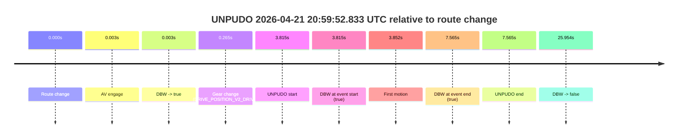
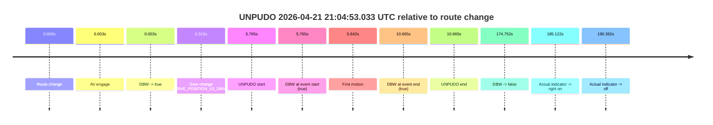
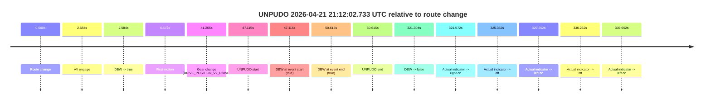
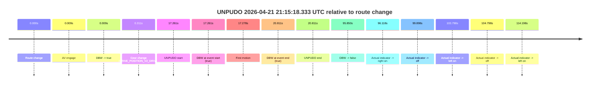
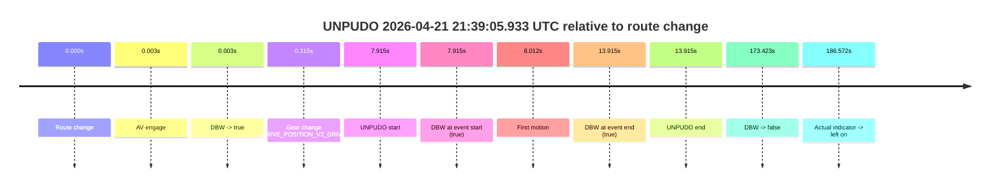
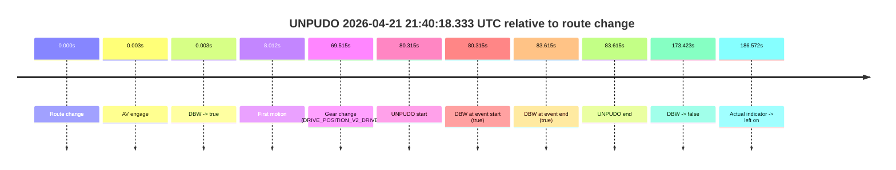
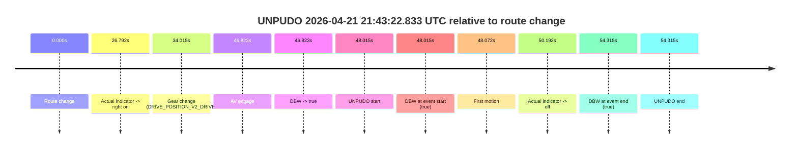

# Run Report: fme20009/2026-04-21--20-53-31--gen2-av-c485ff0d-599e-495f-bee7-17c4a854ab52

| Field | Value |
|---|---|
| Run ID | `fme20009/2026-04-21--20-53-31--gen2-av-c485ff0d-599e-495f-bee7-17c4a854ab52` |
| Date | `2026-04-21` |
| Model(s) | `eel-teal-outspoken` |
| Author | `zak` |
| Event count | `9` |

## unpudo 2026-04-21 20:59:52.833 UTC

| Field | Value |
|---|---|
| Model | `eel-teal-outspoken` |
| Author | `zak` |
| Run ID | `fme20009/2026-04-21--20-53-31--gen2-av-c485ff0d-599e-495f-bee7-17c4a854ab52` |
| Date | `2026-04-21` |
| Time (UTC) | `20:59:52.833` |
| Event type | `unpudo` |
| Disengagement type | `none observed` |
| Route change | `found` |
| Console | [run](https://console.sso.wayve.ai/run/fme20009/2026-04-21--20-53-31--gen2-av-c485ff0d-599e-495f-bee7-17c4a854ab52?id=&time-unixus=1776805192833323) |
| Foxglove | [segment](https://app.foxglove.dev/wayve-on-prem/p/prj_0dX18KZdVHg1fmmI/view?ds=foxglove-stream&ds.deviceName=fme20009&ds.start=2026-04-21T20%3A59%3A39.018262Z&ds.end=2026-04-21T21%3A00%3A24.972100Z&layoutId=lay_0e7VD4WIKDQGU73Y&time=2026-04-21T20%3A59%3A52.833323Z) |

### Event card: pass

- Pass: AV owns the credited unpudo from route change through the official unpudo window, the gear state is aligned at the anchor, and the vehicle moves without driver accelerator help in AV.

| Event | Time (UTC) | Delta from route change |
|---|---:|---:|
| Route change | 2026-04-21 20:59:49.018 | `0.000s` |
| AV engage | 2026-04-21 20:59:49.021 | `0.003s` |
| DBW -> true | 2026-04-21 20:59:49.021 | `0.003s` |
| Gear change (DRIVE_POSITION_V2_DRIVE) | 2026-04-21 20:59:49.283 | `0.265s` |
| UNPUDO start | 2026-04-21 20:59:52.833 | `3.815s` |
| DBW at event start (true) | 2026-04-21 20:59:52.833 | `3.815s` |
| First motion | 2026-04-21 20:59:52.870 | `3.852s` |
| DBW at event end (true) | 2026-04-21 20:59:56.583 | `7.565s` |
| UNPUDO end | 2026-04-21 20:59:56.583 | `7.565s` |
| DBW -> false | 2026-04-21 21:00:14.972 | `25.954s` |

| Metric | Value |
|---|---|
| Outcome | `pass` |
| Effective failure type | `none` |
| Route change status | `found` |
| DBW at event start | `true` |
| DBW at event end | `true` |
| Predicted gear at AV start | `DRIVE_POSITION_V2_PARK` |
| Actual gear at AV start | `DRIVE_POSITION_V2_PARK` |
| Predicted gear at event start | `DRIVE_POSITION_V2_DRIVE` |
| Actual gear at event start | `DRIVE_POSITION_V2_DRIVE` |
| Planned indicator direction | `INDICATORS_STATE_V2_RIGHT_ON` |
| Controller indicator direction | `INDICATORS_STATE_V2_RIGHT_ON` |
| Actual indicator direction | `INDICATORS_STATE_V2_OFF` |
| Actual indicator at maneuver end | `INDICATORS_STATE_V2_OFF` |
| Driver accel help in AV | `false` |
| Driver accel help timestamp | `n/a` |
| Max accel pedal pct in AV | `0.0%` |
| Max brake pedal pct in AV | `8.0%` |
| Max speed mps in AV | `4.553` |
| Success timing baseline | `route change` |
| Route -> AV | `0.003s` |
| AV -> event start | `3.812s` |
| AV -> first motion | `3.849s` |
| Success baseline -> event start | `3.815s` |
| Success baseline -> first motion | `3.852s` |
| AV duration before disengagement | `25.951s` |
| Trajectory waypoint count | `38` |
| Driving-plan step count | `11` |

The scored portion starts from the AV-owned window, not from the pre-AV setup. Route-change search in the stopped pre-event segment was `found`, with the baseline therefore set to route change. At the event anchor the model predicts `DRIVE_POSITION_V2_DRIVE` and the actual gear is `DRIVE_POSITION_V2_DRIVE`. The effective model outcome is `pass` because `the credited unpudo stays AV-owned through the official unpudo window.`

### Resolution

| Field | Value |
|---|---|
| Final outcome | `pass` |
| Do we agree with this label? | `yes` |
| Source disengagement type | `none observed` |
| Resolved effective failure type | `none` |
| Confidence | `high` |

## unpudo 2026-04-21 21:04:53.033 UTC

| Field | Value |
|---|---|
| Model | `eel-teal-outspoken` |
| Author | `zak` |
| Run ID | `fme20009/2026-04-21--20-53-31--gen2-av-c485ff0d-599e-495f-bee7-17c4a854ab52` |
| Date | `2026-04-21` |
| Time (UTC) | `21:04:53.033` |
| Event type | `unpudo` |
| Disengagement type | `none observed` |
| Route change | `found` |
| Console | [run](https://console.sso.wayve.ai/run/fme20009/2026-04-21--20-53-31--gen2-av-c485ff0d-599e-495f-bee7-17c4a854ab52?id=&time-unixus=1776805493033315) |
| Foxglove | [segment](https://app.foxglove.dev/wayve-on-prem/p/prj_0dX18KZdVHg1fmmI/view?ds=foxglove-stream&ds.deviceName=fme20009&ds.start=2026-04-21T21%3A04%3A37.268324Z&ds.end=2026-04-21T21%3A07%3A52.020339Z&layoutId=lay_0e7VD4WIKDQGU73Y&time=2026-04-21T21%3A04%3A53.033315Z) |

### Event card: pass

- Pass: AV owns the credited unpudo from route change through the official unpudo window, the gear state is aligned at the anchor, and the vehicle moves without driver accelerator help in AV.

| Event | Time (UTC) | Delta from route change |
|---|---:|---:|
| Route change | 2026-04-21 21:04:47.268 | `0.000s` |
| AV engage | 2026-04-21 21:04:47.271 | `0.003s` |
| DBW -> true | 2026-04-21 21:04:47.271 | `0.003s` |
| Gear change (DRIVE_POSITION_V2_DRIVE) | 2026-04-21 21:04:47.583 | `0.315s` |
| UNPUDO start | 2026-04-21 21:04:53.033 | `5.765s` |
| DBW at event start (true) | 2026-04-21 21:04:53.033 | `5.765s` |
| First motion | 2026-04-21 21:04:53.110 | `5.842s` |
| DBW at event end (true) | 2026-04-21 21:04:57.933 | `10.665s` |
| UNPUDO end | 2026-04-21 21:04:57.933 | `10.665s` |
| DBW -> false | 2026-04-21 21:07:42.020 | `174.752s` |
| Actual indicator -> right on | 2026-04-21 21:07:52.390 | `185.122s` |
| Actual indicator -> off | 2026-04-21 21:07:57.630 | `190.362s` |

| Metric | Value |
|---|---|
| Outcome | `pass` |
| Effective failure type | `none` |
| Route change status | `found` |
| DBW at event start | `true` |
| DBW at event end | `true` |
| Predicted gear at AV start | `DRIVE_POSITION_V2_PARK` |
| Actual gear at AV start | `DRIVE_POSITION_V2_PARK` |
| Predicted gear at event start | `DRIVE_POSITION_V2_DRIVE` |
| Actual gear at event start | `DRIVE_POSITION_V2_DRIVE` |
| Planned indicator direction | `INDICATORS_STATE_V2_RIGHT_ON` |
| Controller indicator direction | `INDICATORS_STATE_V2_RIGHT_ON` |
| Actual indicator direction | `INDICATORS_STATE_V2_OFF` |
| Actual indicator at maneuver end | `INDICATORS_STATE_V2_OFF` |
| Driver accel help in AV | `false` |
| Driver accel help timestamp | `n/a` |
| Max accel pedal pct in AV | `0.0%` |
| Max brake pedal pct in AV | `8.7%` |
| Max speed mps in AV | `4.497` |
| Success timing baseline | `route change` |
| Route -> AV | `0.003s` |
| AV -> event start | `5.762s` |
| AV -> first motion | `5.839s` |
| Success baseline -> event start | `5.765s` |
| Success baseline -> first motion | `5.842s` |
| AV duration before disengagement | `174.749s` |
| Trajectory waypoint count | `38` |
| Driving-plan step count | `11` |

The scored portion starts from the AV-owned window, not from the pre-AV setup. Route-change search in the stopped pre-event segment was `found`, with the baseline therefore set to route change. At the event anchor the model predicts `DRIVE_POSITION_V2_DRIVE` and the actual gear is `DRIVE_POSITION_V2_DRIVE`. The effective model outcome is `pass` because `the credited unpudo stays AV-owned through the official unpudo window.`

### Resolution

| Field | Value |
|---|---|
| Final outcome | `pass` |
| Do we agree with this label? | `yes` |
| Source disengagement type | `none observed` |
| Resolved effective failure type | `none` |
| Confidence | `high` |

## unpudo 2026-04-21 21:12:02.733 UTC

| Field | Value |
|---|---|
| Model | `eel-teal-outspoken` |
| Author | `zak` |
| Run ID | `fme20009/2026-04-21--20-53-31--gen2-av-c485ff0d-599e-495f-bee7-17c4a854ab52` |
| Date | `2026-04-21` |
| Time (UTC) | `21:12:02.733` |
| Event type | `unpudo` |
| Disengagement type | `none observed` |
| Route change | `found` |
| Console | [run](https://console.sso.wayve.ai/run/fme20009/2026-04-21--20-53-31--gen2-av-c485ff0d-599e-495f-bee7-17c4a854ab52?id=&time-unixus=1776805922733301) |
| Foxglove | [segment](https://app.foxglove.dev/wayve-on-prem/p/prj_0dX18KZdVHg1fmmI/view?ds=foxglove-stream&ds.deviceName=fme20009&ds.start=2026-04-21T21%3A11%3A05.618263Z&ds.end=2026-04-21T21%3A16%3A46.922141Z&layoutId=lay_0e7VD4WIKDQGU73Y&time=2026-04-21T21%3A12%3A02.733301Z) |

### Event card: pass

- Pass: AV owns the credited unpudo from route change through the official unpudo window, the gear state is aligned at the anchor, and the vehicle moves without driver accelerator help in AV.

| Event | Time (UTC) | Delta from route change |
|---|---:|---:|
| Route change | 2026-04-21 21:11:15.618 | `0.000s` |
| AV engage | 2026-04-21 21:11:18.201 | `2.584s` |
| DBW -> true | 2026-04-21 21:11:18.201 | `2.584s` |
| First motion | 2026-04-21 21:11:22.190 | `6.572s` |
| Gear change (DRIVE_POSITION_V2_DRIVE) | 2026-04-21 21:11:56.883 | `41.265s` |
| UNPUDO start | 2026-04-21 21:12:02.733 | `47.115s` |
| DBW at event start (true) | 2026-04-21 21:12:02.733 | `47.115s` |
| DBW at event end (true) | 2026-04-21 21:12:06.233 | `50.615s` |
| UNPUDO end | 2026-04-21 21:12:06.233 | `50.615s` |
| DBW -> false | 2026-04-21 21:16:36.922 | `321.304s` |
| Actual indicator -> right on | 2026-04-21 21:16:37.190 | `321.572s` |
| Actual indicator -> off | 2026-04-21 21:16:40.970 | `325.352s` |
| Actual indicator -> left on | 2026-04-21 21:16:44.870 | `329.252s` |
| Actual indicator -> off | 2026-04-21 21:16:45.870 | `330.252s` |
| Actual indicator -> left on | 2026-04-21 21:16:55.270 | `339.652s` |

| Metric | Value |
|---|---|
| Outcome | `pass` |
| Effective failure type | `none` |
| Route change status | `found` |
| DBW at event start | `true` |
| DBW at event end | `true` |
| Predicted gear at AV start | `DRIVE_POSITION_V2_DRIVE` |
| Actual gear at AV start | `DRIVE_POSITION_V2_DRIVE` |
| Predicted gear at event start | `DRIVE_POSITION_V2_DRIVE` |
| Actual gear at event start | `DRIVE_POSITION_V2_DRIVE` |
| Planned indicator direction | `INDICATORS_STATE_V2_RIGHT_ON` |
| Controller indicator direction | `INDICATORS_STATE_V2_RIGHT_ON` |
| Actual indicator direction | `INDICATORS_STATE_V2_OFF` |
| Actual indicator at maneuver end | `INDICATORS_STATE_V2_OFF` |
| Driver accel help in AV | `false` |
| Driver accel help timestamp | `n/a` |
| Max accel pedal pct in AV | `0.0%` |
| Max brake pedal pct in AV | `17.9%` |
| Max speed mps in AV | `7.756` |
| Success timing baseline | `route change` |
| Route -> AV | `2.584s` |
| AV -> event start | `44.531s` |
| AV -> first motion | `3.989s` |
| Success baseline -> event start | `47.115s` |
| Success baseline -> first motion | `6.572s` |
| AV duration before disengagement | `318.720s` |
| Trajectory waypoint count | `38` |
| Driving-plan step count | `11` |

The scored portion starts from the AV-owned window, not from the pre-AV setup. Route-change search in the stopped pre-event segment was `found`, with the baseline therefore set to route change. At the event anchor the model predicts `DRIVE_POSITION_V2_DRIVE` and the actual gear is `DRIVE_POSITION_V2_DRIVE`. The effective model outcome is `pass` because `the credited unpudo stays AV-owned through the official unpudo window.`

### Resolution

| Field | Value |
|---|---|
| Final outcome | `pass` |
| Do we agree with this label? | `yes` |
| Source disengagement type | `none observed` |
| Resolved effective failure type | `none` |
| Confidence | `high` |

## unpudo 2026-04-21 21:15:18.333 UTC

| Field | Value |
|---|---|
| Model | `eel-teal-outspoken` |
| Author | `zak` |
| Run ID | `fme20009/2026-04-21--20-53-31--gen2-av-c485ff0d-599e-495f-bee7-17c4a854ab52` |
| Date | `2026-04-21` |
| Time (UTC) | `21:15:18.333` |
| Event type | `unpudo` |
| Disengagement type | `none observed` |
| Route change | `found` |
| Console | [run](https://console.sso.wayve.ai/run/fme20009/2026-04-21--20-53-31--gen2-av-c485ff0d-599e-495f-bee7-17c4a854ab52?id=&time-unixus=1776806118333292) |
| Foxglove | [segment](https://app.foxglove.dev/wayve-on-prem/p/prj_0dX18KZdVHg1fmmI/view?ds=foxglove-stream&ds.deviceName=fme20009&ds.start=2026-04-21T21%3A14%3A51.072396Z&ds.end=2026-04-21T21%3A16%3A46.922141Z&layoutId=lay_0e7VD4WIKDQGU73Y&time=2026-04-21T21%3A15%3A18.333292Z) |

### Event card: pass

- Pass: AV owns the credited unpudo from route change through the official unpudo window, the gear state is aligned at the anchor, and the vehicle moves without driver accelerator help in AV.

| Event | Time (UTC) | Delta from route change |
|---|---:|---:|
| Route change | 2026-04-21 21:15:01.072 | `0.000s` |
| AV engage | 2026-04-21 21:15:01.081 | `0.009s` |
| DBW -> true | 2026-04-21 21:15:01.081 | `0.009s` |
| Gear change (DRIVE_POSITION_V2_DRIVE) | 2026-04-21 21:15:01.383 | `0.311s` |
| UNPUDO start | 2026-04-21 21:15:18.333 | `17.261s` |
| DBW at event start (true) | 2026-04-21 21:15:18.333 | `17.261s` |
| First motion | 2026-04-21 21:15:18.350 | `17.278s` |
| DBW at event end (true) | 2026-04-21 21:15:21.883 | `20.811s` |
| UNPUDO end | 2026-04-21 21:15:21.883 | `20.811s` |
| DBW -> false | 2026-04-21 21:16:36.922 | `95.850s` |
| Actual indicator -> right on | 2026-04-21 21:16:37.190 | `96.118s` |
| Actual indicator -> off | 2026-04-21 21:16:40.970 | `99.898s` |
| Actual indicator -> left on | 2026-04-21 21:16:44.870 | `103.798s` |
| Actual indicator -> off | 2026-04-21 21:16:45.870 | `104.798s` |
| Actual indicator -> left on | 2026-04-21 21:16:55.270 | `114.198s` |

| Metric | Value |
|---|---|
| Outcome | `pass` |
| Effective failure type | `none` |
| Route change status | `found` |
| DBW at event start | `true` |
| DBW at event end | `true` |
| Predicted gear at AV start | `DRIVE_POSITION_V2_PARK` |
| Actual gear at AV start | `DRIVE_POSITION_V2_PARK` |
| Predicted gear at event start | `DRIVE_POSITION_V2_DRIVE` |
| Actual gear at event start | `DRIVE_POSITION_V2_DRIVE` |
| Planned indicator direction | `INDICATORS_STATE_V2_RIGHT_ON` |
| Controller indicator direction | `INDICATORS_STATE_V2_RIGHT_ON` |
| Actual indicator direction | `INDICATORS_STATE_V2_OFF` |
| Actual indicator at maneuver end | `INDICATORS_STATE_V2_OFF` |
| Driver accel help in AV | `false` |
| Driver accel help timestamp | `n/a` |
| Max accel pedal pct in AV | `0.0%` |
| Max brake pedal pct in AV | `8.0%` |
| Max speed mps in AV | `4.317` |
| Success timing baseline | `route change` |
| Route -> AV | `0.009s` |
| AV -> event start | `17.252s` |
| AV -> first motion | `17.269s` |
| Success baseline -> event start | `17.261s` |
| Success baseline -> first motion | `17.278s` |
| AV duration before disengagement | `95.841s` |
| Trajectory waypoint count | `38` |
| Driving-plan step count | `11` |

The scored portion starts from the AV-owned window, not from the pre-AV setup. Route-change search in the stopped pre-event segment was `found`, with the baseline therefore set to route change. At the event anchor the model predicts `DRIVE_POSITION_V2_DRIVE` and the actual gear is `DRIVE_POSITION_V2_DRIVE`. The effective model outcome is `pass` because `the credited unpudo stays AV-owned through the official unpudo window.`

### Resolution

| Field | Value |
|---|---|
| Final outcome | `pass` |
| Do we agree with this label? | `yes` |
| Source disengagement type | `none observed` |
| Resolved effective failure type | `none` |
| Confidence | `high` |

## unpudo 2026-04-21 21:24:56.633 UTC

| Field | Value |
|---|---|
| Model | `eel-teal-outspoken` |
| Author | `zak` |
| Run ID | `fme20009/2026-04-21--20-53-31--gen2-av-c485ff0d-599e-495f-bee7-17c4a854ab52` |
| Date | `2026-04-21` |
| Time (UTC) | `21:24:56.633` |
| Event type | `unpudo` |
| Disengagement type | `none observed` |
| Route change | `found` |
| Console | [run](https://console.sso.wayve.ai/run/fme20009/2026-04-21--20-53-31--gen2-av-c485ff0d-599e-495f-bee7-17c4a854ab52?id=&time-unixus=1776806696633311) |
| Foxglove | [segment](https://app.foxglove.dev/wayve-on-prem/p/prj_0dX18KZdVHg1fmmI/view?ds=foxglove-stream&ds.deviceName=fme20009&ds.start=2026-04-21T21%3A24%3A42.818380Z&ds.end=2026-04-21T21%3A25%3A17.422136Z&layoutId=lay_0e7VD4WIKDQGU73Y&time=2026-04-21T21%3A24%3A56.633311Z) |

### Event card: pass

- Pass: AV owns the credited unpudo from route change through the official unpudo window, the gear state is aligned at the anchor, and the vehicle moves without driver accelerator help in AV.

| Event | Time (UTC) | Delta from route change |
|---|---:|---:|
| Route change | 2026-04-21 21:24:52.818 | `0.000s` |
| AV engage | 2026-04-21 21:24:52.821 | `0.003s` |
| DBW -> true | 2026-04-21 21:24:52.821 | `0.003s` |
| Gear change (DRIVE_POSITION_V2_DRIVE) | 2026-04-21 21:24:53.083 | `0.265s` |
| UNPUDO start | 2026-04-21 21:24:56.633 | `3.815s` |
| DBW at event start (true) | 2026-04-21 21:24:56.633 | `3.815s` |
| First motion | 2026-04-21 21:24:56.690 | `3.872s` |
| DBW at event end (true) | 2026-04-21 21:25:00.033 | `7.215s` |
| UNPUDO end | 2026-04-21 21:25:00.033 | `7.215s` |
| DBW -> false | 2026-04-21 21:25:07.422 | `14.604s` |

| Metric | Value |
|---|---|
| Outcome | `pass` |
| Effective failure type | `none` |
| Route change status | `found` |
| DBW at event start | `true` |
| DBW at event end | `true` |
| Predicted gear at AV start | `DRIVE_POSITION_V2_PARK` |
| Actual gear at AV start | `DRIVE_POSITION_V2_PARK` |
| Predicted gear at event start | `DRIVE_POSITION_V2_DRIVE` |
| Actual gear at event start | `DRIVE_POSITION_V2_DRIVE` |
| Planned indicator direction | `INDICATORS_STATE_V2_RIGHT_ON` |
| Controller indicator direction | `INDICATORS_STATE_V2_RIGHT_ON` |
| Actual indicator direction | `INDICATORS_STATE_V2_OFF` |
| Actual indicator at maneuver end | `INDICATORS_STATE_V2_OFF` |
| Driver accel help in AV | `false` |
| Driver accel help timestamp | `n/a` |
| Max accel pedal pct in AV | `0.0%` |
| Max brake pedal pct in AV | `8.0%` |
| Max speed mps in AV | `5.028` |
| Success timing baseline | `route change` |
| Route -> AV | `0.003s` |
| AV -> event start | `3.812s` |
| AV -> first motion | `3.869s` |
| Success baseline -> event start | `3.815s` |
| Success baseline -> first motion | `3.872s` |
| AV duration before disengagement | `14.601s` |
| Trajectory waypoint count | `36` |
| Driving-plan step count | `11` |

The scored portion starts from the AV-owned window, not from the pre-AV setup. Route-change search in the stopped pre-event segment was `found`, with the baseline therefore set to route change. At the event anchor the model predicts `DRIVE_POSITION_V2_DRIVE` and the actual gear is `DRIVE_POSITION_V2_DRIVE`. The effective model outcome is `pass` because `the credited unpudo stays AV-owned through the official unpudo window.`

### Resolution

| Field | Value |
|---|---|
| Final outcome | `pass` |
| Do we agree with this label? | `yes` |
| Source disengagement type | `none observed` |
| Resolved effective failure type | `none` |
| Confidence | `high` |

## unpudo 2026-04-21 21:31:40.533 UTC

| Field | Value |
|---|---|
| Model | `eel-teal-outspoken` |
| Author | `zak` |
| Run ID | `fme20009/2026-04-21--20-53-31--gen2-av-c485ff0d-599e-495f-bee7-17c4a854ab52` |
| Date | `2026-04-21` |
| Time (UTC) | `21:31:40.533` |
| Event type | `unpudo` |
| Disengagement type | `none observed` |
| Route change | `found` |
| Console | [run](https://console.sso.wayve.ai/run/fme20009/2026-04-21--20-53-31--gen2-av-c485ff0d-599e-495f-bee7-17c4a854ab52?id=&time-unixus=1776807100533300) |
| Foxglove | [segment](https://app.foxglove.dev/wayve-on-prem/p/prj_0dX18KZdVHg1fmmI/view?ds=foxglove-stream&ds.deviceName=fme20009&ds.start=2026-04-21T21%3A31%3A21.618262Z&ds.end=2026-04-21T21%3A33%3A29.120370Z&layoutId=lay_0e7VD4WIKDQGU73Y&time=2026-04-21T21%3A31%3A40.533300Z) |

### Event card: pass

- Pass: AV owns the credited unpudo from route change through the official unpudo window, the gear state is aligned at the anchor, and the vehicle moves without driver accelerator help in AV.

| Event | Time (UTC) | Delta from route change |
|---|---:|---:|
| Route change | 2026-04-21 21:31:31.618 | `0.000s` |
| AV engage | 2026-04-21 21:31:31.621 | `0.003s` |
| DBW -> true | 2026-04-21 21:31:31.621 | `0.003s` |
| Gear change (DRIVE_POSITION_V2_DRIVE) | 2026-04-21 21:31:31.883 | `0.265s` |
| UNPUDO start | 2026-04-21 21:31:40.533 | `8.915s` |
| DBW at event start (true) | 2026-04-21 21:31:40.533 | `8.915s` |
| First motion | 2026-04-21 21:31:40.591 | `8.973s` |
| DBW at event end (true) | 2026-04-21 21:31:45.733 | `14.115s` |
| UNPUDO end | 2026-04-21 21:31:45.733 | `14.115s` |
| DBW -> false | 2026-04-21 21:33:19.120 | `107.502s` |

| Metric | Value |
|---|---|
| Outcome | `pass` |
| Effective failure type | `none` |
| Route change status | `found` |
| DBW at event start | `true` |
| DBW at event end | `true` |
| Predicted gear at AV start | `DRIVE_POSITION_V2_PARK` |
| Actual gear at AV start | `DRIVE_POSITION_V2_PARK` |
| Predicted gear at event start | `DRIVE_POSITION_V2_DRIVE` |
| Actual gear at event start | `DRIVE_POSITION_V2_DRIVE` |
| Planned indicator direction | `INDICATORS_STATE_V2_RIGHT_ON` |
| Controller indicator direction | `INDICATORS_STATE_V2_RIGHT_ON` |
| Actual indicator direction | `INDICATORS_STATE_V2_OFF` |
| Actual indicator at maneuver end | `INDICATORS_STATE_V2_OFF` |
| Driver accel help in AV | `false` |
| Driver accel help timestamp | `n/a` |
| Max accel pedal pct in AV | `0.0%` |
| Max brake pedal pct in AV | `8.0%` |
| Max speed mps in AV | `4.400` |
| Success timing baseline | `route change` |
| Route -> AV | `0.003s` |
| AV -> event start | `8.912s` |
| AV -> first motion | `8.970s` |
| Success baseline -> event start | `8.915s` |
| Success baseline -> first motion | `8.973s` |
| AV duration before disengagement | `107.499s` |
| Trajectory waypoint count | `38` |
| Driving-plan step count | `11` |

The scored portion starts from the AV-owned window, not from the pre-AV setup. Route-change search in the stopped pre-event segment was `found`, with the baseline therefore set to route change. At the event anchor the model predicts `DRIVE_POSITION_V2_DRIVE` and the actual gear is `DRIVE_POSITION_V2_DRIVE`. The effective model outcome is `pass` because `the credited unpudo stays AV-owned through the official unpudo window.`

### Resolution

| Field | Value |
|---|---|
| Final outcome | `pass` |
| Do we agree with this label? | `yes` |
| Source disengagement type | `none observed` |
| Resolved effective failure type | `none` |
| Confidence | `high` |

## unpudo 2026-04-21 21:39:05.933 UTC

| Field | Value |
|---|---|
| Model | `eel-teal-outspoken` |
| Author | `zak` |
| Run ID | `fme20009/2026-04-21--20-53-31--gen2-av-c485ff0d-599e-495f-bee7-17c4a854ab52` |
| Date | `2026-04-21` |
| Time (UTC) | `21:39:05.933` |
| Event type | `unpudo` |
| Disengagement type | `none observed` |
| Route change | `found` |
| Console | [run](https://console.sso.wayve.ai/run/fme20009/2026-04-21--20-53-31--gen2-av-c485ff0d-599e-495f-bee7-17c4a854ab52?id=&time-unixus=1776807545933314) |
| Foxglove | [segment](https://app.foxglove.dev/wayve-on-prem/p/prj_0dX18KZdVHg1fmmI/view?ds=foxglove-stream&ds.deviceName=fme20009&ds.start=2026-04-21T21%3A38%3A48.018251Z&ds.end=2026-04-21T21%3A42%3A01.440939Z&layoutId=lay_0e7VD4WIKDQGU73Y&time=2026-04-21T21%3A39%3A05.933314Z) |

### Event card: pass

- Pass: AV owns the credited unpudo from route change through the official unpudo window, the gear state is aligned at the anchor, and the vehicle moves without driver accelerator help in AV.

| Event | Time (UTC) | Delta from route change |
|---|---:|---:|
| Route change | 2026-04-21 21:38:58.018 | `0.000s` |
| AV engage | 2026-04-21 21:38:58.021 | `0.003s` |
| DBW -> true | 2026-04-21 21:38:58.021 | `0.003s` |
| Gear change (DRIVE_POSITION_V2_DRIVE) | 2026-04-21 21:38:58.333 | `0.315s` |
| UNPUDO start | 2026-04-21 21:39:05.933 | `7.915s` |
| DBW at event start (true) | 2026-04-21 21:39:05.933 | `7.915s` |
| First motion | 2026-04-21 21:39:06.030 | `8.012s` |
| DBW at event end (true) | 2026-04-21 21:39:11.933 | `13.915s` |
| UNPUDO end | 2026-04-21 21:39:11.933 | `13.915s` |
| DBW -> false | 2026-04-21 21:41:51.440 | `173.423s` |
| Actual indicator -> left on | 2026-04-21 21:42:04.590 | `186.572s` |

| Metric | Value |
|---|---|
| Outcome | `pass` |
| Effective failure type | `none` |
| Route change status | `found` |
| DBW at event start | `true` |
| DBW at event end | `true` |
| Predicted gear at AV start | `DRIVE_POSITION_V2_PARK` |
| Actual gear at AV start | `DRIVE_POSITION_V2_PARK` |
| Predicted gear at event start | `DRIVE_POSITION_V2_DRIVE` |
| Actual gear at event start | `DRIVE_POSITION_V2_DRIVE` |
| Planned indicator direction | `INDICATORS_STATE_V2_RIGHT_ON` |
| Controller indicator direction | `INDICATORS_STATE_V2_RIGHT_ON` |
| Actual indicator direction | `INDICATORS_STATE_V2_OFF` |
| Actual indicator at maneuver end | `INDICATORS_STATE_V2_OFF` |
| Driver accel help in AV | `false` |
| Driver accel help timestamp | `n/a` |
| Max accel pedal pct in AV | `0.0%` |
| Max brake pedal pct in AV | `8.0%` |
| Max speed mps in AV | `4.514` |
| Success timing baseline | `route change` |
| Route -> AV | `0.003s` |
| AV -> event start | `7.912s` |
| AV -> first motion | `8.009s` |
| Success baseline -> event start | `7.915s` |
| Success baseline -> first motion | `8.012s` |
| AV duration before disengagement | `173.420s` |
| Trajectory waypoint count | `38` |
| Driving-plan step count | `11` |

The scored portion starts from the AV-owned window, not from the pre-AV setup. Route-change search in the stopped pre-event segment was `found`, with the baseline therefore set to route change. At the event anchor the model predicts `DRIVE_POSITION_V2_DRIVE` and the actual gear is `DRIVE_POSITION_V2_DRIVE`. The effective model outcome is `pass` because `the credited unpudo stays AV-owned through the official unpudo window.`

### Resolution

| Field | Value |
|---|---|
| Final outcome | `pass` |
| Do we agree with this label? | `yes` |
| Source disengagement type | `none observed` |
| Resolved effective failure type | `none` |
| Confidence | `high` |

## unpudo 2026-04-21 21:40:18.333 UTC

| Field | Value |
|---|---|
| Model | `eel-teal-outspoken` |
| Author | `zak` |
| Run ID | `fme20009/2026-04-21--20-53-31--gen2-av-c485ff0d-599e-495f-bee7-17c4a854ab52` |
| Date | `2026-04-21` |
| Time (UTC) | `21:40:18.333` |
| Event type | `unpudo` |
| Disengagement type | `none observed` |
| Route change | `found` |
| Console | [run](https://console.sso.wayve.ai/run/fme20009/2026-04-21--20-53-31--gen2-av-c485ff0d-599e-495f-bee7-17c4a854ab52?id=&time-unixus=1776807618333316) |
| Foxglove | [segment](https://app.foxglove.dev/wayve-on-prem/p/prj_0dX18KZdVHg1fmmI/view?ds=foxglove-stream&ds.deviceName=fme20009&ds.start=2026-04-21T21%3A38%3A48.018251Z&ds.end=2026-04-21T21%3A42%3A01.440939Z&layoutId=lay_0e7VD4WIKDQGU73Y&time=2026-04-21T21%3A40%3A18.333316Z) |

### Event card: pass

- Pass: AV owns the credited unpudo from route change through the official unpudo window, the gear state is aligned at the anchor, and the vehicle moves without driver accelerator help in AV.

| Event | Time (UTC) | Delta from route change |
|---|---:|---:|
| Route change | 2026-04-21 21:38:58.018 | `0.000s` |
| AV engage | 2026-04-21 21:38:58.021 | `0.003s` |
| DBW -> true | 2026-04-21 21:38:58.021 | `0.003s` |
| First motion | 2026-04-21 21:39:06.030 | `8.012s` |
| Gear change (DRIVE_POSITION_V2_DRIVE) | 2026-04-21 21:40:07.533 | `69.515s` |
| UNPUDO start | 2026-04-21 21:40:18.333 | `80.315s` |
| DBW at event start (true) | 2026-04-21 21:40:18.333 | `80.315s` |
| DBW at event end (true) | 2026-04-21 21:40:21.633 | `83.615s` |
| UNPUDO end | 2026-04-21 21:40:21.633 | `83.615s` |
| DBW -> false | 2026-04-21 21:41:51.440 | `173.423s` |
| Actual indicator -> left on | 2026-04-21 21:42:04.590 | `186.572s` |

| Metric | Value |
|---|---|
| Outcome | `pass` |
| Effective failure type | `none` |
| Route change status | `found` |
| DBW at event start | `true` |
| DBW at event end | `true` |
| Predicted gear at AV start | `DRIVE_POSITION_V2_PARK` |
| Actual gear at AV start | `DRIVE_POSITION_V2_PARK` |
| Predicted gear at event start | `DRIVE_POSITION_V2_DRIVE` |
| Actual gear at event start | `DRIVE_POSITION_V2_DRIVE` |
| Planned indicator direction | `INDICATORS_STATE_V2_RIGHT_ON` |
| Controller indicator direction | `INDICATORS_STATE_V2_RIGHT_ON` |
| Actual indicator direction | `INDICATORS_STATE_V2_OFF` |
| Actual indicator at maneuver end | `INDICATORS_STATE_V2_OFF` |
| Driver accel help in AV | `false` |
| Driver accel help timestamp | `n/a` |
| Max accel pedal pct in AV | `0.0%` |
| Max brake pedal pct in AV | `16.5%` |
| Max speed mps in AV | `8.028` |
| Success timing baseline | `route change` |
| Route -> AV | `0.003s` |
| AV -> event start | `80.312s` |
| AV -> first motion | `8.009s` |
| Success baseline -> event start | `80.315s` |
| Success baseline -> first motion | `8.012s` |
| AV duration before disengagement | `173.420s` |
| Trajectory waypoint count | `36` |
| Driving-plan step count | `11` |

The scored portion starts from the AV-owned window, not from the pre-AV setup. Route-change search in the stopped pre-event segment was `found`, with the baseline therefore set to route change. At the event anchor the model predicts `DRIVE_POSITION_V2_DRIVE` and the actual gear is `DRIVE_POSITION_V2_DRIVE`. The effective model outcome is `pass` because `the credited unpudo stays AV-owned through the official unpudo window.`

### Resolution

| Field | Value |
|---|---|
| Final outcome | `pass` |
| Do we agree with this label? | `yes` |
| Source disengagement type | `none observed` |
| Resolved effective failure type | `none` |
| Confidence | `high` |

## unpudo 2026-04-21 21:43:22.833 UTC

| Field | Value |
|---|---|
| Model | `eel-teal-outspoken` |
| Author | `zak` |
| Run ID | `fme20009/2026-04-21--20-53-31--gen2-av-c485ff0d-599e-495f-bee7-17c4a854ab52` |
| Date | `2026-04-21` |
| Time (UTC) | `21:43:22.833` |
| Event type | `unpudo` |
| Disengagement type | `none observed` |
| Route change | `found` |
| Console | [run](https://console.sso.wayve.ai/run/fme20009/2026-04-21--20-53-31--gen2-av-c485ff0d-599e-495f-bee7-17c4a854ab52?id=&time-unixus=1776807802833308) |
| Foxglove | [segment](https://app.foxglove.dev/wayve-on-prem/p/prj_0dX18KZdVHg1fmmI/view?ds=foxglove-stream&ds.deviceName=fme20009&ds.start=2026-04-21T21%3A42%3A24.818209Z&ds.end=2026-04-21T21%3A43%3A39.133314Z&layoutId=lay_0e7VD4WIKDQGU73Y&time=2026-04-21T21%3A43%3A22.833308Z) |

### Event card: pass

- Pass: AV owns the credited unpudo from route change through the official unpudo window, the gear state is aligned at the anchor, and the vehicle moves without driver accelerator help in AV.

| Event | Time (UTC) | Delta from route change |
|---|---:|---:|
| Route change | 2026-04-21 21:42:34.818 | `0.000s` |
| Actual indicator -> right on | 2026-04-21 21:43:01.610 | `26.792s` |
| Gear change (DRIVE_POSITION_V2_DRIVE) | 2026-04-21 21:43:08.833 | `34.015s` |
| AV engage | 2026-04-21 21:43:21.640 | `46.823s` |
| DBW -> true | 2026-04-21 21:43:21.640 | `46.823s` |
| UNPUDO start | 2026-04-21 21:43:22.833 | `48.015s` |
| DBW at event start (true) | 2026-04-21 21:43:22.833 | `48.015s` |
| First motion | 2026-04-21 21:43:22.890 | `48.072s` |
| Actual indicator -> off | 2026-04-21 21:43:25.010 | `50.192s` |
| DBW at event end (true) | 2026-04-21 21:43:29.133 | `54.315s` |
| UNPUDO end | 2026-04-21 21:43:29.133 | `54.315s` |

| Metric | Value |
|---|---|
| Outcome | `pass` |
| Effective failure type | `none` |
| Route change status | `found` |
| DBW at event start | `true` |
| DBW at event end | `true` |
| Predicted gear at AV start | `DRIVE_POSITION_V2_DRIVE` |
| Actual gear at AV start | `DRIVE_POSITION_V2_DRIVE` |
| Predicted gear at event start | `DRIVE_POSITION_V2_DRIVE` |
| Actual gear at event start | `DRIVE_POSITION_V2_DRIVE` |
| Planned indicator direction | `INDICATORS_STATE_V2_RIGHT_ON` |
| Controller indicator direction | `INDICATORS_STATE_V2_RIGHT_ON` |
| Actual indicator direction | `INDICATORS_STATE_V2_RIGHT_ON` |
| Actual indicator at maneuver end | `INDICATORS_STATE_V2_OFF` |
| Driver accel help in AV | `false` |
| Driver accel help timestamp | `n/a` |
| Max accel pedal pct in AV | `0.0%` |
| Max brake pedal pct in AV | `8.0%` |
| Max speed mps in AV | `2.236` |
| Success timing baseline | `route change` |
| Route -> AV | `46.823s` |
| AV -> event start | `1.192s` |
| AV -> first motion | `1.249s` |
| Success baseline -> event start | `48.015s` |
| Success baseline -> first motion | `48.072s` |
| AV duration before disengagement | `n/a` |
| Trajectory waypoint count | `38` |
| Driving-plan step count | `11` |

The scored portion starts from the AV-owned window, not from the pre-AV setup. Route-change search in the stopped pre-event segment was `found`, with the baseline therefore set to route change. At the event anchor the model predicts `DRIVE_POSITION_V2_DRIVE` and the actual gear is `DRIVE_POSITION_V2_DRIVE`. The effective model outcome is `pass` because `the credited unpudo stays AV-owned through the official unpudo window.`

### Resolution

| Field | Value |
|---|---|
| Final outcome | `pass` |
| Do we agree with this label? | `yes` |
| Source disengagement type | `none observed` |
| Resolved effective failure type | `none` |
| Confidence | `high` |
