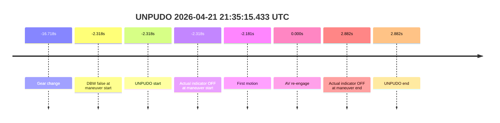
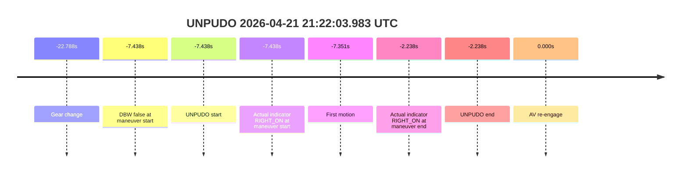
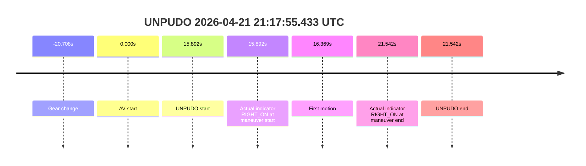
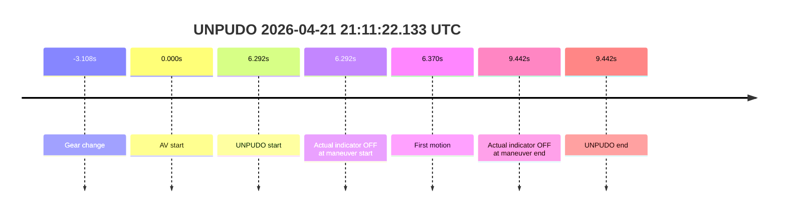
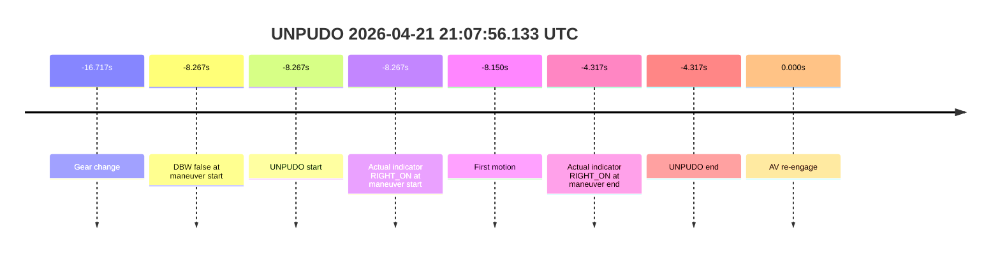

# Run Report: fme20009/2026-04-21--20-53-31--gen2-av-c485ff0d-599e-495f-bee7-17c4a854ab52

| Field | Value |
|---|---|
| Run ID | `fme20009/2026-04-21--20-53-31--gen2-av-c485ff0d-599e-495f-bee7-17c4a854ab52` |
| Date | `2026-04-21` |
| Model(s) | `blue-panther-solid` |
| Author | `guy.geva` |
| Event count | `5` |

## unpudo 2026-04-21 21:35:15.433 UTC

| Field | Value |
|---|---|
| Model | `blue-panther-solid` |
| Author | `guy.geva` |
| Run ID | `fme20009/2026-04-21--20-53-31--gen2-av-c485ff0d-599e-495f-bee7-17c4a854ab52` |
| Date | `2026-04-21` |
| Time (UTC) | `21:35:15.433` |
| Event type | `unpudo` |
| Disengagement type | `none observed` |
| Console | [run](https://console.sso.wayve.ai/run/fme20009/2026-04-21--20-53-31--gen2-av-c485ff0d-599e-495f-bee7-17c4a854ab52?id=&time-unixus=1776807315433317) |
| Foxglove | [segment](https://app.foxglove.dev/wayve-on-prem/p/prj_0dX18KZdVHg1fmmI/view?ds=foxglove-stream&ds.deviceName=fme20009&ds.end=2026-04-21T21%3A35%3A35.633Z&ds.start=2026-04-21T21%3A34%3A41.033Z&layoutId=lay_0e7VD4WIKDQGU73Y&time=2026-04-21T21%3A35%3A15.433Z) |

- Fail: the credited UNPUDO does not stay AV-owned. The local controller window is DBW-false at the anchor, first motion happens before AV re-engages, and the recovered AV engagement arrives only `2.318s` after the event start, so the model does not own the maneuver it is being credited for.

| Event | Time (UTC) | Delta from AV start |
|---|---:|---:|
| Gear change | 2026-04-21 21:35:01.033 | `-16.718s` |
| DBW false at maneuver start | 2026-04-21 21:35:15.433 | `-2.318s` |
| UNPUDO start | 2026-04-21 21:35:15.433 | `-2.318s` |
| Actual indicator at maneuver start | 2026-04-21 21:35:15.433 (`OFF`) | `-2.318s` |
| First motion | 2026-04-21 21:35:15.570 | `-2.181s` |
| AV re-engage | 2026-04-21 21:35:17.751 | `0.000s` |
| Actual indicator at maneuver end | 2026-04-21 21:35:20.633 (`OFF`) | `2.882s` |
| UNPUDO end | 2026-04-21 21:35:20.633 | `2.882s` |

| Metric | Value |
|---|---|
| Validated route reassignment | `false` |
| AV start baseline | `2026-04-21 21:35:17.751 UTC` |
| Controller DBW at anchor | `false in local transition window` |
| Predicted gear at event start | `DRIVE_POSITION_V2_DRIVE` |
| Actual gear at event start | `DRIVE_POSITION_V2_DRIVE` |
| Planned indicator at event start | `INDICATORS_STATE_V2_RIGHT_ON` |
| Actual indicator at event start | `INDICATORS_STATE_V2_OFF` |
| Driver accel help in maneuver window | `false` |
| Max accel pedal | `0.0%` |
| Max brake pedal | `8.0%` |
| Max speed | `3.764 m/s` |
| AV -> UNPUDO start | `-2.318s` |
| AV -> first motion | `-2.181s` |
| AV-owned duration before event end | `2.882s` |
| Trajectory waypoint count at anchor | `36` |
| Trajectory driving-plan step count at anchor | `11` |
| Main disengagement flag | `0` |
| Gear-to-start disengagement | `0` |
| Before-gearchange-10s disengagement | `0` |

The important fact here is ownership, not just outcome. The car is already moving before the locally recovered AV re-engagement, so the success belongs to the pre-AV or handover portion rather than to the model-controlled segment. Under the updated scoring rule, that makes this a model-performance failure: the run succeeds, but the credited UNPUDO does not stay AV-owned.

### Resolution

| Field | Value |
|---|---|
| Final outcome | `fail` |
| Do we agree with this label? | `yes` |
| Source disengagement type | `none observed` |
| Resolved effective failure type | `completed_outside_av` |
| Confidence | `high` |

## unpudo 2026-04-21 21:22:03.983 UTC

| Field | Value |
|---|---|
| Model | `blue-panther-solid` |
| Author | `guy.geva` |
| Run ID | `fme20009/2026-04-21--20-53-31--gen2-av-c485ff0d-599e-495f-bee7-17c4a854ab52` |
| Date | `2026-04-21` |
| Time (UTC) | `21:22:03.983` |
| Event type | `unpudo` |
| Disengagement type | `none observed` |
| Console | [run](https://console.sso.wayve.ai/run/fme20009/2026-04-21--20-53-31--gen2-av-c485ff0d-599e-495f-bee7-17c4a854ab52?id=&time-unixus=1776806523983321) |
| Foxglove | [segment](https://app.foxglove.dev/wayve-on-prem/p/prj_0dX18KZdVHg1fmmI/view?ds=foxglove-stream&ds.deviceName=fme20009&ds.end=2026-04-21T21%3A22%3A24.183Z&ds.start=2026-04-21T21%3A21%3A28.633Z&layoutId=lay_0e7VD4WIKDQGU73Y&time=2026-04-21T21%3A22%3A03.983Z) |

- Fail: the credited UNPUDO completes outside AV. The event is locally DBW-false throughout its official window, and the first recovered AV re-engagement comes `2.238s` after the official event end, so the model does not own the maneuver.

| Event | Time (UTC) | Delta from AV start |
|---|---:|---:|
| Gear change | 2026-04-21 21:21:48.633 | `-22.788s` |
| DBW false at maneuver start | 2026-04-21 21:22:03.983 | `-7.438s` |
| UNPUDO start | 2026-04-21 21:22:03.983 | `-7.438s` |
| Actual indicator at maneuver start | 2026-04-21 21:22:03.983 (`RIGHT_ON`) | `-7.438s` |
| First motion | 2026-04-21 21:22:04.070 | `-7.351s` |
| Actual indicator at maneuver end | 2026-04-21 21:22:09.183 (`RIGHT_ON`) | `-2.238s` |
| UNPUDO end | 2026-04-21 21:22:09.183 | `-2.238s` |
| AV re-engage | 2026-04-21 21:22:11.421 | `0.000s` |

| Metric | Value |
|---|---|
| Validated route reassignment | `false` |
| AV start baseline | `2026-04-21 21:22:11.421 UTC` |
| Controller DBW at anchor | `false in local transition window` |
| Predicted gear at event start | `DRIVE_POSITION_V2_DRIVE` |
| Actual gear at event start | `DRIVE_POSITION_V2_DRIVE` |
| Planned indicator at event start | `INDICATORS_STATE_V2_RIGHT_ON` |
| Actual indicator at event start | `INDICATORS_STATE_V2_RIGHT_ON` |
| Driver accel help in maneuver window | `false` |
| Max accel pedal | `0.0%` |
| Max brake pedal | `8.0%` |
| Max speed | `2.408 m/s` |
| AV -> UNPUDO start | `-7.438s` |
| AV -> first motion | `-7.351s` |
| AV-owned duration before event end | `0.000s` |
| Trajectory waypoint count at anchor | `36` |
| Trajectory driving-plan step count at anchor | `11` |
| Main disengagement flag | `0` |
| Gear-to-start disengagement | `0` |
| Before-gearchange-10s disengagement | `0` |

This card changed materially once the local DBW transitions were inspected instead of just sampling the anchor. The vehicle has already started and finished the official event before AV ownership comes back. Under the updated contract, that is not a neutral handover artifact; it is a fail for model performance because the maneuver attributed to the model completes outside AV.

### Resolution

| Field | Value |
|---|---|
| Final outcome | `fail` |
| Do we agree with this label? | `yes` |
| Source disengagement type | `none observed` |
| Resolved effective failure type | `completed_outside_av` |
| Confidence | `high` |

## unpudo 2026-04-21 21:17:55.433 UTC

| Field | Value |
|---|---|
| Model | `blue-panther-solid` |
| Author | `guy.geva` |
| Run ID | `fme20009/2026-04-21--20-53-31--gen2-av-c485ff0d-599e-495f-bee7-17c4a854ab52` |
| Date | `2026-04-21` |
| Time (UTC) | `21:17:55.433` |
| Event type | `unpudo` |
| Disengagement type | `none observed` |
| Console | [run](https://console.sso.wayve.ai/run/fme20009/2026-04-21--20-53-31--gen2-av-c485ff0d-599e-495f-bee7-17c4a854ab52?id=&time-unixus=1776806275433311) |
| Foxglove | [segment](https://app.foxglove.dev/wayve-on-prem/p/prj_0dX18KZdVHg1fmmI/view?ds=foxglove-stream&ds.deviceName=fme20009&ds.end=2026-04-21T21%3A18%3A16.083Z&ds.start=2026-04-21T21%3A16%3A58.833Z&layoutId=lay_0e7VD4WIKDQGU73Y&time=2026-04-21T21%3A17%3A55.433Z) |

- Pass: AV-owned UNPUDO success. AV re-engages `15.892s` before the anchor, remains active through the event, the model holds `DRIVE`, the actual indicator matches the planned `RIGHT_ON`, and the vehicle moves without accelerator help or disengagement.

| Event | Time (UTC) | Delta from AV start |
|---|---:|---:|
| Gear change | 2026-04-21 21:17:18.833 | `-20.708s` |
| AV start | 2026-04-21 21:17:39.541 | `0.000s` |
| UNPUDO start | 2026-04-21 21:17:55.433 | `15.892s` |
| Actual indicator at maneuver start | 2026-04-21 21:17:55.433 (`RIGHT_ON`) | `15.892s` |
| First motion | 2026-04-21 21:17:55.910 | `16.369s` |
| Actual indicator at maneuver end | 2026-04-21 21:18:01.083 (`RIGHT_ON`) | `21.542s` |
| UNPUDO end | 2026-04-21 21:18:01.083 | `21.542s` |

| Metric | Value |
|---|---|
| Validated route reassignment | `false` |
| AV start baseline | `2026-04-21 21:17:39.541 UTC` |
| Controller DBW at anchor | `true` |
| Predicted gear at event start | `DRIVE_POSITION_V2_DRIVE` |
| Actual gear at event start | `DRIVE_POSITION_V2_DRIVE` |
| Planned indicator at event start | `INDICATORS_STATE_V2_RIGHT_ON` |
| Actual indicator at event start | `INDICATORS_STATE_V2_RIGHT_ON` |
| Driver accel help in maneuver window | `false` |
| Max accel pedal | `0.0%` |
| Max brake pedal | `8.0%` |
| Max speed | `4.094 m/s` |
| AV -> UNPUDO start | `15.892s` |
| AV -> first motion | `16.369s` |
| AV-owned duration before event end | `21.542s` |
| Trajectory waypoint count at anchor | `36` |
| Trajectory driving-plan step count at anchor | `11` |
| Main disengagement flag | `0` |
| Gear-to-start disengagement | `0` |
| Before-gearchange-10s disengagement | `0` |

This is a valid model-owned success. The gear change happens before AV ownership, which is fine; once AV engages, it holds control for long enough to make the event meaningful, and the actual maneuver starts later inside that AV-owned window. Gear and indicators align from maneuver start through maneuver end, motion is prompt once the anchor arrives, and there is no pedal help or disengagement.

### Resolution

| Field | Value |
|---|---|
| Final outcome | `pass` |
| Do we agree with this label? | `yes` |
| Source disengagement type | `none observed` |
| Resolved effective failure type | `none` |
| Confidence | `high` |

## unpudo 2026-04-21 21:11:22.133 UTC

| Field | Value |
|---|---|
| Model | `blue-panther-solid` |
| Author | `guy.geva` |
| Run ID | `fme20009/2026-04-21--20-53-31--gen2-av-c485ff0d-599e-495f-bee7-17c4a854ab52` |
| Date | `2026-04-21` |
| Time (UTC) | `21:11:22.133` |
| Event type | `unpudo` |
| Disengagement type | `none observed` |
| Console | [run](https://console.sso.wayve.ai/run/fme20009/2026-04-21--20-53-31--gen2-av-c485ff0d-599e-495f-bee7-17c4a854ab52?id=&time-unixus=1776805882133301) |
| Foxglove | [segment](https://app.foxglove.dev/wayve-on-prem/p/prj_0dX18KZdVHg1fmmI/view?ds=foxglove-stream&ds.deviceName=fme20009&ds.end=2026-04-21T21%3A11%3A40.283Z&ds.start=2026-04-21T21%3A10%3A52.733Z&layoutId=lay_0e7VD4WIKDQGU73Y&time=2026-04-21T21%3A11%3A22.133Z) |

- Pass: short but valid AV-owned UNPUDO success. AV re-engages `6.292s` before the anchor and stays active through the event end; the vehicle launches `0.078s` after the anchor, there is no accelerator help, and there is no disengagement. The planned indicator is `RIGHT_ON` while the actual indicator sample is `OFF`, but that mismatch does not prevent the maneuver from succeeding.

| Event | Time (UTC) | Delta from AV start |
|---|---:|---:|
| Gear change | 2026-04-21 21:11:12.733 | `-3.108s` |
| AV start | 2026-04-21 21:11:15.841 | `0.000s` |
| UNPUDO start | 2026-04-21 21:11:22.133 | `6.292s` |
| Actual indicator at maneuver start | 2026-04-21 21:11:22.133 (`OFF`) | `6.292s` |
| First motion | 2026-04-21 21:11:22.211 | `6.370s` |
| Actual indicator at maneuver end | 2026-04-21 21:11:25.283 (`OFF`) | `9.442s` |
| UNPUDO end | 2026-04-21 21:11:25.283 | `9.442s` |

| Metric | Value |
|---|---|
| Validated route reassignment | `false` |
| AV start baseline | `2026-04-21 21:11:15.841 UTC` |
| Controller DBW at anchor | `true` |
| Predicted gear at event start | `DRIVE_POSITION_V2_DRIVE` |
| Actual gear at event start | `DRIVE_POSITION_V2_DRIVE` |
| Planned indicator at event start | `INDICATORS_STATE_V2_RIGHT_ON` |
| Actual indicator at event start | `INDICATORS_STATE_V2_OFF` |
| Driver accel help in maneuver window | `false` |
| Max accel pedal | `0.0%` |
| Max brake pedal | `10.825%` |
| Max speed | `5.433 m/s` |
| AV -> UNPUDO start | `6.292s` |
| AV -> first motion | `6.370s` |
| AV-owned duration before event end | `9.442s` |
| Trajectory waypoint count at anchor | `36` |
| Trajectory driving-plan step count at anchor | `11` |
| Main disengagement flag | `0` |
| Gear-to-start disengagement | `0` |
| Before-gearchange-10s disengagement | `0` |

This is the shortest true AV-owned success in the set, so it needs the caution the skill calls for, but it still qualifies as real evidence. AV owns the entire anchor-to-end portion, the vehicle moves immediately after the anchor, and the event closes cleanly with no disengagement. The indicator mismatch is notable, but in this segment it persists through the maneuver without preventing a successful AV-owned rollout.

### Resolution

| Field | Value |
|---|---|
| Final outcome | `pass` |
| Do we agree with this label? | `yes` |
| Source disengagement type | `none observed` |
| Resolved effective failure type | `none` |
| Confidence | `medium-high` |

## unpudo 2026-04-21 21:07:56.133 UTC

| Field | Value |
|---|---|
| Model | `blue-panther-solid` |
| Author | `guy.geva` |
| Run ID | `fme20009/2026-04-21--20-53-31--gen2-av-c485ff0d-599e-495f-bee7-17c4a854ab52` |
| Date | `2026-04-21` |
| Time (UTC) | `21:07:56.133` |
| Event type | `unpudo` |
| Disengagement type | `none observed` |
| Console | [run](https://console.sso.wayve.ai/run/fme20009/2026-04-21--20-53-31--gen2-av-c485ff0d-599e-495f-bee7-17c4a854ab52?id=&time-unixus=1776805676133296) |
| Foxglove | [segment](https://app.foxglove.dev/wayve-on-prem/p/prj_0dX18KZdVHg1fmmI/view?ds=foxglove-stream&ds.deviceName=fme20009&ds.end=2026-04-21T21%3A08%3A15.083Z&ds.start=2026-04-21T21%3A07%3A27.683Z&layoutId=lay_0e7VD4WIKDQGU73Y&time=2026-04-21T21%3A07%3A56.133Z) |

- Fail: the credited UNPUDO completes outside AV. The official event starts and ends while the local controller window is DBW-false, and AV does not re-engage until `4.317s` after the event has already ended.

| Event | Time (UTC) | Delta from AV start |
|---|---:|---:|
| Gear change | 2026-04-21 21:07:47.683 | `-16.717s` |
| DBW false at maneuver start | 2026-04-21 21:07:56.133 | `-8.267s` |
| UNPUDO start | 2026-04-21 21:07:56.133 | `-8.267s` |
| Actual indicator at maneuver start | 2026-04-21 21:07:56.133 (`RIGHT_ON`) | `-8.267s` |
| First motion | 2026-04-21 21:07:56.250 | `-8.150s` |
| Actual indicator at maneuver end | 2026-04-21 21:08:00.083 (`RIGHT_ON`) | `-4.317s` |
| UNPUDO end | 2026-04-21 21:08:00.083 | `-4.317s` |
| AV re-engage | 2026-04-21 21:08:04.400 | `0.000s` |

| Metric | Value |
|---|---|
| Validated route reassignment | `false` |
| AV start baseline | `2026-04-21 21:08:04.400 UTC` |
| Controller DBW at anchor | `false` |
| Predicted gear at event start | `DRIVE_POSITION_V2_DRIVE` |
| Actual gear at event start | `DRIVE_POSITION_V2_DRIVE` |
| Planned indicator at event start | `INDICATORS_STATE_V2_RIGHT_ON` |
| Actual indicator at event start | `INDICATORS_STATE_V2_RIGHT_ON` |
| Driver accel help in maneuver window | `false` |
| Max accel pedal | `0.0%` |
| Max brake pedal | `0.0%` |
| Max speed | `4.883 m/s` |
| AV -> UNPUDO start | `-8.267s` |
| AV -> first motion | `-8.150s` |
| AV-owned duration before event end | `0.000s` |
| Trajectory waypoint count at anchor | `36` |
| Trajectory driving-plan step count at anchor | `11` |
| Main disengagement flag | `0` |
| Gear-to-start disengagement | `0` |
| Before-gearchange-10s disengagement | `0` |

This is the clearest example of why the baseline matters. The vehicle completes the event before AV ownership returns, so the successful rollout happens outside AV. Under the updated contract that is a fail, not an excluded sample, because the model is being credited with a maneuver it did not actually own.

### Resolution

| Field | Value |
|---|---|
| Final outcome | `fail` |
| Do we agree with this label? | `yes` |
| Source disengagement type | `none observed` |
| Resolved effective failure type | `completed_outside_av` |
| Confidence | `high` |
