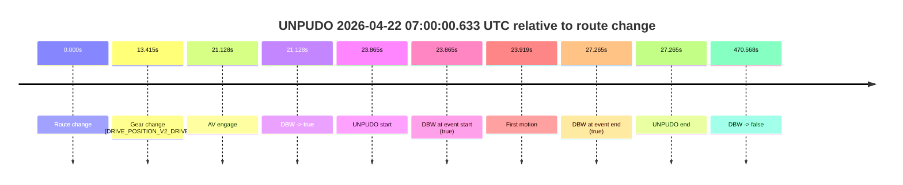
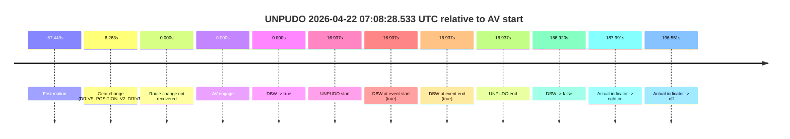

# Run Report: fme20009/2026-04-22--06-53-35--gen2-av-2fa6d6c6-d319-4356-857a-08301054e662

| Field | Value |
|---|---|
| Run ID | `fme20009/2026-04-22--06-53-35--gen2-av-2fa6d6c6-d319-4356-857a-08301054e662` |
| Date | `2026-04-22` |
| Model(s) | `pink-manta-ray-smooth` |
| Author | `guy.geva` |
| Event count | `2` |

## unpudo 2026-04-22 07:00:00.633 UTC

| Field | Value |
|---|---|
| Model | `pink-manta-ray-smooth` |
| Author | `guy.geva` |
| Run ID | `fme20009/2026-04-22--06-53-35--gen2-av-2fa6d6c6-d319-4356-857a-08301054e662` |
| Date | `2026-04-22` |
| Time (UTC) | `07:00:00.633` |
| Event type | `unpudo` |
| Disengagement type | `none observed` |
| Route change | `found` |
| Console | [run](https://console.sso.wayve.ai/run/fme20009/2026-04-22--06-53-35--gen2-av-2fa6d6c6-d319-4356-857a-08301054e662?id=&time-unixus=1776841200633308) |
| Foxglove | [segment](https://app.foxglove.dev/wayve-on-prem/p/prj_0dX18KZdVHg1fmmI/view?ds=foxglove-stream&ds.deviceName=fme20009&ds.start=2026-04-22T06%3A59%3A26.768451Z&ds.end=2026-04-22T07%3A07%3A37.336768Z&layoutId=lay_0e7VD4WIKDQGU73Y&time=2026-04-22T07%3A00%3A00.633308Z) |

### Event card: pass

- Pass: AV owns the credited unpudo from route change through the official unpudo window, the gear state is aligned at the anchor, and the vehicle moves without driver accelerator help in AV.

| Event | Time (UTC) | Delta from route change |
|---|---:|---:|
| Route change | 2026-04-22 06:59:36.768 | `0.000s` |
| Gear change (DRIVE_POSITION_V2_DRIVE) | 2026-04-22 06:59:50.183 | `13.415s` |
| AV engage | 2026-04-22 06:59:57.896 | `21.128s` |
| DBW -> true | 2026-04-22 06:59:57.896 | `21.128s` |
| UNPUDO start | 2026-04-22 07:00:00.633 | `23.865s` |
| DBW at event start (true) | 2026-04-22 07:00:00.633 | `23.865s` |
| First motion | 2026-04-22 07:00:00.687 | `23.919s` |
| DBW at event end (true) | 2026-04-22 07:00:04.033 | `27.265s` |
| UNPUDO end | 2026-04-22 07:00:04.033 | `27.265s` |
| DBW -> false | 2026-04-22 07:07:27.336 | `470.568s` |

| Metric | Value |
|---|---|
| Outcome | `pass` |
| Effective failure type | `none` |
| Route change status | `found` |
| DBW at event start | `true` |
| DBW at event end | `true` |
| Predicted gear at AV start | `DRIVE_POSITION_V2_DRIVE` |
| Actual gear at AV start | `DRIVE_POSITION_V2_DRIVE` |
| Predicted gear at event start | `DRIVE_POSITION_V2_DRIVE` |
| Actual gear at event start | `DRIVE_POSITION_V2_DRIVE` |
| Planned indicator direction | `INDICATORS_STATE_V2_RIGHT_ON` |
| Controller indicator direction | `INDICATORS_STATE_V2_RIGHT_ON` |
| Actual indicator direction | `INDICATORS_STATE_V2_OFF` |
| Actual indicator at maneuver end | `INDICATORS_STATE_V2_OFF` |
| Driver accel help in AV | `false` |
| Driver accel help timestamp | `n/a` |
| Max accel pedal pct in AV | `0.0%` |
| Max brake pedal pct in AV | `8.6%` |
| Max speed mps in AV | `5.353` |
| Success timing baseline | `route change` |
| Route -> AV | `21.128s` |
| AV -> event start | `2.737s` |
| AV -> first motion | `2.790s` |
| Success baseline -> event start | `23.865s` |
| Success baseline -> first motion | `23.919s` |
| AV duration before disengagement | `449.440s` |
| Trajectory waypoint count | `37` |
| Driving-plan step count | `11` |

The scored portion starts from the AV-owned window, not from the pre-AV setup. Route-change search in the stopped pre-event segment was `found`, with the baseline therefore set to route change. At the event anchor the model predicts `DRIVE_POSITION_V2_DRIVE` and the actual gear is `DRIVE_POSITION_V2_DRIVE`. The effective model outcome is `pass` because `the credited unpudo stays AV-owned through the official unpudo window.`

### Resolution

| Field | Value |
|---|---|
| Final outcome | `pass` |
| Do we agree with this label? | `yes` |
| Source disengagement type | `none observed` |
| Resolved effective failure type | `none` |
| Confidence | `high` |

## unpudo 2026-04-22 07:08:28.533 UTC

| Field | Value |
|---|---|
| Model | `pink-manta-ray-smooth` |
| Author | `guy.geva` |
| Run ID | `fme20009/2026-04-22--06-53-35--gen2-av-2fa6d6c6-d319-4356-857a-08301054e662` |
| Date | `2026-04-22` |
| Time (UTC) | `07:08:28.533` |
| Event type | `unpudo` |
| Disengagement type | `none observed` |
| Route change | `not found` |
| Console | [run](https://console.sso.wayve.ai/run/fme20009/2026-04-22--06-53-35--gen2-av-2fa6d6c6-d319-4356-857a-08301054e662?id=&time-unixus=1776841708533311) |
| Foxglove | [segment](https://app.foxglove.dev/wayve-on-prem/p/prj_0dX18KZdVHg1fmmI/view?ds=foxglove-stream&ds.deviceName=fme20009&ds.start=2026-04-22T07%3A07%3A55.333313Z&ds.end=2026-04-22T07%3A11%3A28.516532Z&layoutId=lay_0e7VD4WIKDQGU73Y&time=2026-04-22T07%3A08%3A28.533311Z) |

### Event card: fail

- Fail: AV owns part of the segment, but the event still resolves as a model-performance failure under the AV-only scoring rule.

| Event | Time (UTC) | Delta from AV start |
|---|---:|---:|
| First motion | 2026-04-22 07:07:04.147 | `-67.449s` |
| Gear change (DRIVE_POSITION_V2_DRIVE) | 2026-04-22 07:08:05.333 | `-6.263s` |
| Route change not recovered | 2026-04-22 07:08:11.596 | `0.000s` |
| AV engage | 2026-04-22 07:08:11.596 | `0.000s` |
| DBW -> true | 2026-04-22 07:08:11.596 | `0.000s` |
| UNPUDO start | 2026-04-22 07:08:28.533 | `16.937s` |
| DBW at event start (true) | 2026-04-22 07:08:28.533 | `16.937s` |
| DBW at event end (true) | 2026-04-22 07:08:28.533 | `16.937s` |
| UNPUDO end | 2026-04-22 07:08:28.533 | `16.937s` |
| DBW -> false | 2026-04-22 07:11:18.516 | `186.920s` |
| Actual indicator -> right on | 2026-04-22 07:11:19.587 | `187.991s` |
| Actual indicator -> off | 2026-04-22 07:11:28.147 | `196.551s` |

| Metric | Value |
|---|---|
| Outcome | `fail` |
| Effective failure type | `unknown_needs_review` |
| Route change status | `not found` |
| DBW at event start | `true` |
| DBW at event end | `true` |
| Predicted gear at AV start | `DRIVE_POSITION_V2_DRIVE` |
| Actual gear at AV start | `DRIVE_POSITION_V2_DRIVE` |
| Predicted gear at event start | `DRIVE_POSITION_V2_DRIVE` |
| Actual gear at event start | `DRIVE_POSITION_V2_DRIVE` |
| Planned indicator direction | `INDICATORS_STATE_V2_OFF` |
| Controller indicator direction | `INDICATORS_STATE_V2_OFF` |
| Actual indicator direction | `INDICATORS_STATE_V2_OFF` |
| Actual indicator at maneuver end | `INDICATORS_STATE_V2_OFF` |
| Driver accel help in AV | `false` |
| Driver accel help timestamp | `n/a` |
| Max accel pedal pct in AV | `0.0%` |
| Max brake pedal pct in AV | `8.0%` |
| Max speed mps in AV | `0.000` |
| Success timing baseline | `AV start` |
| Route -> AV | `n/a` |
| AV -> event start | `16.937s` |
| AV -> first motion | `-67.449s` |
| Success baseline -> event start | `16.937s` |
| Success baseline -> first motion | `-67.449s` |
| AV duration before disengagement | `186.920s` |
| Trajectory waypoint count | `37` |
| Driving-plan step count | `11` |

The scored portion starts from the AV-owned window, not from the pre-AV setup. Route-change search in the stopped pre-event segment was `not found`, with the baseline therefore set to AV start. At the event anchor the model predicts `DRIVE_POSITION_V2_DRIVE` and the actual gear is `DRIVE_POSITION_V2_DRIVE`. The effective model outcome is `fail` because `unknown_needs_review.`

### Resolution

| Field | Value |
|---|---|
| Final outcome | `fail` |
| Do we agree with this label? | `yes` |
| Source disengagement type | `none observed` |
| Resolved effective failure type | `unknown_needs_review` |
| Confidence | `high` |
