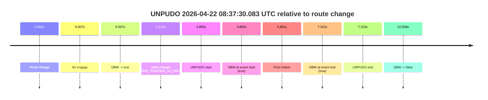
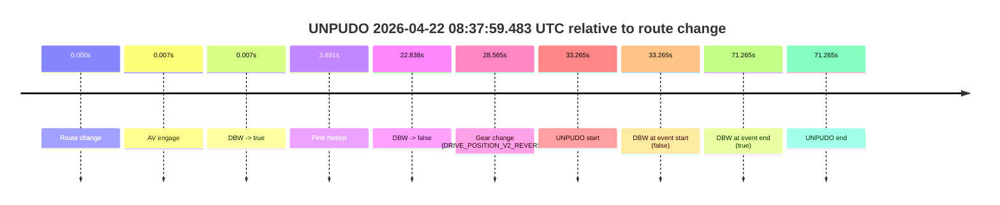
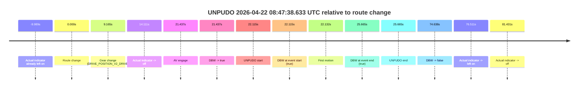
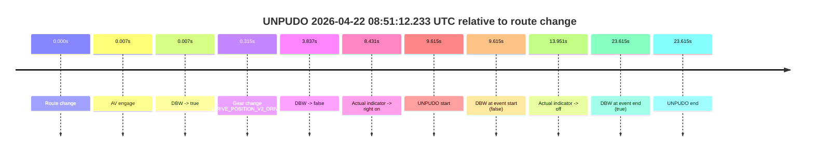
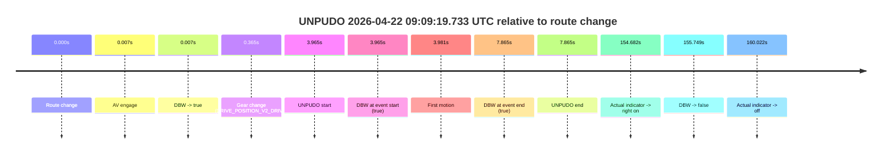
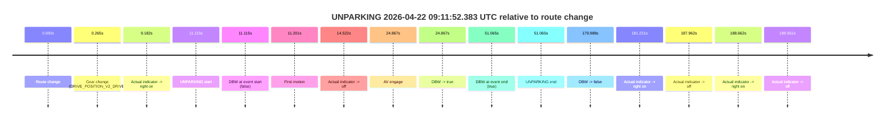

# Run Report: fme20009/2026-04-22--08-29-02--gen2-av-65922491-c7ac-43cc-8af7-cf747e7336c2

| Field | Value |
|---|---|
| Run ID | `fme20009/2026-04-22--08-29-02--gen2-av-65922491-c7ac-43cc-8af7-cf747e7336c2` |
| Date | `2026-04-22` |
| Model(s) | `eel-teal-outspoken` |
| Author | `zak` |
| Event count | `6` |

## unpudo 2026-04-22 08:37:30.083 UTC

| Field | Value |
|---|---|
| Model | `eel-teal-outspoken` |
| Author | `zak` |
| Run ID | `fme20009/2026-04-22--08-29-02--gen2-av-65922491-c7ac-43cc-8af7-cf747e7336c2` |
| Date | `2026-04-22` |
| Time (UTC) | `08:37:30.083` |
| Event type | `unpudo` |
| Disengagement type | `none observed` |
| Route change | `found` |
| Console | [run](https://console.sso.wayve.ai/run/fme20009/2026-04-22--08-29-02--gen2-av-65922491-c7ac-43cc-8af7-cf747e7336c2?id=&time-unixus=1776847050083295) |
| Foxglove | [segment](https://app.foxglove.dev/wayve-on-prem/p/prj_0dX18KZdVHg1fmmI/view?ds=foxglove-stream&ds.deviceName=fme20009&ds.start=2026-04-22T08%3A37%3A16.218297Z&ds.end=2026-04-22T08%3A37%3A59.056280Z&layoutId=lay_0e7VD4WIKDQGU73Y&time=2026-04-22T08%3A37%3A30.083295Z) |

### Event card: pass

- Pass: AV owns the credited unpudo from route change through the official unpudo window, the gear state is aligned at the anchor, and the vehicle moves without driver accelerator help in AV.

| Event | Time (UTC) | Delta from route change |
|---|---:|---:|
| Route change | 2026-04-22 08:37:26.218 | `0.000s` |
| AV engage | 2026-04-22 08:37:26.225 | `0.007s` |
| DBW -> true | 2026-04-22 08:37:26.225 | `0.007s` |
| Gear change (DRIVE_POSITION_V2_DRIVE) | 2026-04-22 08:37:26.533 | `0.315s` |
| UNPUDO start | 2026-04-22 08:37:30.083 | `3.865s` |
| DBW at event start (true) | 2026-04-22 08:37:30.083 | `3.865s` |
| First motion | 2026-04-22 08:37:30.109 | `3.891s` |
| DBW at event end (true) | 2026-04-22 08:37:33.533 | `7.315s` |
| UNPUDO end | 2026-04-22 08:37:33.533 | `7.315s` |
| DBW -> false | 2026-04-22 08:37:49.056 | `22.838s` |

| Metric | Value |
|---|---|
| Outcome | `pass` |
| Effective failure type | `none` |
| Route change status | `found` |
| DBW at event start | `true` |
| DBW at event end | `true` |
| Predicted gear at AV start | `DRIVE_POSITION_V2_PARK` |
| Actual gear at AV start | `DRIVE_POSITION_V2_PARK` |
| Predicted gear at event start | `DRIVE_POSITION_V2_DRIVE` |
| Actual gear at event start | `DRIVE_POSITION_V2_DRIVE` |
| Planned indicator direction | `INDICATORS_STATE_V2_OFF` |
| Controller indicator direction | `INDICATORS_STATE_V2_OFF` |
| Actual indicator direction | `INDICATORS_STATE_V2_OFF` |
| Actual indicator at maneuver end | `INDICATORS_STATE_V2_OFF` |
| Driver accel help in AV | `false` |
| Driver accel help timestamp | `n/a` |
| Max accel pedal pct in AV | `0.0%` |
| Max brake pedal pct in AV | `8.0%` |
| Max speed mps in AV | `4.761` |
| Success timing baseline | `route change` |
| Route -> AV | `0.007s` |
| AV -> event start | `3.858s` |
| AV -> first motion | `3.884s` |
| Success baseline -> event start | `3.865s` |
| Success baseline -> first motion | `3.891s` |
| AV duration before disengagement | `22.831s` |
| Trajectory waypoint count | `36` |
| Driving-plan step count | `11` |

The scored portion starts from the AV-owned window, not from the pre-AV setup. Route-change search in the stopped pre-event segment was `found`, with the baseline therefore set to route change. At the event anchor the model predicts `DRIVE_POSITION_V2_DRIVE` and the actual gear is `DRIVE_POSITION_V2_DRIVE`. The effective model outcome is `pass` because `the credited unpudo stays AV-owned through the official unpudo window.`

### Resolution

| Field | Value |
|---|---|
| Final outcome | `pass` |
| Do we agree with this label? | `yes` |
| Source disengagement type | `none observed` |
| Resolved effective failure type | `none` |
| Confidence | `high` |

## unpudo 2026-04-22 08:37:59.483 UTC

| Field | Value |
|---|---|
| Model | `eel-teal-outspoken` |
| Author | `zak` |
| Run ID | `fme20009/2026-04-22--08-29-02--gen2-av-65922491-c7ac-43cc-8af7-cf747e7336c2` |
| Date | `2026-04-22` |
| Time (UTC) | `08:37:59.483` |
| Event type | `unpudo` |
| Disengagement type | `none observed` |
| Route change | `found` |
| Console | [run](https://console.sso.wayve.ai/run/fme20009/2026-04-22--08-29-02--gen2-av-65922491-c7ac-43cc-8af7-cf747e7336c2?id=&time-unixus=1776847079483326) |
| Foxglove | [segment](https://app.foxglove.dev/wayve-on-prem/p/prj_0dX18KZdVHg1fmmI/view?ds=foxglove-stream&ds.deviceName=fme20009&ds.start=2026-04-22T08%3A37%3A16.218297Z&ds.end=2026-04-22T08%3A38%3A47.483314Z&layoutId=lay_0e7VD4WIKDQGU73Y&time=2026-04-22T08%3A37%3A59.483326Z) |

### Event card: fail

- Fail: the credited unpudo does not stay AV-owned. The event window starts with DBW false, and the maneuver outcome lands outside a clean AV-owned segment.

| Event | Time (UTC) | Delta from route change |
|---|---:|---:|
| Route change | 2026-04-22 08:37:26.218 | `0.000s` |
| AV engage | 2026-04-22 08:37:26.225 | `0.007s` |
| DBW -> true | 2026-04-22 08:37:26.225 | `0.007s` |
| First motion | 2026-04-22 08:37:30.109 | `3.891s` |
| DBW -> false | 2026-04-22 08:37:49.056 | `22.838s` |
| Gear change (DRIVE_POSITION_V2_REVERSE) | 2026-04-22 08:37:54.783 | `28.565s` |
| UNPUDO start | 2026-04-22 08:37:59.483 | `33.265s` |
| DBW at event start (false) | 2026-04-22 08:37:59.483 | `33.265s` |
| DBW at event end (true) | 2026-04-22 08:38:37.483 | `71.265s` |
| UNPUDO end | 2026-04-22 08:38:37.483 | `71.265s` |

| Metric | Value |
|---|---|
| Outcome | `fail` |
| Effective failure type | `not_av_owned` |
| Route change status | `found` |
| DBW at event start | `false` |
| DBW at event end | `true` |
| Predicted gear at AV start | `DRIVE_POSITION_V2_PARK` |
| Actual gear at AV start | `DRIVE_POSITION_V2_PARK` |
| Predicted gear at event start | `DRIVE_POSITION_V2_REVERSE` |
| Actual gear at event start | `DRIVE_POSITION_V2_REVERSE` |
| Planned indicator direction | `INDICATORS_STATE_V2_OFF` |
| Controller indicator direction | `INDICATORS_STATE_V2_OFF` |
| Actual indicator direction | `INDICATORS_STATE_V2_OFF` |
| Actual indicator at maneuver end | `INDICATORS_STATE_V2_OFF` |
| Driver accel help in AV | `false` |
| Driver accel help timestamp | `n/a` |
| Max accel pedal pct in AV | `0.0%` |
| Max brake pedal pct in AV | `8.2%` |
| Max speed mps in AV | `5.653` |
| Success timing baseline | `route change` |
| Route -> AV | `0.007s` |
| AV -> event start | `33.258s` |
| AV -> first motion | `3.884s` |
| Success baseline -> event start | `33.265s` |
| Success baseline -> first motion | `3.891s` |
| AV duration before disengagement | `22.831s` |
| Trajectory waypoint count | `36` |
| Driving-plan step count | `11` |

The scored portion starts from the AV-owned window, not from the pre-AV setup. Route-change search in the stopped pre-event segment was `found`, with the baseline therefore set to route change. At the event anchor the model predicts `DRIVE_POSITION_V2_REVERSE` and the actual gear is `DRIVE_POSITION_V2_REVERSE`. The effective model outcome is `fail` because `not_av_owned.`

### Resolution

| Field | Value |
|---|---|
| Final outcome | `fail` |
| Do we agree with this label? | `yes` |
| Source disengagement type | `none observed` |
| Resolved effective failure type | `not_av_owned` |
| Confidence | `high` |

## unpudo 2026-04-22 08:47:38.633 UTC

| Field | Value |
|---|---|
| Model | `eel-teal-outspoken` |
| Author | `zak` |
| Run ID | `fme20009/2026-04-22--08-29-02--gen2-av-65922491-c7ac-43cc-8af7-cf747e7336c2` |
| Date | `2026-04-22` |
| Time (UTC) | `08:47:38.633` |
| Event type | `unpudo` |
| Disengagement type | `none observed` |
| Route change | `found` |
| Console | [run](https://console.sso.wayve.ai/run/fme20009/2026-04-22--08-29-02--gen2-av-65922491-c7ac-43cc-8af7-cf747e7336c2?id=&time-unixus=1776847658633298) |
| Foxglove | [segment](https://app.foxglove.dev/wayve-on-prem/p/prj_0dX18KZdVHg1fmmI/view?ds=foxglove-stream&ds.deviceName=fme20009&ds.start=2026-04-22T08%3A47%3A06.518322Z&ds.end=2026-04-22T08%3A48%3A41.156525Z&layoutId=lay_0e7VD4WIKDQGU73Y&time=2026-04-22T08%3A47%3A38.633298Z) |

### Event card: pass

- Pass: AV owns the credited unpudo from route change through the official unpudo window, the gear state is aligned at the anchor, and the vehicle moves without driver accelerator help in AV.

| Event | Time (UTC) | Delta from route change |
|---|---:|---:|
| Actual indicator already left on | 2026-04-22 08:47:06.529 | `-9.989s` |
| Route change | 2026-04-22 08:47:16.518 | `0.000s` |
| Gear change (DRIVE_POSITION_V2_DRIVE) | 2026-04-22 08:47:25.683 | `9.165s` |
| Actual indicator -> off | 2026-04-22 08:47:30.629 | `14.111s` |
| AV engage | 2026-04-22 08:47:37.955 | `21.437s` |
| DBW -> true | 2026-04-22 08:47:37.955 | `21.437s` |
| UNPUDO start | 2026-04-22 08:47:38.633 | `22.115s` |
| DBW at event start (true) | 2026-04-22 08:47:38.633 | `22.115s` |
| First motion | 2026-04-22 08:47:38.650 | `22.132s` |
| DBW at event end (true) | 2026-04-22 08:47:42.183 | `25.665s` |
| UNPUDO end | 2026-04-22 08:47:42.183 | `25.665s` |
| DBW -> false | 2026-04-22 08:48:31.156 | `74.638s` |
| Actual indicator -> left on | 2026-04-22 08:48:33.029 | `76.511s` |
| Actual indicator -> off | 2026-04-22 08:48:37.949 | `81.431s` |

| Metric | Value |
|---|---|
| Outcome | `pass` |
| Effective failure type | `none` |
| Route change status | `found` |
| DBW at event start | `true` |
| DBW at event end | `true` |
| Predicted gear at AV start | `DRIVE_POSITION_V2_DRIVE` |
| Actual gear at AV start | `DRIVE_POSITION_V2_DRIVE` |
| Predicted gear at event start | `DRIVE_POSITION_V2_DRIVE` |
| Actual gear at event start | `DRIVE_POSITION_V2_DRIVE` |
| Planned indicator direction | `INDICATORS_STATE_V2_RIGHT_ON` |
| Controller indicator direction | `INDICATORS_STATE_V2_RIGHT_ON` |
| Actual indicator direction | `INDICATORS_STATE_V2_OFF` |
| Actual indicator at maneuver end | `INDICATORS_STATE_V2_OFF` |
| Driver accel help in AV | `false` |
| Driver accel help timestamp | `n/a` |
| Max accel pedal pct in AV | `0.0%` |
| Max brake pedal pct in AV | `0.0%` |
| Max speed mps in AV | `4.372` |
| Success timing baseline | `route change` |
| Route -> AV | `21.437s` |
| AV -> event start | `0.678s` |
| AV -> first motion | `0.695s` |
| Success baseline -> event start | `22.115s` |
| Success baseline -> first motion | `22.132s` |
| AV duration before disengagement | `53.201s` |
| Trajectory waypoint count | `37` |
| Driving-plan step count | `11` |

The scored portion starts from the AV-owned window, not from the pre-AV setup. Route-change search in the stopped pre-event segment was `found`, with the baseline therefore set to route change. At the event anchor the model predicts `DRIVE_POSITION_V2_DRIVE` and the actual gear is `DRIVE_POSITION_V2_DRIVE`. The effective model outcome is `pass` because `the credited unpudo stays AV-owned through the official unpudo window.`

### Resolution

| Field | Value |
|---|---|
| Final outcome | `pass` |
| Do we agree with this label? | `yes` |
| Source disengagement type | `none observed` |
| Resolved effective failure type | `none` |
| Confidence | `high` |

## unpudo 2026-04-22 08:51:12.233 UTC

| Field | Value |
|---|---|
| Model | `eel-teal-outspoken` |
| Author | `zak` |
| Run ID | `fme20009/2026-04-22--08-29-02--gen2-av-65922491-c7ac-43cc-8af7-cf747e7336c2` |
| Date | `2026-04-22` |
| Time (UTC) | `08:51:12.233` |
| Event type | `unpudo` |
| Disengagement type | `none observed` |
| Route change | `found` |
| Console | [run](https://console.sso.wayve.ai/run/fme20009/2026-04-22--08-29-02--gen2-av-65922491-c7ac-43cc-8af7-cf747e7336c2?id=&time-unixus=1776847872233294) |
| Foxglove | [segment](https://app.foxglove.dev/wayve-on-prem/p/prj_0dX18KZdVHg1fmmI/view?ds=foxglove-stream&ds.deviceName=fme20009&ds.start=2026-04-22T08%3A50%3A52.618257Z&ds.end=2026-04-22T08%3A51%3A36.233294Z&layoutId=lay_0e7VD4WIKDQGU73Y&time=2026-04-22T08%3A51%3A12.233294Z) |

### Event card: fail

- Fail: the credited unpudo does not stay AV-owned. The event window starts with DBW false, and the maneuver outcome lands outside a clean AV-owned segment.

| Event | Time (UTC) | Delta from route change |
|---|---:|---:|
| Route change | 2026-04-22 08:51:02.618 | `0.000s` |
| AV engage | 2026-04-22 08:51:02.625 | `0.007s` |
| DBW -> true | 2026-04-22 08:51:02.625 | `0.007s` |
| Gear change (DRIVE_POSITION_V2_DRIVE) | 2026-04-22 08:51:02.933 | `0.315s` |
| DBW -> false | 2026-04-22 08:51:06.455 | `3.837s` |
| Actual indicator -> right on | 2026-04-22 08:51:11.049 | `8.431s` |
| UNPUDO start | 2026-04-22 08:51:12.233 | `9.615s` |
| DBW at event start (false) | 2026-04-22 08:51:12.233 | `9.615s` |
| Actual indicator -> off | 2026-04-22 08:51:16.569 | `13.951s` |
| DBW at event end (true) | 2026-04-22 08:51:26.233 | `23.615s` |
| UNPUDO end | 2026-04-22 08:51:26.233 | `23.615s` |

| Metric | Value |
|---|---|
| Outcome | `fail` |
| Effective failure type | `not_av_owned` |
| Route change status | `found` |
| DBW at event start | `false` |
| DBW at event end | `true` |
| Predicted gear at AV start | `DRIVE_POSITION_V2_PARK` |
| Actual gear at AV start | `DRIVE_POSITION_V2_PARK` |
| Predicted gear at event start | `DRIVE_POSITION_V2_DRIVE` |
| Actual gear at event start | `DRIVE_POSITION_V2_DRIVE` |
| Planned indicator direction | `INDICATORS_STATE_V2_RIGHT_ON` |
| Controller indicator direction | `INDICATORS_STATE_V2_RIGHT_ON` |
| Actual indicator direction | `INDICATORS_STATE_V2_RIGHT_ON` |
| Actual indicator at maneuver end | `INDICATORS_STATE_V2_OFF` |
| Driver accel help in AV | `false` |
| Driver accel help timestamp | `n/a` |
| Max accel pedal pct in AV | `0.0%` |
| Max brake pedal pct in AV | `8.0%` |
| Max speed mps in AV | `0.000` |
| Success timing baseline | `route change` |
| Route -> AV | `0.007s` |
| AV -> event start | `9.608s` |
| AV -> first motion | `n/a` |
| Success baseline -> event start | `9.615s` |
| Success baseline -> first motion | `n/a` |
| AV duration before disengagement | `3.830s` |
| Trajectory waypoint count | `37` |
| Driving-plan step count | `11` |

The scored portion starts from the AV-owned window, not from the pre-AV setup. Route-change search in the stopped pre-event segment was `found`, with the baseline therefore set to route change. At the event anchor the model predicts `DRIVE_POSITION_V2_DRIVE` and the actual gear is `DRIVE_POSITION_V2_DRIVE`. The effective model outcome is `fail` because `not_av_owned.`

### Resolution

| Field | Value |
|---|---|
| Final outcome | `fail` |
| Do we agree with this label? | `yes` |
| Source disengagement type | `none observed` |
| Resolved effective failure type | `not_av_owned` |
| Confidence | `high` |

## unpudo 2026-04-22 09:09:19.733 UTC

| Field | Value |
|---|---|
| Model | `eel-teal-outspoken` |
| Author | `zak` |
| Run ID | `fme20009/2026-04-22--08-29-02--gen2-av-65922491-c7ac-43cc-8af7-cf747e7336c2` |
| Date | `2026-04-22` |
| Time (UTC) | `09:09:19.733` |
| Event type | `unpudo` |
| Disengagement type | `none observed` |
| Route change | `found` |
| Console | [run](https://console.sso.wayve.ai/run/fme20009/2026-04-22--08-29-02--gen2-av-65922491-c7ac-43cc-8af7-cf747e7336c2?id=&time-unixus=1776848959733315) |
| Foxglove | [segment](https://app.foxglove.dev/wayve-on-prem/p/prj_0dX18KZdVHg1fmmI/view?ds=foxglove-stream&ds.deviceName=fme20009&ds.start=2026-04-22T09%3A09%3A05.768249Z&ds.end=2026-04-22T09%3A12%3A01.517012Z&layoutId=lay_0e7VD4WIKDQGU73Y&time=2026-04-22T09%3A09%3A19.733315Z) |

### Event card: pass

- Pass: AV owns the credited unpudo from route change through the official unpudo window, the gear state is aligned at the anchor, and the vehicle moves without driver accelerator help in AV.

| Event | Time (UTC) | Delta from route change |
|---|---:|---:|
| Route change | 2026-04-22 09:09:15.768 | `0.000s` |
| AV engage | 2026-04-22 09:09:15.775 | `0.007s` |
| DBW -> true | 2026-04-22 09:09:15.775 | `0.007s` |
| Gear change (DRIVE_POSITION_V2_DRIVE) | 2026-04-22 09:09:16.133 | `0.365s` |
| UNPUDO start | 2026-04-22 09:09:19.733 | `3.965s` |
| DBW at event start (true) | 2026-04-22 09:09:19.733 | `3.965s` |
| First motion | 2026-04-22 09:09:19.749 | `3.981s` |
| DBW at event end (true) | 2026-04-22 09:09:23.633 | `7.865s` |
| UNPUDO end | 2026-04-22 09:09:23.633 | `7.865s` |
| Actual indicator -> right on | 2026-04-22 09:11:50.450 | `154.682s` |
| DBW -> false | 2026-04-22 09:11:51.517 | `155.749s` |
| Actual indicator -> off | 2026-04-22 09:11:55.789 | `160.022s` |

| Metric | Value |
|---|---|
| Outcome | `pass` |
| Effective failure type | `none` |
| Route change status | `found` |
| DBW at event start | `true` |
| DBW at event end | `true` |
| Predicted gear at AV start | `DRIVE_POSITION_V2_PARK` |
| Actual gear at AV start | `DRIVE_POSITION_V2_PARK` |
| Predicted gear at event start | `DRIVE_POSITION_V2_DRIVE` |
| Actual gear at event start | `DRIVE_POSITION_V2_DRIVE` |
| Planned indicator direction | `INDICATORS_STATE_V2_RIGHT_ON` |
| Controller indicator direction | `INDICATORS_STATE_V2_RIGHT_ON` |
| Actual indicator direction | `INDICATORS_STATE_V2_OFF` |
| Actual indicator at maneuver end | `INDICATORS_STATE_V2_OFF` |
| Driver accel help in AV | `false` |
| Driver accel help timestamp | `n/a` |
| Max accel pedal pct in AV | `0.0%` |
| Max brake pedal pct in AV | `8.0%` |
| Max speed mps in AV | `4.817` |
| Success timing baseline | `route change` |
| Route -> AV | `0.007s` |
| AV -> event start | `3.958s` |
| AV -> first motion | `3.974s` |
| Success baseline -> event start | `3.965s` |
| Success baseline -> first motion | `3.981s` |
| AV duration before disengagement | `155.742s` |
| Trajectory waypoint count | `37` |
| Driving-plan step count | `11` |

The scored portion starts from the AV-owned window, not from the pre-AV setup. Route-change search in the stopped pre-event segment was `found`, with the baseline therefore set to route change. At the event anchor the model predicts `DRIVE_POSITION_V2_DRIVE` and the actual gear is `DRIVE_POSITION_V2_DRIVE`. The effective model outcome is `pass` because `the credited unpudo stays AV-owned through the official unpudo window.`

### Resolution

| Field | Value |
|---|---|
| Final outcome | `pass` |
| Do we agree with this label? | `yes` |
| Source disengagement type | `none observed` |
| Resolved effective failure type | `none` |
| Confidence | `high` |

## unparking 2026-04-22 09:11:52.383 UTC

| Field | Value |
|---|---|
| Model | `eel-teal-outspoken` |
| Author | `zak` |
| Run ID | `fme20009/2026-04-22--08-29-02--gen2-av-65922491-c7ac-43cc-8af7-cf747e7336c2` |
| Date | `2026-04-22` |
| Time (UTC) | `09:11:52.383` |
| Event type | `unparking` |
| Disengagement type | `none observed` |
| Route change | `found` |
| Console | [run](https://console.sso.wayve.ai/run/fme20009/2026-04-22--08-29-02--gen2-av-65922491-c7ac-43cc-8af7-cf747e7336c2?id=&time-unixus=1776849112383308) |
| Foxglove | [segment](https://app.foxglove.dev/wayve-on-prem/p/prj_0dX18KZdVHg1fmmI/view?ds=foxglove-stream&ds.deviceName=fme20009&ds.start=2026-04-22T09%3A11%3A31.268264Z&ds.end=2026-04-22T09%3A14%3A51.256583Z&layoutId=lay_0e7VD4WIKDQGU73Y&time=2026-04-22T09%3A11%3A52.383308Z) |

### Event card: pass

- Pass: AV owns the credited unparking through the official event window, the gear state is aligned at the anchor, and the vehicle moves without driver accelerator help in AV.

| Event | Time (UTC) | Delta from route change |
|---|---:|---:|
| Route change | 2026-04-22 09:11:41.268 | `0.000s` |
| Gear change (DRIVE_POSITION_V2_DRIVE) | 2026-04-22 09:11:41.533 | `0.265s` |
| Actual indicator -> right on | 2026-04-22 09:11:50.450 | `9.182s` |
| UNPARKING start | 2026-04-22 09:11:52.383 | `11.115s` |
| DBW at event start (false) | 2026-04-22 09:11:52.383 | `11.115s` |
| First motion | 2026-04-22 09:11:52.469 | `11.201s` |
| Actual indicator -> off | 2026-04-22 09:11:55.789 | `14.522s` |
| AV engage | 2026-04-22 09:12:06.135 | `24.867s` |
| DBW -> true | 2026-04-22 09:12:06.135 | `24.867s` |
| DBW at event end (true) | 2026-04-22 09:12:32.333 | `51.065s` |
| UNPARKING end | 2026-04-22 09:12:32.333 | `51.065s` |
| DBW -> false | 2026-04-22 09:14:41.256 | `179.988s` |
| Actual indicator -> right on | 2026-04-22 09:14:42.489 | `181.221s` |
| Actual indicator -> off | 2026-04-22 09:14:49.230 | `187.962s` |
| Actual indicator -> right on | 2026-04-22 09:14:49.929 | `188.662s` |
| Actual indicator -> off | 2026-04-22 09:14:50.829 | `189.561s` |

| Metric | Value |
|---|---|
| Outcome | `pass` |
| Effective failure type | `none` |
| Route change status | `found` |
| DBW at event start | `false` |
| DBW at event end | `true` |
| Predicted gear at AV start | `DRIVE_POSITION_V2_DRIVE` |
| Actual gear at AV start | `DRIVE_POSITION_V2_DRIVE` |
| Predicted gear at event start | `DRIVE_POSITION_V2_DRIVE` |
| Actual gear at event start | `DRIVE_POSITION_V2_DRIVE` |
| Planned indicator direction | `INDICATORS_STATE_V2_RIGHT_ON` |
| Controller indicator direction | `INDICATORS_STATE_V2_RIGHT_ON` |
| Actual indicator direction | `INDICATORS_STATE_V2_RIGHT_ON` |
| Actual indicator at maneuver end | `INDICATORS_STATE_V2_OFF` |
| Driver accel help in AV | `false` |
| Driver accel help timestamp | `n/a` |
| Max accel pedal pct in AV | `0.0%` |
| Max brake pedal pct in AV | `9.8%` |
| Max speed mps in AV | `3.958` |
| Success timing baseline | `route change` |
| Route -> AV | `24.867s` |
| AV -> event start | `-13.752s` |
| AV -> first motion | `-13.666s` |
| Success baseline -> event start | `11.115s` |
| Success baseline -> first motion | `11.201s` |
| AV duration before disengagement | `155.121s` |
| Trajectory waypoint count | `36` |
| Driving-plan step count | `11` |

The scored portion starts from the AV-owned window, not from the pre-AV setup. Route-change search in the stopped pre-event segment was `found`, with the baseline therefore set to route change. At the event anchor the model predicts `DRIVE_POSITION_V2_DRIVE` and the actual gear is `DRIVE_POSITION_V2_DRIVE`. The effective model outcome is `pass` because `the credited maneuver stays AV-owned through the official event end.`

### Resolution

| Field | Value |
|---|---|
| Final outcome | `pass` |
| Do we agree with this label? | `yes` |
| Source disengagement type | `none observed` |
| Resolved effective failure type | `none` |
| Confidence | `high` |
