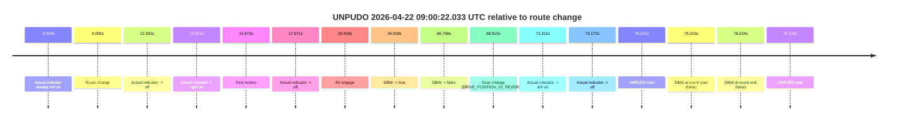

# Run Report: fme20009/2026-04-22--08-29-02--gen2-av-65922491-c7ac-43cc-8af7-cf747e7336c2

| Field | Value |
|---|---|
| Run ID | `fme20009/2026-04-22--08-29-02--gen2-av-65922491-c7ac-43cc-8af7-cf747e7336c2` |
| Date | `2026-04-22` |
| Model(s) | `pink-manta-ray-smooth` |
| Author | `guy.geva` |
| Event count | `1` |

## unpudo 2026-04-22 09:00:22.033 UTC

| Field | Value |
|---|---|
| Model | `pink-manta-ray-smooth` |
| Author | `guy.geva` |
| Run ID | `fme20009/2026-04-22--08-29-02--gen2-av-65922491-c7ac-43cc-8af7-cf747e7336c2` |
| Date | `2026-04-22` |
| Time (UTC) | `09:00:22.033` |
| Event type | `unpudo` |
| Disengagement type | `none observed` |
| Route change | `found` |
| Console | [run](https://console.sso.wayve.ai/run/fme20009/2026-04-22--08-29-02--gen2-av-65922491-c7ac-43cc-8af7-cf747e7336c2?id=&time-unixus=1776848422033308) |
| Foxglove | [segment](https://app.foxglove.dev/wayve-on-prem/p/prj_0dX18KZdVHg1fmmI/view?ds=foxglove-stream&ds.deviceName=fme20009&ds.start=2026-04-22T08%3A58%3A55.818237Z&ds.end=2026-04-22T09%3A00%3A32.033308Z&layoutId=lay_0e7VD4WIKDQGU73Y&time=2026-04-22T09%3A00%3A22.033308Z) |

### Event card: fail

- Fail: the credited unpudo does not stay AV-owned. The event window starts with DBW false, and the maneuver outcome lands outside a clean AV-owned segment.

| Event | Time (UTC) | Delta from route change |
|---|---:|---:|
| Actual indicator already left on | 2026-04-22 08:58:55.829 | `-9.989s` |
| Route change | 2026-04-22 08:59:05.818 | `0.000s` |
| Actual indicator -> off | 2026-04-22 08:59:18.209 | `12.391s` |
| Actual indicator -> right on | 2026-04-22 08:59:18.769 | `12.951s` |
| First motion | 2026-04-22 08:59:20.489 | `14.672s` |
| Actual indicator -> off | 2026-04-22 08:59:23.389 | `17.571s` |
| AV engage | 2026-04-22 08:59:32.736 | `26.918s` |
| DBW -> true | 2026-04-22 08:59:32.736 | `26.918s` |
| DBW -> false | 2026-04-22 09:00:12.576 | `66.758s` |
| Gear change (DRIVE_POSITION_V2_REVERSE) | 2026-04-22 09:00:14.733 | `68.915s` |
| Actual indicator -> left on | 2026-04-22 09:00:17.129 | `71.311s` |
| Actual indicator -> off | 2026-04-22 09:00:18.990 | `73.172s` |
| UNPUDO start | 2026-04-22 09:00:22.033 | `76.215s` |
| DBW at event start (false) | 2026-04-22 09:00:22.033 | `76.215s` |
| DBW at event end (false) | 2026-04-22 09:00:22.033 | `76.215s` |
| UNPUDO end | 2026-04-22 09:00:22.033 | `76.215s` |

| Metric | Value |
|---|---|
| Outcome | `fail` |
| Effective failure type | `completed_outside_av` |
| Route change status | `found` |
| DBW at event start | `false` |
| DBW at event end | `false` |
| Predicted gear at AV start | `DRIVE_POSITION_V2_DRIVE` |
| Actual gear at AV start | `DRIVE_POSITION_V2_DRIVE` |
| Predicted gear at event start | `DRIVE_POSITION_V2_REVERSE` |
| Actual gear at event start | `DRIVE_POSITION_V2_REVERSE` |
| Planned indicator direction | `INDICATORS_STATE_V2_OFF` |
| Controller indicator direction | `INDICATORS_STATE_V2_OFF` |
| Actual indicator direction | `INDICATORS_STATE_V2_OFF` |
| Actual indicator at maneuver end | `INDICATORS_STATE_V2_OFF` |
| Driver accel help in AV | `false` |
| Driver accel help timestamp | `n/a` |
| Max accel pedal pct in AV | `0.0%` |
| Max brake pedal pct in AV | `1.6%` |
| Max speed mps in AV | `7.861` |
| Success timing baseline | `route change` |
| Route -> AV | `26.918s` |
| AV -> event start | `49.297s` |
| AV -> first motion | `-12.246s` |
| Success baseline -> event start | `76.215s` |
| Success baseline -> first motion | `14.672s` |
| AV duration before disengagement | `39.840s` |
| Trajectory waypoint count | `37` |
| Driving-plan step count | `11` |

The scored portion starts from the AV-owned window, not from the pre-AV setup. Route-change search in the stopped pre-event segment was `found`, with the baseline therefore set to route change. At the event anchor the model predicts `DRIVE_POSITION_V2_REVERSE` and the actual gear is `DRIVE_POSITION_V2_REVERSE`. The effective model outcome is `fail` because `completed_outside_av.`

### Resolution

| Field | Value |
|---|---|
| Final outcome | `fail` |
| Do we agree with this label? | `yes` |
| Source disengagement type | `none observed` |
| Resolved effective failure type | `completed_outside_av` |
| Confidence | `high` |
