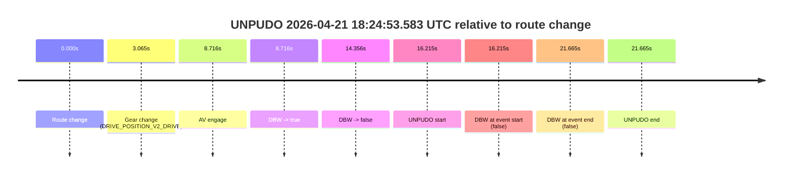
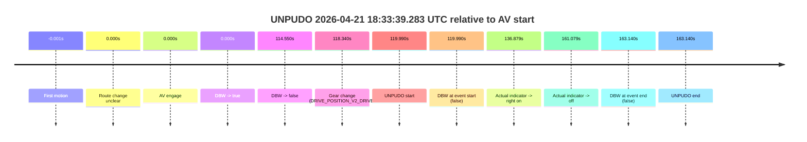
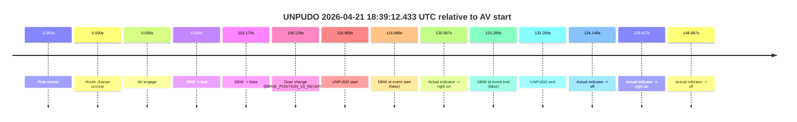
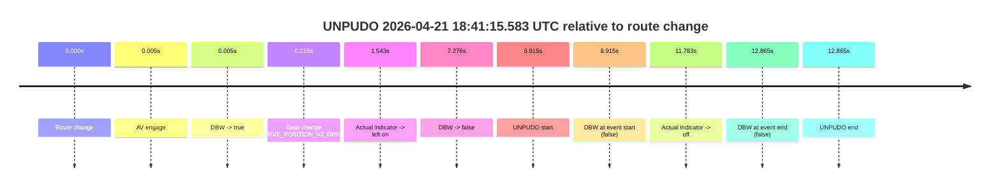

# Run Report: fme20012/2026-04-21--18-04-36--gen2-av-2cbcf7bc-e3b1-4401-aaca-0870f81485c4

| Field | Value |
|---|---|
| Run ID | `fme20012/2026-04-21--18-04-36--gen2-av-2cbcf7bc-e3b1-4401-aaca-0870f81485c4` |
| Date | `2026-04-21` |
| Model(s) | `pink-manta-ray-smooth` |
| Author | `guy.geva` |
| Event count | `4` |

## unpudo 2026-04-21 18:24:53.583 UTC

| Field | Value |
|---|---|
| Model | `pink-manta-ray-smooth` |
| Author | `guy.geva` |
| Run ID | `fme20012/2026-04-21--18-04-36--gen2-av-2cbcf7bc-e3b1-4401-aaca-0870f81485c4` |
| Date | `2026-04-21` |
| Time (UTC) | `18:24:53.583` |
| Event type | `unpudo` |
| Disengagement type | `none observed` |
| Route change | `found` |
| Console | [run](https://console.sso.wayve.ai/run/fme20012/2026-04-21--18-04-36--gen2-av-2cbcf7bc-e3b1-4401-aaca-0870f81485c4?id=&time-unixus=1776795893583321) |
| Foxglove | [segment](https://app.foxglove.dev/wayve-on-prem/p/prj_0dX18KZdVHg1fmmI/view?ds=foxglove-stream&ds.deviceName=fme20012&ds.start=2026-04-21T18%3A24%3A27.368269Z&ds.end=2026-04-21T18%3A25%3A09.033321Z&layoutId=lay_0e7VD4WIKDQGU73Y&time=2026-04-21T18%3A24%3A53.583321Z) |

### Event card: fail

- Fail: the credited unpudo does not stay AV-owned. The event window starts with DBW false, and the maneuver outcome lands outside a clean AV-owned segment.

| Event | Time (UTC) | Delta from route change |
|---|---:|---:|
| Route change | 2026-04-21 18:24:37.368 | `0.000s` |
| Gear change (DRIVE_POSITION_V2_DRIVE) | 2026-04-21 18:24:40.433 | `3.065s` |
| AV engage | 2026-04-21 18:24:46.083 | `8.716s` |
| DBW -> true | 2026-04-21 18:24:46.083 | `8.716s` |
| DBW -> false | 2026-04-21 18:24:51.724 | `14.356s` |
| UNPUDO start | 2026-04-21 18:24:53.583 | `16.215s` |
| DBW at event start (false) | 2026-04-21 18:24:53.583 | `16.215s` |
| DBW at event end (false) | 2026-04-21 18:24:59.033 | `21.665s` |
| UNPUDO end | 2026-04-21 18:24:59.033 | `21.665s` |

| Metric | Value |
|---|---|
| Outcome | `fail` |
| Effective failure type | `not_av_owned` |
| Route change status | `found` |
| DBW at event start | `false` |
| DBW at event end | `false` |
| Predicted gear at AV start | `DRIVE_POSITION_V2_DRIVE` |
| Actual gear at AV start | `DRIVE_POSITION_V2_DRIVE` |
| Predicted gear at event start | `DRIVE_POSITION_V2_DRIVE` |
| Actual gear at event start | `DRIVE_POSITION_V2_DRIVE` |
| Planned indicator direction | `INDICATORS_STATE_V2_RIGHT_ON` |
| Controller indicator direction | `INDICATORS_STATE_V2_RIGHT_ON` |
| Actual indicator direction | `INDICATORS_STATE_V2_OFF` |
| Actual indicator at maneuver end | `INDICATORS_STATE_V2_OFF` |
| Driver accel help in AV | `false` |
| Driver accel help timestamp | `n/a` |
| Max accel pedal pct in AV | `0.0%` |
| Max brake pedal pct in AV | `8.5%` |
| Max speed mps in AV | `0.000` |
| Success timing baseline | `route change` |
| Route -> AV | `8.716s` |
| AV -> event start | `7.499s` |
| AV -> first motion | `n/a` |
| Success baseline -> event start | `16.215s` |
| Success baseline -> first motion | `n/a` |
| AV duration before disengagement | `5.640s` |
| Trajectory waypoint count | `37` |
| Driving-plan step count | `11` |

The scored portion starts from the AV-owned window, not from the pre-AV setup. Route-change search in the stopped pre-event segment was `found`, with the baseline therefore set to route change. At the event anchor the model predicts `DRIVE_POSITION_V2_DRIVE` and the actual gear is `DRIVE_POSITION_V2_DRIVE`. The effective model outcome is `fail` because `not_av_owned.`

### Resolution

| Field | Value |
|---|---|
| Final outcome | `fail` |
| Do we agree with this label? | `yes` |
| Source disengagement type | `none observed` |
| Resolved effective failure type | `not_av_owned` |
| Confidence | `high` |

## unpudo 2026-04-21 18:33:39.283 UTC

| Field | Value |
|---|---|
| Model | `pink-manta-ray-smooth` |
| Author | `guy.geva` |
| Run ID | `fme20012/2026-04-21--18-04-36--gen2-av-2cbcf7bc-e3b1-4401-aaca-0870f81485c4` |
| Date | `2026-04-21` |
| Time (UTC) | `18:33:39.283` |
| Event type | `unpudo` |
| Disengagement type | `none observed` |
| Route change | `unclear` |
| Console | [run](https://console.sso.wayve.ai/run/fme20012/2026-04-21--18-04-36--gen2-av-2cbcf7bc-e3b1-4401-aaca-0870f81485c4?id=&time-unixus=1776796419283310) |
| Foxglove | [segment](https://app.foxglove.dev/wayve-on-prem/p/prj_0dX18KZdVHg1fmmI/view?ds=foxglove-stream&ds.deviceName=fme20012&ds.start=2026-04-21T18%3A31%3A29.292999Z&ds.end=2026-04-21T18%3A34%3A32.433299Z&layoutId=lay_0e7VD4WIKDQGU73Y&time=2026-04-21T18%3A33%3A39.283310Z) |

### Event card: fail

- Fail: the credited unpudo does not stay AV-owned. The event window starts with DBW false, and the maneuver outcome lands outside a clean AV-owned segment.

| Event | Time (UTC) | Delta from AV start |
|---|---:|---:|
| First motion | 2026-04-21 18:31:39.291 | `-0.001s` |
| Route change unclear | 2026-04-21 18:31:39.292 | `0.000s` |
| AV engage | 2026-04-21 18:31:39.292 | `0.000s` |
| DBW -> true | 2026-04-21 18:31:39.292 | `0.000s` |
| DBW -> false | 2026-04-21 18:33:33.843 | `114.550s` |
| Gear change (DRIVE_POSITION_V2_DRIVE) | 2026-04-21 18:33:37.633 | `118.340s` |
| UNPUDO start | 2026-04-21 18:33:39.283 | `119.990s` |
| DBW at event start (false) | 2026-04-21 18:33:39.283 | `119.990s` |
| Actual indicator -> right on | 2026-04-21 18:33:56.172 | `136.879s` |
| Actual indicator -> off | 2026-04-21 18:34:20.371 | `161.079s` |
| DBW at event end (false) | 2026-04-21 18:34:22.433 | `163.140s` |
| UNPUDO end | 2026-04-21 18:34:22.433 | `163.140s` |

| Metric | Value |
|---|---|
| Outcome | `fail` |
| Effective failure type | `completed_outside_av` |
| Route change status | `unclear` |
| DBW at event start | `false` |
| DBW at event end | `false` |
| Predicted gear at AV start | `DRIVE_POSITION_V2_DRIVE` |
| Actual gear at AV start | `DRIVE_POSITION_V2_DRIVE` |
| Predicted gear at event start | `DRIVE_POSITION_V2_DRIVE` |
| Actual gear at event start | `DRIVE_POSITION_V2_DRIVE` |
| Planned indicator direction | `INDICATORS_STATE_V2_OFF` |
| Controller indicator direction | `INDICATORS_STATE_V2_OFF` |
| Actual indicator direction | `INDICATORS_STATE_V2_OFF` |
| Actual indicator at maneuver end | `INDICATORS_STATE_V2_OFF` |
| Driver accel help in AV | `false` |
| Driver accel help timestamp | `n/a` |
| Max accel pedal pct in AV | `0.0%` |
| Max brake pedal pct in AV | `9.8%` |
| Max speed mps in AV | `8.292` |
| Success timing baseline | `AV start` |
| Route -> AV | `n/a` |
| AV -> event start | `119.990s` |
| AV -> first motion | `-0.001s` |
| Success baseline -> event start | `119.990s` |
| Success baseline -> first motion | `-0.001s` |
| AV duration before disengagement | `114.550s` |
| Trajectory waypoint count | `37` |
| Driving-plan step count | `11` |

The scored portion starts from the AV-owned window, not from the pre-AV setup. Route-change search in the stopped pre-event segment was `unclear`, with the baseline therefore set to AV start. At the event anchor the model predicts `DRIVE_POSITION_V2_DRIVE` and the actual gear is `DRIVE_POSITION_V2_DRIVE`. The effective model outcome is `fail` because `completed_outside_av.`

### Resolution

| Field | Value |
|---|---|
| Final outcome | `fail` |
| Do we agree with this label? | `yes` |
| Source disengagement type | `none observed` |
| Resolved effective failure type | `completed_outside_av` |
| Confidence | `medium` |

## unpudo 2026-04-21 18:39:12.433 UTC

| Field | Value |
|---|---|
| Model | `pink-manta-ray-smooth` |
| Author | `guy.geva` |
| Run ID | `fme20012/2026-04-21--18-04-36--gen2-av-2cbcf7bc-e3b1-4401-aaca-0870f81485c4` |
| Date | `2026-04-21` |
| Time (UTC) | `18:39:12.433` |
| Event type | `unpudo` |
| Disengagement type | `none observed` |
| Route change | `unclear` |
| Console | [run](https://console.sso.wayve.ai/run/fme20012/2026-04-21--18-04-36--gen2-av-2cbcf7bc-e3b1-4401-aaca-0870f81485c4?id=&time-unixus=1776796752433306) |
| Foxglove | [segment](https://app.foxglove.dev/wayve-on-prem/p/prj_0dX18KZdVHg1fmmI/view?ds=foxglove-stream&ds.deviceName=fme20012&ds.start=2026-04-21T18%3A37%3A05.444285Z&ds.end=2026-04-21T18%3A39%3A38.733310Z&layoutId=lay_0e7VD4WIKDQGU73Y&time=2026-04-21T18%3A39%3A12.433306Z) |

### Event card: fail

- Fail: the credited unpudo does not stay AV-owned. The event window starts with DBW false, and the maneuver outcome lands outside a clean AV-owned segment.

| Event | Time (UTC) | Delta from AV start |
|---|---:|---:|
| First motion | 2026-04-21 18:37:12.451 | `-2.993s` |
| Route change unclear | 2026-04-21 18:37:15.444 | `0.000s` |
| AV engage | 2026-04-21 18:37:15.444 | `0.000s` |
| DBW -> true | 2026-04-21 18:37:15.444 | `0.000s` |
| DBW -> false | 2026-04-21 18:38:57.623 | `102.179s` |
| Gear change (DRIVE_POSITION_V2_REVERSE) | 2026-04-21 18:39:03.583 | `108.139s` |
| UNPUDO start | 2026-04-21 18:39:12.433 | `116.989s` |
| DBW at event start (false) | 2026-04-21 18:39:12.433 | `116.989s` |
| Actual indicator -> right on | 2026-04-21 18:39:26.251 | `130.807s` |
| DBW at event end (false) | 2026-04-21 18:39:28.733 | `133.289s` |
| UNPUDO end | 2026-04-21 18:39:28.733 | `133.289s` |
| Actual indicator -> off | 2026-04-21 18:39:29.592 | `134.148s` |
| Actual indicator -> right on | 2026-04-21 18:39:33.871 | `138.427s` |
| Actual indicator -> off | 2026-04-21 18:39:44.331 | `148.887s` |

| Metric | Value |
|---|---|
| Outcome | `fail` |
| Effective failure type | `completed_outside_av` |
| Route change status | `unclear` |
| DBW at event start | `false` |
| DBW at event end | `false` |
| Predicted gear at AV start | `DRIVE_POSITION_V2_DRIVE` |
| Actual gear at AV start | `DRIVE_POSITION_V2_DRIVE` |
| Predicted gear at event start | `DRIVE_POSITION_V2_REVERSE` |
| Actual gear at event start | `DRIVE_POSITION_V2_REVERSE` |
| Planned indicator direction | `INDICATORS_STATE_V2_OFF` |
| Controller indicator direction | `INDICATORS_STATE_V2_OFF` |
| Actual indicator direction | `INDICATORS_STATE_V2_OFF` |
| Actual indicator at maneuver end | `INDICATORS_STATE_V2_RIGHT_ON` |
| Driver accel help in AV | `false` |
| Driver accel help timestamp | `n/a` |
| Max accel pedal pct in AV | `0.0%` |
| Max brake pedal pct in AV | `9.0%` |
| Max speed mps in AV | `7.633` |
| Success timing baseline | `AV start` |
| Route -> AV | `n/a` |
| AV -> event start | `116.989s` |
| AV -> first motion | `-2.993s` |
| Success baseline -> event start | `116.989s` |
| Success baseline -> first motion | `-2.993s` |
| AV duration before disengagement | `102.179s` |
| Trajectory waypoint count | `38` |
| Driving-plan step count | `11` |

The scored portion starts from the AV-owned window, not from the pre-AV setup. Route-change search in the stopped pre-event segment was `unclear`, with the baseline therefore set to AV start. At the event anchor the model predicts `DRIVE_POSITION_V2_REVERSE` and the actual gear is `DRIVE_POSITION_V2_REVERSE`. The effective model outcome is `fail` because `completed_outside_av.`

### Resolution

| Field | Value |
|---|---|
| Final outcome | `fail` |
| Do we agree with this label? | `yes` |
| Source disengagement type | `none observed` |
| Resolved effective failure type | `completed_outside_av` |
| Confidence | `medium` |

## unpudo 2026-04-21 18:41:15.583 UTC

| Field | Value |
|---|---|
| Model | `pink-manta-ray-smooth` |
| Author | `guy.geva` |
| Run ID | `fme20012/2026-04-21--18-04-36--gen2-av-2cbcf7bc-e3b1-4401-aaca-0870f81485c4` |
| Date | `2026-04-21` |
| Time (UTC) | `18:41:15.583` |
| Event type | `unpudo` |
| Disengagement type | `none observed` |
| Route change | `found` |
| Console | [run](https://console.sso.wayve.ai/run/fme20012/2026-04-21--18-04-36--gen2-av-2cbcf7bc-e3b1-4401-aaca-0870f81485c4?id=&time-unixus=1776796875583316) |
| Foxglove | [segment](https://app.foxglove.dev/wayve-on-prem/p/prj_0dX18KZdVHg1fmmI/view?ds=foxglove-stream&ds.deviceName=fme20012&ds.start=2026-04-21T18%3A40%3A56.668282Z&ds.end=2026-04-21T18%3A41%3A29.533305Z&layoutId=lay_0e7VD4WIKDQGU73Y&time=2026-04-21T18%3A41%3A15.583316Z) |

### Event card: fail

- Fail: the credited unpudo does not stay AV-owned. The event window starts with DBW false, and the maneuver outcome lands outside a clean AV-owned segment.

| Event | Time (UTC) | Delta from route change |
|---|---:|---:|
| Route change | 2026-04-21 18:41:06.668 | `0.000s` |
| AV engage | 2026-04-21 18:41:06.673 | `0.005s` |
| DBW -> true | 2026-04-21 18:41:06.673 | `0.005s` |
| Gear change (DRIVE_POSITION_V2_DRIVE) | 2026-04-21 18:41:06.883 | `0.215s` |
| Actual indicator -> left on | 2026-04-21 18:41:08.211 | `1.543s` |
| DBW -> false | 2026-04-21 18:41:13.943 | `7.276s` |
| UNPUDO start | 2026-04-21 18:41:15.583 | `8.915s` |
| DBW at event start (false) | 2026-04-21 18:41:15.583 | `8.915s` |
| Actual indicator -> off | 2026-04-21 18:41:18.451 | `11.783s` |
| DBW at event end (false) | 2026-04-21 18:41:19.533 | `12.865s` |
| UNPUDO end | 2026-04-21 18:41:19.533 | `12.865s` |

| Metric | Value |
|---|---|
| Outcome | `fail` |
| Effective failure type | `not_av_owned` |
| Route change status | `found` |
| DBW at event start | `false` |
| DBW at event end | `false` |
| Predicted gear at AV start | `DRIVE_POSITION_V2_PARK` |
| Actual gear at AV start | `DRIVE_POSITION_V2_PARK` |
| Predicted gear at event start | `DRIVE_POSITION_V2_DRIVE` |
| Actual gear at event start | `DRIVE_POSITION_V2_DRIVE` |
| Planned indicator direction | `INDICATORS_STATE_V2_OFF` |
| Controller indicator direction | `INDICATORS_STATE_V2_OFF` |
| Actual indicator direction | `INDICATORS_STATE_V2_LEFT_ON` |
| Actual indicator at maneuver end | `INDICATORS_STATE_V2_OFF` |
| Driver accel help in AV | `false` |
| Driver accel help timestamp | `n/a` |
| Max accel pedal pct in AV | `0.0%` |
| Max brake pedal pct in AV | `8.0%` |
| Max speed mps in AV | `0.000` |
| Success timing baseline | `route change` |
| Route -> AV | `0.005s` |
| AV -> event start | `8.910s` |
| AV -> first motion | `n/a` |
| Success baseline -> event start | `8.915s` |
| Success baseline -> first motion | `n/a` |
| AV duration before disengagement | `7.271s` |
| Trajectory waypoint count | `37` |
| Driving-plan step count | `11` |

The scored portion starts from the AV-owned window, not from the pre-AV setup. Route-change search in the stopped pre-event segment was `found`, with the baseline therefore set to route change. At the event anchor the model predicts `DRIVE_POSITION_V2_DRIVE` and the actual gear is `DRIVE_POSITION_V2_DRIVE`. The effective model outcome is `fail` because `not_av_owned.`

### Resolution

| Field | Value |
|---|---|
| Final outcome | `fail` |
| Do we agree with this label? | `yes` |
| Source disengagement type | `none observed` |
| Resolved effective failure type | `not_av_owned` |
| Confidence | `high` |
