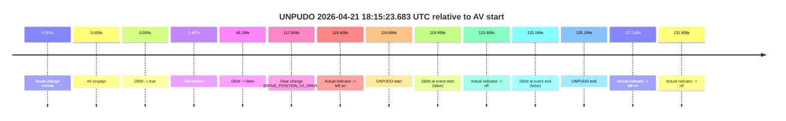
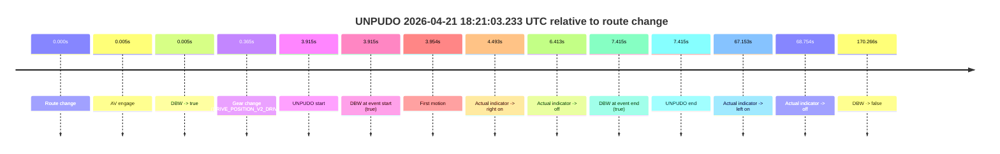

# Run Report: fme20012/2026-04-21--18-04-36--gen2-av-2cbcf7bc-e3b1-4401-aaca-0870f81485c4

| Field | Value |
|---|---|
| Run ID | `fme20012/2026-04-21--18-04-36--gen2-av-2cbcf7bc-e3b1-4401-aaca-0870f81485c4` |
| Date | `2026-04-21` |
| Model(s) | `eel-teal-outspoken` |
| Author | `zak` |
| Event count | `2` |

## unpudo 2026-04-21 18:15:23.683 UTC

| Field | Value |
|---|---|
| Model | `eel-teal-outspoken` |
| Author | `zak` |
| Run ID | `fme20012/2026-04-21--18-04-36--gen2-av-2cbcf7bc-e3b1-4401-aaca-0870f81485c4` |
| Date | `2026-04-21` |
| Time (UTC) | `18:15:23.683` |
| Event type | `unpudo` |
| Disengagement type | `none observed` |
| Route change | `unclear` |
| Console | [run](https://console.sso.wayve.ai/run/fme20012/2026-04-21--18-04-36--gen2-av-2cbcf7bc-e3b1-4401-aaca-0870f81485c4?id=&time-unixus=1776795323683307) |
| Foxglove | [segment](https://app.foxglove.dev/wayve-on-prem/p/prj_0dX18KZdVHg1fmmI/view?ds=foxglove-stream&ds.deviceName=fme20012&ds.start=2026-04-21T18%3A13%3A13.684415Z&ds.end=2026-04-21T18%3A15%3A38.883314Z&layoutId=lay_0e7VD4WIKDQGU73Y&time=2026-04-21T18%3A15%3A23.683307Z) |

### Event card: fail

- Fail: the credited unpudo does not stay AV-owned. The event window starts with DBW false, and the maneuver outcome lands outside a clean AV-owned segment.

| Event | Time (UTC) | Delta from AV start |
|---|---:|---:|
| Route change unclear | 2026-04-21 18:13:23.684 | `0.000s` |
| AV engage | 2026-04-21 18:13:23.684 | `0.000s` |
| DBW -> true | 2026-04-21 18:13:23.684 | `0.000s` |
| First motion | 2026-04-21 18:13:26.151 | `2.467s` |
| DBW -> false | 2026-04-21 18:14:11.883 | `48.199s` |
| Gear change (DRIVE_POSITION_V2_DRIVE) | 2026-04-21 18:15:20.733 | `117.049s` |
| Actual indicator -> left on | 2026-04-21 18:15:23.092 | `119.408s` |
| UNPUDO start | 2026-04-21 18:15:23.683 | `119.999s` |
| DBW at event start (false) | 2026-04-21 18:15:23.683 | `119.999s` |
| Actual indicator -> off | 2026-04-21 18:15:27.092 | `123.408s` |
| DBW at event end (false) | 2026-04-21 18:15:28.883 | `125.199s` |
| UNPUDO end | 2026-04-21 18:15:28.883 | `125.199s` |
| Actual indicator -> left on | 2026-04-21 18:15:30.931 | `127.248s` |
| Actual indicator -> off | 2026-04-21 18:15:35.592 | `131.908s` |

| Metric | Value |
|---|---|
| Outcome | `fail` |
| Effective failure type | `not_av_owned` |
| Route change status | `unclear` |
| DBW at event start | `false` |
| DBW at event end | `false` |
| Predicted gear at AV start | `DRIVE_POSITION_V2_DRIVE` |
| Actual gear at AV start | `DRIVE_POSITION_V2_DRIVE` |
| Predicted gear at event start | `DRIVE_POSITION_V2_DRIVE` |
| Actual gear at event start | `DRIVE_POSITION_V2_DRIVE` |
| Planned indicator direction | `INDICATORS_STATE_V2_LEFT_ON` |
| Controller indicator direction | `INDICATORS_STATE_V2_LEFT_ON` |
| Actual indicator direction | `INDICATORS_STATE_V2_LEFT_ON` |
| Actual indicator at maneuver end | `INDICATORS_STATE_V2_OFF` |
| Driver accel help in AV | `false` |
| Driver accel help timestamp | `n/a` |
| Max accel pedal pct in AV | `0.0%` |
| Max brake pedal pct in AV | `8.0%` |
| Max speed mps in AV | `8.008` |
| Success timing baseline | `AV start` |
| Route -> AV | `n/a` |
| AV -> event start | `119.999s` |
| AV -> first motion | `2.467s` |
| Success baseline -> event start | `119.999s` |
| Success baseline -> first motion | `2.467s` |
| AV duration before disengagement | `48.199s` |
| Trajectory waypoint count | `37` |
| Driving-plan step count | `11` |

The scored portion starts from the AV-owned window, not from the pre-AV setup. Route-change search in the stopped pre-event segment was `unclear`, with the baseline therefore set to AV start. At the event anchor the model predicts `DRIVE_POSITION_V2_DRIVE` and the actual gear is `DRIVE_POSITION_V2_DRIVE`. The effective model outcome is `fail` because `not_av_owned.`

### Resolution

| Field | Value |
|---|---|
| Final outcome | `fail` |
| Do we agree with this label? | `yes` |
| Source disengagement type | `none observed` |
| Resolved effective failure type | `not_av_owned` |
| Confidence | `medium` |

## unpudo 2026-04-21 18:21:03.233 UTC

| Field | Value |
|---|---|
| Model | `eel-teal-outspoken` |
| Author | `zak` |
| Run ID | `fme20012/2026-04-21--18-04-36--gen2-av-2cbcf7bc-e3b1-4401-aaca-0870f81485c4` |
| Date | `2026-04-21` |
| Time (UTC) | `18:21:03.233` |
| Event type | `unpudo` |
| Disengagement type | `none observed` |
| Route change | `found` |
| Console | [run](https://console.sso.wayve.ai/run/fme20012/2026-04-21--18-04-36--gen2-av-2cbcf7bc-e3b1-4401-aaca-0870f81485c4?id=&time-unixus=1776795663233308) |
| Foxglove | [segment](https://app.foxglove.dev/wayve-on-prem/p/prj_0dX18KZdVHg1fmmI/view?ds=foxglove-stream&ds.deviceName=fme20012&ds.start=2026-04-21T18%3A20%3A49.318335Z&ds.end=2026-04-21T18%3A23%3A59.583902Z&layoutId=lay_0e7VD4WIKDQGU73Y&time=2026-04-21T18%3A21%3A03.233308Z) |

### Event card: pass

- Pass: AV owns the credited unpudo from route change through the official unpudo window, the gear state is aligned at the anchor, and the vehicle moves without driver accelerator help in AV.

| Event | Time (UTC) | Delta from route change |
|---|---:|---:|
| Route change | 2026-04-21 18:20:59.318 | `0.000s` |
| AV engage | 2026-04-21 18:20:59.323 | `0.005s` |
| DBW -> true | 2026-04-21 18:20:59.323 | `0.005s` |
| Gear change (DRIVE_POSITION_V2_DRIVE) | 2026-04-21 18:20:59.683 | `0.365s` |
| UNPUDO start | 2026-04-21 18:21:03.233 | `3.915s` |
| DBW at event start (true) | 2026-04-21 18:21:03.233 | `3.915s` |
| First motion | 2026-04-21 18:21:03.272 | `3.954s` |
| Actual indicator -> right on | 2026-04-21 18:21:03.811 | `4.493s` |
| Actual indicator -> off | 2026-04-21 18:21:05.731 | `6.413s` |
| DBW at event end (true) | 2026-04-21 18:21:06.733 | `7.415s` |
| UNPUDO end | 2026-04-21 18:21:06.733 | `7.415s` |
| Actual indicator -> left on | 2026-04-21 18:22:06.471 | `67.153s` |
| Actual indicator -> off | 2026-04-21 18:22:08.072 | `68.754s` |
| DBW -> false | 2026-04-21 18:23:49.583 | `170.266s` |

| Metric | Value |
|---|---|
| Outcome | `pass` |
| Effective failure type | `none` |
| Route change status | `found` |
| DBW at event start | `true` |
| DBW at event end | `true` |
| Predicted gear at AV start | `DRIVE_POSITION_V2_PARK` |
| Actual gear at AV start | `DRIVE_POSITION_V2_PARK` |
| Predicted gear at event start | `DRIVE_POSITION_V2_DRIVE` |
| Actual gear at event start | `DRIVE_POSITION_V2_DRIVE` |
| Planned indicator direction | `INDICATORS_STATE_V2_OFF` |
| Controller indicator direction | `INDICATORS_STATE_V2_OFF` |
| Actual indicator direction | `INDICATORS_STATE_V2_OFF` |
| Actual indicator at maneuver end | `INDICATORS_STATE_V2_OFF` |
| Driver accel help in AV | `false` |
| Driver accel help timestamp | `n/a` |
| Max accel pedal pct in AV | `0.0%` |
| Max brake pedal pct in AV | `9.2%` |
| Max speed mps in AV | `4.903` |
| Success timing baseline | `route change` |
| Route -> AV | `0.005s` |
| AV -> event start | `3.910s` |
| AV -> first motion | `3.949s` |
| Success baseline -> event start | `3.915s` |
| Success baseline -> first motion | `3.954s` |
| AV duration before disengagement | `170.261s` |
| Trajectory waypoint count | `38` |
| Driving-plan step count | `11` |

The scored portion starts from the AV-owned window, not from the pre-AV setup. Route-change search in the stopped pre-event segment was `found`, with the baseline therefore set to route change. At the event anchor the model predicts `DRIVE_POSITION_V2_DRIVE` and the actual gear is `DRIVE_POSITION_V2_DRIVE`. The effective model outcome is `pass` because `the credited unpudo stays AV-owned through the official unpudo window.`

### Resolution

| Field | Value |
|---|---|
| Final outcome | `pass` |
| Do we agree with this label? | `yes` |
| Source disengagement type | `none observed` |
| Resolved effective failure type | `none` |
| Confidence | `high` |
