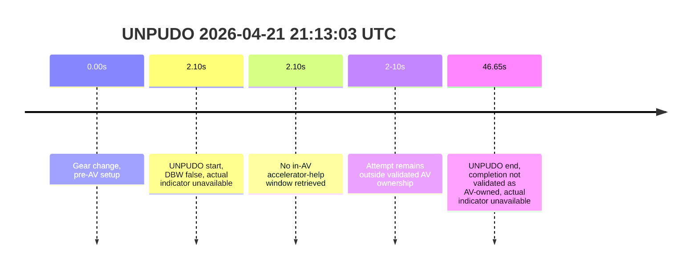
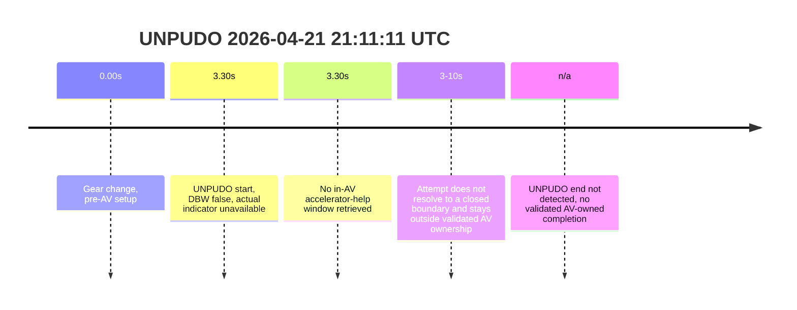

# Run Report: fme20012/2026-04-21--20-09-51--gen2-av-e0b70f5f-cb4d-4f8b-b0d7-af97a8834fb9

| Field | Value |
|---|---|
| Run ID | `fme20012/2026-04-21--20-09-51--gen2-av-e0b70f5f-cb4d-4f8b-b0d7-af97a8834fb9` |
| Date | `2026-04-21` |
| Model(s) | `pink-manta-ray-smooth` |

## unpudo 2026-04-21 21:13:03 UTC

| Field | Value |
|---|---|
| Model | `pink-manta-ray-smooth` |
| Author | `boris.indelman` |
| Run ID | `fme20012/2026-04-21--20-09-51--gen2-av-e0b70f5f-cb4d-4f8b-b0d7-af97a8834fb9` |
| Date | `2026-04-21` |
| Time (UTC) | `21:13:03` |
| Event type | `unpudo` |
| Disengagement type | `none` |
| Console | [run](https://console.sso.wayve.ai/run/fme20012/2026-04-21--20-09-51--gen2-av-e0b70f5f-cb4d-4f8b-b0d7-af97a8834fb9?id=&time-unixus=1776805983383296) |
| Foxglove | [segment](https://app.foxglove.dev/wayve-on-prem/p/prj_0dX18KZdVHg1fmmI/view?ds=foxglove-stream&ds.deviceName=fme20012&ds.end=2026-04-21T21%3A13%3A43.383Z&ds.start=2026-04-21T21%3A12%3A23.383Z&layoutId=lay_0e7VD4WIKDQGU73Y&time=2026-04-21T21%3A13%3A03.383Z) |

- `event_status: fail`. The anchor is already outside AV ownership, so the later row closure is not a model-owned UNPUDO completion.

| Event | Time (UTC) | Delta from gear change | DBW / pedal help | Actual indicator |
|---|---:|---:|---|---|
| Gear change | 2026-04-21 21:13:01 | 0.00s | pre-AV setup | unavailable from retrieved samples |
| UNPUDO start | 2026-04-21 21:13:03 | 2.10s | `DBW false` at anchor | unavailable from retrieved samples |
| DBW transition note | not validated | n/a | anchor already outside AV ownership | n/a |
| In-AV driver accelerator help | not observed | n/a | no AV-owned window retrieved at anchor | n/a |
| UNPUDO end | 2026-04-21 21:13:47 | 46.65s | completion not validated as AV-owned | unavailable from retrieved samples |

| Metric | Value |
|---|---|
| event_status | `fail` |
| Effective failure type | `interrupted_handover_or_non_av_completion` |
| Scoring baseline | `event anchor / AV-start fallback (no validated route reassignment)` |
| Predicted gear at event start | `DRIVE_POSITION_V2_DRIVE` |
| Actual gear at event start | `DRIVE_POSITION_V2_DRIVE` |
| Trajectory DBW at anchor | `false` |
| Trajectory waypoint count | `36` |
| Driving plan step count | `11` |
| Event duration | `44.55s` |
| Gear change -> UNPUDO start | `2.10s` |
| UNPUDO start -> end | `44.55s` |
| Main disengagement flag | `0` |
| Gear-to-start disengagement | `0` |
| Before-gearchange-10s disengagement | `0` |

The model still appears to be planning drive-direction motion, but the anchor itself is not AV-owned. With no validated route reassignment and no AV-owned completion evidence, this is a `fail` for model-performance reporting, not a pass and not a strong pure-controller defect claim.

### Resolution

- Final outcome: `fail`
- Do we agree with this label?: `yes`
- Source disengagement type: `none`
- Resolved effective failure type: `interrupted_handover_or_non_av_completion`
- Confidence: `high`

## unpudo 2026-04-21 21:11:11 UTC

| Field | Value |
|---|---|
| Model | `pink-manta-ray-smooth` |
| Author | `boris.indelman` |
| Run ID | `fme20012/2026-04-21--20-09-51--gen2-av-e0b70f5f-cb4d-4f8b-b0d7-af97a8834fb9` |
| Date | `2026-04-21` |
| Time (UTC) | `21:11:11` |
| Event type | `unpudo` |
| Disengagement type | `none` |
| Console | [run](https://console.sso.wayve.ai/run/fme20012/2026-04-21--20-09-51--gen2-av-e0b70f5f-cb4d-4f8b-b0d7-af97a8834fb9?id=&time-unixus=1776805871133300) |
| Foxglove | [segment](https://app.foxglove.dev/wayve-on-prem/p/prj_0dX18KZdVHg1fmmI/view?ds=foxglove-stream&ds.deviceName=fme20012&ds.end=2026-04-21T21%3A11%3A51.133Z&ds.start=2026-04-21T21%3A10%3A31.133Z&layoutId=lay_0e7VD4WIKDQGU73Y&time=2026-04-21T21%3A11%3A11.133Z) |

- `event_status: fail`. This is the clearest interrupted-attempt pattern in the sample: DBW is already false at the anchor and the event never closes.

| Event | Time (UTC) | Delta from gear change | DBW / pedal help | Actual indicator |
|---|---:|---:|---|---|
| Gear change | 2026-04-21 21:11:07 | 0.00s | pre-AV setup | unavailable from retrieved samples |
| UNPUDO start | 2026-04-21 21:11:11 | 3.30s | `DBW false` at anchor | unavailable from retrieved samples |
| DBW transition note | not validated | n/a | anchor already outside AV ownership | n/a |
| In-AV driver accelerator help | not observed | n/a | no AV-owned window retrieved at anchor | n/a |
| UNPUDO end | not detected | n/a | no validated AV-owned completion | unavailable from retrieved samples |

| Metric | Value |
|---|---|
| event_status | `fail` |
| Effective failure type | `interrupted_handover_or_non_av_attempt` |
| Scoring baseline | `event anchor / AV-start fallback (no validated route reassignment)` |
| Predicted gear at event start | `DRIVE_POSITION_V2_DRIVE` |
| Actual gear at event start | `DRIVE_POSITION_V2_DRIVE` |
| Trajectory DBW at anchor | `false` |
| Trajectory waypoint count | `36` |
| Driving plan step count | `11` |
| Event duration | `not materialized` |
| Gear change -> UNPUDO start | `3.30s` |
| Main disengagement flag | `0` |
| Gear-to-start disengagement | `0` |
| Before-gearchange-10s disengagement | `0` |

Because ownership is already gone at the anchor and there is no event end, this cannot be scored as a model-owned success. The most defensible diagnosis is an interrupted or non-AV continuation rather than a clean controller failure.

### Resolution

- Final outcome: `fail`
- Do we agree with this label?: `yes`
- Source disengagement type: `none`
- Resolved effective failure type: `interrupted_handover_or_non_av_attempt`
- Confidence: `high`
