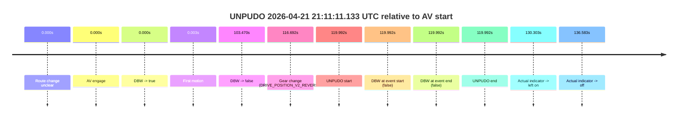
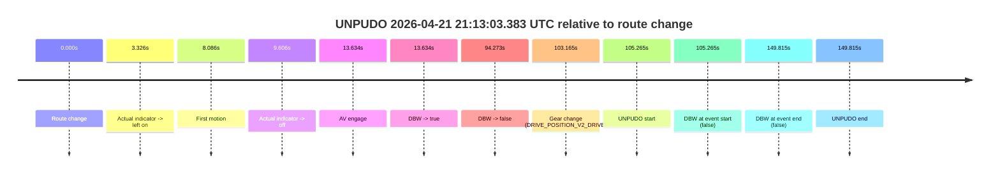

# Run Report: fme20012/2026-04-21--20-09-51--gen2-av-e0b70f5f-cb4d-4f8b-b0d7-af97a8834fb9

| Field | Value |
|---|---|
| Run ID | `fme20012/2026-04-21--20-09-51--gen2-av-e0b70f5f-cb4d-4f8b-b0d7-af97a8834fb9` |
| Date | `2026-04-21` |
| Model(s) | `pink-manta-ray-smooth` |
| Author | `guy.geva` |
| Event count | `2` |

## unpudo 2026-04-21 21:11:11.133 UTC

| Field | Value |
|---|---|
| Model | `pink-manta-ray-smooth` |
| Author | `guy.geva` |
| Run ID | `fme20012/2026-04-21--20-09-51--gen2-av-e0b70f5f-cb4d-4f8b-b0d7-af97a8834fb9` |
| Date | `2026-04-21` |
| Time (UTC) | `21:11:11.133` |
| Event type | `unpudo` |
| Disengagement type | `none observed` |
| Route change | `unclear` |
| Console | [run](https://console.sso.wayve.ai/run/fme20012/2026-04-21--20-09-51--gen2-av-e0b70f5f-cb4d-4f8b-b0d7-af97a8834fb9?id=&time-unixus=1776805871133300) |
| Foxglove | [segment](https://app.foxglove.dev/wayve-on-prem/p/prj_0dX18KZdVHg1fmmI/view?ds=foxglove-stream&ds.deviceName=fme20012&ds.start=2026-04-21T21%3A09%3A01.141471Z&ds.end=2026-04-21T21%3A11%3A21.133300Z&layoutId=lay_0e7VD4WIKDQGU73Y&time=2026-04-21T21%3A11%3A11.133300Z) |

### Event card: fail

- Fail: the credited unpudo does not stay AV-owned. The event window starts with DBW false, and the maneuver outcome lands outside a clean AV-owned segment.

| Event | Time (UTC) | Delta from AV start |
|---|---:|---:|
| Route change unclear | 2026-04-21 21:09:11.141 | `0.000s` |
| AV engage | 2026-04-21 21:09:11.141 | `0.000s` |
| DBW -> true | 2026-04-21 21:09:11.141 | `0.000s` |
| First motion | 2026-04-21 21:09:11.144 | `0.003s` |
| DBW -> false | 2026-04-21 21:10:54.611 | `103.470s` |
| Gear change (DRIVE_POSITION_V2_REVERSE) | 2026-04-21 21:11:07.833 | `116.692s` |
| UNPUDO start | 2026-04-21 21:11:11.133 | `119.992s` |
| DBW at event start (false) | 2026-04-21 21:11:11.133 | `119.992s` |
| DBW at event end (false) | 2026-04-21 21:11:11.133 | `119.992s` |
| UNPUDO end | 2026-04-21 21:11:11.133 | `119.992s` |
| Actual indicator -> left on | 2026-04-21 21:11:21.444 | `130.303s` |
| Actual indicator -> off | 2026-04-21 21:11:27.724 | `136.583s` |

| Metric | Value |
|---|---|
| Outcome | `fail` |
| Effective failure type | `not_av_owned` |
| Route change status | `unclear` |
| DBW at event start | `false` |
| DBW at event end | `false` |
| Predicted gear at AV start | `DRIVE_POSITION_V2_DRIVE` |
| Actual gear at AV start | `DRIVE_POSITION_V2_DRIVE` |
| Predicted gear at event start | `DRIVE_POSITION_V2_REVERSE` |
| Actual gear at event start | `DRIVE_POSITION_V2_REVERSE` |
| Planned indicator direction | `INDICATORS_STATE_V2_OFF` |
| Controller indicator direction | `INDICATORS_STATE_V2_OFF` |
| Actual indicator direction | `INDICATORS_STATE_V2_OFF` |
| Actual indicator at maneuver end | `INDICATORS_STATE_V2_OFF` |
| Driver accel help in AV | `false` |
| Driver accel help timestamp | `n/a` |
| Max accel pedal pct in AV | `0.0%` |
| Max brake pedal pct in AV | `8.0%` |
| Max speed mps in AV | `8.169` |
| Success timing baseline | `AV start` |
| Route -> AV | `n/a` |
| AV -> event start | `119.992s` |
| AV -> first motion | `0.003s` |
| Success baseline -> event start | `119.992s` |
| Success baseline -> first motion | `0.003s` |
| AV duration before disengagement | `103.470s` |
| Trajectory waypoint count | `36` |
| Driving-plan step count | `11` |

The scored portion starts from the AV-owned window, not from the pre-AV setup. Route-change search in the stopped pre-event segment was `unclear`, with the baseline therefore set to AV start. At the event anchor the model predicts `DRIVE_POSITION_V2_REVERSE` and the actual gear is `DRIVE_POSITION_V2_REVERSE`. The effective model outcome is `fail` because `not_av_owned.`

### Resolution

| Field | Value |
|---|---|
| Final outcome | `fail` |
| Do we agree with this label? | `yes` |
| Source disengagement type | `none observed` |
| Resolved effective failure type | `not_av_owned` |
| Confidence | `medium` |

## unpudo 2026-04-21 21:13:03.383 UTC

| Field | Value |
|---|---|
| Model | `pink-manta-ray-smooth` |
| Author | `guy.geva` |
| Run ID | `fme20012/2026-04-21--20-09-51--gen2-av-e0b70f5f-cb4d-4f8b-b0d7-af97a8834fb9` |
| Date | `2026-04-21` |
| Time (UTC) | `21:13:03.383` |
| Event type | `unpudo` |
| Disengagement type | `none observed` |
| Route change | `found` |
| Console | [run](https://console.sso.wayve.ai/run/fme20012/2026-04-21--20-09-51--gen2-av-e0b70f5f-cb4d-4f8b-b0d7-af97a8834fb9?id=&time-unixus=1776805983383296) |
| Foxglove | [segment](https://app.foxglove.dev/wayve-on-prem/p/prj_0dX18KZdVHg1fmmI/view?ds=foxglove-stream&ds.deviceName=fme20012&ds.start=2026-04-21T21%3A11%3A08.118299Z&ds.end=2026-04-21T21%3A13%3A57.933320Z&layoutId=lay_0e7VD4WIKDQGU73Y&time=2026-04-21T21%3A13%3A03.383296Z) |

### Event card: fail

- Fail: the credited unpudo does not stay AV-owned. The event window starts with DBW false, and the maneuver outcome lands outside a clean AV-owned segment.

| Event | Time (UTC) | Delta from route change |
|---|---:|---:|
| Route change | 2026-04-21 21:11:18.118 | `0.000s` |
| Actual indicator -> left on | 2026-04-21 21:11:21.444 | `3.326s` |
| First motion | 2026-04-21 21:11:26.204 | `8.086s` |
| Actual indicator -> off | 2026-04-21 21:11:27.724 | `9.606s` |
| AV engage | 2026-04-21 21:11:31.752 | `13.634s` |
| DBW -> true | 2026-04-21 21:11:31.752 | `13.634s` |
| DBW -> false | 2026-04-21 21:12:52.391 | `94.273s` |
| Gear change (DRIVE_POSITION_V2_DRIVE) | 2026-04-21 21:13:01.283 | `103.165s` |
| UNPUDO start | 2026-04-21 21:13:03.383 | `105.265s` |
| DBW at event start (false) | 2026-04-21 21:13:03.383 | `105.265s` |
| DBW at event end (false) | 2026-04-21 21:13:47.933 | `149.815s` |
| UNPUDO end | 2026-04-21 21:13:47.933 | `149.815s` |

| Metric | Value |
|---|---|
| Outcome | `fail` |
| Effective failure type | `completed_outside_av` |
| Route change status | `found` |
| DBW at event start | `false` |
| DBW at event end | `false` |
| Predicted gear at AV start | `DRIVE_POSITION_V2_DRIVE` |
| Actual gear at AV start | `DRIVE_POSITION_V2_DRIVE` |
| Predicted gear at event start | `DRIVE_POSITION_V2_DRIVE` |
| Actual gear at event start | `DRIVE_POSITION_V2_DRIVE` |
| Planned indicator direction | `INDICATORS_STATE_V2_OFF` |
| Controller indicator direction | `INDICATORS_STATE_V2_OFF` |
| Actual indicator direction | `INDICATORS_STATE_V2_OFF` |
| Actual indicator at maneuver end | `INDICATORS_STATE_V2_OFF` |
| Driver accel help in AV | `false` |
| Driver accel help timestamp | `n/a` |
| Max accel pedal pct in AV | `0.0%` |
| Max brake pedal pct in AV | `9.2%` |
| Max speed mps in AV | `8.369` |
| Success timing baseline | `route change` |
| Route -> AV | `13.634s` |
| AV -> event start | `91.631s` |
| AV -> first motion | `-5.548s` |
| Success baseline -> event start | `105.265s` |
| Success baseline -> first motion | `8.086s` |
| AV duration before disengagement | `80.639s` |
| Trajectory waypoint count | `37` |
| Driving-plan step count | `11` |

The scored portion starts from the AV-owned window, not from the pre-AV setup. Route-change search in the stopped pre-event segment was `found`, with the baseline therefore set to route change. At the event anchor the model predicts `DRIVE_POSITION_V2_DRIVE` and the actual gear is `DRIVE_POSITION_V2_DRIVE`. The effective model outcome is `fail` because `completed_outside_av.`

### Resolution

| Field | Value |
|---|---|
| Final outcome | `fail` |
| Do we agree with this label? | `yes` |
| Source disengagement type | `none observed` |
| Resolved effective failure type | `completed_outside_av` |
| Confidence | `high` |
