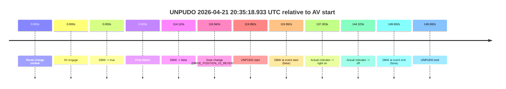
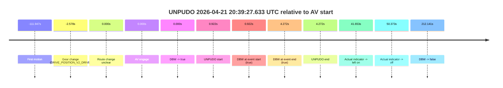
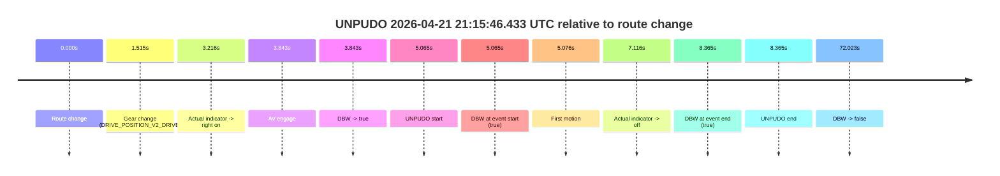
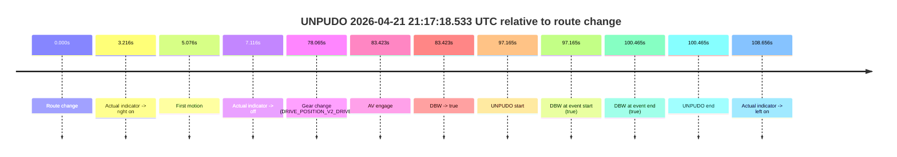

# Run Report: fme20012/2026-04-21--20-09-51--gen2-av-e0b70f5f-cb4d-4f8b-b0d7-af97a8834fb9

| Field | Value |
|---|---|
| Run ID | `fme20012/2026-04-21--20-09-51--gen2-av-e0b70f5f-cb4d-4f8b-b0d7-af97a8834fb9` |
| Date | `2026-04-21` |
| Model(s) | `eel-teal-outspoken` |
| Author | `zak` |
| Event count | `4` |

## unpudo 2026-04-21 20:35:18.933 UTC

| Field | Value |
|---|---|
| Model | `eel-teal-outspoken` |
| Author | `zak` |
| Run ID | `fme20012/2026-04-21--20-09-51--gen2-av-e0b70f5f-cb4d-4f8b-b0d7-af97a8834fb9` |
| Date | `2026-04-21` |
| Time (UTC) | `20:35:18.933` |
| Event type | `unpudo` |
| Disengagement type | `none observed` |
| Route change | `unclear` |
| Console | [run](https://console.sso.wayve.ai/run/fme20012/2026-04-21--20-09-51--gen2-av-e0b70f5f-cb4d-4f8b-b0d7-af97a8834fb9?id=&time-unixus=1776803718933296) |
| Foxglove | [segment](https://app.foxglove.dev/wayve-on-prem/p/prj_0dX18KZdVHg1fmmI/view?ds=foxglove-stream&ds.deviceName=fme20012&ds.start=2026-04-21T20%3A33%3A08.941328Z&ds.end=2026-04-21T20%3A35%3A58.633321Z&layoutId=lay_0e7VD4WIKDQGU73Y&time=2026-04-21T20%3A35%3A18.933296Z) |

### Event card: fail

- Fail: the credited unpudo does not stay AV-owned. The event window starts with DBW false, and the maneuver outcome lands outside a clean AV-owned segment.

| Event | Time (UTC) | Delta from AV start |
|---|---:|---:|
| Route change unclear | 2026-04-21 20:33:18.941 | `0.000s` |
| AV engage | 2026-04-21 20:33:18.941 | `0.000s` |
| DBW -> true | 2026-04-21 20:33:18.941 | `0.000s` |
| First motion | 2026-04-21 20:33:18.944 | `0.003s` |
| DBW -> false | 2026-04-21 20:35:13.051 | `114.110s` |
| Gear change (DRIVE_POSITION_V2_REVERSE) | 2026-04-21 20:35:15.883 | `116.942s` |
| UNPUDO start | 2026-04-21 20:35:18.933 | `119.992s` |
| DBW at event start (false) | 2026-04-21 20:35:18.933 | `119.992s` |
| Actual indicator -> right on | 2026-04-21 20:35:36.244 | `137.303s` |
| Actual indicator -> off | 2026-04-21 20:35:43.264 | `144.323s` |
| DBW at event end (false) | 2026-04-21 20:35:48.633 | `149.692s` |
| UNPUDO end | 2026-04-21 20:35:48.633 | `149.692s` |

| Metric | Value |
|---|---|
| Outcome | `fail` |
| Effective failure type | `not_av_owned` |
| Route change status | `unclear` |
| DBW at event start | `false` |
| DBW at event end | `false` |
| Predicted gear at AV start | `DRIVE_POSITION_V2_DRIVE` |
| Actual gear at AV start | `DRIVE_POSITION_V2_DRIVE` |
| Predicted gear at event start | `DRIVE_POSITION_V2_REVERSE` |
| Actual gear at event start | `DRIVE_POSITION_V2_REVERSE` |
| Planned indicator direction | `INDICATORS_STATE_V2_OFF` |
| Controller indicator direction | `INDICATORS_STATE_V2_OFF` |
| Actual indicator direction | `INDICATORS_STATE_V2_OFF` |
| Actual indicator at maneuver end | `INDICATORS_STATE_V2_OFF` |
| Driver accel help in AV | `false` |
| Driver accel help timestamp | `n/a` |
| Max accel pedal pct in AV | `0.0%` |
| Max brake pedal pct in AV | `10.6%` |
| Max speed mps in AV | `8.236` |
| Success timing baseline | `AV start` |
| Route -> AV | `n/a` |
| AV -> event start | `119.992s` |
| AV -> first motion | `0.003s` |
| Success baseline -> event start | `119.992s` |
| Success baseline -> first motion | `0.003s` |
| AV duration before disengagement | `114.110s` |
| Trajectory waypoint count | `38` |
| Driving-plan step count | `11` |

The scored portion starts from the AV-owned window, not from the pre-AV setup. Route-change search in the stopped pre-event segment was `unclear`, with the baseline therefore set to AV start. At the event anchor the model predicts `DRIVE_POSITION_V2_REVERSE` and the actual gear is `DRIVE_POSITION_V2_REVERSE`. The effective model outcome is `fail` because `not_av_owned.`

### Resolution

| Field | Value |
|---|---|
| Final outcome | `fail` |
| Do we agree with this label? | `yes` |
| Source disengagement type | `none observed` |
| Resolved effective failure type | `not_av_owned` |
| Confidence | `medium` |

## unpudo 2026-04-21 20:39:27.633 UTC

| Field | Value |
|---|---|
| Model | `eel-teal-outspoken` |
| Author | `zak` |
| Run ID | `fme20012/2026-04-21--20-09-51--gen2-av-e0b70f5f-cb4d-4f8b-b0d7-af97a8834fb9` |
| Date | `2026-04-21` |
| Time (UTC) | `20:39:27.633` |
| Event type | `unpudo` |
| Disengagement type | `none observed` |
| Route change | `unclear` |
| Console | [run](https://console.sso.wayve.ai/run/fme20012/2026-04-21--20-09-51--gen2-av-e0b70f5f-cb4d-4f8b-b0d7-af97a8834fb9?id=&time-unixus=1776803967633307) |
| Foxglove | [segment](https://app.foxglove.dev/wayve-on-prem/p/prj_0dX18KZdVHg1fmmI/view?ds=foxglove-stream&ds.deviceName=fme20012&ds.start=2026-04-21T20%3A39%3A14.133309Z&ds.end=2026-04-21T20%3A43%3A08.852349Z&layoutId=lay_0e7VD4WIKDQGU73Y&time=2026-04-21T20%3A39%3A27.633307Z) |

### Event card: pass

- Pass: AV owns the credited unpudo from route change through the official unpudo window, the gear state is aligned at the anchor, and the vehicle moves without driver accelerator help in AV.

| Event | Time (UTC) | Delta from AV start |
|---|---:|---:|
| First motion | 2026-04-21 20:37:34.764 | `-111.947s` |
| Gear change (DRIVE_POSITION_V2_DRIVE) | 2026-04-21 20:39:24.133 | `-2.578s` |
| Route change unclear | 2026-04-21 20:39:26.711 | `0.000s` |
| AV engage | 2026-04-21 20:39:26.711 | `0.000s` |
| DBW -> true | 2026-04-21 20:39:26.711 | `0.000s` |
| UNPUDO start | 2026-04-21 20:39:27.633 | `0.922s` |
| DBW at event start (true) | 2026-04-21 20:39:27.633 | `0.922s` |
| DBW at event end (true) | 2026-04-21 20:39:30.983 | `4.272s` |
| UNPUDO end | 2026-04-21 20:39:30.983 | `4.272s` |
| Actual indicator -> left on | 2026-04-21 20:40:08.364 | `41.653s` |
| Actual indicator -> off | 2026-04-21 20:40:17.084 | `50.373s` |
| DBW -> false | 2026-04-21 20:42:58.852 | `212.141s` |

| Metric | Value |
|---|---|
| Outcome | `pass` |
| Effective failure type | `none` |
| Route change status | `unclear` |
| DBW at event start | `true` |
| DBW at event end | `true` |
| Predicted gear at AV start | `DRIVE_POSITION_V2_DRIVE` |
| Actual gear at AV start | `DRIVE_POSITION_V2_DRIVE` |
| Predicted gear at event start | `DRIVE_POSITION_V2_DRIVE` |
| Actual gear at event start | `DRIVE_POSITION_V2_DRIVE` |
| Planned indicator direction | `INDICATORS_STATE_V2_RIGHT_ON` |
| Controller indicator direction | `INDICATORS_STATE_V2_RIGHT_ON` |
| Actual indicator direction | `INDICATORS_STATE_V2_OFF` |
| Actual indicator at maneuver end | `INDICATORS_STATE_V2_OFF` |
| Driver accel help in AV | `false` |
| Driver accel help timestamp | `n/a` |
| Max accel pedal pct in AV | `0.0%` |
| Max brake pedal pct in AV | `0.0%` |
| Max speed mps in AV | `5.053` |
| Success timing baseline | `AV start` |
| Route -> AV | `n/a` |
| AV -> event start | `0.922s` |
| AV -> first motion | `-111.947s` |
| Success baseline -> event start | `0.922s` |
| Success baseline -> first motion | `-111.947s` |
| AV duration before disengagement | `212.141s` |
| Trajectory waypoint count | `38` |
| Driving-plan step count | `11` |

The scored portion starts from the AV-owned window, not from the pre-AV setup. Route-change search in the stopped pre-event segment was `unclear`, with the baseline therefore set to AV start. At the event anchor the model predicts `DRIVE_POSITION_V2_DRIVE` and the actual gear is `DRIVE_POSITION_V2_DRIVE`. The effective model outcome is `pass` because `the credited unpudo stays AV-owned through the official unpudo window.`

### Resolution

| Field | Value |
|---|---|
| Final outcome | `pass` |
| Do we agree with this label? | `yes` |
| Source disengagement type | `none observed` |
| Resolved effective failure type | `none` |
| Confidence | `medium` |

## unpudo 2026-04-21 21:15:46.433 UTC

| Field | Value |
|---|---|
| Model | `eel-teal-outspoken` |
| Author | `zak` |
| Run ID | `fme20012/2026-04-21--20-09-51--gen2-av-e0b70f5f-cb4d-4f8b-b0d7-af97a8834fb9` |
| Date | `2026-04-21` |
| Time (UTC) | `21:15:46.433` |
| Event type | `unpudo` |
| Disengagement type | `none observed` |
| Route change | `found` |
| Console | [run](https://console.sso.wayve.ai/run/fme20012/2026-04-21--20-09-51--gen2-av-e0b70f5f-cb4d-4f8b-b0d7-af97a8834fb9?id=&time-unixus=1776806146433315) |
| Foxglove | [segment](https://app.foxglove.dev/wayve-on-prem/p/prj_0dX18KZdVHg1fmmI/view?ds=foxglove-stream&ds.deviceName=fme20012&ds.start=2026-04-21T21%3A15%3A31.368264Z&ds.end=2026-04-21T21%3A17%3A03.391373Z&layoutId=lay_0e7VD4WIKDQGU73Y&time=2026-04-21T21%3A15%3A46.433315Z) |

### Event card: pass

- Pass: AV owns the credited unpudo from route change through the official unpudo window, the gear state is aligned at the anchor, and the vehicle moves without driver accelerator help in AV.

| Event | Time (UTC) | Delta from route change |
|---|---:|---:|
| Route change | 2026-04-21 21:15:41.368 | `0.000s` |
| Gear change (DRIVE_POSITION_V2_DRIVE) | 2026-04-21 21:15:42.883 | `1.515s` |
| Actual indicator -> right on | 2026-04-21 21:15:44.584 | `3.216s` |
| AV engage | 2026-04-21 21:15:45.211 | `3.843s` |
| DBW -> true | 2026-04-21 21:15:45.211 | `3.843s` |
| UNPUDO start | 2026-04-21 21:15:46.433 | `5.065s` |
| DBW at event start (true) | 2026-04-21 21:15:46.433 | `5.065s` |
| First motion | 2026-04-21 21:15:46.444 | `5.076s` |
| Actual indicator -> off | 2026-04-21 21:15:48.484 | `7.116s` |
| DBW at event end (true) | 2026-04-21 21:15:49.733 | `8.365s` |
| UNPUDO end | 2026-04-21 21:15:49.733 | `8.365s` |
| DBW -> false | 2026-04-21 21:16:53.391 | `72.023s` |

| Metric | Value |
|---|---|
| Outcome | `pass` |
| Effective failure type | `none` |
| Route change status | `found` |
| DBW at event start | `true` |
| DBW at event end | `true` |
| Predicted gear at AV start | `DRIVE_POSITION_V2_DRIVE` |
| Actual gear at AV start | `DRIVE_POSITION_V2_DRIVE` |
| Predicted gear at event start | `DRIVE_POSITION_V2_DRIVE` |
| Actual gear at event start | `DRIVE_POSITION_V2_DRIVE` |
| Planned indicator direction | `INDICATORS_STATE_V2_RIGHT_ON` |
| Controller indicator direction | `INDICATORS_STATE_V2_RIGHT_ON` |
| Actual indicator direction | `INDICATORS_STATE_V2_RIGHT_ON` |
| Actual indicator at maneuver end | `INDICATORS_STATE_V2_OFF` |
| Driver accel help in AV | `false` |
| Driver accel help timestamp | `n/a` |
| Max accel pedal pct in AV | `0.0%` |
| Max brake pedal pct in AV | `8.0%` |
| Max speed mps in AV | `5.247` |
| Success timing baseline | `route change` |
| Route -> AV | `3.843s` |
| AV -> event start | `1.222s` |
| AV -> first motion | `1.233s` |
| Success baseline -> event start | `5.065s` |
| Success baseline -> first motion | `5.076s` |
| AV duration before disengagement | `68.180s` |
| Trajectory waypoint count | `38` |
| Driving-plan step count | `11` |

The scored portion starts from the AV-owned window, not from the pre-AV setup. Route-change search in the stopped pre-event segment was `found`, with the baseline therefore set to route change. At the event anchor the model predicts `DRIVE_POSITION_V2_DRIVE` and the actual gear is `DRIVE_POSITION_V2_DRIVE`. The effective model outcome is `pass` because `the credited unpudo stays AV-owned through the official unpudo window.`

### Resolution

| Field | Value |
|---|---|
| Final outcome | `pass` |
| Do we agree with this label? | `yes` |
| Source disengagement type | `none observed` |
| Resolved effective failure type | `none` |
| Confidence | `high` |

## unpudo 2026-04-21 21:17:18.533 UTC

| Field | Value |
|---|---|
| Model | `eel-teal-outspoken` |
| Author | `zak` |
| Run ID | `fme20012/2026-04-21--20-09-51--gen2-av-e0b70f5f-cb4d-4f8b-b0d7-af97a8834fb9` |
| Date | `2026-04-21` |
| Time (UTC) | `21:17:18.533` |
| Event type | `unpudo` |
| Disengagement type | `none observed` |
| Route change | `found` |
| Console | [run](https://console.sso.wayve.ai/run/fme20012/2026-04-21--20-09-51--gen2-av-e0b70f5f-cb4d-4f8b-b0d7-af97a8834fb9?id=&time-unixus=1776806238533305) |
| Foxglove | [segment](https://app.foxglove.dev/wayve-on-prem/p/prj_0dX18KZdVHg1fmmI/view?ds=foxglove-stream&ds.deviceName=fme20012&ds.start=2026-04-21T21%3A15%3A31.368264Z&ds.end=2026-04-21T21%3A17%3A31.833306Z&layoutId=lay_0e7VD4WIKDQGU73Y&time=2026-04-21T21%3A17%3A18.533305Z) |

### Event card: pass

- Pass: AV owns the credited unpudo from route change through the official unpudo window, the gear state is aligned at the anchor, and the vehicle moves without driver accelerator help in AV.

| Event | Time (UTC) | Delta from route change |
|---|---:|---:|
| Route change | 2026-04-21 21:15:41.368 | `0.000s` |
| Actual indicator -> right on | 2026-04-21 21:15:44.584 | `3.216s` |
| First motion | 2026-04-21 21:15:46.444 | `5.076s` |
| Actual indicator -> off | 2026-04-21 21:15:48.484 | `7.116s` |
| Gear change (DRIVE_POSITION_V2_DRIVE) | 2026-04-21 21:16:59.433 | `78.065s` |
| AV engage | 2026-04-21 21:17:04.791 | `83.423s` |
| DBW -> true | 2026-04-21 21:17:04.791 | `83.423s` |
| UNPUDO start | 2026-04-21 21:17:18.533 | `97.165s` |
| DBW at event start (true) | 2026-04-21 21:17:18.533 | `97.165s` |
| DBW at event end (true) | 2026-04-21 21:17:21.833 | `100.465s` |
| UNPUDO end | 2026-04-21 21:17:21.833 | `100.465s` |
| Actual indicator -> left on | 2026-04-21 21:17:30.024 | `108.656s` |

| Metric | Value |
|---|---|
| Outcome | `pass` |
| Effective failure type | `none` |
| Route change status | `found` |
| DBW at event start | `true` |
| DBW at event end | `true` |
| Predicted gear at AV start | `DRIVE_POSITION_V2_DRIVE` |
| Actual gear at AV start | `DRIVE_POSITION_V2_DRIVE` |
| Predicted gear at event start | `DRIVE_POSITION_V2_DRIVE` |
| Actual gear at event start | `DRIVE_POSITION_V2_DRIVE` |
| Planned indicator direction | `INDICATORS_STATE_V2_OFF` |
| Controller indicator direction | `INDICATORS_STATE_V2_OFF` |
| Actual indicator direction | `INDICATORS_STATE_V2_OFF` |
| Actual indicator at maneuver end | `INDICATORS_STATE_V2_OFF` |
| Driver accel help in AV | `false` |
| Driver accel help timestamp | `n/a` |
| Max accel pedal pct in AV | `0.0%` |
| Max brake pedal pct in AV | `8.0%` |
| Max speed mps in AV | `5.561` |
| Success timing baseline | `route change` |
| Route -> AV | `83.423s` |
| AV -> event start | `13.742s` |
| AV -> first motion | `-78.347s` |
| Success baseline -> event start | `97.165s` |
| Success baseline -> first motion | `5.076s` |
| AV duration before disengagement | `n/a` |
| Trajectory waypoint count | `38` |
| Driving-plan step count | `11` |

The scored portion starts from the AV-owned window, not from the pre-AV setup. Route-change search in the stopped pre-event segment was `found`, with the baseline therefore set to route change. At the event anchor the model predicts `DRIVE_POSITION_V2_DRIVE` and the actual gear is `DRIVE_POSITION_V2_DRIVE`. The effective model outcome is `pass` because `the credited unpudo stays AV-owned through the official unpudo window.`

### Resolution

| Field | Value |
|---|---|
| Final outcome | `pass` |
| Do we agree with this label? | `yes` |
| Source disengagement type | `none observed` |
| Resolved effective failure type | `none` |
| Confidence | `high` |
