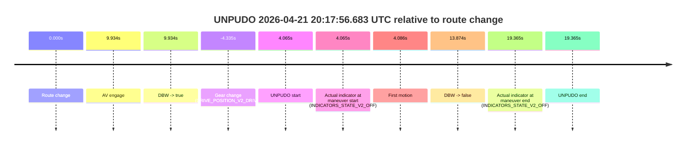
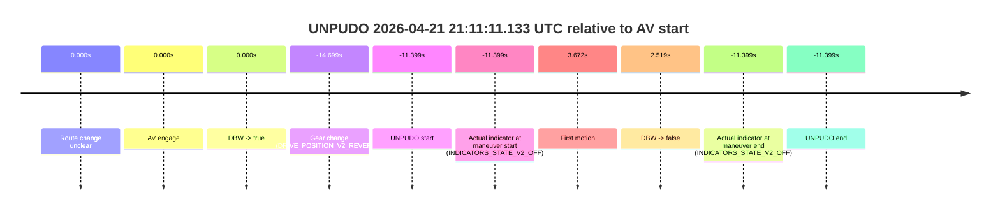
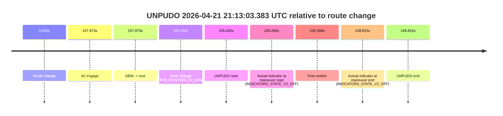

# Run Report: fme20012/2026-04-21--20-09-51--gen2-av-e0b70f5f-cb4d-4f8b-b0d7-af97a8834fb9

| Field | Value |
|---|---|
| Run ID | `fme20012/2026-04-21--20-09-51--gen2-av-e0b70f5f-cb4d-4f8b-b0d7-af97a8834fb9` |
| Date | `2026-04-21` |
| Model(s) | `pink-manta-ray-smooth` |
| Author | `guy.geva` |
| Event count | `3` |

## unpudo 2026-04-21 20:17:56.683 UTC

| Field | Value |
|---|---|
| Model | `pink-manta-ray-smooth` |
| Author | `guy.geva` |
| Run ID | `fme20012/2026-04-21--20-09-51--gen2-av-e0b70f5f-cb4d-4f8b-b0d7-af97a8834fb9` |
| Date | `2026-04-21` |
| Time (UTC) | `20:17:56.683` |
| Event type | `unpudo` |
| Disengagement type | `none observed` |
| Route change | `found` |
| Console | [run](https://console.sso.wayve.ai/run/fme20012/2026-04-21--20-09-51--gen2-av-e0b70f5f-cb4d-4f8b-b0d7-af97a8834fb9?id=&time-unixus=1776802676683293) |
| Foxglove | [segment](https://app.foxglove.dev/wayve-on-prem/p/prj_0dX18KZdVHg1fmmI/view?ds=foxglove-stream&ds.deviceName=fme20012&ds.start=2026-04-21T20%3A17%3A38.283300Z&ds.end=2026-04-21T20%3A18%3A21.983300Z&layoutId=lay_0e7VD4WIKDQGU73Y&time=2026-04-21T20%3A17%3A56.683293Z) |

### Event card: fail

- Fail: the credited unpudo does not stay AV-owned. The event window starts with DBW false, and the maneuver outcome lands outside a clean AV-owned segment.

| Event | Time (UTC) | Delta from route change |
|---|---:|---:|
| Route change | 2026-04-21 20:17:52.618 | `0.000s` |
| AV engage | 2026-04-21 20:18:02.551 | `9.934s` |
| DBW -> true | 2026-04-21 20:18:02.551 | `9.934s` |
| Gear change (DRIVE_POSITION_V2_DRIVE) | 2026-04-21 20:17:48.283 | `-4.335s` |
| UNPUDO start | 2026-04-21 20:17:56.683 | `4.065s` |
| Actual indicator at maneuver start (INDICATORS_STATE_V2_OFF) | 2026-04-21 20:17:56.683 | `4.065s` |
| First motion | 2026-04-21 20:17:56.704 | `4.086s` |
| DBW -> false | 2026-04-21 20:18:06.491 | `13.874s` |
| Actual indicator at maneuver end (INDICATORS_STATE_V2_OFF) | 2026-04-21 20:18:11.983 | `19.365s` |
| UNPUDO end | 2026-04-21 20:18:11.983 | `19.365s` |

| Metric | Value |
|---|---|
| Outcome | `fail` |
| Effective failure type | `completed_outside_av` |
| Route change status | `found` |
| DBW at event start | `false` |
| DBW at event end | `false` |
| Predicted gear at AV start | `DRIVE_POSITION_V2_DRIVE` |
| Actual gear at AV start | `DRIVE_POSITION_V2_DRIVE` |
| Predicted gear at event start | `DRIVE_POSITION_V2_DRIVE` |
| Actual gear at event start | `DRIVE_POSITION_V2_DRIVE` |
| Planned indicator direction | `INDICATORS_STATE_V2_RIGHT_ON` |
| Controller indicator direction | `INDICATORS_STATE_V2_RIGHT_ON` |
| Actual indicator direction | `INDICATORS_STATE_V2_OFF` |
| Actual indicator at maneuver end | `INDICATORS_STATE_V2_OFF` |
| Driver accel help in AV | `false` |
| Driver accel help timestamp | `n/a` |
| Max accel pedal pct in AV | `0.0%` |
| Max brake pedal pct in AV | `8.0%` |
| Max speed mps in AV | `0.000` |
| Route -> AV | `9.934s` |
| AV -> event start | `-5.869s` |
| AV -> first motion | `-5.847s` |
| AV duration before disengagement | `3.940s` |
| Trajectory waypoint count | `37` |
| Driving-plan step count | `11` |

The scored portion starts from the AV-owned window, not from the pre-AV setup. Route-change search in the stopped pre-event segment was `found`, with the baseline therefore set to route change. At the event anchor the model predicts `DRIVE_POSITION_V2_DRIVE` and the actual gear is `DRIVE_POSITION_V2_DRIVE`. The effective model outcome is `fail` because `completed_outside_av`.

### Resolution

| Field | Value |
|---|---|
| Final outcome | `fail` |
| Do we agree with this label? | `yes` |
| Source disengagement type | `none observed` |
| Resolved effective failure type | `completed_outside_av` |
| Confidence | `high` |

## unpudo 2026-04-21 21:11:11.133 UTC

| Field | Value |
|---|---|
| Model | `pink-manta-ray-smooth` |
| Author | `guy.geva` |
| Run ID | `fme20012/2026-04-21--20-09-51--gen2-av-e0b70f5f-cb4d-4f8b-b0d7-af97a8834fb9` |
| Date | `2026-04-21` |
| Time (UTC) | `21:11:11.133` |
| Event type | `unpudo` |
| Disengagement type | `none observed` |
| Route change | `unclear` |
| Console | [run](https://console.sso.wayve.ai/run/fme20012/2026-04-21--20-09-51--gen2-av-e0b70f5f-cb4d-4f8b-b0d7-af97a8834fb9?id=&time-unixus=1776805871133300) |
| Foxglove | [segment](https://app.foxglove.dev/wayve-on-prem/p/prj_0dX18KZdVHg1fmmI/view?ds=foxglove-stream&ds.deviceName=fme20012&ds.start=2026-04-21T21%3A10%3A57.833299Z&ds.end=2026-04-21T21%3A11%3A35.051644Z&layoutId=lay_0e7VD4WIKDQGU73Y&time=2026-04-21T21%3A11%3A11.133300Z) |

### Event card: non-av

- Non-AV: there is no AV-owned portion anywhere inside the detected unpudo timeline, so it is kept for coverage but excluded from model success / failure scoring.

| Event | Time (UTC) | Delta from AV start |
|---|---:|---:|
| Route change unclear | 2026-04-21 21:11:22.532 | `0.000s` |
| AV engage | 2026-04-21 21:11:22.532 | `0.000s` |
| DBW -> true | 2026-04-21 21:11:22.532 | `0.000s` |
| Gear change (DRIVE_POSITION_V2_REVERSE) | 2026-04-21 21:11:07.833 | `-14.699s` |
| UNPUDO start | 2026-04-21 21:11:11.133 | `-11.399s` |
| Actual indicator at maneuver start (INDICATORS_STATE_V2_OFF) | 2026-04-21 21:11:11.133 | `-11.399s` |
| First motion | 2026-04-21 21:11:26.204 | `3.672s` |
| DBW -> false | 2026-04-21 21:11:25.051 | `2.519s` |
| Actual indicator at maneuver end (INDICATORS_STATE_V2_OFF) | 2026-04-21 21:11:11.133 | `-11.399s` |
| UNPUDO end | 2026-04-21 21:11:11.133 | `-11.399s` |

| Metric | Value |
|---|---|
| Outcome | `non-av` |
| Effective failure type | `none` |
| Route change status | `unclear` |
| DBW at event start | `false` |
| DBW at event end | `false` |
| Predicted gear at AV start | `DRIVE_POSITION_V2_DRIVE` |
| Actual gear at AV start | `DRIVE_POSITION_V2_DRIVE` |
| Predicted gear at event start | `DRIVE_POSITION_V2_REVERSE` |
| Actual gear at event start | `DRIVE_POSITION_V2_REVERSE` |
| Planned indicator direction | `INDICATORS_STATE_V2_OFF` |
| Controller indicator direction | `INDICATORS_STATE_V2_OFF` |
| Actual indicator direction | `INDICATORS_STATE_V2_OFF` |
| Actual indicator at maneuver end | `INDICATORS_STATE_V2_OFF` |
| Driver accel help in AV | `false` |
| Driver accel help timestamp | `n/a` |
| Max accel pedal pct in AV | `0.0%` |
| Max brake pedal pct in AV | `0.0%` |
| Max speed mps in AV | `0.000` |
| Route -> AV | `n/a` |
| AV -> event start | `-11.399s` |
| AV -> first motion | `3.672s` |
| AV duration before disengagement | `2.519s` |
| Trajectory waypoint count | `36` |
| Driving-plan step count | `11` |

The scored portion starts from the AV-owned window, not from the pre-AV setup. Route-change search in the stopped pre-event segment was `unclear`, with the baseline therefore set to AV start. At the event anchor the model predicts `DRIVE_POSITION_V2_REVERSE` and the actual gear is `DRIVE_POSITION_V2_REVERSE`. The effective model outcome is `non-av` because `there is no AV-owned overlap inside the event timeline`.

### Resolution

| Field | Value |
|---|---|
| Final outcome | `non-av` |
| Do we agree with this label? | `yes` |
| Source disengagement type | `none observed` |
| Resolved effective failure type | `none` |
| Confidence | `medium` |

## unpudo 2026-04-21 21:13:03.383 UTC

| Field | Value |
|---|---|
| Model | `pink-manta-ray-smooth` |
| Author | `guy.geva` |
| Run ID | `fme20012/2026-04-21--20-09-51--gen2-av-e0b70f5f-cb4d-4f8b-b0d7-af97a8834fb9` |
| Date | `2026-04-21` |
| Time (UTC) | `21:13:03.383` |
| Event type | `unpudo` |
| Disengagement type | `none observed` |
| Route change | `found` |
| Console | [run](https://console.sso.wayve.ai/run/fme20012/2026-04-21--20-09-51--gen2-av-e0b70f5f-cb4d-4f8b-b0d7-af97a8834fb9?id=&time-unixus=1776805983383296) |
| Foxglove | [segment](https://app.foxglove.dev/wayve-on-prem/p/prj_0dX18KZdVHg1fmmI/view?ds=foxglove-stream&ds.deviceName=fme20012&ds.start=2026-04-21T21%3A11%3A08.118299Z&ds.end=2026-04-21T21%3A13%3A57.933320Z&layoutId=lay_0e7VD4WIKDQGU73Y&time=2026-04-21T21%3A13%3A03.383296Z) |

### Event card: non-av

- Non-AV: there is no AV-owned portion anywhere inside the detected unpudo timeline, so it is kept for coverage but excluded from model success / failure scoring.

| Event | Time (UTC) | Delta from route change |
|---|---:|---:|
| Route change | 2026-04-21 21:11:18.118 | `0.000s` |
| AV engage | 2026-04-21 21:13:56.091 | `157.973s` |
| DBW -> true | 2026-04-21 21:13:56.091 | `157.973s` |
| Gear change (DRIVE_POSITION_V2_DRIVE) | 2026-04-21 21:13:01.283 | `103.165s` |
| UNPUDO start | 2026-04-21 21:13:03.383 | `105.265s` |
| Actual indicator at maneuver start (INDICATORS_STATE_V2_OFF) | 2026-04-21 21:13:03.383 | `105.265s` |
| First motion | 2026-04-21 21:13:03.464 | `105.346s` |
| Actual indicator at maneuver end (INDICATORS_STATE_V2_OFF) | 2026-04-21 21:13:47.933 | `149.815s` |
| UNPUDO end | 2026-04-21 21:13:47.933 | `149.815s` |

| Metric | Value |
|---|---|
| Outcome | `non-av` |
| Effective failure type | `none` |
| Route change status | `found` |
| DBW at event start | `false` |
| DBW at event end | `false` |
| Predicted gear at AV start | `DRIVE_POSITION_V2_DRIVE` |
| Actual gear at AV start | `DRIVE_POSITION_V2_DRIVE` |
| Predicted gear at event start | `DRIVE_POSITION_V2_DRIVE` |
| Actual gear at event start | `DRIVE_POSITION_V2_DRIVE` |
| Planned indicator direction | `INDICATORS_STATE_V2_OFF` |
| Controller indicator direction | `INDICATORS_STATE_V2_OFF` |
| Actual indicator direction | `INDICATORS_STATE_V2_OFF` |
| Actual indicator at maneuver end | `INDICATORS_STATE_V2_OFF` |
| Driver accel help in AV | `false` |
| Driver accel help timestamp | `n/a` |
| Max accel pedal pct in AV | `0.0%` |
| Max brake pedal pct in AV | `0.0%` |
| Max speed mps in AV | `0.000` |
| Route -> AV | `157.973s` |
| AV -> event start | `-52.708s` |
| AV -> first motion | `-52.627s` |
| AV duration before disengagement | `n/a` |
| Trajectory waypoint count | `37` |
| Driving-plan step count | `11` |

The scored portion starts from the AV-owned window, not from the pre-AV setup. Route-change search in the stopped pre-event segment was `found`, with the baseline therefore set to route change. At the event anchor the model predicts `DRIVE_POSITION_V2_DRIVE` and the actual gear is `DRIVE_POSITION_V2_DRIVE`. The effective model outcome is `non-av` because `there is no AV-owned overlap inside the event timeline`.

### Resolution

| Field | Value |
|---|---|
| Final outcome | `non-av` |
| Do we agree with this label? | `yes` |
| Source disengagement type | `none observed` |
| Resolved effective failure type | `none` |
| Confidence | `high` |
