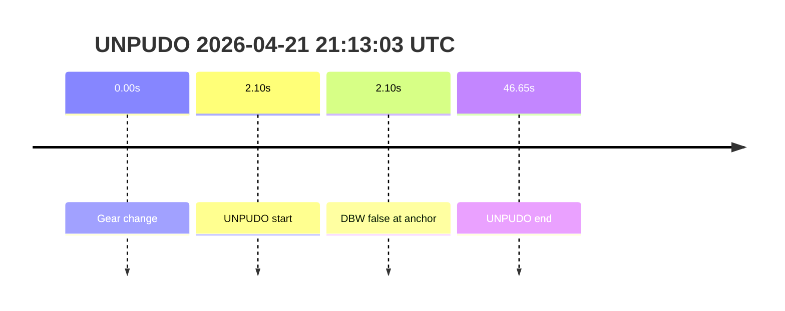
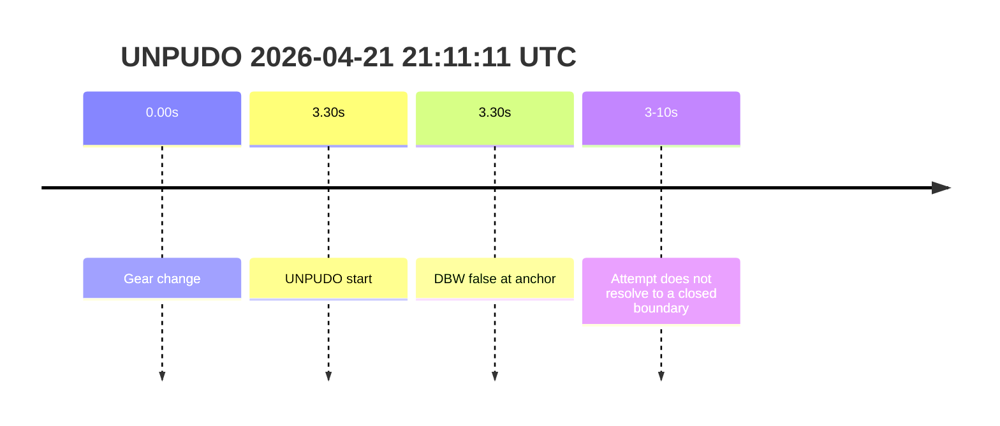

# Run Report: fme20012/2026-04-21--20-09-51--gen2-av-e0b70f5f-cb4d-4f8b-b0d7-af97a8834fb9

| Field | Value |
|---|---|
| Run ID | `fme20012/2026-04-21--20-09-51--gen2-av-e0b70f5f-cb4d-4f8b-b0d7-af97a8834fb9` |
| Date | `2026-04-21` |
| Model(s) | `pink-manta-ray-smooth` |

## unpudo 2026-04-21 21:13:03 UTC

| Field | Value |
|---|---|
| Model | `pink-manta-ray-smooth` |
| Author | `boris.indelman` |
| Run ID | `fme20012/2026-04-21--20-09-51--gen2-av-e0b70f5f-cb4d-4f8b-b0d7-af97a8834fb9` |
| Date | `2026-04-21` |
| Time (UTC) | `21:13:03` |
| Event type | `unpudo` |
| Disengagement type | `none` |
| Console | [run](https://console.sso.wayve.ai/run/fme20012/2026-04-21--20-09-51--gen2-av-e0b70f5f-cb4d-4f8b-b0d7-af97a8834fb9) |
| Foxglove | [segment](https://app.foxglove.dev/wayve-on-prem/p/prj_0dX18KZdVHg1fmmI/view?ds=foxglove-stream&ds.deviceName=fme20012&ds.end=2026-04-21T21%3A14%3A05.000Z&ds.start=2026-04-21T21%3A12%3A25.000Z&layoutId=lay_0e7VD4WIKDQGU73Y&time=2026-04-21T21%3A13%3A03.000Z) |

- Fail: the anchor is already outside DBW ownership. The nearest trajectory snapshot at the anchor is `False`, the event starts only `2.10s` after the gear change, and the row resolves much later without any disengagement label to indicate a clean AV-owned completion or a stable model-owned failure mode.

| Event | Time (UTC) | Delta from gear change |
|---|---:|---:|
| Gear change | 2026-04-21 21:13:01 | 0.00s |
| UNPUDO start | 2026-04-21 21:13:03 | 2.10s |
| UNPUDO end | 2026-04-21 21:13:47 | 46.65s |

| Metric | Value |
|---|---|
| Route change detected | `not confirmed in the available query budget` |
| Predicted gear at event start | `DRIVE_POSITION_V2_DRIVE` |
| Actual gear at event start | `DRIVE_POSITION_V2_DRIVE` |
| Trajectory DBW at anchor | `false` |
| Trajectory waypoint count | `36` |
| Driving plan step count | `11` |
| Event duration | `44.55s` |
| Gear change -> UNPUDO start | `2.10s` |
| UNPUDO start -> end | `44.55s` |
| Main disengagement flag | `0` |
| Gear-to-start disengagement | `0` |
| Before-gearchange-10s disengagement | `0` |

The model still looks to be setting up a drive-direction plan, but the anchor itself is not AV-owned. That means this event should not be counted as a success, and it also should not be over-interpreted as a pure controller defect. The more defensible read is an interrupted handover or non-DBW continuation.

## unpudo 2026-04-21 21:11:11 UTC

| Field | Value |
|---|---|
| Model | `pink-manta-ray-smooth` |
| Author | `boris.indelman` |
| Run ID | `fme20012/2026-04-21--20-09-51--gen2-av-e0b70f5f-cb4d-4f8b-b0d7-af97a8834fb9` |
| Date | `2026-04-21` |
| Time (UTC) | `21:11:11` |
| Event type | `unpudo` |
| Disengagement type | `none` |
| Console | [run](https://console.sso.wayve.ai/run/fme20012/2026-04-21--20-09-51--gen2-av-e0b70f5f-cb4d-4f8b-b0d7-af97a8834fb9) |
| Foxglove | [segment](https://app.foxglove.dev/wayve-on-prem/p/prj_0dX18KZdVHg1fmmI/view?ds=foxglove-stream&ds.deviceName=fme20012&ds.end=2026-04-21T21%3A11%3A55.000Z&ds.start=2026-04-21T21%3A10%3A35.000Z&layoutId=lay_0e7VD4WIKDQGU73Y&time=2026-04-21T21%3A11%3A11.000Z) |

- Fail: the UNPUDO row fires after only `3.30s` from gear change, but DBW is already `False` at the anchor and the event never materializes an end boundary. This is the clearest interrupted-attempt pattern in the requested sample.

| Event | Time (UTC) | Delta from gear change |
|---|---:|---:|
| Gear change | 2026-04-21 21:11:07 | 0.00s |
| UNPUDO start | 2026-04-21 21:11:11 | 3.30s |
| UNPUDO end | not detected | n/a |

| Metric | Value |
|---|---|
| Route change detected | `not confirmed in the available query budget` |
| Predicted gear at event start | `DRIVE_POSITION_V2_DRIVE` |
| Actual gear at event start | `DRIVE_POSITION_V2_DRIVE` |
| Trajectory DBW at anchor | `false` |
| Trajectory waypoint count | `36` |
| Driving plan step count | `11` |
| Event duration | `not materialized` |
| Gear change -> UNPUDO start | `3.30s` |
| Main disengagement flag | `0` |
| Gear-to-start disengagement | `0` |
| Before-gearchange-10s disengagement | `0` |

Because the anchor is already outside AV ownership and the event never closes, this should be read as a failed AV-owned UNPUDO attempt rather than a meaningful success. It is also weak evidence for a stable root-cause category beyond "handover / interrupted ownership", because the maneuver exits DBW before the event really develops.
