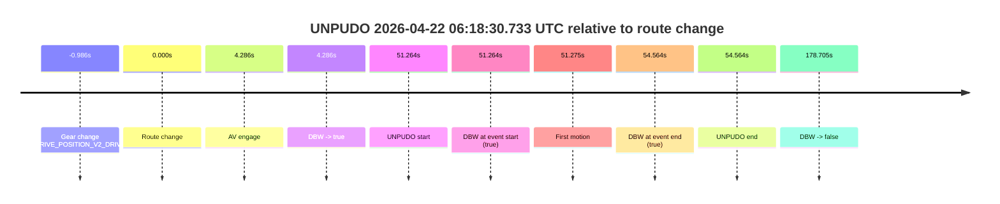
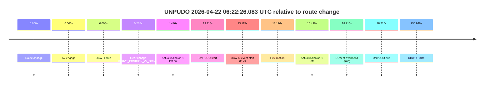
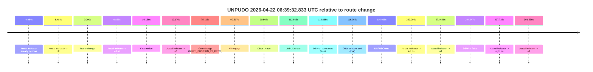
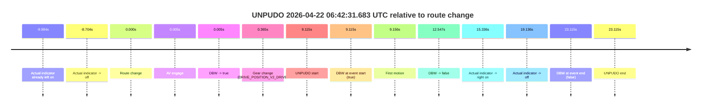
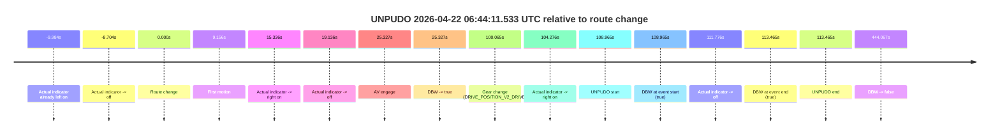
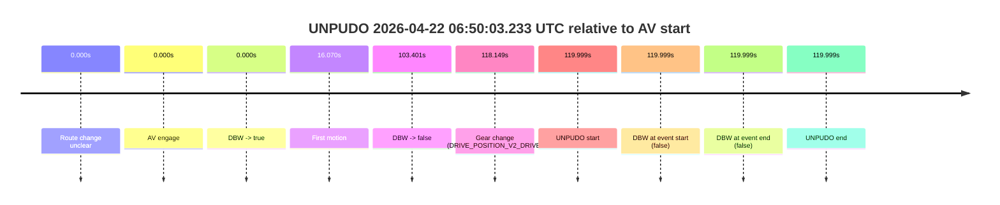

# Run Report: fme20012/2026-04-22--06-13-52--gen2-av-9d4af3b2-5820-4131-9962-82ddbe1b0720

| Field | Value |
|---|---|
| Run ID | `fme20012/2026-04-22--06-13-52--gen2-av-9d4af3b2-5820-4131-9962-82ddbe1b0720` |
| Date | `2026-04-22` |
| Model(s) | `pink-manta-ray-smooth` |
| Author | `guy.geva` |
| Event count | `6` |

## unpudo 2026-04-22 06:18:30.733 UTC

| Field | Value |
|---|---|
| Model | `pink-manta-ray-smooth` |
| Author | `guy.geva` |
| Run ID | `fme20012/2026-04-22--06-13-52--gen2-av-9d4af3b2-5820-4131-9962-82ddbe1b0720` |
| Date | `2026-04-22` |
| Time (UTC) | `06:18:30.733` |
| Event type | `unpudo` |
| Disengagement type | `none observed` |
| Route change | `found` |
| Console | [run](https://console.sso.wayve.ai/run/fme20012/2026-04-22--06-13-52--gen2-av-9d4af3b2-5820-4131-9962-82ddbe1b0720?id=&time-unixus=1776838710733314) |
| Foxglove | [segment](https://app.foxglove.dev/wayve-on-prem/p/prj_0dX18KZdVHg1fmmI/view?ds=foxglove-stream&ds.deviceName=fme20012&ds.start=2026-04-22T06%3A17%3A28.483296Z&ds.end=2026-04-22T06%3A20%3A48.174253Z&layoutId=lay_0e7VD4WIKDQGU73Y&time=2026-04-22T06%3A18%3A30.733314Z) |

### Event card: pass

- Pass: AV owns the credited unpudo from route change through the official unpudo window, the gear state is aligned at the anchor, and the vehicle moves without driver accelerator help in AV.

| Event | Time (UTC) | Delta from route change |
|---|---:|---:|
| Gear change (DRIVE_POSITION_V2_DRIVE) | 2026-04-22 06:17:38.483 | `-0.986s` |
| Route change | 2026-04-22 06:17:39.469 | `0.000s` |
| AV engage | 2026-04-22 06:17:43.755 | `4.286s` |
| DBW -> true | 2026-04-22 06:17:43.755 | `4.286s` |
| UNPUDO start | 2026-04-22 06:18:30.733 | `51.264s` |
| DBW at event start (true) | 2026-04-22 06:18:30.733 | `51.264s` |
| First motion | 2026-04-22 06:18:30.744 | `51.275s` |
| DBW at event end (true) | 2026-04-22 06:18:34.033 | `54.564s` |
| UNPUDO end | 2026-04-22 06:18:34.033 | `54.564s` |
| DBW -> false | 2026-04-22 06:20:38.174 | `178.705s` |

| Metric | Value |
|---|---|
| Outcome | `pass` |
| Effective failure type | `none` |
| Route change status | `found` |
| DBW at event start | `true` |
| DBW at event end | `true` |
| Predicted gear at AV start | `DRIVE_POSITION_V2_DRIVE` |
| Actual gear at AV start | `DRIVE_POSITION_V2_DRIVE` |
| Predicted gear at event start | `DRIVE_POSITION_V2_DRIVE` |
| Actual gear at event start | `DRIVE_POSITION_V2_DRIVE` |
| Planned indicator direction | `INDICATORS_STATE_V2_OFF` |
| Controller indicator direction | `INDICATORS_STATE_V2_OFF` |
| Actual indicator direction | `INDICATORS_STATE_V2_OFF` |
| Actual indicator at maneuver end | `INDICATORS_STATE_V2_OFF` |
| Driver accel help in AV | `false` |
| Driver accel help timestamp | `n/a` |
| Max accel pedal pct in AV | `0.0%` |
| Max brake pedal pct in AV | `9.1%` |
| Max speed mps in AV | `5.478` |
| Success timing baseline | `route change` |
| Route -> AV | `4.286s` |
| AV -> event start | `46.978s` |
| AV -> first motion | `46.989s` |
| Success baseline -> event start | `51.264s` |
| Success baseline -> first motion | `51.275s` |
| AV duration before disengagement | `174.419s` |
| Trajectory waypoint count | `38` |
| Driving-plan step count | `11` |

The scored portion starts from the AV-owned window, not from the pre-AV setup. Route-change search in the stopped pre-event segment was `found`, with the baseline therefore set to route change. At the event anchor the model predicts `DRIVE_POSITION_V2_DRIVE` and the actual gear is `DRIVE_POSITION_V2_DRIVE`. The effective model outcome is `pass` because `the credited unpudo stays AV-owned through the official unpudo window.`

### Resolution

| Field | Value |
|---|---|
| Final outcome | `pass` |
| Do we agree with this label? | `yes` |
| Source disengagement type | `none observed` |
| Resolved effective failure type | `none` |
| Confidence | `high` |

## unpudo 2026-04-22 06:22:26.083 UTC

| Field | Value |
|---|---|
| Model | `pink-manta-ray-smooth` |
| Author | `guy.geva` |
| Run ID | `fme20012/2026-04-22--06-13-52--gen2-av-9d4af3b2-5820-4131-9962-82ddbe1b0720` |
| Date | `2026-04-22` |
| Time (UTC) | `06:22:26.083` |
| Event type | `unpudo` |
| Disengagement type | `none observed` |
| Route change | `found` |
| Console | [run](https://console.sso.wayve.ai/run/fme20012/2026-04-22--06-13-52--gen2-av-9d4af3b2-5820-4131-9962-82ddbe1b0720?id=&time-unixus=1776838946083297) |
| Foxglove | [segment](https://app.foxglove.dev/wayve-on-prem/p/prj_0dX18KZdVHg1fmmI/view?ds=foxglove-stream&ds.deviceName=fme20012&ds.start=2026-04-22T06%3A22%3A02.968295Z&ds.end=2026-04-22T06%3A26%3A33.914179Z&layoutId=lay_0e7VD4WIKDQGU73Y&time=2026-04-22T06%3A22%3A26.083297Z) |

### Event card: pass

- Pass: AV owns the credited unpudo from route change through the official unpudo window, the gear state is aligned at the anchor, and the vehicle moves without driver accelerator help in AV.

| Event | Time (UTC) | Delta from route change |
|---|---:|---:|
| Route change | 2026-04-22 06:22:12.968 | `0.000s` |
| AV engage | 2026-04-22 06:22:12.973 | `0.005s` |
| DBW -> true | 2026-04-22 06:22:12.973 | `0.005s` |
| Gear change (DRIVE_POSITION_V2_DRIVE) | 2026-04-22 06:22:13.233 | `0.265s` |
| Actual indicator -> left on | 2026-04-22 06:22:17.444 | `4.476s` |
| UNPUDO start | 2026-04-22 06:22:26.083 | `13.115s` |
| DBW at event start (true) | 2026-04-22 06:22:26.083 | `13.115s` |
| First motion | 2026-04-22 06:22:26.164 | `13.196s` |
| Actual indicator -> off | 2026-04-22 06:22:29.464 | `16.496s` |
| DBW at event end (true) | 2026-04-22 06:22:31.683 | `18.715s` |
| UNPUDO end | 2026-04-22 06:22:31.683 | `18.715s` |
| DBW -> false | 2026-04-22 06:26:23.914 | `250.946s` |

| Metric | Value |
|---|---|
| Outcome | `pass` |
| Effective failure type | `none` |
| Route change status | `found` |
| DBW at event start | `true` |
| DBW at event end | `true` |
| Predicted gear at AV start | `DRIVE_POSITION_V2_PARK` |
| Actual gear at AV start | `DRIVE_POSITION_V2_PARK` |
| Predicted gear at event start | `DRIVE_POSITION_V2_DRIVE` |
| Actual gear at event start | `DRIVE_POSITION_V2_DRIVE` |
| Planned indicator direction | `INDICATORS_STATE_V2_RIGHT_ON` |
| Controller indicator direction | `INDICATORS_STATE_V2_RIGHT_ON` |
| Actual indicator direction | `INDICATORS_STATE_V2_LEFT_ON` |
| Actual indicator at maneuver end | `INDICATORS_STATE_V2_OFF` |
| Driver accel help in AV | `false` |
| Driver accel help timestamp | `n/a` |
| Max accel pedal pct in AV | `0.0%` |
| Max brake pedal pct in AV | `8.0%` |
| Max speed mps in AV | `4.275` |
| Success timing baseline | `route change` |
| Route -> AV | `0.005s` |
| AV -> event start | `13.110s` |
| AV -> first motion | `13.191s` |
| Success baseline -> event start | `13.115s` |
| Success baseline -> first motion | `13.196s` |
| AV duration before disengagement | `250.941s` |
| Trajectory waypoint count | `37` |
| Driving-plan step count | `11` |

The scored portion starts from the AV-owned window, not from the pre-AV setup. Route-change search in the stopped pre-event segment was `found`, with the baseline therefore set to route change. At the event anchor the model predicts `DRIVE_POSITION_V2_DRIVE` and the actual gear is `DRIVE_POSITION_V2_DRIVE`. The effective model outcome is `pass` because `the credited unpudo stays AV-owned through the official unpudo window.`

### Resolution

| Field | Value |
|---|---|
| Final outcome | `pass` |
| Do we agree with this label? | `yes` |
| Source disengagement type | `none observed` |
| Resolved effective failure type | `none` |
| Confidence | `high` |

## unpudo 2026-04-22 06:39:32.833 UTC

| Field | Value |
|---|---|
| Model | `pink-manta-ray-smooth` |
| Author | `guy.geva` |
| Run ID | `fme20012/2026-04-22--06-13-52--gen2-av-9d4af3b2-5820-4131-9962-82ddbe1b0720` |
| Date | `2026-04-22` |
| Time (UTC) | `06:39:32.833` |
| Event type | `unpudo` |
| Disengagement type | `none observed` |
| Route change | `found` |
| Console | [run](https://console.sso.wayve.ai/run/fme20012/2026-04-22--06-13-52--gen2-av-9d4af3b2-5820-4131-9962-82ddbe1b0720?id=&time-unixus=1776839972833298) |
| Foxglove | [segment](https://app.foxglove.dev/wayve-on-prem/p/prj_0dX18KZdVHg1fmmI/view?ds=foxglove-stream&ds.deviceName=fme20012&ds.start=2026-04-22T06%3A37%3A30.168314Z&ds.end=2026-04-22T06%3A42%3A45.115690Z&layoutId=lay_0e7VD4WIKDQGU73Y&time=2026-04-22T06%3A39%3A32.833298Z) |

### Event card: pass

- Pass: AV owns the credited unpudo from route change through the official unpudo window, the gear state is aligned at the anchor, and the vehicle moves without driver accelerator help in AV.

| Event | Time (UTC) | Delta from route change |
|---|---:|---:|
| Actual indicator already right on | 2026-04-22 06:37:30.184 | `-9.984s` |
| Actual indicator -> off | 2026-04-22 06:37:31.684 | `-8.484s` |
| Route change | 2026-04-22 06:37:40.168 | `0.000s` |
| Actual indicator -> left on | 2026-04-22 06:37:47.024 | `6.856s` |
| First motion | 2026-04-22 06:37:50.324 | `10.156s` |
| Actual indicator -> off | 2026-04-22 06:37:52.344 | `12.176s` |
| Gear change (DRIVE_POSITION_V2_DRIVE) | 2026-04-22 06:38:55.283 | `75.115s` |
| AV engage | 2026-04-22 06:39:10.674 | `90.507s` |
| DBW -> true | 2026-04-22 06:39:10.674 | `90.507s` |
| UNPUDO start | 2026-04-22 06:39:32.833 | `112.665s` |
| DBW at event start (true) | 2026-04-22 06:39:32.833 | `112.665s` |
| DBW at event end (true) | 2026-04-22 06:39:36.233 | `116.065s` |
| UNPUDO end | 2026-04-22 06:39:36.233 | `116.065s` |
| Actual indicator -> left on | 2026-04-22 06:42:02.264 | `262.096s` |
| Actual indicator -> off | 2026-04-22 06:42:13.864 | `273.696s` |
| DBW -> false | 2026-04-22 06:42:35.115 | `294.947s` |
| Actual indicator -> right on | 2026-04-22 06:42:37.904 | `297.736s` |
| Actual indicator -> off | 2026-04-22 06:42:41.704 | `301.536s` |

| Metric | Value |
|---|---|
| Outcome | `pass` |
| Effective failure type | `none` |
| Route change status | `found` |
| DBW at event start | `true` |
| DBW at event end | `true` |
| Predicted gear at AV start | `DRIVE_POSITION_V2_DRIVE` |
| Actual gear at AV start | `DRIVE_POSITION_V2_DRIVE` |
| Predicted gear at event start | `DRIVE_POSITION_V2_DRIVE` |
| Actual gear at event start | `DRIVE_POSITION_V2_DRIVE` |
| Planned indicator direction | `INDICATORS_STATE_V2_OFF` |
| Controller indicator direction | `INDICATORS_STATE_V2_OFF` |
| Actual indicator direction | `INDICATORS_STATE_V2_OFF` |
| Actual indicator at maneuver end | `INDICATORS_STATE_V2_OFF` |
| Driver accel help in AV | `false` |
| Driver accel help timestamp | `n/a` |
| Max accel pedal pct in AV | `0.0%` |
| Max brake pedal pct in AV | `8.0%` |
| Max speed mps in AV | `4.933` |
| Success timing baseline | `route change` |
| Route -> AV | `90.507s` |
| AV -> event start | `22.158s` |
| AV -> first motion | `-80.350s` |
| Success baseline -> event start | `112.665s` |
| Success baseline -> first motion | `10.156s` |
| AV duration before disengagement | `204.441s` |
| Trajectory waypoint count | `38` |
| Driving-plan step count | `11` |

The scored portion starts from the AV-owned window, not from the pre-AV setup. Route-change search in the stopped pre-event segment was `found`, with the baseline therefore set to route change. At the event anchor the model predicts `DRIVE_POSITION_V2_DRIVE` and the actual gear is `DRIVE_POSITION_V2_DRIVE`. The effective model outcome is `pass` because `the credited unpudo stays AV-owned through the official unpudo window.`

### Resolution

| Field | Value |
|---|---|
| Final outcome | `pass` |
| Do we agree with this label? | `yes` |
| Source disengagement type | `none observed` |
| Resolved effective failure type | `none` |
| Confidence | `high` |

## unpudo 2026-04-22 06:42:31.683 UTC

| Field | Value |
|---|---|
| Model | `pink-manta-ray-smooth` |
| Author | `guy.geva` |
| Run ID | `fme20012/2026-04-22--06-13-52--gen2-av-9d4af3b2-5820-4131-9962-82ddbe1b0720` |
| Date | `2026-04-22` |
| Time (UTC) | `06:42:31.683` |
| Event type | `unpudo` |
| Disengagement type | `none observed` |
| Route change | `found` |
| Console | [run](https://console.sso.wayve.ai/run/fme20012/2026-04-22--06-13-52--gen2-av-9d4af3b2-5820-4131-9962-82ddbe1b0720?id=&time-unixus=1776840151683311) |
| Foxglove | [segment](https://app.foxglove.dev/wayve-on-prem/p/prj_0dX18KZdVHg1fmmI/view?ds=foxglove-stream&ds.deviceName=fme20012&ds.start=2026-04-22T06%3A42%3A12.568435Z&ds.end=2026-04-22T06%3A42%3A55.683305Z&layoutId=lay_0e7VD4WIKDQGU73Y&time=2026-04-22T06%3A42%3A31.683311Z) |

### Event card: fail

- Fail: the credited unpudo does not stay AV-owned. The event window starts with DBW true, and the maneuver outcome lands outside a clean AV-owned segment.

| Event | Time (UTC) | Delta from route change |
|---|---:|---:|
| Actual indicator already left on | 2026-04-22 06:42:12.584 | `-9.984s` |
| Actual indicator -> off | 2026-04-22 06:42:13.864 | `-8.704s` |
| Route change | 2026-04-22 06:42:22.568 | `0.000s` |
| AV engage | 2026-04-22 06:42:22.573 | `0.005s` |
| DBW -> true | 2026-04-22 06:42:22.573 | `0.005s` |
| Gear change (DRIVE_POSITION_V2_DRIVE) | 2026-04-22 06:42:22.933 | `0.365s` |
| UNPUDO start | 2026-04-22 06:42:31.683 | `9.115s` |
| DBW at event start (true) | 2026-04-22 06:42:31.683 | `9.115s` |
| First motion | 2026-04-22 06:42:31.724 | `9.156s` |
| DBW -> false | 2026-04-22 06:42:35.115 | `12.547s` |
| Actual indicator -> right on | 2026-04-22 06:42:37.904 | `15.336s` |
| Actual indicator -> off | 2026-04-22 06:42:41.704 | `19.136s` |
| DBW at event end (false) | 2026-04-22 06:42:45.683 | `23.115s` |
| UNPUDO end | 2026-04-22 06:42:45.683 | `23.115s` |

| Metric | Value |
|---|---|
| Outcome | `fail` |
| Effective failure type | `driver_completed_maneuver` |
| Route change status | `found` |
| DBW at event start | `true` |
| DBW at event end | `false` |
| Predicted gear at AV start | `DRIVE_POSITION_V2_PARK` |
| Actual gear at AV start | `DRIVE_POSITION_V2_PARK` |
| Predicted gear at event start | `DRIVE_POSITION_V2_DRIVE` |
| Actual gear at event start | `DRIVE_POSITION_V2_DRIVE` |
| Planned indicator direction | `INDICATORS_STATE_V2_RIGHT_ON` |
| Controller indicator direction | `INDICATORS_STATE_V2_RIGHT_ON` |
| Actual indicator direction | `INDICATORS_STATE_V2_OFF` |
| Actual indicator at maneuver end | `INDICATORS_STATE_V2_OFF` |
| Driver accel help in AV | `false` |
| Driver accel help timestamp | `n/a` |
| Max accel pedal pct in AV | `0.0%` |
| Max brake pedal pct in AV | `8.0%` |
| Max speed mps in AV | `0.250` |
| Success timing baseline | `route change` |
| Route -> AV | `0.005s` |
| AV -> event start | `9.110s` |
| AV -> first motion | `9.151s` |
| Success baseline -> event start | `9.115s` |
| Success baseline -> first motion | `9.156s` |
| AV duration before disengagement | `12.542s` |
| Trajectory waypoint count | `37` |
| Driving-plan step count | `11` |

The scored portion starts from the AV-owned window, not from the pre-AV setup. Route-change search in the stopped pre-event segment was `found`, with the baseline therefore set to route change. At the event anchor the model predicts `DRIVE_POSITION_V2_DRIVE` and the actual gear is `DRIVE_POSITION_V2_DRIVE`. The effective model outcome is `fail` because `driver_completed_maneuver.`

### Resolution

| Field | Value |
|---|---|
| Final outcome | `fail` |
| Do we agree with this label? | `yes` |
| Source disengagement type | `none observed` |
| Resolved effective failure type | `driver_completed_maneuver` |
| Confidence | `high` |

## unpudo 2026-04-22 06:44:11.533 UTC

| Field | Value |
|---|---|
| Model | `pink-manta-ray-smooth` |
| Author | `guy.geva` |
| Run ID | `fme20012/2026-04-22--06-13-52--gen2-av-9d4af3b2-5820-4131-9962-82ddbe1b0720` |
| Date | `2026-04-22` |
| Time (UTC) | `06:44:11.533` |
| Event type | `unpudo` |
| Disengagement type | `none observed` |
| Route change | `found` |
| Console | [run](https://console.sso.wayve.ai/run/fme20012/2026-04-22--06-13-52--gen2-av-9d4af3b2-5820-4131-9962-82ddbe1b0720?id=&time-unixus=1776840251533305) |
| Foxglove | [segment](https://app.foxglove.dev/wayve-on-prem/p/prj_0dX18KZdVHg1fmmI/view?ds=foxglove-stream&ds.deviceName=fme20012&ds.start=2026-04-22T06%3A42%3A12.568435Z&ds.end=2026-04-22T06%3A49%3A56.635395Z&layoutId=lay_0e7VD4WIKDQGU73Y&time=2026-04-22T06%3A44%3A11.533305Z) |

### Event card: pass

- Pass: AV owns the credited unpudo from route change through the official unpudo window, the gear state is aligned at the anchor, and the vehicle moves without driver accelerator help in AV.

| Event | Time (UTC) | Delta from route change |
|---|---:|---:|
| Actual indicator already left on | 2026-04-22 06:42:12.584 | `-9.984s` |
| Actual indicator -> off | 2026-04-22 06:42:13.864 | `-8.704s` |
| Route change | 2026-04-22 06:42:22.568 | `0.000s` |
| First motion | 2026-04-22 06:42:31.724 | `9.156s` |
| Actual indicator -> right on | 2026-04-22 06:42:37.904 | `15.336s` |
| Actual indicator -> off | 2026-04-22 06:42:41.704 | `19.136s` |
| AV engage | 2026-04-22 06:42:47.894 | `25.327s` |
| DBW -> true | 2026-04-22 06:42:47.894 | `25.327s` |
| Gear change (DRIVE_POSITION_V2_DRIVE) | 2026-04-22 06:44:02.633 | `100.065s` |
| Actual indicator -> right on | 2026-04-22 06:44:06.844 | `104.276s` |
| UNPUDO start | 2026-04-22 06:44:11.533 | `108.965s` |
| DBW at event start (true) | 2026-04-22 06:44:11.533 | `108.965s` |
| Actual indicator -> off | 2026-04-22 06:44:14.344 | `111.776s` |
| DBW at event end (true) | 2026-04-22 06:44:16.033 | `113.465s` |
| UNPUDO end | 2026-04-22 06:44:16.033 | `113.465s` |
| DBW -> false | 2026-04-22 06:49:46.635 | `444.067s` |

| Metric | Value |
|---|---|
| Outcome | `pass` |
| Effective failure type | `none` |
| Route change status | `found` |
| DBW at event start | `true` |
| DBW at event end | `true` |
| Predicted gear at AV start | `DRIVE_POSITION_V2_DRIVE` |
| Actual gear at AV start | `DRIVE_POSITION_V2_DRIVE` |
| Predicted gear at event start | `DRIVE_POSITION_V2_DRIVE` |
| Actual gear at event start | `DRIVE_POSITION_V2_DRIVE` |
| Planned indicator direction | `INDICATORS_STATE_V2_LEFT_ON` |
| Controller indicator direction | `INDICATORS_STATE_V2_LEFT_ON` |
| Actual indicator direction | `INDICATORS_STATE_V2_RIGHT_ON` |
| Actual indicator at maneuver end | `INDICATORS_STATE_V2_OFF` |
| Driver accel help in AV | `false` |
| Driver accel help timestamp | `n/a` |
| Max accel pedal pct in AV | `0.0%` |
| Max brake pedal pct in AV | `8.1%` |
| Max speed mps in AV | `8.233` |
| Success timing baseline | `route change` |
| Route -> AV | `25.327s` |
| AV -> event start | `83.638s` |
| AV -> first motion | `-16.170s` |
| Success baseline -> event start | `108.965s` |
| Success baseline -> first motion | `9.156s` |
| AV duration before disengagement | `418.740s` |
| Trajectory waypoint count | `38` |
| Driving-plan step count | `11` |

The scored portion starts from the AV-owned window, not from the pre-AV setup. Route-change search in the stopped pre-event segment was `found`, with the baseline therefore set to route change. At the event anchor the model predicts `DRIVE_POSITION_V2_DRIVE` and the actual gear is `DRIVE_POSITION_V2_DRIVE`. The effective model outcome is `pass` because `the credited unpudo stays AV-owned through the official unpudo window.`

### Resolution

| Field | Value |
|---|---|
| Final outcome | `pass` |
| Do we agree with this label? | `yes` |
| Source disengagement type | `none observed` |
| Resolved effective failure type | `none` |
| Confidence | `high` |

## unpudo 2026-04-22 06:50:03.233 UTC

| Field | Value |
|---|---|
| Model | `pink-manta-ray-smooth` |
| Author | `guy.geva` |
| Run ID | `fme20012/2026-04-22--06-13-52--gen2-av-9d4af3b2-5820-4131-9962-82ddbe1b0720` |
| Date | `2026-04-22` |
| Time (UTC) | `06:50:03.233` |
| Event type | `unpudo` |
| Disengagement type | `none observed` |
| Route change | `unclear` |
| Console | [run](https://console.sso.wayve.ai/run/fme20012/2026-04-22--06-13-52--gen2-av-9d4af3b2-5820-4131-9962-82ddbe1b0720?id=&time-unixus=1776840603233316) |
| Foxglove | [segment](https://app.foxglove.dev/wayve-on-prem/p/prj_0dX18KZdVHg1fmmI/view?ds=foxglove-stream&ds.deviceName=fme20012&ds.start=2026-04-22T06%3A47%3A53.234514Z&ds.end=2026-04-22T06%3A50%3A13.233316Z&layoutId=lay_0e7VD4WIKDQGU73Y&time=2026-04-22T06%3A50%3A03.233316Z) |

### Event card: fail

- Fail: the credited unpudo does not stay AV-owned. The event window starts with DBW false, and the maneuver outcome lands outside a clean AV-owned segment.

| Event | Time (UTC) | Delta from AV start |
|---|---:|---:|
| Route change unclear | 2026-04-22 06:48:03.234 | `0.000s` |
| AV engage | 2026-04-22 06:48:03.234 | `0.000s` |
| DBW -> true | 2026-04-22 06:48:03.234 | `0.000s` |
| First motion | 2026-04-22 06:48:19.304 | `16.070s` |
| DBW -> false | 2026-04-22 06:49:46.635 | `103.401s` |
| Gear change (DRIVE_POSITION_V2_DRIVE) | 2026-04-22 06:50:01.383 | `118.149s` |
| UNPUDO start | 2026-04-22 06:50:03.233 | `119.999s` |
| DBW at event start (false) | 2026-04-22 06:50:03.233 | `119.999s` |
| DBW at event end (false) | 2026-04-22 06:50:03.233 | `119.999s` |
| UNPUDO end | 2026-04-22 06:50:03.233 | `119.999s` |

| Metric | Value |
|---|---|
| Outcome | `fail` |
| Effective failure type | `not_av_owned` |
| Route change status | `unclear` |
| DBW at event start | `false` |
| DBW at event end | `false` |
| Predicted gear at AV start | `DRIVE_POSITION_V2_DRIVE` |
| Actual gear at AV start | `DRIVE_POSITION_V2_DRIVE` |
| Predicted gear at event start | `DRIVE_POSITION_V2_DRIVE` |
| Actual gear at event start | `DRIVE_POSITION_V2_DRIVE` |
| Planned indicator direction | `INDICATORS_STATE_V2_OFF` |
| Controller indicator direction | `INDICATORS_STATE_V2_OFF` |
| Actual indicator direction | `INDICATORS_STATE_V2_OFF` |
| Actual indicator at maneuver end | `INDICATORS_STATE_V2_OFF` |
| Driver accel help in AV | `false` |
| Driver accel help timestamp | `n/a` |
| Max accel pedal pct in AV | `0.0%` |
| Max brake pedal pct in AV | `8.1%` |
| Max speed mps in AV | `6.611` |
| Success timing baseline | `AV start` |
| Route -> AV | `n/a` |
| AV -> event start | `119.999s` |
| AV -> first motion | `16.070s` |
| Success baseline -> event start | `119.999s` |
| Success baseline -> first motion | `16.070s` |
| AV duration before disengagement | `103.401s` |
| Trajectory waypoint count | `38` |
| Driving-plan step count | `11` |

The scored portion starts from the AV-owned window, not from the pre-AV setup. Route-change search in the stopped pre-event segment was `unclear`, with the baseline therefore set to AV start. At the event anchor the model predicts `DRIVE_POSITION_V2_DRIVE` and the actual gear is `DRIVE_POSITION_V2_DRIVE`. The effective model outcome is `fail` because `not_av_owned.`

### Resolution

| Field | Value |
|---|---|
| Final outcome | `fail` |
| Do we agree with this label? | `yes` |
| Source disengagement type | `none observed` |
| Resolved effective failure type | `not_av_owned` |
| Confidence | `medium` |
